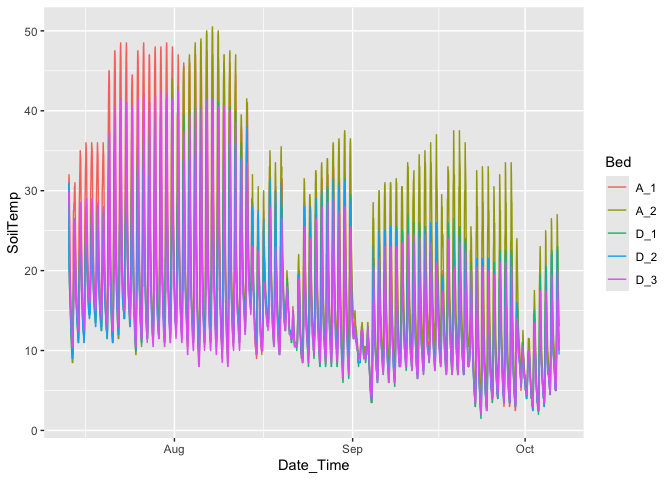

Having settled on suitable models for survival, this script explores adding climate data from the growing season to see if they add any explanatory power.

Notes:

1.  Used avg of all beds for temp 

2.  Changed negative soil moisture values –\> 0  


# Survival Analysis

## Libraries


``` r
# install.packages("multilevelmod")
library(tidyverse) 
```

```
## ── Attaching core tidyverse packages ──────────────────────── tidyverse 2.0.0 ──
## ✔ dplyr     1.1.4     ✔ readr     2.1.5
## ✔ forcats   1.0.0     ✔ stringr   1.5.1
## ✔ ggplot2   3.5.1     ✔ tibble    3.2.1
## ✔ lubridate 1.9.3     ✔ tidyr     1.3.1
## ✔ purrr     1.0.2     
## ── Conflicts ────────────────────────────────────────── tidyverse_conflicts() ──
## ✖ dplyr::filter() masks stats::filter()
## ✖ dplyr::lag()    masks stats::lag()
## ℹ Use the conflicted package (<http://conflicted.r-lib.org/>) to force all conflicts to become errors
```

``` r
library(magrittr)
```

```
## 
## Attaching package: 'magrittr'
## 
## The following object is masked from 'package:purrr':
## 
##     set_names
## 
## The following object is masked from 'package:tidyr':
## 
##     extract
```

``` r
library(ggrepel)
library(lme4)
```

```
## Loading required package: Matrix
## 
## Attaching package: 'Matrix'
## 
## The following objects are masked from 'package:tidyr':
## 
##     expand, pack, unpack
```

``` r
library(ggdist)
library(tidymodels)
```

```
## ── Attaching packages ────────────────────────────────────── tidymodels 1.2.0 ──
## ✔ broom        1.0.7     ✔ rsample      1.2.1
## ✔ dials        1.3.0     ✔ tune         1.2.1
## ✔ infer        1.0.7     ✔ workflows    1.1.4
## ✔ modeldata    1.4.0     ✔ workflowsets 1.1.0
## ✔ parsnip      1.2.1     ✔ yardstick    1.3.1
## ✔ recipes      1.1.0     
## ── Conflicts ───────────────────────────────────────── tidymodels_conflicts() ──
## ✖ scales::discard()     masks purrr::discard()
## ✖ Matrix::expand()      masks tidyr::expand()
## ✖ magrittr::extract()   masks tidyr::extract()
## ✖ dplyr::filter()       masks stats::filter()
## ✖ recipes::fixed()      masks stringr::fixed()
## ✖ dplyr::lag()          masks stats::lag()
## ✖ Matrix::pack()        masks tidyr::pack()
## ✖ magrittr::set_names() masks purrr::set_names()
## ✖ yardstick::spec()     masks readr::spec()
## ✖ recipes::step()       masks stats::step()
## ✖ Matrix::unpack()      masks tidyr::unpack()
## ✖ recipes::update()     masks Matrix::update(), stats::update()
## • Dig deeper into tidy modeling with R at https://www.tmwr.org
```

``` r
library(multilevelmod)
library(broom.mixed)
library(modelr)
```

```
## 
## Attaching package: 'modelr'
## 
## The following objects are masked from 'package:yardstick':
## 
##     mae, mape, rmse
## 
## The following object is masked from 'package:broom':
## 
##     bootstrap
```

``` r
library(furrr)
```

```
## Loading required package: future
```

``` r
library(zoo)
```

```
## 
## Attaching package: 'zoo'
## 
## The following objects are masked from 'package:base':
## 
##     as.Date, as.Date.numeric
```

``` r
tidymodels_prefer()
options(mc.cores = parallel::detectCores())
```

## Read in the plant data


``` r
wl2_surv <- read_csv("../output/WL2_Traits/WL2_Mortality_2023.csv")
```

```
## Rows: 1573 Columns: 11
## ── Column specification ────────────────────────────────────────────────────────
## Delimiter: ","
## chr (8): block, BedLoc, bed, bed.col, Genotype, pop, death.date, survey.notes
## dbl (3): bed.row, mf, rep
## 
## ℹ Use `spec()` to retrieve the full column specification for this data.
## ℹ Specify the column types or set `show_col_types = FALSE` to quiet this message.
```

As weeks


``` r
wl2_surv %>% filter(is.na(death.date),!is.na(survey.notes)) #no plants that seemed to disappear 
```

```
## # A tibble: 209 × 11
##    block BedLoc bed   bed.row bed.col Genotype  pop      mf   rep death.date
##    <chr> <chr>  <chr>   <dbl> <chr>   <chr>     <chr> <dbl> <dbl> <chr>     
##  1 A     A_5_A  A           5 A       CP2_5_1   CP2       5     1 <NA>      
##  2 A     A_6_A  A           6 A       CC_5_3    CC        5     3 <NA>      
##  3 A     A_9_B  A           9 B       SQ2_8_9   SQ2       8     9 <NA>      
##  4 A     A_15_B A          15 B       YO11_7_9  YO11      7     9 <NA>      
##  5 A     A_19_A A          19 A       SQ3_4_7   SQ3       4     7 <NA>      
##  6 A     A_20_B A          20 B       WL2_8_9   WL2       8     9 <NA>      
##  7 A     A_21_A A          21 A       CP2_6_5   CP2       6     5 <NA>      
##  8 A     A_21_B A          21 B       LVTR1_8_4 LVTR1     8     4 <NA>      
##  9 A     A_23_B A          23 B       WL1_4_11  WL1       4    11 <NA>      
## 10 A     A_25_A A          25 A       YO4_1_13  YO4       1    13 <NA>      
## # ℹ 199 more rows
## # ℹ 1 more variable: survey.notes <chr>
```

``` r
wl2_surv %>% filter(Genotype=="YO7_4_2")
```

```
## # A tibble: 1 × 11
##   block BedLoc bed   bed.row bed.col Genotype pop      mf   rep death.date
##   <chr> <chr>  <chr>   <dbl> <chr>   <chr>    <chr> <dbl> <dbl> <chr>     
## 1 A     A_18_D A          18 D       YO7_4_2  YO7       4     2 7/11/23   
## # ℹ 1 more variable: survey.notes <chr>
```

``` r
wl2_surv_dates <- wl2_surv %>%  
  rename(parent.pop = pop) %>%
  mutate(parent.pop= str_replace(parent.pop, "Y08", "YO8")) %>% 
  mutate(parent.pop= str_replace(parent.pop, "Y04", "YO4")) %>% 
  filter(!is.na(parent.pop)) %>% 
  mutate(planting.date="7/19/23", #could try to make this more specific to when certain blocks were planted 
         last_fup_date=if_else(is.na(death.date), "10/27/23", death.date)) %>%  #need this to calculate survival times
  mutate(planting.date=mdy(planting.date), last_fup_date=mdy(last_fup_date)) %>% #convert to date objects
  mutate(os_weeks=as.duration(planting.date %--% last_fup_date) / dweeks(1), #observed number of weeks
         status=if_else(is.na(death.date), 0, 1)) %>% #0=censured (alive in this case), 1=dead
  filter(os_weeks > 0) %>% #there is one case of a plant that was dead at planting, so just removed it since this is survival post- transplanting
  select(-survey.notes)
head(wl2_surv_dates)
```

```
## # A tibble: 6 × 14
##   block BedLoc bed   bed.row bed.col Genotype  parent.pop    mf   rep death.date
##   <chr> <chr>  <chr>   <dbl> <chr>   <chr>     <chr>      <dbl> <dbl> <chr>     
## 1 A     A_1_A  A           1 A       TM2_6_11  TM2            6    11 <NA>      
## 2 A     A_1_B  A           1 B       LVTR1_7_1 LVTR1          7     1 7/26/23   
## 3 A     A_2_A  A           2 A       SQ2_6_14  SQ2            6    14 7/26/23   
## 4 A     A_2_B  A           2 B       YO8_8_3   YO8            8     3 7/26/23   
## 5 A     A_3_A  A           3 A       CC_2_3    CC             2     3 <NA>      
## 6 A     A_3_B  A           3 B       YO11_5_14 YO11           5    14 7/26/23   
## # ℹ 4 more variables: planting.date <date>, last_fup_date <date>,
## #   os_weeks <dbl>, status <dbl>
```

``` r
unique(wl2_surv_dates$os_weeks) %>% sort()
```

```
##  [1]  1.00000  2.00000  3.00000  4.00000  5.00000  6.00000  7.00000  8.00000
##  [9]  9.00000 10.00000 12.28571 13.28571 14.28571
```

``` r
unique(wl2_surv_dates$death.date)
```

```
##  [1] NA         "7/26/23"  "8/9/23"   "8/2/23"   "10/13/23" "9/20/23" 
##  [7] "10/20/23" "8/30/23"  "8/16/23"  "9/13/23"  "9/6/23"   "9/27/23" 
## [13] "10/27/23" "8/23/23"
```

## Read in soil temp


``` r
temp <- read_csv("../input/WL2_Data/WL2_2022_2023_iButton_Data_Corrected.csv") %>%
  select(-`...3`) %>%
  mutate(Date_Time = mdy_hm(Date_Time)) %>%
  filter(Date_Time > ymd("2023-07-06"))
```

```
## New names:
## Rows: 14253 Columns: 4
## ── Column specification
## ──────────────────────────────────────────────────────── Delimiter: "," chr
## (3): Bed, Date_Time, ...3 dbl (1): SoilTemp
## ℹ Use `spec()` to retrieve the full column specification for this data. ℹ
## Specify the column types or set `show_col_types = FALSE` to quiet this message.
## • `` -> `...3`
```

``` r
head(temp)
```

```
## # A tibble: 6 × 3
##   Bed   Date_Time           SoilTemp
##   <chr> <dttm>                 <dbl>
## 1 A_1   2023-07-13 14:46:00     27.5
## 2 A_1   2023-07-13 15:46:00     32  
## 3 A_1   2023-07-13 16:46:00     31.5
## 4 A_1   2023-07-13 17:46:00     28.5
## 5 A_1   2023-07-13 18:46:00     25  
## 6 A_1   2023-07-13 19:46:00     22
```

``` r
skimr::skim(temp)
```


Table: Data summary

|                         |      |
|:------------------------|:-----|
|Name                     |temp  |
|Number of rows           |10240 |
|Number of columns        |3     |
|_______________________  |      |
|Column type frequency:   |      |
|character                |1     |
|numeric                  |1     |
|POSIXct                  |1     |
|________________________ |      |
|Group variables          |None  |


**Variable type: character**

|skim_variable | n_missing| complete_rate| min| max| empty| n_unique| whitespace|
|:-------------|---------:|-------------:|---:|---:|-----:|--------:|----------:|
|Bed           |         0|             1|   3|   3|     0|        5|          0|


**Variable type: numeric**

|skim_variable | n_missing| complete_rate|  mean|   sd|  p0|  p25| p50| p75| p100|hist  |
|:-------------|---------:|-------------:|-----:|----:|---:|----:|---:|---:|----:|:-----|
|SoilTemp      |         0|             1| 16.22| 8.51| 1.5| 10.5|  14|  20| 50.5|▅▇▂▁▁ |


**Variable type: POSIXct**

|skim_variable | n_missing| complete_rate|min                 |max                 |median              | n_unique|
|:-------------|---------:|-------------:|:-------------------|:-------------------|:-------------------|--------:|
|Date_Time     |         0|             1|2023-07-13 14:40:00 |2023-10-06 21:48:00 |2023-08-25 06:14:00 |    10240|


``` r
temp %>% ggplot(aes(x=Date_Time, y = SoilTemp, color= Bed)) + 
  geom_line()
```

<!-- -->

``` r
#Take a closer look
temp %>% mutate(month = month(Date_Time)) %>%
  filter(Date_Time > ymd("2023-07-17"), Date_Time <= ymd("2023-07-24")) %>%
  ggplot(aes(x=Date_Time, y = SoilTemp, color= Bed, lty = Bed)) + 
  geom_line() +
  scale_color_brewer(type="qual", palette = "Accent")
```

<!-- -->

``` r
temp %>% mutate(month = month(Date_Time)) %>%
  filter(month==7) %>%
  ggplot(aes(x=Date_Time, y = SoilTemp)) + 
  geom_line() +
  scale_color_brewer(type="qual", palette = "Accent") +
  facet_wrap(~Bed)
```

<!-- -->

Not sure how to deal with the differences here since we don't have something in every bed or block. Average across beds. 


``` r
temp_summary <- temp %>%
  group_by(Date_Time) %>% 
  summarise(AvgSoilTemp=mean(SoilTemp, na.rm=TRUE)) %>% #avg across beds 
  mutate(Date=as.Date(Date_Time)) %>%
  filter(Date != min(Date), Date != max(Date)) %>% # trim ragged ends
  group_by(Date) %>% #summmarise hourly data by date
  summarize(
    min_temp_d = min(AvgSoilTemp),
    max_temp_d = max(AvgSoilTemp),
    mean_temp_d = mean(AvgSoilTemp),
    diurnal_temp_d = max_temp_d - min_temp_d
  ) %>%
  mutate(
    across(ends_with("temp_d"), \(x) rollmean(x, k = 7, align = "right", fill = NA), .names="{.col}1_7"),
    across(ends_with("temp_d"), \(x) rollmean(x, k = 13, align = "right", fill = NA), .names="{.col}1_13"), # 13 so I can get the first survey date
    across(ends_with("1_7"), \(x) dplyr::lag(x, 6), .names = "{.col}_13") 
  ) %>%
  rename_with(\(x) str_replace(x, "1_7_13", "6_13"))

temp_summary
```

```
## # A tibble: 84 × 17
##    Date       min_temp_d max_temp_d mean_temp_d diurnal_temp_d min_temp_d1_7
##    <date>          <dbl>      <dbl>       <dbl>          <dbl>         <dbl>
##  1 2023-07-14        8.5       31          17.0           22.5          NA  
##  2 2023-07-15       11         35          18.7           24            NA  
##  3 2023-07-16       11         36          19.1           25            NA  
##  4 2023-07-17       14         36          20.5           22            NA  
##  5 2023-07-18       13         36          19.8           23            NA  
##  6 2023-07-19       12.5       36          19.3           23.5          NA  
##  7 2023-07-20       11.5       45          21.4           33.5          11.6
##  8 2023-07-21       11         47.5        21.9           36.5          12  
##  9 2023-07-22       11.5       48.5        22.5           37            12.1
## 10 2023-07-23       14         48.5        23.3           34.5          12.5
## # ℹ 74 more rows
## # ℹ 11 more variables: max_temp_d1_7 <dbl>, mean_temp_d1_7 <dbl>,
## #   diurnal_temp_d1_7 <dbl>, min_temp_d1_13 <dbl>, max_temp_d1_13 <dbl>,
## #   mean_temp_d1_13 <dbl>, diurnal_temp_d1_13 <dbl>, min_temp_d6_13 <dbl>,
## #   max_temp_d6_13 <dbl>, mean_temp_d6_13 <dbl>, diurnal_temp_d6_13 <dbl>
```

## Read in soil moisture


``` r
moisture <- read_csv("../input/WL2_Data/WL2_2023_Bed_C_Soil_Moisture_Corrected.csv") %>%
  mutate(Date_Time = mdy_hm(Date_Time)) 
```

```
## Rows: 2209 Columns: 6
## ── Column specification ────────────────────────────────────────────────────────
## Delimiter: ","
## chr (1): Date_Time
## dbl (5): Port_1, Port_2, Port_3, Port_4, Port_5
## 
## ℹ Use `spec()` to retrieve the full column specification for this data.
## ℹ Specify the column types or set `show_col_types = FALSE` to quiet this message.
```

``` r
head(moisture)
```

```
## # A tibble: 6 × 6
##   Date_Time           Port_1 Port_2 Port_3 Port_4 Port_5
##   <dttm>               <dbl>  <dbl>  <dbl>  <dbl>  <dbl>
## 1 2023-07-20 12:00:00  0.071  0.141  0.075  0.055  0.092
## 2 2023-07-20 13:00:00  0.07   0.142  0.077  0.056  0.094
## 3 2023-07-20 14:00:00  0.074  0.142  0.079  0.056  0.094
## 4 2023-07-20 15:00:00  0.076  0.141  0.081  0.055  0.094
## 5 2023-07-20 16:00:00  0.077  0.14   0.082  0.054  0.093
## 6 2023-07-20 17:00:00  0.077  0.136  0.081  0.052  0.091
```

``` r
skimr::skim(moisture)
```


Table: Data summary

|                         |         |
|:------------------------|:--------|
|Name                     |moisture |
|Number of rows           |2209     |
|Number of columns        |6        |
|_______________________  |         |
|Column type frequency:   |         |
|numeric                  |5        |
|POSIXct                  |1        |
|________________________ |         |
|Group variables          |None     |


**Variable type: numeric**

|skim_variable | n_missing| complete_rate| mean|   sd|    p0|  p25|  p50|  p75| p100|hist  |
|:-------------|---------:|-------------:|----:|----:|-----:|----:|----:|----:|----:|:-----|
|Port_1        |         0|             1| 0.13| 0.06|  0.00| 0.08| 0.14| 0.17| 0.36|▆▇▇▁▁ |
|Port_2        |         0|             1| 0.10| 0.02|  0.04| 0.08| 0.10| 0.12| 0.16|▁▅▇▇▂ |
|Port_3        |         0|             1| 0.10| 0.05| -0.01| 0.06| 0.12| 0.13| 0.21|▃▂▅▇▁ |
|Port_4        |         0|             1| 0.03| 0.02| -0.05| 0.01| 0.03| 0.05| 0.10|▁▂▇▆▁ |
|Port_5        |         0|             1| 0.08| 0.04| -0.03| 0.06| 0.09| 0.10| 0.19|▂▂▇▅▁ |


**Variable type: POSIXct**

|skim_variable | n_missing| complete_rate|min                 |max                 |median              | n_unique|
|:-------------|---------:|-------------:|:-------------------|:-------------------|:-------------------|--------:|
|Date_Time     |         0|             1|2023-07-20 12:00:00 |2023-10-20 12:00:00 |2023-09-04 12:00:00 |     2209|


``` r
moisture %>% pivot_longer(-Date_Time) %>%
  ggplot(aes(x=Date_Time, y = value, color= name)) + 
  geom_line()
```

<!-- -->

Will average across the ports


``` r
moisture_summary <- moisture %>%
  mutate(Port_1=if_else(Port_1<0, 0, Port_1),
         Port_2=if_else(Port_2<0, 0, Port_2),
         Port_3=if_else(Port_3<0, 0, Port_3),
         Port_4=if_else(Port_4<0, 0, Port_4),
         Port_5=if_else(Port_5<0, 0, Port_5)) %>%  #convert negatives to zeros (negatives result from extremely dry soil --> air pockets)
  rowwise() %>%
  mutate(s_moisture = mean(c_across(-Date_Time)) ) %>%
  select(Date_Time, s_moisture) %>%
  mutate(Date=as.Date(Date_Time)) %>%
  group_by(Date) %>%
  summarize(
    mean_moisture_d = mean(s_moisture)
  ) %>%
  mutate(
    s_moisture_1_7 = rollmean(mean_moisture_d, k = 7, align = "right", fill = "extend"),
    s_moisture_1_14 = rollmean(mean_moisture_d, k = 13, align = "right", fill = "extend"),
    s_moisture_7_14 = dplyr::lag(s_moisture_1_7, 7)
  )

moisture_summary
```

```
## # A tibble: 93 × 5
##    Date       mean_moisture_d s_moisture_1_7 s_moisture_1_14 s_moisture_7_14
##    <date>               <dbl>          <dbl>           <dbl>           <dbl>
##  1 2023-07-20          0.0853         0.0714          0.0571         NA     
##  2 2023-07-21          0.0809         0.0714          0.0571         NA     
##  3 2023-07-22          0.0754         0.0714          0.0571         NA     
##  4 2023-07-23          0.0711         0.0714          0.0571         NA     
##  5 2023-07-24          0.0668         0.0714          0.0571         NA     
##  6 2023-07-25          0.0622         0.0714          0.0571         NA     
##  7 2023-07-26          0.0581         0.0714          0.0571         NA     
##  8 2023-07-27          0.0537         0.0669          0.0571          0.0714
##  9 2023-07-28          0.0484         0.0622          0.0571          0.0714
## 10 2023-07-29          0.0436         0.0577          0.0571          0.0714
## # ℹ 83 more rows
```

## Reformat to be one row per plant per week


``` r
wl2_ind <- wl2_surv_dates %>% 
  complete(Genotype, last_fup_date) %>%
  group_by(Genotype) %>%
  mutate(across(c(-status, -last_fup_date, -os_weeks, -planting.date), \(x) ifelse(all(is.na(unique(x))), NA,unique(na.omit(x))))) %>%
  mutate(planting.date = unique(na.omit(planting.date)),
         os_weeks=as.duration(planting.date %--% last_fup_date) / dweeks(1),
           dead = ifelse((is.na(death.date) | mdy(death.date) > last_fup_date), 0, 1)) %>% # 0 is alive, 1 is dead
  filter(cumsum(dead) < 2) %>% # you can't die more than once
  ungroup() 

wl2_ind %>% select(Genotype, last_fup_date, os_weeks, dead)
```

```
## # A tibble: 9,837 × 4
##    Genotype last_fup_date os_weeks  dead
##    <chr>    <date>           <dbl> <dbl>
##  1 BH_1_1   2023-07-26           1     0
##  2 BH_1_1   2023-08-02           2     0
##  3 BH_1_1   2023-08-09           3     0
##  4 BH_1_1   2023-08-16           4     0
##  5 BH_1_1   2023-08-23           5     0
##  6 BH_1_1   2023-08-30           6     0
##  7 BH_1_1   2023-09-06           7     0
##  8 BH_1_1   2023-09-13           8     0
##  9 BH_1_1   2023-09-20           9     0
## 10 BH_1_1   2023-09-27          10     0
## # ℹ 9,827 more rows
```

Split data into establishment and survival data sets. (We will only use survival set for this analysis)


``` r
wl2_ind_estab <- wl2_ind %>% filter(os_weeks <= 3) %>%
  # compute status at week 3 for each plant
  group_by(Genotype) %>%
  summarize(dead=max(dead),
            across(c(block, bed, parent.pop, mf, contains("GD")), unique))

wl2_ind_surv <- wl2_ind %>% filter(os_weeks > 3) %>%
  mutate(os_weeks_f = factor(os_weeks))

wl2_estab_means <- wl2_ind_estab %>% # summary for plotting
  group_by(parent.pop) %>%
  summarize(survivorship = 1-mean(dead))

wl2_surv_means <- wl2_ind_surv %>%
  group_by(parent.pop, os_weeks) %>%
  summarize(survivorship = 1-mean(dead))
```

```
## `summarise()` has grouped output by 'parent.pop'. You can override using the
## `.groups` argument.
```

## add climate data


``` r
wl2_ind_surv_climate <- wl2_ind_surv %>% 
  left_join(temp_summary, by = c("last_fup_date" = "Date")) %>%
  left_join(moisture_summary, by = c("last_fup_date" = "Date"))
```

## Temp analysis

check basic model forms


``` r
# Note: StdDev due to mf within parent.pop is essentially zero, so I am omitting this.
glmer.model <- 
  linear_reg() %>%
  set_engine("glmer", family = binomial)

temp_wflow <- workflow() %>%
  add_variables(outcomes = dead, predictors = c(parent.pop, block, os_weeks, contains("temp_d")  )) 

temp_fits <- tibble(wflow=list(

  # The best base model from earlier analyses:
  pop.weeks.block ={temp_wflow %>% 
      add_model(glmer.model, formula = dead ~ os_weeks + (1|parent.pop) + (1|block))},
  
  min.temp.1.7 ={temp_wflow %>% 
      add_model(glmer.model, formula = dead ~ min_temp_d1_7 + os_weeks + (1|parent.pop) + (1|block))},
  
  mean.temp.1.7 ={temp_wflow %>% 
      add_model(glmer.model, formula = dead ~ mean_temp_d1_7 + os_weeks + (1|parent.pop) + (1|block))},
  
  max.temp.1.7 ={temp_wflow %>% 
      add_model(glmer.model, formula = dead ~ max_temp_d1_7 + os_weeks + (1|parent.pop) + (1|block))},
  
  diurnal.temp.1.7 ={temp_wflow %>% 
      add_model(glmer.model, formula = dead ~ diurnal_temp_d1_7 + os_weeks + (1|parent.pop) + (1|block))},
  
  min.temp.1.13 ={temp_wflow %>% 
      add_model(glmer.model, formula = dead ~ min_temp_d1_13 + os_weeks + (1|parent.pop) + (1|block))},
  
  mean.temp.1.13 ={temp_wflow %>% 
      add_model(glmer.model, formula = dead ~ mean_temp_d1_13 + os_weeks + (1|parent.pop) + (1|block))},
  
  max.temp.1.13 ={temp_wflow %>% 
      add_model(glmer.model, formula = dead ~ max_temp_d1_13 + os_weeks + (1|parent.pop) + (1|block))},
  
  diurnal.temp.1.13 ={temp_wflow %>% 
      add_model(glmer.model, formula = dead ~ diurnal_temp_d1_13 + os_weeks + (1|parent.pop) + (1|block))},
  
  min.temp.6.13 ={temp_wflow %>% 
      add_model(glmer.model, formula = dead ~ min_temp_d6_13 + os_weeks + (1|parent.pop) + (1|block))},
  
  mean.temp.6.13 ={temp_wflow %>% 
      add_model(glmer.model, formula = dead ~ mean_temp_d6_13 + os_weeks + (1|parent.pop) + (1|block))},
  
  max.temp.6.13 ={temp_wflow %>% 
      add_model(glmer.model, formula = dead ~ max_temp_d6_13 + os_weeks + (1|parent.pop) + (1|block))},
  
  diurnal.temp.6.13 ={temp_wflow %>% 
      add_model(glmer.model, formula = dead ~ diurnal_temp_d6_13 + os_weeks + (1|parent.pop) + (1|block))}
),
name=names(wflow)
) %>% 
  select(name,wflow)
temp_fits
```

```
## # A tibble: 13 × 2
##    name              wflow       
##    <chr>             <named list>
##  1 pop.weeks.block   <workflow>  
##  2 min.temp.1.7      <workflow>  
##  3 mean.temp.1.7     <workflow>  
##  4 max.temp.1.7      <workflow>  
##  5 diurnal.temp.1.7  <workflow>  
##  6 min.temp.1.13     <workflow>  
##  7 mean.temp.1.13    <workflow>  
##  8 max.temp.1.13     <workflow>  
##  9 diurnal.temp.1.13 <workflow>  
## 10 min.temp.6.13     <workflow>  
## 11 mean.temp.6.13    <workflow>  
## 12 max.temp.6.13     <workflow>  
## 13 diurnal.temp.6.13 <workflow>
```


``` r
system.time(
  temp_fits <- temp_fits %>%
  mutate(fit = map(wflow, fit, data = drop_na(wl2_ind_surv_climate, contains("temp_d")), .progress = TRUE))
)
```

```
## ■■■■■■■■ 23% | ETA: 5s

 ■■■■■■■■■■ 31% | ETA: 5s

 ■■■■■■■■■■■■■ 38% | ETA: 4s
## ■■■■■■■■■■■■■■■ 46% | ETA: 4s

 ■■■■■■■■■■■■■■■■■ 54% | ETA: 3s
## ■■■■■■■■■■■■■■■■■■■ 62% | ETA: 3s

 ■■■■■■■■■■■■■■■■■■■■■■ 69% | ETA: 2s
## ■■■■■■■■■■■■■■■■■■■■■■■■ 77% | ETA: 2s

 ■■■■■■■■■■■■■■■■■■■■■■■■■■ 85% | ETA: 1s
## ■■■■■■■■■■■■■■■■■■■■■■■■■■■■■ 92% | ETA: 1s
```

```
##    user  system elapsed 
##   6.867   0.271   7.162
```


``` r
temp_fits %>% pull(fit)
```

```
## $pop.weeks.block
## ══ Workflow [trained] ══════════════════════════════════════════════════════════
## Preprocessor: Variables
## Model: linear_reg()
## 
## ── Preprocessor ────────────────────────────────────────────────────────────────
## Outcomes: dead
## Predictors: c(parent.pop, block, os_weeks, contains("temp_d"))
## 
## ── Model ───────────────────────────────────────────────────────────────────────
## Generalized linear mixed model fit by maximum likelihood (Laplace
##   Approximation) [glmerMod]
##  Family: binomial  ( logit )
## Formula: dead ~ os_weeks + (1 | parent.pop) + (1 | block)
##    Data: data
##      AIC      BIC   logLik deviance df.resid 
## 1245.188 1271.022 -618.594 1237.188     4711 
## Random effects:
##  Groups     Name        Std.Dev.
##  parent.pop (Intercept) 0.6420  
##  block      (Intercept) 0.2763  
## Number of obs: 4715, groups:  parent.pop, 22; block, 13
## Fixed Effects:
## (Intercept)     os_weeks  
##     -4.5373       0.1393  
## 
## $min.temp.1.7
## ══ Workflow [trained] ══════════════════════════════════════════════════════════
## Preprocessor: Variables
## Model: linear_reg()
## 
## ── Preprocessor ────────────────────────────────────────────────────────────────
## Outcomes: dead
## Predictors: c(parent.pop, block, os_weeks, contains("temp_d"))
## 
## ── Model ───────────────────────────────────────────────────────────────────────
## Generalized linear mixed model fit by maximum likelihood (Laplace
##   Approximation) [glmerMod]
##  Family: binomial  ( logit )
## Formula: dead ~ min_temp_d1_7 + os_weeks + (1 | parent.pop) + (1 | block)
##    Data: data
##       AIC       BIC    logLik  deviance  df.resid 
## 1240.8645 1273.1570 -615.4322 1230.8645      4710 
## Random effects:
##  Groups     Name        Std.Dev.
##  parent.pop (Intercept) 0.6402  
##  block      (Intercept) 0.2753  
## Number of obs: 4715, groups:  parent.pop, 22; block, 13
## Fixed Effects:
##   (Intercept)  min_temp_d1_7       os_weeks  
##       -7.3608         0.1988         0.3250  
## 
## $mean.temp.1.7
## ══ Workflow [trained] ══════════════════════════════════════════════════════════
## Preprocessor: Variables
## Model: linear_reg()
## 
## ── Preprocessor ────────────────────────────────────────────────────────────────
## Outcomes: dead
## Predictors: c(parent.pop, block, os_weeks, contains("temp_d"))
## 
## ── Model ───────────────────────────────────────────────────────────────────────
## Generalized linear mixed model fit by maximum likelihood (Laplace
##   Approximation) [glmerMod]
##  Family: binomial  ( logit )
## Formula: dead ~ mean_temp_d1_7 + os_weeks + (1 | parent.pop) + (1 | block)
##    Data: data
##       AIC       BIC    logLik  deviance  df.resid 
## 1239.4990 1271.7915 -614.7495 1229.4990      4710 
## Random effects:
##  Groups     Name        Std.Dev.
##  parent.pop (Intercept) 0.6412  
##  block      (Intercept) 0.2757  
## Number of obs: 4715, groups:  parent.pop, 22; block, 13
## Fixed Effects:
##    (Intercept)  mean_temp_d1_7        os_weeks  
##        -8.4253          0.1744          0.3234  
## 
## $max.temp.1.7
## ══ Workflow [trained] ══════════════════════════════════════════════════════════
## Preprocessor: Variables
## Model: linear_reg()
## 
## ── Preprocessor ────────────────────────────────────────────────────────────────
## Outcomes: dead
## Predictors: c(parent.pop, block, os_weeks, contains("temp_d"))
## 
## ── Model ───────────────────────────────────────────────────────────────────────
## Generalized linear mixed model fit by maximum likelihood (Laplace
##   Approximation) [glmerMod]
##  Family: binomial  ( logit )
## Formula: dead ~ max_temp_d1_7 + os_weeks + (1 | parent.pop) + (1 | block)
##    Data: data
##      AIC      BIC   logLik deviance df.resid 
## 1241.586 1273.879 -615.793 1231.586     4710 
## Random effects:
##  Groups     Name        Std.Dev.
##  parent.pop (Intercept) 0.6436  
##  block      (Intercept) 0.2773  
## Number of obs: 4715, groups:  parent.pop, 22; block, 13
## Fixed Effects:
##   (Intercept)  max_temp_d1_7       os_weeks  
##      -6.24308        0.05067        0.14881  
## 
## $diurnal.temp.1.7
## ══ Workflow [trained] ══════════════════════════════════════════════════════════
## Preprocessor: Variables
## Model: linear_reg()
## 
## ── Preprocessor ────────────────────────────────────────────────────────────────
## Outcomes: dead
## Predictors: c(parent.pop, block, os_weeks, contains("temp_d"))
## 
## ── Model ───────────────────────────────────────────────────────────────────────
## Generalized linear mixed model fit by maximum likelihood (Laplace
##   Approximation) [glmerMod]
##  Family: binomial  ( logit )
## Formula: dead ~ diurnal_temp_d1_7 + os_weeks + (1 | parent.pop) + (1 |  
##     block)
##    Data: data
##       AIC       BIC    logLik  deviance  df.resid 
## 1244.0837 1276.3763 -617.0419 1234.0837      4710 
## Random effects:
##  Groups     Name        Std.Dev.
##  parent.pop (Intercept) 0.6437  
##  block      (Intercept) 0.2773  
## Number of obs: 4715, groups:  parent.pop, 22; block, 13
## Fixed Effects:
##       (Intercept)  diurnal_temp_d1_7           os_weeks  
##           -5.2810             0.0385             0.1098  
## 
## $min.temp.1.13
## ══ Workflow [trained] ══════════════════════════════════════════════════════════
## Preprocessor: Variables
## Model: linear_reg()
## 
## ── Preprocessor ────────────────────────────────────────────────────────────────
## Outcomes: dead
## Predictors: c(parent.pop, block, os_weeks, contains("temp_d"))
## 
## ── Model ───────────────────────────────────────────────────────────────────────
## Generalized linear mixed model fit by maximum likelihood (Laplace
##   Approximation) [glmerMod]
##  Family: binomial  ( logit )
## Formula: dead ~ min_temp_d1_13 + os_weeks + (1 | parent.pop) + (1 | block)
##    Data: data
##       AIC       BIC    logLik  deviance  df.resid 
## 1235.2655 1267.5580 -612.6327 1225.2655      4710 
## Random effects:
##  Groups     Name        Std.Dev.
##  parent.pop (Intercept) 0.6415  
##  block      (Intercept) 0.2767  
## Number of obs: 4715, groups:  parent.pop, 22; block, 13
## Fixed Effects:
##    (Intercept)  min_temp_d1_13        os_weeks  
##       -10.6747          0.4501          0.4994  
## 
## $mean.temp.1.13
## ══ Workflow [trained] ══════════════════════════════════════════════════════════
## Preprocessor: Variables
## Model: linear_reg()
## 
## ── Preprocessor ────────────────────────────────────────────────────────────────
## Outcomes: dead
## Predictors: c(parent.pop, block, os_weeks, contains("temp_d"))
## 
## ── Model ───────────────────────────────────────────────────────────────────────
## Generalized linear mixed model fit by maximum likelihood (Laplace
##   Approximation) [glmerMod]
##  Family: binomial  ( logit )
## Formula: dead ~ mean_temp_d1_13 + os_weeks + (1 | parent.pop) + (1 | block)
##    Data: data
##       AIC       BIC    logLik  deviance  df.resid 
## 1240.4584 1272.7509 -615.2292 1230.4584      4710 
## Random effects:
##  Groups     Name        Std.Dev.
##  parent.pop (Intercept) 0.6460  
##  block      (Intercept) 0.2787  
## Number of obs: 4715, groups:  parent.pop, 22; block, 13
## Fixed Effects:
##     (Intercept)  mean_temp_d1_13         os_weeks  
##         -9.7588           0.2249           0.3881  
## 
## $max.temp.1.13
## ══ Workflow [trained] ══════════════════════════════════════════════════════════
## Preprocessor: Variables
## Model: linear_reg()
## 
## ── Preprocessor ────────────────────────────────────────────────────────────────
## Outcomes: dead
## Predictors: c(parent.pop, block, os_weeks, contains("temp_d"))
## 
## ── Model ───────────────────────────────────────────────────────────────────────
## Generalized linear mixed model fit by maximum likelihood (Laplace
##   Approximation) [glmerMod]
##  Family: binomial  ( logit )
## Formula: dead ~ max_temp_d1_13 + os_weeks + (1 | parent.pop) + (1 | block)
##    Data: data
##       AIC       BIC    logLik  deviance  df.resid 
## 1244.3971 1276.6897 -617.1986 1234.3971      4710 
## Random effects:
##  Groups     Name        Std.Dev.
##  parent.pop (Intercept) 0.6455  
##  block      (Intercept) 0.2784  
## Number of obs: 4715, groups:  parent.pop, 22; block, 13
## Fixed Effects:
##    (Intercept)  max_temp_d1_13        os_weeks  
##        -5.8840          0.0346          0.1681  
## 
## $diurnal.temp.1.13
## ══ Workflow [trained] ══════════════════════════════════════════════════════════
## Preprocessor: Variables
## Model: linear_reg()
## 
## ── Preprocessor ────────────────────────────────────────────────────────────────
## Outcomes: dead
## Predictors: c(parent.pop, block, os_weeks, contains("temp_d"))
## 
## ── Model ───────────────────────────────────────────────────────────────────────
## Generalized linear mixed model fit by maximum likelihood (Laplace
##   Approximation) [glmerMod]
##  Family: binomial  ( logit )
## Formula: dead ~ diurnal_temp_d1_13 + os_weeks + (1 | parent.pop) + (1 |  
##     block)
##    Data: data
##      AIC      BIC   logLik deviance df.resid 
## 1245.948 1278.241 -617.974 1235.948     4710 
## Random effects:
##  Groups     Name        Std.Dev.
##  parent.pop (Intercept) 0.6443  
##  block      (Intercept) 0.2777  
## Number of obs: 4715, groups:  parent.pop, 22; block, 13
## Fixed Effects:
##        (Intercept)  diurnal_temp_d1_13            os_weeks  
##           -5.11642             0.02294             0.13992  
## 
## $min.temp.6.13
## ══ Workflow [trained] ══════════════════════════════════════════════════════════
## Preprocessor: Variables
## Model: linear_reg()
## 
## ── Preprocessor ────────────────────────────────────────────────────────────────
## Outcomes: dead
## Predictors: c(parent.pop, block, os_weeks, contains("temp_d"))
## 
## ── Model ───────────────────────────────────────────────────────────────────────
## Generalized linear mixed model fit by maximum likelihood (Laplace
##   Approximation) [glmerMod]
##  Family: binomial  ( logit )
## Formula: dead ~ min_temp_d6_13 + os_weeks + (1 | parent.pop) + (1 | block)
##    Data: data
##       AIC       BIC    logLik  deviance  df.resid 
## 1241.1972 1273.4897 -615.5986 1231.1972      4710 
## Random effects:
##  Groups     Name        Std.Dev.
##  parent.pop (Intercept) 0.6446  
##  block      (Intercept) 0.2786  
## Number of obs: 4715, groups:  parent.pop, 22; block, 13
## Fixed Effects:
##    (Intercept)  min_temp_d6_13        os_weeks  
##        -7.5214          0.2383          0.2783  
## 
## $mean.temp.6.13
## ══ Workflow [trained] ══════════════════════════════════════════════════════════
## Preprocessor: Variables
## Model: linear_reg()
## 
## ── Preprocessor ────────────────────────────────────────────────────────────────
## Outcomes: dead
## Predictors: c(parent.pop, block, os_weeks, contains("temp_d"))
## 
## ── Model ───────────────────────────────────────────────────────────────────────
## Generalized linear mixed model fit by maximum likelihood (Laplace
##   Approximation) [glmerMod]
##  Family: binomial  ( logit )
## Formula: dead ~ mean_temp_d6_13 + os_weeks + (1 | parent.pop) + (1 | block)
##    Data: data
##       AIC       BIC    logLik  deviance  df.resid 
## 1246.6557 1278.9482 -618.3279 1236.6557      4710 
## Random effects:
##  Groups     Name        Std.Dev.
##  parent.pop (Intercept) 0.6435  
##  block      (Intercept) 0.2772  
## Number of obs: 4715, groups:  parent.pop, 22; block, 13
## Fixed Effects:
##     (Intercept)  mean_temp_d6_13         os_weeks  
##        -5.46358          0.03827          0.18330  
## 
## $max.temp.6.13
## ══ Workflow [trained] ══════════════════════════════════════════════════════════
## Preprocessor: Variables
## Model: linear_reg()
## 
## ── Preprocessor ────────────────────────────────────────────────────────────────
## Outcomes: dead
## Predictors: c(parent.pop, block, os_weeks, contains("temp_d"))
## 
## ── Model ───────────────────────────────────────────────────────────────────────
## Generalized linear mixed model fit by maximum likelihood (Laplace
##   Approximation) [glmerMod]
##  Family: binomial  ( logit )
## Formula: dead ~ max_temp_d6_13 + os_weeks + (1 | parent.pop) + (1 | block)
##    Data: data
##       AIC       BIC    logLik  deviance  df.resid 
## 1246.9493 1279.2418 -618.4747 1236.9493      4710 
## Random effects:
##  Groups     Name        Std.Dev.
##  parent.pop (Intercept) 0.6430  
##  block      (Intercept) 0.2769  
## Number of obs: 4715, groups:  parent.pop, 22; block, 13
## Fixed Effects:
##    (Intercept)  max_temp_d6_13        os_weeks  
##      -4.844747        0.006767        0.150317  
## 
## $diurnal.temp.6.13
## ══ Workflow [trained] ══════════════════════════════════════════════════════════
## Preprocessor: Variables
## Model: linear_reg()
## 
## ── Preprocessor ────────────────────────────────────────────────────────────────
## Outcomes: dead
## Predictors: c(parent.pop, block, os_weeks, contains("temp_d"))
## 
## ── Model ───────────────────────────────────────────────────────────────────────
## Generalized linear mixed model fit by maximum likelihood (Laplace
##   Approximation) [glmerMod]
##  Family: binomial  ( logit )
## Formula: dead ~ diurnal_temp_d6_13 + os_weeks + (1 | parent.pop) + (1 |  
##     block)
##    Data: data
##       AIC       BIC    logLik  deviance  df.resid 
## 1247.1695 1279.4620 -618.5847 1237.1695      4710 
## Random effects:
##  Groups     Name        Std.Dev.
##  parent.pop (Intercept) 0.6423  
##  block      (Intercept) 0.2765  
## Number of obs: 4715, groups:  parent.pop, 22; block, 13
## Fixed Effects:
##        (Intercept)  diurnal_temp_d6_13            os_weeks  
##          -4.598683            0.001865            0.141241
```


``` r
temp_fits %>% 
  mutate(glance=map(fit, glance)) %>% 
  unnest(glance) %>% 
  arrange(BIC) %>%
  select(-wflow:-fit, -sigma)
```

```
## # A tibble: 13 × 7
##    name               nobs logLik   AIC   BIC deviance df.residual
##    <chr>             <int>  <dbl> <dbl> <dbl>    <dbl>       <int>
##  1 min.temp.1.13      4715  -613. 1235. 1268.    1173.        4710
##  2 pop.weeks.block    4715  -619. 1245. 1271.    1184.        4711
##  3 mean.temp.1.7      4715  -615. 1239. 1272.    1177.        4710
##  4 mean.temp.1.13     4715  -615. 1240. 1273.    1177.        4710
##  5 min.temp.1.7       4715  -615. 1241. 1273.    1178.        4710
##  6 min.temp.6.13      4715  -616. 1241. 1273.    1178.        4710
##  7 max.temp.1.7       4715  -616. 1242. 1274.    1179.        4710
##  8 diurnal.temp.1.7   4715  -617. 1244. 1276.    1181.        4710
##  9 max.temp.1.13      4715  -617. 1244. 1277.    1181.        4710
## 10 diurnal.temp.1.13  4715  -618. 1246. 1278.    1183.        4710
## 11 mean.temp.6.13     4715  -618. 1247. 1279.    1184.        4710
## 12 max.temp.6.13      4715  -618. 1247. 1279.    1184.        4710
## 13 diurnal.temp.6.13  4715  -619. 1247. 1279.    1184.        4710
```

get p-values


``` r
temp_fits %>%
  mutate(tidy=map(fit, tidy)) %>%
  select(name, tidy) %>%
  unnest(tidy) %>%
  filter(str_detect(term, "temp") | term=="os_weeks") %>%
  arrange(name) %>% 
  select(-effect, -group)
```

```
## # A tibble: 25 × 6
##    name              term               estimate std.error statistic  p.value
##    <chr>             <chr>                 <dbl>     <dbl>     <dbl>    <dbl>
##  1 diurnal.temp.1.13 diurnal_temp_d1_13  0.0229     0.0199     1.15  0.250   
##  2 diurnal.temp.1.13 os_weeks            0.140      0.0416     3.37  0.000762
##  3 diurnal.temp.1.7  diurnal_temp_d1_7   0.0385     0.0217     1.77  0.0767  
##  4 diurnal.temp.1.7  os_weeks            0.110      0.0440     2.50  0.0126  
##  5 diurnal.temp.6.13 diurnal_temp_d6_13  0.00186    0.0134     0.140 0.889   
##  6 diurnal.temp.6.13 os_weeks            0.141      0.0450     3.14  0.00170 
##  7 max.temp.1.13     max_temp_d1_13      0.0346     0.0201     1.73  0.0845  
##  8 max.temp.1.13     os_weeks            0.168      0.0449     3.75  0.000179
##  9 max.temp.1.7      max_temp_d1_7       0.0507     0.0215     2.35  0.0186  
## 10 max.temp.1.7      os_weeks            0.149      0.0419     3.55  0.000385
## # ℹ 15 more rows
```

## Moisture analysis

check basic model forms


``` r
# Note: StdDev due to mf within parent.pop is essentially zero, so I am omitting this.
glmer.model <- 
  linear_reg() %>%
  set_engine("glmer", family = binomial)

moisture_wflow <- workflow() %>%
  add_variables(outcomes = dead, predictors = c(parent.pop, block, os_weeks, contains("s_moisture") )) 

moisture_fits <- tibble(wflow=list(

  # The best base model from earlier analyses:
  pop.weeks.block ={moisture_wflow %>% 
      add_model(glmer.model, formula = dead ~ os_weeks + (1|parent.pop) + (1|block))},
  
    s_moisture1.7 ={moisture_wflow %>% 
      add_model(glmer.model, formula = dead ~ s_moisture_1_7 + os_weeks + (1|parent.pop) + (1|block))},
  
      s_moisture1.14 ={moisture_wflow %>% 
      add_model(glmer.model, formula = dead ~ s_moisture_1_14 + os_weeks + (1|parent.pop) + (1|block))},
      
          s_moisture7.14 ={moisture_wflow %>% 
      add_model(glmer.model, formula = dead ~ s_moisture_7_14 + os_weeks + (1|parent.pop) + (1|block))}
),
name=names(wflow)
) %>% 
  select(name,wflow)
moisture_fits
```

```
## # A tibble: 4 × 2
##   name            wflow       
##   <chr>           <named list>
## 1 pop.weeks.block <workflow>  
## 2 s_moisture1.7   <workflow>  
## 3 s_moisture1.14  <workflow>  
## 4 s_moisture7.14  <workflow>
```


``` r
system.time(
  moisture_fits <- moisture_fits %>%
  mutate(fit = map(wflow, fit, data = drop_na(wl2_ind_surv_climate, contains("s_moisture")), .progress = TRUE))
)
```

```
## ■■■■■■■■■■■■■■■■ 50% | ETA: 1s
```

```
##    user  system elapsed 
##   2.252   0.045   2.299
```


``` r
moisture_fits %>% pull(fit)
```

```
## $pop.weeks.block
## ══ Workflow [trained] ══════════════════════════════════════════════════════════
## Preprocessor: Variables
## Model: linear_reg()
## 
## ── Preprocessor ────────────────────────────────────────────────────────────────
## Outcomes: dead
## Predictors: c(parent.pop, block, os_weeks, contains("s_moisture"))
## 
## ── Model ───────────────────────────────────────────────────────────────────────
## Generalized linear mixed model fit by maximum likelihood (Laplace
##   Approximation) [glmerMod]
##  Family: binomial  ( logit )
## Formula: dead ~ os_weeks + (1 | parent.pop) + (1 | block)
##    Data: data
##       AIC       BIC    logLik  deviance  df.resid 
## 1691.8583 1718.5530 -841.9291 1683.8583      5843 
## Random effects:
##  Groups     Name        Std.Dev.
##  parent.pop (Intercept) 0.9528  
##  block      (Intercept) 0.4337  
## Number of obs: 5847, groups:  parent.pop, 22; block, 13
## Fixed Effects:
## (Intercept)     os_weeks  
##     -4.8496       0.1728  
## 
## $s_moisture1.7
## ══ Workflow [trained] ══════════════════════════════════════════════════════════
## Preprocessor: Variables
## Model: linear_reg()
## 
## ── Preprocessor ────────────────────────────────────────────────────────────────
## Outcomes: dead
## Predictors: c(parent.pop, block, os_weeks, contains("s_moisture"))
## 
## ── Model ───────────────────────────────────────────────────────────────────────
## Generalized linear mixed model fit by maximum likelihood (Laplace
##   Approximation) [glmerMod]
##  Family: binomial  ( logit )
## Formula: dead ~ s_moisture_1_7 + os_weeks + (1 | parent.pop) + (1 | block)
##    Data: data
##       AIC       BIC    logLik  deviance  df.resid 
## 1691.1955 1724.5639 -840.5977 1681.1955      5842 
## Random effects:
##  Groups     Name        Std.Dev.
##  parent.pop (Intercept) 0.9559  
##  block      (Intercept) 0.4359  
## Number of obs: 5847, groups:  parent.pop, 22; block, 13
## Fixed Effects:
##    (Intercept)  s_moisture_1_7        os_weeks  
##        -4.3066         -5.9153          0.1771  
## 
## $s_moisture1.14
## ══ Workflow [trained] ══════════════════════════════════════════════════════════
## Preprocessor: Variables
## Model: linear_reg()
## 
## ── Preprocessor ────────────────────────────────────────────────────────────────
## Outcomes: dead
## Predictors: c(parent.pop, block, os_weeks, contains("s_moisture"))
## 
## ── Model ───────────────────────────────────────────────────────────────────────
## Generalized linear mixed model fit by maximum likelihood (Laplace
##   Approximation) [glmerMod]
##  Family: binomial  ( logit )
## Formula: dead ~ s_moisture_1_14 + os_weeks + (1 | parent.pop) + (1 | block)
##    Data: data
##       AIC       BIC    logLik  deviance  df.resid 
## 1691.2517 1724.6201 -840.6259 1681.2517      5842 
## Random effects:
##  Groups     Name        Std.Dev.
##  parent.pop (Intercept) 0.9575  
##  block      (Intercept) 0.4372  
## Number of obs: 5847, groups:  parent.pop, 22; block, 13
## Fixed Effects:
##     (Intercept)  s_moisture_1_14         os_weeks  
##         -4.4515          -5.4941           0.1885  
## 
## $s_moisture7.14
## ══ Workflow [trained] ══════════════════════════════════════════════════════════
## Preprocessor: Variables
## Model: linear_reg()
## 
## ── Preprocessor ────────────────────────────────────────────────────────────────
## Outcomes: dead
## Predictors: c(parent.pop, block, os_weeks, contains("s_moisture"))
## 
## ── Model ───────────────────────────────────────────────────────────────────────
## Generalized linear mixed model fit by maximum likelihood (Laplace
##   Approximation) [glmerMod]
##  Family: binomial  ( logit )
## Formula: dead ~ s_moisture_7_14 + os_weeks + (1 | parent.pop) + (1 | block)
##    Data: data
##       AIC       BIC    logLik  deviance  df.resid 
## 1691.5648 1724.9332 -840.7824 1681.5648      5842 
## Random effects:
##  Groups     Name        Std.Dev.
##  parent.pop (Intercept) 0.9583  
##  block      (Intercept) 0.4379  
## Number of obs: 5847, groups:  parent.pop, 22; block, 13
## Fixed Effects:
##     (Intercept)  s_moisture_7_14         os_weeks  
##         -4.6420          -4.3559           0.1966
```


``` r
moisture_fits %>% 
  mutate(glance=map(fit, glance)) %>% 
  unnest(glance) %>% 
  arrange(BIC) %>%
  select(-wflow:-fit, -sigma)
```

```
## # A tibble: 4 × 7
##   name             nobs logLik   AIC   BIC deviance df.residual
##   <chr>           <int>  <dbl> <dbl> <dbl>    <dbl>       <int>
## 1 pop.weeks.block  5847  -842. 1692. 1719.    1596.        5843
## 2 s_moisture1.7    5847  -841. 1691. 1725.    1593.        5842
## 3 s_moisture1.14   5847  -841. 1691. 1725.    1593.        5842
## 4 s_moisture7.14   5847  -841. 1692. 1725.    1593.        5842
```

get p-values


``` r
moisture_fits %>%
  mutate(tidy=map(fit, tidy)) %>%
  select(name, tidy) %>%
  unnest(tidy) %>%
  filter(str_detect(term, "moisture") | term=="os_weeks") %>% 
  arrange(name)
```

```
## # A tibble: 7 × 8
##   name            effect group term        estimate std.error statistic  p.value
##   <chr>           <chr>  <chr> <chr>          <dbl>     <dbl>     <dbl>    <dbl>
## 1 pop.weeks.block fixed  <NA>  os_weeks       0.173    0.0239      7.24 4.49e-13
## 2 s_moisture1.14  fixed  <NA>  s_moisture…   -5.49     3.29       -1.67 9.48e- 2
## 3 s_moisture1.14  fixed  <NA>  os_weeks       0.189    0.0256      7.38 1.63e-13
## 4 s_moisture1.7   fixed  <NA>  s_moisture…   -5.92     3.53       -1.67 9.41e- 2
## 5 s_moisture1.7   fixed  <NA>  os_weeks       0.177    0.0238      7.44 9.82e-14
## 6 s_moisture7.14  fixed  <NA>  s_moisture…   -4.36     2.79       -1.56 1.19e- 1
## 7 s_moisture7.14  fixed  <NA>  os_weeks       0.197    0.0283      6.95 3.56e-12
```


``` r
save.image("../output/JM_GLMER_Climate.Rdata")
```
