# Survival to Bolting Year 2 at WL2

Looked at relationship between size and survival

```         
-   size post winter

-   stem diameter y2

-   total basal branches y2

-   canopy area y2 - 2 months post winter surv check 
```

<!-- -->

To Do:

-   Standard error correction on scatter plots

## Libraries


``` r
library(tidyverse)
```

```
## ── Attaching core tidyverse packages ──────────────────────── tidyverse 2.0.0 ──
## ✔ dplyr     1.1.4     ✔ readr     2.1.5
## ✔ forcats   1.0.0     ✔ stringr   1.5.1
## ✔ ggplot2   3.5.1     ✔ tibble    3.2.1
## ✔ lubridate 1.9.3     ✔ tidyr     1.3.1
## ✔ purrr     1.0.2     
## ── Conflicts ────────────────────────────────────────── tidyverse_conflicts() ──
## ✖ dplyr::filter() masks stats::filter()
## ✖ dplyr::lag()    masks stats::lag()
## ℹ Use the conflicted package (<http://conflicted.r-lib.org/>) to force all conflicts to become errors
```

``` r
library(magrittr)
```

```
## 
## Attaching package: 'magrittr'
## 
## The following object is masked from 'package:purrr':
## 
##     set_names
## 
## The following object is masked from 'package:tidyr':
## 
##     extract
```

``` r
#conflicted::conflicts_prefer(dplyr::filter)
library(viridis) #for pretty colors
```

```
## Loading required package: viridisLite
```

``` r
library(ggrepel) #for non-overlapping labels on plots
library(ggdist) #visualizations of distributions and uncertainty 
library(ggpubr)

#library(sp) #for calculating geographic distance 
library(geosphere) #for calculating geographic distance
library(corrplot) #plotting correlations  
```

```
## corrplot 0.94 loaded
```

``` r
library(rstatix) #performing cor_test
```

```
## 
## Attaching package: 'rstatix'
## 
## The following object is masked from 'package:stats':
## 
##     filter
```

``` r
library(lmerTest) #mixed models
```

```
## Loading required package: lme4
## Loading required package: Matrix
## 
## Attaching package: 'Matrix'
## 
## The following objects are masked from 'package:tidyr':
## 
##     expand, pack, unpack
## 
## 
## Attaching package: 'lmerTest'
## 
## The following object is masked from 'package:lme4':
## 
##     lmer
## 
## The following object is masked from 'package:stats':
## 
##     step
```

``` r
conflicted::conflicts_prefer(lmerTest::lmer)
```

```
## [conflicted] Will prefer lmerTest::lmer over any other package.
```

``` r
library(broom.mixed)
library(tidymodels)
```

```
## ── Attaching packages ────────────────────────────────────── tidymodels 1.2.0 ──
## ✔ broom        1.0.7     ✔ rsample      1.2.1
## ✔ dials        1.3.0     ✔ tune         1.2.1
## ✔ infer        1.0.7     ✔ workflows    1.1.4
## ✔ modeldata    1.4.0     ✔ workflowsets 1.1.0
## ✔ parsnip      1.2.1     ✔ yardstick    1.3.1
## ✔ recipes      1.1.0     
## ── Conflicts ───────────────────────────────────────── tidymodels_conflicts() ──
## ✖ infer::chisq_test()   masks rstatix::chisq_test()
## ✖ scales::discard()     masks purrr::discard()
## ✖ Matrix::expand()      masks tidyr::expand()
## ✖ magrittr::extract()   masks tidyr::extract()
## ✖ rstatix::filter()     masks dplyr::filter(), stats::filter()
## ✖ recipes::fixed()      masks stringr::fixed()
## ✖ dials::get_n()        masks rstatix::get_n()
## ✖ dplyr::lag()          masks stats::lag()
## ✖ Matrix::pack()        masks tidyr::pack()
## ✖ infer::prop_test()    masks rstatix::prop_test()
## ✖ magrittr::set_names() masks purrr::set_names()
## ✖ yardstick::spec()     masks readr::spec()
## ✖ recipes::step()       masks lmerTest::step(), stats::step()
## ✖ infer::t_test()       masks rstatix::t_test()
## ✖ Matrix::unpack()      masks tidyr::unpack()
## ✖ recipes::update()     masks Matrix::update(), stats::update()
## • Use tidymodels_prefer() to resolve common conflicts.
```

``` r
library(furrr) #Apply Mapping Functions in Parallel using Futures
```

```
## Loading required package: future
```

``` r
tidymodels_prefer()
# install.packages("multilevelmod")
library(multilevelmod)

library(brms)
```

```
## Loading required package: Rcpp
## 
## Attaching package: 'Rcpp'
## 
## The following object is masked from 'package:rsample':
## 
##     populate
## 
## Loading 'brms' package (version 2.22.0). Useful instructions
## can be found by typing help('brms'). A more detailed introduction
## to the package is available through vignette('brms_overview').
```

``` r
#conflicted::conflicts_prefer(brms::ar)
#conflicted::conflicts_prefer(dplyr::combine)
#conflicted::conflicts_prefer(brms::dstudent_t)
library(tidybayes) #for extracting and visiaulizing brms model output 
library(modelr) #for data grid

sem <- function(x, na.rm=FALSE) {           #for caclulating standard error
  sd(x,na.rm=na.rm)/sqrt(length(na.omit(x)))
} 

cbbPalette2 <- c("#E69F00","#000000", "#56B4E9","#009E73", "#F0E442", "#0072B2", "#D55E00", "#CC79A7")
timepd_palette <- c("#56B4E9","#D55E00")

options(mc.cores = parallel::detectCores())
```

## Year 2 Pop Info


``` r
wl2_y2_pops <- read_csv("../input/WL2_Data/Final_2023_2024_Pop_Loc_Info.csv") %>%
  select(Pop.Type:unique.ID) %>% 
  filter(Pop.Type=="2023-survivor") %>% 
  select(Pop.Type, loc:bed, row=bedrow, col=bedcol, pop:unique.ID)
```

```
## Rows: 1217 Columns: 15
## ── Column specification ────────────────────────────────────────────────────────
## Delimiter: ","
## chr (8): Pop.Type, status, block, loc, bed, bedcol, pop, unique.ID
## dbl (7): bed.block.order, bed.order, AB.CD.order, column.order, bedrow, mf, rep
## 
## ℹ Use `spec()` to retrieve the full column specification for this data.
## ℹ Specify the column types or set `show_col_types = FALSE` to quiet this message.
```

``` r
wl2_blocks <- read_csv("../input/WL2_Data/CorrectedCSVs/WL2_mort_pheno_20231020_corrected.csv") %>% 
  unite(BedLoc, bed:bed.col, sep="_", remove = FALSE) %>% 
  filter(BedLoc!="K_5_C") %>% #get rid of duplicate locations
  select(block, pop, mf, rep) %>% #add in block info 
  mutate(mf=as.double(mf), rep=as.double(rep)) #convert to num
```

```
## Rows: 1826 Columns: 14
## ── Column specification ────────────────────────────────────────────────────────
## Delimiter: ","
## chr (12): block, bed, bed.col, pop, mf, rep, bud.date, flower.date, fruit.da...
## dbl  (1): bed.row
## lgl  (1): last.fruit.date
## 
## ℹ Use `spec()` to retrieve the full column specification for this data.
## ℹ Specify the column types or set `show_col_types = FALSE` to quiet this message.
```

```
## Warning: There were 2 warnings in `mutate()`.
## The first warning was:
## ℹ In argument: `mf = as.double(mf)`.
## Caused by warning:
## ! NAs introduced by coercion
## ℹ Run `dplyr::last_dplyr_warnings()` to see the 1 remaining warning.
```

``` r
#wl2_blocks %>% rowwise() %>%  #checking if mf and rep can be converted to numeric (all buffers)
#  filter(!is.na(mf)) %>%  
#  filter(is.na(as.numeric(mf)))

wl2_y2_pops_blocks <- left_join(wl2_y2_pops, wl2_blocks)
```

```
## Joining with `by = join_by(pop, mf, rep)`
```

## Year 2 Surv Data


``` r
wl2_20241023 <- read_csv("../input/WL2_Data/WL2_mort_pheno_20241023_corrected.csv") %>% #note this has 2023 and 2024 plants
  select(-block)
```

```
## Rows: 1217 Columns: 13
## ── Column specification ────────────────────────────────────────────────────────
## Delimiter: ","
## chr (12): block, bed, col, unique.ID, bud.date, flower.date, fruit.date, las...
## dbl  (1): row
## 
## ℹ Use `spec()` to retrieve the full column specification for this data.
## ℹ Specify the column types or set `show_col_types = FALSE` to quiet this message.
```

``` r
wl2_surv_y2 <- left_join(wl2_y2_pops_blocks, wl2_20241023) %>%  
  rename(Genotype=unique.ID)
```

```
## Joining with `by = join_by(bed, row, col, unique.ID)`
```

``` r
#unique(wl2_surv_y2$pop) #only 10 pops with winter surv 
```

## Gower's Distance


``` r
garden_climate <- read_csv("../output/Climate/flint_climate_UCDpops.csv") %>% 
  filter(parent.pop=="WL2_Garden" | parent.pop=="UCD_Garden") %>% 
  select(parent.pop:Long) %>% 
  distinct()
```

```
## Rows: 38775 Columns: 14
## ── Column specification ────────────────────────────────────────────────────────
## Delimiter: ","
## chr  (3): parent.pop, elevation.group, month
## dbl (11): elev_m, Lat, Long, year, aet, cwd, pck, pet, ppt, tmn, tmx
## 
## ℹ Use `spec()` to retrieve the full column specification for this data.
## ℹ Specify the column types or set `show_col_types = FALSE` to quiet this message.
```

``` r
garden_climate
```

```
## # A tibble: 2 × 5
##   parent.pop elevation.group elev_m   Lat  Long
##   <chr>      <chr>            <dbl> <dbl> <dbl>
## 1 UCD_Garden Low                 16  38.5 -122.
## 2 WL2_Garden High              2020  38.8 -120.
```

``` r
#UCD LAT/LONG = 38.53250, -121.7830
#WL2 Lat/Long = 38.82599, -120.2509

wl2_gowers_2024 <- read_csv("../output/Climate/Gowers_WL2_2024.csv") %>% 
  pivot_wider(names_from = TimePd, values_from = c(GrwSsn_GD, Wtr_Year_GD)) %>% 
  mutate(WL2_Lat=38.82599, WL2_Long=-120.2509, WL2_Elev=2020) %>% 
  mutate(Geographic_Dist=distHaversine(cbind(WL2_Long, WL2_Lat), cbind(Long, Lat)),
         Elev_Dist=elev_m-WL2_Elev) %>% # Calculate the distance using the haversine formula
  rename(pop=parent.pop)
```

```
## Rows: 46 Columns: 8
## ── Column specification ────────────────────────────────────────────────────────
## Delimiter: ","
## chr (3): parent.pop, elevation.group, TimePd
## dbl (5): elev_m, Lat, Long, GrwSsn_GD, Wtr_Year_GD
## 
## ℹ Use `spec()` to retrieve the full column specification for this data.
## ℹ Specify the column types or set `show_col_types = FALSE` to quiet this message.
```

## Climate Subtraction Distance


``` r
wl2_wtr_year_sub_recent_2024 <- read_csv("../output/Climate/full_year_Subtraction_Dist_from_Home_WL2_2024_Recent.csv") %>% 
  select(parent.pop, Wtr_Year_TempDist_Recent=ann_tmean_dist, Wtr_Year_PPTDist_Recent=ann_ppt_dist)
```

```
## Rows: 23 Columns: 18
## ── Column specification ────────────────────────────────────────────────────────
## Delimiter: ","
## chr  (2): parent.pop, elevation.group
## dbl (16): elev_m, ppt_dist, cwd_dist, pck_dist, tmn_dist, tmx_dist, ann_tmea...
## 
## ℹ Use `spec()` to retrieve the full column specification for this data.
## ℹ Specify the column types or set `show_col_types = FALSE` to quiet this message.
```

``` r
wl2_wtr_year_sub_historic_2024 <- read_csv("../output/Climate/full_year_Subtraction_Dist_from_Home_WL2_2024_Historical.csv") %>% 
  select(parent.pop, Wtr_Year_TempDist_Historic=ann_tmean_dist, Wtr_Year_PPTDist_Historic=ann_ppt_dist)
```

```
## Rows: 23 Columns: 18
## ── Column specification ────────────────────────────────────────────────────────
## Delimiter: ","
## chr  (2): parent.pop, elevation.group
## dbl (16): elev_m, ppt_dist, cwd_dist, pck_dist, tmn_dist, tmx_dist, ann_tmea...
## 
## ℹ Use `spec()` to retrieve the full column specification for this data.
## ℹ Specify the column types or set `show_col_types = FALSE` to quiet this message.
```

``` r
wl2_grwssn_sub_recent_2024 <- read_csv("../output/Climate/grwssn_Subtraction_Dist_from_Home_WL2_2024_Recent.csv") %>% 
  select(parent.pop, GrwSsn_TempDist_Recent=ann_tmean_dist, GrwSsn_PPTDist_Recent=ann_ppt_dist)
```

```
## Rows: 23 Columns: 18
## ── Column specification ────────────────────────────────────────────────────────
## Delimiter: ","
## chr  (2): parent.pop, elevation.group
## dbl (16): elev_m, ppt_dist, cwd_dist, pck_dist, tmn_dist, tmx_dist, ann_tmea...
## 
## ℹ Use `spec()` to retrieve the full column specification for this data.
## ℹ Specify the column types or set `show_col_types = FALSE` to quiet this message.
```

``` r
wl2_grwssn_sub_historic_2024 <- read_csv("../output/Climate/grwssn_Subtraction_Dist_from_Home_WL2_2024_Historical.csv") %>% 
  select(parent.pop, GrwSsn_TempDist_Historic=ann_tmean_dist, GrwSsn_PPTDist_Historic=ann_ppt_dist)
```

```
## Rows: 23 Columns: 18
## ── Column specification ────────────────────────────────────────────────────────
## Delimiter: ","
## chr  (2): parent.pop, elevation.group
## dbl (16): elev_m, ppt_dist, cwd_dist, pck_dist, tmn_dist, tmx_dist, ann_tmea...
## 
## ℹ Use `spec()` to retrieve the full column specification for this data.
## ℹ Specify the column types or set `show_col_types = FALSE` to quiet this message.
```

``` r
wl2_sub_dist_2024 <- wl2_wtr_year_sub_recent_2024 %>% 
  left_join(wl2_wtr_year_sub_historic_2024) %>% 
  left_join(wl2_grwssn_sub_recent_2024) %>% 
  left_join(wl2_grwssn_sub_historic_2024) %>% 
  rename(pop=parent.pop) %>% 
  left_join(wl2_gowers_2024)
```

```
## Joining with `by = join_by(parent.pop)`
## Joining with `by = join_by(parent.pop)`
## Joining with `by = join_by(parent.pop)`
## Joining with `by = join_by(pop)`
```

## Calculate Survival to Bolting


``` r
wl2_surv_y2 %>% filter(!is.na(bud.date), is.na(fruit.date)) #some plants initiated reproduction but did not make fruits
```

```
## # A tibble: 10 × 18
##    Pop.Type    loc   bed     row col   pop      mf   rep Genotype block bud.date
##    <chr>       <chr> <chr> <dbl> <chr> <chr> <dbl> <dbl> <chr>    <chr> <chr>   
##  1 2023-survi… A_14… A        14 D     CC        8     3 CC_8_3   A     6/18/24 
##  2 2023-survi… C_6_A C         6 A     CC        1     6 CC_1_6   D     6/18/24 
##  3 2023-survi… D_3_B D         3 B     IH        5     9 IH_5_9   G     7/2/24  
##  4 2023-survi… D_21… D        21 A     SC        5     9 SC_5_9   G     6/25/24 
##  5 2023-survi… D_25… D        25 C     CC        2     9 CC_2_9   G     7/9/24  
##  6 2023-survi… E_22… E        22 A     IH        2    10 IH_2_10  H     7/16/24 
##  7 2023-survi… E_23… E        23 D     IH        5    10 IH_5_10  H     6/25/24 
##  8 2023-survi… F_7_B F         7 B     IH        1    12 IH_1_12  J     6/25/24 
##  9 2023-survi… F_43… F        43 B     CC        8    11 CC_8_11  I     6/25/24 
## 10 2023-survi… H_11… H        11 B     IH        2     1 IH_2_1   L     7/23/24 
## # ℹ 7 more variables: flower.date <chr>, fruit.date <chr>, last.FL.date <chr>,
## #   last.FR.date <chr>, death.date <chr>, missing.date <chr>,
## #   survey.notes <chr>
```

``` r
#1 plant with a last flower date, but no fruit date, this plant did not make any fruits per the notes 
wl2_surv_y2 %>% filter(!is.na(bud.date), !is.na(death.date))  #bud date and death date for a lot of plants
```

```
## # A tibble: 74 × 18
##    Pop.Type    loc   bed     row col   pop      mf   rep Genotype block bud.date
##    <chr>       <chr> <chr> <dbl> <chr> <chr> <dbl> <dbl> <chr>    <chr> <chr>   
##  1 2023-survi… A_17… A        17 A     BH        7     3 BH_7_3   A     6/18/24 
##  2 2023-survi… A_18… A        18 A     BH        4     3 BH_4_3   A     6/18/24 
##  3 2023-survi… A_24… A        24 A     WL2       7     9 WL2_7_9  A     6/18/24 
##  4 2023-survi… A_32… A        32 B     IH        7     4 IH_7_4   B     6/18/24 
##  5 2023-survi… A_35… A        35 A     SC        8     4 SC_8_4   B     6/18/24 
##  6 2023-survi… A_36… A        36 A     BH        3     4 BH_3_4   B     6/18/24 
##  7 2023-survi… A_39… A        39 B     WL2       7    10 WL2_7_10 B     6/18/24 
##  8 2023-survi… A_45… A        45 B     IH        2     4 IH_2_4   B     7/2/24  
##  9 2023-survi… A_49… A        49 A     YO7       7    23 YO7_7_23 B     6/18/24 
## 10 2023-survi… A_53… A        53 A     CC        4     4 CC_4_4   B     6/18/24 
## # ℹ 64 more rows
## # ℹ 7 more variables: flower.date <chr>, fruit.date <chr>, last.FL.date <chr>,
## #   last.FR.date <chr>, death.date <chr>, missing.date <chr>,
## #   survey.notes <chr>
```

``` r
wl2_surv_y2 %>% filter(is.na(bud.date), !is.na(flower.date)) #3 plants without a bud date, but with a flower date
```

```
## # A tibble: 3 × 18
##   Pop.Type     loc   bed     row col   pop      mf   rep Genotype block bud.date
##   <chr>        <chr> <chr> <dbl> <chr> <chr> <dbl> <dbl> <chr>    <chr> <chr>   
## 1 2023-surviv… B_56… B        56 A     SC        6    15 SC_6_15  B     <NA>    
## 2 2023-surviv… C_2_C C         2 C     SC        5     6 SC_5_6   D     <NA>    
## 3 2023-surviv… F_26… F        26 A     WL2       8     4 WL2_8_4  I     <NA>    
## # ℹ 7 more variables: flower.date <chr>, fruit.date <chr>, last.FL.date <chr>,
## #   last.FR.date <chr>, death.date <chr>, missing.date <chr>,
## #   survey.notes <chr>
```

``` r
wl2_surv_y2 %>% filter(is.na(bud.date), !is.na(fruit.date)) #4 plants without a bud date, but with a fruit date  
```

```
## # A tibble: 4 × 18
##   Pop.Type     loc   bed     row col   pop      mf   rep Genotype block bud.date
##   <chr>        <chr> <chr> <dbl> <chr> <chr> <dbl> <dbl> <chr>    <chr> <chr>   
## 1 2023-surviv… B_56… B        56 A     SC        6    15 SC_6_15  B     <NA>    
## 2 2023-surviv… C_2_C C         2 C     SC        5     6 SC_5_6   D     <NA>    
## 3 2023-surviv… C_2_D C         2 D     CC        9     6 CC_9_6   D     <NA>    
## 4 2023-surviv… F_26… F        26 A     WL2       8     4 WL2_8_4  I     <NA>    
## # ℹ 7 more variables: flower.date <chr>, fruit.date <chr>, last.FL.date <chr>,
## #   last.FR.date <chr>, death.date <chr>, missing.date <chr>,
## #   survey.notes <chr>
```

``` r
wl2_surv_y2 %>% filter(is.na(bud.date), !is.na(last.FL.date)) #same plants as above
```

```
## # A tibble: 4 × 18
##   Pop.Type     loc   bed     row col   pop      mf   rep Genotype block bud.date
##   <chr>        <chr> <chr> <dbl> <chr> <chr> <dbl> <dbl> <chr>    <chr> <chr>   
## 1 2023-surviv… B_56… B        56 A     SC        6    15 SC_6_15  B     <NA>    
## 2 2023-surviv… C_2_C C         2 C     SC        5     6 SC_5_6   D     <NA>    
## 3 2023-surviv… C_2_D C         2 D     CC        9     6 CC_9_6   D     <NA>    
## 4 2023-surviv… F_26… F        26 A     WL2       8     4 WL2_8_4  I     <NA>    
## # ℹ 7 more variables: flower.date <chr>, fruit.date <chr>, last.FL.date <chr>,
## #   last.FR.date <chr>, death.date <chr>, missing.date <chr>,
## #   survey.notes <chr>
```

``` r
wl2_surv_y2 %>% filter(is.na(bud.date), !is.na(last.FR.date)) #same plants as above 
```

```
## # A tibble: 3 × 18
##   Pop.Type     loc   bed     row col   pop      mf   rep Genotype block bud.date
##   <chr>        <chr> <chr> <dbl> <chr> <chr> <dbl> <dbl> <chr>    <chr> <chr>   
## 1 2023-surviv… B_56… B        56 A     SC        6    15 SC_6_15  B     <NA>    
## 2 2023-surviv… C_2_C C         2 C     SC        5     6 SC_5_6   D     <NA>    
## 3 2023-surviv… C_2_D C         2 D     CC        9     6 CC_9_6   D     <NA>    
## # ℹ 7 more variables: flower.date <chr>, fruit.date <chr>, last.FL.date <chr>,
## #   last.FR.date <chr>, death.date <chr>, missing.date <chr>,
## #   survey.notes <chr>
```

``` r
wl2_surv_to_rep_y2 <- wl2_surv_y2 %>% 
  left_join(wl2_gowers_2024) %>% 
  mutate(bud.date=if_else(Genotype=="SC_6_15" | Genotype=="SC_5_6" | 
                            Genotype=="CC_9_6" | Genotype=="WL2_8_4",
                          "Missed", bud.date)) %>% #add in bud date for plants with a later rep date 
  mutate(SurvtoRep_y2=if_else(is.na(bud.date), 0, 1)) %>% 
  select(Pop.Type:block, elevation.group:Wtr_Year_GD_Historical, Geographic_Dist, Elev_Dist, bud.date, death.date, SurvtoRep_y2) 
```

```
## Joining with `by = join_by(pop)`
```

``` r
wl2_surv_to_rep_y2 %>% group_by(pop) %>% summarise(n=n()) %>% arrange(n)
```

```
## # A tibble: 10 × 2
##    pop       n
##    <chr> <int>
##  1 LV1       1
##  2 SQ1       1
##  3 WR        1
##  4 TM2       6
##  5 WL2       6
##  6 CC       17
##  7 YO7      18
##  8 SC       22
##  9 BH       29
## 10 IH       34
```

``` r
#LV1, SQ1, and WR only have 1 indiv alive in 2024

#write_csv(wl2_surv_to_rep_y2, "../output/WL2_Traits/WL2_Surv_to_Rep_Y2.csv")
```


``` r
wl2_surv_to_rep_y2_sub_dist <- wl2_surv_to_rep_y2 %>% 
  select(loc:block, SurvtoRep_y2) %>% 
  left_join(wl2_sub_dist_2024)
```

```
## Joining with `by = join_by(pop)`
```

``` r
unique(wl2_surv_to_rep_y2_sub_dist$block)
```

```
##  [1] "A" "B" "C" "D" "E" "F" "G" "H" "I" "J" "K" "L" "M"
```

``` r
unique(wl2_surv_to_rep_y2_sub_dist$pop)
```

```
##  [1] "CC"  "BH"  "WL2" "IH"  "SC"  "YO7" "SQ1" "TM2" "WR"  "LV1"
```

``` r
unique(wl2_surv_to_rep_y2_sub_dist$mf)
```

```
## [1] 3 7 4 8 2 1 5 6 9
```

### Bar Plots


``` r
wl2_surv_to_rep_y2 %>% 
  group_by(pop, elev_m, GrwSsn_GD_Recent, Wtr_Year_GD_Recent) %>% 
  summarise(meanSurv=mean(SurvtoRep_y2, na.rm = TRUE), semSurv=sem(SurvtoRep_y2, na.rm=TRUE)) %>% 
  filter(pop != "LV1", pop !="SQ1", pop !="WR") %>% 
  ggplot(aes(x=fct_reorder(pop, meanSurv), y=meanSurv, fill=GrwSsn_GD_Recent)) +
  geom_col(width = 0.7,position = position_dodge(0.75)) + 
  geom_errorbar(aes(ymin=meanSurv-semSurv,ymax=meanSurv+semSurv),width=.2, position = 
                  position_dodge(0.75)) +
  theme_classic() + 
  scale_y_continuous(expand = c(0.01, 0)) +
  labs(y="Surv-to-Rep Y2", x="Parent Population", fill="Growth Season Gowers") +
  scale_fill_viridis(option="mako", direction = -1) +
  theme(text=element_text(size=25), axis.text.x = element_text(angle = 45,  hjust = 1))
```

```
## `summarise()` has grouped output by 'pop', 'elev_m', 'GrwSsn_GD_Recent'. You
## can override using the `.groups` argument.
```

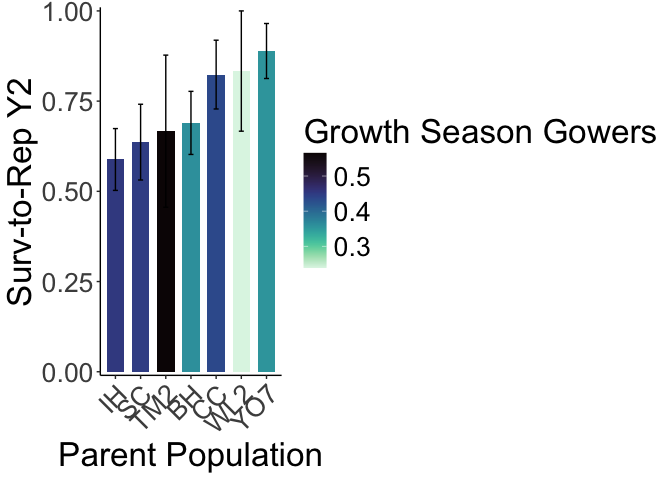<!-- -->

``` r
#ggsave("../output/WL2_Traits/WL2_SurvtoRepY2_GrwSsn_GD_Recent.png", width = 12, height = 8, units = "in")

wl2_surv_to_rep_y2 %>% 
  group_by(pop, elev_m, GrwSsn_GD_Recent, Wtr_Year_GD_Recent) %>% 
  summarise(meanSurv=mean(SurvtoRep_y2, na.rm = TRUE), semSurv=sem(SurvtoRep_y2, na.rm=TRUE)) %>% 
  filter(pop != "LV1", pop !="SQ1", pop !="WR") %>% 
  ggplot(aes(x=fct_reorder(pop, meanSurv), y=meanSurv, fill=Wtr_Year_GD_Recent)) +
  geom_col(width = 0.7,position = position_dodge(0.75)) + 
  geom_errorbar(aes(ymin=meanSurv-semSurv,ymax=meanSurv+semSurv),width=.2, position = 
                  position_dodge(0.75)) +
  theme_classic() + 
  scale_y_continuous(expand = c(0.01, 0)) +
  labs(y="Surv-to-Rep Y2", x="Parent Population", fill="Water Year Gowers") +
  scale_fill_viridis(option="mako", direction = -1) +
  theme(text=element_text(size=25), axis.text.x = element_text(angle = 45,  hjust = 1))
```

```
## `summarise()` has grouped output by 'pop', 'elev_m', 'GrwSsn_GD_Recent'. You
## can override using the `.groups` argument.
```

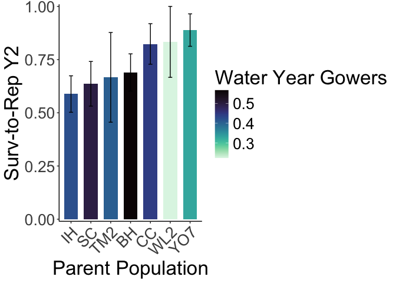<!-- -->

``` r
#ggsave("../output/WL2_Traits/WL2_SurvtoRepY2_Wtr_Year_GD_Recent.png", width = 12, height = 8, units = "in")
```

### Scatterplots


``` r
#scatter plots
GSCD_recent <- wl2_surv_to_rep_y2 %>% 
  filter(pop != "LV1", pop != "SQ1", pop != "WR") %>% 
  group_by(pop, elev_m, GrwSsn_GD_Recent, Wtr_Year_GD_Recent) %>% 
  summarise(meanSurv=mean(SurvtoRep_y2, na.rm = TRUE), semSurv=sem(SurvtoRep_y2, na.rm=TRUE)) %>% 
  ggplot(aes(x=GrwSsn_GD_Recent, y=meanSurv, group = pop)) +
  geom_point(size=6) + 
  geom_errorbar(aes(ymin=meanSurv-semSurv,ymax=meanSurv+semSurv),width=.02, linewidth = 2) +
  theme_classic() + 
  scale_y_continuous(expand = c(0.01, 0)) +
  labs(y="Surv-to-Rep Y2", x="Recent Growth Season CD") +
  theme(text=element_text(size=25))
```

```
## `summarise()` has grouped output by 'pop', 'elev_m', 'GrwSsn_GD_Recent'. You
## can override using the `.groups` argument.
```

``` r
WYCD_recent <- wl2_surv_to_rep_y2 %>% 
  filter(pop != "LV1", pop != "SQ1", pop != "WR") %>% 
  group_by(pop, elev_m, GrwSsn_GD_Recent, Wtr_Year_GD_Recent) %>% 
  summarise(meanSurv=mean(SurvtoRep_y2, na.rm = TRUE), semSurv=sem(SurvtoRep_y2, na.rm=TRUE)) %>% 
  ggplot(aes(x=Wtr_Year_GD_Recent, y=meanSurv, group = pop)) +
  geom_point(size=6) + 
  geom_errorbar(aes(ymin=meanSurv-semSurv,ymax=meanSurv+semSurv),width=.02,linewidth = 2) +
  theme_classic() + 
  scale_y_continuous(expand = c(0.01, 0)) +
  labs(y="Surv-to-Rep Y2", x="Recent Water Year CD") +
  theme(text=element_text(size=25))
```

```
## `summarise()` has grouped output by 'pop', 'elev_m', 'GrwSsn_GD_Recent'. You
## can override using the `.groups` argument.
```

``` r
GD <- wl2_surv_to_rep_y2 %>% 
  filter(pop != "LV1", pop != "SQ1", pop != "WR") %>% 
  group_by(pop, elev_m, GrwSsn_GD_Recent, Wtr_Year_GD_Recent, Geographic_Dist) %>% 
  summarise(meanSurv=mean(SurvtoRep_y2, na.rm = TRUE), semSurv=sem(SurvtoRep_y2, na.rm=TRUE)) %>% 
  ggplot(aes(x=Geographic_Dist, y=meanSurv, group = pop)) +
  geom_point(size=6) + 
  geom_errorbar(aes(ymin=meanSurv-semSurv,ymax=meanSurv+semSurv),width=.02, linewidth = 2) +
  theme_classic() + 
  scale_y_continuous(expand = c(0.01, 0)) +
  labs(y="Surv-to-Rep Y2", x="Geographic Distance (m)") +
  theme(text=element_text(size=25), axis.text.x = element_text(angle = 45,  hjust = 1))
```

```
## `summarise()` has grouped output by 'pop', 'elev_m', 'GrwSsn_GD_Recent',
## 'Wtr_Year_GD_Recent'. You can override using the `.groups` argument.
```

``` r
ED <- wl2_surv_to_rep_y2 %>% 
  filter(pop != "LV1", pop != "SQ1", pop != "WR") %>% 
  group_by(pop, elev_m, Elev_Dist) %>% 
  summarise(meanSurv=mean(SurvtoRep_y2, na.rm = TRUE), semSurv=sem(SurvtoRep_y2, na.rm=TRUE)) %>% 
  ggplot(aes(x=Elev_Dist, y=meanSurv, group = pop)) +
  geom_point(size=6) + 
  geom_errorbar(aes(ymin=meanSurv-semSurv,ymax=meanSurv+semSurv),width=.02, linewidth = 2) +
  theme_classic() + 
  scale_y_continuous(expand = c(0.01, 0)) +
  labs(y="Surv-to-Rep Y2", x="Elevation Distance (m)") +
  theme(text=element_text(size=25), axis.text.x = element_text(angle = 45,  hjust = 1))
```

```
## `summarise()` has grouped output by 'pop', 'elev_m'. You can override using the
## `.groups` argument.
```

``` r
wl2_surv_to_rep_y2_FIG <- ggarrange(GSCD_recent, WYCD_recent, GD, ED, ncol=2, nrow=2) 
ggsave("../output/WL2_Traits/WL2_SurvtoRep_y2_SCATTERS_Recent.png", width = 24, height = 18, units = "in")
```


``` r
#scatter plots
GSCD_historic <- wl2_surv_to_rep_y2 %>% 
  filter(pop != "LV1", pop != "SQ1", pop != "WR") %>% 
  group_by(pop, elev_m, GrwSsn_GD_Historical, Wtr_Year_GD_Historical) %>% 
  summarise(meanSurv=mean(SurvtoRep_y2, na.rm = TRUE), semSurv=sem(SurvtoRep_y2, na.rm=TRUE)) %>% 
  ggplot(aes(x=GrwSsn_GD_Historical, y=meanSurv, group = pop)) +
  geom_point(size=6) + 
  geom_errorbar(aes(ymin=meanSurv-semSurv,ymax=meanSurv+semSurv),width=.02, linewidth = 2) +
  theme_classic() + 
  scale_y_continuous(expand = c(0.01, 0)) +
  labs(y="Surv-to-Rep Y2", x="Historic Growth Season CD") +
  theme(text=element_text(size=25))
```

```
## `summarise()` has grouped output by 'pop', 'elev_m', 'GrwSsn_GD_Historical'.
## You can override using the `.groups` argument.
```

``` r
WYCD_historic <- wl2_surv_to_rep_y2 %>% 
  filter(pop != "LV1", pop != "SQ1", pop != "WR") %>% 
  group_by(pop, elev_m, GrwSsn_GD_Historical, Wtr_Year_GD_Historical) %>% 
  summarise(meanSurv=mean(SurvtoRep_y2, na.rm = TRUE), semSurv=sem(SurvtoRep_y2, na.rm=TRUE)) %>% 
  ggplot(aes(x=Wtr_Year_GD_Historical, y=meanSurv, group = pop)) +
  geom_point(size=6) + 
  geom_errorbar(aes(ymin=meanSurv-semSurv,ymax=meanSurv+semSurv),width=.02,linewidth = 2) +
  theme_classic() + 
  scale_y_continuous(expand = c(0.01, 0)) +
  labs(y="Surv-to-Rep Y2", x="Historic Water Year CD") +
  theme(text=element_text(size=25))
```

```
## `summarise()` has grouped output by 'pop', 'elev_m', 'GrwSsn_GD_Historical'.
## You can override using the `.groups` argument.
```

``` r
wl2_surv_to_rep_y2_FIG <- ggarrange(GSCD_historic, WYCD_historic, GD, ED, ncol=2, nrow=2) 
ggsave("../output/WL2_Traits/WL2_SurvtoRep_y2_SCATTERS_Historic.png", width = 24, height = 18, units = "in")
```

#### Directional Distance


``` r
#scatter plots - recent
GSCD_prob_recent <- wl2_surv_to_rep_y2_sub_dist %>% 
  filter(pop != "LV1", pop != "SQ1", pop != "WR") %>% 
  group_by(pop, elev_m, GrwSsn_TempDist_Recent, GrwSsn_TempDist_Historic) %>% 
  summarise(meanEst=mean(SurvtoRep_y2, na.rm = TRUE), semEst=sem(SurvtoRep_y2, na.rm=TRUE)) %>% 
  ggplot(aes(x=GrwSsn_TempDist_Recent, y=meanEst, group = pop)) +
  geom_point(size=6) + 
  geom_errorbar(aes(ymin=meanEst-semEst,ymax=meanEst+semEst),width=.3, linewidth = 2) +
  theme_classic() + 
  scale_y_continuous(expand = c(0.01, 0)) +
  labs(y="Surv-to-Rep Y2", x="Recent Growth Season Temp Dist") +
  theme(text=element_text(size=30))
```

```
## `summarise()` has grouped output by 'pop', 'elev_m', 'GrwSsn_TempDist_Recent'.
## You can override using the `.groups` argument.
```

``` r
WYCD_prob_recent <- wl2_surv_to_rep_y2_sub_dist %>% 
  filter(pop != "LV1", pop != "SQ1", pop != "WR") %>% 
  group_by(pop, elev_m, Wtr_Year_TempDist_Recent, Wtr_Year_TempDist_Historic) %>% 
  summarise(meanEst=mean(SurvtoRep_y2, na.rm = TRUE), semEst=sem(SurvtoRep_y2, na.rm=TRUE)) %>% 
  ggplot(aes(x=Wtr_Year_TempDist_Recent, y=meanEst, group = pop)) +
  geom_point(size=6) + 
  geom_errorbar(aes(ymin=meanEst-semEst,ymax=meanEst+semEst),width=.3,linewidth = 2) +
  theme_classic() + 
  scale_y_continuous(expand = c(0.01, 0)) +
  labs(y="Surv-to-Rep Y2", x="Recent Water Year Temp Dist") +
  theme(text=element_text(size=30))
```

```
## `summarise()` has grouped output by 'pop', 'elev_m',
## 'Wtr_Year_TempDist_Recent'. You can override using the `.groups` argument.
```

``` r
GD_prob <- wl2_surv_to_rep_y2_sub_dist %>% 
  filter(pop != "LV1", pop != "SQ1", pop != "WR") %>% 
  group_by(pop, elev_m, GrwSsn_TempDist_Recent, Wtr_Year_TempDist_Recent, Geographic_Dist) %>% 
  summarise(meanEst=mean(SurvtoRep_y2, na.rm = TRUE), semEst=sem(SurvtoRep_y2, na.rm=TRUE)) %>% 
  ggplot(aes(x=Geographic_Dist, y=meanEst, group = pop)) +
  geom_point(size=6) + 
  geom_errorbar(aes(ymin=meanEst-semEst,ymax=meanEst+semEst),width=.2, linewidth = 2) +
  theme_classic() + 
  scale_y_continuous(expand = c(0.01, 0)) +
  labs(y="Surv-to-Rep Y2", x="Geographic Distance (m)") +
  theme(text=element_text(size=30), axis.text.x = element_text(angle = 45,  hjust = 1))
```

```
## `summarise()` has grouped output by 'pop', 'elev_m', 'GrwSsn_TempDist_Recent',
## 'Wtr_Year_TempDist_Recent'. You can override using the `.groups` argument.
```

``` r
ED_prob <- wl2_surv_to_rep_y2_sub_dist %>% 
  filter(pop != "LV1", pop != "SQ1", pop != "WR") %>% 
  group_by(pop, elev_m, Elev_Dist) %>% 
  summarise(meanEst=mean(SurvtoRep_y2, na.rm = TRUE), semEst=sem(SurvtoRep_y2, na.rm=TRUE)) %>% 
  ggplot(aes(x=Elev_Dist, y=meanEst, group = pop)) +
  geom_point(size=6) + 
  geom_errorbar(aes(ymin=meanEst-semEst,ymax=meanEst+semEst),width=.3, linewidth = 2) +
  theme_classic() + 
  scale_y_continuous(expand = c(0.01, 0)) +
  labs(y="Surv-to-Rep Y2", x="Elevation Distance (m)") +
  theme(text=element_text(size=30))
```

```
## `summarise()` has grouped output by 'pop', 'elev_m'. You can override using the
## `.groups` argument.
```

``` r
WL2_surv_to_rep_y2_sub_FIG_prob_recent <- ggarrange(GSCD_prob_recent, WYCD_prob_recent, GD_prob, ED_prob, ncol=2, nrow=2) 
ggsave("../output/WL2_Traits/WL2_SurvtoRep_y2_TmpSubDist_SCATTERS_Recent.png", width = 24, height = 18, units = "in")
```


``` r
#scatter plots - historic
GSCD_prob_historic <- wl2_surv_to_rep_y2_sub_dist %>% 
  filter(pop != "LV1", pop != "SQ1", pop != "WR") %>% 
  group_by(pop, elev_m, GrwSsn_TempDist_Recent, GrwSsn_TempDist_Historic) %>% 
  summarise(meanEst=mean(SurvtoRep_y2, na.rm = TRUE), semEst=sem(SurvtoRep_y2, na.rm=TRUE)) %>% 
  ggplot(aes(x=GrwSsn_TempDist_Historic, y=meanEst, group = pop)) +
  geom_point(size=6) + 
  geom_errorbar(aes(ymin=meanEst-semEst,ymax=meanEst+semEst),width=.3, linewidth = 2) +
  theme_classic() + 
  scale_y_continuous(expand = c(0.01, 0)) +
  labs(y="Surv-to-Rep Y2", x="Historic Growth Season Temp Dist") +
  theme(text=element_text(size=30))
```

```
## `summarise()` has grouped output by 'pop', 'elev_m', 'GrwSsn_TempDist_Recent'.
## You can override using the `.groups` argument.
```

``` r
WYCD_prob_historic <- wl2_surv_to_rep_y2_sub_dist %>% 
  filter(pop != "LV1", pop != "SQ1", pop != "WR") %>% 
  group_by(pop, elev_m, Wtr_Year_TempDist_Recent, Wtr_Year_TempDist_Historic) %>% 
  summarise(meanEst=mean(SurvtoRep_y2, na.rm = TRUE), semEst=sem(SurvtoRep_y2, na.rm=TRUE)) %>% 
  ggplot(aes(x=Wtr_Year_TempDist_Historic, y=meanEst, group = pop)) +
  geom_point(size=6) + 
  geom_errorbar(aes(ymin=meanEst-semEst,ymax=meanEst+semEst),width=.3,linewidth = 2) +
  theme_classic() + 
  scale_y_continuous(expand = c(0.01, 0)) +
  labs(y="Surv-to-Rep Y2", x="Historic Water Year Temp Dist") +
  theme(text=element_text(size=30))
```

```
## `summarise()` has grouped output by 'pop', 'elev_m',
## 'Wtr_Year_TempDist_Recent'. You can override using the `.groups` argument.
```

``` r
WL2_surv_to_rep_y2_sub_FIG_prob_historic <- ggarrange(GSCD_prob_historic, WYCD_prob_historic, GD_prob, ED_prob, ncol=2, nrow=2) 
ggsave("../output/WL2_Traits/WL2_SurvtoRep_y2_TmpSubDist_SCATTERS_Historic.png", width = 24, height = 18, units = "in")
```


``` r
#scatter plots - recent
GSCD_prob_recent <- wl2_surv_to_rep_y2_sub_dist %>% 
  filter(pop != "LV1", pop != "SQ1", pop != "WR") %>% 
  group_by(pop, elev_m, GrwSsn_PPTDist_Recent, GrwSsn_PPTDist_Historic) %>% 
  summarise(meanEst=mean(SurvtoRep_y2, na.rm = TRUE), semEst=sem(SurvtoRep_y2, na.rm=TRUE)) %>% 
  ggplot(aes(x=GrwSsn_PPTDist_Recent, y=meanEst, group = pop)) +
  geom_point(size=6) + 
  geom_errorbar(aes(ymin=meanEst-semEst,ymax=meanEst+semEst),width=0.3, linewidth = 2) +
  theme_classic() + 
  scale_y_continuous(expand = c(0.01, 0)) +
  labs(y="Surv-to-Rep Y2", x="Recent Growth Season PPT Dist") +
  theme(text=element_text(size=30))
```

```
## `summarise()` has grouped output by 'pop', 'elev_m', 'GrwSsn_PPTDist_Recent'.
## You can override using the `.groups` argument.
```

``` r
WYCD_prob_recent <- wl2_surv_to_rep_y2_sub_dist %>% 
  filter(pop != "LV1", pop != "SQ1", pop != "WR") %>% 
  group_by(pop, elev_m, Wtr_Year_PPTDist_Recent, Wtr_Year_PPTDist_Historic) %>% 
  summarise(meanEst=mean(SurvtoRep_y2, na.rm = TRUE), semEst=sem(SurvtoRep_y2, na.rm=TRUE)) %>% 
  ggplot(aes(x=Wtr_Year_PPTDist_Recent, y=meanEst, group = pop)) +
  geom_point(size=6) + 
  geom_errorbar(aes(ymin=meanEst-semEst,ymax=meanEst+semEst),width=.3,linewidth = 2) +
  theme_classic() + 
  scale_y_continuous(expand = c(0.01, 0)) +
  labs(y="Surv-to-Rep Y2", x="Recent Water Year PPT Dist") +
  theme(text=element_text(size=30))
```

```
## `summarise()` has grouped output by 'pop', 'elev_m', 'Wtr_Year_PPTDist_Recent'.
## You can override using the `.groups` argument.
```

``` r
GD_prob <- wl2_surv_to_rep_y2_sub_dist %>% 
  filter(pop != "LV1", pop != "SQ1", pop != "WR") %>% 
  group_by(pop, elev_m, GrwSsn_PPTDist_Recent, Wtr_Year_PPTDist_Recent, Geographic_Dist) %>% 
  summarise(meanEst=mean(SurvtoRep_y2, na.rm = TRUE), semEst=sem(SurvtoRep_y2, na.rm=TRUE)) %>% 
  ggplot(aes(x=Geographic_Dist, y=meanEst, group = pop)) +
  geom_point(size=6) + 
  geom_errorbar(aes(ymin=meanEst-semEst,ymax=meanEst+semEst),width=.2, linewidth = 2) +
  theme_classic() + 
  scale_y_continuous(expand = c(0.01, 0)) +
  labs(y="Surv-to-Rep Y2", x="Geographic Distance (m)") +
  theme(text=element_text(size=30), axis.text.x = element_text(angle = 45,  hjust = 1))
```

```
## `summarise()` has grouped output by 'pop', 'elev_m', 'GrwSsn_PPTDist_Recent',
## 'Wtr_Year_PPTDist_Recent'. You can override using the `.groups` argument.
```

``` r
ED_prob <- wl2_surv_to_rep_y2_sub_dist %>% 
  filter(pop != "LV1", pop != "SQ1", pop != "WR") %>% 
  group_by(pop, elev_m, Elev_Dist) %>% 
  summarise(meanEst=mean(SurvtoRep_y2, na.rm = TRUE), semEst=sem(SurvtoRep_y2, na.rm=TRUE)) %>% 
  ggplot(aes(x=Elev_Dist, y=meanEst, group = pop)) +
  geom_point(size=6) + 
  geom_errorbar(aes(ymin=meanEst-semEst,ymax=meanEst+semEst),width=.3, linewidth = 2) +
  theme_classic() + 
  scale_y_continuous(expand = c(0.01, 0)) +
  labs(y="Surv-to-Rep Y2", x="Elevation Distance (m)") +
  theme(text=element_text(size=30))
```

```
## `summarise()` has grouped output by 'pop', 'elev_m'. You can override using the
## `.groups` argument.
```

``` r
WL2_surv_to_rep_y2_sub_FIG_prob_recent <- ggarrange(GSCD_prob_recent, WYCD_prob_recent, GD_prob, ED_prob, ncol=2, nrow=2) 
ggsave("../output/WL2_Traits/WL2_SurvtoRep_y2_PPTSubDist_SCATTERS_Recent.png", width = 24, height = 18, units = "in")
```


``` r
#scatter plots - historic
GSCD_prob_historic <- wl2_surv_to_rep_y2_sub_dist %>% 
  filter(pop != "LV1", pop != "SQ1", pop != "WR") %>% 
  group_by(pop, elev_m, GrwSsn_PPTDist_Recent, GrwSsn_PPTDist_Historic) %>% 
  summarise(meanEst=mean(SurvtoRep_y2, na.rm = TRUE), semEst=sem(SurvtoRep_y2, na.rm=TRUE)) %>% 
  ggplot(aes(x=GrwSsn_PPTDist_Historic, y=meanEst, group = pop)) +
  geom_point(size=6) + 
  geom_errorbar(aes(ymin=meanEst-semEst,ymax=meanEst+semEst),width=.3, linewidth = 2) +
  theme_classic() + 
  scale_y_continuous(expand = c(0.01, 0)) +
  labs(y="Surv-to-Rep Y2", x="Historic Growth Season PPT Dist") +
  theme(text=element_text(size=30))
```

```
## `summarise()` has grouped output by 'pop', 'elev_m', 'GrwSsn_PPTDist_Recent'.
## You can override using the `.groups` argument.
```

``` r
WYCD_prob_historic <- wl2_surv_to_rep_y2_sub_dist %>% 
  filter(pop != "LV1", pop != "SQ1", pop != "WR") %>% 
  group_by(pop, elev_m, Wtr_Year_PPTDist_Recent, Wtr_Year_PPTDist_Historic) %>% 
  summarise(meanEst=mean(SurvtoRep_y2, na.rm = TRUE), semEst=sem(SurvtoRep_y2, na.rm=TRUE)) %>% 
  ggplot(aes(x=Wtr_Year_PPTDist_Historic, y=meanEst, group = pop)) +
  geom_point(size=6) + 
  geom_errorbar(aes(ymin=meanEst-semEst,ymax=meanEst+semEst),width=.3,linewidth = 2) +
  theme_classic() + 
  scale_y_continuous(expand = c(0.01, 0)) +
  labs(y="Surv-to-Rep Y2", x="Historic Water Year PPT Dist") +
  theme(text=element_text(size=30))
```

```
## `summarise()` has grouped output by 'pop', 'elev_m', 'Wtr_Year_PPTDist_Recent'.
## You can override using the `.groups` argument.
```

``` r
WL2_surv_to_rep_y2_sub_FIG_prob_historic <- ggarrange(GSCD_prob_historic, WYCD_prob_historic, GD_prob, ED_prob, ncol=2, nrow=2) 
ggsave("../output/WL2_Traits/WL2_SurvtoRep_y2_PPTSubDist_SCATTERS_Historic.png", width = 24, height = 18, units = "in")
```

#### Figure for paper


``` r
GD_prob <- wl2_surv_to_rep_y2_sub_dist %>% 
  filter(pop != "LV1", pop != "SQ1", pop != "WR") %>% 
  group_by(pop, elev_m, GrwSsn_PPTDist_Recent, Wtr_Year_PPTDist_Recent, Geographic_Dist) %>% 
  summarise(meanEst=mean(SurvtoRep_y2, na.rm = TRUE), semEst=sem(SurvtoRep_y2, na.rm=TRUE)) %>% 
  ggplot(aes(x=Geographic_Dist, y=meanEst, group = pop)) +
  geom_point(size=6) + 
  geom_errorbar(aes(ymin=meanEst-semEst,ymax=meanEst+semEst),width=.2, linewidth = 2) +
  theme_classic() + 
  scale_y_continuous(expand = c(0.01, 0)) +
  labs(y="Survival to Budding Y2", x="Geographic Distance (m)") +
  theme(text=element_text(size=30), axis.text.x = element_text(angle = 45,  hjust = 1))
```

```
## `summarise()` has grouped output by 'pop', 'elev_m', 'GrwSsn_PPTDist_Recent',
## 'Wtr_Year_PPTDist_Recent'. You can override using the `.groups` argument.
```

``` r
WYCD_recent <- wl2_surv_to_rep_y2 %>% 
  filter(pop != "LV1", pop != "SQ1", pop != "WR") %>% 
  group_by(pop, elev_m, GrwSsn_GD_Recent, Wtr_Year_GD_Recent) %>% 
  summarise(meanSurv=mean(SurvtoRep_y2, na.rm = TRUE), semSurv=sem(SurvtoRep_y2, na.rm=TRUE)) %>% 
  ggplot(aes(x=Wtr_Year_GD_Recent, y=meanSurv, group = pop)) +
  geom_point(size=6) + 
  geom_errorbar(aes(ymin=meanSurv-semSurv,ymax=meanSurv+semSurv),width=.02,linewidth = 2) +
  theme_classic() + 
  scale_y_continuous(expand = c(0.01, 0)) +
  labs(y="Survival to Budding Y2", x="Recent Water Year CD") +
  theme(text=element_text(size=25))
```

```
## `summarise()` has grouped output by 'pop', 'elev_m', 'GrwSsn_GD_Recent'. You
## can override using the `.groups` argument.
```

``` r
WYtemp_prob_recent <- wl2_surv_to_rep_y2_sub_dist %>% 
  filter(pop != "LV1", pop != "SQ1", pop != "WR") %>% 
  group_by(pop, elev_m, Wtr_Year_TempDist_Recent, Wtr_Year_TempDist_Historic) %>% 
  summarise(meanEst=mean(SurvtoRep_y2, na.rm = TRUE), semEst=sem(SurvtoRep_y2, na.rm=TRUE)) %>% 
  ggplot(aes(x=Wtr_Year_TempDist_Recent, y=meanEst, group = pop)) +
  geom_point(size=6) + 
  geom_errorbar(aes(ymin=meanEst-semEst,ymax=meanEst+semEst),width=.3,linewidth = 2) +
  theme_classic() + 
  scale_y_continuous(expand = c(0.01, 0)) +
  labs(y="Survival to Budding Y2", x="Recent Water Year Temp Dist (°C)") +
  theme(text=element_text(size=30))
```

```
## `summarise()` has grouped output by 'pop', 'elev_m',
## 'Wtr_Year_TempDist_Recent'. You can override using the `.groups` argument.
```

``` r
WYppt_prob_recent <- wl2_surv_to_rep_y2_sub_dist %>% 
  filter(pop != "LV1", pop != "SQ1", pop != "WR") %>% 
  group_by(pop, elev_m, Wtr_Year_PPTDist_Recent, Wtr_Year_PPTDist_Historic) %>% 
  summarise(meanEst=mean(SurvtoRep_y2, na.rm = TRUE), semEst=sem(SurvtoRep_y2, na.rm=TRUE)) %>% 
  ggplot(aes(x=Wtr_Year_PPTDist_Recent, y=meanEst, group = pop)) +
  geom_point(size=6) + 
  geom_errorbar(aes(ymin=meanEst-semEst,ymax=meanEst+semEst),width=.3,linewidth = 2) +
  theme_classic() + 
  scale_y_continuous(expand = c(0.01, 0)) +
  labs(y="Survival to Budding Y2", x="Recent Water Year PPT Dist (mm)") +
  theme(text=element_text(size=30))
```

```
## `summarise()` has grouped output by 'pop', 'elev_m', 'Wtr_Year_PPTDist_Recent'.
## You can override using the `.groups` argument.
```

``` r
WL2_surv_to_rep_y2_for_paper <- ggarrange(GD_prob, WYCD_recent, 
                                        WYtemp_prob_recent, WYppt_prob_recent, 
                                        labels = c("A)", "B)", "C)", "D)"), 
                                        font.label = list(size=30, face = "plain"), 
                                        ncol=2, nrow=2) 
ggsave("../output/WL2_Traits/WL2_SurvtoRep_y2_SCATTERS_Summary_Recent.png", width = 24, height = 18, units = "in")
```

## Stats

### Scaling


``` r
wl2_surv_to_rep_y2 %>% 
  group_by(pop) %>% 
  summarise(n=n()) %>% 
  arrange(n) #LV1, SQ1, WR only 1 indiv, remove 
```

```
## # A tibble: 10 × 2
##    pop       n
##    <chr> <int>
##  1 LV1       1
##  2 SQ1       1
##  3 WR        1
##  4 TM2       6
##  5 WL2       6
##  6 CC       17
##  7 YO7      18
##  8 SC       22
##  9 BH       29
## 10 IH       34
```

``` r
wl2_surv_to_rep_y2_scaled <- wl2_surv_to_rep_y2 %>% 
  filter(pop != "LV1", pop != "SQ1", pop != "WR") %>% 
  mutate_at(c("GrwSsn_GD_Recent","Wtr_Year_GD_Recent",                                                           "GrwSsn_GD_Historical","Wtr_Year_GD_Historical","Geographic_Dist"),
                                                            scale) 
```


``` r
wl2_surv_to_rep_y2_sub_dist %>% 
  group_by(pop) %>% 
  summarise(n=n()) %>% 
  arrange(n) #LV1, SQ1, WR only 1 indiv, remove 
```

```
## # A tibble: 10 × 2
##    pop       n
##    <chr> <int>
##  1 LV1       1
##  2 SQ1       1
##  3 WR        1
##  4 TM2       6
##  5 WL2       6
##  6 CC       17
##  7 YO7      18
##  8 SC       22
##  9 BH       29
## 10 IH       34
```

``` r
wl2_surv_to_rep_y2_scaled_sub <- wl2_surv_to_rep_y2_sub_dist %>% 
  filter(pop != "LV1", pop != "SQ1", pop != "WR") %>% 
  mutate_at(c("Wtr_Year_TempDist_Recent",  "Wtr_Year_PPTDist_Recent", 
                 "Wtr_Year_TempDist_Historic", "Wtr_Year_PPTDist_Historic",
                 "GrwSsn_TempDist_Recent", "GrwSsn_PPTDist_Recent",
                 "GrwSsn_TempDist_Historic", "GrwSsn_PPTDist_Historic",
              "Geographic_Dist"), scale)

unique(wl2_surv_to_rep_y2_scaled_sub$pop)
```

```
## [1] "CC"  "BH"  "WL2" "IH"  "SC"  "YO7" "TM2"
```

``` r
unique(wl2_surv_to_rep_y2_scaled_sub$mf)
```

```
## [1] 3 7 4 8 2 1 6 5 9
```

``` r
unique(wl2_surv_to_rep_y2_scaled_sub$block)
```

```
##  [1] "A" "B" "C" "D" "E" "F" "G" "H" "I" "J" "K" "L" "M"
```

### Basic Model Workflow


``` r
glmer.model_binomial <- 
  linear_reg() %>% 
  set_engine("glmer", family=binomial)

surv_wflow <- workflow() %>% 
  add_variables(outcomes = SurvtoRep_y2, predictors = c(pop, mf, block))

surv_fits <- tibble(wflow=list(
  pop = {surv_wflow %>% 
      add_model(glmer.model_binomial, formula = SurvtoRep_y2 ~ (1|pop))},
  
  pop.mf = {surv_wflow %>% 
      add_model(glmer.model_binomial, formula = SurvtoRep_y2 ~ (1|pop/mf))},
  
  pop.block = {surv_wflow %>% 
      add_model(glmer.model_binomial, formula = SurvtoRep_y2 ~ (1|pop) + (1|block))},
  
  pop.mf.block = {surv_wflow %>% 
      add_model(glmer.model_binomial, formula = SurvtoRep_y2 ~ (1|pop/mf) + (1|block))}
),
name=names(wflow)
) %>% 
  select(name,wflow)

surv_fits_wl2 <- surv_fits %>%
  mutate(fit = map(wflow, fit, data = wl2_surv_to_rep_y2_scaled))
```

```
## Warning: There was 1 warning in `mutate()`.
## ℹ In argument: `fit = map(wflow, fit, data = wl2_surv_to_rep_y2_scaled)`.
## Caused by warning in `checkConv()`:
## ! Model failed to converge with max|grad| = 0.0344541 (tol = 0.002, component 1)
```

``` r
#mod_test <- glmer(SurvtoRep_y2 ~ (1|pop/mf) + (1|block), data=wl2_surv_to_rep_y2_scaled, family=binomial)
#summary(mod_test)
#Warning: Model failed to converge with max|grad| = 0.0354704 (tol = 0.002, component 1)

surv_fits_wl2 %>% mutate(glance=map(fit, glance)) %>% unnest(glance) %>% arrange(AIC) %>% select(-wflow:-sigma)
```

```
## # A tibble: 4 × 6
##   name         logLik   AIC   BIC deviance df.residual
##   <chr>         <dbl> <dbl> <dbl>    <dbl>       <int>
## 1 pop.block     -74.7  155.  164.     124.         129
## 2 pop.mf.block  -74.4  157.  168.     111.         128
## 3 pop           -80.1  164.  170.     158.         130
## 4 pop.mf        -79.8  166.  174.     148.         129
```

``` r
#model with pop and block (but excluding mf) is best by AIC and BIC, convergence issues with mf included 
```

#### Test climate and geographic distance


``` r
surv_GD_wflow_wl2 <- workflow() %>%
  add_variables(outcomes = SurvtoRep_y2, predictors = c(pop, mf, block, contains("GD"), Geographic_Dist)) 

surv_GD_fits_wl2 <- tibble(wflow=list(
  pop.block = {surv_GD_wflow_wl2 %>% 
      add_model(glmer.model_binomial, formula = SurvtoRep_y2 ~ (1|pop) + (1|block))},
  
  GS_Recent = {surv_GD_wflow_wl2 %>% 
      add_model(glmer.model_binomial, formula = SurvtoRep_y2 ~ GrwSsn_GD_Recent + Geographic_Dist + (1|pop) + (1|block))},
  
  GS_Historical = {surv_GD_wflow_wl2 %>% 
      add_model(glmer.model_binomial, formula = SurvtoRep_y2 ~ GrwSsn_GD_Historical + Geographic_Dist + (1|pop) + (1|block))},
  
  WY_Recent = {surv_GD_wflow_wl2 %>% 
      add_model(glmer.model_binomial, formula = SurvtoRep_y2 ~ Wtr_Year_GD_Recent + Geographic_Dist + (1|pop) + (1|block))},
  
  WY_Historical = {surv_GD_wflow_wl2 %>% 
      add_model(glmer.model_binomial, formula = SurvtoRep_y2 ~ Wtr_Year_GD_Historical + Geographic_Dist + (1|pop) + (1|block))}
  
),
name=names(wflow)
) %>% 
  select(name,wflow) %>%
  mutate(fit = map(wflow, fit, data = wl2_surv_to_rep_y2_scaled))
```

```
## boundary (singular) fit: see help('isSingular')
## boundary (singular) fit: see help('isSingular')
```

``` r
surv_GD_fits_wl2 %>% mutate(glance=map(fit, glance)) %>% unnest(glance) %>% arrange(AIC) %>% select(-wflow:-sigma)
```

```
## # A tibble: 5 × 6
##   name          logLik   AIC   BIC deviance df.residual
##   <chr>          <dbl> <dbl> <dbl>    <dbl>       <int>
## 1 WY_Recent      -72.0  154.  168.     124.         127
## 2 WY_Historical  -72.4  155.  169.     125.         127
## 3 pop.block      -74.7  155.  164.     124.         129
## 4 GS_Recent      -73.3  157.  171.     126.         127
## 5 GS_Historical  -73.4  157.  171.     125.         127
```

``` r
#water year models preferred by AIC 

surv_GD_fits_wl2 %>% mutate(tidy=map(fit, tidy)) %>% unnest(tidy) %>%
  filter(str_detect(term, "GD") | term=="Geographic_Dist") %>%
  drop_na(p.value) %>%
  select(-wflow:-group)# %>%
```

```
## # A tibble: 8 × 6
##   name          term                   estimate std.error statistic p.value
##   <chr>         <chr>                     <dbl>     <dbl>     <dbl>   <dbl>
## 1 GS_Recent     GrwSsn_GD_Recent         -0.372     0.242    -1.53   0.125 
## 2 GS_Recent     Geographic_Dist           0.196     0.241     0.813  0.416 
## 3 GS_Historical GrwSsn_GD_Historical     -0.356     0.249    -1.43   0.152 
## 4 GS_Historical Geographic_Dist           0.229     0.242     0.948  0.343 
## 5 WY_Recent     Wtr_Year_GD_Recent       -0.577     0.262    -2.20   0.0278
## 6 WY_Recent     Geographic_Dist           0.506     0.253     2.00   0.0459
## 7 WY_Historical Wtr_Year_GD_Historical   -0.520     0.251    -2.07   0.0382
## 8 WY_Historical Geographic_Dist           0.465     0.246     1.89   0.0590
```

``` r
#  arrange(p.value)
# recent water year = marginally sig, historical water year = sig, but historical water year had a singular boundary warning 

mod_test <- glmer(SurvtoRep_y2 ~ Wtr_Year_GD_Recent + Geographic_Dist + (1|pop) + (1|block), data=wl2_surv_to_rep_y2_scaled, family=binomial)
```

```
## boundary (singular) fit: see help('isSingular')
```

``` r
summary(mod_test)
```

```
## Generalized linear mixed model fit by maximum likelihood (Laplace
##   Approximation) [glmerMod]
##  Family: binomial  ( logit )
## Formula: SurvtoRep_y2 ~ Wtr_Year_GD_Recent + Geographic_Dist + (1 | pop) +  
##     (1 | block)
##    Data: wl2_surv_to_rep_y2_scaled
## 
##      AIC      BIC   logLik deviance df.resid 
##    154.1    168.5    -72.0    144.1      127 
## 
## Scaled residuals: 
##     Min      1Q  Median      3Q     Max 
## -3.3391 -0.7043  0.3982  0.5694  1.4199 
## 
## Random effects:
##  Groups Name        Variance  Std.Dev. 
##  block  (Intercept) 9.694e-01 9.846e-01
##  pop    (Intercept) 1.547e-10 1.244e-05
## Number of obs: 132, groups:  block, 13; pop, 7
## 
## Fixed effects:
##                    Estimate Std. Error z value Pr(>|z|)   
## (Intercept)          1.1143     0.3620   3.078  0.00208 **
## Wtr_Year_GD_Recent  -0.5765     0.2621  -2.199  0.02784 * 
## Geographic_Dist      0.5055     0.2533   1.996  0.04592 * 
## ---
## Signif. codes:  0 '***' 0.001 '**' 0.01 '*' 0.05 '.' 0.1 ' ' 1
## 
## Correlation of Fixed Effects:
##             (Intr) W_Y_GD
## Wtr_Yr_GD_R -0.127       
## Gegrphc_Dst  0.097 -0.496
## optimizer (Nelder_Mead) convergence code: 0 (OK)
## boundary (singular) fit: see help('isSingular')
```

``` r
#boundary (singular) fit: see help('isSingular') for water year recent and historical - when you add water year climate distance, pop explains little variation 
```


``` r
surv_GD_wflow_wl2_sub <- workflow() %>%
  add_variables(outcomes = SurvtoRep_y2, predictors = c(pop, mf, block, contains("Dist"))) 

surv_GD_fits_wl2_sub <- tibble(wflow=list(
  pop.block = {surv_GD_wflow_wl2_sub %>% 
      add_model(glmer.model_binomial, formula = SurvtoRep_y2 ~ (1|pop) + (1|block))},
  
  GS_Recent = {surv_GD_wflow_wl2_sub %>% 
      add_model(glmer.model_binomial, formula = SurvtoRep_y2 ~ GrwSsn_TempDist_Recent + GrwSsn_PPTDist_Recent + Geographic_Dist + (1|pop) + (1|block))},
  
  GS_Historical = {surv_GD_wflow_wl2_sub %>% 
      add_model(glmer.model_binomial, formula = SurvtoRep_y2 ~ GrwSsn_TempDist_Historic + GrwSsn_PPTDist_Historic + Geographic_Dist + (1|pop) + (1|block))},
  
  WY_Recent = {surv_GD_wflow_wl2_sub %>% 
      add_model(glmer.model_binomial, formula = SurvtoRep_y2 ~ Wtr_Year_TempDist_Recent + Wtr_Year_PPTDist_Recent + Geographic_Dist + (1|pop) + (1|block))},
  
  WY_Historical = {surv_GD_wflow_wl2_sub %>% 
      add_model(glmer.model_binomial, formula = SurvtoRep_y2 ~ Wtr_Year_TempDist_Historic + Wtr_Year_PPTDist_Historic + Geographic_Dist + (1|pop) + (1|block))}
  
),
name=names(wflow)
) %>% 
  select(name,wflow) %>%
  mutate(fit = map(wflow, fit, data = wl2_surv_to_rep_y2_scaled_sub))
```

```
## boundary (singular) fit: see help('isSingular')
## boundary (singular) fit: see help('isSingular')
## boundary (singular) fit: see help('isSingular')
## boundary (singular) fit: see help('isSingular')
```

``` r
surv_GD_fits_wl2_sub %>% mutate(glance=map(fit, glance)) %>% unnest(glance) %>% arrange(AIC) %>% select(-wflow:-sigma)
```

```
## # A tibble: 5 × 6
##   name          logLik   AIC   BIC deviance df.residual
##   <chr>          <dbl> <dbl> <dbl>    <dbl>       <int>
## 1 WY_Recent      -70.9  154.  171.     121.         126
## 2 WY_Historical  -71.0  154.  171.     121.         126
## 3 pop.block      -74.7  155.  164.     124.         129
## 4 GS_Recent      -71.9  156.  173.     122.         126
## 5 GS_Historical  -71.9  156.  173.     122.         126
```

``` r
#water year models preferred by AIC 

surv_GD_fits_wl2_sub %>% mutate(tidy=map(fit, tidy)) %>% unnest(tidy) %>%
  filter(str_detect(term, "Dist")) %>%
  drop_na(p.value) %>%
  select(-wflow:-group)# %>%
```

```
## # A tibble: 12 × 6
##    name          term                       estimate std.error statistic p.value
##    <chr>         <chr>                         <dbl>     <dbl>     <dbl>   <dbl>
##  1 GS_Recent     GrwSsn_TempDist_Recent      -0.721      0.432   -1.67    0.0950
##  2 GS_Recent     GrwSsn_PPTDist_Recent        0.202      0.410    0.492   0.623 
##  3 GS_Recent     Geographic_Dist              0.169      0.235    0.719   0.472 
##  4 GS_Historical GrwSsn_TempDist_Historic    -0.721      0.432   -1.67    0.0950
##  5 GS_Historical GrwSsn_PPTDist_Historic      0.202      0.410    0.492   0.623 
##  6 GS_Historical Geographic_Dist              0.169      0.235    0.719   0.472 
##  7 WY_Recent     Wtr_Year_TempDist_Recent    -0.665      0.337   -1.97    0.0486
##  8 WY_Recent     Wtr_Year_PPTDist_Recent      0.0413     0.312    0.132   0.895 
##  9 WY_Recent     Geographic_Dist              0.316      0.262    1.21    0.228 
## 10 WY_Historical Wtr_Year_TempDist_Historic  -0.667      0.345   -1.93    0.0534
## 11 WY_Historical Wtr_Year_PPTDist_Historic    0.0191     0.315    0.0609  0.951 
## 12 WY_Historical Geographic_Dist              0.284      0.255    1.11    0.266
```

``` r
#  arrange(p.value)
```

## Fitness \~ Size

### Load the size data & Combine with Survival - need to update

#### Size (post winter)


``` r
postwinter_size <- read_csv("../output/WL2_Traits/WL2_PostWinter_Size.csv")
```

```
## Rows: 135 Columns: 14
## ── Column specification ────────────────────────────────────────────────────────
## Delimiter: ","
## chr (9): Pop.Type, loc, bed, col, pop, Genotype, block, herbiv.y.n, survey.n...
## dbl (5): row, mf, rep, height.cm, long.leaf.cm
## 
## ℹ Use `spec()` to retrieve the full column specification for this data.
## ℹ Specify the column types or set `show_col_types = FALSE` to quiet this message.
```

``` r
names(postwinter_size)
```

```
##  [1] "Pop.Type"     "loc"          "bed"          "row"          "col"         
##  [6] "pop"          "mf"           "rep"          "Genotype"     "block"       
## [11] "height.cm"    "long.leaf.cm" "herbiv.y.n"   "survey.notes"
```

``` r
wl2_surv_to_rep_y2_mossize <- left_join(wl2_surv_to_rep_y2, postwinter_size)
```

```
## Joining with `by = join_by(Pop.Type, loc, bed, row, col, pop, mf, rep,
## Genotype, block)`
```

#### Stem Diameter, Basal Branches, and Canopy Area from Annual Census


``` r
wl2_ann_cens_2024 <- read_csv("../input/WL2_Data/WL2_Annual_Census_20241023_CanopyAdded_corrected.csv") #added canopy area for the rows were we skipped b/c we also measured it in the size survey 
```

```
## Rows: 1217 Columns: 15
## ── Column specification ────────────────────────────────────────────────────────
## Delimiter: ","
## chr (7): bed, col, unique.ID, phen, survey.date, collected.date, survey.notes
## dbl (8): row, diam.mm, num.flw, num.fruit, long.fruit.cm, total.branch, over...
## 
## ℹ Use `spec()` to retrieve the full column specification for this data.
## ℹ Specify the column types or set `show_col_types = FALSE` to quiet this message.
```

``` r
wl2_ann_cens_2024_pops <- left_join(wl2_y2_pops_blocks, wl2_ann_cens_2024) %>%  
  rename(Genotype=unique.ID) %>% 
  select(Pop.Type:block, diam.mm, total.branch, overhd.diam, overhd.perp)
```

```
## Joining with `by = join_by(bed, row, col, unique.ID)`
```

``` r
wl2_surv_to_rep_y2_annsize <- left_join(wl2_surv_to_rep_y2, wl2_ann_cens_2024_pops)
```

```
## Joining with `by = join_by(Pop.Type, loc, bed, row, col, pop, mf, rep,
## Genotype, block)`
```

#### Canopy area - 2 months post winter surv check


``` r
post_wint_canopy <- read_csv("../input/WL2_Data/WL2_size_survey_20240730_corrected.csv") %>% 
  select(-block) %>% 
  mutate(canopy_area=pi*overhd.diam*overhd.perp) #A = πab = area of an ellipse 
```

```
## Rows: 1217 Columns: 10
## ── Column specification ────────────────────────────────────────────────────────
## Delimiter: ","
## chr (7): block, bed, col, unique.ID, height.cm, herbiv.y.n, survey.notes
## dbl (3): row, overhd.diam, overhd.perp
## 
## ℹ Use `spec()` to retrieve the full column specification for this data.
## ℹ Specify the column types or set `show_col_types = FALSE` to quiet this message.
```

``` r
post_wint_canopy_pops <- left_join(wl2_y2_pops_blocks, post_wint_canopy) %>%  
  rename(Genotype=unique.ID) %>% 
  select(Pop.Type:block,overhd.diam, overhd.perp, canopy_area)
```

```
## Joining with `by = join_by(bed, row, col, unique.ID)`
```

``` r
wl2_surv_to_rep_y2_canopy <- left_join(wl2_surv_to_rep_y2, post_wint_canopy_pops)
```

```
## Joining with `by = join_by(Pop.Type, loc, bed, row, col, pop, mf, rep,
## Genotype, block)`
```

#### Merge all


``` r
wl2_surv_to_rep_y2_size <- left_join(wl2_surv_to_rep_y2_mossize, wl2_surv_to_rep_y2_annsize)
```

```
## Joining with `by = join_by(Pop.Type, loc, bed, row, col, pop, mf, rep,
## Genotype, block, elevation.group, elev_m, Lat, Long, GrwSsn_GD_Recent,
## GrwSsn_GD_Historical, Wtr_Year_GD_Recent, Wtr_Year_GD_Historical,
## Geographic_Dist, Elev_Dist, bud.date, death.date, SurvtoRep_y2)`
```

``` r
wl2_surv_to_rep_y2_size %>% filter(!is.na(diam.mm))
```

```
## # A tibble: 85 × 31
##    Pop.Type      loc    bed     row col   pop      mf   rep Genotype block
##    <chr>         <chr>  <chr> <dbl> <chr> <chr> <dbl> <dbl> <chr>    <chr>
##  1 2023-survivor A_17_A A        17 A     BH        7     3 BH_7_3   A    
##  2 2023-survivor A_24_A A        24 A     WL2       7     9 WL2_7_9  A    
##  3 2023-survivor A_32_B A        32 B     IH        7     4 IH_7_4   B    
##  4 2023-survivor A_35_A A        35 A     SC        8     4 SC_8_4   B    
##  5 2023-survivor A_36_A A        36 A     BH        3     4 BH_3_4   B    
##  6 2023-survivor A_39_B A        39 B     WL2       7    10 WL2_7_10 B    
##  7 2023-survivor A_45_B A        45 B     IH        2     4 IH_2_4   B    
##  8 2023-survivor A_49_A A        49 A     YO7       7    23 YO7_7_23 B    
##  9 2023-survivor A_53_A A        53 A     CC        4     4 CC_4_4   B    
## 10 2023-survivor A_53_B A        53 B     BH        7     4 BH_7_4   B    
## # ℹ 75 more rows
## # ℹ 21 more variables: elevation.group <chr>, elev_m <dbl>, Lat <dbl>,
## #   Long <dbl>, GrwSsn_GD_Recent <dbl>, GrwSsn_GD_Historical <dbl>,
## #   Wtr_Year_GD_Recent <dbl>, Wtr_Year_GD_Historical <dbl>,
## #   Geographic_Dist <dbl>, Elev_Dist <dbl>, bud.date <chr>, death.date <chr>,
## #   SurvtoRep_y2 <dbl>, height.cm <dbl>, long.leaf.cm <dbl>, herbiv.y.n <chr>,
## #   survey.notes <chr>, diam.mm <dbl>, total.branch <dbl>, overhd.diam <dbl>, …
```

### Figures of Survival \~ Size


``` r
wl2_surv_to_rep_y2_size %>% 
  ggplot(aes(x=height.cm, y=SurvtoRep_y2)) +
  geom_point()
```

```
## Warning: Removed 32 rows containing missing values or values outside the scale range
## (`geom_point()`).
```

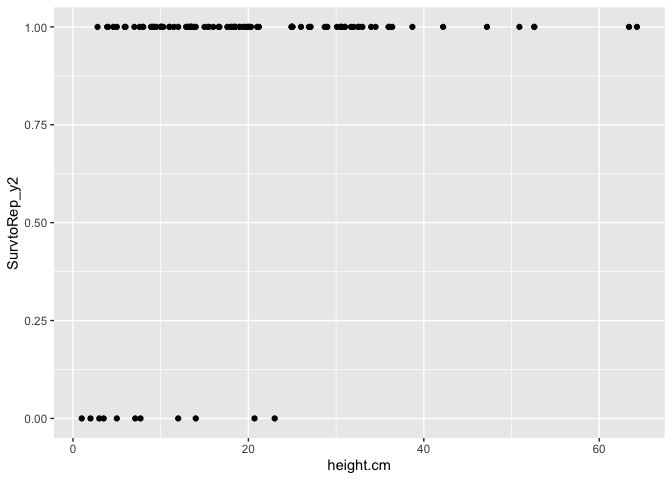<!-- -->

``` r
wl2_surv_to_rep_y2_size %>% 
  ggplot(aes(x=long.leaf.cm, y=SurvtoRep_y2)) +
  geom_point()
```

```
## Warning: Removed 35 rows containing missing values or values outside the scale range
## (`geom_point()`).
```

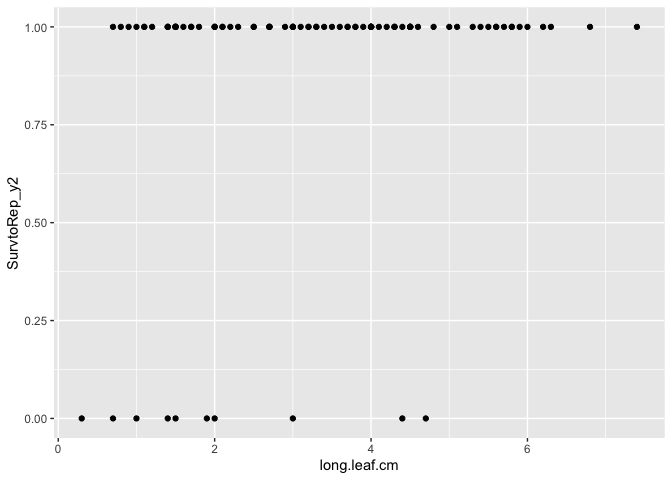<!-- -->

``` r
wl2_surv_to_rep_y2_size %>% #prob not enough var in surv
  ggplot(aes(x=diam.mm, y=SurvtoRep_y2)) +
  geom_point()
```

```
## Warning: Removed 50 rows containing missing values or values outside the scale range
## (`geom_point()`).
```

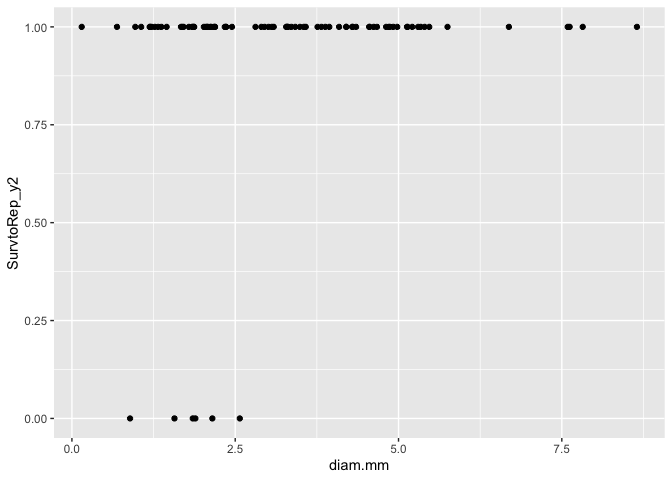<!-- -->

``` r
wl2_surv_to_rep_y2_size %>% #not enough variation in surv
  ggplot(aes(x=total.branch, y=SurvtoRep_y2)) +
  geom_point()
```

```
## Warning: Removed 51 rows containing missing values or values outside the scale range
## (`geom_point()`).
```

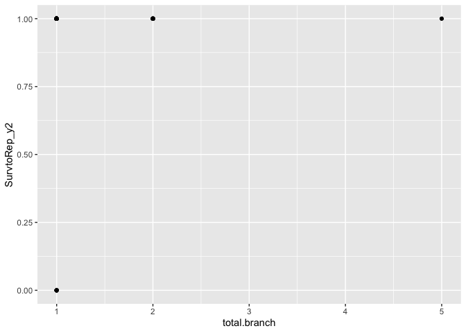<!-- -->

``` r
wl2_surv_to_rep_y2_size %>% #prob not enough var in surv
  ggplot(aes(x=overhd.diam, y=SurvtoRep_y2)) +
  geom_point()
```

```
## Warning: Removed 52 rows containing missing values or values outside the scale range
## (`geom_point()`).
```

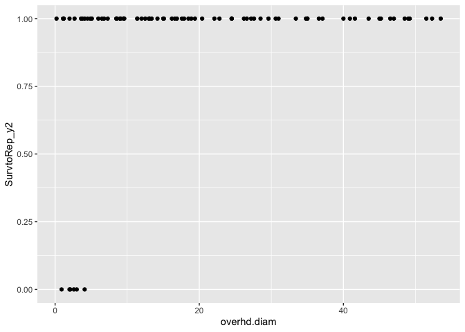<!-- -->

``` r
wl2_surv_to_rep_y2_size %>% #prob not enough var in surv
  ggplot(aes(x=overhd.perp, y=SurvtoRep_y2)) +
  geom_point()
```

```
## Warning: Removed 52 rows containing missing values or values outside the scale range
## (`geom_point()`).
```

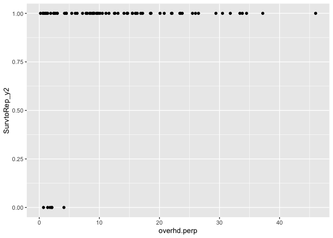<!-- -->

``` r
wl2_surv_to_rep_y2_size %>% filter(SurvtoRep_y2==0, !is.na(overhd.diam)) #only 6 dead indivs with size info (died the day of the census, likely )
```

```
## # A tibble: 6 × 31
##   Pop.Type      loc    bed     row col   pop      mf   rep Genotype block
##   <chr>         <chr>  <chr> <dbl> <chr> <chr> <dbl> <dbl> <chr>    <chr>
## 1 2023-survivor F_8_C  F         8 C     SC        6    12 SC_6_12  J    
## 2 2023-survivor F_44_C F        44 C     IH        4    11 IH_4_11  I    
## 3 2023-survivor I_18_A I        18 A     BH        1     1 BH_1_1   L    
## 4 2023-survivor J_10_A J        10 A     BH        4     2 BH_4_2   M    
## 5 2023-survivor J_15_A J        15 A     YO7       7    11 YO7_7_11 M    
## 6 2023-survivor J_13_C J        13 C     BH        6     2 BH_6_2   M    
## # ℹ 21 more variables: elevation.group <chr>, elev_m <dbl>, Lat <dbl>,
## #   Long <dbl>, GrwSsn_GD_Recent <dbl>, GrwSsn_GD_Historical <dbl>,
## #   Wtr_Year_GD_Recent <dbl>, Wtr_Year_GD_Historical <dbl>,
## #   Geographic_Dist <dbl>, Elev_Dist <dbl>, bud.date <chr>, death.date <chr>,
## #   SurvtoRep_y2 <dbl>, height.cm <dbl>, long.leaf.cm <dbl>, herbiv.y.n <chr>,
## #   survey.notes <chr>, diam.mm <dbl>, total.branch <dbl>, overhd.diam <dbl>,
## #   overhd.perp <dbl>
```

``` r
##Canopy Area 2months post winter 
wl2_surv_to_rep_y2_canopy %>% 
  ggplot(aes(x=canopy_area, y=SurvtoRep_y2)) +
  geom_point()
```

```
## Warning: Removed 38 rows containing missing values or values outside the scale range
## (`geom_point()`).
```

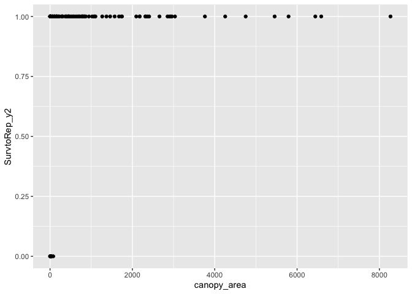<!-- -->

``` r
wl2_surv_to_rep_y2_canopy %>% 
  ggplot(aes(x=overhd.diam, y=SurvtoRep_y2)) +
  geom_point()
```

```
## Warning: Removed 38 rows containing missing values or values outside the scale range
## (`geom_point()`).
```

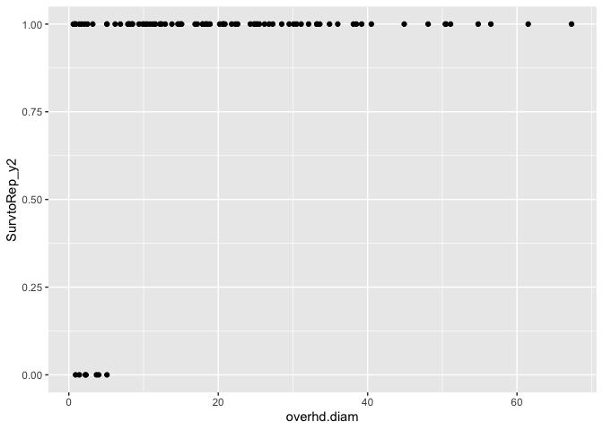<!-- -->

``` r
wl2_surv_to_rep_y2_canopy %>% 
  ggplot(aes(x=overhd.perp, y=SurvtoRep_y2)) +
  geom_point()
```

```
## Warning: Removed 38 rows containing missing values or values outside the scale range
## (`geom_point()`).
```

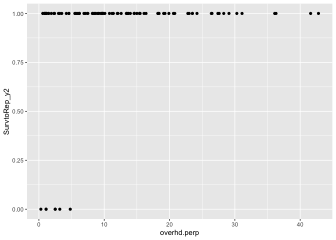<!-- -->

``` r
wl2_surv_to_rep_y2_canopy %>% filter(SurvtoRep_y2==0, !is.na(canopy_area)) #only 7 dead indivs with size info --> not enough to analyze 
```

```
## # A tibble: 7 × 26
##   Pop.Type      loc    bed     row col   pop      mf   rep Genotype block
##   <chr>         <chr>  <chr> <dbl> <chr> <chr> <dbl> <dbl> <chr>    <chr>
## 1 2023-survivor F_8_C  F         8 C     SC        6    12 SC_6_12  J    
## 2 2023-survivor F_44_C F        44 C     IH        4    11 IH_4_11  I    
## 3 2023-survivor H_5_A  H         5 A     SC        4     1 SC_4_1   L    
## 4 2023-survivor I_18_A I        18 A     BH        1     1 BH_1_1   L    
## 5 2023-survivor J_10_A J        10 A     BH        4     2 BH_4_2   M    
## 6 2023-survivor J_15_A J        15 A     YO7       7    11 YO7_7_11 M    
## 7 2023-survivor J_13_C J        13 C     BH        6     2 BH_6_2   M    
## # ℹ 16 more variables: elevation.group <chr>, elev_m <dbl>, Lat <dbl>,
## #   Long <dbl>, GrwSsn_GD_Recent <dbl>, GrwSsn_GD_Historical <dbl>,
## #   Wtr_Year_GD_Recent <dbl>, Wtr_Year_GD_Historical <dbl>,
## #   Geographic_Dist <dbl>, Elev_Dist <dbl>, bud.date <chr>, death.date <chr>,
## #   SurvtoRep_y2 <dbl>, overhd.diam <dbl>, overhd.perp <dbl>, canopy_area <dbl>
```


``` r
wl2_size_surv_pop_avgs <- wl2_surv_to_rep_y2_size %>% 
  group_by(pop, elev_m) %>% 
  summarise(N_Surv = sum(!is.na(SurvtoRep_y2)), 
            mean_Surv = mean(SurvtoRep_y2,na.rm=(TRUE)), sem_surv=sem(SurvtoRep_y2, na.rm=(TRUE)), 
            N_height = sum(!is.na(height.cm)), 
            mean_height.cm = mean(height.cm,na.rm=(TRUE)), sem_height.cm=sem(height.cm, na.rm=(TRUE)), 
            N_length = sum(!is.na(long.leaf.cm)),
            mean_long.leaf.cm=mean(long.leaf.cm, na.rm=(TRUE)), sem_long.leaf.cm=sem(long.leaf.cm, na.rm=TRUE),
            N_diam = sum(!is.na(diam.mm)), 
            mean_diam.mm = mean(diam.mm,na.rm=(TRUE)), sem_diam.mm=sem(diam.mm, na.rm=(TRUE)), 
            N_total.branch = sum(!is.na(total.branch)),
            mean_total.branch=mean(total.branch, na.rm=(TRUE)), sem_total.branch=sem(total.branch, na.rm=TRUE),
            N_overhd.diam = sum(!is.na(overhd.diam)), 
            mean_overhd.diam = mean(overhd.diam,na.rm=(TRUE)), sem_overhd.diam=sem(overhd.diam, na.rm=(TRUE)), 
            N_overhd.perp = sum(!is.na(overhd.perp)),
            mean_overhd.perp=mean(overhd.perp, na.rm=(TRUE)), sem_overhd.perp=sem(overhd.perp, na.rm=TRUE))
```

```
## `summarise()` has grouped output by 'pop'. You can override using the `.groups`
## argument.
```

``` r
wl2_size_surv_pop_avgs %>% arrange(N_height)
```

```
## # A tibble: 10 × 23
## # Groups:   pop [10]
##    pop   elev_m N_Surv mean_Surv sem_surv N_height mean_height.cm sem_height.cm
##    <chr>  <dbl>  <int>     <dbl>    <dbl>    <int>          <dbl>         <dbl>
##  1 LV1    2593.      1     0      NA             0          NaN           NA   
##  2 SQ1    1921.      1     1      NA             1            9.2         NA   
##  3 WR     1158       1     1      NA             1           25           NA   
##  4 TM2     379.      6     0.667   0.211         4           25.5          9.38
##  5 WL2    2020.      6     0.833   0.167         6           13.4          3.58
##  6 CC      313      17     0.824   0.0953       13           21.7          2.87
##  7 SC      422.     22     0.636   0.105        15           25.5          4.99
##  8 YO7    2470.     18     0.889   0.0762       17            9.6          1.13
##  9 BH      511.     29     0.690   0.0874       23           23.9          2.82
## 10 IH      454.     34     0.588   0.0857       23           20.5          2.07
## # ℹ 15 more variables: N_length <int>, mean_long.leaf.cm <dbl>,
## #   sem_long.leaf.cm <dbl>, N_diam <int>, mean_diam.mm <dbl>,
## #   sem_diam.mm <dbl>, N_total.branch <int>, mean_total.branch <dbl>,
## #   sem_total.branch <dbl>, N_overhd.diam <int>, mean_overhd.diam <dbl>,
## #   sem_overhd.diam <dbl>, N_overhd.perp <int>, mean_overhd.perp <dbl>,
## #   sem_overhd.perp <dbl>
```


``` r
wl2_surv_to_rep_y2_size %>% 
  drop_na(SurvtoRep_y2, height.cm) %>% 
  group_by(pop, elev_m) %>% 
  summarise(N_Surv = sum(!is.na(SurvtoRep_y2)), 
            mean_Surv = mean(SurvtoRep_y2,na.rm=(TRUE)), sem_surv=sem(SurvtoRep_y2, na.rm=(TRUE)), 
            N_height = sum(!is.na(height.cm)), 
            mean_height.cm = mean(height.cm,na.rm=(TRUE)), sem_height.cm=sem(height.cm, na.rm=(TRUE))) %>% 
  filter(N_height>2) %>% 
  ggplot(aes(x=mean_height.cm, y=mean_Surv, group=pop, color=elev_m)) +
  geom_point(size=4) +
  theme_classic() + 
  scale_colour_gradient(low = "#F5A540", high = "#0043F0")  +
  labs(x="Height (cm)", y="Survival to Budding Y2", color="Elevation (m)") +
  theme(text=element_text(size=25))
```

```
## `summarise()` has grouped output by 'pop'. You can override using the `.groups`
## argument.
```

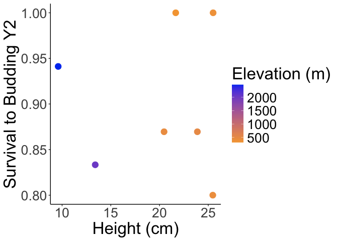<!-- -->

``` r
wl2_surv_to_rep_y2_size %>% 
  drop_na(SurvtoRep_y2, long.leaf.cm) %>% 
  group_by(pop, elev_m) %>% 
  summarise(N_Surv = sum(!is.na(SurvtoRep_y2)), 
            mean_Surv = mean(SurvtoRep_y2,na.rm=(TRUE)), sem_surv=sem(SurvtoRep_y2, na.rm=(TRUE)), 
            N_length = sum(!is.na(long.leaf.cm)),
            mean_long.leaf.cm=mean(long.leaf.cm, na.rm=(TRUE)), sem_long.leaf.cm=sem(long.leaf.cm, na.rm=TRUE)) %>% 
  filter(N_length>2) %>% 
  ggplot(aes(x=mean_long.leaf.cm, y=mean_Surv, group=pop, color=elev_m)) +
  geom_point(size=4) +
  scale_y_continuous(expand = c(0.01, 0.01)) +
  theme_classic() + 
  scale_colour_gradient(low = "#F5A540", high = "#0043F0")  +
  labs(x="Leaf Length (cm)" ,y="Survival to Budding Y2", color="Elevation (m)") +
  theme(text=element_text(size=25))
```

```
## `summarise()` has grouped output by 'pop'. You can override using the `.groups`
## argument.
```

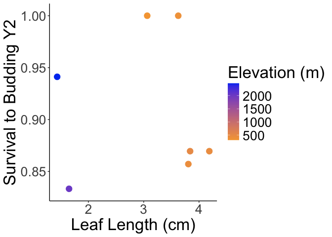<!-- -->

``` r
wl2_surv_to_rep_y2_size %>% 
  drop_na(SurvtoRep_y2, diam.mm) %>% 
  group_by(pop, elev_m) %>% 
  summarise(N_Surv = sum(!is.na(SurvtoRep_y2)), 
            mean_Surv = mean(SurvtoRep_y2,na.rm=(TRUE)), sem_surv=sem(SurvtoRep_y2, na.rm=(TRUE)), 
            N_diam = sum(!is.na(diam.mm)), 
            mean_diam.mm = mean(diam.mm,na.rm=(TRUE)), sem_diam.mm=sem(diam.mm, na.rm=(TRUE))) %>% 
  filter(N_diam>2) %>% 
  ggplot(aes(x=mean_diam.mm, y=mean_Surv, group=pop, color=elev_m)) +
  geom_point(size=4) +
  scale_y_continuous(expand = c(0.01, 0.01)) +
  theme_classic() + 
  scale_colour_gradient(low = "#F5A540", high = "#0043F0")  +
  labs(x="Stem Diameter (mm)" ,y="Survival to Budding Y2", color="Elevation (m)") +
  theme(text=element_text(size=25))
```

```
## `summarise()` has grouped output by 'pop'. You can override using the `.groups`
## argument.
```

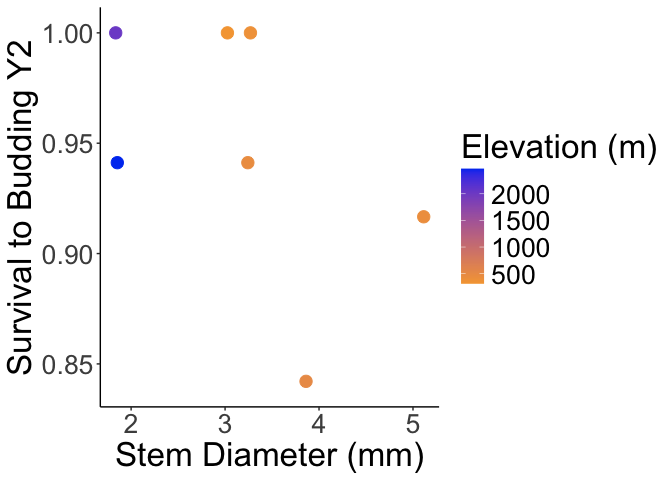<!-- -->

``` r
wl2_surv_to_rep_y2_size %>% 
  drop_na(SurvtoRep_y2, total.branch) %>% 
  group_by(pop, elev_m) %>% 
  summarise(N_Surv = sum(!is.na(SurvtoRep_y2)), 
            mean_Surv = mean(SurvtoRep_y2,na.rm=(TRUE)), sem_surv=sem(SurvtoRep_y2, na.rm=(TRUE)), 
            N_total.branch = sum(!is.na(total.branch)),
            mean_total.branch=mean(total.branch, na.rm=(TRUE)), sem_total.branch=sem(total.branch, na.rm=TRUE)) %>% 
  filter(N_total.branch>2) %>% 
  ggplot(aes(x=mean_total.branch, y=mean_Surv, group=pop, color=elev_m)) +
  geom_point(size=4) +
  scale_y_continuous(expand = c(0.01, 0.01)) +
  theme_classic() +
  scale_colour_gradient(low = "#F5A540", high = "#0043F0")  +
  labs(x="Basal Branch N" ,y="Survival to Budding Y2", color="Elevation (m)") +
  theme(text=element_text(size=25))
```

```
## `summarise()` has grouped output by 'pop'. You can override using the `.groups`
## argument.
```

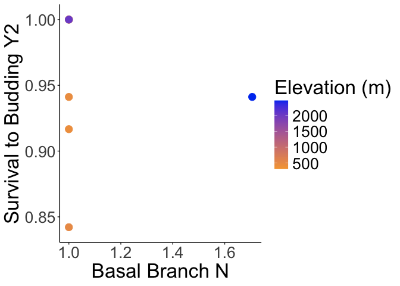<!-- -->

``` r
wl2_surv_to_rep_y2_size %>% 
  drop_na(SurvtoRep_y2, overhd.diam) %>% 
  group_by(pop, elev_m) %>% 
  summarise(N_Surv = sum(!is.na(SurvtoRep_y2)), 
            mean_Surv = mean(SurvtoRep_y2,na.rm=(TRUE)), sem_surv=sem(SurvtoRep_y2, na.rm=(TRUE)), 
            N_overhd.diam = sum(!is.na(overhd.diam)), 
            mean_overhd.diam = mean(overhd.diam,na.rm=(TRUE)), sem_overhd.diam=sem(overhd.diam, na.rm=(TRUE))) %>% 
  filter(N_overhd.diam>2) %>% 
  ggplot(aes(x=mean_overhd.diam, y=mean_Surv, group=pop, color=elev_m)) +
  geom_point(size=4) +
  scale_y_continuous(expand = c(0.01, 0.01)) +
  theme_classic() + 
  scale_colour_gradient(low = "#F5A540", high = "#0043F0")  +
  labs(x="Over-head Diameter (cm)" ,y="Survival to Budding Y2", color="Elevation (m)") +
  theme(text=element_text(size=25))
```

```
## `summarise()` has grouped output by 'pop'. You can override using the `.groups`
## argument.
```

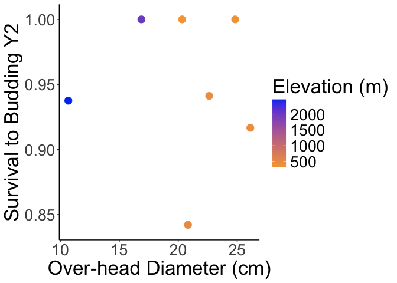<!-- -->

``` r
wl2_surv_to_rep_y2_size %>% 
  drop_na(SurvtoRep_y2, overhd.perp) %>% 
  group_by(pop, elev_m) %>% 
  summarise(N_Surv = sum(!is.na(SurvtoRep_y2)), 
            mean_Surv = mean(SurvtoRep_y2,na.rm=(TRUE)), sem_surv=sem(SurvtoRep_y2, na.rm=(TRUE)), 
            N_overhd.perp = sum(!is.na(overhd.perp)),
            mean_overhd.perp=mean(overhd.perp, na.rm=(TRUE)), sem_overhd.perp=sem(overhd.perp, na.rm=TRUE)) %>% 
  filter(N_overhd.perp>2) %>% 
  ggplot(aes(x=mean_overhd.perp, y=mean_Surv, group=pop, color=elev_m)) +
  geom_point(size=4) +
  scale_y_continuous(expand = c(0.01, 0.01)) +
  theme_classic() +
  scale_colour_gradient(low = "#F5A540", high = "#0043F0")  +
  labs(x="Over-head Perp-Diameter (cm)" ,y="Survival to Budding Y2", color="Elevation (m)") +
  theme(text=element_text(size=25))
```

```
## `summarise()` has grouped output by 'pop'. You can override using the `.groups`
## argument.
```

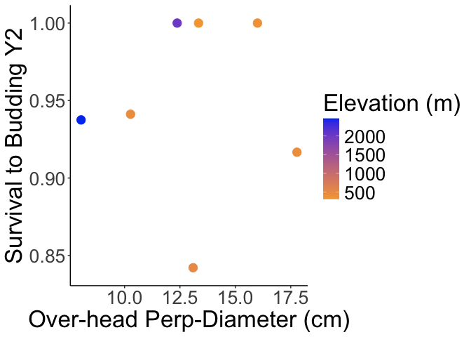<!-- -->

### Stats

Log Reg survival \~ size

#### Check for correlations between traits


``` r
size_normalized_wl2 <- wl2_surv_to_rep_y2_size %>% 
  select(height.cm, long.leaf.cm, diam.mm, total.branch, overhd.diam, overhd.perp) %>% 
  drop_na(height.cm, long.leaf.cm, diam.mm, total.branch, overhd.diam, overhd.perp) %>% scale() #normalize the data so they're all on the same scale
#head(size_normalized_wl2)
cor.norm_wl2 = cor(size_normalized_wl2) #test correlations among the traits
cor.sig_wl2 <- cor.mtest(size_normalized_wl2, method="pearson") #test significance of corrs
corrplot(cor.norm_wl2, type = "upper",
         tl.srt = 45, p.mat = cor.sig_wl2$p, 
         sig.level = 0.05, insig="blank")  
```

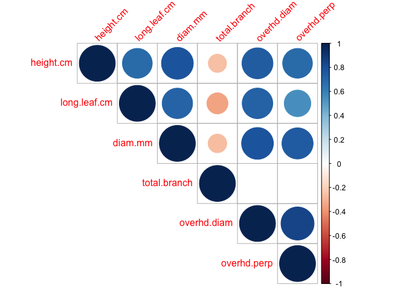<!-- -->

``` r
cor.norm_wl2
```

```
##               height.cm long.leaf.cm    diam.mm total.branch overhd.diam
## height.cm     1.0000000    0.6882307  0.7832817   -0.2578290   0.7419401
## long.leaf.cm  0.6882307    1.0000000  0.7162108   -0.3432640   0.7232007
## diam.mm       0.7832817    0.7162108  1.0000000   -0.2698633   0.7813298
## total.branch -0.2578290   -0.3432640 -0.2698633    1.0000000  -0.1953430
## overhd.diam   0.7419401    0.7232007  0.7813298   -0.1953430   1.0000000
## overhd.perp   0.6846704    0.5471011  0.7505621   -0.1695879   0.8457311
##              overhd.perp
## height.cm      0.6846704
## long.leaf.cm   0.5471011
## diam.mm        0.7505621
## total.branch  -0.1695879
## overhd.diam    0.8457311
## overhd.perp    1.0000000
```

``` r
cor.sig_wl2$p
```

```
##                 height.cm long.leaf.cm      diam.mm total.branch  overhd.diam
## height.cm    0.000000e+00 1.738872e-12 9.010167e-18  0.020944463 3.445082e-15
## long.leaf.cm 1.738872e-12 0.000000e+00 8.119739e-14  0.001825627 3.564121e-14
## diam.mm      9.010167e-18 8.119739e-14 0.000000e+00  0.015484692 1.227704e-17
## total.branch 2.094446e-02 1.825627e-03 1.548469e-02  0.000000000 8.248005e-02
## overhd.diam  3.445082e-15 3.564121e-14 1.227704e-17  0.082480055 0.000000e+00
## overhd.perp  2.505959e-12 1.512870e-07 1.097633e-15  0.132611206 5.604797e-23
##               overhd.perp
## height.cm    2.505959e-12
## long.leaf.cm 1.512870e-07
## diam.mm      1.097633e-15
## total.branch 1.326112e-01
## overhd.diam  5.604797e-23
## overhd.perp  0.000000e+00
```

``` r
#overhead.diam and perp 85% correlated
#stem diam is 78% and 75% corr with overhead.diam and perp
#leaf length is 72%, 72%, 55% corr with diam, overhd.diam, perp
#height is 69%, 78%, 74%, 68% corr with length, diam, overhd.diam, perp
```


``` r
wl2_surv_to_rep_y2_height_formod <- wl2_surv_to_rep_y2_size %>% 
  drop_na(SurvtoRep_y2, height.cm) %>% 
  filter(pop!="LV1", pop!="SQ1", pop!="WR")

wl2_surv_to_rep_y2_length_formod <- wl2_surv_to_rep_y2_size %>% 
  drop_na(SurvtoRep_y2, long.leaf.cm) %>% 
  filter(pop!="LV1", pop!="SQ1", pop!="WR")

wl2_surv_to_rep_y2_diam_formod <- wl2_surv_to_rep_y2_size %>% 
  drop_na(SurvtoRep_y2, diam.mm) %>% 
  filter(pop!="LV1", pop!="SQ1", pop!="WR")

wl2_surv_to_rep_y2_overhd.diam_formod <- wl2_surv_to_rep_y2_size %>% 
  drop_na(SurvtoRep_y2, overhd.diam) %>% 
  filter(pop!="LV1", pop!="SQ1", pop!="WR")
```

#### Height


``` r
wl2_basiclogit_height <- glm(SurvtoRep_y2 ~ height.cm, data = wl2_surv_to_rep_y2_height_formod, family = "binomial")
summary(wl2_basiclogit_height)
```

```
## 
## Call:
## glm(formula = SurvtoRep_y2 ~ height.cm, family = "binomial", 
##     data = wl2_surv_to_rep_y2_height_formod)
## 
## Coefficients:
##             Estimate Std. Error z value Pr(>|z|)   
## (Intercept) -0.05116    0.65826  -0.078  0.93805   
## height.cm    0.15849    0.05649   2.805  0.00502 **
## ---
## Signif. codes:  0 '***' 0.001 '**' 0.01 '*' 0.05 '.' 0.1 ' ' 1
## 
## (Dispersion parameter for binomial family taken to be 1)
## 
##     Null deviance: 69.535  on 100  degrees of freedom
## Residual deviance: 55.589  on  99  degrees of freedom
## AIC: 59.589
## 
## Number of Fisher Scoring iterations: 7
```

``` r
wl2_logit_height2 <- glmer(SurvtoRep_y2 ~ height.cm + (1|pop) + (1|block), data = wl2_surv_to_rep_y2_height_formod, family = binomial(link = "logit")) #, nAGQ=0) 
```

```
## boundary (singular) fit: see help('isSingular')
```

``` r
summary(wl2_logit_height2)
```

```
## Generalized linear mixed model fit by maximum likelihood (Laplace
##   Approximation) [glmerMod]
##  Family: binomial  ( logit )
## Formula: SurvtoRep_y2 ~ height.cm + (1 | pop) + (1 | block)
##    Data: wl2_surv_to_rep_y2_height_formod
## 
##      AIC      BIC   logLik deviance df.resid 
##     63.1     73.5    -27.5     55.1       97 
## 
## Scaled residuals: 
##     Min      1Q  Median      3Q     Max 
## -5.7768  0.0632  0.1891  0.3841  0.9849 
## 
## Random effects:
##  Groups Name        Variance Std.Dev.
##  block  (Intercept) 0.0000   0.0000  
##  pop    (Intercept) 0.3368   0.5803  
## Number of obs: 101, groups:  block, 13; pop, 7
## 
## Fixed effects:
##             Estimate Std. Error z value Pr(>|z|)   
## (Intercept)  -0.1777     0.7463  -0.238  0.81175   
## height.cm     0.1760     0.0639   2.754  0.00588 **
## ---
## Signif. codes:  0 '***' 0.001 '**' 0.01 '*' 0.05 '.' 0.1 ' ' 1
## 
## Correlation of Fixed Effects:
##           (Intr)
## height.cm -0.804
## optimizer (Nelder_Mead) convergence code: 0 (OK)
## boundary (singular) fit: see help('isSingular')
```

``` r
#boundary (singular) fit: see help('isSingular') block explains 0 var
#sig relat, estimate = 0.1760
```

#### Length


``` r
wl2_logit_length2 <- glmer(SurvtoRep_y2 ~ long.leaf.cm + (1|pop) + (1|block), data = wl2_surv_to_rep_y2_length_formod, family = binomial(link = "logit")) 
```

```
## boundary (singular) fit: see help('isSingular')
```

``` r
summary(wl2_logit_length2)
```

```
## Generalized linear mixed model fit by maximum likelihood (Laplace
##   Approximation) [glmerMod]
##  Family: binomial  ( logit )
## Formula: SurvtoRep_y2 ~ long.leaf.cm + (1 | pop) + (1 | block)
##    Data: wl2_surv_to_rep_y2_length_formod
## 
##      AIC      BIC   logLik deviance df.resid 
##     65.0     75.3    -28.5     57.0       94 
## 
## Scaled residuals: 
##     Min      1Q  Median      3Q     Max 
## -5.8358  0.1370  0.2217  0.3618  0.7804 
## 
## Random effects:
##  Groups Name        Variance  Std.Dev. 
##  block  (Intercept) 2.639e-10 1.624e-05
##  pop    (Intercept) 5.846e-01 7.646e-01
## Number of obs: 98, groups:  block, 13; pop, 7
## 
## Fixed effects:
##              Estimate Std. Error z value Pr(>|z|)  
## (Intercept)   0.03539    0.91901   0.039   0.9693  
## long.leaf.cm  0.86951    0.39130   2.222   0.0263 *
## ---
## Signif. codes:  0 '***' 0.001 '**' 0.01 '*' 0.05 '.' 0.1 ' ' 1
## 
## Correlation of Fixed Effects:
##             (Intr)
## long.lef.cm -0.838
## optimizer (Nelder_Mead) convergence code: 0 (OK)
## boundary (singular) fit: see help('isSingular')
```

``` r
#boundary (singular) fit: see help('isSingular') block explains little var
#sig relat, estimate = 0.86951
```

#### Stem Diameter


``` r
wl2_logit_diam2 <- glmer(SurvtoRep_y2 ~ diam.mm + (1|pop) + (1|block), data = wl2_surv_to_rep_y2_diam_formod, family = binomial(link = "logit")) 
```

```
## boundary (singular) fit: see help('isSingular')
```

``` r
summary(wl2_logit_diam2)
```

```
## Generalized linear mixed model fit by maximum likelihood (Laplace
##   Approximation) [glmerMod]
##  Family: binomial  ( logit )
## Formula: SurvtoRep_y2 ~ diam.mm + (1 | pop) + (1 | block)
##    Data: wl2_surv_to_rep_y2_diam_formod
## 
##      AIC      BIC   logLik deviance df.resid 
##     43.9     53.6    -18.0     35.9       79 
## 
## Scaled residuals: 
##      Min       1Q   Median       3Q      Max 
## -3.12165  0.06257  0.13327  0.26317  0.68685 
## 
## Random effects:
##  Groups Name        Variance Std.Dev.
##  block  (Intercept) 0.000    0.00    
##  pop    (Intercept) 1.588    1.26    
## Number of obs: 83, groups:  block, 13; pop, 7
## 
## Fixed effects:
##             Estimate Std. Error z value Pr(>|z|)  
## (Intercept)  -0.2211     1.4024  -0.158    0.875  
## diam.mm       1.3730     0.7658   1.793    0.073 .
## ---
## Signif. codes:  0 '***' 0.001 '**' 0.01 '*' 0.05 '.' 0.1 ' ' 1
## 
## Correlation of Fixed Effects:
##         (Intr)
## diam.mm -0.824
## optimizer (Nelder_Mead) convergence code: 0 (OK)
## boundary (singular) fit: see help('isSingular')
```

``` r
#boundary (singular) fit: see help('isSingular') block explains 0 var
#marg relat estiamte =  1.3730 
```

#### Overhead diam


``` r
wl2_logit_overhd.diam2 <- glmer(SurvtoRep_y2 ~ overhd.diam + (1|pop) + (1|block), data = wl2_surv_to_rep_y2_overhd.diam_formod, family = binomial(link = "logit")) 
```

```
## boundary (singular) fit: see help('isSingular')
```

``` r
summary(wl2_logit_overhd.diam2)
```

```
## Generalized linear mixed model fit by maximum likelihood (Laplace
##   Approximation) [glmerMod]
##  Family: binomial  ( logit )
## Formula: SurvtoRep_y2 ~ overhd.diam + (1 | pop) + (1 | block)
##    Data: wl2_surv_to_rep_y2_overhd.diam_formod
## 
##      AIC      BIC   logLik deviance df.resid 
##     30.9     40.5    -11.5     22.9       77 
## 
## Scaled residuals: 
##      Min       1Q   Median       3Q      Max 
## -2.13697  0.00000  0.00067  0.05638  0.71456 
## 
## Random effects:
##  Groups Name        Variance  Std.Dev. 
##  block  (Intercept) 2.859e+00 1.691e+00
##  pop    (Intercept) 1.466e-09 3.829e-05
## Number of obs: 81, groups:  block, 13; pop, 7
## 
## Fixed effects:
##             Estimate Std. Error z value Pr(>|z|)
## (Intercept)  -0.9468     1.5826  -0.598    0.550
## overhd.diam   0.8010     0.5801   1.381    0.167
## 
## Correlation of Fixed Effects:
##             (Intr)
## overhd.diam -0.785
## optimizer (Nelder_Mead) convergence code: 0 (OK)
## boundary (singular) fit: see help('isSingular')
```

``` r
#boundary (singular) fit: see help('isSingular') pop explains little var
#no sig relat
```
