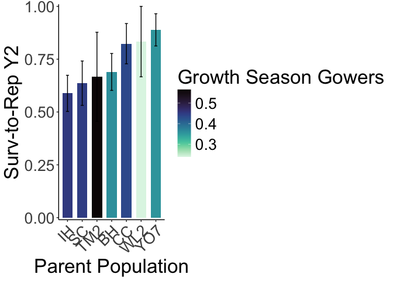

# Survival to Bolting Year 2 at WL2

## Libraries

``` r
library(tidyverse)
```

```
## ── Attaching core tidyverse packages ──────────────────────── tidyverse 2.0.0 ──
## ✔ dplyr     1.1.4     ✔ readr     2.1.5
## ✔ forcats   1.0.0     ✔ stringr   1.5.1
## ✔ ggplot2   3.5.1     ✔ tibble    3.2.1
## ✔ lubridate 1.9.3     ✔ tidyr     1.3.1
## ✔ purrr     1.0.2     
## ── Conflicts ────────────────────────────────────────── tidyverse_conflicts() ──
## ✖ dplyr::filter() masks stats::filter()
## ✖ dplyr::lag()    masks stats::lag()
## ℹ Use the conflicted package (<http://conflicted.r-lib.org/>) to force all conflicts to become errors
```

``` r
library(magrittr)
```

```
## 
## Attaching package: 'magrittr'
## 
## The following object is masked from 'package:purrr':
## 
##     set_names
## 
## The following object is masked from 'package:tidyr':
## 
##     extract
```

``` r
#conflicted::conflicts_prefer(dplyr::filter)
library(viridis) #for pretty colors
```

```
## Loading required package: viridisLite
```

``` r
library(ggrepel) #for non-overlapping labels on plots
library(ggdist) #visualizations of distributions and uncertainty 
library(ggpubr)

#library(sp) #for calculating geographic distance 
library(geosphere) #for calculating geographic distance
library(corrplot) #plotting correlations  
```

```
## corrplot 0.94 loaded
```

``` r
library(rstatix) #performing cor_test
```

```
## 
## Attaching package: 'rstatix'
## 
## The following object is masked from 'package:stats':
## 
##     filter
```

``` r
library(lmerTest) #mixed models
```

```
## Loading required package: lme4
## Loading required package: Matrix
## 
## Attaching package: 'Matrix'
## 
## The following objects are masked from 'package:tidyr':
## 
##     expand, pack, unpack
## 
## 
## Attaching package: 'lmerTest'
## 
## The following object is masked from 'package:lme4':
## 
##     lmer
## 
## The following object is masked from 'package:stats':
## 
##     step
```

``` r
conflicted::conflicts_prefer(lmerTest::lmer)
```

```
## [conflicted] Will prefer lmerTest::lmer over any other package.
```

``` r
library(broom.mixed)
library(tidymodels)
```

```
## ── Attaching packages ────────────────────────────────────── tidymodels 1.2.0 ──
## ✔ broom        1.0.7     ✔ rsample      1.2.1
## ✔ dials        1.3.0     ✔ tune         1.2.1
## ✔ infer        1.0.7     ✔ workflows    1.1.4
## ✔ modeldata    1.4.0     ✔ workflowsets 1.1.0
## ✔ parsnip      1.2.1     ✔ yardstick    1.3.1
## ✔ recipes      1.1.0     
## ── Conflicts ───────────────────────────────────────── tidymodels_conflicts() ──
## ✖ infer::chisq_test()   masks rstatix::chisq_test()
## ✖ scales::discard()     masks purrr::discard()
## ✖ Matrix::expand()      masks tidyr::expand()
## ✖ magrittr::extract()   masks tidyr::extract()
## ✖ rstatix::filter()     masks dplyr::filter(), stats::filter()
## ✖ recipes::fixed()      masks stringr::fixed()
## ✖ dials::get_n()        masks rstatix::get_n()
## ✖ dplyr::lag()          masks stats::lag()
## ✖ Matrix::pack()        masks tidyr::pack()
## ✖ infer::prop_test()    masks rstatix::prop_test()
## ✖ magrittr::set_names() masks purrr::set_names()
## ✖ yardstick::spec()     masks readr::spec()
## ✖ recipes::step()       masks lmerTest::step(), stats::step()
## ✖ infer::t_test()       masks rstatix::t_test()
## ✖ Matrix::unpack()      masks tidyr::unpack()
## ✖ recipes::update()     masks Matrix::update(), stats::update()
## • Learn how to get started at https://www.tidymodels.org/start/
```

``` r
library(furrr) #Apply Mapping Functions in Parallel using Futures
```

```
## Loading required package: future
```

``` r
tidymodels_prefer()
# install.packages("multilevelmod")
library(multilevelmod)

library(brms)
```

```
## Loading required package: Rcpp
## 
## Attaching package: 'Rcpp'
## 
## The following object is masked from 'package:rsample':
## 
##     populate
## 
## Loading 'brms' package (version 2.22.0). Useful instructions
## can be found by typing help('brms'). A more detailed introduction
## to the package is available through vignette('brms_overview').
```

``` r
#conflicted::conflicts_prefer(brms::ar)
#conflicted::conflicts_prefer(dplyr::combine)
#conflicted::conflicts_prefer(brms::dstudent_t)
library(tidybayes) #for extracting and visiaulizing brms model output 
library(modelr) #for data grid

sem <- function(x, na.rm=FALSE) {           #for caclulating standard error
  sd(x,na.rm=na.rm)/sqrt(length(na.omit(x)))
} 

cbbPalette2 <- c("#E69F00","#000000", "#56B4E9","#009E73", "#F0E442", "#0072B2", "#D55E00", "#CC79A7")
timepd_palette <- c("#56B4E9","#D55E00")

options(mc.cores = parallel::detectCores())
```

## Year 2 Pop Info

``` r
wl2_y2_pops <- read_csv("../input/WL2_Data/Final_2023_2024_Pop_Loc_Info.csv") %>%
  select(Pop.Type:unique.ID) %>% 
  filter(Pop.Type=="2023-survivor") %>% 
  select(Pop.Type, loc:bed, row=bedrow, col=bedcol, pop:unique.ID)
```

```
## Rows: 1217 Columns: 15
## ── Column specification ────────────────────────────────────────────────────────
## Delimiter: ","
## chr (8): Pop.Type, status, block, loc, bed, bedcol, pop, unique.ID
## dbl (7): bed.block.order, bed.order, AB.CD.order, column.order, bedrow, mf, rep
## 
## ℹ Use `spec()` to retrieve the full column specification for this data.
## ℹ Specify the column types or set `show_col_types = FALSE` to quiet this message.
```

``` r
wl2_blocks <- read_csv("../input/WL2_Data/CorrectedCSVs/WL2_mort_pheno_20231020_corrected.csv") %>% 
  select(block, pop, mf, rep) %>% #add in block info 
  mutate(mf=as.double(mf), rep=as.double(rep)) #convert to num
```

```
## Rows: 1826 Columns: 14
## ── Column specification ────────────────────────────────────────────────────────
## Delimiter: ","
## chr (12): block, bed, bed.col, pop, mf, rep, bud.date, flower.date, fruit.da...
## dbl  (1): bed.row
## lgl  (1): last.fruit.date
## 
## ℹ Use `spec()` to retrieve the full column specification for this data.
## ℹ Specify the column types or set `show_col_types = FALSE` to quiet this message.
```

```
## Warning: There were 2 warnings in `mutate()`.
## The first warning was:
## ℹ In argument: `mf = as.double(mf)`.
## Caused by warning:
## ! NAs introduced by coercion
## ℹ Run `dplyr::last_dplyr_warnings()` to see the 1 remaining warning.
```

``` r
#wl2_blocks %>% rowwise() %>%  #checking if mf and rep can be converted to numeric (all buffers)
#  filter(!is.na(mf)) %>%  
#  filter(is.na(as.numeric(mf)))

wl2_y2_pops_blocks <- left_join(wl2_y2_pops, wl2_blocks)
```

```
## Joining with `by = join_by(pop, mf, rep)`
```

## Year 2 Surv Data

``` r
wl2_20241023 <- read_csv("../input/WL2_Data/WL2_mort_pheno_20241023_corrected.csv") %>% #note this has 2023 and 2024 plants
  select(-block)
```

```
## Rows: 1217 Columns: 13
## ── Column specification ────────────────────────────────────────────────────────
## Delimiter: ","
## chr (12): block, bed, col, unique.ID, bud.date, flower.date, fruit.date, las...
## dbl  (1): row
## 
## ℹ Use `spec()` to retrieve the full column specification for this data.
## ℹ Specify the column types or set `show_col_types = FALSE` to quiet this message.
```

``` r
wl2_surv_y2 <- left_join(wl2_y2_pops_blocks, wl2_20241023) %>%  
  rename(Genotype=unique.ID)
```

```
## Joining with `by = join_by(bed, row, col, unique.ID)`
```

``` r
#unique(wl2_surv_y2$pop) #only 10 pops with winter surv 
```

## Gower's Distance

``` r
garden_climate <- read_csv("../output/Climate/flint_climate_UCDpops.csv") %>% 
  filter(parent.pop=="WL2_Garden" | parent.pop=="UCD_Garden") %>% 
  select(parent.pop:Long) %>% 
  distinct()
```

```
## Rows: 38775 Columns: 14
## ── Column specification ────────────────────────────────────────────────────────
## Delimiter: ","
## chr  (3): parent.pop, elevation.group, month
## dbl (11): elev_m, Lat, Long, year, aet, cwd, pck, pet, ppt, tmn, tmx
## 
## ℹ Use `spec()` to retrieve the full column specification for this data.
## ℹ Specify the column types or set `show_col_types = FALSE` to quiet this message.
```

``` r
garden_climate
```

```
## # A tibble: 2 × 5
##   parent.pop elevation.group elev_m   Lat  Long
##   <chr>      <chr>            <dbl> <dbl> <dbl>
## 1 UCD_Garden Low                 16  38.5 -122.
## 2 WL2_Garden High              2020  38.8 -120.
```

``` r
#UCD LAT/LONG = 38.53250, -121.7830
#WL2 Lat/Long = 38.82599, -120.2509

wl2_gowers_2024 <- read_csv("../output/Climate/Gowers_WL2_2024.csv") %>% 
  pivot_wider(names_from = TimePd, values_from = c(GrwSsn_GD, Wtr_Year_GD)) %>% 
  mutate(WL2_Lat=38.82599, WL2_Long=-120.2509, WL2_Elev=2020) %>% 
  mutate(Geographic_Dist=distHaversine(cbind(WL2_Long, WL2_Lat), cbind(Long, Lat)),
         Elev_Dist=WL2_Elev-elev_m) %>% # Calculate the distance using the haversine formula
  rename(pop=parent.pop)
```

```
## Rows: 46 Columns: 8
## ── Column specification ────────────────────────────────────────────────────────
## Delimiter: ","
## chr (3): parent.pop, elevation.group, TimePd
## dbl (5): elev_m, Lat, Long, GrwSsn_GD, Wtr_Year_GD
## 
## ℹ Use `spec()` to retrieve the full column specification for this data.
## ℹ Specify the column types or set `show_col_types = FALSE` to quiet this message.
```

## Calculate Survival to Bolting 

``` r
wl2_surv_y2 %>% filter(!is.na(bud.date), is.na(fruit.date)) #some plants initiated reproduction but did not make fruits
```

```
## # A tibble: 10 × 18
##    Pop.Type    loc   bed     row col   pop      mf   rep Genotype block bud.date
##    <chr>       <chr> <chr> <dbl> <chr> <chr> <dbl> <dbl> <chr>    <chr> <chr>   
##  1 2023-survi… A_14… A        14 D     CC        8     3 CC_8_3   A     6/18/24 
##  2 2023-survi… C_6_A C         6 A     CC        1     6 CC_1_6   D     6/18/24 
##  3 2023-survi… D_3_B D         3 B     IH        5     9 IH_5_9   G     7/2/24  
##  4 2023-survi… D_21… D        21 A     SC        5     9 SC_5_9   G     6/25/24 
##  5 2023-survi… D_25… D        25 C     CC        2     9 CC_2_9   G     7/9/24  
##  6 2023-survi… E_22… E        22 A     IH        2    10 IH_2_10  H     7/16/24 
##  7 2023-survi… E_23… E        23 D     IH        5    10 IH_5_10  H     6/25/24 
##  8 2023-survi… F_7_B F         7 B     IH        1    12 IH_1_12  J     6/25/24 
##  9 2023-survi… F_43… F        43 B     CC        8    11 CC_8_11  I     6/25/24 
## 10 2023-survi… H_11… H        11 B     IH        2     1 IH_2_1   L     7/23/24 
## # ℹ 7 more variables: flower.date <chr>, fruit.date <chr>, last.FL.date <chr>,
## #   last.FR.date <chr>, death.date <chr>, missing.date <chr>,
## #   survey.notes <chr>
```

``` r
#1 plant with a last flower date, but no fruit date, this plant did not make any fruits per the notes 
wl2_surv_y2 %>% filter(!is.na(bud.date), !is.na(death.date))  #bud date and death date for a lot of plants
```

```
## # A tibble: 75 × 18
##    Pop.Type    loc   bed     row col   pop      mf   rep Genotype block bud.date
##    <chr>       <chr> <chr> <dbl> <chr> <chr> <dbl> <dbl> <chr>    <chr> <chr>   
##  1 2023-survi… A_17… A        17 A     BH        7     3 BH_7_3   A     6/18/24 
##  2 2023-survi… A_18… A        18 A     BH        4     3 BH_4_3   A     6/18/24 
##  3 2023-survi… A_24… A        24 A     WL2       7     9 WL2_7_9  A     6/18/24 
##  4 2023-survi… A_32… A        32 B     IH        7     4 IH_7_4   B     6/18/24 
##  5 2023-survi… A_35… A        35 A     SC        8     4 SC_8_4   B     6/18/24 
##  6 2023-survi… A_36… A        36 A     BH        3     4 BH_3_4   B     6/18/24 
##  7 2023-survi… A_39… A        39 B     WL2       7    10 WL2_7_10 B     6/18/24 
##  8 2023-survi… A_45… A        45 B     IH        2     4 IH_2_4   B     7/2/24  
##  9 2023-survi… A_49… A        49 A     YO7       7    23 YO7_7_23 B     6/18/24 
## 10 2023-survi… A_53… A        53 A     CC        4     4 CC_4_4   B     6/18/24 
## # ℹ 65 more rows
## # ℹ 7 more variables: flower.date <chr>, fruit.date <chr>, last.FL.date <chr>,
## #   last.FR.date <chr>, death.date <chr>, missing.date <chr>,
## #   survey.notes <chr>
```

``` r
wl2_surv_y2 %>% filter(is.na(bud.date), !is.na(flower.date)) #3 plants without a bud date, but with a flower date
```

```
## # A tibble: 3 × 18
##   Pop.Type     loc   bed     row col   pop      mf   rep Genotype block bud.date
##   <chr>        <chr> <chr> <dbl> <chr> <chr> <dbl> <dbl> <chr>    <chr> <chr>   
## 1 2023-surviv… B_56… B        56 A     SC        6    15 SC_6_15  B     <NA>    
## 2 2023-surviv… C_2_C C         2 C     SC        5     6 SC_5_6   D     <NA>    
## 3 2023-surviv… F_26… F        26 A     WL2       8     4 WL2_8_4  I     <NA>    
## # ℹ 7 more variables: flower.date <chr>, fruit.date <chr>, last.FL.date <chr>,
## #   last.FR.date <chr>, death.date <chr>, missing.date <chr>,
## #   survey.notes <chr>
```

``` r
wl2_surv_y2 %>% filter(is.na(bud.date), !is.na(fruit.date)) #4 plants without a bud date, but with a fruit date  
```

```
## # A tibble: 4 × 18
##   Pop.Type     loc   bed     row col   pop      mf   rep Genotype block bud.date
##   <chr>        <chr> <chr> <dbl> <chr> <chr> <dbl> <dbl> <chr>    <chr> <chr>   
## 1 2023-surviv… B_56… B        56 A     SC        6    15 SC_6_15  B     <NA>    
## 2 2023-surviv… C_2_C C         2 C     SC        5     6 SC_5_6   D     <NA>    
## 3 2023-surviv… C_2_D C         2 D     CC        9     6 CC_9_6   D     <NA>    
## 4 2023-surviv… F_26… F        26 A     WL2       8     4 WL2_8_4  I     <NA>    
## # ℹ 7 more variables: flower.date <chr>, fruit.date <chr>, last.FL.date <chr>,
## #   last.FR.date <chr>, death.date <chr>, missing.date <chr>,
## #   survey.notes <chr>
```

``` r
wl2_surv_y2 %>% filter(is.na(bud.date), !is.na(last.FL.date)) #same plants as above
```

```
## # A tibble: 4 × 18
##   Pop.Type     loc   bed     row col   pop      mf   rep Genotype block bud.date
##   <chr>        <chr> <chr> <dbl> <chr> <chr> <dbl> <dbl> <chr>    <chr> <chr>   
## 1 2023-surviv… B_56… B        56 A     SC        6    15 SC_6_15  B     <NA>    
## 2 2023-surviv… C_2_C C         2 C     SC        5     6 SC_5_6   D     <NA>    
## 3 2023-surviv… C_2_D C         2 D     CC        9     6 CC_9_6   D     <NA>    
## 4 2023-surviv… F_26… F        26 A     WL2       8     4 WL2_8_4  I     <NA>    
## # ℹ 7 more variables: flower.date <chr>, fruit.date <chr>, last.FL.date <chr>,
## #   last.FR.date <chr>, death.date <chr>, missing.date <chr>,
## #   survey.notes <chr>
```

``` r
wl2_surv_y2 %>% filter(is.na(bud.date), !is.na(last.FR.date)) #same plants as above 
```

```
## # A tibble: 3 × 18
##   Pop.Type     loc   bed     row col   pop      mf   rep Genotype block bud.date
##   <chr>        <chr> <chr> <dbl> <chr> <chr> <dbl> <dbl> <chr>    <chr> <chr>   
## 1 2023-surviv… B_56… B        56 A     SC        6    15 SC_6_15  B     <NA>    
## 2 2023-surviv… C_2_C C         2 C     SC        5     6 SC_5_6   D     <NA>    
## 3 2023-surviv… C_2_D C         2 D     CC        9     6 CC_9_6   D     <NA>    
## # ℹ 7 more variables: flower.date <chr>, fruit.date <chr>, last.FL.date <chr>,
## #   last.FR.date <chr>, death.date <chr>, missing.date <chr>,
## #   survey.notes <chr>
```

``` r
wl2_surv_to_rep_y2 <- wl2_surv_y2 %>% 
  left_join(wl2_gowers_2024) %>% 
  mutate(bud.date=if_else(Genotype=="SC_6_15" | Genotype=="SC_5_6" | 
                            Genotype=="CC_9_6" | Genotype=="WL2_8_4",
                          "Missed", bud.date)) %>% #add in bud date for plants with a later rep date 
  mutate(SurvtoRep_y2=if_else(is.na(bud.date), 0, 1)) %>% 
  select(Pop.Type:block, elevation.group:Wtr_Year_GD_Historical, Geographic_Dist, Elev_Dist, bud.date, death.date, SurvtoRep_y2) 
```

```
## Joining with `by = join_by(pop)`
```

``` r
wl2_surv_to_rep_y2 %>% group_by(pop) %>% summarise(n=n()) %>% arrange(n)
```

```
## # A tibble: 10 × 2
##    pop       n
##    <chr> <int>
##  1 LV1       1
##  2 SQ1       1
##  3 WR        1
##  4 TM2       6
##  5 WL2       6
##  6 CC       18
##  7 YO7      18
##  8 SC       22
##  9 BH       29
## 10 IH       34
```

``` r
#LV1, SQ1, and WR only have 1 indiv alive in 2024

#write_csv(wl2_surv_to_rep_y2, "../output/WL2_Traits/WL2_Surv_to_Rep_Y2.csv")
```

### Bar Plots

``` r
wl2_surv_to_rep_y2 %>% 
  group_by(pop, elev_m, GrwSsn_GD_Recent, Wtr_Year_GD_Recent) %>% 
  summarise(meanSurv=mean(SurvtoRep_y2, na.rm = TRUE), semSurv=sem(SurvtoRep_y2, na.rm=TRUE)) %>% 
  filter(pop != "LV1", pop !="SQ1", pop !="WR") %>% 
  ggplot(aes(x=fct_reorder(pop, meanSurv), y=meanSurv, fill=GrwSsn_GD_Recent)) +
  geom_col(width = 0.7,position = position_dodge(0.75)) + 
  geom_errorbar(aes(ymin=meanSurv-semSurv,ymax=meanSurv+semSurv),width=.2, position = 
                  position_dodge(0.75)) +
  theme_classic() + 
  scale_y_continuous(expand = c(0.01, 0)) +
  labs(y="Surv-to-Rep Y2", x="Parent Population", fill="Growth Season Gowers") +
  scale_fill_viridis(option="mako", direction = -1) +
  theme(text=element_text(size=25), axis.text.x = element_text(angle = 45,  hjust = 1))
```

```
## `summarise()` has grouped output by 'pop', 'elev_m', 'GrwSsn_GD_Recent'. You
## can override using the `.groups` argument.
```

<!-- -->

``` r
#ggsave("../output/WL2_Traits/WL2_SurvtoRepY2_GrwSsn_GD_Recent.png", width = 12, height = 8, units = "in")

wl2_surv_to_rep_y2 %>% 
  group_by(pop, elev_m, GrwSsn_GD_Recent, Wtr_Year_GD_Recent) %>% 
  summarise(meanSurv=mean(SurvtoRep_y2, na.rm = TRUE), semSurv=sem(SurvtoRep_y2, na.rm=TRUE)) %>% 
  filter(pop != "LV1", pop !="SQ1", pop !="WR") %>% 
  ggplot(aes(x=fct_reorder(pop, meanSurv), y=meanSurv, fill=Wtr_Year_GD_Recent)) +
  geom_col(width = 0.7,position = position_dodge(0.75)) + 
  geom_errorbar(aes(ymin=meanSurv-semSurv,ymax=meanSurv+semSurv),width=.2, position = 
                  position_dodge(0.75)) +
  theme_classic() + 
  scale_y_continuous(expand = c(0.01, 0)) +
  labs(y="Surv-to-Rep Y2", x="Parent Population", fill="Water Year Gowers") +
  scale_fill_viridis(option="mako", direction = -1) +
  theme(text=element_text(size=25), axis.text.x = element_text(angle = 45,  hjust = 1))
```

```
## `summarise()` has grouped output by 'pop', 'elev_m', 'GrwSsn_GD_Recent'. You
## can override using the `.groups` argument.
```

<!-- -->

``` r
#ggsave("../output/WL2_Traits/WL2_SurvtoRepY2_Wtr_Year_GD_Recent.png", width = 12, height = 8, units = "in")
```

### Scatterplots

``` r
#scatter plots
GSCD_recent <- wl2_surv_to_rep_y2 %>% 
  group_by(pop, elev_m, GrwSsn_GD_Recent, Wtr_Year_GD_Recent) %>% 
  summarise(meanSurv=mean(SurvtoRep_y2, na.rm = TRUE), semSurv=sem(SurvtoRep_y2, na.rm=TRUE)) %>% 
  ggplot(aes(x=GrwSsn_GD_Recent, y=meanSurv, group = pop)) +
  geom_point(size=6) + 
  geom_errorbar(aes(ymin=meanSurv-semSurv,ymax=meanSurv+semSurv),width=.02, linewidth = 2) +
  theme_classic() + 
  scale_y_continuous(expand = c(0.01, 0)) +
  labs(y="Surv-to-Rep Y2", x="Recent Growth Season CD") +
  theme(text=element_text(size=25))
```

```
## `summarise()` has grouped output by 'pop', 'elev_m', 'GrwSsn_GD_Recent'. You
## can override using the `.groups` argument.
```

``` r
WYCD_recent <- wl2_surv_to_rep_y2 %>% 
  group_by(pop, elev_m, GrwSsn_GD_Recent, Wtr_Year_GD_Recent) %>% 
  summarise(meanSurv=mean(SurvtoRep_y2, na.rm = TRUE), semSurv=sem(SurvtoRep_y2, na.rm=TRUE)) %>% 
  ggplot(aes(x=Wtr_Year_GD_Recent, y=meanSurv, group = pop)) +
  geom_point(size=6) + 
  geom_errorbar(aes(ymin=meanSurv-semSurv,ymax=meanSurv+semSurv),width=.02,linewidth = 2) +
  theme_classic() + 
  scale_y_continuous(expand = c(0.01, 0)) +
  labs(y="Surv-to-Rep Y2", x="Recent Water Year CD") +
  theme(text=element_text(size=25))
```

```
## `summarise()` has grouped output by 'pop', 'elev_m', 'GrwSsn_GD_Recent'. You
## can override using the `.groups` argument.
```

``` r
GD <- wl2_surv_to_rep_y2 %>% 
  group_by(pop, elev_m, GrwSsn_GD_Recent, Wtr_Year_GD_Recent, Geographic_Dist) %>% 
  summarise(meanSurv=mean(SurvtoRep_y2, na.rm = TRUE), semSurv=sem(SurvtoRep_y2, na.rm=TRUE)) %>% 
  ggplot(aes(x=Geographic_Dist, y=meanSurv, group = pop)) +
  geom_point(size=6) + 
  geom_errorbar(aes(ymin=meanSurv-semSurv,ymax=meanSurv+semSurv),width=.02, linewidth = 2) +
  theme_classic() + 
  scale_y_continuous(expand = c(0.01, 0)) +
  labs(y="Surv-to-Rep Y2", x="Geographic Distance (m)") +
  theme(text=element_text(size=25), axis.text.x = element_text(angle = 45,  hjust = 1))
```

```
## `summarise()` has grouped output by 'pop', 'elev_m', 'GrwSsn_GD_Recent',
## 'Wtr_Year_GD_Recent'. You can override using the `.groups` argument.
```

``` r
ED <- wl2_surv_to_rep_y2 %>% 
  group_by(pop, elev_m, Elev_Dist) %>% 
  summarise(meanSurv=mean(SurvtoRep_y2, na.rm = TRUE), semSurv=sem(SurvtoRep_y2, na.rm=TRUE)) %>% 
  ggplot(aes(x=Elev_Dist, y=meanSurv, group = pop)) +
  geom_point(size=6) + 
  geom_errorbar(aes(ymin=meanSurv-semSurv,ymax=meanSurv+semSurv),width=.02, linewidth = 2) +
  theme_classic() + 
  scale_y_continuous(expand = c(0.01, 0)) +
  labs(y="Surv-to-Rep Y2", x="Elevation Distance (m)") +
  theme(text=element_text(size=25), axis.text.x = element_text(angle = 45,  hjust = 1))
```

```
## `summarise()` has grouped output by 'pop', 'elev_m'. You can override using the
## `.groups` argument.
```

``` r
wl2_surv_to_rep_y2_FIG <- ggarrange(GSCD_recent, WYCD_recent, GD, ED, ncol=2, nrow=2) 
#ggsave("../output/WL2_Traits/WL2_SurvtoRep_y2_SCATTERS_Recent.png", width = 24, height = 18, units = "in")
```


``` r
#scatter plots
GSCD_historic <- wl2_surv_to_rep_y2 %>% 
  group_by(pop, elev_m, GrwSsn_GD_Historical, Wtr_Year_GD_Historical) %>% 
  summarise(meanSurv=mean(SurvtoRep_y2, na.rm = TRUE), semSurv=sem(SurvtoRep_y2, na.rm=TRUE)) %>% 
  ggplot(aes(x=GrwSsn_GD_Historical, y=meanSurv, group = pop)) +
  geom_point(size=6) + 
  geom_errorbar(aes(ymin=meanSurv-semSurv,ymax=meanSurv+semSurv),width=.02, linewidth = 2) +
  theme_classic() + 
  scale_y_continuous(expand = c(0.01, 0)) +
  labs(y="Surv-to-Rep Y2", x="Historic Growth Season CD") +
  theme(text=element_text(size=25))
```

```
## `summarise()` has grouped output by 'pop', 'elev_m', 'GrwSsn_GD_Historical'.
## You can override using the `.groups` argument.
```

``` r
WYCD_historic <- wl2_surv_to_rep_y2 %>% 
  group_by(pop, elev_m, GrwSsn_GD_Historical, Wtr_Year_GD_Historical) %>% 
  summarise(meanSurv=mean(SurvtoRep_y2, na.rm = TRUE), semSurv=sem(SurvtoRep_y2, na.rm=TRUE)) %>% 
  ggplot(aes(x=Wtr_Year_GD_Historical, y=meanSurv, group = pop)) +
  geom_point(size=6) + 
  geom_errorbar(aes(ymin=meanSurv-semSurv,ymax=meanSurv+semSurv),width=.02,linewidth = 2) +
  theme_classic() + 
  scale_y_continuous(expand = c(0.01, 0)) +
  labs(y="Surv-to-Rep Y2", x="Historic Water Year CD") +
  theme(text=element_text(size=25))
```

```
## `summarise()` has grouped output by 'pop', 'elev_m', 'GrwSsn_GD_Historical'.
## You can override using the `.groups` argument.
```

``` r
wl2_surv_to_rep_y2_FIG <- ggarrange(GSCD_historic, WYCD_historic, GD, ED, ncol=2, nrow=2) 
#ggsave("../output/WL2_Traits/WL2_SurvtoRep_y2_SCATTERS_Historic.png", width = 24, height = 18, units = "in")
```

## Stats

### Scaling 

``` r
wl2_surv_to_rep_y2_scaled <- wl2_surv_to_rep_y2 %>% mutate_at(c("GrwSsn_GD_Recent","Wtr_Year_GD_Recent",                                                           "GrwSsn_GD_Historical","Wtr_Year_GD_Historical","Geographic_Dist"),
                                                            scale) 
```


### Basic Model Workflow 

``` r
glmer.model_binomial <- 
  linear_reg() %>% 
  set_engine("glmer", family=binomial)

surv_wflow <- workflow() %>% 
  add_variables(outcomes = SurvtoRep_y2, predictors = c(pop, mf, block))

surv_fits <- tibble(wflow=list(
  pop = {surv_wflow %>% 
      add_model(glmer.model_binomial, formula = SurvtoRep_y2 ~ (1|pop))},
  
  pop.mf = {surv_wflow %>% 
      add_model(glmer.model_binomial, formula = SurvtoRep_y2 ~ (1|pop/mf))},
  
  pop.block = {surv_wflow %>% 
      add_model(glmer.model_binomial, formula = SurvtoRep_y2 ~ (1|pop) + (1|block))},
  
  pop.mf.block = {surv_wflow %>% 
      add_model(glmer.model_binomial, formula = SurvtoRep_y2 ~ (1|pop/mf) + (1|block))}
),
name=names(wflow)
) %>% 
  select(name,wflow)

surv_fits_wl2 <- surv_fits %>%
  mutate(fit = map(wflow, fit, data = wl2_surv_to_rep_y2_scaled))
#mod_test <- glmer(SurvtoRep_y2 ~ (1|pop/mf) + (1|block), data=wl2_surv_to_rep_y2_scaled, family=binomial)
#summary(mod_test)

surv_fits_wl2 %>% mutate(glance=map(fit, glance)) %>% unnest(glance) %>% arrange(AIC) %>% select(-wflow:-sigma)
```

```
## # A tibble: 4 × 6
##   name         logLik   AIC   BIC deviance df.residual
##   <chr>         <dbl> <dbl> <dbl>    <dbl>       <int>
## 1 pop.block     -76.4  159.  168.     127.         133
## 2 pop.mf.block  -76.0  160.  172.     110.         132
## 3 pop           -82.3  169.  174.     162.         134
## 4 pop.mf        -82.1  170.  179.     151.         133
```

``` r
#model with pop and block (but excluding mf) is best by AIC and BIC, but no issues with mf model 
```

#### Test climate and geographic distance 

``` r
surv_GD_wflow_wl2 <- workflow() %>%
  add_variables(outcomes = SurvtoRep_y2, predictors = c(pop, mf, block, contains("GD"), Geographic_Dist)) 

surv_GD_fits_wl2 <- tibble(wflow=list(
  pop.mf.block = {surv_GD_wflow_wl2 %>% 
      add_model(glmer.model_binomial, formula = SurvtoRep_y2 ~ (1|pop/mf) + (1|block))},
  
  GS_Recent = {surv_GD_wflow_wl2 %>% 
      add_model(glmer.model_binomial, formula = SurvtoRep_y2 ~ GrwSsn_GD_Recent + Geographic_Dist + (1|pop/mf) + (1|block))},
  
  GS_Historical = {surv_GD_wflow_wl2 %>% 
      add_model(glmer.model_binomial, formula = SurvtoRep_y2 ~ GrwSsn_GD_Historical + Geographic_Dist + (1|pop/mf) + (1|block))},
  
  WY_Recent = {surv_GD_wflow_wl2 %>% 
      add_model(glmer.model_binomial, formula = SurvtoRep_y2 ~ Wtr_Year_GD_Recent + Geographic_Dist + (1|pop/mf) + (1|block))},
  
  WY_Historical = {surv_GD_wflow_wl2 %>% 
      add_model(glmer.model_binomial, formula = SurvtoRep_y2 ~ Wtr_Year_GD_Historical + Geographic_Dist + (1|pop/mf) + (1|block))}
  
),
name=names(wflow)
) %>% 
  select(name,wflow) %>%
  mutate(fit = map(wflow, fit, data = wl2_surv_to_rep_y2_scaled))
```

```
## boundary (singular) fit: see help('isSingular')
```

``` r
surv_GD_fits_wl2 %>% mutate(glance=map(fit, glance)) %>% unnest(glance) %>% arrange(AIC) %>% select(-wflow:-sigma)
```

```
## # A tibble: 5 × 6
##   name          logLik   AIC   BIC deviance df.residual
##   <chr>          <dbl> <dbl> <dbl>    <dbl>       <int>
## 1 WY_Historical  -73.6  159.  177.     109.         130
## 2 WY_Recent      -73.9  160.  177.     111.         130
## 3 pop.mf.block   -76.0  160.  172.     110.         132
## 4 GS_Historical  -74.7  161.  179.     113.         130
## 5 GS_Recent      -74.9  162.  179.     115.         130
```

``` r
#water year models preferred by AIC 

surv_GD_fits_wl2 %>% mutate(tidy=map(fit, tidy)) %>% unnest(tidy) %>%
  filter(str_detect(term, "GD") | term=="Geographic_Dist") %>%
  drop_na(p.value) %>%
  select(-wflow:-group)# %>%
```

```
## # A tibble: 8 × 6
##   name          term                   estimate std.error statistic p.value
##   <chr>         <chr>                     <dbl>     <dbl>     <dbl>   <dbl>
## 1 GS_Recent     GrwSsn_GD_Recent         -0.402     0.283    -1.42   0.156 
## 2 GS_Recent     Geographic_Dist           0.132     0.283     0.467  0.640 
## 3 GS_Historical GrwSsn_GD_Historical     -0.430     0.293    -1.47   0.142 
## 4 GS_Historical Geographic_Dist           0.196     0.296     0.663  0.508 
## 5 WY_Recent     Wtr_Year_GD_Recent       -0.603     0.317    -1.90   0.0569
## 6 WY_Recent     Geographic_Dist           0.430     0.305     1.41   0.158 
## 7 WY_Historical Wtr_Year_GD_Historical   -0.647     0.327    -1.98   0.0477
## 8 WY_Historical Geographic_Dist           0.455     0.311     1.47   0.143
```

``` r
#  arrange(p.value)
# recent water year = marginally sig, historical water year = sig, but historical water year had a singular boundary warning 

mod_test <- glmer(SurvtoRep_y2 ~ Wtr_Year_GD_Historical + Geographic_Dist + (1|pop/mf) + (1|block), data=wl2_surv_to_rep_y2_scaled, family=binomial)
```

```
## boundary (singular) fit: see help('isSingular')
```

``` r
summary(mod_test)
```

```
## Generalized linear mixed model fit by maximum likelihood (Laplace
##   Approximation) [glmerMod]
##  Family: binomial  ( logit )
## Formula: SurvtoRep_y2 ~ Wtr_Year_GD_Historical + Geographic_Dist + (1 |  
##     pop/mf) + (1 | block)
##    Data: wl2_surv_to_rep_y2_scaled
## 
##      AIC      BIC   logLik deviance df.resid 
##    159.2    176.7    -73.6    147.2      130 
## 
## Scaled residuals: 
##     Min      1Q  Median      3Q     Max 
## -3.3984 -0.5547  0.3603  0.5150  1.4216 
## 
## Random effects:
##  Groups Name        Variance  Std.Dev. 
##  mf:pop (Intercept) 5.323e-01 7.296e-01
##  block  (Intercept) 1.175e+00 1.084e+00
##  pop    (Intercept) 1.342e-10 1.159e-05
## Number of obs: 136, groups:  mf:pop, 44; block, 13; pop, 10
## 
## Fixed effects:
##                        Estimate Std. Error z value Pr(>|z|)   
## (Intercept)              1.2494     0.4347   2.874  0.00405 **
## Wtr_Year_GD_Historical  -0.6471     0.3268  -1.980  0.04771 * 
## Geographic_Dist          0.4554     0.3108   1.465  0.14289   
## ---
## Signif. codes:  0 '***' 0.001 '**' 0.01 '*' 0.05 '.' 0.1 ' ' 1
## 
## Correlation of Fixed Effects:
##             (Intr) W_Y_GD
## Wtr_Yr_GD_H -0.200       
## Gegrphc_Dst  0.087 -0.442
## optimizer (Nelder_Mead) convergence code: 0 (OK)
## boundary (singular) fit: see help('isSingular')
```

``` r
#boundary (singular) fit: see help('isSingular') for water year historical 
```
