# Climate Distance at the WL2 Garden

Note, there is no air temperature data for WL2 in July 2023!! 
Add data for November and December once we get the data after snowmelt? 
- Reference growth season criteria 

## Relevant Libraries and Functions


```r
library(raster)
```

```
## Loading required package: sp
```

```r
library(tidyverse)
```

```
## ── Attaching core tidyverse packages ──────────────────────── tidyverse 2.0.0 ──
## ✔ dplyr     1.1.4     ✔ readr     2.1.5
## ✔ forcats   1.0.0     ✔ stringr   1.5.1
## ✔ ggplot2   3.5.1     ✔ tibble    3.2.1
## ✔ lubridate 1.9.3     ✔ tidyr     1.3.1
## ✔ purrr     1.0.2
```

```
## ── Conflicts ────────────────────────────────────────── tidyverse_conflicts() ──
## ✖ tidyr::extract() masks raster::extract()
## ✖ dplyr::filter()  masks stats::filter()
## ✖ dplyr::lag()     masks stats::lag()
## ✖ dplyr::select()  masks raster::select()
## ℹ Use the conflicted package (<http://conflicted.r-lib.org/>) to force all conflicts to become errors
```

```r
library(conflicted)
conflicts_prefer(dplyr::select())
```

```
## [conflicted] Will prefer dplyr::select over any other package.
```

```r
conflicts_prefer(dplyr::filter)
```

```
## [conflicted] Will prefer dplyr::filter over any other package.
```

```r
library(ggrepel)
library(cowplot)
library(gridExtra)
library(naniar) #replaces values with NA
sem <- function(x, na.rm=FALSE) {
  sd(x,na.rm=na.rm)/sqrt(length(na.omit(x)))
} #standard error function 

get_legend<-function(myggplot){
  tmp <- ggplot_gtable(ggplot_build(myggplot))
  leg <- which(sapply(tmp$grobs, function(x) x$name) == "guide-box")
  legend <- tmp$grobs[[leg]]
  return(legend)
} #legend function for grid_arrange

elev_three_palette <- c("#0043F0", "#C9727F", "#F5A540") #colors from Gremer et al 2019
elev_order <- c("High", "Mid", "Low")
```

## Home Climates

### Flint


```r
pops_flint_recent_avgs <- read_csv("../output/Climate/Pops_FlintAvgs_Recent.csv") %>% 
  select(parent.pop:tmx_mean)
```

```
## Rows: 23 Columns: 13
## ── Column specification ────────────────────────────────────────────────────────
## Delimiter: ","
## chr  (2): parent.pop, elevation.group
## dbl (11): elev_m, cwd_mean, pck_mean, ppt_mean, tmn_mean, tmx_mean, cwd_sem,...
## 
## ℹ Use `spec()` to retrieve the full column specification for this data.
## ℹ Specify the column types or set `show_col_types = FALSE` to quiet this message.
```

```r
head(pops_flint_recent_avgs)
```

```
## # A tibble: 6 × 8
##   parent.pop elevation.group elev_m cwd_mean pck_mean ppt_mean tmn_mean tmx_mean
##   <chr>      <chr>            <dbl>    <dbl>    <dbl>    <dbl>    <dbl>    <dbl>
## 1 BH         Low               511.     50.2     0        71.2     6.13     19.6
## 2 CC         Low               313      40.7     0       120.      7.40     19.3
## 3 CP2        High             2244.     74.9    40.3      77.0     3.79     16.5
## 4 CP3        High             2266.     57.7    42.6      74.3     3.22     15.7
## 5 DPR        Mid              1019.     30.3     2.89     96.4     8.97     21.9
## 6 FR         Mid               787      66.7     4.87     56.2     6.97     22.8
```

```r
pops_flint_historic_avgs <- read_csv("../output/Climate/Pops_FlintAvgs_Historic.csv") %>% 
  select(parent.pop:tmx_mean)
```

```
## Rows: 23 Columns: 13
## ── Column specification ────────────────────────────────────────────────────────
## Delimiter: ","
## chr  (2): parent.pop, elevation.group
## dbl (11): elev_m, cwd_mean, pck_mean, ppt_mean, tmn_mean, tmx_mean, cwd_sem,...
## 
## ℹ Use `spec()` to retrieve the full column specification for this data.
## ℹ Specify the column types or set `show_col_types = FALSE` to quiet this message.
```

```r
head(pops_flint_historic_avgs)
```

```
## # A tibble: 6 × 8
##   parent.pop elevation.group elev_m cwd_mean pck_mean ppt_mean tmn_mean tmx_mean
##   <chr>      <chr>            <dbl>    <dbl>    <dbl>    <dbl>    <dbl>    <dbl>
## 1 BH         Low               511.     50.4   0.0292     66.8     4.99     18.8
## 2 CC         Low               313      49.0   0.106      99.1     7.41     20.6
## 3 CP2        High             2244.     79.9  19.4        72.2     3.92     17.6
## 4 CP3        High             2266.     60.4  21.8        70.2     3.49     16.8
## 5 DPR        Mid              1019.     29.8   4.69       84.3     7.96     22.2
## 6 FR         Mid               787      65.4   4.96       57.6     5.72     22.8
```

```r
names(pops_flint_historic_avgs)
```

```
## [1] "parent.pop"      "elevation.group" "elev_m"          "cwd_mean"       
## [5] "pck_mean"        "ppt_mean"        "tmn_mean"        "tmx_mean"
```

### BioClim


```r
pops_bioclim_recent_avgs <- read_csv("../output/Climate/Pops_BioClimAvgs_Recent.csv") %>% 
  select(parent.pop:ppt_coldest_month_avg)
```

```
## Rows: 23 Columns: 23
## ── Column specification ────────────────────────────────────────────────────────
## Delimiter: ","
## chr  (2): parent.pop, elevation.group
## dbl (21): elev_m, ann_tmean_avg, mean_diurnal_range_avg, temp_seasonality_av...
## 
## ℹ Use `spec()` to retrieve the full column specification for this data.
## ℹ Specify the column types or set `show_col_types = FALSE` to quiet this message.
```

```r
head(pops_bioclim_recent_avgs)
```

```
## # A tibble: 6 × 13
##   parent.pop elevation.group elev_m ann_tmean_avg mean_diurnal_range_avg
##   <chr>      <chr>            <dbl>         <dbl>                  <dbl>
## 1 BH         Low               511.         12.9                    13.5
## 2 CC         Low               313          13.3                    11.9
## 3 CP2        High             2244.         10.1                    12.7
## 4 CP3        High             2266.          9.46                   12.5
## 5 DPR        Mid              1019.         15.4                    13.0
## 6 FR         Mid               787          14.9                    15.8
## # ℹ 8 more variables: temp_seasonality_avg <dbl>, temp_ann_range_avg <dbl>,
## #   tmean_wettest_month_avg <dbl>, tmean_driest_month_avg <dbl>,
## #   ann_ppt_avg <dbl>, ppt_seasonality_avg <dbl>, ppt_warmest_month_avg <dbl>,
## #   ppt_coldest_month_avg <dbl>
```

```r
pops_bioclim_historical_avgs <- read_csv("../output/Climate/Pops_BioClimAvgs_Historical.csv")  %>% 
  select(parent.pop:ppt_coldest_month_avg)
```

```
## Rows: 23 Columns: 23
## ── Column specification ────────────────────────────────────────────────────────
## Delimiter: ","
## chr  (2): parent.pop, elevation.group
## dbl (21): elev_m, ann_tmean_avg, mean_diurnal_range_avg, temp_seasonality_av...
## 
## ℹ Use `spec()` to retrieve the full column specification for this data.
## ℹ Specify the column types or set `show_col_types = FALSE` to quiet this message.
```

```r
head(pops_bioclim_historical_avgs)
```

```
## # A tibble: 6 × 13
##   parent.pop elevation.group elev_m ann_tmean_avg mean_diurnal_range_avg
##   <chr>      <chr>            <dbl>         <dbl>                  <dbl>
## 1 BH         Low               511.          11.9                   13.8
## 2 CC         Low               313           14.0                   13.2
## 3 CP2        High             2244.          10.8                   13.7
## 4 CP3        High             2266.          10.2                   13.3
## 5 DPR        Mid              1019.          15.1                   14.2
## 6 FR         Mid               787           14.3                   17.1
## # ℹ 8 more variables: temp_seasonality_avg <dbl>, temp_ann_range_avg <dbl>,
## #   tmean_wettest_month_avg <dbl>, tmean_driest_month_avg <dbl>,
## #   ann_ppt_avg <dbl>, ppt_seasonality_avg <dbl>, ppt_warmest_month_avg <dbl>,
## #   ppt_coldest_month_avg <dbl>
```

```r
names(pops_bioclim_historical_avgs)
```

```
##  [1] "parent.pop"              "elevation.group"        
##  [3] "elev_m"                  "ann_tmean_avg"          
##  [5] "mean_diurnal_range_avg"  "temp_seasonality_avg"   
##  [7] "temp_ann_range_avg"      "tmean_wettest_month_avg"
##  [9] "tmean_driest_month_avg"  "ann_ppt_avg"            
## [11] "ppt_seasonality_avg"     "ppt_warmest_month_avg"  
## [13] "ppt_coldest_month_avg"
```

## WL2 Climate Data (July 2023-Oct 2023)

### From Magney MetStation (half hour data)


```r
WL2_climate_early <- read_csv("../input/WL2_2023_Early_CR1000XSeries_HalfHourTable.csv")
```

```
## Rows: 725 Columns: 139
## ── Column specification ────────────────────────────────────────────────────────
## Delimiter: ","
## chr   (1): TIMESTAMP
## dbl (138): RECORD, BattV_Max, PTemp_C_Max, SlrW_Avg, SlrW_Max, SlrW_Min, Slr...
## 
## ℹ Use `spec()` to retrieve the full column specification for this data.
## ℹ Specify the column types or set `show_col_types = FALSE` to quiet this message.
```

```r
head(WL2_climate_early) #note, cannot use any of the pyranometer data from this dataset 
```

```
## # A tibble: 6 × 139
##   TIMESTAMP     RECORD BattV_Max PTemp_C_Max SlrW_Avg SlrW_Max SlrW_Min SlrW_Std
##   <chr>          <dbl>     <dbl>       <dbl>    <dbl>    <dbl>    <dbl>    <dbl>
## 1 6/29/23 16:30      0      13.2        25.8     4.58     4.72     4.49    0.054
## 2 6/29/23 17:00      1      13.1        25.7   NaN      NaN      NaN     NaN    
## 3 6/29/23 17:30      2      13.0        25.4   NaN      NaN      NaN     NaN    
## 4 6/29/23 18:00      3      13.0        25.0   NaN      NaN      NaN     NaN    
## 5 6/29/23 18:30      4      13.0        24.7   NaN      NaN      NaN     NaN    
## 6 6/29/23 19:00      5      13.0        24.4   NaN      NaN      NaN     NaN    
## # ℹ 131 more variables: Raw_mV_Avg <dbl>, Raw_mV_Max <dbl>, Raw_mV_Min <dbl>,
## #   Raw_mV_Std <dbl>, CS320_Temp_Avg <dbl>, CS320_Temp_Max <dbl>,
## #   CS320_Temp_Min <dbl>, CS320_Temp_Std <dbl>, CS320_X_Avg <dbl>,
## #   CS320_X_Max <dbl>, CS320_X_Min <dbl>, CS320_X_Std <dbl>, CS320_Y_Avg <dbl>,
## #   CS320_Y_Max <dbl>, CS320_Y_Min <dbl>, CS320_Y_Std <dbl>, CS320_Z_Avg <dbl>,
## #   CS320_Z_Max <dbl>, CS320_Z_Min <dbl>, CS320_Z_Std <dbl>, SlrMJ_Tot <dbl>,
## #   AirTC_Avg <dbl>, AirTC_Max <dbl>, AirTC_Min <dbl>, AirTC_Std <dbl>, …
```

```r
WL2_climate_late <- read_csv("../input/WL2_2023_CR1000XSeries_HalfHourTable.csv")
```

```
## Rows: 4063 Columns: 139
## ── Column specification ────────────────────────────────────────────────────────
## Delimiter: ","
## chr   (1): TIMESTAMP
## dbl (138): RECORD, BattV_Max, PTemp_C_Max, SlrW_Avg, SlrW_Max, SlrW_Min, Slr...
## 
## ℹ Use `spec()` to retrieve the full column specification for this data.
## ℹ Specify the column types or set `show_col_types = FALSE` to quiet this message.
```

```r
head(WL2_climate_late, 12)
```

```
## # A tibble: 12 × 139
##    TIMESTAMP    RECORD BattV_Max PTemp_C_Max SlrW_Avg SlrW_Max SlrW_Min SlrW_Std
##    <chr>         <dbl>     <dbl>       <dbl>    <dbl>    <dbl>    <dbl>    <dbl>
##  1 8/2/23 16:00      0      13.5        26.8   639.    742      414.      76.9  
##  2 8/2/23 16:30      1      13.5        26.6   412.    547.     288.      52.4  
##  3 8/2/23 17:00      2      13.6        26.1   210.    504.     158.      76.0  
##  4 8/2/23 17:30      3      13.5        24.8   502.    661.     227.     112.   
##  5 8/2/23 18:00      4      13.5        25.2   476     562.     378.      45.8  
##  6 8/2/23 18:30      5      13.6        25.2   142.    419       64.5    106.   
##  7 8/2/23 19:00      6      13.2        24.2    47.7   127.      25.6     26.4  
##  8 8/2/23 19:30      7      13.0        22.3    19.8    29.0     14.7      3.37 
##  9 8/2/23 20:00      8      13.0        20.6     9.92   14.7      4.47     2.91 
## 10 8/2/23 20:30      9      13.0        19.0     1.23    4.53    -0.834    1.64 
## 11 8/2/23 21:00     10      13.0        17.6    -1.05   -0.666   -1.31     0.152
## 12 8/2/23 21:30     11      13.0        16.3    -0.98   -0.716   -1.20     0.094
## # ℹ 131 more variables: Raw_mV_Avg <dbl>, Raw_mV_Max <dbl>, Raw_mV_Min <dbl>,
## #   Raw_mV_Std <dbl>, CS320_Temp_Avg <dbl>, CS320_Temp_Max <dbl>,
## #   CS320_Temp_Min <dbl>, CS320_Temp_Std <dbl>, CS320_X_Avg <dbl>,
## #   CS320_X_Max <dbl>, CS320_X_Min <dbl>, CS320_X_Std <dbl>, CS320_Y_Avg <dbl>,
## #   CS320_Y_Max <dbl>, CS320_Y_Min <dbl>, CS320_Y_Std <dbl>, CS320_Z_Avg <dbl>,
## #   CS320_Z_Max <dbl>, CS320_Z_Min <dbl>, CS320_Z_Std <dbl>, SlrMJ_Tot <dbl>,
## #   AirTC_Avg <dbl>, AirTC_Max <dbl>, AirTC_Min <dbl>, AirTC_Std <dbl>, …
```

```r
WL2_climate <- bind_rows(WL2_climate_early, WL2_climate_late) %>% 
  separate(TIMESTAMP, c("date", "time"), sep = " ")
head(WL2_climate)
```

```
## # A tibble: 6 × 140
##   date    time  RECORD BattV_Max PTemp_C_Max SlrW_Avg SlrW_Max SlrW_Min SlrW_Std
##   <chr>   <chr>  <dbl>     <dbl>       <dbl>    <dbl>    <dbl>    <dbl>    <dbl>
## 1 6/29/23 16:30      0      13.2        25.8     4.58     4.72     4.49    0.054
## 2 6/29/23 17:00      1      13.1        25.7   NaN      NaN      NaN     NaN    
## 3 6/29/23 17:30      2      13.0        25.4   NaN      NaN      NaN     NaN    
## 4 6/29/23 18:00      3      13.0        25.0   NaN      NaN      NaN     NaN    
## 5 6/29/23 18:30      4      13.0        24.7   NaN      NaN      NaN     NaN    
## 6 6/29/23 19:00      5      13.0        24.4   NaN      NaN      NaN     NaN    
## # ℹ 131 more variables: Raw_mV_Avg <dbl>, Raw_mV_Max <dbl>, Raw_mV_Min <dbl>,
## #   Raw_mV_Std <dbl>, CS320_Temp_Avg <dbl>, CS320_Temp_Max <dbl>,
## #   CS320_Temp_Min <dbl>, CS320_Temp_Std <dbl>, CS320_X_Avg <dbl>,
## #   CS320_X_Max <dbl>, CS320_X_Min <dbl>, CS320_X_Std <dbl>, CS320_Y_Avg <dbl>,
## #   CS320_Y_Max <dbl>, CS320_Y_Min <dbl>, CS320_Y_Std <dbl>, CS320_Z_Avg <dbl>,
## #   CS320_Z_Max <dbl>, CS320_Z_Min <dbl>, CS320_Z_Std <dbl>, SlrMJ_Tot <dbl>,
## #   AirTC_Avg <dbl>, AirTC_Max <dbl>, AirTC_Min <dbl>, AirTC_Std <dbl>, …
```

```r
tail(WL2_climate)
```

```
## # A tibble: 6 × 140
##   date    time  RECORD BattV_Max PTemp_C_Max SlrW_Avg SlrW_Max SlrW_Min SlrW_Std
##   <chr>   <chr>  <dbl>     <dbl>       <dbl>    <dbl>    <dbl>    <dbl>    <dbl>
## 1 10/27/… 11:30   4057      12.0        7.52    457.      657.     88.7   216.  
## 2 10/27/… 12:00   4058      12.2       10.6     675.      690.    656.      9.77
## 3 10/27/… 12:30   4059      12.3       12.6     698.      705     688.      4.57
## 4 10/27/… 13:00   4060      11.4       12.6     412.      711      58.8   276.  
## 5 10/27/… 13:30   4061      11.2       11.5      66.9     144.     52.0    24   
## 6 10/27/… 14:00   4062      11.2        9.4     115.      318.     52.0    76.2 
## # ℹ 131 more variables: Raw_mV_Avg <dbl>, Raw_mV_Max <dbl>, Raw_mV_Min <dbl>,
## #   Raw_mV_Std <dbl>, CS320_Temp_Avg <dbl>, CS320_Temp_Max <dbl>,
## #   CS320_Temp_Min <dbl>, CS320_Temp_Std <dbl>, CS320_X_Avg <dbl>,
## #   CS320_X_Max <dbl>, CS320_X_Min <dbl>, CS320_X_Std <dbl>, CS320_Y_Avg <dbl>,
## #   CS320_Y_Max <dbl>, CS320_Y_Min <dbl>, CS320_Y_Std <dbl>, CS320_Z_Avg <dbl>,
## #   CS320_Z_Max <dbl>, CS320_Z_Min <dbl>, CS320_Z_Std <dbl>, SlrMJ_Tot <dbl>,
## #   AirTC_Avg <dbl>, AirTC_Max <dbl>, AirTC_Min <dbl>, AirTC_Std <dbl>, …
```

Convert to monthly

```r
WL2_climate_monthly_prep <- WL2_climate %>% 
  mutate(date=as.Date(date, format="%m/%d/%y"), month=month(date), year=year(date)) %>% 
  unite("month_year", month:year, remove = FALSE) %>% 
  filter(month_year!="6_2023") %>%  #remove june because planting started July 11
  mutate(across(where(is.numeric), \(x) ifelse(is.nan(x), NA, x))) %>% 
  dplyr::select(date, month, year, month_year,time, PTemp_C_Max:BulkEC_50cm_Std)
head(WL2_climate_monthly_prep)
```

```
## # A tibble: 6 × 141
##   date       month  year month_year time  PTemp_C_Max SlrW_Avg SlrW_Max SlrW_Min
##   <date>     <dbl> <dbl> <chr>      <chr>       <dbl>    <dbl>    <dbl>    <dbl>
## 1 2023-07-18     7  2023 7_2023     12:00        25.4       NA       NA       NA
## 2 2023-07-18     7  2023 7_2023     12:30        25.9       NA       NA       NA
## 3 2023-07-18     7  2023 7_2023     13:00        26.3       NA       NA       NA
## 4 2023-07-18     7  2023 7_2023     13:30        26.7       NA       NA       NA
## 5 2023-07-18     7  2023 7_2023     14:00        27.0       NA       NA       NA
## 6 2023-07-19     7  2023 7_2023     16:00        32.0       NA       NA       NA
## # ℹ 132 more variables: SlrW_Std <dbl>, Raw_mV_Avg <dbl>, Raw_mV_Max <dbl>,
## #   Raw_mV_Min <dbl>, Raw_mV_Std <dbl>, CS320_Temp_Avg <dbl>,
## #   CS320_Temp_Max <dbl>, CS320_Temp_Min <dbl>, CS320_Temp_Std <dbl>,
## #   CS320_X_Avg <dbl>, CS320_X_Max <dbl>, CS320_X_Min <dbl>, CS320_X_Std <dbl>,
## #   CS320_Y_Avg <dbl>, CS320_Y_Max <dbl>, CS320_Y_Min <dbl>, CS320_Y_Std <dbl>,
## #   CS320_Z_Avg <dbl>, CS320_Z_Max <dbl>, CS320_Z_Min <dbl>, CS320_Z_Std <dbl>,
## #   SlrMJ_Tot <dbl>, AirTC_Avg <dbl>, AirTC_Max <dbl>, AirTC_Min <dbl>, …
```

```r
WL2_climate_monthly_prep %>% filter(month_year=="7_2023")
```

```
## # A tibble: 597 × 141
##    date       month  year month_year time  PTemp_C_Max SlrW_Avg SlrW_Max
##    <date>     <dbl> <dbl> <chr>      <chr>       <dbl>    <dbl>    <dbl>
##  1 2023-07-18     7  2023 7_2023     12:00        25.4       NA       NA
##  2 2023-07-18     7  2023 7_2023     12:30        25.9       NA       NA
##  3 2023-07-18     7  2023 7_2023     13:00        26.3       NA       NA
##  4 2023-07-18     7  2023 7_2023     13:30        26.7       NA       NA
##  5 2023-07-18     7  2023 7_2023     14:00        27.0       NA       NA
##  6 2023-07-19     7  2023 7_2023     16:00        32.0       NA       NA
##  7 2023-07-19     7  2023 7_2023     16:30        33.2       NA       NA
##  8 2023-07-19     7  2023 7_2023     17:00        33.4       NA       NA
##  9 2023-07-19     7  2023 7_2023     17:30        33.4       NA       NA
## 10 2023-07-19     7  2023 7_2023     18:00        33.1       NA       NA
## # ℹ 587 more rows
## # ℹ 133 more variables: SlrW_Min <dbl>, SlrW_Std <dbl>, Raw_mV_Avg <dbl>,
## #   Raw_mV_Max <dbl>, Raw_mV_Min <dbl>, Raw_mV_Std <dbl>, CS320_Temp_Avg <dbl>,
## #   CS320_Temp_Max <dbl>, CS320_Temp_Min <dbl>, CS320_Temp_Std <dbl>,
## #   CS320_X_Avg <dbl>, CS320_X_Max <dbl>, CS320_X_Min <dbl>, CS320_X_Std <dbl>,
## #   CS320_Y_Avg <dbl>, CS320_Y_Max <dbl>, CS320_Y_Min <dbl>, CS320_Y_Std <dbl>,
## #   CS320_Z_Avg <dbl>, CS320_Z_Max <dbl>, CS320_Z_Min <dbl>, …
```

```r
WL2_climate_monthly_temp_ppt <- WL2_climate_monthly_prep %>% 
  group_by(month_year) %>% 
  filter(month_year!="7_2023") %>% #remove July for now since no temp data, could add it back in for ppt 
  summarise(tmn = min(AirTC_Min, na.rm = TRUE), 
            tmx=max(AirTC_Max, na.rm = TRUE), 
            tavg=mean(AirTC_Avg, na.rm = TRUE), 
            ppt=sum(Rain_mm_Tot, na.rm = TRUE)) %>% 
  mutate(t_diurnal = (tmx-tmn))
WL2_climate_monthly_temp_ppt
```

```
## # A tibble: 3 × 6
##   month_year   tmn   tmx  tavg   ppt t_diurnal
##   <chr>      <dbl> <dbl> <dbl> <dbl>     <dbl>
## 1 10_2023    -2.53  23.8  8.04  21.6      26.4
## 2 8_2023      1.67  29.4 13.9   55.9      27.7
## 3 9_2023     -2.97  24.2 10.1   38.6      27.2
```


```r
WL2_climate_short_flint <- WL2_climate_monthly_temp_ppt %>% #get the means for the variables to compare to home sites 
  summarise(ppt_mean_WL2=mean(ppt), tmn_mean_WL2=mean(tmn), tmx_mean_WL2=mean(tmx))
WL2_climate_short_flint
```

```
## # A tibble: 1 × 3
##   ppt_mean_WL2 tmn_mean_WL2 tmx_mean_WL2
##          <dbl>        <dbl>        <dbl>
## 1         38.7        -1.28         25.8
```


### BioClim

-   annual mean temperature (BIO1)

-   mean diurnal range (BIO2) - (Mean of monthly (max temp - min temp))

-   temperature seasonality (BIO4) (standard deviation \*100)

-   temperature annual range (BIO7) (Max Temperature of Warmest Month -
    Min Temperature of Coldest Month)

-   annual precipitation (BIO12) - sum of ppt for the entire year (not
    the avg)

-   precipitation seasonality (BIO15) (Coefficient of Variation)

-   mean temp of wettest quarter (BIO8) - CHANGED TO mean temp of
    wettest month

-   mean temp of driest quarter (BIO9) - CHANGED TO mean temp of driest
    month

-   precip of warmest quarter (BIO18) - CHANGED TO precip of warmest
    month

-   precip of coldest quarter (BIO19) - CHANGED TO precip of coldest
    month

Calculating wettest, driest, warmest, and coldest months


```r
WL2_wettest_month <- WL2_climate_monthly_temp_ppt %>%  
  slice_max(ppt)

WL2_driest_month <- WL2_climate_monthly_temp_ppt %>% 
  slice_min(ppt)

WL2_warmest_month <- WL2_climate_monthly_temp_ppt %>% 
  slice_max(tavg)

WL2_coldest_month <- WL2_climate_monthly_temp_ppt %>%
  slice_min(tavg)
```

Bio 1, 2, 4, 7, 12, 15


```r
bioclim_WL2_calc <- WL2_climate_monthly_temp_ppt %>% 
  summarise(ann_tmean=mean(tavg),  #Bio1 - Annual Mean Temperature
            mean_diurnal_range=mean(t_diurnal), #Bio2 - Mean Diurnal Range
            temp_seasonality=sd(tavg), #Bio4 - Temperature Seasonality
            temp_ann_range=(max(tmx))-(min(tmn)), #bio7 - temp annual range
            ann_ppt=sum(ppt), #bio12 - annual precip
            ppt_seasonality=cv(ppt+1)) #bio15 - Precipitation Seasonality (+1 to avoid strange CVs for areas where mean rainfaill is < 1)
bioclim_WL2_calc
```

```
## # A tibble: 1 × 6
##   ann_tmean mean_diurnal_range temp_seasonality temp_ann_range ann_ppt
##       <dbl>              <dbl>            <dbl>          <dbl>   <dbl>
## 1      10.7               27.1             2.97           32.3    116.
## # ℹ 1 more variable: ppt_seasonality <dbl>
```

Bio 8(Q), 9(Q), 18(Q), 19(Q)


```r
#bio8 = tmean_wettest_month
bio8_WL2 <- WL2_wettest_month %>% 
  dplyr::select(tmean_wettest_month=tavg)

#bio9 = tmean_driest_month
bio9_WL2 <- WL2_driest_month %>% 
  dplyr::select(tmean_driest_month=tavg)

bio8_9_WL2 <- bind_cols(bio8_WL2, bio9_WL2)

#bio18 = ppt_warmest_month
bio18_WL2 <- WL2_warmest_month %>% 
  dplyr::select(ppt_warmest_month=ppt)

#bio19 = ppt_coldest_month
bio19_WL2 <- WL2_wettest_month %>% 
  dplyr::select(ppt_coldest_month=ppt)

bio18_19_WL2 <- bind_cols(bio18_WL2, bio19_WL2)

all_periods_WL2 <- bind_cols(bio8_9_WL2, bio18_19_WL2)
```

Merge all bioclims


```r
WL2_bioclim_final <- bind_cols(bioclim_WL2_calc, all_periods_WL2) %>% 
  select_all(.funs = funs(paste0(., "_WL2")))
```

```
## Warning: `funs()` was deprecated in dplyr 0.8.0.
## ℹ Please use a list of either functions or lambdas:
## 
## # Simple named list: list(mean = mean, median = median)
## 
## # Auto named with `tibble::lst()`: tibble::lst(mean, median)
## 
## # Using lambdas list(~ mean(., trim = .2), ~ median(., na.rm = TRUE))
## Call `lifecycle::last_lifecycle_warnings()` to see where this warning was
## generated.
```

```r
summary(WL2_bioclim_final)
```

```
##  ann_tmean_WL2   mean_diurnal_range_WL2 temp_seasonality_WL2 temp_ann_range_WL2
##  Min.   :10.67   Min.   :27.09          Min.   :2.968        Min.   :32.32     
##  1st Qu.:10.67   1st Qu.:27.09          1st Qu.:2.968        1st Qu.:32.32     
##  Median :10.67   Median :27.09          Median :2.968        Median :32.32     
##  Mean   :10.67   Mean   :27.09          Mean   :2.968        Mean   :32.32     
##  3rd Qu.:10.67   3rd Qu.:27.09          3rd Qu.:2.968        3rd Qu.:32.32     
##  Max.   :10.67   Max.   :27.09          Max.   :2.968        Max.   :32.32     
##   ann_ppt_WL2    ppt_seasonality_WL2 tmean_wettest_month_WL2
##  Min.   :116.1   Min.   :43.19       Min.   :13.89          
##  1st Qu.:116.1   1st Qu.:43.19       1st Qu.:13.89          
##  Median :116.1   Median :43.19       Median :13.89          
##  Mean   :116.1   Mean   :43.19       Mean   :13.89          
##  3rd Qu.:116.1   3rd Qu.:43.19       3rd Qu.:13.89          
##  Max.   :116.1   Max.   :43.19       Max.   :13.89          
##  tmean_driest_month_WL2 ppt_warmest_month_WL2 ppt_coldest_month_WL2
##  Min.   :8.042          Min.   :55.88         Min.   :55.88        
##  1st Qu.:8.042          1st Qu.:55.88         1st Qu.:55.88        
##  Median :8.042          Median :55.88         Median :55.88        
##  Mean   :8.042          Mean   :55.88         Mean   :55.88        
##  3rd Qu.:8.042          3rd Qu.:55.88         3rd Qu.:55.88        
##  Max.   :8.042          Max.   :55.88         Max.   :55.88
```

## WL2 Climate Trends


```r
WL2_climate_monthly_temp_ppt$month_year <- factor(WL2_climate_monthly_temp_ppt$month_year, levels = c("8_2023", "9_2023", "10_2023"))
WL2_climate_monthly_temp_ppt %>% ggplot(aes(x=month_year, y=tavg)) + geom_point() + theme_classic()
```

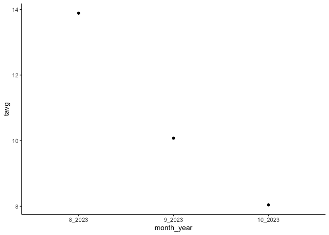<!-- -->

```r
WL2_climate_monthly_temp_ppt %>% ggplot(aes(x=month_year, y=ppt)) + geom_point() + theme_classic()
```

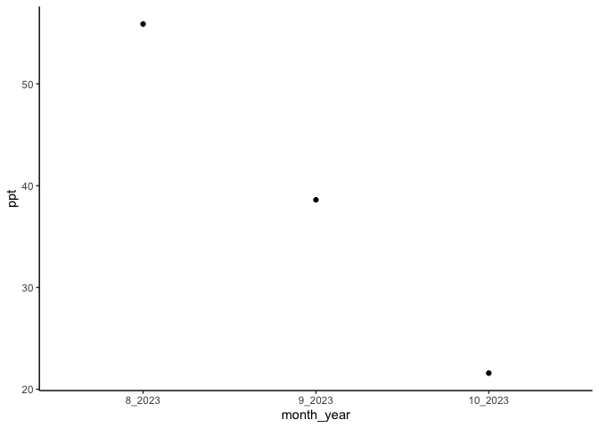<!-- -->

```r
WL2_climate_monthly_temp_ppt %>% ggplot(aes(x=month_year, y=tmx)) + geom_point() + theme_classic()
```

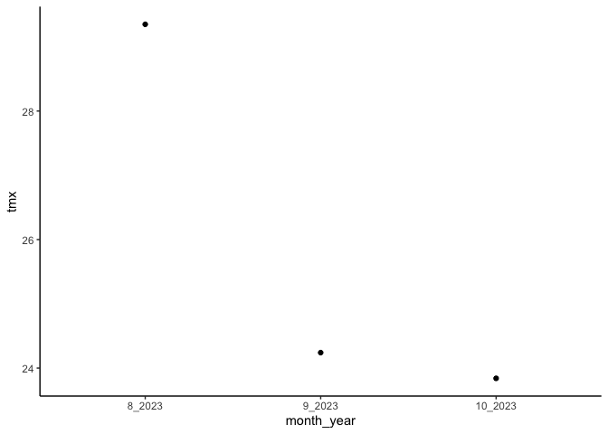<!-- -->

## Gower's Climate Distance

(1/P) \* SUM ((absolute value(Ai - Bi)) / range(i)) for each variable

-   P = number of environmental variables = 13 (without CWD)

-   Ai = 30 year avg of that variable for the home site

-   Bi = Nov 2022-Oct 2023 avg of that variable for the WL2 garden

-   Range(i) = maximum - minimum of that variable in the whole data set
    (across sites)

### Combine the flint and bioclim variables 


```r
WL2_climate_all <- bind_cols(WL2_climate_short_flint, WL2_bioclim_final)
dim(WL2_climate_all)
```

```
## [1]  1 13
```

```r
home_climates_all_recent <- left_join(pops_flint_recent_avgs, pops_bioclim_recent_avgs)
```

```
## Joining with `by = join_by(parent.pop, elevation.group, elev_m)`
```

```r
home_climates_all_historic <- left_join(pops_flint_historic_avgs, pops_bioclim_historical_avgs)
```

```
## Joining with `by = join_by(parent.pop, elevation.group, elev_m)`
```

```r
WL2_home_climate_recent <- bind_cols(WL2_climate_all, home_climates_all_recent)
summary(WL2_home_climate_recent)
```

```
##   ppt_mean_WL2    tmn_mean_WL2     tmx_mean_WL2   ann_tmean_WL2  
##  Min.   :38.69   Min.   :-1.278   Min.   :25.81   Min.   :10.67  
##  1st Qu.:38.69   1st Qu.:-1.278   1st Qu.:25.81   1st Qu.:10.67  
##  Median :38.69   Median :-1.278   Median :25.81   Median :10.67  
##  Mean   :38.69   Mean   :-1.278   Mean   :25.81   Mean   :10.67  
##  3rd Qu.:38.69   3rd Qu.:-1.278   3rd Qu.:25.81   3rd Qu.:10.67  
##  Max.   :38.69   Max.   :-1.278   Max.   :25.81   Max.   :10.67  
##  mean_diurnal_range_WL2 temp_seasonality_WL2 temp_ann_range_WL2  ann_ppt_WL2   
##  Min.   :27.09          Min.   :2.968        Min.   :32.32      Min.   :116.1  
##  1st Qu.:27.09          1st Qu.:2.968        1st Qu.:32.32      1st Qu.:116.1  
##  Median :27.09          Median :2.968        Median :32.32      Median :116.1  
##  Mean   :27.09          Mean   :2.968        Mean   :32.32      Mean   :116.1  
##  3rd Qu.:27.09          3rd Qu.:2.968        3rd Qu.:32.32      3rd Qu.:116.1  
##  Max.   :27.09          Max.   :2.968        Max.   :32.32      Max.   :116.1  
##  ppt_seasonality_WL2 tmean_wettest_month_WL2 tmean_driest_month_WL2
##  Min.   :43.19       Min.   :13.89           Min.   :8.042         
##  1st Qu.:43.19       1st Qu.:13.89           1st Qu.:8.042         
##  Median :43.19       Median :13.89           Median :8.042         
##  Mean   :43.19       Mean   :13.89           Mean   :8.042         
##  3rd Qu.:43.19       3rd Qu.:13.89           3rd Qu.:8.042         
##  Max.   :43.19       Max.   :13.89           Max.   :8.042         
##  ppt_warmest_month_WL2 ppt_coldest_month_WL2  parent.pop       
##  Min.   :55.88         Min.   :55.88         Length:23         
##  1st Qu.:55.88         1st Qu.:55.88         Class :character  
##  Median :55.88         Median :55.88         Mode  :character  
##  Mean   :55.88         Mean   :55.88                           
##  3rd Qu.:55.88         3rd Qu.:55.88                           
##  Max.   :55.88         Max.   :55.88                           
##  elevation.group        elev_m          cwd_mean        pck_mean     
##  Length:23          Min.   : 313.0   Min.   :30.19   Min.   : 0.000  
##  Class :character   1st Qu.: 767.9   1st Qu.:51.44   1st Qu.: 3.881  
##  Mode  :character   Median :1934.5   Median :65.09   Median : 9.421  
##                     Mean   :1649.7   Mean   :61.56   Mean   :16.102  
##                     3rd Qu.:2363.4   3rd Qu.:74.08   3rd Qu.:26.819  
##                     Max.   :2872.3   Max.   :90.15   Max.   :42.633  
##     ppt_mean         tmn_mean        tmx_mean     ann_tmean_avg   
##  Min.   : 30.53   Min.   :1.440   Min.   :15.15   Min.   : 8.293  
##  1st Qu.: 59.31   1st Qu.:2.711   1st Qu.:16.32   1st Qu.: 9.367  
##  Median : 71.15   Median :6.131   Median :18.79   Median :12.611  
##  Mean   : 74.48   Mean   :5.229   Mean   :18.50   Mean   :11.866  
##  3rd Qu.: 86.00   3rd Qu.:6.858   3rd Qu.:20.08   3rd Qu.:13.487  
##  Max.   :134.08   Max.   :8.974   Max.   :22.79   Max.   :15.449  
##  mean_diurnal_range_avg temp_seasonality_avg temp_ann_range_avg
##  Min.   :11.72          Min.   :5.063        Min.   :27.04     
##  1st Qu.:12.53          1st Qu.:5.977        1st Qu.:27.64     
##  Median :12.95          Median :6.595        Median :29.95     
##  Mean   :13.27          Mean   :6.397        Mean   :29.70     
##  3rd Qu.:13.86          3rd Qu.:6.836        3rd Qu.:30.72     
##  Max.   :15.82          Max.   :7.448        Max.   :33.80     
##  tmean_wettest_month_avg tmean_driest_month_avg  ann_ppt_avg    
##  Min.   :-0.5857         Min.   :11.16          Min.   : 152.7  
##  1st Qu.: 2.6197         1st Qu.:13.61          1st Qu.: 385.9  
##  Median : 3.6793         Median :16.45          Median : 462.2  
##  Mean   : 4.3796         Mean   :17.50          Mean   : 546.1  
##  3rd Qu.: 6.9492         3rd Qu.:20.17          3rd Qu.: 608.3  
##  Max.   : 8.9263         Max.   :24.52          Max.   :1072.7  
##  ppt_seasonality_avg ppt_warmest_month_avg ppt_coldest_month_avg
##  Min.   : 93.3       Min.   : 0.124        Min.   : 86.4        
##  1st Qu.:119.5       1st Qu.: 4.046        1st Qu.:222.5        
##  Median :131.1       Median : 6.736        Median :244.4        
##  Mean   :124.7       Mean   : 7.511        Mean   :250.6        
##  3rd Qu.:134.6       3rd Qu.:11.765        3rd Qu.:255.8        
##  Max.   :144.2       Max.   :16.999        Max.   :368.0
```

```r
WL2_home_climate_historic <- bind_cols(WL2_climate_all, home_climates_all_historic)
summary(WL2_home_climate_historic)
```

```
##   ppt_mean_WL2    tmn_mean_WL2     tmx_mean_WL2   ann_tmean_WL2  
##  Min.   :38.69   Min.   :-1.278   Min.   :25.81   Min.   :10.67  
##  1st Qu.:38.69   1st Qu.:-1.278   1st Qu.:25.81   1st Qu.:10.67  
##  Median :38.69   Median :-1.278   Median :25.81   Median :10.67  
##  Mean   :38.69   Mean   :-1.278   Mean   :25.81   Mean   :10.67  
##  3rd Qu.:38.69   3rd Qu.:-1.278   3rd Qu.:25.81   3rd Qu.:10.67  
##  Max.   :38.69   Max.   :-1.278   Max.   :25.81   Max.   :10.67  
##  mean_diurnal_range_WL2 temp_seasonality_WL2 temp_ann_range_WL2  ann_ppt_WL2   
##  Min.   :27.09          Min.   :2.968        Min.   :32.32      Min.   :116.1  
##  1st Qu.:27.09          1st Qu.:2.968        1st Qu.:32.32      1st Qu.:116.1  
##  Median :27.09          Median :2.968        Median :32.32      Median :116.1  
##  Mean   :27.09          Mean   :2.968        Mean   :32.32      Mean   :116.1  
##  3rd Qu.:27.09          3rd Qu.:2.968        3rd Qu.:32.32      3rd Qu.:116.1  
##  Max.   :27.09          Max.   :2.968        Max.   :32.32      Max.   :116.1  
##  ppt_seasonality_WL2 tmean_wettest_month_WL2 tmean_driest_month_WL2
##  Min.   :43.19       Min.   :13.89           Min.   :8.042         
##  1st Qu.:43.19       1st Qu.:13.89           1st Qu.:8.042         
##  Median :43.19       Median :13.89           Median :8.042         
##  Mean   :43.19       Mean   :13.89           Mean   :8.042         
##  3rd Qu.:43.19       3rd Qu.:13.89           3rd Qu.:8.042         
##  Max.   :43.19       Max.   :13.89           Max.   :8.042         
##  ppt_warmest_month_WL2 ppt_coldest_month_WL2  parent.pop       
##  Min.   :55.88         Min.   :55.88         Length:23         
##  1st Qu.:55.88         1st Qu.:55.88         Class :character  
##  Median :55.88         Median :55.88         Mode  :character  
##  Mean   :55.88         Mean   :55.88                           
##  3rd Qu.:55.88         3rd Qu.:55.88                           
##  Max.   :55.88         Max.   :55.88                           
##  elevation.group        elev_m          cwd_mean        pck_mean       
##  Length:23          Min.   : 313.0   Min.   :29.82   Min.   : 0.02925  
##  Class :character   1st Qu.: 767.9   1st Qu.:50.42   1st Qu.: 4.82657  
##  Mode  :character   Median :1934.5   Median :62.23   Median :13.83071  
##                     Mean   :1649.7   Mean   :60.13   Mean   :18.51763  
##                     3rd Qu.:2363.4   3rd Qu.:67.35   3rd Qu.:20.59057  
##                     Max.   :2872.3   Max.   :86.70   Max.   :66.79433  
##     ppt_mean         tmn_mean         tmx_mean     ann_tmean_avg   
##  Min.   : 43.39   Min.   :-1.320   Min.   :13.68   Min.   : 6.180  
##  1st Qu.: 57.97   1st Qu.: 2.660   1st Qu.:16.26   1st Qu.: 9.201  
##  Median : 70.23   Median : 4.994   Median :17.73   Median :11.349  
##  Mean   : 80.10   Mean   : 4.043   Mean   :18.08   Mean   :11.059  
##  3rd Qu.: 94.10   3rd Qu.: 5.812   3rd Qu.:20.29   3rd Qu.:13.323  
##  Max.   :140.94   Max.   : 7.961   Max.   :22.79   Max.   :15.056  
##  mean_diurnal_range_avg temp_seasonality_avg temp_ann_range_avg
##  Min.   :12.13          Min.   :5.094        Min.   :26.40     
##  1st Qu.:13.28          1st Qu.:5.578        1st Qu.:27.10     
##  Median :13.83          Median :5.709        Median :28.58     
##  Mean   :14.03          Mean   :5.980        Mean   :29.26     
##  3rd Qu.:14.68          3rd Qu.:6.441        3rd Qu.:30.80     
##  Max.   :17.07          Max.   :6.926        Max.   :34.42     
##  tmean_wettest_month_avg tmean_driest_month_avg  ann_ppt_avg   
##  Min.   :0.9437          Min.   : 9.469         Min.   :217.0  
##  1st Qu.:2.4414          1st Qu.:13.148         1st Qu.:361.6  
##  Median :4.1755          Median :15.523         Median :502.6  
##  Mean   :4.9413          Mean   :16.452         Mean   :528.2  
##  3rd Qu.:7.6199          3rd Qu.:19.861         3rd Qu.:620.1  
##  Max.   :9.2245          Max.   :23.965         Max.   :997.0  
##  ppt_seasonality_avg ppt_warmest_month_avg ppt_coldest_month_avg
##  Min.   : 90.89      Min.   : 1.549        Min.   :120.8        
##  1st Qu.:109.92      1st Qu.: 4.478        1st Qu.:199.7        
##  Median :121.09      Median : 8.702        Median :219.8        
##  Mean   :117.95      Mean   :10.153        Mean   :245.9        
##  3rd Qu.:128.17      3rd Qu.:13.175        3rd Qu.:322.7        
##  Max.   :136.73      Max.   :26.298        Max.   :351.2
```

```r
variables <- c("ppt_mean", "tmn_mean", "tmx_mean", "ann_tmean_avg",
                 "mean_diurnal_range_avg","temp_seasonality_avg","temp_ann_range_avg",
                 "tmean_wettest_month_avg", "tmean_driest_month_avg","ann_ppt_avg", 
                 "ppt_seasonality_avg", "ppt_warmest_month_avg", "ppt_coldest_month_avg")
```

### Figure out the range for each variable 


```r
WL2_range_prep <- WL2_climate_all %>% 
  mutate(parent.pop="WL2")

colnames(WL2_range_prep) <- sub("_WL2", "_avg", colnames(WL2_range_prep)) #remove WL2 from column names
WL2_range_prep <- WL2_range_prep %>% rename(ppt_mean=ppt_mean_avg, tmn_mean=tmn_mean_avg, tmx_mean=tmx_mean_avg)

##Recent
range_merge_recent <- bind_rows(home_climates_all_recent, WL2_range_prep)
names(range_merge_recent)
```

```
##  [1] "parent.pop"              "elevation.group"        
##  [3] "elev_m"                  "cwd_mean"               
##  [5] "pck_mean"                "ppt_mean"               
##  [7] "tmn_mean"                "tmx_mean"               
##  [9] "ann_tmean_avg"           "mean_diurnal_range_avg" 
## [11] "temp_seasonality_avg"    "temp_ann_range_avg"     
## [13] "tmean_wettest_month_avg" "tmean_driest_month_avg" 
## [15] "ann_ppt_avg"             "ppt_seasonality_avg"    
## [17] "ppt_warmest_month_avg"   "ppt_coldest_month_avg"
```

```r
summary(range_merge_recent)
```

```
##   parent.pop        elevation.group        elev_m          cwd_mean    
##  Length:24          Length:24          Min.   : 313.0   Min.   :30.19  
##  Class :character   Class :character   1st Qu.: 767.9   1st Qu.:51.44  
##  Mode  :character   Mode  :character   Median :1934.5   Median :65.09  
##                                        Mean   :1649.7   Mean   :61.56  
##                                        3rd Qu.:2363.4   3rd Qu.:74.08  
##                                        Max.   :2872.3   Max.   :90.15  
##                                        NA's   :1        NA's   :1      
##     pck_mean         ppt_mean         tmn_mean         tmx_mean    
##  Min.   : 0.000   Min.   : 30.53   Min.   :-1.278   Min.   :15.15  
##  1st Qu.: 3.881   1st Qu.: 56.80   1st Qu.: 2.204   1st Qu.:16.33  
##  Median : 9.421   Median : 70.51   Median : 5.825   Median :18.85  
##  Mean   :16.102   Mean   : 72.99   Mean   : 4.958   Mean   :18.81  
##  3rd Qu.:26.819   3rd Qu.: 82.40   3rd Qu.: 6.804   3rd Qu.:20.71  
##  Max.   :42.633   Max.   :134.08   Max.   : 8.974   Max.   :25.81  
##  NA's   :1                                                         
##  ann_tmean_avg    mean_diurnal_range_avg temp_seasonality_avg
##  Min.   : 8.293   Min.   :11.72          Min.   :2.968       
##  1st Qu.: 9.414   1st Qu.:12.56          1st Qu.:5.967       
##  Median :12.181   Median :13.07          Median :6.566       
##  Mean   :11.816   Mean   :13.85          Mean   :6.254       
##  3rd Qu.:13.408   3rd Qu.:13.96          3rd Qu.:6.829       
##  Max.   :15.449   Max.   :27.09          Max.   :7.448       
##                                                              
##  temp_ann_range_avg tmean_wettest_month_avg tmean_driest_month_avg
##  Min.   :27.04      Min.   :-0.5857         Min.   : 8.042        
##  1st Qu.:27.68      1st Qu.: 2.6386         1st Qu.:13.489        
##  Median :29.98      Median : 3.8904         Median :16.434        
##  Mean   :29.80      Mean   : 4.7758         Mean   :17.108        
##  3rd Qu.:30.79      3rd Qu.: 7.2135         3rd Qu.:20.095        
##  Max.   :33.80      Max.   :13.8885         Max.   :24.523        
##                                                                   
##   ann_ppt_avg     ppt_seasonality_avg ppt_warmest_month_avg
##  Min.   : 116.1   Min.   : 43.19      Min.   : 0.124       
##  1st Qu.: 377.2   1st Qu.:110.03      1st Qu.: 4.412       
##  Median : 453.9   Median :129.82      Median : 7.082       
##  Mean   : 528.2   Mean   :121.31      Mean   : 9.526       
##  3rd Qu.: 581.4   3rd Qu.:134.61      3rd Qu.:14.120       
##  Max.   :1072.7   Max.   :144.18      Max.   :55.880       
##                                                            
##  ppt_coldest_month_avg
##  Min.   : 55.88       
##  1st Qu.:217.07       
##  Median :244.33       
##  Mean   :242.46       
##  3rd Qu.:255.68       
##  Max.   :367.97       
## 
```

```r
WL2_home_climate_ranges_recent <- range_merge_recent %>% 
  summarise(ppt_mean_range=max(ppt_mean)-min(ppt_mean), 
            tmn_mean_range=max(tmn_mean)-min(tmn_mean), 
            tmx_mean_range=max(tmx_mean)-min(tmx_mean), 
            ann_tmean_avg_range=max(ann_tmean_avg)-min(ann_tmean_avg),
            mean_diurnal_range_avg_range=max(mean_diurnal_range_avg)-min(mean_diurnal_range_avg),
            temp_seasonality_avg_range=max(temp_seasonality_avg)-min(temp_seasonality_avg),
            temp_ann_range_avg_range=max(temp_ann_range_avg)-min(temp_ann_range_avg),
            tmean_wettest_month_avg_range=max(tmean_wettest_month_avg)-min(tmean_wettest_month_avg),
            tmean_driest_month_avg_range=max(tmean_driest_month_avg)-min(tmean_driest_month_avg),
            ann_ppt_avg_range=max(ann_ppt_avg)-min(ann_ppt_avg), 
            ppt_seasonality_avg_range=max(ppt_seasonality_avg)-min(ppt_seasonality_avg),
            ppt_warmest_month_avg_range=max(ppt_warmest_month_avg)-min(ppt_warmest_month_avg), 
            ppt_coldest_month_avg_range=max(ppt_coldest_month_avg)-min(ppt_coldest_month_avg))
WL2_home_climate_ranges_recent
```

```
## # A tibble: 1 × 13
##   ppt_mean_range tmn_mean_range tmx_mean_range ann_tmean_avg_range
##            <dbl>          <dbl>          <dbl>               <dbl>
## 1           104.           10.3           10.7                7.16
## # ℹ 9 more variables: mean_diurnal_range_avg_range <dbl>,
## #   temp_seasonality_avg_range <dbl>, temp_ann_range_avg_range <dbl>,
## #   tmean_wettest_month_avg_range <dbl>, tmean_driest_month_avg_range <dbl>,
## #   ann_ppt_avg_range <dbl>, ppt_seasonality_avg_range <dbl>,
## #   ppt_warmest_month_avg_range <dbl>, ppt_coldest_month_avg_range <dbl>
```

```r
WL2_home_climate_with_ranges_recent <- bind_cols(WL2_home_climate_recent, WL2_home_climate_ranges_recent)
names(WL2_home_climate_with_ranges_recent)
```

```
##  [1] "ppt_mean_WL2"                  "tmn_mean_WL2"                 
##  [3] "tmx_mean_WL2"                  "ann_tmean_WL2"                
##  [5] "mean_diurnal_range_WL2"        "temp_seasonality_WL2"         
##  [7] "temp_ann_range_WL2"            "ann_ppt_WL2"                  
##  [9] "ppt_seasonality_WL2"           "tmean_wettest_month_WL2"      
## [11] "tmean_driest_month_WL2"        "ppt_warmest_month_WL2"        
## [13] "ppt_coldest_month_WL2"         "parent.pop"                   
## [15] "elevation.group"               "elev_m"                       
## [17] "cwd_mean"                      "pck_mean"                     
## [19] "ppt_mean"                      "tmn_mean"                     
## [21] "tmx_mean"                      "ann_tmean_avg"                
## [23] "mean_diurnal_range_avg"        "temp_seasonality_avg"         
## [25] "temp_ann_range_avg"            "tmean_wettest_month_avg"      
## [27] "tmean_driest_month_avg"        "ann_ppt_avg"                  
## [29] "ppt_seasonality_avg"           "ppt_warmest_month_avg"        
## [31] "ppt_coldest_month_avg"         "ppt_mean_range"               
## [33] "tmn_mean_range"                "tmx_mean_range"               
## [35] "ann_tmean_avg_range"           "mean_diurnal_range_avg_range" 
## [37] "temp_seasonality_avg_range"    "temp_ann_range_avg_range"     
## [39] "tmean_wettest_month_avg_range" "tmean_driest_month_avg_range" 
## [41] "ann_ppt_avg_range"             "ppt_seasonality_avg_range"    
## [43] "ppt_warmest_month_avg_range"   "ppt_coldest_month_avg_range"
```

```r
##Historic
range_merge_historic <- bind_rows(home_climates_all_historic, WL2_range_prep)
names(range_merge_historic)
```

```
##  [1] "parent.pop"              "elevation.group"        
##  [3] "elev_m"                  "cwd_mean"               
##  [5] "pck_mean"                "ppt_mean"               
##  [7] "tmn_mean"                "tmx_mean"               
##  [9] "ann_tmean_avg"           "mean_diurnal_range_avg" 
## [11] "temp_seasonality_avg"    "temp_ann_range_avg"     
## [13] "tmean_wettest_month_avg" "tmean_driest_month_avg" 
## [15] "ann_ppt_avg"             "ppt_seasonality_avg"    
## [17] "ppt_warmest_month_avg"   "ppt_coldest_month_avg"
```

```r
summary(range_merge_historic)
```

```
##   parent.pop        elevation.group        elev_m          cwd_mean    
##  Length:24          Length:24          Min.   : 313.0   Min.   :29.82  
##  Class :character   Class :character   1st Qu.: 767.9   1st Qu.:50.42  
##  Mode  :character   Mode  :character   Median :1934.5   Median :62.23  
##                                        Mean   :1649.7   Mean   :60.13  
##                                        3rd Qu.:2363.4   3rd Qu.:67.35  
##                                        Max.   :2872.3   Max.   :86.70  
##                                        NA's   :1        NA's   :1      
##     pck_mean           ppt_mean         tmn_mean         tmx_mean    
##  Min.   : 0.02925   Min.   : 38.69   Min.   :-1.320   Min.   :13.68  
##  1st Qu.: 4.82657   1st Qu.: 57.36   1st Qu.: 2.252   1st Qu.:16.36  
##  Median :13.83071   Median : 68.57   Median : 4.967   Median :18.09  
##  Mean   :18.51763   Mean   : 78.38   Mean   : 3.821   Mean   :18.40  
##  3rd Qu.:20.59057   3rd Qu.: 92.28   3rd Qu.: 5.765   3rd Qu.:20.67  
##  Max.   :66.79433   Max.   :140.94   Max.   : 7.961   Max.   :25.81  
##  NA's   :1                                                           
##  ann_tmean_avg   mean_diurnal_range_avg temp_seasonality_avg temp_ann_range_avg
##  Min.   : 6.18   Min.   :12.13          Min.   :2.968        Min.   :26.40     
##  1st Qu.: 9.32   1st Qu.:13.31          1st Qu.:5.562        1st Qu.:27.17     
##  Median :11.34   Median :13.93          Median :5.706        Median :28.70     
##  Mean   :11.04   Mean   :14.58          Mean   :5.854        Mean   :29.39     
##  3rd Qu.:13.03   3rd Qu.:14.94          3rd Qu.:6.418        3rd Qu.:30.91     
##  Max.   :15.06   Max.   :27.09          Max.   :6.926        Max.   :34.42     
##                                                                                
##  tmean_wettest_month_avg tmean_driest_month_avg  ann_ppt_avg   
##  Min.   : 0.9437         Min.   : 8.042         Min.   :116.1  
##  1st Qu.: 2.5025         1st Qu.:12.697         1st Qu.:358.4  
##  Median : 4.7241         Median :15.492         Median :502.6  
##  Mean   : 5.3141         Mean   :16.102         Mean   :511.0  
##  3rd Qu.: 8.1109         3rd Qu.:19.647         3rd Qu.:591.9  
##  Max.   :13.8885         Max.   :23.965         Max.   :997.0  
##                                                                
##  ppt_seasonality_avg ppt_warmest_month_avg ppt_coldest_month_avg
##  Min.   : 43.19      Min.   : 1.549        Min.   : 55.88       
##  1st Qu.:108.94      1st Qu.: 4.594        1st Qu.:191.14       
##  Median :120.53      Median : 8.795        Median :215.96       
##  Mean   :114.83      Mean   :12.058        Mean   :237.94       
##  3rd Qu.:127.61      3rd Qu.:13.689        3rd Qu.:322.34       
##  Max.   :136.73      Max.   :55.880        Max.   :351.21       
## 
```

```r
WL2_home_climate_ranges_historic <- range_merge_historic %>% 
  summarise(ppt_mean_range=max(ppt_mean)-min(ppt_mean), 
            tmn_mean_range=max(tmn_mean)-min(tmn_mean), 
            tmx_mean_range=max(tmx_mean)-min(tmx_mean), 
            ann_tmean_avg_range=max(ann_tmean_avg)-min(ann_tmean_avg),
            mean_diurnal_range_avg_range=max(mean_diurnal_range_avg)-min(mean_diurnal_range_avg),
            temp_seasonality_avg_range=max(temp_seasonality_avg)-min(temp_seasonality_avg),
            temp_ann_range_avg_range=max(temp_ann_range_avg)-min(temp_ann_range_avg),
            tmean_wettest_month_avg_range=max(tmean_wettest_month_avg)-min(tmean_wettest_month_avg),
            tmean_driest_month_avg_range=max(tmean_driest_month_avg)-min(tmean_driest_month_avg),
            ann_ppt_avg_range=max(ann_ppt_avg)-min(ann_ppt_avg), 
            ppt_seasonality_avg_range=max(ppt_seasonality_avg)-min(ppt_seasonality_avg),
            ppt_warmest_month_avg_range=max(ppt_warmest_month_avg)-min(ppt_warmest_month_avg), 
            ppt_coldest_month_avg_range=max(ppt_coldest_month_avg)-min(ppt_coldest_month_avg))
WL2_home_climate_ranges_historic
```

```
## # A tibble: 1 × 13
##   ppt_mean_range tmn_mean_range tmx_mean_range ann_tmean_avg_range
##            <dbl>          <dbl>          <dbl>               <dbl>
## 1           102.           9.28           12.1                8.88
## # ℹ 9 more variables: mean_diurnal_range_avg_range <dbl>,
## #   temp_seasonality_avg_range <dbl>, temp_ann_range_avg_range <dbl>,
## #   tmean_wettest_month_avg_range <dbl>, tmean_driest_month_avg_range <dbl>,
## #   ann_ppt_avg_range <dbl>, ppt_seasonality_avg_range <dbl>,
## #   ppt_warmest_month_avg_range <dbl>, ppt_coldest_month_avg_range <dbl>
```

```r
WL2_home_climate_with_ranges_historic <- bind_cols(WL2_home_climate_historic, WL2_home_climate_ranges_historic)
names(WL2_home_climate_with_ranges_historic)
```

```
##  [1] "ppt_mean_WL2"                  "tmn_mean_WL2"                 
##  [3] "tmx_mean_WL2"                  "ann_tmean_WL2"                
##  [5] "mean_diurnal_range_WL2"        "temp_seasonality_WL2"         
##  [7] "temp_ann_range_WL2"            "ann_ppt_WL2"                  
##  [9] "ppt_seasonality_WL2"           "tmean_wettest_month_WL2"      
## [11] "tmean_driest_month_WL2"        "ppt_warmest_month_WL2"        
## [13] "ppt_coldest_month_WL2"         "parent.pop"                   
## [15] "elevation.group"               "elev_m"                       
## [17] "cwd_mean"                      "pck_mean"                     
## [19] "ppt_mean"                      "tmn_mean"                     
## [21] "tmx_mean"                      "ann_tmean_avg"                
## [23] "mean_diurnal_range_avg"        "temp_seasonality_avg"         
## [25] "temp_ann_range_avg"            "tmean_wettest_month_avg"      
## [27] "tmean_driest_month_avg"        "ann_ppt_avg"                  
## [29] "ppt_seasonality_avg"           "ppt_warmest_month_avg"        
## [31] "ppt_coldest_month_avg"         "ppt_mean_range"               
## [33] "tmn_mean_range"                "tmx_mean_range"               
## [35] "ann_tmean_avg_range"           "mean_diurnal_range_avg_range" 
## [37] "temp_seasonality_avg_range"    "temp_ann_range_avg_range"     
## [39] "tmean_wettest_month_avg_range" "tmean_driest_month_avg_range" 
## [41] "ann_ppt_avg_range"             "ppt_seasonality_avg_range"    
## [43] "ppt_warmest_month_avg_range"   "ppt_coldest_month_avg_range"
```

### Recent Gowers Calc

```r
gowers_calc_each_var_recent <- WL2_home_climate_with_ranges_recent %>% 
  mutate(ppt_mean_gowers=abs(ppt_mean_WL2 - ppt_mean) / ppt_mean_range,
         tmn_mean_gowers=abs(tmn_mean_WL2 - tmn_mean) / tmn_mean_range,
         tmx_mean_gowers=abs(tmx_mean_WL2 - tmx_mean) / tmx_mean_range,
         ann_tmean_gowers=abs(ann_tmean_WL2 - ann_tmean_avg) / ann_tmean_avg_range,
         mean_diurnal_range_gowers=abs(mean_diurnal_range_WL2 - mean_diurnal_range_avg) / mean_diurnal_range_avg_range,
         temp_seasonality_gowers=abs(temp_seasonality_WL2 - temp_seasonality_avg) / temp_seasonality_avg_range,
         temp_ann_range_gowers=abs(temp_ann_range_WL2 - temp_ann_range_avg) / temp_ann_range_avg_range,
         tmean_wettest_month_gowers=abs(tmean_wettest_month_WL2 - tmean_wettest_month_avg) / tmean_wettest_month_avg_range,
         tmean_driest_month_gowers=abs(tmean_driest_month_WL2 - tmean_driest_month_avg) / tmean_driest_month_avg_range,
         ann_ppt_gowers=abs(ann_ppt_WL2 - ann_ppt_avg) / ann_ppt_avg_range,
         ppt_seasonality_gowers=abs(ppt_seasonality_WL2 - ppt_seasonality_avg) / ppt_seasonality_avg_range,
         ppt_warmest_month_gowers=abs(ppt_warmest_month_WL2 - ppt_warmest_month_avg) / ppt_warmest_month_avg_range,
         ppt_coldest_month_gowers=abs(ppt_coldest_month_WL2 - ppt_coldest_month_avg) / ppt_coldest_month_avg_range) %>% 
  dplyr::select(parent.pop, elevation.group, elev_m, ends_with("_gowers"))

WL2_home_climate_with_ranges_recent
```

```
## # A tibble: 23 × 44
##    ppt_mean_WL2 tmn_mean_WL2 tmx_mean_WL2 ann_tmean_WL2 mean_diurnal_range_WL2
##           <dbl>        <dbl>        <dbl>         <dbl>                  <dbl>
##  1         38.7        -1.28         25.8          10.7                   27.1
##  2         38.7        -1.28         25.8          10.7                   27.1
##  3         38.7        -1.28         25.8          10.7                   27.1
##  4         38.7        -1.28         25.8          10.7                   27.1
##  5         38.7        -1.28         25.8          10.7                   27.1
##  6         38.7        -1.28         25.8          10.7                   27.1
##  7         38.7        -1.28         25.8          10.7                   27.1
##  8         38.7        -1.28         25.8          10.7                   27.1
##  9         38.7        -1.28         25.8          10.7                   27.1
## 10         38.7        -1.28         25.8          10.7                   27.1
## # ℹ 13 more rows
## # ℹ 39 more variables: temp_seasonality_WL2 <dbl>, temp_ann_range_WL2 <dbl>,
## #   ann_ppt_WL2 <dbl>, ppt_seasonality_WL2 <dbl>,
## #   tmean_wettest_month_WL2 <dbl>, tmean_driest_month_WL2 <dbl>,
## #   ppt_warmest_month_WL2 <dbl>, ppt_coldest_month_WL2 <dbl>, parent.pop <chr>,
## #   elevation.group <chr>, elev_m <dbl>, cwd_mean <dbl>, pck_mean <dbl>,
## #   ppt_mean <dbl>, tmn_mean <dbl>, tmx_mean <dbl>, ann_tmean_avg <dbl>, …
```

```r
gowers_calc_each_var_recent
```

```
## # A tibble: 23 × 16
##    parent.pop elevation.group elev_m ppt_mean_gowers tmn_mean_gowers
##    <chr>      <chr>            <dbl>           <dbl>           <dbl>
##  1 BH         Low               511.           0.313           0.723
##  2 CC         Low               313            0.785           0.846
##  3 CP2        High             2244.           0.370           0.494
##  4 CP3        High             2266.           0.344           0.438
##  5 DPR        Mid              1019.           0.557           1    
##  6 FR         Mid               787            0.169           0.804
##  7 IH         Low               454.           0.602           0.909
##  8 LV1        High             2593.           0.356           0.339
##  9 LV3        High             2354.           0.352           0.340
## 10 LVTR1      High             2741.           0.387           0.310
## # ℹ 13 more rows
## # ℹ 11 more variables: tmx_mean_gowers <dbl>, ann_tmean_gowers <dbl>,
## #   mean_diurnal_range_gowers <dbl>, temp_seasonality_gowers <dbl>,
## #   temp_ann_range_gowers <dbl>, tmean_wettest_month_gowers <dbl>,
## #   tmean_driest_month_gowers <dbl>, ann_ppt_gowers <dbl>,
## #   ppt_seasonality_gowers <dbl>, ppt_warmest_month_gowers <dbl>,
## #   ppt_coldest_month_gowers <dbl>
```

```r
gowers_calc_per_pop_recent <- gowers_calc_each_var_recent %>% 
  mutate(Recent_Gowers_Dist=(1/13)*(ppt_mean_gowers + tmn_mean_gowers + tmx_mean_gowers +
                                ann_tmean_gowers + mean_diurnal_range_gowers +
                                temp_seasonality_gowers +temp_ann_range_gowers +
                                tmean_wettest_month_gowers +
                                tmean_driest_month_gowers +ann_ppt_gowers +
                                ppt_seasonality_gowers + ppt_warmest_month_gowers +
                                ppt_coldest_month_gowers)) %>% 
  dplyr::select(parent.pop, elevation.group, elev_m, Recent_Gowers_Dist)

gowers_calc_per_pop_recent
```

```
## # A tibble: 23 × 4
##    parent.pop elevation.group elev_m Recent_Gowers_Dist
##    <chr>      <chr>            <dbl>              <dbl>
##  1 BH         Low               511.              0.555
##  2 CC         Low               313               0.682
##  3 CP2        High             2244.              0.626
##  4 CP3        High             2266.              0.629
##  5 DPR        Mid              1019.              0.743
##  6 FR         Mid               787               0.599
##  7 IH         Low               454.              0.712
##  8 LV1        High             2593.              0.587
##  9 LV3        High             2354.              0.588
## 10 LVTR1      High             2741.              0.589
## # ℹ 13 more rows
```

### Historic Gowers Calc

```r
gowers_calc_each_var_historic <- WL2_home_climate_with_ranges_historic %>% 
  mutate(ppt_mean_gowers=abs(ppt_mean_WL2 - ppt_mean) / ppt_mean_range,
         tmn_mean_gowers=abs(tmn_mean_WL2 - tmn_mean) / tmn_mean_range,
         tmx_mean_gowers=abs(tmx_mean_WL2 - tmx_mean) / tmx_mean_range,
         ann_tmean_gowers=abs(ann_tmean_WL2 - ann_tmean_avg) / ann_tmean_avg_range,
         mean_diurnal_range_gowers=abs(mean_diurnal_range_WL2 - mean_diurnal_range_avg) / mean_diurnal_range_avg_range,
         temp_seasonality_gowers=abs(temp_seasonality_WL2 - temp_seasonality_avg) / temp_seasonality_avg_range,
         temp_ann_range_gowers=abs(temp_ann_range_WL2 - temp_ann_range_avg) / temp_ann_range_avg_range,
         tmean_wettest_month_gowers=abs(tmean_wettest_month_WL2 - tmean_wettest_month_avg) / tmean_wettest_month_avg_range,
         tmean_driest_month_gowers=abs(tmean_driest_month_WL2 - tmean_driest_month_avg) / tmean_driest_month_avg_range,
         ann_ppt_gowers=abs(ann_ppt_WL2 - ann_ppt_avg) / ann_ppt_avg_range,
         ppt_seasonality_gowers=abs(ppt_seasonality_WL2 - ppt_seasonality_avg) / ppt_seasonality_avg_range,
         ppt_warmest_month_gowers=abs(ppt_warmest_month_WL2 - ppt_warmest_month_avg) / ppt_warmest_month_avg_range,
         ppt_coldest_month_gowers=abs(ppt_coldest_month_WL2 - ppt_coldest_month_avg) / ppt_coldest_month_avg_range) %>% 
  dplyr::select(parent.pop, elevation.group, elev_m, ends_with("_gowers"))

  
gowers_calc_per_pop_historic <- gowers_calc_each_var_historic %>% 
  mutate(Historic_Gowers_Dist=(1/13)*(ppt_mean_gowers + tmn_mean_gowers + tmx_mean_gowers +
                                ann_tmean_gowers + mean_diurnal_range_gowers +
                                temp_seasonality_gowers +temp_ann_range_gowers +
                                tmean_wettest_month_gowers +
                                tmean_driest_month_gowers +ann_ppt_gowers +
                                ppt_seasonality_gowers + ppt_warmest_month_gowers +
                                ppt_coldest_month_gowers)) %>% 
  dplyr::select(parent.pop, elevation.group, elev_m, Historic_Gowers_Dist)

gowers_calc_per_pop_historic
```

```
## # A tibble: 23 × 4
##    parent.pop elevation.group elev_m Historic_Gowers_Dist
##    <chr>      <chr>            <dbl>                <dbl>
##  1 BH         Low               511.                0.530
##  2 CC         Low               313                 0.687
##  3 CP2        High             2244.                0.574
##  4 CP3        High             2266.                0.577
##  5 DPR        Mid              1019.                0.689
##  6 FR         Mid               787                 0.595
##  7 IH         Low               454.                0.710
##  8 LV1        High             2593.                0.652
##  9 LV3        High             2354.                0.652
## 10 LVTR1      High             2741.                0.659
## # ℹ 13 more rows
```

### Merge recent and historic

```r
gowers_all_time <- full_join(gowers_calc_per_pop_recent, gowers_calc_per_pop_historic)
```

```
## Joining with `by = join_by(parent.pop, elevation.group, elev_m)`
```

```r
gowers_all_time
```

```
## # A tibble: 23 × 5
##    parent.pop elevation.group elev_m Recent_Gowers_Dist Historic_Gowers_Dist
##    <chr>      <chr>            <dbl>              <dbl>                <dbl>
##  1 BH         Low               511.              0.555                0.530
##  2 CC         Low               313               0.682                0.687
##  3 CP2        High             2244.              0.626                0.574
##  4 CP3        High             2266.              0.629                0.577
##  5 DPR        Mid              1019.              0.743                0.689
##  6 FR         Mid               787               0.599                0.595
##  7 IH         Low               454.              0.712                0.710
##  8 LV1        High             2593.              0.587                0.652
##  9 LV3        High             2354.              0.588                0.652
## 10 LVTR1      High             2741.              0.589                0.659
## # ℹ 13 more rows
```

```r
names(gowers_all_time)
```

```
## [1] "parent.pop"           "elevation.group"      "elev_m"              
## [4] "Recent_Gowers_Dist"   "Historic_Gowers_Dist"
```

```r
write_csv(gowers_all_time, "../output/Climate/Pops_GowersEnvtalDist_WL2.csv")
```

Figures

```r
gowers_rec_fig <- gowers_all_time %>% 
  ggplot(aes(x=fct_reorder(parent.pop, Recent_Gowers_Dist), y=Recent_Gowers_Dist, group=parent.pop, fill=elev_m)) +
  geom_col(width = 0.7,position = position_dodge(0.75)) +
  scale_y_continuous(expand = c(0, 0)) +
  scale_fill_gradient(low = "#F5A540", high = "#0043F0") +
   labs(fill="Elevation (m)",x="Population", title="Recent Climate", y="Gowers Envtal Distance \n from WL2") +
  theme_classic() +
  theme(text=element_text(size=25), axis.text.x = element_text(angle = 45,  hjust = 1))
ggsave("../output/Climate/Gowers_Recent_fromWL2.png", width = 12, height = 6, units = "in")

gowers_hist_fig <- gowers_all_time %>% 
  ggplot(aes(x=fct_reorder(parent.pop, Historic_Gowers_Dist), y=Historic_Gowers_Dist, group=parent.pop, fill=elev_m)) +
  geom_col(width = 0.7,position = position_dodge(0.75)) +
  scale_y_continuous(expand = c(0, 0)) +
  scale_fill_gradient(low = "#F5A540", high = "#0043F0") +
  labs(fill="Elevation (m)",x="Population", title="Historic Climate", y="Gowers Envtal Distance \n from WL2") +
  theme_classic() +
  theme(text=element_text(size=25), axis.text.x = element_text(angle = 45,  hjust = 1))
ggsave("../output/Climate/Gowers_Historic_fromWL2.png", width = 12, height = 6, units = "in")

#should combine these into one figure and save that instead
legend <- get_legend(gowers_rec_fig)
gowers_hist_fig <- gowers_hist_fig + theme(legend.position="none")
gowers_rec_fig <- gowers_rec_fig + theme(legend.position="none")
grid.arrange(gowers_hist_fig, gowers_rec_fig, legend, ncol=3, widths=c(3.12, 3.12, 1.09))
```

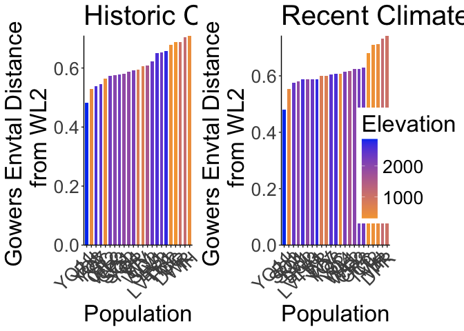<!-- -->

```r
 #2000 x 850
```


## Flint Climate Distance

### Subtraction


```r
recent_flint_dist_prep <- bind_cols(WL2_climate_short_flint, pops_flint_recent_avgs)
names(recent_flint_dist_prep)
```

```
##  [1] "ppt_mean_WL2"    "tmn_mean_WL2"    "tmx_mean_WL2"    "parent.pop"     
##  [5] "elevation.group" "elev_m"          "cwd_mean"        "pck_mean"       
##  [9] "ppt_mean"        "tmn_mean"        "tmx_mean"
```

```r
recent_flint_dist <- recent_flint_dist_prep %>% 
  mutate(ppt_mean_dist=ppt_mean_WL2 - ppt_mean,
         tmn_mean_dist=tmn_mean_WL2 - tmn_mean,
         tmx_mean_dist=tmx_mean_WL2 - tmx_mean) %>% 
 dplyr::select(parent.pop, elevation.group, elev_m, ends_with("_dist"))

historic_flint_dist_prep <- bind_cols(WL2_climate_short_flint, pops_flint_historic_avgs)
names(historic_flint_dist_prep)
```

```
##  [1] "ppt_mean_WL2"    "tmn_mean_WL2"    "tmx_mean_WL2"    "parent.pop"     
##  [5] "elevation.group" "elev_m"          "cwd_mean"        "pck_mean"       
##  [9] "ppt_mean"        "tmn_mean"        "tmx_mean"
```

```r
historic_flint_dist <- historic_flint_dist_prep %>% 
  mutate(ppt_mean_dist=ppt_mean_WL2 - ppt_mean,
         tmn_mean_dist=tmn_mean_WL2 - tmn_mean,
         tmx_mean_dist=tmx_mean_WL2 - tmx_mean) %>% 
 dplyr::select(parent.pop, elevation.group, elev_m, ends_with("_dist"))
```

Figures Recent (subtraction distance)


```r
recent_flint_dist %>% 
  ggplot(aes(x=fct_reorder(parent.pop, ppt_mean_dist), y=ppt_mean_dist, group=parent.pop, fill=elev_m)) +
  geom_col(width = 0.7,position = position_dodge(0.75)) +
  scale_y_continuous(expand = c(0, 0)) +
  scale_fill_gradient(low = "#F5A540", high = "#0043F0") +
  labs(fill="Elevation (m)",x="Population") +
  theme_classic() +
  theme(text=element_text(size=25), axis.text.x = element_text(angle = 45,  hjust = 1))
```

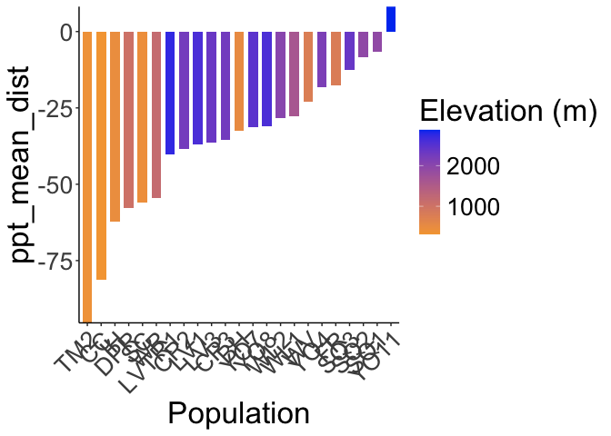<!-- -->

```r
ggsave("../output/Climate/MeanPPT_DistfromWL2_RecentClim.png", width = 12, height = 6, units = "in")

recent_flint_dist %>% 
  ggplot(aes(x=fct_reorder(parent.pop, tmn_mean_dist), y=tmn_mean_dist, group=parent.pop, fill=elev_m)) +
  geom_col(width = 0.7,position = position_dodge(0.75)) +
  scale_y_continuous(expand = c(0, 0)) +
  scale_fill_gradient(low = "#F5A540", high = "#0043F0") +
  labs(fill="Elevation (m)",x="Population") +
  theme_classic() +
  theme(text=element_text(size=25), axis.text.x = element_text(angle = 45,  hjust = 1))
```

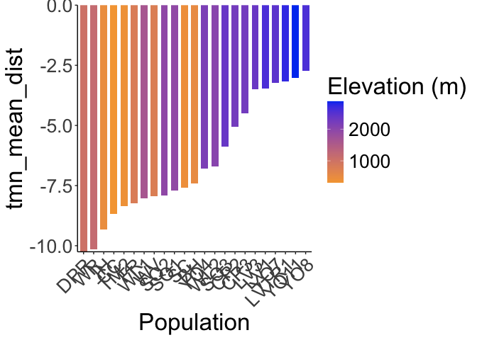<!-- -->

```r
ggsave("../output/Climate/MeanTMN_DistfromWL2_RecentClim.png", width = 12, height = 6, units = "in")

recent_flint_dist %>% 
  ggplot(aes(x=fct_reorder(parent.pop, tmx_mean_dist), y=tmx_mean_dist, group=parent.pop, fill=elev_m)) +
  geom_col(width = 0.7,position = position_dodge(0.75)) +
  scale_y_continuous(expand = c(0, 0)) +
  scale_fill_gradient(low = "#F5A540", high = "#0043F0") +
  labs(fill="Elevation (m)",x="Population") +
  theme_classic() +
  theme(text=element_text(size=25), axis.text.x = element_text(angle = 45,  hjust = 1))
```

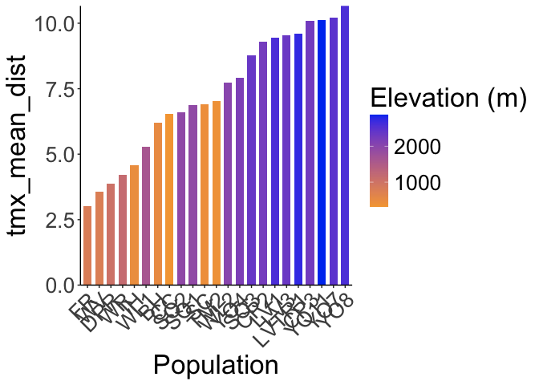<!-- -->

```r
ggsave("../output/Climate/MeanTMX_DistfromWL2_RecentClim.png", width = 12, height = 6, units = "in")
```

Figures Historical (subtraction distance)


```r
historic_flint_dist %>% 
  ggplot(aes(x=fct_reorder(parent.pop, ppt_mean_dist), y=ppt_mean_dist, group=parent.pop, fill=elev_m)) +
  geom_col(width = 0.7,position = position_dodge(0.75)) +
  scale_y_continuous(expand = c(0, 0)) +
  scale_fill_gradient(low = "#F5A540", high = "#0043F0") +
  labs(fill="Elevation (m)",x="Population") +
  theme_classic() +
  theme(text=element_text(size=25), axis.text.x = element_text(angle = 45,  hjust = 1))
```

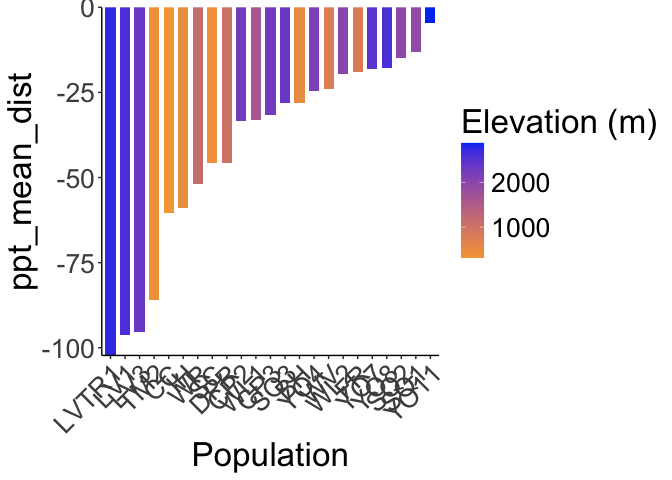<!-- -->

```r
ggsave("../output/Climate/MeanPPT_DistfromWL2_HistoricalClim.png", width = 12, height = 6, units = "in")

historic_flint_dist %>% 
  ggplot(aes(x=fct_reorder(parent.pop, tmn_mean_dist), y=tmn_mean_dist, group=parent.pop, fill=elev_m)) +
  geom_col(width = 0.7,position = position_dodge(0.75)) +
  scale_y_continuous(expand = c(0, 0)) +
  scale_fill_gradient(low = "#F5A540", high = "#0043F0") +
  labs(fill="Elevation (m)",x="Population") +
  theme_classic() +
  theme(text=element_text(size=25), axis.text.x = element_text(angle = 45,  hjust = 1))
```

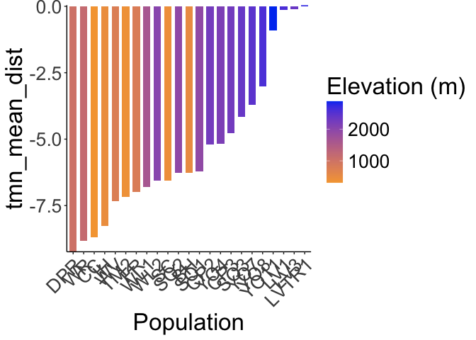<!-- -->

```r
ggsave("../output/Climate/MeanTMN_DistfromWL2_HistoricalClim.png", width = 12, height = 6, units = "in")

historic_flint_dist %>% 
  ggplot(aes(x=fct_reorder(parent.pop, tmx_mean_dist), y=tmx_mean_dist, group=parent.pop, fill=elev_m)) +
  geom_col(width = 0.7,position = position_dodge(0.75)) +
  scale_y_continuous(expand = c(0, 0)) +
  scale_fill_gradient(low = "#F5A540", high = "#0043F0") +
  labs(fill="Elevation (m)",x="Population") +
  theme_classic() +
  theme(text=element_text(size=25), axis.text.x = element_text(angle = 45,  hjust = 1))
```

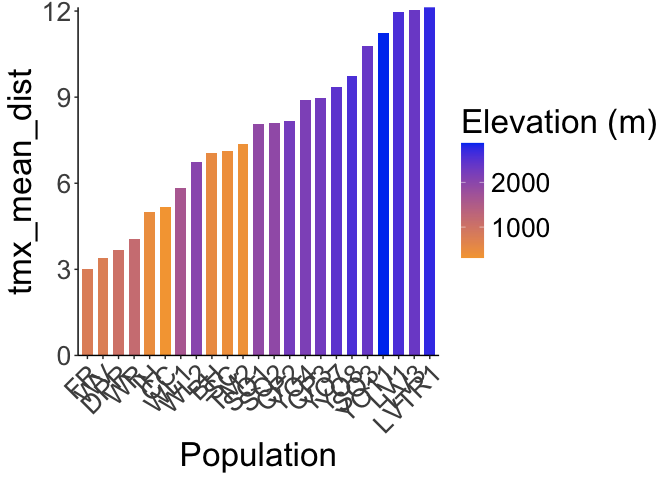<!-- -->

```r
ggsave("../output/Climate/MeanTMX_DistfromWL2_HistoricalClim.png", width = 12, height = 6, units = "in")
```

## Bioclim Climate Distance

### Subtraction


```r
#Recent
names(pops_bioclim_recent_avgs)
```

```
##  [1] "parent.pop"              "elevation.group"        
##  [3] "elev_m"                  "ann_tmean_avg"          
##  [5] "mean_diurnal_range_avg"  "temp_seasonality_avg"   
##  [7] "temp_ann_range_avg"      "tmean_wettest_month_avg"
##  [9] "tmean_driest_month_avg"  "ann_ppt_avg"            
## [11] "ppt_seasonality_avg"     "ppt_warmest_month_avg"  
## [13] "ppt_coldest_month_avg"
```

```r
recent_bioclim_dist_prep <- bind_cols(WL2_bioclim_final, pops_bioclim_recent_avgs)
recent_bioclim_dist <- recent_bioclim_dist_prep %>% 
  mutate(ann_tmean_dist=ann_tmean_WL2 - ann_tmean_avg,
         mean_diurnal_range_dist=mean_diurnal_range_WL2 - mean_diurnal_range_avg,
         temp_seasonality_dist=temp_seasonality_WL2 - temp_seasonality_avg,
         temp_ann_range_dist=temp_ann_range_WL2 - temp_ann_range_avg,
         tmean_wettest_month_dist=tmean_wettest_month_WL2 - tmean_wettest_month_avg,
         tmean_driest_month_dist=tmean_driest_month_WL2 - tmean_driest_month_avg,
         ann_ppt_dist=ann_ppt_WL2 - ann_ppt_avg,
         ppt_seasonality_dist=ppt_seasonality_WL2 - ppt_seasonality_avg, 
         ppt_warmest_month_dist=ppt_warmest_month_WL2 - ppt_warmest_month_avg,
         ppt_coldest_month_dist=ppt_coldest_month_WL2 - ppt_coldest_month_avg) %>% 
 dplyr::select(parent.pop, elevation.group, elev_m, ends_with("_dist"))
recent_bioclim_dist
```

```
## # A tibble: 23 × 13
##    parent.pop elevation.group elev_m ann_tmean_dist mean_diurnal_range_dist
##    <chr>      <chr>            <dbl>          <dbl>                   <dbl>
##  1 BH         Low               511.         -2.21                     13.6
##  2 CC         Low               313          -2.66                     15.2
##  3 CP2        High             2244.          0.523                    14.4
##  4 CP3        High             2266.          1.21                     14.6
##  5 DPR        Mid              1019.         -4.78                     14.1
##  6 FR         Mid               787          -4.21                     11.3
##  7 IH         Low               454.         -3.97                     13.9
##  8 LV1        High             2593.          1.40                     12.9
##  9 LV3        High             2354.          1.42                     13.0
## 10 LVTR1      High             2741.          1.61                     12.8
## # ℹ 13 more rows
## # ℹ 8 more variables: temp_seasonality_dist <dbl>, temp_ann_range_dist <dbl>,
## #   tmean_wettest_month_dist <dbl>, tmean_driest_month_dist <dbl>,
## #   ann_ppt_dist <dbl>, ppt_seasonality_dist <dbl>,
## #   ppt_warmest_month_dist <dbl>, ppt_coldest_month_dist <dbl>
```

```r
#Historical
names(pops_bioclim_historical_avgs)
```

```
##  [1] "parent.pop"              "elevation.group"        
##  [3] "elev_m"                  "ann_tmean_avg"          
##  [5] "mean_diurnal_range_avg"  "temp_seasonality_avg"   
##  [7] "temp_ann_range_avg"      "tmean_wettest_month_avg"
##  [9] "tmean_driest_month_avg"  "ann_ppt_avg"            
## [11] "ppt_seasonality_avg"     "ppt_warmest_month_avg"  
## [13] "ppt_coldest_month_avg"
```

```r
historical_bioclim_dist_prep <- bind_cols(WL2_bioclim_final, pops_bioclim_historical_avgs)
historical_bioclim_dist <- historical_bioclim_dist_prep %>% 
  mutate(ann_tmean_dist=ann_tmean_WL2 - ann_tmean_avg,
         mean_diurnal_range_dist=mean_diurnal_range_WL2 - mean_diurnal_range_avg,
         temp_seasonality_dist=temp_seasonality_WL2 - temp_seasonality_avg,
         temp_ann_range_dist=temp_ann_range_WL2 - temp_ann_range_avg,
         tmean_wettest_month_dist=tmean_wettest_month_WL2 - tmean_wettest_month_avg,
         tmean_driest_month_dist=tmean_driest_month_WL2 - tmean_driest_month_avg,
         ann_ppt_dist=ann_ppt_WL2 - ann_ppt_avg,
         ppt_seasonality_dist=ppt_seasonality_WL2 - ppt_seasonality_avg, 
         ppt_warmest_month_dist=ppt_warmest_month_WL2 - ppt_warmest_month_avg,
         ppt_coldest_month_dist=ppt_coldest_month_WL2 - ppt_coldest_month_avg) %>% 
  dplyr::select(parent.pop, elevation.group, elev_m, ends_with("_dist"))
historical_bioclim_dist
```

```
## # A tibble: 23 × 13
##    parent.pop elevation.group elev_m ann_tmean_dist mean_diurnal_range_dist
##    <chr>      <chr>            <dbl>          <dbl>                   <dbl>
##  1 BH         Low               511.         -1.21                     13.3
##  2 CC         Low               313          -3.34                     13.9
##  3 CP2        High             2244.         -0.115                    13.4
##  4 CP3        High             2266.          0.511                    13.8
##  5 DPR        Mid              1019.         -4.39                     12.9
##  6 FR         Mid               787          -3.59                     10.0
##  7 IH         Low               454.         -3.24                     13.3
##  8 LV1        High             2593.          4.31                     12.1
##  9 LV3        High             2354.          4.37                     12.1
## 10 LVTR1      High             2741.          4.49                     12.1
## # ℹ 13 more rows
## # ℹ 8 more variables: temp_seasonality_dist <dbl>, temp_ann_range_dist <dbl>,
## #   tmean_wettest_month_dist <dbl>, tmean_driest_month_dist <dbl>,
## #   ann_ppt_dist <dbl>, ppt_seasonality_dist <dbl>,
## #   ppt_warmest_month_dist <dbl>, ppt_coldest_month_dist <dbl>
```

Figures Recent (subtraction distance)


```r
recent_bioclim_dist %>% 
  ggplot(aes(x=fct_reorder(parent.pop, ann_tmean_dist), y=ann_tmean_dist, group=parent.pop, fill=elev_m)) +
  geom_col(width = 0.7,position = position_dodge(0.75)) +
  scale_y_continuous(expand = c(0, 0)) +
  scale_fill_gradient(low = "#F5A540", high = "#0043F0") +
  labs(fill="Elevation (m)",x="Population") +
  theme_classic() +
  theme(text=element_text(size=25), axis.text.x = element_text(angle = 45,  hjust = 1))
```

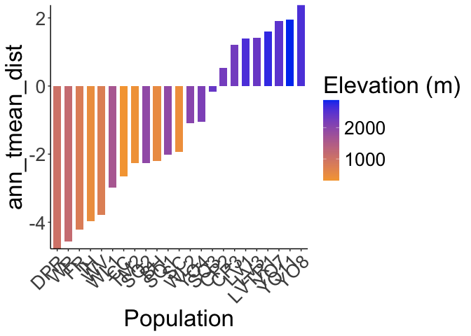<!-- -->

```r
ggsave("../output/Climate/Ann_Tmean_DistfromWL2_RecentClim.png", width = 12, height = 6, units = "in")

recent_bioclim_dist %>% 
  ggplot(aes(x=fct_reorder(parent.pop, mean_diurnal_range_dist), y=mean_diurnal_range_dist, group=parent.pop, fill=elev_m)) +
  geom_col(width = 0.7,position = position_dodge(0.75)) +
  scale_y_continuous(expand = c(0, 0)) +
  scale_fill_gradient(low = "#F5A540", high = "#0043F0") +
  labs(fill="Elevation (m)",x="Population") +
  theme_classic() +
  theme(text=element_text(size=25), axis.text.x = element_text(angle = 45,  hjust = 1))
```

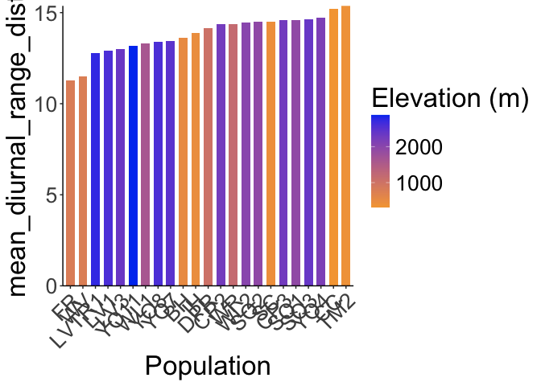<!-- -->

```r
ggsave("../output/Climate/Diurnal_Range_DistfromWL2_RecentClim.png", width = 12, height = 6, units = "in")

recent_bioclim_dist %>% 
  ggplot(aes(x=fct_reorder(parent.pop, temp_seasonality_dist), y=temp_seasonality_dist, group=parent.pop, fill=elev_m)) +
  geom_col(width = 0.7,position = position_dodge(0.75)) +
  scale_y_continuous(expand = c(0, 0)) +
  scale_fill_gradient(low = "#F5A540", high = "#0043F0") +
  labs(fill="Elevation (m)",x="Population") +
  theme_classic() +
  theme(text=element_text(size=25), axis.text.x = element_text(angle = 45,  hjust = 1))
```

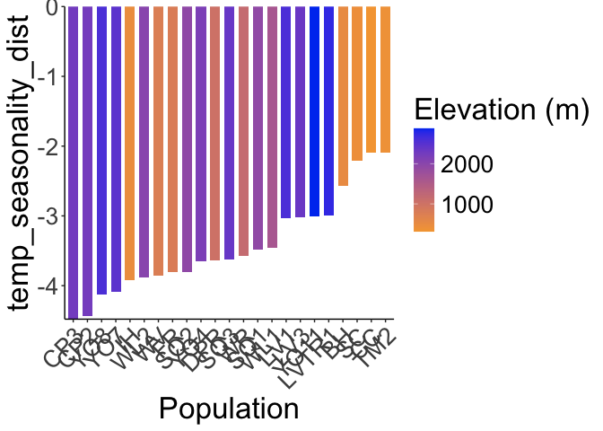<!-- -->

```r
ggsave("../output/Climate/Temp_Seasonality_DistfromWL2_RecentClim.png", width = 12, height = 6, units = "in")

recent_bioclim_dist %>% 
  ggplot(aes(x=fct_reorder(parent.pop, temp_ann_range_dist), y=temp_ann_range_dist, group=parent.pop, fill=elev_m)) +
  geom_col(width = 0.7,position = position_dodge(0.75)) +
  scale_y_continuous(expand = c(0, 0)) +
  scale_fill_gradient(low = "#F5A540", high = "#0043F0") +
  labs(fill="Elevation (m)",x="Population") +
  theme_classic() +
  theme(text=element_text(size=25), axis.text.x = element_text(angle = 45,  hjust = 1))
```

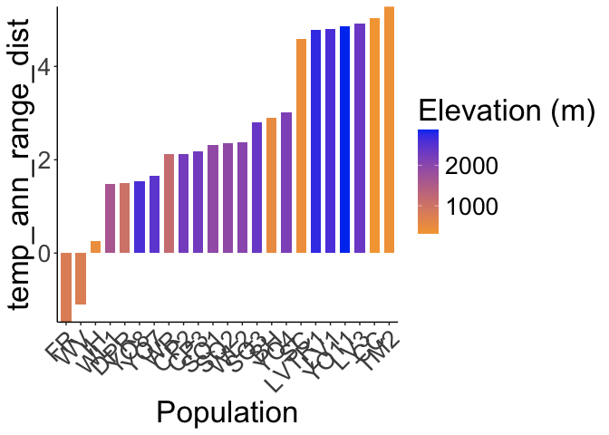<!-- -->

```r
ggsave("../output/Climate/Temp_Ann_Range_DistfromWL2_RecentClim.png", width = 12, height = 6, units = "in")

recent_bioclim_dist %>% 
  ggplot(aes(x=fct_reorder(parent.pop, tmean_wettest_month_dist), y=tmean_wettest_month_dist, group=parent.pop, fill=elev_m)) +
  geom_col(width = 0.7,position = position_dodge(0.75)) +
  scale_y_continuous(expand = c(0, 0)) +
  scale_fill_gradient(low = "#F5A540", high = "#0043F0") +
  labs(fill="Elevation (m)",x="Population") +
  theme_classic() +
  theme(text=element_text(size=25), axis.text.x = element_text(angle = 45,  hjust = 1))
```

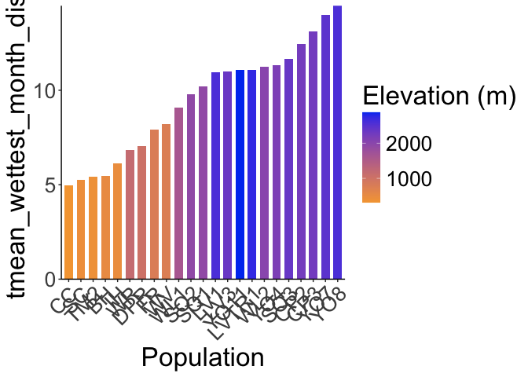<!-- -->

```r
ggsave("../output/Climate/Temp_Wet_DistfromWL2_RecentClim.png", width = 12, height = 6, units = "in")

recent_bioclim_dist %>% 
  ggplot(aes(x=fct_reorder(parent.pop, tmean_driest_month_dist), y=tmean_driest_month_dist, group=parent.pop, fill=elev_m)) +
  geom_col(width = 0.7,position = position_dodge(0.75)) +
  scale_y_continuous(expand = c(0, 0)) +
  scale_fill_gradient(low = "#F5A540", high = "#0043F0") +
  labs(fill="Elevation (m)",x="Population") +
  theme_classic() +
  theme(text=element_text(size=25), axis.text.x = element_text(angle = 45,  hjust = 1))
```

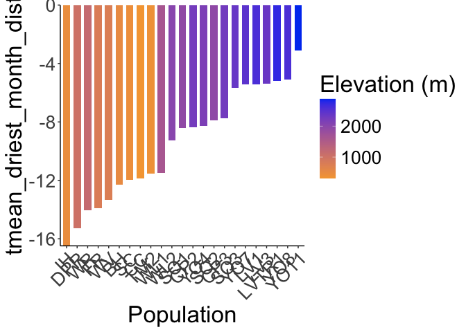<!-- -->

```r
ggsave("../output/Climate/Temp_Dry_DistfromWL2_RecentClim.png", width = 12, height = 6, units = "in")

recent_bioclim_dist %>% 
  ggplot(aes(x=fct_reorder(parent.pop, ann_ppt_dist), y=ann_ppt_dist, group=parent.pop, fill=elev_m)) +
  geom_col(width = 0.7,position = position_dodge(0.75)) +
  scale_y_continuous(expand = c(0, 0)) +
  scale_fill_gradient(low = "#F5A540", high = "#0043F0") +
  labs(fill="Elevation (m)",x="Population") +
  theme_classic() +
  theme(text=element_text(size=25), axis.text.x = element_text(angle = 45,  hjust = 1))
```

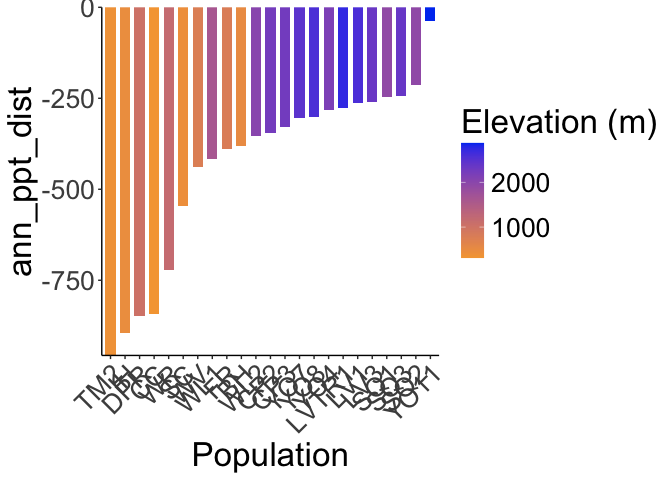<!-- -->

```r
ggsave("../output/Climate/Ann_PPT_DistfromWL2_RecentClim.png", width = 12, height = 6, units = "in")

recent_bioclim_dist %>% 
  ggplot(aes(x=fct_reorder(parent.pop, ppt_seasonality_dist), y=ppt_seasonality_dist, group=parent.pop, fill=elev_m)) +
  geom_col(width = 0.7,position = position_dodge(0.75)) +
  scale_y_continuous(expand = c(0, 0)) +
  scale_fill_gradient(low = "#F5A540", high = "#0043F0") +
  labs(fill="Elevation (m)",x="Population") +
  theme_classic() +
  theme(text=element_text(size=25), axis.text.x = element_text(angle = 45,  hjust = 1))
```

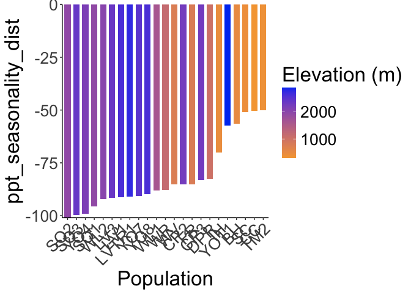<!-- -->

```r
ggsave("../output/Climate/PPT_Seasonality_DistfromWL2_RecentClim.png", width = 12, height = 6, units = "in")

recent_bioclim_dist %>% 
  ggplot(aes(x=fct_reorder(parent.pop, ppt_warmest_month_dist), y=ppt_warmest_month_dist, group=parent.pop, fill=elev_m)) +
  geom_col(width = 0.7,position = position_dodge(0.75)) +
  scale_y_continuous(expand = c(0, 0)) +
  scale_fill_gradient(low = "#F5A540", high = "#0043F0") +
  labs(fill="Elevation (m)",x="Population") +
  theme_classic() +
  theme(text=element_text(size=25), axis.text.x = element_text(angle = 45,  hjust = 1))
```

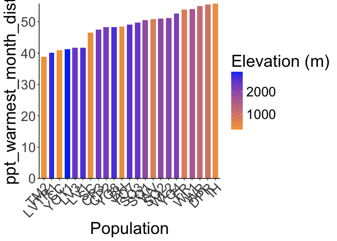<!-- -->

```r
ggsave("../output/Climate/PPT_Warm_DistfromWL2_RecentClim.png", width = 12, height = 6, units = "in")

recent_bioclim_dist %>% 
  ggplot(aes(x=fct_reorder(parent.pop, ppt_coldest_month_dist), y=ppt_coldest_month_dist, group=parent.pop, fill=elev_m)) +
  geom_col(width = 0.7,position = position_dodge(0.75)) +
  scale_y_continuous(expand = c(0, 0)) +
  scale_fill_gradient(low = "#F5A540", high = "#0043F0") +
  labs(fill="Elevation (m)",x="Population") +
  theme_classic() +
  theme(text=element_text(size=25), axis.text.x = element_text(angle = 45,  hjust = 1))
```

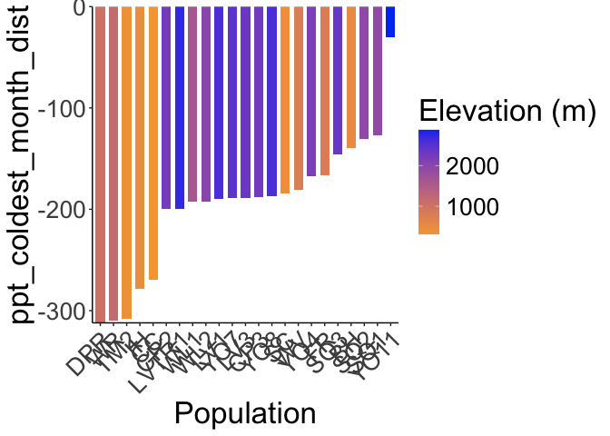<!-- -->

```r
ggsave("../output/Climate/PPT_Cold_DistfromWL2_RecentClim.png", width = 12, height = 6, units = "in")
```

Historical (subtraction distance)


```r
historical_bioclim_dist %>% 
  ggplot(aes(x=fct_reorder(parent.pop, ann_tmean_dist), y=ann_tmean_dist, group=parent.pop, fill=elev_m)) +
  geom_col(width = 0.7,position = position_dodge(0.75)) +
  scale_y_continuous(expand = c(0, 0)) +
  scale_fill_gradient(low = "#F5A540", high = "#0043F0") +
  labs(fill="Elevation (m)",x="Population") +
  theme_classic() +
  theme(text=element_text(size=25), axis.text.x = element_text(angle = 45,  hjust = 1))
```

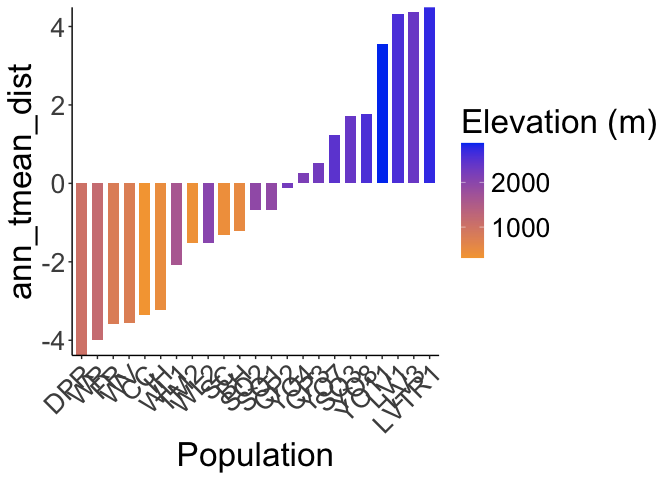<!-- -->

```r
ggsave("../output/Climate/Ann_Tmean_DistfromWL2_HistoricalClim.png", width = 12, height = 6, units = "in")

historical_bioclim_dist %>% 
  ggplot(aes(x=fct_reorder(parent.pop, mean_diurnal_range_dist), y=mean_diurnal_range_dist, group=parent.pop, fill=elev_m)) +
  geom_col(width = 0.7,position = position_dodge(0.75)) +
  scale_y_continuous(expand = c(0, 0)) +
  scale_fill_gradient(low = "#F5A540", high = "#0043F0") +
  labs(fill="Elevation (m)",x="Population") +
  theme_classic() +
  theme(text=element_text(size=25), axis.text.x = element_text(angle = 45,  hjust = 1))
```

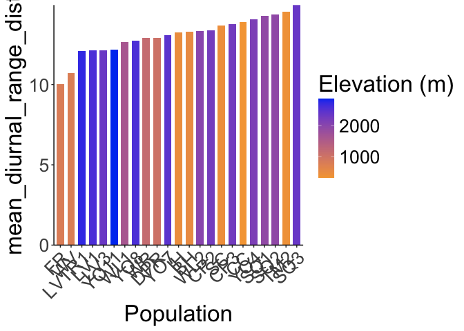<!-- -->

```r
ggsave("../output/Climate/Diurnal_Range_DistfromWL2_HistoricalClim.png", width = 12, height = 6, units = "in")

historical_bioclim_dist %>% 
  ggplot(aes(x=fct_reorder(parent.pop, temp_seasonality_dist), y=temp_seasonality_dist, group=parent.pop, fill=elev_m)) +
  geom_col(width = 0.7,position = position_dodge(0.75)) +
  scale_y_continuous(expand = c(0, 0)) +
  scale_fill_gradient(low = "#F5A540", high = "#0043F0") +
  labs(fill="Elevation (m)",x="Population") +
  theme_classic() +
  theme(text=element_text(size=25), axis.text.x = element_text(angle = 45,  hjust = 1))
```

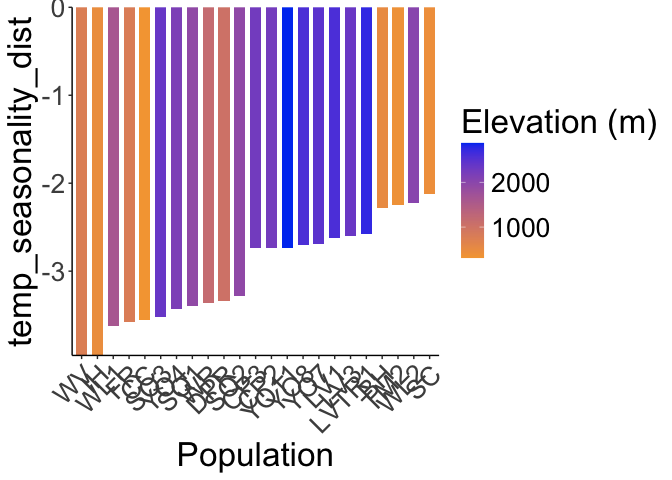<!-- -->

```r
ggsave("../output/Climate/Temp_Seasonality_DistfromWL2_HistoricalClim.png", width = 12, height = 6, units = "in")

historical_bioclim_dist %>% 
  ggplot(aes(x=fct_reorder(parent.pop, temp_ann_range_dist), y=temp_ann_range_dist, group=parent.pop, fill=elev_m)) +
  geom_col(width = 0.7,position = position_dodge(0.75)) +
  scale_y_continuous(expand = c(0, 0)) +
  scale_fill_gradient(low = "#F5A540", high = "#0043F0") +
  labs(fill="Elevation (m)",x="Population") +
  theme_classic() +
  theme(text=element_text(size=25), axis.text.x = element_text(angle = 45,  hjust = 1))
```

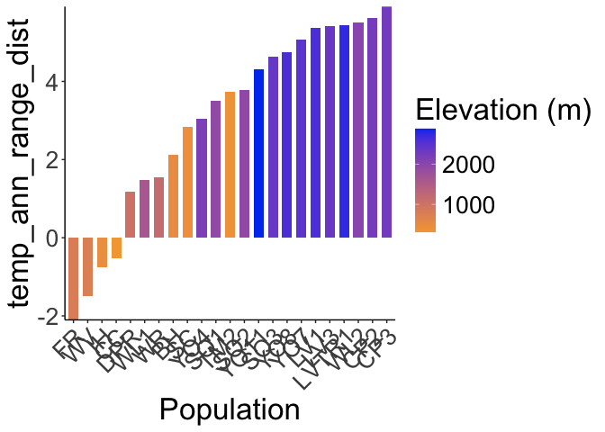<!-- -->

```r
ggsave("../output/Climate/Temp_Ann_Range_DistfromWL2_HistoricalClim.png", width = 12, height = 6, units = "in")

historical_bioclim_dist %>% 
  ggplot(aes(x=fct_reorder(parent.pop, tmean_wettest_month_dist), y=tmean_wettest_month_dist, group=parent.pop, fill=elev_m)) +
  geom_col(width = 0.7,position = position_dodge(0.75)) +
  scale_y_continuous(expand = c(0, 0)) +
  scale_fill_gradient(low = "#F5A540", high = "#0043F0") +
  labs(fill="Elevation (m)",x="Population") +
  theme_classic() +
  theme(text=element_text(size=25), axis.text.x = element_text(angle = 45,  hjust = 1))
```

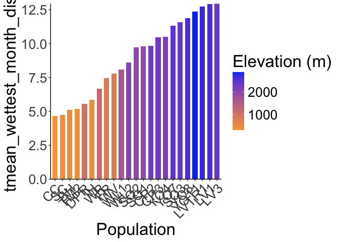<!-- -->

```r
ggsave("../output/Climate/Temp_Wet_DistfromWL2_HistoricalClim.png", width = 12, height = 6, units = "in")

historical_bioclim_dist %>% 
  ggplot(aes(x=fct_reorder(parent.pop, tmean_driest_month_dist), y=tmean_driest_month_dist, group=parent.pop, fill=elev_m)) +
  geom_col(width = 0.7,position = position_dodge(0.75)) +
  scale_y_continuous(expand = c(0, 0)) +
  scale_fill_gradient(low = "#F5A540", high = "#0043F0") +
  labs(fill="Elevation (m)",x="Population") +
  theme_classic() +
  theme(text=element_text(size=25), axis.text.x = element_text(angle = 45,  hjust = 1))
```

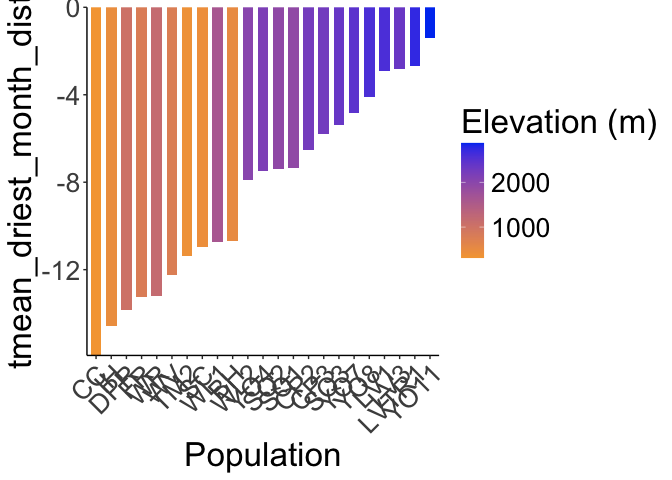<!-- -->

```r
ggsave("../output/Climate/Temp_Dry_DistfromWL2_HistoricalClim.png", width = 12, height = 6, units = "in")

historical_bioclim_dist %>% 
  ggplot(aes(x=fct_reorder(parent.pop, ann_ppt_dist), y=ann_ppt_dist, group=parent.pop, fill=elev_m)) +
  geom_col(width = 0.7,position = position_dodge(0.75)) +
  scale_y_continuous(expand = c(0, 0)) +
  scale_fill_gradient(low = "#F5A540", high = "#0043F0") +
  labs(fill="Elevation (m)",x="Population") +
  theme_classic() +
  theme(text=element_text(size=25), axis.text.x = element_text(angle = 45,  hjust = 1))
```

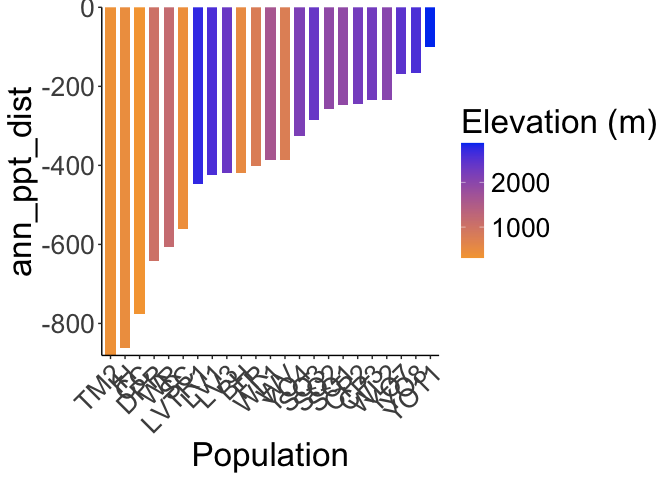<!-- -->

```r
ggsave("../output/Climate/Ann_PPT_DistfromWL2_HistoricalClim.png", width = 12, height = 6, units = "in")

historical_bioclim_dist %>% 
  ggplot(aes(x=fct_reorder(parent.pop, ppt_seasonality_dist), y=ppt_seasonality_dist, group=parent.pop, fill=elev_m)) +
  geom_col(width = 0.7,position = position_dodge(0.75)) +
  scale_y_continuous(expand = c(0, 0)) +
  scale_fill_gradient(low = "#F5A540", high = "#0043F0") +
  labs(fill="Elevation (m)",x="Population") +
  theme_classic() +
  theme(text=element_text(size=25), axis.text.x = element_text(angle = 45,  hjust = 1))
```

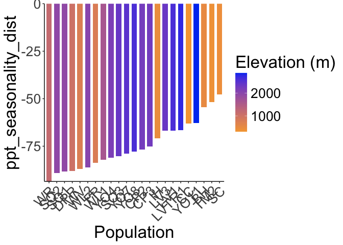<!-- -->

```r
ggsave("../output/Climate/PPT_Seasonality_DistfromWL2_HistoricalClim.png", width = 12, height = 6, units = "in")

historical_bioclim_dist %>% 
  ggplot(aes(x=fct_reorder(parent.pop, ppt_warmest_month_dist), y=ppt_warmest_month_dist, group=parent.pop, fill=elev_m)) +
  geom_col(width = 0.7,position = position_dodge(0.75)) +
  scale_y_continuous(expand = c(0, 0)) +
  scale_fill_gradient(low = "#F5A540", high = "#0043F0") +
  labs(fill="Elevation (m)",x="Population") +
  theme_classic() +
  theme(text=element_text(size=25), axis.text.x = element_text(angle = 45,  hjust = 1))
```

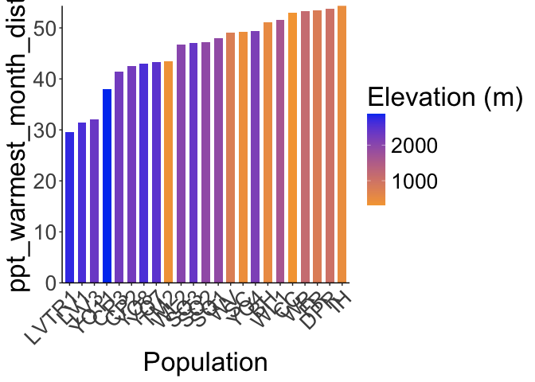<!-- -->

```r
ggsave("../output/Climate/PPT_Warm_DistfromWL2_HistoricalClim.png", width = 12, height = 6, units = "in")

historical_bioclim_dist %>% 
  ggplot(aes(x=fct_reorder(parent.pop, ppt_coldest_month_dist), y=ppt_coldest_month_dist, group=parent.pop, fill=elev_m)) +
  geom_col(width = 0.7,position = position_dodge(0.75)) +
  scale_y_continuous(expand = c(0, 0)) +
  scale_fill_gradient(low = "#F5A540", high = "#0043F0") +
  labs(fill="Elevation (m)",x="Population") +
  theme_classic() +
  theme(text=element_text(size=25), axis.text.x = element_text(angle = 45,  hjust = 1))
```

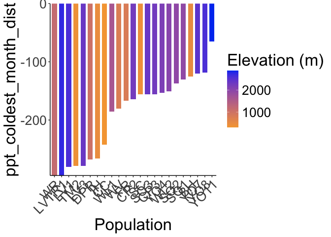<!-- -->

```r
ggsave("../output/Climate/PPT_Cold_DistfromWL2_HistoricalClim.png", width = 12, height = 6, units = "in")
```
