To Do: 
- Edit this code to be for all year data! - Should the distance still be from when the plants were growing? Or should it be for full 2023?
- Right now it's just for when the plants were growing 
- If do change it to the full year for the garden environment maybe should add in snowpack 


# Climate Distance at the WL2 Garden

Note, there is no air temperature data for WL2 in July 2023!! 
Add data for November and December once we get the data after snowmelt? 
- Reference growth season criteria 

## Relevant Libraries and Functions


``` r
library(raster)
```

```
## Loading required package: sp
```

``` r
library(tidyverse)
```

```
## ── Attaching core tidyverse packages ──────────────────────── tidyverse 2.0.0 ──
## ✔ dplyr     1.1.4     ✔ readr     2.1.5
## ✔ forcats   1.0.0     ✔ stringr   1.5.1
## ✔ ggplot2   3.5.1     ✔ tibble    3.2.1
## ✔ lubridate 1.9.3     ✔ tidyr     1.3.1
## ✔ purrr     1.0.2
```

```
## ── Conflicts ────────────────────────────────────────── tidyverse_conflicts() ──
## ✖ tidyr::extract() masks raster::extract()
## ✖ dplyr::filter()  masks stats::filter()
## ✖ dplyr::lag()     masks stats::lag()
## ✖ dplyr::select()  masks raster::select()
## ℹ Use the conflicted package (<http://conflicted.r-lib.org/>) to force all conflicts to become errors
```

``` r
library(conflicted)
conflicts_prefer(dplyr::select())
```

```
## [conflicted] Will prefer dplyr::select over any other package.
```

``` r
conflicts_prefer(dplyr::filter)
```

```
## [conflicted] Will prefer dplyr::filter over any other package.
```

``` r
library(ggrepel)
library(cowplot)
library(gridExtra)
library(naniar) #replaces values with NA

sem <- function(x, na.rm=FALSE) {
  sd(x,na.rm=na.rm)/sqrt(length(na.omit(x)))
} #standard error function 

get_legend<-function(myggplot){
  tmp <- ggplot_gtable(ggplot_build(myggplot))
  leg <- which(sapply(tmp$grobs, function(x) x$name) == "guide-box")
  legend <- tmp$grobs[[leg]]
  return(legend)
} #legend function for grid_arrange

elev_three_palette <- c("#0043F0", "#C9727F", "#F5A540") #colors from Gremer et al 2019
elev_order <- c("High", "Mid", "Low")
```

## Home Climates

### Flint


``` r
pops_flint_avgs <- read_csv("../output/Climate/fullyear_FlintAvgs.csv")
```

```
## Rows: 46 Columns: 11
## ── Column specification ────────────────────────────────────────────────────────
## Delimiter: ","
## chr (3): parent.pop, elevation.group, TimePd
## dbl (8): elev_m, Lat, Long, cwd, pck, ppt, tmn, tmx
## 
## ℹ Use `spec()` to retrieve the full column specification for this data.
## ℹ Specify the column types or set `show_col_types = FALSE` to quiet this message.
```

``` r
head(pops_flint_avgs)
```

```
## # A tibble: 6 × 11
##   parent.pop elevation.group elev_m   Lat  Long   cwd    pck   ppt    tmn   tmx
##   <chr>      <chr>            <dbl> <dbl> <dbl> <dbl>  <dbl> <dbl>  <dbl> <dbl>
## 1 BH         Low               511.  37.4 -120.  75.9   0     48.5  8.93   23.6
## 2 CC         Low               313   39.6 -121.  59.9   0     84.3 10.0    23.3
## 3 CP2        High             2244.  38.7 -120.  62.9 218.   107.   1.18   13.4
## 4 CP3        High             2266.  38.7 -120.  46.2 236.   103.   0.529  12.6
## 5 DPR        Mid              1019.  39.2 -121.  27.5   7.63 121.   7.89   20.2
## 6 FR         Mid               787   40.0 -121.  75.5  14.1   84.9  5.70   20.1
## # ℹ 1 more variable: TimePd <chr>
```

``` r
unique(pops_flint_avgs$parent.pop) #only home pops
```

```
##  [1] "BH"    "CC"    "CP2"   "CP3"   "DPR"   "FR"    "IH"    "LV1"   "LV3"  
## [10] "LVTR1" "SC"    "SQ1"   "SQ2"   "SQ3"   "TM2"   "WL1"   "WL2"   "WR"   
## [19] "WV"    "YO11"  "YO4"   "YO7"   "YO8"
```

``` r
unique(pops_flint_avgs$TimePd) # recent and historical timeperiod 
```

```
## [1] "Recent"     "Historical"
```

``` r
pops_flint_recent_avgs <- pops_flint_avgs %>% filter(TimePd=="Recent")
head(pops_flint_recent_avgs)
```

```
## # A tibble: 6 × 11
##   parent.pop elevation.group elev_m   Lat  Long   cwd    pck   ppt    tmn   tmx
##   <chr>      <chr>            <dbl> <dbl> <dbl> <dbl>  <dbl> <dbl>  <dbl> <dbl>
## 1 BH         Low               511.  37.4 -120.  75.9   0     48.5  8.93   23.6
## 2 CC         Low               313   39.6 -121.  59.9   0     84.3 10.0    23.3
## 3 CP2        High             2244.  38.7 -120.  62.9 218.   107.   1.18   13.4
## 4 CP3        High             2266.  38.7 -120.  46.2 236.   103.   0.529  12.6
## 5 DPR        Mid              1019.  39.2 -121.  27.5   7.63 121.   7.89   20.2
## 6 FR         Mid               787   40.0 -121.  75.5  14.1   84.9  5.70   20.1
## # ℹ 1 more variable: TimePd <chr>
```

``` r
pops_flint_historic_avgs <-  pops_flint_avgs %>% filter(TimePd=="Historical")
head(pops_flint_historic_avgs)
```

```
## # A tibble: 6 × 11
##   parent.pop elevation.group elev_m   Lat  Long   cwd     pck   ppt    tmn   tmx
##   <chr>      <chr>            <dbl> <dbl> <dbl> <dbl>   <dbl> <dbl>  <dbl> <dbl>
## 1 BH         Low               511.  37.4 -120.  74.5 1.95e-2  48.3  7.74   22.9
## 2 CC         Low               313   39.6 -121.  59.7 7.93e-2  81.9  8.90   22.9
## 3 CP2        High             2244.  38.7 -120.  60.4 2.65e+2 110.  -0.305  12.5
## 4 CP3        High             2266.  38.7 -120.  43.8 2.82e+2 106.  -0.852  11.8
## 5 DPR        Mid              1019.  39.2 -121.  26.5 2.05e+1 120.   6.23   19.7
## 6 FR         Mid               787   40.0 -121.  74.0 1.92e+1  84.2  4.54   20.1
## # ℹ 1 more variable: TimePd <chr>
```

``` r
names(pops_flint_historic_avgs)
```

```
##  [1] "parent.pop"      "elevation.group" "elev_m"          "Lat"            
##  [5] "Long"            "cwd"             "pck"             "ppt"            
##  [9] "tmn"             "tmx"             "TimePd"
```

### BioClim


``` r
pops_bioclim_avgs <-  read_csv("../output/Climate/fullyear_BioClimAvgs.csv") 
```

```
## Rows: 46 Columns: 16
## ── Column specification ────────────────────────────────────────────────────────
## Delimiter: ","
## chr  (3): parent.pop, elevation.group, TimePd
## dbl (13): elev_m, Lat, Long, ann_tmean, mean_diurnal_range, temp_seasonality...
## 
## ℹ Use `spec()` to retrieve the full column specification for this data.
## ℹ Specify the column types or set `show_col_types = FALSE` to quiet this message.
```

``` r
head(pops_bioclim_avgs)
```

```
## # A tibble: 6 × 16
##   parent.pop elevation.group elev_m   Lat  Long ann_tmean mean_diurnal_range
##   <chr>      <chr>            <dbl> <dbl> <dbl>     <dbl>              <dbl>
## 1 BH         Low               511.  37.4 -120.     16.2                14.6
## 2 CC         Low               313   39.6 -121.     16.7                13.2
## 3 CP2        High             2244.  38.7 -120.      7.30               12.2
## 4 CP3        High             2266.  38.7 -120.      6.59               12.1
## 5 DPR        Mid              1019.  39.2 -121.     14.1                12.4
## 6 FR         Mid               787   40.0 -121.     12.9                14.4
## # ℹ 9 more variables: temp_seasonality <dbl>, temp_ann_range <dbl>,
## #   tmean_wettest_quarter <dbl>, tmean_driest_quarter <dbl>, ann_ppt <dbl>,
## #   ppt_seasonality <dbl>, ppt_warmest_quarter <dbl>,
## #   ppt_coldest_quarter <dbl>, TimePd <chr>
```

``` r
unique(pops_bioclim_avgs$parent.pop) #only home pops
```

```
##  [1] "BH"    "CC"    "CP2"   "CP3"   "DPR"   "FR"    "IH"    "LV1"   "LV3"  
## [10] "LVTR1" "SC"    "SQ1"   "SQ2"   "SQ3"   "TM2"   "WL1"   "WL2"   "WR"   
## [19] "WV"    "YO11"  "YO4"   "YO7"   "YO8"
```

``` r
unique(pops_bioclim_avgs$TimePd) # recent and historical timeperiod 
```

```
## [1] "Recent"     "Historical"
```

``` r
pops_bioclim_recent_avgs <- pops_bioclim_avgs %>%  filter(TimePd=="Recent")
head(pops_bioclim_recent_avgs)
```

```
## # A tibble: 6 × 16
##   parent.pop elevation.group elev_m   Lat  Long ann_tmean mean_diurnal_range
##   <chr>      <chr>            <dbl> <dbl> <dbl>     <dbl>              <dbl>
## 1 BH         Low               511.  37.4 -120.     16.2                14.6
## 2 CC         Low               313   39.6 -121.     16.7                13.2
## 3 CP2        High             2244.  38.7 -120.      7.30               12.2
## 4 CP3        High             2266.  38.7 -120.      6.59               12.1
## 5 DPR        Mid              1019.  39.2 -121.     14.1                12.4
## 6 FR         Mid               787   40.0 -121.     12.9                14.4
## # ℹ 9 more variables: temp_seasonality <dbl>, temp_ann_range <dbl>,
## #   tmean_wettest_quarter <dbl>, tmean_driest_quarter <dbl>, ann_ppt <dbl>,
## #   ppt_seasonality <dbl>, ppt_warmest_quarter <dbl>,
## #   ppt_coldest_quarter <dbl>, TimePd <chr>
```

``` r
pops_bioclim_historical_avgs <- pops_bioclim_avgs %>% filter(TimePd=="Historical")
head(pops_bioclim_historical_avgs)
```

```
## # A tibble: 6 × 16
##   parent.pop elevation.group elev_m   Lat  Long ann_tmean mean_diurnal_range
##   <chr>      <chr>            <dbl> <dbl> <dbl>     <dbl>              <dbl>
## 1 BH         Low               511.  37.4 -120.     15.3                15.2
## 2 CC         Low               313   39.6 -121.     15.9                14.0
## 3 CP2        High             2244.  38.7 -120.      6.11               12.8
## 4 CP3        High             2266.  38.7 -120.      5.45               12.6
## 5 DPR        Mid              1019.  39.2 -121.     13.0                13.5
## 6 FR         Mid               787   40.0 -121.     12.3                15.6
## # ℹ 9 more variables: temp_seasonality <dbl>, temp_ann_range <dbl>,
## #   tmean_wettest_quarter <dbl>, tmean_driest_quarter <dbl>, ann_ppt <dbl>,
## #   ppt_seasonality <dbl>, ppt_warmest_quarter <dbl>,
## #   ppt_coldest_quarter <dbl>, TimePd <chr>
```

``` r
names(pops_bioclim_historical_avgs)
```

```
##  [1] "parent.pop"            "elevation.group"       "elev_m"               
##  [4] "Lat"                   "Long"                  "ann_tmean"            
##  [7] "mean_diurnal_range"    "temp_seasonality"      "temp_ann_range"       
## [10] "tmean_wettest_quarter" "tmean_driest_quarter"  "ann_ppt"              
## [13] "ppt_seasonality"       "ppt_warmest_quarter"   "ppt_coldest_quarter"  
## [16] "TimePd"
```

## WL2 Climate Data (July 2023-Oct 2023)

### From Flint (changed this from Magney MetStation)

Per growth season code: Last month = snowpack. \> 70 mm OR pck > 0 and min temp < 0 OR min temp < -5 (moderate freeze)

``` r
WL2_climate <- read_csv("../output/Climate/flint_climate_UCDpops.csv") %>% 
  filter(parent.pop=="WL2_Garden") %>% 
  filter(year==2023) %>% 
  mutate(tavg = (tmn + tmx)/2, t_diurnal = (tmx-tmn))
```

```
## Rows: 38675 Columns: 14
## ── Column specification ────────────────────────────────────────────────────────
## Delimiter: ","
## chr  (3): parent.pop, elevation.group, month
## dbl (11): elev_m, Lat, Long, year, aet, cwd, pck, pet, ppt, tmn, tmx
## 
## ℹ Use `spec()` to retrieve the full column specification for this data.
## ℹ Specify the column types or set `show_col_types = FALSE` to quiet this message.
```

``` r
head(WL2_climate)
```

```
## # A tibble: 6 × 16
##   parent.pop elevation.group elev_m   Lat  Long  year month    aet   cwd    pck
##   <chr>      <chr>            <dbl> <dbl> <dbl> <dbl> <chr>  <dbl> <dbl>  <dbl>
## 1 WL2_Garden High              2020  38.8 -120.  2023 apr    41.5   46.4 1787. 
## 2 WL2_Garden High              2020  38.8 -120.  2023 aug   106.    43.8    0  
## 3 WL2_Garden High              2020  38.8 -120.  2023 dec     2.78  24.6   16.9
## 4 WL2_Garden High              2020  38.8 -120.  2023 feb     8.62  22.4 1422. 
## 5 WL2_Garden High              2020  38.8 -120.  2023 jan     7.23  16.4 1208. 
## 6 WL2_Garden High              2020  38.8 -120.  2023 jul    75.7  100.     0  
## # ℹ 6 more variables: pet <dbl>, ppt <dbl>, tmn <dbl>, tmx <dbl>, tavg <dbl>,
## #   t_diurnal <dbl>
```

``` r
summary(WL2_climate)
```

```
##   parent.pop        elevation.group        elev_m          Lat       
##  Length:12          Length:12          Min.   :2020   Min.   :38.83  
##  Class :character   Class :character   1st Qu.:2020   1st Qu.:38.83  
##  Mode  :character   Mode  :character   Median :2020   Median :38.83  
##                                        Mean   :2020   Mean   :38.83  
##                                        3rd Qu.:2020   3rd Qu.:38.83  
##                                        Max.   :2020   Max.   :38.83  
##       Long             year         month                aet        
##  Min.   :-120.3   Min.   :2023   Length:12          Min.   :  2.78  
##  1st Qu.:-120.3   1st Qu.:2023   Class :character   1st Qu.:  6.98  
##  Median :-120.3   Median :2023   Mode  :character   Median : 37.69  
##  Mean   :-120.3   Mean   :2023                      Mean   : 44.95  
##  3rd Qu.:-120.3   3rd Qu.:2023                      3rd Qu.: 78.27  
##  Max.   :-120.3   Max.   :2023                      Max.   :115.16  
##       cwd              pck              pet              ppt        
##  Min.   : 14.83   Min.   :   0.0   Min.   : 23.60   Min.   :  0.01  
##  1st Qu.: 24.06   1st Qu.:   0.0   1st Qu.: 34.08   1st Qu.: 36.49  
##  Median : 38.83   Median : 292.8   Median : 81.55   Median : 68.33  
##  Mean   : 42.14   Mean   : 690.0   Mean   : 87.09   Mean   :161.87  
##  3rd Qu.: 49.56   3rd Qu.:1323.9   3rd Qu.:134.12   3rd Qu.:175.70  
##  Max.   :100.37   Max.   :1986.3   Max.   :176.10   Max.   :604.81  
##       tmn              tmx             tavg          t_diurnal    
##  Min.   :-6.150   Min.   : 2.13   Min.   :-2.010   Min.   : 8.16  
##  1st Qu.:-2.510   1st Qu.: 6.76   1st Qu.: 2.500   1st Qu.: 9.42  
##  Median : 1.540   Median :11.87   Median : 6.660   Median :10.24  
##  Mean   : 2.315   Mean   :12.62   Mean   : 7.465   Mean   :10.30  
##  3rd Qu.: 6.145   3rd Qu.:17.52   3rd Qu.:11.832   3rd Qu.:11.32  
##  Max.   :13.220   Max.   :25.95   Max.   :19.585   Max.   :12.73
```

``` r
WL2_climate_growmos <- WL2_climate %>% 
  filter(month=="jul" | month=="aug" | month=="sep" | month=="oct" |
           month=="nov" | month=="dec") #included Dec as the "last month" per growth season code 

WL2_climate_flint <- WL2_climate_growmos %>% #get the means for the variables to compare to home sites 
  summarise(cwd_WL2=mean(cwd),ppt_WL2=mean(ppt), pck_WL2=mean(pck), tmn_WL2=mean(tmn), tmx_WL2=mean(tmx))
WL2_climate_flint
```

```
## # A tibble: 1 × 5
##   cwd_WL2 ppt_WL2 pck_WL2 tmn_WL2 tmx_WL2
##     <dbl>   <dbl>   <dbl>   <dbl>   <dbl>
## 1    54.7    61.5    2.81    6.29    16.8
```

## WL2 Climate Trends

``` r
WL2_climate$month <- factor(WL2_climate$month, levels = c("jan", "feb", "mar", "apr", "may", "jun", "jul", "aug", "sep", "oct","nov","dec"))

WL2_climate %>% 
  ggplot(aes(x=month,y=cwd)) +
  geom_point()
```

<!-- -->

``` r
WL2_climate %>% 
  ggplot(aes(x=month,y=pck)) +
  geom_point() +
  facet_wrap(~year)
```

<!-- -->

``` r
WL2_climate %>% 
  ggplot(aes(x=month,y=tmx)) +
  geom_point()
```

<!-- -->

``` r
WL2_climate %>% 
  ggplot(aes(x=month,y=tmn)) +
  geom_point()
```

<!-- -->

``` r
WL2_climate %>% 
  ggplot(aes(x=month,y=ppt)) +
  geom_point()
```

<!-- -->


### BioClim

Calculating wettest, driest, warmest, and coldest months

Note I called these "quarter" instead of month for merging with the home climate quarter data 

``` r
WL2_wettest_quarter <- WL2_climate_growmos %>%  
  slice_max(ppt)

WL2_driest_quarter <- WL2_climate_growmos %>% 
  slice_min(ppt)

WL2_warmest_quarter <- WL2_climate_growmos %>% 
  slice_max(tavg)

WL2_coldest_quarter <- WL2_climate_growmos %>%
  slice_min(tavg)
```

Bio 1, 2, 4, 7, 12, 15


``` r
bioclim_WL2_calc <- WL2_climate_growmos %>% 
  summarise(ann_tmean=mean(tavg),  #Bio1 - Annual Mean Temperature
            mean_diurnal_range=mean(t_diurnal), #Bio2 - Mean Diurnal Range
            temp_seasonality=sd(tavg), #Bio4 - Temperature Seasonality
            temp_ann_range=(max(tmx))-(min(tmn)), #bio7 - temp annual range
            ann_ppt=sum(ppt), #bio12 - annual precip
            ppt_seasonality=cv(ppt+1)) #bio15 - Precipitation Seasonality (+1 to avoid strange CVs for areas where mean rainfaill is < 1)
bioclim_WL2_calc
```

```
## # A tibble: 1 × 6
##   ann_tmean mean_diurnal_range temp_seasonality temp_ann_range ann_ppt
##       <dbl>              <dbl>            <dbl>          <dbl>   <dbl>
## 1      11.6               10.5             6.58           26.4    369.
## # ℹ 1 more variable: ppt_seasonality <dbl>
```

Bio 8(Q), 9(Q), 18(Q), 19(Q)


``` r
#bio8 = tmean_wettest_quarter
bio8_WL2 <- WL2_wettest_quarter %>% 
  dplyr::select(tmean_wettest_quarter=tavg)

#bio9 = tmean_driest_quarter
bio9_WL2 <- WL2_driest_quarter %>% 
  dplyr::select(tmean_driest_quarter=tavg)

bio8_9_WL2 <- bind_cols(bio8_WL2, bio9_WL2)

#bio18 = ppt_warmest_quarter
bio18_WL2 <- WL2_warmest_quarter %>% 
  dplyr::select(ppt_warmest_quarter=ppt)

#bio19 = ppt_coldest_quarter
bio19_WL2 <- WL2_wettest_quarter %>% 
  dplyr::select(ppt_coldest_quarter=ppt)

bio18_19_WL2 <- bind_cols(bio18_WL2, bio19_WL2)

all_periods_WL2 <- bind_cols(bio8_9_WL2, bio18_19_WL2)
```

Merge all bioclims


``` r
WL2_bioclim_final <- bind_cols(bioclim_WL2_calc, all_periods_WL2) %>% 
  rename_with(~paste0(., "_WL2"), 1:10)
summary(WL2_bioclim_final)
```

```
##  ann_tmean_WL2   mean_diurnal_range_WL2 temp_seasonality_WL2 temp_ann_range_WL2
##  Min.   :11.56   Min.   :10.54          Min.   :6.58         Min.   :26.43     
##  1st Qu.:11.56   1st Qu.:10.54          1st Qu.:6.58         1st Qu.:26.43     
##  Median :11.56   Median :10.54          Median :6.58         Median :26.43     
##  Mean   :11.56   Mean   :10.54          Mean   :6.58         Mean   :26.43     
##  3rd Qu.:11.56   3rd Qu.:10.54          3rd Qu.:6.58         3rd Qu.:26.43     
##  Max.   :11.56   Max.   :10.54          Max.   :6.58         Max.   :26.43     
##   ann_ppt_WL2    ppt_seasonality_WL2 tmean_wettest_quarter_WL2
##  Min.   :368.9   Min.   :88.03       Min.   :3.6              
##  1st Qu.:368.9   1st Qu.:88.03       1st Qu.:3.6              
##  Median :368.9   Median :88.03       Median :3.6              
##  Mean   :368.9   Mean   :88.03       Mean   :3.6              
##  3rd Qu.:368.9   3rd Qu.:88.03       3rd Qu.:3.6              
##  Max.   :368.9   Max.   :88.03       Max.   :3.6              
##  tmean_driest_quarter_WL2 ppt_warmest_quarter_WL2 ppt_coldest_quarter_WL2
##  Min.   :19.59            Min.   :0.01            Min.   :156.2          
##  1st Qu.:19.59            1st Qu.:0.01            1st Qu.:156.2          
##  Median :19.59            Median :0.01            Median :156.2          
##  Mean   :19.59            Mean   :0.01            Mean   :156.2          
##  3rd Qu.:19.59            3rd Qu.:0.01            3rd Qu.:156.2          
##  Max.   :19.59            Max.   :0.01            Max.   :156.2
```


## Gower's Climate Distance

(1/P) \* SUM ((absolute value(Ai - Bi)) / range(i)) for each variable

-   P = number of environmental variables = 13 (without CWD)

-   Ai = 30 year avg of that variable for the home site

-   Bi = July 2023-Dec 2023 avg of that variable for the WL2 garden

-   Range(i) = maximum - minimum of that variable in the whole data set
    (across sites)

### Combine the flint and bioclim variables 


``` r
WL2_climate_all <- bind_cols(WL2_climate_flint, WL2_bioclim_final)
dim(WL2_climate_all)
```

```
## [1]  1 15
```

``` r
home_climates_all_recent <- left_join(pops_flint_recent_avgs, pops_bioclim_recent_avgs)
```

```
## Joining with `by = join_by(parent.pop, elevation.group, elev_m, Lat, Long,
## TimePd)`
```

``` r
home_climates_all_historic <- left_join(pops_flint_historic_avgs, pops_bioclim_historical_avgs)
```

```
## Joining with `by = join_by(parent.pop, elevation.group, elev_m, Lat, Long,
## TimePd)`
```

``` r
WL2_home_climate_recent <- bind_cols(WL2_climate_all, home_climates_all_recent)
summary(WL2_home_climate_recent)
```

```
##     cwd_WL2         ppt_WL2         pck_WL2         tmn_WL2     
##  Min.   :54.67   Min.   :61.48   Min.   :2.813   Min.   :6.293  
##  1st Qu.:54.67   1st Qu.:61.48   1st Qu.:2.813   1st Qu.:6.293  
##  Median :54.67   Median :61.48   Median :2.813   Median :6.293  
##  Mean   :54.67   Mean   :61.48   Mean   :2.813   Mean   :6.293  
##  3rd Qu.:54.67   3rd Qu.:61.48   3rd Qu.:2.813   3rd Qu.:6.293  
##  Max.   :54.67   Max.   :61.48   Max.   :2.813   Max.   :6.293  
##     tmx_WL2      ann_tmean_WL2   mean_diurnal_range_WL2 temp_seasonality_WL2
##  Min.   :16.83   Min.   :11.56   Min.   :10.54          Min.   :6.58        
##  1st Qu.:16.83   1st Qu.:11.56   1st Qu.:10.54          1st Qu.:6.58        
##  Median :16.83   Median :11.56   Median :10.54          Median :6.58        
##  Mean   :16.83   Mean   :11.56   Mean   :10.54          Mean   :6.58        
##  3rd Qu.:16.83   3rd Qu.:11.56   3rd Qu.:10.54          3rd Qu.:6.58        
##  Max.   :16.83   Max.   :11.56   Max.   :10.54          Max.   :6.58        
##  temp_ann_range_WL2  ann_ppt_WL2    ppt_seasonality_WL2
##  Min.   :26.43      Min.   :368.9   Min.   :88.03      
##  1st Qu.:26.43      1st Qu.:368.9   1st Qu.:88.03      
##  Median :26.43      Median :368.9   Median :88.03      
##  Mean   :26.43      Mean   :368.9   Mean   :88.03      
##  3rd Qu.:26.43      3rd Qu.:368.9   3rd Qu.:88.03      
##  Max.   :26.43      Max.   :368.9   Max.   :88.03      
##  tmean_wettest_quarter_WL2 tmean_driest_quarter_WL2 ppt_warmest_quarter_WL2
##  Min.   :3.6               Min.   :19.59            Min.   :0.01           
##  1st Qu.:3.6               1st Qu.:19.59            1st Qu.:0.01           
##  Median :3.6               Median :19.59            Median :0.01           
##  Mean   :3.6               Mean   :19.59            Mean   :0.01           
##  3rd Qu.:3.6               3rd Qu.:19.59            3rd Qu.:0.01           
##  Max.   :3.6               Max.   :19.59            Max.   :0.01           
##  ppt_coldest_quarter_WL2  parent.pop        elevation.group        elev_m      
##  Min.   :156.2           Length:23          Length:23          Min.   : 313.0  
##  1st Qu.:156.2           Class :character   Class :character   1st Qu.: 767.9  
##  Median :156.2           Mode  :character   Mode  :character   Median :1934.5  
##  Mean   :156.2                                                 Mean   :1649.7  
##  3rd Qu.:156.2                                                 3rd Qu.:2363.4  
##  Max.   :156.2                                                 Max.   :2872.3  
##       Lat             Long             cwd             pck        
##  Min.   :36.56   Min.   :-123.0   Min.   :27.53   Min.   :  0.00  
##  1st Qu.:37.81   1st Qu.:-121.3   1st Qu.:49.57   1st Qu.: 10.88  
##  Median :38.79   Median :-120.3   Median :55.94   Median : 65.18  
##  Mean   :38.74   Mean   :-120.4   Mean   :56.19   Mean   :136.70  
##  3rd Qu.:39.59   3rd Qu.:-119.7   3rd Qu.:61.78   3rd Qu.:225.93  
##  Max.   :40.74   Max.   :-118.8   Max.   :75.87   Max.   :453.99  
##       ppt              tmn                tmx           TimePd         
##  Min.   : 48.50   Min.   :-2.57564   Min.   :10.42   Length:23         
##  1st Qu.: 84.64   1st Qu.:-0.05428   1st Qu.:12.65   Class :character  
##  Median : 94.31   Median : 3.41272   Median :15.68   Mode  :character  
##  Mean   : 99.04   Mean   : 3.61545   Mean   :16.50                     
##  3rd Qu.:107.40   3rd Qu.: 7.50051   3rd Qu.:20.18                     
##  Max.   :151.23   Max.   :10.03667   Max.   :23.57                     
##    ann_tmean      mean_diurnal_range temp_seasonality temp_ann_range 
##  Min.   : 3.923   Min.   :11.88      Min.   :647.3    Min.   :30.67  
##  1st Qu.: 6.298   1st Qu.:12.25      1st Qu.:666.4    1st Qu.:31.55  
##  Median : 9.545   Median :12.71      Median :686.0    Median :31.74  
##  Mean   :10.059   Mean   :12.89      Mean   :681.9    Mean   :31.99  
##  3rd Qu.:13.572   3rd Qu.:13.33      3rd Qu.:694.1    3rd Qu.:32.06  
##  Max.   :16.660   Max.   :14.64      Max.   :719.8    Max.   :34.27  
##  tmean_wettest_quarter tmean_driest_quarter    ann_ppt     ppt_seasonality
##  Min.   :-1.6558       Min.   : 6.672       Min.   : 582   Min.   :108.1  
##  1st Qu.: 0.2719       1st Qu.: 9.622       1st Qu.:1016   1st Qu.:115.0  
##  Median : 3.4503       Median :12.628       Median :1132   Median :122.9  
##  Mean   : 3.9105       Mean   :13.267       Mean   :1188   Mean   :119.7  
##  3rd Qu.: 7.3811       3rd Qu.:16.829       3rd Qu.:1289   3rd Qu.:123.9  
##  Max.   :10.3001       Max.   :19.894       Max.   :1815   Max.   :130.2  
##  ppt_warmest_quarter ppt_coldest_quarter
##  Min.   : 47.65      Min.   :329.3      
##  1st Qu.: 91.04      1st Qu.:550.5      
##  Median :100.25      Median :622.8      
##  Mean   :110.72      Mean   :620.1      
##  3rd Qu.:125.81      3rd Qu.:656.0      
##  Max.   :187.23      Max.   :860.6
```

``` r
WL2_home_climate_historic <- bind_cols(WL2_climate_all, home_climates_all_historic)
summary(WL2_home_climate_historic)
```

```
##     cwd_WL2         ppt_WL2         pck_WL2         tmn_WL2     
##  Min.   :54.67   Min.   :61.48   Min.   :2.813   Min.   :6.293  
##  1st Qu.:54.67   1st Qu.:61.48   1st Qu.:2.813   1st Qu.:6.293  
##  Median :54.67   Median :61.48   Median :2.813   Median :6.293  
##  Mean   :54.67   Mean   :61.48   Mean   :2.813   Mean   :6.293  
##  3rd Qu.:54.67   3rd Qu.:61.48   3rd Qu.:2.813   3rd Qu.:6.293  
##  Max.   :54.67   Max.   :61.48   Max.   :2.813   Max.   :6.293  
##     tmx_WL2      ann_tmean_WL2   mean_diurnal_range_WL2 temp_seasonality_WL2
##  Min.   :16.83   Min.   :11.56   Min.   :10.54          Min.   :6.58        
##  1st Qu.:16.83   1st Qu.:11.56   1st Qu.:10.54          1st Qu.:6.58        
##  Median :16.83   Median :11.56   Median :10.54          Median :6.58        
##  Mean   :16.83   Mean   :11.56   Mean   :10.54          Mean   :6.58        
##  3rd Qu.:16.83   3rd Qu.:11.56   3rd Qu.:10.54          3rd Qu.:6.58        
##  Max.   :16.83   Max.   :11.56   Max.   :10.54          Max.   :6.58        
##  temp_ann_range_WL2  ann_ppt_WL2    ppt_seasonality_WL2
##  Min.   :26.43      Min.   :368.9   Min.   :88.03      
##  1st Qu.:26.43      1st Qu.:368.9   1st Qu.:88.03      
##  Median :26.43      Median :368.9   Median :88.03      
##  Mean   :26.43      Mean   :368.9   Mean   :88.03      
##  3rd Qu.:26.43      3rd Qu.:368.9   3rd Qu.:88.03      
##  Max.   :26.43      Max.   :368.9   Max.   :88.03      
##  tmean_wettest_quarter_WL2 tmean_driest_quarter_WL2 ppt_warmest_quarter_WL2
##  Min.   :3.6               Min.   :19.59            Min.   :0.01           
##  1st Qu.:3.6               1st Qu.:19.59            1st Qu.:0.01           
##  Median :3.6               Median :19.59            Median :0.01           
##  Mean   :3.6               Mean   :19.59            Mean   :0.01           
##  3rd Qu.:3.6               3rd Qu.:19.59            3rd Qu.:0.01           
##  Max.   :3.6               Max.   :19.59            Max.   :0.01           
##  ppt_coldest_quarter_WL2  parent.pop        elevation.group        elev_m      
##  Min.   :156.2           Length:23          Length:23          Min.   : 313.0  
##  1st Qu.:156.2           Class :character   Class :character   1st Qu.: 767.9  
##  Median :156.2           Mode  :character   Mode  :character   Median :1934.5  
##  Mean   :156.2                                                 Mean   :1649.7  
##  3rd Qu.:156.2                                                 3rd Qu.:2363.4  
##  Max.   :156.2                                                 Max.   :2872.3  
##       Lat             Long             cwd             pck          
##  Min.   :36.56   Min.   :-123.0   Min.   :26.47   Min.   :  0.0195  
##  1st Qu.:37.81   1st Qu.:-121.3   1st Qu.:47.93   1st Qu.: 19.8433  
##  Median :38.79   Median :-120.3   Median :52.70   Median : 86.8927  
##  Mean   :38.74   Mean   :-120.4   Mean   :53.88   Mean   :161.6397  
##  3rd Qu.:39.59   3rd Qu.:-119.7   3rd Qu.:60.04   3rd Qu.:266.3463  
##  Max.   :40.74   Max.   :-118.8   Max.   :74.53   Max.   :529.1297  
##       ppt              tmn              tmx            TimePd         
##  Min.   : 48.25   Min.   :-4.694   Min.   : 9.685   Length:23         
##  1st Qu.: 84.22   1st Qu.:-1.402   1st Qu.:11.708   Class :character  
##  Median : 94.60   Median : 2.027   Median :14.359   Mode  :character  
##  Mean   : 99.71   Mean   : 2.121   Mean   :15.762                     
##  3rd Qu.:107.97   3rd Qu.: 5.722   3rd Qu.:19.896                     
##  Max.   :154.83   Max.   : 8.898   Max.   :22.948                     
##    ann_tmean      mean_diurnal_range temp_seasonality temp_ann_range 
##  Min.   : 2.496   Min.   :12.18      Min.   :638.7    Min.   :30.59  
##  1st Qu.: 5.153   1st Qu.:12.73      1st Qu.:650.4    1st Qu.:31.66  
##  Median : 8.193   Median :13.79      Median :662.1    Median :32.53  
##  Mean   : 8.942   Mean   :13.64      Mean   :663.3    Mean   :32.64  
##  3rd Qu.:12.640   3rd Qu.:14.10      3rd Qu.:671.7    3rd Qu.:33.30  
##  Max.   :15.919   Max.   :15.56      Max.   :718.9    Max.   :35.29  
##  tmean_wettest_quarter tmean_driest_quarter    ann_ppt     ppt_seasonality
##  Min.   :-3.350        Min.   : 5.388       Min.   : 579   Min.   :104.4  
##  1st Qu.:-0.519        1st Qu.: 8.519       1st Qu.:1011   1st Qu.:108.1  
##  Median : 2.350        Median :11.322       Median :1135   Median :115.8  
##  Mean   : 3.045        Mean   :12.303       Mean   :1197   Mean   :114.0  
##  3rd Qu.: 6.087        3rd Qu.:16.264       3rd Qu.:1296   3rd Qu.:118.9  
##  Max.   : 9.625        Max.   :19.303       Max.   :1858   Max.   :122.8  
##  ppt_warmest_quarter ppt_coldest_quarter
##  Min.   : 64.71      Min.   :285.3      
##  1st Qu.:103.40      1st Qu.:511.0      
##  Median :117.04      Median :581.0      
##  Mean   :129.93      Mean   :579.6      
##  3rd Qu.:148.38      3rd Qu.:627.3      
##  Max.   :228.91      Max.   :802.3
```

### Figure out the range for each variable 


``` r
WL2_range_prep <- WL2_climate_all %>% 
  mutate(parent.pop="WL2") %>% 
  rename_with(~str_remove(., "_WL2"), everything())
```


#### Recent

``` r
range_merge_recent <- bind_rows(home_climates_all_recent, WL2_range_prep)
names(range_merge_recent)
```

```
##  [1] "parent.pop"            "elevation.group"       "elev_m"               
##  [4] "Lat"                   "Long"                  "cwd"                  
##  [7] "pck"                   "ppt"                   "tmn"                  
## [10] "tmx"                   "TimePd"                "ann_tmean"            
## [13] "mean_diurnal_range"    "temp_seasonality"      "temp_ann_range"       
## [16] "tmean_wettest_quarter" "tmean_driest_quarter"  "ann_ppt"              
## [19] "ppt_seasonality"       "ppt_warmest_quarter"   "ppt_coldest_quarter"
```

``` r
summary(range_merge_recent)
```

```
##   parent.pop        elevation.group        elev_m            Lat       
##  Length:24          Length:24          Min.   : 313.0   Min.   :36.56  
##  Class :character   Class :character   1st Qu.: 767.9   1st Qu.:37.81  
##  Mode  :character   Mode  :character   Median :1934.5   Median :38.79  
##                                        Mean   :1649.7   Mean   :38.74  
##                                        3rd Qu.:2363.4   3rd Qu.:39.59  
##                                        Max.   :2872.3   Max.   :40.74  
##                                        NA's   :1        NA's   :1      
##       Long             cwd             pck               ppt        
##  Min.   :-123.0   Min.   :27.53   Min.   :  0.000   Min.   : 48.50  
##  1st Qu.:-121.3   1st Qu.:49.70   1st Qu.:  6.427   1st Qu.: 83.25  
##  Median :-120.3   Median :55.85   Median : 64.300   Median : 94.24  
##  Mean   :-120.4   Mean   :56.13   Mean   :131.125   Mean   : 97.47  
##  3rd Qu.:-119.7   3rd Qu.:61.21   3rd Qu.:221.850   3rd Qu.:107.37  
##  Max.   :-118.8   Max.   :75.87   Max.   :453.994   Max.   :151.23  
##  NA's   :1                                                          
##       tmn               tmx           TimePd            ann_tmean     
##  Min.   :-2.5756   Min.   :10.42   Length:24          Min.   : 3.923  
##  1st Qu.: 0.2372   1st Qu.:12.65   Class :character   1st Qu.: 6.442  
##  Median : 3.5736   Median :15.72   Mode  :character   Median : 9.647  
##  Mean   : 3.7270   Mean   :16.52                      Mean   :10.122  
##  3rd Qu.: 7.3072   3rd Qu.:20.15                      3rd Qu.:13.326  
##  Max.   :10.0367   Max.   :23.57                      Max.   :16.660  
##                                                                       
##  mean_diurnal_range temp_seasonality temp_ann_range  tmean_wettest_quarter
##  Min.   :10.54      Min.   :  6.58   Min.   :26.43   Min.   :-1.6558      
##  1st Qu.:12.20      1st Qu.:666.00   1st Qu.:31.53   1st Qu.: 0.3846      
##  Median :12.66      Median :683.79   Median :31.74   Median : 3.5251      
##  Mean   :12.79      Mean   :653.74   Mean   :31.76   Mean   : 3.8975      
##  3rd Qu.:13.31      3rd Qu.:692.85   3rd Qu.:32.05   3rd Qu.: 7.1293      
##  Max.   :14.64      Max.   :719.82   Max.   :34.27   Max.   :10.3001      
##                                                                           
##  tmean_driest_quarter    ann_ppt       ppt_seasonality  ppt_warmest_quarter
##  Min.   : 6.672       Min.   : 368.9   Min.   : 88.03   Min.   :  0.01     
##  1st Qu.: 9.889       1st Qu.: 999.0   1st Qu.:114.83   1st Qu.: 88.95     
##  Median :12.795       Median :1130.9   Median :122.80   Median : 99.21     
##  Mean   :13.530       Mean   :1154.3   Mean   :118.42   Mean   :106.10     
##  3rd Qu.:17.657       3rd Qu.:1288.4   3rd Qu.:123.87   3rd Qu.:124.94     
##  Max.   :19.894       Max.   :1814.7   Max.   :130.20   Max.   :187.23     
##                                                                            
##  ppt_coldest_quarter
##  Min.   :156.2      
##  1st Qu.:540.4      
##  Median :617.4      
##  Mean   :600.8      
##  3rd Qu.:655.9      
##  Max.   :860.6      
## 
```

``` r
WL2_home_climate_ranges_recent <- range_merge_recent %>% 
  summarise(cwd_range=max(cwd)-min(cwd),
            ppt_range=max(ppt)-min(ppt), 
            tmn_range=max(tmn)-min(tmn), 
            tmx_range=max(tmx)-min(tmx), 
            ann_tmean_range=max(ann_tmean)-min(ann_tmean),
            mean_diurnal_range_range=max(mean_diurnal_range)-min(mean_diurnal_range),
            temp_seasonality_range=max(temp_seasonality)-min(temp_seasonality),
            temp_ann_range_range=max(temp_ann_range)-min(temp_ann_range),
            tmean_wettest_quarter_range=max(tmean_wettest_quarter)-min(tmean_wettest_quarter),
            tmean_driest_quarter_range=max(tmean_driest_quarter)-min(tmean_driest_quarter),
            ann_ppt_range=max(ann_ppt)-min(ann_ppt), 
            ppt_seasonality_range=max(ppt_seasonality)-min(ppt_seasonality),
            ppt_warmest_quarter_range=max(ppt_warmest_quarter)-min(ppt_warmest_quarter), 
            ppt_coldest_quarter_range=max(ppt_coldest_quarter)-min(ppt_coldest_quarter))
WL2_home_climate_ranges_recent
```

```
## # A tibble: 1 × 14
##   cwd_range ppt_range tmn_range tmx_range ann_tmean_range mean_diurnal_range_r…¹
##       <dbl>     <dbl>     <dbl>     <dbl>           <dbl>                  <dbl>
## 1      48.3      103.      12.6      13.1            12.7                   4.10
## # ℹ abbreviated name: ¹​mean_diurnal_range_range
## # ℹ 8 more variables: temp_seasonality_range <dbl>, temp_ann_range_range <dbl>,
## #   tmean_wettest_quarter_range <dbl>, tmean_driest_quarter_range <dbl>,
## #   ann_ppt_range <dbl>, ppt_seasonality_range <dbl>,
## #   ppt_warmest_quarter_range <dbl>, ppt_coldest_quarter_range <dbl>
```

``` r
WL2_home_climate_with_ranges_recent <- bind_cols(WL2_home_climate_recent, WL2_home_climate_ranges_recent)
names(WL2_home_climate_with_ranges_recent)
```

```
##  [1] "cwd_WL2"                     "ppt_WL2"                    
##  [3] "pck_WL2"                     "tmn_WL2"                    
##  [5] "tmx_WL2"                     "ann_tmean_WL2"              
##  [7] "mean_diurnal_range_WL2"      "temp_seasonality_WL2"       
##  [9] "temp_ann_range_WL2"          "ann_ppt_WL2"                
## [11] "ppt_seasonality_WL2"         "tmean_wettest_quarter_WL2"  
## [13] "tmean_driest_quarter_WL2"    "ppt_warmest_quarter_WL2"    
## [15] "ppt_coldest_quarter_WL2"     "parent.pop"                 
## [17] "elevation.group"             "elev_m"                     
## [19] "Lat"                         "Long"                       
## [21] "cwd"                         "pck"                        
## [23] "ppt"                         "tmn"                        
## [25] "tmx"                         "TimePd"                     
## [27] "ann_tmean"                   "mean_diurnal_range"         
## [29] "temp_seasonality"            "temp_ann_range"             
## [31] "tmean_wettest_quarter"       "tmean_driest_quarter"       
## [33] "ann_ppt"                     "ppt_seasonality"            
## [35] "ppt_warmest_quarter"         "ppt_coldest_quarter"        
## [37] "cwd_range"                   "ppt_range"                  
## [39] "tmn_range"                   "tmx_range"                  
## [41] "ann_tmean_range"             "mean_diurnal_range_range"   
## [43] "temp_seasonality_range"      "temp_ann_range_range"       
## [45] "tmean_wettest_quarter_range" "tmean_driest_quarter_range" 
## [47] "ann_ppt_range"               "ppt_seasonality_range"      
## [49] "ppt_warmest_quarter_range"   "ppt_coldest_quarter_range"
```

#### Historic

``` r
range_merge_historic <- bind_rows(home_climates_all_historic, WL2_range_prep)
names(range_merge_historic)
```

```
##  [1] "parent.pop"            "elevation.group"       "elev_m"               
##  [4] "Lat"                   "Long"                  "cwd"                  
##  [7] "pck"                   "ppt"                   "tmn"                  
## [10] "tmx"                   "TimePd"                "ann_tmean"            
## [13] "mean_diurnal_range"    "temp_seasonality"      "temp_ann_range"       
## [16] "tmean_wettest_quarter" "tmean_driest_quarter"  "ann_ppt"              
## [19] "ppt_seasonality"       "ppt_warmest_quarter"   "ppt_coldest_quarter"
```

``` r
summary(range_merge_historic)
```

```
##   parent.pop        elevation.group        elev_m            Lat       
##  Length:24          Length:24          Min.   : 313.0   Min.   :36.56  
##  Class :character   Class :character   1st Qu.: 767.9   1st Qu.:37.81  
##  Mode  :character   Mode  :character   Median :1934.5   Median :38.79  
##                                        Mean   :1649.7   Mean   :38.74  
##                                        3rd Qu.:2363.4   3rd Qu.:39.59  
##                                        Max.   :2872.3   Max.   :40.74  
##                                        NA's   :1        NA's   :1      
##       Long             cwd             pck                ppt        
##  Min.   :-123.0   Min.   :26.47   Min.   :  0.0195   Min.   : 48.25  
##  1st Qu.:-121.3   1st Qu.:48.59   1st Qu.: 15.1135   1st Qu.: 84.12  
##  Median :-120.3   Median :52.87   Median : 84.8733   Median : 94.19  
##  Mean   :-120.4   Mean   :53.91   Mean   :155.0219   Mean   : 98.12  
##  3rd Qu.:-119.7   3rd Qu.:59.85   3rd Qu.:265.5718   3rd Qu.:106.98  
##  Max.   :-118.8   Max.   :74.53   Max.   :529.1297   Max.   :154.83  
##  NA's   :1                                                           
##       tmn              tmx            TimePd            ann_tmean     
##  Min.   :-4.694   Min.   : 9.685   Length:24          Min.   : 2.496  
##  1st Qu.:-1.127   1st Qu.:11.735   Class :character   1st Qu.: 5.304  
##  Median : 2.072   Median :14.376   Mode  :character   Median : 8.224  
##  Mean   : 2.295   Mean   :15.807                      Mean   : 9.051  
##  3rd Qu.: 6.244   3rd Qu.:19.792                      3rd Qu.:12.481  
##  Max.   : 8.898   Max.   :22.948                      Max.   :15.919  
##                                                                       
##  mean_diurnal_range temp_seasonality temp_ann_range  tmean_wettest_quarter
##  Min.   :10.54      Min.   :  6.58   Min.   :26.43   Min.   :-3.3496      
##  1st Qu.:12.63      1st Qu.:649.10   1st Qu.:31.57   1st Qu.:-0.3841      
##  Median :13.70      Median :660.97   Median :32.45   Median : 2.4707      
##  Mean   :13.51      Mean   :635.91   Mean   :32.38   Mean   : 3.0684      
##  3rd Qu.:14.07      3rd Qu.:671.62   3rd Qu.:33.28   3rd Qu.: 5.9081      
##  Max.   :15.56      Max.   :718.93   Max.   :35.29   Max.   : 9.6246      
##                                                                           
##  tmean_driest_quarter    ann_ppt       ppt_seasonality  ppt_warmest_quarter
##  Min.   : 5.388       Min.   : 368.9   Min.   : 88.03   Min.   :  0.01     
##  1st Qu.: 8.670       1st Qu.:1009.5   1st Qu.:107.76   1st Qu.: 99.10     
##  Median :11.347       Median :1130.2   Median :114.92   Median :116.95     
##  Mean   :12.606       Mean   :1162.0   Mean   :112.89   Mean   :124.52     
##  3rd Qu.:16.945       3rd Qu.:1283.8   3rd Qu.:118.88   3rd Qu.:148.35     
##  Max.   :19.585       Max.   :1858.0   Max.   :122.76   Max.   :228.91     
##                                                                            
##  ppt_coldest_quarter
##  Min.   :156.2      
##  1st Qu.:505.0      
##  Median :577.0      
##  Mean   :562.0      
##  3rd Qu.:622.6      
##  Max.   :802.3      
## 
```

``` r
WL2_home_climate_ranges_historic <- range_merge_historic %>% 
  summarise(cwd_range=max(cwd)-min(cwd),
            ppt_range=max(ppt)-min(ppt), 
            tmn_range=max(tmn)-min(tmn), 
            tmx_range=max(tmx)-min(tmx), 
            ann_tmean_range=max(ann_tmean)-min(ann_tmean),
            mean_diurnal_range_range=max(mean_diurnal_range)-min(mean_diurnal_range),
            temp_seasonality_range=max(temp_seasonality)-min(temp_seasonality),
            temp_ann_range_range=max(temp_ann_range)-min(temp_ann_range),
            tmean_wettest_quarter_range=max(tmean_wettest_quarter)-min(tmean_wettest_quarter),
            tmean_driest_quarter_range=max(tmean_driest_quarter)-min(tmean_driest_quarter),
            ann_ppt_range=max(ann_ppt)-min(ann_ppt), 
            ppt_seasonality_range=max(ppt_seasonality)-min(ppt_seasonality),
            ppt_warmest_quarter_range=max(ppt_warmest_quarter)-min(ppt_warmest_quarter), 
            ppt_coldest_quarter_range=max(ppt_coldest_quarter)-min(ppt_coldest_quarter))
WL2_home_climate_ranges_historic
```

```
## # A tibble: 1 × 14
##   cwd_range ppt_range tmn_range tmx_range ann_tmean_range mean_diurnal_range_r…¹
##       <dbl>     <dbl>     <dbl>     <dbl>           <dbl>                  <dbl>
## 1      48.1      107.      13.6      13.3            13.4                   5.02
## # ℹ abbreviated name: ¹​mean_diurnal_range_range
## # ℹ 8 more variables: temp_seasonality_range <dbl>, temp_ann_range_range <dbl>,
## #   tmean_wettest_quarter_range <dbl>, tmean_driest_quarter_range <dbl>,
## #   ann_ppt_range <dbl>, ppt_seasonality_range <dbl>,
## #   ppt_warmest_quarter_range <dbl>, ppt_coldest_quarter_range <dbl>
```

``` r
WL2_home_climate_with_ranges_historic <- bind_cols(WL2_home_climate_historic, WL2_home_climate_ranges_historic)
names(WL2_home_climate_with_ranges_historic)
```

```
##  [1] "cwd_WL2"                     "ppt_WL2"                    
##  [3] "pck_WL2"                     "tmn_WL2"                    
##  [5] "tmx_WL2"                     "ann_tmean_WL2"              
##  [7] "mean_diurnal_range_WL2"      "temp_seasonality_WL2"       
##  [9] "temp_ann_range_WL2"          "ann_ppt_WL2"                
## [11] "ppt_seasonality_WL2"         "tmean_wettest_quarter_WL2"  
## [13] "tmean_driest_quarter_WL2"    "ppt_warmest_quarter_WL2"    
## [15] "ppt_coldest_quarter_WL2"     "parent.pop"                 
## [17] "elevation.group"             "elev_m"                     
## [19] "Lat"                         "Long"                       
## [21] "cwd"                         "pck"                        
## [23] "ppt"                         "tmn"                        
## [25] "tmx"                         "TimePd"                     
## [27] "ann_tmean"                   "mean_diurnal_range"         
## [29] "temp_seasonality"            "temp_ann_range"             
## [31] "tmean_wettest_quarter"       "tmean_driest_quarter"       
## [33] "ann_ppt"                     "ppt_seasonality"            
## [35] "ppt_warmest_quarter"         "ppt_coldest_quarter"        
## [37] "cwd_range"                   "ppt_range"                  
## [39] "tmn_range"                   "tmx_range"                  
## [41] "ann_tmean_range"             "mean_diurnal_range_range"   
## [43] "temp_seasonality_range"      "temp_ann_range_range"       
## [45] "tmean_wettest_quarter_range" "tmean_driest_quarter_range" 
## [47] "ann_ppt_range"               "ppt_seasonality_range"      
## [49] "ppt_warmest_quarter_range"   "ppt_coldest_quarter_range"
```

### Recent Gowers Calc

``` r
gowers_calc_each_var_recent <- WL2_home_climate_with_ranges_recent %>% 
  mutate(cwd_gowers=abs(cwd_WL2-cwd) / cwd_range,
         ppt_gowers=abs(ppt_WL2 - ppt) / ppt_range,
         tmn_gowers=abs(tmn_WL2 - tmn) / tmn_range,
         tmx_gowers=abs(tmx_WL2 - tmx) / tmx_range,
         ann_tmean_gowers=abs(ann_tmean_WL2 - ann_tmean) / ann_tmean_range,
         mean_diurnal_range_gowers=abs(mean_diurnal_range_WL2 - mean_diurnal_range) / mean_diurnal_range_range,
         temp_seasonality_gowers=abs(temp_seasonality_WL2 - temp_seasonality) / temp_seasonality_range,
         temp_ann_range_gowers=abs(temp_ann_range_WL2 - temp_ann_range) / temp_ann_range_range,
         tmean_wettest_quarter_gowers=abs(tmean_wettest_quarter_WL2 - tmean_wettest_quarter) / tmean_wettest_quarter_range,
         tmean_driest_quarter_gowers=abs(tmean_driest_quarter_WL2 - tmean_driest_quarter) / tmean_driest_quarter_range,
         ann_ppt_gowers=abs(ann_ppt_WL2 - ann_ppt) / ann_ppt_range,
         ppt_seasonality_gowers=abs(ppt_seasonality_WL2 - ppt_seasonality) / ppt_seasonality_range,
         ppt_warmest_quarter_gowers=abs(ppt_warmest_quarter_WL2 - ppt_warmest_quarter) / ppt_warmest_quarter_range,
         ppt_coldest_quarter_gowers=abs(ppt_coldest_quarter_WL2 - ppt_coldest_quarter) / ppt_coldest_quarter_range) %>% 
  dplyr::select(parent.pop, elevation.group, elev_m, ends_with("_gowers"))

WL2_home_climate_with_ranges_recent
```

```
## # A tibble: 23 × 50
##    cwd_WL2 ppt_WL2 pck_WL2 tmn_WL2 tmx_WL2 ann_tmean_WL2 mean_diurnal_range_WL2
##      <dbl>   <dbl>   <dbl>   <dbl>   <dbl>         <dbl>                  <dbl>
##  1    54.7    61.5    2.81    6.29    16.8          11.6                   10.5
##  2    54.7    61.5    2.81    6.29    16.8          11.6                   10.5
##  3    54.7    61.5    2.81    6.29    16.8          11.6                   10.5
##  4    54.7    61.5    2.81    6.29    16.8          11.6                   10.5
##  5    54.7    61.5    2.81    6.29    16.8          11.6                   10.5
##  6    54.7    61.5    2.81    6.29    16.8          11.6                   10.5
##  7    54.7    61.5    2.81    6.29    16.8          11.6                   10.5
##  8    54.7    61.5    2.81    6.29    16.8          11.6                   10.5
##  9    54.7    61.5    2.81    6.29    16.8          11.6                   10.5
## 10    54.7    61.5    2.81    6.29    16.8          11.6                   10.5
## # ℹ 13 more rows
## # ℹ 43 more variables: temp_seasonality_WL2 <dbl>, temp_ann_range_WL2 <dbl>,
## #   ann_ppt_WL2 <dbl>, ppt_seasonality_WL2 <dbl>,
## #   tmean_wettest_quarter_WL2 <dbl>, tmean_driest_quarter_WL2 <dbl>,
## #   ppt_warmest_quarter_WL2 <dbl>, ppt_coldest_quarter_WL2 <dbl>,
## #   parent.pop <chr>, elevation.group <chr>, elev_m <dbl>, Lat <dbl>,
## #   Long <dbl>, cwd <dbl>, pck <dbl>, ppt <dbl>, tmn <dbl>, tmx <dbl>, …
```

``` r
gowers_calc_each_var_recent
```

```
## # A tibble: 23 × 17
##    parent.pop elevation.group elev_m cwd_gowers ppt_gowers tmn_gowers tmx_gowers
##    <chr>      <chr>            <dbl>      <dbl>      <dbl>      <dbl>      <dbl>
##  1 BH         Low               511.     0.439       0.126     0.209       0.512
##  2 CC         Low               313      0.108       0.223     0.297       0.491
##  3 CP2        High             2244.     0.171       0.448     0.405       0.260
##  4 CP3        High             2266.     0.175       0.403     0.457       0.319
##  5 DPR        Mid              1019.     0.561       0.581     0.126       0.259
##  6 FR         Mid               787      0.431       0.228     0.0466      0.250
##  7 IH         Low               454.     0.111       0.270     0.189       0.409
##  8 LV1        High             2593.     0.100       0.826     0.607       0.426
##  9 LV3        High             2354.     0.285       0.801     0.607       0.425
## 10 LVTR1      High             2741.     0.0525      0.874     0.623       0.433
## # ℹ 13 more rows
## # ℹ 10 more variables: ann_tmean_gowers <dbl>, mean_diurnal_range_gowers <dbl>,
## #   temp_seasonality_gowers <dbl>, temp_ann_range_gowers <dbl>,
## #   tmean_wettest_quarter_gowers <dbl>, tmean_driest_quarter_gowers <dbl>,
## #   ann_ppt_gowers <dbl>, ppt_seasonality_gowers <dbl>,
## #   ppt_warmest_quarter_gowers <dbl>, ppt_coldest_quarter_gowers <dbl>
```

``` r
gowers_calc_per_pop_recent <- gowers_calc_each_var_recent %>% 
  mutate(Recent_Gowers_Dist=(1/14)*(cwd_gowers + ppt_gowers + tmn_gowers + tmx_gowers +
                                ann_tmean_gowers + mean_diurnal_range_gowers +
                                temp_seasonality_gowers +temp_ann_range_gowers +
                                tmean_wettest_quarter_gowers +
                                tmean_driest_quarter_gowers +ann_ppt_gowers +
                                ppt_seasonality_gowers + ppt_warmest_quarter_gowers +
                                ppt_coldest_quarter_gowers)) %>% 
  dplyr::select(parent.pop, elevation.group, elev_m, Recent_Gowers_Dist)

gowers_calc_per_pop_recent
```

```
## # A tibble: 23 × 4
##    parent.pop elevation.group elev_m Recent_Gowers_Dist
##    <chr>      <chr>            <dbl>              <dbl>
##  1 BH         Low               511.              0.483
##  2 CC         Low               313               0.475
##  3 CP2        High             2244.              0.512
##  4 CP3        High             2266.              0.517
##  5 DPR        Mid              1019.              0.531
##  6 FR         Mid               787               0.486
##  7 IH         Low               454.              0.472
##  8 LV1        High             2593.              0.655
##  9 LV3        High             2354.              0.661
## 10 LVTR1      High             2741.              0.672
## # ℹ 13 more rows
```

### Historic Gowers Calc

``` r
gowers_calc_each_var_historic <- WL2_home_climate_with_ranges_historic %>% 
  mutate(cwd_gowers=abs(cwd_WL2-cwd) / cwd_range,
         ppt_gowers=abs(ppt_WL2 - ppt) / ppt_range,
         tmn_gowers=abs(tmn_WL2 - tmn) / tmn_range,
         tmx_gowers=abs(tmx_WL2 - tmx) / tmx_range,
         ann_tmean_gowers=abs(ann_tmean_WL2 - ann_tmean) / ann_tmean_range,
         mean_diurnal_range_gowers=abs(mean_diurnal_range_WL2 - mean_diurnal_range) / mean_diurnal_range_range,
         temp_seasonality_gowers=abs(temp_seasonality_WL2 - temp_seasonality) / temp_seasonality_range,
         temp_ann_range_gowers=abs(temp_ann_range_WL2 - temp_ann_range) / temp_ann_range_range,
         tmean_wettest_quarter_gowers=abs(tmean_wettest_quarter_WL2 - tmean_wettest_quarter) / tmean_wettest_quarter_range,
         tmean_driest_quarter_gowers=abs(tmean_driest_quarter_WL2 - tmean_driest_quarter) / tmean_driest_quarter_range,
         ann_ppt_gowers=abs(ann_ppt_WL2 - ann_ppt) / ann_ppt_range,
         ppt_seasonality_gowers=abs(ppt_seasonality_WL2 - ppt_seasonality) / ppt_seasonality_range,
         ppt_warmest_quarter_gowers=abs(ppt_warmest_quarter_WL2 - ppt_warmest_quarter) / ppt_warmest_quarter_range,
         ppt_coldest_quarter_gowers=abs(ppt_coldest_quarter_WL2 - ppt_coldest_quarter) / ppt_coldest_quarter_range) %>% 
  dplyr::select(parent.pop, elevation.group, elev_m, ends_with("_gowers"))

  
gowers_calc_per_pop_historic <- gowers_calc_each_var_historic %>% 
  mutate(Historic_Gowers_Dist=(1/14)*(cwd_gowers + ppt_gowers + tmn_gowers + tmx_gowers +
                                ann_tmean_gowers + mean_diurnal_range_gowers +
                                temp_seasonality_gowers +temp_ann_range_gowers +
                                tmean_wettest_quarter_gowers +
                                tmean_driest_quarter_gowers +ann_ppt_gowers +
                                ppt_seasonality_gowers + ppt_warmest_quarter_gowers +
                                ppt_coldest_quarter_gowers)) %>% 
  dplyr::select(parent.pop, elevation.group, elev_m, Historic_Gowers_Dist)

gowers_calc_per_pop_historic
```

```
## # A tibble: 23 × 4
##    parent.pop elevation.group elev_m Historic_Gowers_Dist
##    <chr>      <chr>            <dbl>                <dbl>
##  1 BH         Low               511.                0.450
##  2 CC         Low               313                 0.457
##  3 CP2        High             2244.                0.524
##  4 CP3        High             2266.                0.533
##  5 DPR        Mid              1019.                0.515
##  6 FR         Mid               787                 0.477
##  7 IH         Low               454.                0.449
##  8 LV1        High             2593.                0.700
##  9 LV3        High             2354.                0.703
## 10 LVTR1      High             2741.                0.708
## # ℹ 13 more rows
```

### Merge recent and historic

``` r
gowers_all_time <- full_join(gowers_calc_per_pop_recent, gowers_calc_per_pop_historic)
```

```
## Joining with `by = join_by(parent.pop, elevation.group, elev_m)`
```

``` r
gowers_all_time
```

```
## # A tibble: 23 × 5
##    parent.pop elevation.group elev_m Recent_Gowers_Dist Historic_Gowers_Dist
##    <chr>      <chr>            <dbl>              <dbl>                <dbl>
##  1 BH         Low               511.              0.483                0.450
##  2 CC         Low               313               0.475                0.457
##  3 CP2        High             2244.              0.512                0.524
##  4 CP3        High             2266.              0.517                0.533
##  5 DPR        Mid              1019.              0.531                0.515
##  6 FR         Mid               787               0.486                0.477
##  7 IH         Low               454.              0.472                0.449
##  8 LV1        High             2593.              0.655                0.700
##  9 LV3        High             2354.              0.661                0.703
## 10 LVTR1      High             2741.              0.672                0.708
## # ℹ 13 more rows
```

``` r
names(gowers_all_time)
```

```
## [1] "parent.pop"           "elevation.group"      "elev_m"              
## [4] "Recent_Gowers_Dist"   "Historic_Gowers_Dist"
```

``` r
write_csv(gowers_all_time, "../output/Climate/full_year_GowersEnvtalDist_WL2.csv")
```

Figures

``` r
gowers_rec_fig <- gowers_all_time %>% 
  ggplot(aes(x=fct_reorder(parent.pop, Recent_Gowers_Dist), y=Recent_Gowers_Dist, group=parent.pop, fill=elev_m)) +
  geom_col(width = 0.7,position = position_dodge(0.75)) +
  scale_y_continuous(expand = c(0, 0)) +
  scale_fill_gradient(low = "#F5A540", high = "#0043F0") +
   labs(fill="Elevation (m)",x="Population", title="Recent Climate", y="Gowers Envtal Distance \n from WL2") +
  theme_classic() +
  theme(text=element_text(size=25), axis.text.x = element_text(angle = 45,  hjust = 1))
ggsave("../output/Climate/full_year_Gowers_Recent_fromWL2.png", width = 12, height = 6, units = "in")

gowers_hist_fig <- gowers_all_time %>% 
  ggplot(aes(x=fct_reorder(parent.pop, Historic_Gowers_Dist), y=Historic_Gowers_Dist, group=parent.pop, fill=elev_m)) +
  geom_col(width = 0.7,position = position_dodge(0.75)) +
  scale_y_continuous(expand = c(0, 0)) +
  scale_fill_gradient(low = "#F5A540", high = "#0043F0") +
  labs(fill="Elevation (m)",x="Population", title="Historic Climate", y="Gowers Envtal Distance \n from WL2") +
  theme_classic() +
  theme(text=element_text(size=25), axis.text.x = element_text(angle = 45,  hjust = 1))
ggsave("../output/Climate/full_year_Gowers_Historic_fromWL2.png", width = 12, height = 6, units = "in")

#should combine these into one figure and save that instead
legend <- get_legend(gowers_rec_fig)
gowers_hist_fig <- gowers_hist_fig + theme(legend.position="none")
gowers_rec_fig <- gowers_rec_fig + theme(legend.position="none")
grid.arrange(gowers_hist_fig, gowers_rec_fig, legend, ncol=3, widths=c(3.12, 3.12, 1.09))
```

<!-- -->

``` r
 #2000 x 850
#RESULTS DEF CHANGED AFTER ADDING IN CWD AND 2023 HOME CLIMATE DATA 
```


## Flint Climate Distance

### Gowers

#### Recent

``` r
gowers_calc_each_var_recent_flint <- WL2_home_climate_with_ranges_recent %>% 
  mutate(cwd_gowers=abs(cwd_WL2-cwd) / cwd_range,
         ppt_gowers=abs(ppt_WL2 - ppt) / ppt_range,
         tmn_gowers=abs(tmn_WL2 - tmn) / tmn_range,
         tmx_gowers=abs(tmx_WL2 - tmx) / tmx_range) %>% 
  dplyr::select(parent.pop, elevation.group, elev_m, ends_with("_gowers"))
  
gowers_calc_per_pop_recent_flint <- gowers_calc_each_var_recent_flint %>% 
  mutate(Recent_Gowers_Dist=(1/4)*(cwd_gowers + ppt_gowers + tmn_gowers + tmx_gowers)) %>% 
  dplyr::select(parent.pop, elevation.group, elev_m, Recent_Gowers_Dist)

gowers_calc_per_pop_recent_flint
```

```
## # A tibble: 23 × 4
##    parent.pop elevation.group elev_m Recent_Gowers_Dist
##    <chr>      <chr>            <dbl>              <dbl>
##  1 BH         Low               511.              0.322
##  2 CC         Low               313               0.280
##  3 CP2        High             2244.              0.321
##  4 CP3        High             2266.              0.338
##  5 DPR        Mid              1019.              0.382
##  6 FR         Mid               787               0.239
##  7 IH         Low               454.              0.245
##  8 LV1        High             2593.              0.490
##  9 LV3        High             2354.              0.529
## 10 LVTR1      High             2741.              0.496
## # ℹ 13 more rows
```

#### Historic

``` r
gowers_calc_each_var_historic_flint <- WL2_home_climate_with_ranges_historic %>% 
  mutate(cwd_gowers=abs(cwd_WL2-cwd) / cwd_range,
         ppt_gowers=abs(ppt_WL2 - ppt) / ppt_range,
         tmn_gowers=abs(tmn_WL2 - tmn) / tmn_range,
         tmx_gowers=abs(tmx_WL2 - tmx) / tmx_range) %>% 
  dplyr::select(parent.pop, elevation.group, elev_m, ends_with("_gowers"))

  
gowers_calc_per_pop_historic_flint <- gowers_calc_each_var_historic_flint %>% 
  mutate(Historic_Gowers_Dist=(1/4)*(cwd_gowers + ppt_gowers + tmn_gowers + tmx_gowers)) %>% 
  dplyr::select(parent.pop, elevation.group, elev_m, Historic_Gowers_Dist)

gowers_calc_per_pop_historic_flint
```

```
## # A tibble: 23 × 4
##    parent.pop elevation.group elev_m Historic_Gowers_Dist
##    <chr>      <chr>            <dbl>                <dbl>
##  1 BH         Low               511.                0.276
##  2 CC         Low               313                 0.237
##  3 CP2        High             2244.                0.346
##  4 CP3        High             2266.                0.388
##  5 DPR        Mid              1019.                0.340
##  6 FR         Mid               787                 0.248
##  7 IH         Low               454.                0.205
##  8 LV1        High             2593.                0.552
##  9 LV3        High             2354.                0.590
## 10 LVTR1      High             2741.                0.556
## # ℹ 13 more rows
```

#### Merge recent and historic

``` r
gowers_all_time_flint <- full_join(gowers_calc_per_pop_recent_flint, gowers_calc_per_pop_historic_flint)
```

```
## Joining with `by = join_by(parent.pop, elevation.group, elev_m)`
```

``` r
gowers_all_time_flint
```

```
## # A tibble: 23 × 5
##    parent.pop elevation.group elev_m Recent_Gowers_Dist Historic_Gowers_Dist
##    <chr>      <chr>            <dbl>              <dbl>                <dbl>
##  1 BH         Low               511.              0.322                0.276
##  2 CC         Low               313               0.280                0.237
##  3 CP2        High             2244.              0.321                0.346
##  4 CP3        High             2266.              0.338                0.388
##  5 DPR        Mid              1019.              0.382                0.340
##  6 FR         Mid               787               0.239                0.248
##  7 IH         Low               454.              0.245                0.205
##  8 LV1        High             2593.              0.490                0.552
##  9 LV3        High             2354.              0.529                0.590
## 10 LVTR1      High             2741.              0.496                0.556
## # ℹ 13 more rows
```

``` r
names(gowers_all_time_flint)
```

```
## [1] "parent.pop"           "elevation.group"      "elev_m"              
## [4] "Recent_Gowers_Dist"   "Historic_Gowers_Dist"
```

``` r
write_csv(gowers_all_time_flint, "../output/Climate/full_year_GowersEnvtalDist_WL2Flint.csv")
```

Figures

``` r
gowers_rec_fig_flint <- gowers_all_time_flint %>% 
  ggplot(aes(x=fct_reorder(parent.pop, Recent_Gowers_Dist), y=Recent_Gowers_Dist, group=parent.pop, fill=elev_m)) +
  geom_col(width = 0.7,position = position_dodge(0.75)) +
  scale_y_continuous(expand = c(0, 0)) +
  scale_fill_gradient(low = "#F5A540", high = "#0043F0") +
  labs(y="Gowers Envtal Distance \n from WL2", fill="Elevation (m)", x="Population", title="Recent Climate") +
  theme_classic() +
  theme(text=element_text(size=25), axis.text.x = element_text(angle = 45,  hjust = 1))
#ggsave("../output/Climate/full_year_Gowers_RecentFlint_fromWL2.png", width = 12, height = 6, units = "in")

gowers_hist_fig_flint <- gowers_all_time_flint %>% 
  ggplot(aes(x=fct_reorder(parent.pop, Historic_Gowers_Dist), y=Historic_Gowers_Dist, group=parent.pop, fill=elev_m)) +
  geom_col(width = 0.7,position = position_dodge(0.75)) +
  scale_y_continuous(expand = c(0, 0)) +
  scale_fill_gradient(low = "#F5A540", high = "#0043F0") +
  labs(fill="Elevation (m)",x="Population", title="Historic Climate", y="Gowers Envtal Distance \n from WL2") +
  theme_classic() +
  theme(text=element_text(size=25), axis.text.x = element_text(angle = 45,  hjust = 1))
#ggsave("../output/Climate/full_year_Gowers_HistoricFlint_fromWL2.png", width = 12, height = 6, units = "in")

#should combine these into one figure and save that instead
legend <- get_legend(gowers_rec_fig_flint)
gowers_hist_fig_flint <- gowers_hist_fig_flint + theme(legend.position="none")
gowers_rec_fig_flint <- gowers_rec_fig_flint + theme(legend.position="none")
grid.arrange(gowers_hist_fig_flint, gowers_rec_fig_flint, legend, ncol=3, widths=c(3.12, 3.12, 1.09))
```

<!-- -->

``` r
 #2000 x 850
```

### Subtraction


``` r
recent_flint_dist_prep <- bind_cols(WL2_climate_flint, pops_flint_recent_avgs)
names(recent_flint_dist_prep)
```

```
##  [1] "cwd_WL2"         "ppt_WL2"         "pck_WL2"         "tmn_WL2"        
##  [5] "tmx_WL2"         "parent.pop"      "elevation.group" "elev_m"         
##  [9] "Lat"             "Long"            "cwd"             "pck"            
## [13] "ppt"             "tmn"             "tmx"             "TimePd"
```

``` r
recent_flint_dist <- recent_flint_dist_prep %>% 
  mutate(ppt_dist=ppt_WL2 - ppt,
         tmn_dist=tmn_WL2 - tmn,
         tmx_dist=tmx_WL2 - tmx) %>% 
 dplyr::select(parent.pop, elevation.group, elev_m, ends_with("_dist"))

historic_flint_dist_prep <- bind_cols(WL2_climate_flint, pops_flint_historic_avgs)
names(historic_flint_dist_prep)
```

```
##  [1] "cwd_WL2"         "ppt_WL2"         "pck_WL2"         "tmn_WL2"        
##  [5] "tmx_WL2"         "parent.pop"      "elevation.group" "elev_m"         
##  [9] "Lat"             "Long"            "cwd"             "pck"            
## [13] "ppt"             "tmn"             "tmx"             "TimePd"
```

``` r
historic_flint_dist <- historic_flint_dist_prep %>% 
  mutate(ppt_dist=ppt_WL2 - ppt,
         tmn_dist=tmn_WL2 - tmn,
         tmx_dist=tmx_WL2 - tmx) %>% 
 dplyr::select(parent.pop, elevation.group, elev_m, ends_with("_dist"))
```

Figures Recent (subtraction distance)


``` r
recent_flint_dist %>% 
  ggplot(aes(x=fct_reorder(parent.pop, ppt_dist), y=ppt_dist, group=parent.pop, fill=elev_m)) +
  geom_col(width = 0.7,position = position_dodge(0.75)) +
  scale_y_continuous(expand = c(0, 0)) +
  scale_fill_gradient(low = "#F5A540", high = "#0043F0") +
  labs(fill="Elevation (m)",x="Population") +
  theme_classic() +
  theme(text=element_text(size=25), axis.text.x = element_text(angle = 45,  hjust = 1))
```

<!-- -->

``` r
ggsave("../output/Climate/all-year_MeanPPT_DistfromWL2_RecentClim.png", width = 12, height = 6, units = "in")

recent_flint_dist %>% 
  ggplot(aes(x=fct_reorder(parent.pop, tmn_dist), y=tmn_dist, group=parent.pop, fill=elev_m)) +
  geom_col(width = 0.7,position = position_dodge(0.75)) +
  scale_y_continuous(expand = c(0, 0)) +
  scale_fill_gradient(low = "#F5A540", high = "#0043F0") +
  labs(fill="Elevation (m)",x="Population") +
  theme_classic() +
  theme(text=element_text(size=25), axis.text.x = element_text(angle = 45,  hjust = 1))
```

<!-- -->

``` r
ggsave("../output/Climate/all-year_MeanTMN_DistfromWL2_RecentClim.png", width = 12, height = 6, units = "in")

recent_flint_dist %>% 
  ggplot(aes(x=fct_reorder(parent.pop, tmx_dist), y=tmx_dist, group=parent.pop, fill=elev_m)) +
  geom_col(width = 0.7,position = position_dodge(0.75)) +
  scale_y_continuous(expand = c(0, 0)) +
  scale_fill_gradient(low = "#F5A540", high = "#0043F0") +
  labs(fill="Elevation (m)",x="Population") +
  theme_classic() +
  theme(text=element_text(size=25), axis.text.x = element_text(angle = 45,  hjust = 1))
```

<!-- -->

``` r
ggsave("../output/Climate/all-year_MeanTMX_DistfromWL2_RecentClim.png", width = 12, height = 6, units = "in")
```

Figures Historical (subtraction distance)


``` r
historic_flint_dist %>% 
  ggplot(aes(x=fct_reorder(parent.pop, ppt_dist), y=ppt_dist, group=parent.pop, fill=elev_m)) +
  geom_col(width = 0.7,position = position_dodge(0.75)) +
  scale_y_continuous(expand = c(0, 0)) +
  scale_fill_gradient(low = "#F5A540", high = "#0043F0") +
  labs(fill="Elevation (m)",x="Population") +
  theme_classic() +
  theme(text=element_text(size=25), axis.text.x = element_text(angle = 45,  hjust = 1))
```

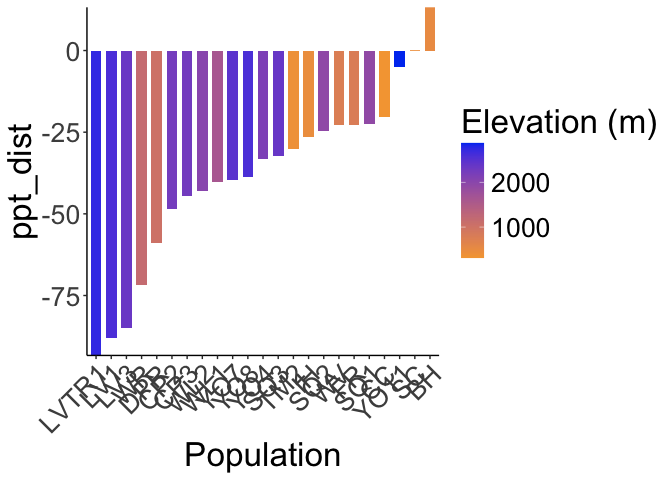<!-- -->

``` r
ggsave("../output/Climate/all-year_MeanPPT_DistfromWL2_HistoricalClim.png", width = 12, height = 6, units = "in")

historic_flint_dist %>% 
  ggplot(aes(x=fct_reorder(parent.pop, tmn_dist), y=tmn_dist, group=parent.pop, fill=elev_m)) +
  geom_col(width = 0.7,position = position_dodge(0.75)) +
  scale_y_continuous(expand = c(0, 0)) +
  scale_fill_gradient(low = "#F5A540", high = "#0043F0") +
  labs(fill="Elevation (m)",x="Population") +
  theme_classic() +
  theme(text=element_text(size=25), axis.text.x = element_text(angle = 45,  hjust = 1))
```

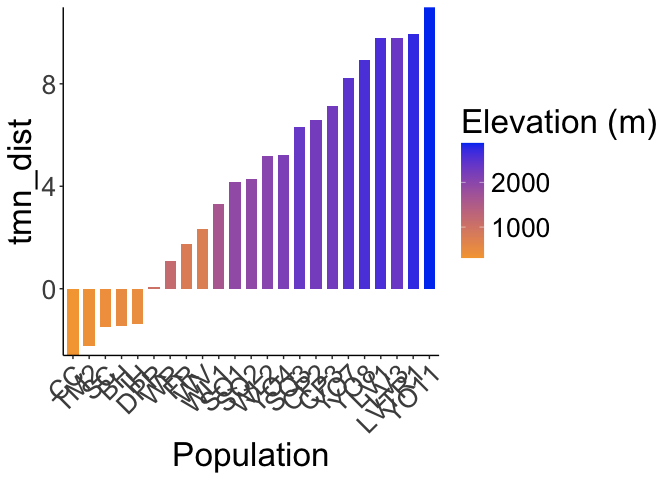<!-- -->

``` r
ggsave("../output/Climate/all-year_MeanTMN_DistfromWL2_HistoricalClim.png", width = 12, height = 6, units = "in")

historic_flint_dist %>% 
  ggplot(aes(x=fct_reorder(parent.pop, tmx_dist), y=tmx_dist, group=parent.pop, fill=elev_m)) +
  geom_col(width = 0.7,position = position_dodge(0.75)) +
  scale_y_continuous(expand = c(0, 0)) +
  scale_fill_gradient(low = "#F5A540", high = "#0043F0") +
  labs(fill="Elevation (m)",x="Population") +
  theme_classic() +
  theme(text=element_text(size=25), axis.text.x = element_text(angle = 45,  hjust = 1))
```

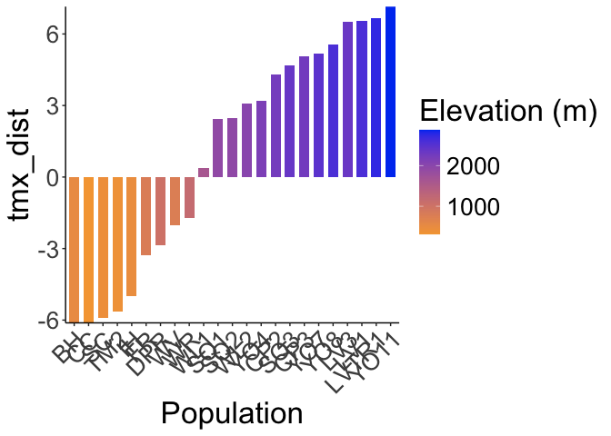<!-- -->

``` r
ggsave("../output/Climate/all-year_MeanTMX_DistfromWL2_HistoricalClim.png", width = 12, height = 6, units = "in")
```

## Bioclim Climate Distance

### Gowers

#### Recent

``` r
gowers_calc_each_var_recent_bioclim <- WL2_home_climate_with_ranges_recent %>% 
  mutate(ann_tmean_gowers=abs(ann_tmean_WL2 - ann_tmean) / ann_tmean_range,
         mean_diurnal_range_gowers=abs(mean_diurnal_range_WL2 - mean_diurnal_range) / mean_diurnal_range_range,
         temp_seasonality_gowers=abs(temp_seasonality_WL2 - temp_seasonality) / temp_seasonality_range,
         temp_ann_range_gowers=abs(temp_ann_range_WL2 - temp_ann_range) / temp_ann_range_range,
         tmean_wettest_quarter_gowers=abs(tmean_wettest_quarter_WL2 - tmean_wettest_quarter) / tmean_wettest_quarter_range,
         tmean_driest_quarter_gowers=abs(tmean_driest_quarter_WL2 - tmean_driest_quarter) / tmean_driest_quarter_range,
         ann_ppt_gowers=abs(ann_ppt_WL2 - ann_ppt) / ann_ppt_range,
         ppt_seasonality_gowers=abs(ppt_seasonality_WL2 - ppt_seasonality) / ppt_seasonality_range,
         ppt_warmest_quarter_gowers=abs(ppt_warmest_quarter_WL2 - ppt_warmest_quarter) / ppt_warmest_quarter_range,
         ppt_coldest_quarter_gowers=abs(ppt_coldest_quarter_WL2 - ppt_coldest_quarter) / ppt_coldest_quarter_range) %>% 
  dplyr::select(parent.pop, elevation.group, elev_m, ends_with("_gowers"))
  
gowers_calc_per_pop_recent_bioclim <- gowers_calc_each_var_recent_bioclim %>% 
  mutate(Recent_Gowers_Dist=(1/10)*(ann_tmean_gowers + mean_diurnal_range_gowers +
                                temp_seasonality_gowers +temp_ann_range_gowers +
                                tmean_wettest_quarter_gowers +
                                tmean_driest_quarter_gowers +ann_ppt_gowers +
                                ppt_seasonality_gowers + ppt_warmest_quarter_gowers +
                                ppt_coldest_quarter_gowers)) %>% 
  dplyr::select(parent.pop, elevation.group, elev_m, Recent_Gowers_Dist)

gowers_calc_per_pop_recent_bioclim
```

```
## # A tibble: 23 × 4
##    parent.pop elevation.group elev_m Recent_Gowers_Dist
##    <chr>      <chr>            <dbl>              <dbl>
##  1 BH         Low               511.              0.547
##  2 CC         Low               313               0.553
##  3 CP2        High             2244.              0.588
##  4 CP3        High             2266.              0.588
##  5 DPR        Mid              1019.              0.590
##  6 FR         Mid               787               0.585
##  7 IH         Low               454.              0.564
##  8 LV1        High             2593.              0.721
##  9 LV3        High             2354.              0.713
## 10 LVTR1      High             2741.              0.742
## # ℹ 13 more rows
```

#### Historic

``` r
gowers_calc_each_var_historic_bioclim <- WL2_home_climate_with_ranges_historic %>% 
  mutate(ann_tmean_gowers=abs(ann_tmean_WL2 - ann_tmean) / ann_tmean_range,
         mean_diurnal_range_gowers=abs(mean_diurnal_range_WL2 - mean_diurnal_range) / mean_diurnal_range_range,
         temp_seasonality_gowers=abs(temp_seasonality_WL2 - temp_seasonality) / temp_seasonality_range,
         temp_ann_range_gowers=abs(temp_ann_range_WL2 - temp_ann_range) / temp_ann_range_range,
         tmean_wettest_quarter_gowers=abs(tmean_wettest_quarter_WL2 - tmean_wettest_quarter) / tmean_wettest_quarter_range,
         tmean_driest_quarter_gowers=abs(tmean_driest_quarter_WL2 - tmean_driest_quarter) / tmean_driest_quarter_range,
         ann_ppt_gowers=abs(ann_ppt_WL2 - ann_ppt) / ann_ppt_range,
         ppt_seasonality_gowers=abs(ppt_seasonality_WL2 - ppt_seasonality) / ppt_seasonality_range,
         ppt_warmest_quarter_gowers=abs(ppt_warmest_quarter_WL2 - ppt_warmest_quarter) / ppt_warmest_quarter_range,
         ppt_coldest_quarter_gowers=abs(ppt_coldest_quarter_WL2 - ppt_coldest_quarter) / ppt_coldest_quarter_range) %>% 
  dplyr::select(parent.pop, elevation.group, elev_m, ends_with("_gowers"))

  
gowers_calc_per_pop_historic_bioclim <- gowers_calc_each_var_historic_bioclim %>% 
  mutate(Historic_Gowers_Dist=(1/10)*(ann_tmean_gowers + mean_diurnal_range_gowers +
                                temp_seasonality_gowers +temp_ann_range_gowers +
                                tmean_wettest_quarter_gowers +
                                tmean_driest_quarter_gowers +ann_ppt_gowers +
                                ppt_seasonality_gowers + ppt_warmest_quarter_gowers +
                                ppt_coldest_quarter_gowers)) %>% 
  dplyr::select(parent.pop, elevation.group, elev_m, Historic_Gowers_Dist)

gowers_calc_per_pop_historic_bioclim
```

```
## # A tibble: 23 × 4
##    parent.pop elevation.group elev_m Historic_Gowers_Dist
##    <chr>      <chr>            <dbl>                <dbl>
##  1 BH         Low               511.                0.519
##  2 CC         Low               313                 0.546
##  3 CP2        High             2244.                0.595
##  4 CP3        High             2266.                0.591
##  5 DPR        Mid              1019.                0.585
##  6 FR         Mid               787                 0.569
##  7 IH         Low               454.                0.547
##  8 LV1        High             2593.                0.759
##  9 LV3        High             2354.                0.749
## 10 LVTR1      High             2741.                0.768
## # ℹ 13 more rows
```

#### Merge recent and historic

``` r
gowers_all_time_bioclim <- full_join(gowers_calc_per_pop_recent_bioclim, gowers_calc_per_pop_historic_bioclim)
```

```
## Joining with `by = join_by(parent.pop, elevation.group, elev_m)`
```

``` r
gowers_all_time_bioclim
```

```
## # A tibble: 23 × 5
##    parent.pop elevation.group elev_m Recent_Gowers_Dist Historic_Gowers_Dist
##    <chr>      <chr>            <dbl>              <dbl>                <dbl>
##  1 BH         Low               511.              0.547                0.519
##  2 CC         Low               313               0.553                0.546
##  3 CP2        High             2244.              0.588                0.595
##  4 CP3        High             2266.              0.588                0.591
##  5 DPR        Mid              1019.              0.590                0.585
##  6 FR         Mid               787               0.585                0.569
##  7 IH         Low               454.              0.564                0.547
##  8 LV1        High             2593.              0.721                0.759
##  9 LV3        High             2354.              0.713                0.749
## 10 LVTR1      High             2741.              0.742                0.768
## # ℹ 13 more rows
```

``` r
names(gowers_all_time_bioclim)
```

```
## [1] "parent.pop"           "elevation.group"      "elev_m"              
## [4] "Recent_Gowers_Dist"   "Historic_Gowers_Dist"
```

``` r
write_csv(gowers_all_time_bioclim, "../output/Climate/full_year_GowersEnvtalDist_WL2bioclim.csv")
```

Figures

``` r
gowers_rec_fig_bioclim <- gowers_all_time_bioclim %>% 
  ggplot(aes(x=fct_reorder(parent.pop, Recent_Gowers_Dist), y=Recent_Gowers_Dist, group=parent.pop, fill=elev_m)) +
  geom_col(width = 0.7,position = position_dodge(0.75)) +
  scale_y_continuous(expand = c(0, 0)) +
  scale_fill_gradient(low = "#F5A540", high = "#0043F0") +
  labs(y="Gowers Envtal Distance \n from WL2", fill="Elevation (m)", x="Population", title="Recent Climate") +
  theme_classic() +
  theme(text=element_text(size=25), axis.text.x = element_text(angle = 45,  hjust = 1))
#ggsave("../output/Climate/full_year_Gowers_Recentbioclim_fromWL2.png", width = 12, height = 6, units = "in")

gowers_hist_fig_bioclim <- gowers_all_time_bioclim %>% 
  ggplot(aes(x=fct_reorder(parent.pop, Historic_Gowers_Dist), y=Historic_Gowers_Dist, group=parent.pop, fill=elev_m)) +
  geom_col(width = 0.7,position = position_dodge(0.75)) +
  scale_y_continuous(expand = c(0, 0)) +
  scale_fill_gradient(low = "#F5A540", high = "#0043F0") +
  labs(fill="Elevation (m)",x="Population", title="Historic Climate", y="Gowers Envtal Distance \n from WL2") +
  theme_classic() +
  theme(text=element_text(size=25), axis.text.x = element_text(angle = 45,  hjust = 1))
#ggsave("../output/Climate/full_year_Gowers_Historicbioclim_fromWL2.png", width = 12, height = 6, units = "in")

#should combine these into one figure and save that instead
legend <- get_legend(gowers_rec_fig_bioclim)
gowers_hist_fig_bioclim <- gowers_hist_fig_bioclim + theme(legend.position="none")
gowers_rec_fig_bioclim <- gowers_rec_fig_bioclim + theme(legend.position="none")
grid.arrange(gowers_hist_fig_bioclim, gowers_rec_fig_bioclim, legend, ncol=3, widths=c(3.12, 3.12, 1.09))
```

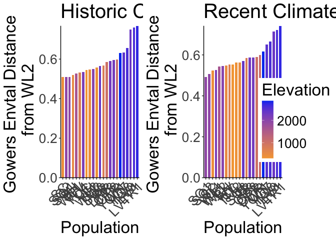<!-- -->

``` r
 #2000 x 850
```

### Subtraction


``` r
#Recent
names(pops_bioclim_recent_avgs)
```

```
##  [1] "parent.pop"            "elevation.group"       "elev_m"               
##  [4] "Lat"                   "Long"                  "ann_tmean"            
##  [7] "mean_diurnal_range"    "temp_seasonality"      "temp_ann_range"       
## [10] "tmean_wettest_quarter" "tmean_driest_quarter"  "ann_ppt"              
## [13] "ppt_seasonality"       "ppt_warmest_quarter"   "ppt_coldest_quarter"  
## [16] "TimePd"
```

``` r
recent_bioclim_dist_prep <- bind_cols(WL2_bioclim_final, pops_bioclim_recent_avgs)
recent_bioclim_dist <- recent_bioclim_dist_prep %>% 
  mutate(ann_tmean_dist=ann_tmean_WL2 - ann_tmean,
         mean_diurnal_range_dist=mean_diurnal_range_WL2 - mean_diurnal_range,
         temp_seasonality_dist=temp_seasonality_WL2 - temp_seasonality,
         temp_ann_range_dist=temp_ann_range_WL2 - temp_ann_range,
         tmean_wettest_quarter_dist=tmean_wettest_quarter_WL2 - tmean_wettest_quarter,
         tmean_driest_quarter_dist=tmean_driest_quarter_WL2 - tmean_driest_quarter,
         ann_ppt_dist=ann_ppt_WL2 - ann_ppt,
         ppt_seasonality_dist=ppt_seasonality_WL2 - ppt_seasonality, 
         ppt_warmest_quarter_dist=ppt_warmest_quarter_WL2 - ppt_warmest_quarter,
         ppt_coldest_quarter_dist=ppt_coldest_quarter_WL2 - ppt_coldest_quarter) %>% 
 dplyr::select(parent.pop, elevation.group, elev_m, ends_with("_dist"))
recent_bioclim_dist
```

```
## # A tibble: 23 × 13
##    parent.pop elevation.group elev_m ann_tmean_dist mean_diurnal_range_dist
##    <chr>      <chr>            <dbl>          <dbl>                   <dbl>
##  1 BH         Low               511.          -4.69                   -4.10
##  2 CC         Low               313           -5.10                   -2.71
##  3 CP2        High             2244.           4.27                   -1.69
##  4 CP3        High             2266.           4.98                   -1.58
##  5 DPR        Mid              1019.          -2.50                   -1.82
##  6 FR         Mid               787           -1.35                   -3.87
##  7 IH         Low               454.          -3.88                   -2.99
##  8 LV1        High             2593.           6.63                   -2.06
##  9 LV3        High             2354.           6.62                   -2.08
## 10 LVTR1      High             2741.           6.78                   -2.17
## # ℹ 13 more rows
## # ℹ 8 more variables: temp_seasonality_dist <dbl>, temp_ann_range_dist <dbl>,
## #   tmean_wettest_quarter_dist <dbl>, tmean_driest_quarter_dist <dbl>,
## #   ann_ppt_dist <dbl>, ppt_seasonality_dist <dbl>,
## #   ppt_warmest_quarter_dist <dbl>, ppt_coldest_quarter_dist <dbl>
```

``` r
#Historical
names(pops_bioclim_historical_avgs)
```

```
##  [1] "parent.pop"            "elevation.group"       "elev_m"               
##  [4] "Lat"                   "Long"                  "ann_tmean"            
##  [7] "mean_diurnal_range"    "temp_seasonality"      "temp_ann_range"       
## [10] "tmean_wettest_quarter" "tmean_driest_quarter"  "ann_ppt"              
## [13] "ppt_seasonality"       "ppt_warmest_quarter"   "ppt_coldest_quarter"  
## [16] "TimePd"
```

``` r
historical_bioclim_dist_prep <- bind_cols(WL2_bioclim_final, pops_bioclim_historical_avgs)
historical_bioclim_dist <- historical_bioclim_dist_prep %>% 
  mutate(ann_tmean_dist=ann_tmean_WL2 - ann_tmean,
         mean_diurnal_range_dist=mean_diurnal_range_WL2 - mean_diurnal_range,
         temp_seasonality_dist=temp_seasonality_WL2 - temp_seasonality,
         temp_ann_range_dist=temp_ann_range_WL2 - temp_ann_range,
         tmean_wettest_quarter_dist=tmean_wettest_quarter_WL2 - tmean_wettest_quarter,
         tmean_driest_quarter_dist=tmean_driest_quarter_WL2 - tmean_driest_quarter,
         ann_ppt_dist=ann_ppt_WL2 - ann_ppt,
         ppt_seasonality_dist=ppt_seasonality_WL2 - ppt_seasonality, 
         ppt_warmest_quarter_dist=ppt_warmest_quarter_WL2 - ppt_warmest_quarter,
         ppt_coldest_quarter_dist=ppt_coldest_quarter_WL2 - ppt_coldest_quarter) %>% 
  dplyr::select(parent.pop, elevation.group, elev_m, ends_with("_dist"))
historical_bioclim_dist
```

```
## # A tibble: 23 × 13
##    parent.pop elevation.group elev_m ann_tmean_dist mean_diurnal_range_dist
##    <chr>      <chr>            <dbl>          <dbl>                   <dbl>
##  1 BH         Low               511.         -3.78                    -4.67
##  2 CC         Low               313          -4.36                    -3.50
##  3 CP2        High             2244.          5.46                    -2.28
##  4 CP3        High             2266.          6.11                    -2.08
##  5 DPR        Mid              1019.         -1.40                    -2.92
##  6 FR         Mid               787          -0.760                   -5.02
##  7 IH         Low               454.         -3.20                    -3.61
##  8 LV1        High             2593.          8.17                    -3.26
##  9 LV3        High             2354.          8.16                    -3.27
## 10 LVTR1      High             2741.          8.31                    -3.26
## # ℹ 13 more rows
## # ℹ 8 more variables: temp_seasonality_dist <dbl>, temp_ann_range_dist <dbl>,
## #   tmean_wettest_quarter_dist <dbl>, tmean_driest_quarter_dist <dbl>,
## #   ann_ppt_dist <dbl>, ppt_seasonality_dist <dbl>,
## #   ppt_warmest_quarter_dist <dbl>, ppt_coldest_quarter_dist <dbl>
```

Figures Recent (subtraction distance)


``` r
recent_bioclim_dist %>% 
  ggplot(aes(x=fct_reorder(parent.pop, ann_tmean_dist), y=ann_tmean_dist, group=parent.pop, fill=elev_m)) +
  geom_col(width = 0.7,position = position_dodge(0.75)) +
  scale_y_continuous(expand = c(0, 0)) +
  scale_fill_gradient(low = "#F5A540", high = "#0043F0") +
  labs(fill="Elevation (m)",x="Population") +
  theme_classic() +
  theme(text=element_text(size=25), axis.text.x = element_text(angle = 45,  hjust = 1))
```

<!-- -->

``` r
ggsave("../output/Climate/all-year_Ann_Tmean_DistfromWL2_RecentClim.png", width = 12, height = 6, units = "in")

recent_bioclim_dist %>% 
  ggplot(aes(x=fct_reorder(parent.pop, mean_diurnal_range_dist), y=mean_diurnal_range_dist, group=parent.pop, fill=elev_m)) +
  geom_col(width = 0.7,position = position_dodge(0.75)) +
  scale_y_continuous(expand = c(0, 0)) +
  scale_fill_gradient(low = "#F5A540", high = "#0043F0") +
  labs(fill="Elevation (m)",x="Population") +
  theme_classic() +
  theme(text=element_text(size=25), axis.text.x = element_text(angle = 45,  hjust = 1))
```

<!-- -->

``` r
ggsave("../output/Climate/all-year_Diurnal_Range_DistfromWL2_RecentClim.png", width = 12, height = 6, units = "in")

recent_bioclim_dist %>% 
  ggplot(aes(x=fct_reorder(parent.pop, temp_seasonality_dist), y=temp_seasonality_dist, group=parent.pop, fill=elev_m)) +
  geom_col(width = 0.7,position = position_dodge(0.75)) +
  scale_y_continuous(expand = c(0, 0)) +
  scale_fill_gradient(low = "#F5A540", high = "#0043F0") +
  labs(fill="Elevation (m)",x="Population") +
  theme_classic() +
  theme(text=element_text(size=25), axis.text.x = element_text(angle = 45,  hjust = 1))
```

<!-- -->

``` r
ggsave("../output/Climate/all-year_Temp_Seasonality_DistfromWL2_RecentClim.png", width = 12, height = 6, units = "in")

recent_bioclim_dist %>% 
  ggplot(aes(x=fct_reorder(parent.pop, temp_ann_range_dist), y=temp_ann_range_dist, group=parent.pop, fill=elev_m)) +
  geom_col(width = 0.7,position = position_dodge(0.75)) +
  scale_y_continuous(expand = c(0, 0)) +
  scale_fill_gradient(low = "#F5A540", high = "#0043F0") +
  labs(fill="Elevation (m)",x="Population") +
  theme_classic() +
  theme(text=element_text(size=25), axis.text.x = element_text(angle = 45,  hjust = 1))
```

<!-- -->

``` r
ggsave("../output/Climate/all-year_Temp_Ann_Range_DistfromWL2_RecentClim.png", width = 12, height = 6, units = "in")

recent_bioclim_dist %>% 
  ggplot(aes(x=fct_reorder(parent.pop, tmean_wettest_quarter_dist), y=tmean_wettest_quarter_dist, group=parent.pop, fill=elev_m)) +
  geom_col(width = 0.7,position = position_dodge(0.75)) +
  scale_y_continuous(expand = c(0, 0)) +
  scale_fill_gradient(low = "#F5A540", high = "#0043F0") +
  labs(fill="Elevation (m)",x="Population") +
  theme_classic() +
  theme(text=element_text(size=25), axis.text.x = element_text(angle = 45,  hjust = 1))
```

<!-- -->

``` r
ggsave("../output/Climate/all-year_Temp_Wet_DistfromWL2_RecentClim.png", width = 12, height = 6, units = "in")

recent_bioclim_dist %>% 
  ggplot(aes(x=fct_reorder(parent.pop, tmean_driest_quarter_dist), y=tmean_driest_quarter_dist, group=parent.pop, fill=elev_m)) +
  geom_col(width = 0.7,position = position_dodge(0.75)) +
  scale_y_continuous(expand = c(0, 0)) +
  scale_fill_gradient(low = "#F5A540", high = "#0043F0") +
  labs(fill="Elevation (m)",x="Population") +
  theme_classic() +
  theme(text=element_text(size=25), axis.text.x = element_text(angle = 45,  hjust = 1))
```

<!-- -->

``` r
ggsave("../output/Climate/all-year_Temp_Dry_DistfromWL2_RecentClim.png", width = 12, height = 6, units = "in")

recent_bioclim_dist %>% 
  ggplot(aes(x=fct_reorder(parent.pop, ann_ppt_dist), y=ann_ppt_dist, group=parent.pop, fill=elev_m)) +
  geom_col(width = 0.7,position = position_dodge(0.75)) +
  scale_y_continuous(expand = c(0, 0)) +
  scale_fill_gradient(low = "#F5A540", high = "#0043F0") +
  labs(fill="Elevation (m)",x="Population") +
  theme_classic() +
  theme(text=element_text(size=25), axis.text.x = element_text(angle = 45,  hjust = 1))
```

<!-- -->

``` r
ggsave("../output/Climate/all-year_Ann_PPT_DistfromWL2_RecentClim.png", width = 12, height = 6, units = "in")

recent_bioclim_dist %>% 
  ggplot(aes(x=fct_reorder(parent.pop, ppt_seasonality_dist), y=ppt_seasonality_dist, group=parent.pop, fill=elev_m)) +
  geom_col(width = 0.7,position = position_dodge(0.75)) +
  scale_y_continuous(expand = c(0, 0)) +
  scale_fill_gradient(low = "#F5A540", high = "#0043F0") +
  labs(fill="Elevation (m)",x="Population") +
  theme_classic() +
  theme(text=element_text(size=25), axis.text.x = element_text(angle = 45,  hjust = 1))
```

<!-- -->

``` r
ggsave("../output/Climate/all-year_PPT_Seasonality_DistfromWL2_RecentClim.png", width = 12, height = 6, units = "in")

recent_bioclim_dist %>% 
  ggplot(aes(x=fct_reorder(parent.pop, ppt_warmest_quarter_dist), y=ppt_warmest_quarter_dist, group=parent.pop, fill=elev_m)) +
  geom_col(width = 0.7,position = position_dodge(0.75)) +
  scale_y_continuous(expand = c(0, 0)) +
  scale_fill_gradient(low = "#F5A540", high = "#0043F0") +
  labs(fill="Elevation (m)",x="Population") +
  theme_classic() +
  theme(text=element_text(size=25), axis.text.x = element_text(angle = 45,  hjust = 1))
```

<!-- -->

``` r
ggsave("../output/Climate/all-year_PPT_Warm_DistfromWL2_RecentClim.png", width = 12, height = 6, units = "in")

recent_bioclim_dist %>% 
  ggplot(aes(x=fct_reorder(parent.pop, ppt_coldest_quarter_dist), y=ppt_coldest_quarter_dist, group=parent.pop, fill=elev_m)) +
  geom_col(width = 0.7,position = position_dodge(0.75)) +
  scale_y_continuous(expand = c(0, 0)) +
  scale_fill_gradient(low = "#F5A540", high = "#0043F0") +
  labs(fill="Elevation (m)",x="Population") +
  theme_classic() +
  theme(text=element_text(size=25), axis.text.x = element_text(angle = 45,  hjust = 1))
```

<!-- -->

``` r
ggsave("../output/Climate/all-year_PPT_Cold_DistfromWL2_RecentClim.png", width = 12, height = 6, units = "in")
```

Historical (subtraction distance)


``` r
historical_bioclim_dist %>% 
  ggplot(aes(x=fct_reorder(parent.pop, ann_tmean_dist), y=ann_tmean_dist, group=parent.pop, fill=elev_m)) +
  geom_col(width = 0.7,position = position_dodge(0.75)) +
  scale_y_continuous(expand = c(0, 0)) +
  scale_fill_gradient(low = "#F5A540", high = "#0043F0") +
  labs(fill="Elevation (m)",x="Population") +
  theme_classic() +
  theme(text=element_text(size=25), axis.text.x = element_text(angle = 45,  hjust = 1))
```

<!-- -->

``` r
ggsave("../output/Climate/all-year_Ann_Tmean_DistfromWL2_HistoricalClim.png", width = 12, height = 6, units = "in")

historical_bioclim_dist %>% 
  ggplot(aes(x=fct_reorder(parent.pop, mean_diurnal_range_dist), y=mean_diurnal_range_dist, group=parent.pop, fill=elev_m)) +
  geom_col(width = 0.7,position = position_dodge(0.75)) +
  scale_y_continuous(expand = c(0, 0)) +
  scale_fill_gradient(low = "#F5A540", high = "#0043F0") +
  labs(fill="Elevation (m)",x="Population") +
  theme_classic() +
  theme(text=element_text(size=25), axis.text.x = element_text(angle = 45,  hjust = 1))
```

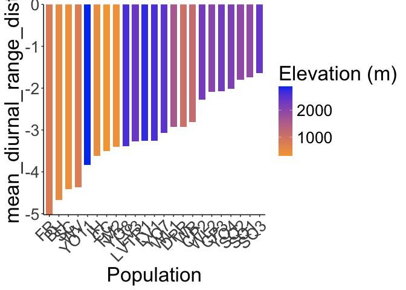<!-- -->

``` r
ggsave("../output/Climate/all-year_Diurnal_Range_DistfromWL2_HistoricalClim.png", width = 12, height = 6, units = "in")

historical_bioclim_dist %>% 
  ggplot(aes(x=fct_reorder(parent.pop, temp_seasonality_dist), y=temp_seasonality_dist, group=parent.pop, fill=elev_m)) +
  geom_col(width = 0.7,position = position_dodge(0.75)) +
  scale_y_continuous(expand = c(0, 0)) +
  scale_fill_gradient(low = "#F5A540", high = "#0043F0") +
  labs(fill="Elevation (m)",x="Population") +
  theme_classic() +
  theme(text=element_text(size=25), axis.text.x = element_text(angle = 45,  hjust = 1))
```

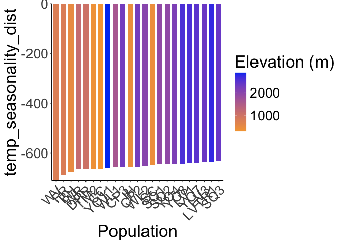<!-- -->

``` r
ggsave("../output/Climate/all-year_Temp_Seasonality_DistfromWL2_HistoricalClim.png", width = 12, height = 6, units = "in")

historical_bioclim_dist %>% 
  ggplot(aes(x=fct_reorder(parent.pop, temp_ann_range_dist), y=temp_ann_range_dist, group=parent.pop, fill=elev_m)) +
  geom_col(width = 0.7,position = position_dodge(0.75)) +
  scale_y_continuous(expand = c(0, 0)) +
  scale_fill_gradient(low = "#F5A540", high = "#0043F0") +
  labs(fill="Elevation (m)",x="Population") +
  theme_classic() +
  theme(text=element_text(size=25), axis.text.x = element_text(angle = 45,  hjust = 1))
```

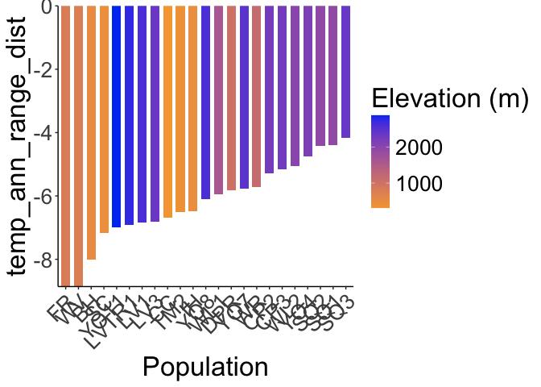<!-- -->

``` r
ggsave("../output/Climate/all-year_Temp_Ann_Range_DistfromWL2_HistoricalClim.png", width = 12, height = 6, units = "in")

historical_bioclim_dist %>% 
  ggplot(aes(x=fct_reorder(parent.pop, tmean_wettest_quarter_dist), y=tmean_wettest_quarter_dist, group=parent.pop, fill=elev_m)) +
  geom_col(width = 0.7,position = position_dodge(0.75)) +
  scale_y_continuous(expand = c(0, 0)) +
  scale_fill_gradient(low = "#F5A540", high = "#0043F0") +
  labs(fill="Elevation (m)",x="Population") +
  theme_classic() +
  theme(text=element_text(size=25), axis.text.x = element_text(angle = 45,  hjust = 1))
```

<!-- -->

``` r
ggsave("../output/Climate/all-year_Temp_Wet_DistfromWL2_HistoricalClim.png", width = 12, height = 6, units = "in")

historical_bioclim_dist %>% 
  ggplot(aes(x=fct_reorder(parent.pop, tmean_driest_quarter_dist), y=tmean_driest_quarter_dist, group=parent.pop, fill=elev_m)) +
  geom_col(width = 0.7,position = position_dodge(0.75)) +
  scale_y_continuous(expand = c(0, 0)) +
  scale_fill_gradient(low = "#F5A540", high = "#0043F0") +
  labs(fill="Elevation (m)",x="Population") +
  theme_classic() +
  theme(text=element_text(size=25), axis.text.x = element_text(angle = 45,  hjust = 1))
```

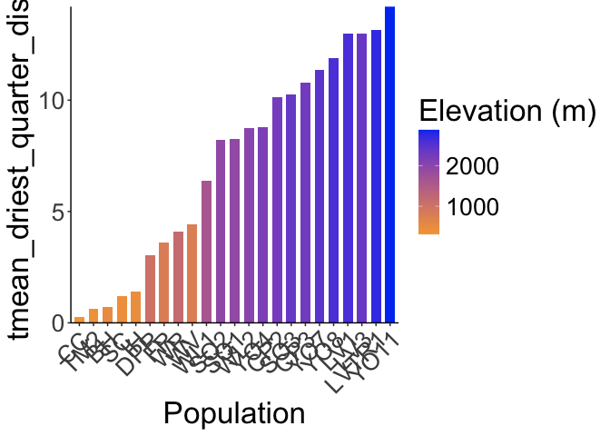<!-- -->

``` r
ggsave("../output/Climate/all-year_Temp_Dry_DistfromWL2_HistoricalClim.png", width = 12, height = 6, units = "in")

historical_bioclim_dist %>% 
  ggplot(aes(x=fct_reorder(parent.pop, ann_ppt_dist), y=ann_ppt_dist, group=parent.pop, fill=elev_m)) +
  geom_col(width = 0.7,position = position_dodge(0.75)) +
  scale_y_continuous(expand = c(0, 0)) +
  scale_fill_gradient(low = "#F5A540", high = "#0043F0") +
  labs(fill="Elevation (m)",x="Population") +
  theme_classic() +
  theme(text=element_text(size=25), axis.text.x = element_text(angle = 45,  hjust = 1))
```

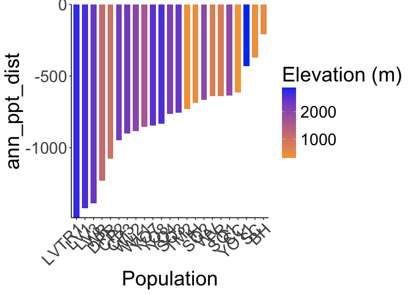<!-- -->

``` r
ggsave("../output/Climate/all-year_Ann_PPT_DistfromWL2_HistoricalClim.png", width = 12, height = 6, units = "in")

historical_bioclim_dist %>% 
  ggplot(aes(x=fct_reorder(parent.pop, ppt_seasonality_dist), y=ppt_seasonality_dist, group=parent.pop, fill=elev_m)) +
  geom_col(width = 0.7,position = position_dodge(0.75)) +
  scale_y_continuous(expand = c(0, 0)) +
  scale_fill_gradient(low = "#F5A540", high = "#0043F0") +
  labs(fill="Elevation (m)",x="Population") +
  theme_classic() +
  theme(text=element_text(size=25), axis.text.x = element_text(angle = 45,  hjust = 1))
```

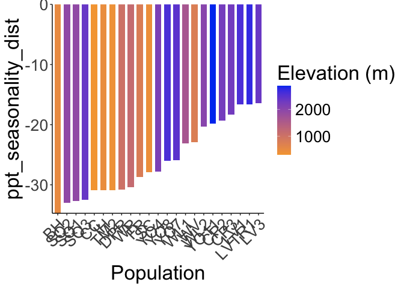<!-- -->

``` r
ggsave("../output/Climate/all-year_PPT_Seasonality_DistfromWL2_HistoricalClim.png", width = 12, height = 6, units = "in")

historical_bioclim_dist %>% 
  ggplot(aes(x=fct_reorder(parent.pop, ppt_warmest_quarter_dist), y=ppt_warmest_quarter_dist, group=parent.pop, fill=elev_m)) +
  geom_col(width = 0.7,position = position_dodge(0.75)) +
  scale_y_continuous(expand = c(0, 0)) +
  scale_fill_gradient(low = "#F5A540", high = "#0043F0") +
  labs(fill="Elevation (m)",x="Population") +
  theme_classic() +
  theme(text=element_text(size=25), axis.text.x = element_text(angle = 45,  hjust = 1))
```

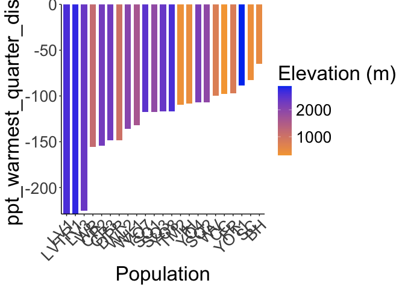<!-- -->

``` r
ggsave("../output/Climate/all-year_PPT_Warm_DistfromWL2_HistoricalClim.png", width = 12, height = 6, units = "in")

historical_bioclim_dist %>% 
  ggplot(aes(x=fct_reorder(parent.pop, ppt_coldest_quarter_dist), y=ppt_coldest_quarter_dist, group=parent.pop, fill=elev_m)) +
  geom_col(width = 0.7,position = position_dodge(0.75)) +
  scale_y_continuous(expand = c(0, 0)) +
  scale_fill_gradient(low = "#F5A540", high = "#0043F0") +
  labs(fill="Elevation (m)",x="Population") +
  theme_classic() +
  theme(text=element_text(size=25), axis.text.x = element_text(angle = 45,  hjust = 1))
```

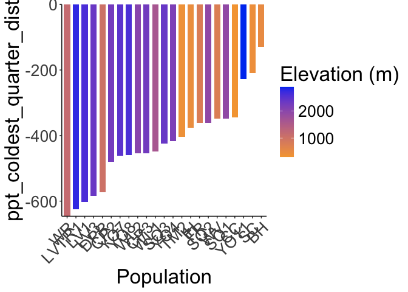<!-- -->

``` r
ggsave("../output/Climate/all-year_PPT_Cold_DistfromWL2_HistoricalClim.png", width = 12, height = 6, units = "in")
```
