# Climate Distance at the WL2 Garden

## Relevant Libraries and Functions


``` r
library(raster)
```

```
## Loading required package: sp
```

``` r
library(tidyverse)
```

```
## ── Attaching core tidyverse packages ──────────────────────── tidyverse 2.0.0 ──
## ✔ dplyr     1.1.4     ✔ readr     2.1.5
## ✔ forcats   1.0.0     ✔ stringr   1.5.1
## ✔ ggplot2   3.5.1     ✔ tibble    3.2.1
## ✔ lubridate 1.9.3     ✔ tidyr     1.3.1
## ✔ purrr     1.0.2
```

```
## ── Conflicts ────────────────────────────────────────── tidyverse_conflicts() ──
## ✖ tidyr::extract() masks raster::extract()
## ✖ dplyr::filter()  masks stats::filter()
## ✖ dplyr::lag()     masks stats::lag()
## ✖ dplyr::select()  masks raster::select()
## ℹ Use the conflicted package (<http://conflicted.r-lib.org/>) to force all conflicts to become errors
```

``` r
library(conflicted)
conflicts_prefer(dplyr::select())
```

```
## [conflicted] Will prefer dplyr::select over any other package.
```

``` r
conflicts_prefer(dplyr::filter)
```

```
## [conflicted] Will prefer dplyr::filter over any other package.
```

``` r
library(cowplot)
library(QBMS) #for function calc_biovars to calculate bioclim variables
library(boot)
library(broom)
library(ggpubr) #for ggarange 

sem <- function(x, na.rm=FALSE) {
  sd(x,na.rm=na.rm)/sqrt(length(na.omit(x)))
} #standard error function 

get_legend<-function(myggplot){
  tmp <- ggplot_gtable(ggplot_build(myggplot))
  leg <- which(sapply(tmp$grobs, function(x) x$name) == "guide-box")
  legend <- tmp$grobs[[leg]]
  return(legend)
} #legend function for grid_arrange

elev_three_palette <- c("#0043F0", "#C9727F", "#F5A540") #colors from Gremer et al 2019
elev_order <- c("High", "Mid", "Low")
```

## WL2 Climate Data (For plants measured July 2023-Oct 2023)

### From Flint (changed this from Magney MetStation)


``` r
WL2_climate <- read_csv("../output/Climate/flint_climate_UCDpops.csv") %>% 
  filter(parent.pop=="WL2_Garden") %>% 
  filter(year>=2022, year<2024) %>% 
  filter(if_else(year==2022, month=="nov" | month=="dec", #2022-2023 Water Year 
                 month!="nov" & month !="dec")) %>% 
  mutate(tavg = (tmn + tmx)/2, t_diurnal = (tmx-tmn))
```

```
## Rows: 38775 Columns: 14
## ── Column specification ────────────────────────────────────────────────────────
## Delimiter: ","
## chr  (3): parent.pop, elevation.group, month
## dbl (11): elev_m, Lat, Long, year, aet, cwd, pck, pet, ppt, tmn, tmx
## 
## ℹ Use `spec()` to retrieve the full column specification for this data.
## ℹ Specify the column types or set `show_col_types = FALSE` to quiet this message.
```

``` r
head(WL2_climate)
```

```
## # A tibble: 6 × 16
##   parent.pop elevation.group elev_m   Lat  Long  year month    aet   cwd    pck
##   <chr>      <chr>            <dbl> <dbl> <dbl> <dbl> <chr>  <dbl> <dbl>  <dbl>
## 1 WL2_Garden High              2020  38.8 -120.  2022 dec     4     20    610. 
## 2 WL2_Garden High              2020  38.8 -120.  2022 nov     2.48  29.1   40.4
## 3 WL2_Garden High              2020  38.8 -120.  2023 apr    41.5   46.4 1787. 
## 4 WL2_Garden High              2020  38.8 -120.  2023 aug   106.    43.8    0  
## 5 WL2_Garden High              2020  38.8 -120.  2023 feb     8.62  22.4 1422. 
## 6 WL2_Garden High              2020  38.8 -120.  2023 jan     7.23  16.4 1208. 
## # ℹ 6 more variables: pet <dbl>, ppt <dbl>, tmn <dbl>, tmx <dbl>, tavg <dbl>,
## #   t_diurnal <dbl>
```

``` r
summary(WL2_climate)
```

```
##   parent.pop        elevation.group        elev_m          Lat       
##  Length:12          Length:12          Min.   :2020   Min.   :38.83  
##  Class :character   Class :character   1st Qu.:2020   1st Qu.:38.83  
##  Mode  :character   Mode  :character   Median :2020   Median :38.83  
##                                        Mean   :2020   Mean   :38.83  
##                                        3rd Qu.:2020   3rd Qu.:38.83  
##                                        Max.   :2020   Max.   :38.83  
##       Long             year         month                aet        
##  Min.   :-120.3   Min.   :2022   Length:12          Min.   :  2.48  
##  1st Qu.:-120.3   1st Qu.:2023   Class :character   1st Qu.:  6.98  
##  Median :-120.3   Median :2023   Mode  :character   Median : 37.69  
##  Mean   :-120.3   Mean   :2023                      Mean   : 44.94  
##  3rd Qu.:-120.3   3rd Qu.:2023                      3rd Qu.: 78.27  
##  Max.   :-120.3   Max.   :2023                      Max.   :115.16  
##       cwd              pck              pet              ppt        
##  Min.   : 14.83   Min.   :   0.0   Min.   : 23.60   Min.   :  0.01  
##  1st Qu.: 21.79   1st Qu.:   0.0   1st Qu.: 31.45   1st Qu.: 36.49  
##  Median : 38.83   Median : 589.6   Median : 81.55   Median : 68.33  
##  Mean   : 41.58   Mean   : 742.9   Mean   : 86.52   Mean   :207.19  
##  3rd Qu.: 49.56   3rd Qu.:1323.9   3rd Qu.:134.12   3rd Qu.:319.23  
##  Max.   :100.37   Max.   :1986.3   Max.   :176.10   Max.   :641.41  
##       tmn              tmx              tavg           t_diurnal    
##  Min.   :-6.150   Min.   : 2.130   Min.   :-2.0100   Min.   : 8.25  
##  1st Qu.:-4.258   1st Qu.: 4.165   1st Qu.:-0.1288   1st Qu.: 9.42  
##  Median : 0.870   Median :11.870   Median : 6.3700   Median :10.30  
##  Mean   : 1.762   Mean   :12.081   Mean   : 6.9212   Mean   :10.32  
##  3rd Qu.: 6.145   3rd Qu.:17.520   3rd Qu.:11.8325   3rd Qu.:11.32  
##  Max.   :13.220   Max.   :25.950   Max.   :19.5850   Max.   :12.73
```

``` r
WL2_climate_flint <- WL2_climate %>% #get the means for the variables to compare to home sites 
  summarise(cwd_WL2=mean(cwd),ppt_WL2=mean(ppt), pck_WL2=mean(pck), tmn_WL2=mean(tmn), tmx_WL2=mean(tmx))
WL2_climate_flint
```

```
## # A tibble: 1 × 5
##   cwd_WL2 ppt_WL2 pck_WL2 tmn_WL2 tmx_WL2
##     <dbl>   <dbl>   <dbl>   <dbl>   <dbl>
## 1    41.6    207.    743.    1.76    12.1
```

## WL2 Climate Trends (2023)

``` r
WL2_climate$month <- factor(WL2_climate$month, levels = c("nov","dec","jan", "feb", "mar", "apr", "may", "jun", "jul", "aug", "sep", "oct"))

WL2_climate %>% 
  ggplot(aes(x=month,y=cwd)) +
  geom_point()
```

<!-- -->

``` r
WL2_climate %>% 
  ggplot(aes(x=month,y=pck)) +
  geom_point() 
```

<!-- -->

``` r
WL2_climate %>% 
  ggplot(aes(x=month,y=tmx)) +
  geom_point()
```

<!-- -->

``` r
WL2_climate %>% 
  ggplot(aes(x=month,y=tmn)) +
  geom_point()
```

<!-- -->

``` r
WL2_climate %>% 
  ggplot(aes(x=month,y=ppt)) +
  geom_point()
```

<!-- -->

### BioClim

#### Prep

``` r
wl2_bioclim_allyear_prep <- WL2_climate %>% 
  mutate(wtr_year="2023") %>% 
  rename(tmin=tmn, tmax=tmx, year_cal=year, year=wtr_year) %>% #rename columns to match what calc_biovars expects 
  arrange(parent.pop, year, month)
```

### Calculation

``` r
wl2_bioclim_all_year <- wl2_bioclim_allyear_prep %>% calc_biovars() 
```

#### SUBSET

``` r
wl2_bioclim_all_year_final <- wl2_bioclim_all_year %>% 
  select(ann_tmean_WL2=bio1, mean_diurnal_range_WL2=bio2, 
         temp_seasonality_WL2=bio4, temp_ann_range_WL2=bio7, tmean_wettest_quarter_WL2=bio8,
         tmean_driest_quarter_WL2=bio9, ann_ppt_WL2=bio12, ppt_seasonality_WL2=bio15,
         ppt_warmest_quarter_WL2=bio18, ppt_coldest_quarter_WL2=bio19) %>% 
  mutate_if(is.character, as.numeric)
wl2_bioclim_all_year_final
```

```
##   ann_tmean_WL2 mean_diurnal_range_WL2 temp_seasonality_WL2 temp_ann_range_WL2
## 1       6.92125               10.31917             758.8279               32.1
##   tmean_wettest_quarter_WL2 tmean_driest_quarter_WL2 ann_ppt_WL2
## 1                    -0.555                 16.93833     2486.31
##   ppt_seasonality_WL2 ppt_warmest_quarter_WL2 ppt_coldest_quarter_WL2
## 1            119.8368                   88.98                  1413.4
```

## WL2 Climate Data for 2024

### From Flint


``` r
WL2_climate_2024 <- read_csv("../output/Climate/flint_climate_UCDpops.csv") %>% 
  filter(parent.pop=="WL2_Garden") %>% 
  filter(year>=2023, year<=2024) %>% 
  filter(if_else(year==2023, month=="nov" | month=="dec", #2023-2024 Water Year 
                 month!="nov" & month !="dec")) %>% 
  mutate(tavg = (tmn + tmx)/2, t_diurnal = (tmx-tmn))
```

```
## Rows: 38775 Columns: 14
## ── Column specification ────────────────────────────────────────────────────────
## Delimiter: ","
## chr  (3): parent.pop, elevation.group, month
## dbl (11): elev_m, Lat, Long, year, aet, cwd, pck, pet, ppt, tmn, tmx
## 
## ℹ Use `spec()` to retrieve the full column specification for this data.
## ℹ Specify the column types or set `show_col_types = FALSE` to quiet this message.
```

``` r
head(WL2_climate_2024)
```

```
## # A tibble: 6 × 16
##   parent.pop elevation.group elev_m   Lat  Long  year month   aet   cwd   pck
##   <chr>      <chr>            <dbl> <dbl> <dbl> <dbl> <chr> <dbl> <dbl> <dbl>
## 1 WL2_Garden High              2020  38.8 -120.  2023 dec    2.78  24.6  16.9
## 2 WL2_Garden High              2020  38.8 -120.  2023 nov    3.87  31.2   0  
## 3 WL2_Garden High              2020  38.8 -120.  2024 apr   44.5   45.4 401. 
## 4 WL2_Garden High              2020  38.8 -120.  2024 aug   54.8   94.1   0  
## 5 WL2_Garden High              2020  38.8 -120.  2024 feb    6.49  25.6 406. 
## 6 WL2_Garden High              2020  38.8 -120.  2024 jan    5.02  19.8 209. 
## # ℹ 6 more variables: pet <dbl>, ppt <dbl>, tmn <dbl>, tmx <dbl>, tavg <dbl>,
## #   t_diurnal <dbl>
```

``` r
summary(WL2_climate_2024)
```

```
##   parent.pop        elevation.group        elev_m          Lat       
##  Length:12          Length:12          Min.   :2020   Min.   :38.83  
##  Class :character   Class :character   1st Qu.:2020   1st Qu.:38.83  
##  Mode  :character   Mode  :character   Median :2020   Median :38.83  
##                                        Mean   :2020   Mean   :38.83  
##                                        3rd Qu.:2020   3rd Qu.:38.83  
##                                        Max.   :2020   Max.   :38.83  
##       Long             year         month                aet        
##  Min.   :-120.3   Min.   :2023   Length:12          Min.   : 2.780  
##  1st Qu.:-120.3   1st Qu.:2024   Class :character   1st Qu.: 5.305  
##  Median :-120.3   Median :2024   Mode  :character   Median :32.820  
##  Mean   :-120.3   Mean   :2024                      Mean   :34.451  
##  3rd Qu.:-120.3   3rd Qu.:2024                      3rd Qu.:59.362  
##  Max.   :-120.3   Max.   :2024                      Max.   :76.000  
##       cwd              pck             pet              ppt        
##  Min.   : 15.64   Min.   :  0.0   Min.   : 24.80   Min.   :  0.53  
##  1st Qu.: 25.36   1st Qu.:  0.0   1st Qu.: 34.35   1st Qu.: 12.61  
##  Median : 50.41   Median :  0.0   Median : 84.80   Median : 52.15  
##  Mean   : 56.42   Mean   :137.2   Mean   : 90.87   Mean   : 99.50  
##  3rd Qu.: 92.16   3rd Qu.:257.3   3rd Qu.:135.70   3rd Qu.:173.73  
##  Max.   :104.90   Max.   :613.6   Max.   :180.90   Max.   :322.46  
##       tmn              tmx              tavg          t_diurnal     
##  Min.   :-4.250   Min.   : 3.930   Min.   :-0.160   Min.   : 8.160  
##  1st Qu.:-1.435   1st Qu.: 7.045   1st Qu.: 2.855   1st Qu.: 8.825  
##  Median : 1.535   Median :12.740   Median : 7.053   Median :11.240  
##  Mean   : 3.788   Mean   :14.117   Mean   : 8.953   Mean   :10.329  
##  3rd Qu.:10.635   3rd Qu.:22.050   3rd Qu.:16.367   3rd Qu.:11.350  
##  Max.   :15.280   Max.   :27.110   Max.   :21.195   Max.   :11.830
```

``` r
WL2_climate_2024_flint <- WL2_climate_2024 %>% #get the means for the variables to compare to home sites 
  summarise(cwd_WL2=mean(cwd),ppt_WL2=mean(ppt), pck_WL2=mean(pck), tmn_WL2=mean(tmn), tmx_WL2=mean(tmx))
WL2_climate_2024_flint
```

```
## # A tibble: 1 × 5
##   cwd_WL2 ppt_WL2 pck_WL2 tmn_WL2 tmx_WL2
##     <dbl>   <dbl>   <dbl>   <dbl>   <dbl>
## 1    56.4    99.5    137.    3.79    14.1
```

## WL2 Climate Trends (2024)

``` r
WL2_climate_2024$month <- factor(WL2_climate_2024$month, levels = c("nov","dec","jan", "feb", "mar", "apr", "may", "jun", "jul", "aug", "sep", "oct"))

WL2_climate_2024 %>% 
  ggplot(aes(x=month,y=cwd)) +
  geom_point()
```

<!-- -->

``` r
WL2_climate_2024 %>% 
  ggplot(aes(x=month,y=pck)) +
  geom_point() 
```

<!-- -->

``` r
WL2_climate_2024 %>% 
  ggplot(aes(x=month,y=tmx)) +
  geom_point()
```

<!-- -->

``` r
WL2_climate_2024 %>% 
  ggplot(aes(x=month,y=tmn)) +
  geom_point()
```

<!-- -->

``` r
WL2_climate_2024 %>% 
  ggplot(aes(x=month,y=ppt)) +
  geom_point()
```

<!-- -->

### BioClim

#### Prep

``` r
wl2_bioclim_allyear_prep_2024 <- WL2_climate_2024 %>% 
  mutate(wtr_year="2024") %>% 
  rename(tmin=tmn, tmax=tmx, year_cal=year, year=wtr_year) %>% #rename columns to match what calc_biovars expects 
  arrange(parent.pop, year, month)
```

### Calculation

``` r
wl2_bioclim_all_year_2024 <- wl2_bioclim_allyear_prep_2024 %>% calc_biovars() 
```

#### SUBSET

``` r
wl2_bioclim_all_year_final_2024 <- wl2_bioclim_all_year_2024 %>% 
  select(ann_tmean_WL2=bio1, mean_diurnal_range_WL2=bio2, 
         temp_seasonality_WL2=bio4, temp_ann_range_WL2=bio7, tmean_wettest_quarter_WL2=bio8,
         tmean_driest_quarter_WL2=bio9, ann_ppt_WL2=bio12, ppt_seasonality_WL2=bio15,
         ppt_warmest_quarter_WL2=bio18, ppt_coldest_quarter_WL2=bio19) %>% 
  mutate_if(is.character, as.numeric)
wl2_bioclim_all_year_final_2024
```

```
##   ann_tmean_WL2 mean_diurnal_range_WL2 temp_seasonality_WL2 temp_ann_range_WL2
## 1      8.952917               10.32917             758.4948              31.36
##   tmean_wettest_quarter_WL2 tmean_driest_quarter_WL2 ann_ppt_WL2
## 1                 0.3033333                    18.35     1193.99
##   ppt_seasonality_WL2 ppt_warmest_quarter_WL2 ppt_coldest_quarter_WL2
## 1            109.3371                    13.8                  788.06
```


## Gower's Climate Distance

(1/P) \* SUM ((absolute value(Ai - Bi)) / range(i)) for each variable

-   P = number of environmental variables = 13 (without CWD)

-   Ai = 30 year avg of that variable for the home site

-   Bi = July 2023-Dec 2023 avg of that variable for the WL2 garden

-   Range(i) = maximum - minimum of that variable in the whole data set
    (across sites)

### Prep WL2 data for range calculations


``` r
WL2_climate_all <- bind_cols(WL2_climate_flint, wl2_bioclim_all_year_final)

WL2_range_prep <- WL2_climate_all %>% 
  mutate(parent.pop="WL2_Garden") %>% 
  rename_with(~str_remove(., "_WL2"), everything())
```

### Bootstrapping 
#### Load data with all 30 years

``` r
recent_clim_boot <- read_csv("../output/Climate/fullyear_wtr_year_avgs_Recent.csv")
```

```
## Rows: 690 Columns: 21
## ── Column specification ────────────────────────────────────────────────────────
## Delimiter: ","
## chr  (2): parent.pop, elevation.group
## dbl (19): elev_m, Lat, Long, year, cwd, pck, ppt, tmn, tmx, ann_tmean, mean_...
## 
## ℹ Use `spec()` to retrieve the full column specification for this data.
## ℹ Specify the column types or set `show_col_types = FALSE` to quiet this message.
```

``` r
recent_clim_boot_nest <- recent_clim_boot %>% nest(.by=year) #nest to prepare for bootstrapping 
recent_clim_boot_nest
```

```
## # A tibble: 30 × 2
##     year data              
##    <dbl> <list>            
##  1  1994 <tibble [23 × 20]>
##  2  1995 <tibble [23 × 20]>
##  3  1996 <tibble [23 × 20]>
##  4  1997 <tibble [23 × 20]>
##  5  1998 <tibble [23 × 20]>
##  6  1999 <tibble [23 × 20]>
##  7  2000 <tibble [23 × 20]>
##  8  2001 <tibble [23 × 20]>
##  9  2002 <tibble [23 × 20]>
## 10  2003 <tibble [23 × 20]>
## # ℹ 20 more rows
```

``` r
historical_clim_boot <- read_csv("../output/Climate/fullyear_wtr_year_avgs_Historical.csv")
```

```
## Rows: 690 Columns: 21
## ── Column specification ────────────────────────────────────────────────────────
## Delimiter: ","
## chr  (2): parent.pop, elevation.group
## dbl (19): elev_m, Lat, Long, year, cwd, pck, ppt, tmn, tmx, ann_tmean, mean_...
## 
## ℹ Use `spec()` to retrieve the full column specification for this data.
## ℹ Specify the column types or set `show_col_types = FALSE` to quiet this message.
```

``` r
historical_clim_boot_nest <- historical_clim_boot %>% nest(.by=year)
historical_clim_boot_nest
```

```
## # A tibble: 30 × 2
##     year data              
##    <dbl> <list>            
##  1  1964 <tibble [23 × 20]>
##  2  1965 <tibble [23 × 20]>
##  3  1966 <tibble [23 × 20]>
##  4  1967 <tibble [23 × 20]>
##  5  1968 <tibble [23 × 20]>
##  6  1969 <tibble [23 × 20]>
##  7  1970 <tibble [23 × 20]>
##  8  1971 <tibble [23 × 20]>
##  9  1972 <tibble [23 × 20]>
## 10  1973 <tibble [23 × 20]>
## # ℹ 20 more rows
```

#### Create the gower_calc function 

``` r
#data <- recent_clim_boot_nest
#P=14

gowers_calc <- function(data, indices, P) { #function with all of the code necessary for calculating gowers distance 
  #data = _clim_boot (recent or historical) - needs to be nested by year; P = # climate variables 

  #need to make WL2_range_prep before running this function 
  
  data <-data[indices,] # subset per bootstrap indices
  
  data <- data %>% unnest(data) #unnest so the function can access the climate data
  
  data_means <- data %>% 
    group_by(parent.pop, elevation.group, elev_m, Lat, Long) %>% 
    summarise_at(c("cwd",  "pck", "ppt", "tmn", "tmx", "ann_tmean", "mean_diurnal_range", 
                   "temp_seasonality", "temp_ann_range",
                 "tmean_wettest_quarter", "tmean_driest_quarter", "ann_ppt",
                 "ppt_seasonality","ppt_warmest_quarter", "ppt_coldest_quarter"),
               c(mean), na.rm = TRUE) #get 30 year averages for each climate variable 
  
  range_merge <- bind_rows(data_means, WL2_range_prep)
  
  WL2_home_climate_ranges <- range_merge %>% #calculate ranges
    ungroup() %>% 
  summarise(cwd_range=max(cwd)-min(cwd),
            pck_range=max(pck)-min(pck),
            ppt_range=max(ppt)-min(ppt), 
            tmn_range=max(tmn)-min(tmn), 
            tmx_range=max(tmx)-min(tmx), 
            ann_tmean_range=max(ann_tmean)-min(ann_tmean),
            mean_diurnal_range_range=max(mean_diurnal_range)-min(mean_diurnal_range),
            temp_seasonality_range=max(temp_seasonality)-min(temp_seasonality),
            temp_ann_range_range=max(temp_ann_range)-min(temp_ann_range),
            tmean_wettest_quarter_range=max(tmean_wettest_quarter)-min(tmean_wettest_quarter),
            tmean_driest_quarter_range=max(tmean_driest_quarter)-min(tmean_driest_quarter),
            ann_ppt_range=max(ann_ppt)-min(ann_ppt), 
            ppt_seasonality_range=max(ppt_seasonality)-min(ppt_seasonality),
            ppt_warmest_quarter_range=max(ppt_warmest_quarter)-min(ppt_warmest_quarter), 
            ppt_coldest_quarter_range=max(ppt_coldest_quarter)-min(ppt_coldest_quarter))
  
  WL2_home_climate <- bind_cols(WL2_climate_all, data_means) #add WL2 climate data to home climate data 
  
  WL2_home_climate_with_ranges <- bind_cols(WL2_home_climate, WL2_home_climate_ranges) #add in ranges 
  
  gowers_calc_each_var <- WL2_home_climate_with_ranges %>% #variable by variable calc
  mutate(cwd_gowers=abs(cwd_WL2-cwd) / cwd_range,
         pck_gowers=abs(pck_WL2-pck) / pck_range,
         ppt_gowers=abs(ppt_WL2 - ppt) / ppt_range,
         tmn_gowers=abs(tmn_WL2 - tmn) / tmn_range,
         tmx_gowers=abs(tmx_WL2 - tmx) / tmx_range,
         ann_tmean_gowers=abs(ann_tmean_WL2 - ann_tmean) / ann_tmean_range,
         mean_diurnal_range_gowers=abs(mean_diurnal_range_WL2 - mean_diurnal_range) / mean_diurnal_range_range,
         temp_seasonality_gowers=abs(temp_seasonality_WL2 - temp_seasonality) / temp_seasonality_range,
         temp_ann_range_gowers=abs(temp_ann_range_WL2 - temp_ann_range) / temp_ann_range_range,
         tmean_wettest_quarter_gowers=abs(tmean_wettest_quarter_WL2 - tmean_wettest_quarter) / tmean_wettest_quarter_range,
         tmean_driest_quarter_gowers=abs(tmean_driest_quarter_WL2 - tmean_driest_quarter) / tmean_driest_quarter_range,
         ann_ppt_gowers=abs(ann_ppt_WL2 - ann_ppt) / ann_ppt_range,
         ppt_seasonality_gowers=abs(ppt_seasonality_WL2 - ppt_seasonality) / ppt_seasonality_range,
         ppt_warmest_quarter_gowers=abs(ppt_warmest_quarter_WL2 - ppt_warmest_quarter) / ppt_warmest_quarter_range,
         ppt_coldest_quarter_gowers=abs(ppt_coldest_quarter_WL2 - ppt_coldest_quarter) / ppt_coldest_quarter_range) %>% 
  dplyr::select(parent.pop, elevation.group, elev_m, ends_with("_gowers"))

 gowers_calc_per_pop <- gowers_calc_each_var %>% #final gowers calc 
  mutate(Gowers_Dist=(1/P)*(cwd_gowers + pck_gowers + ppt_gowers + tmn_gowers + tmx_gowers +
                                ann_tmean_gowers + mean_diurnal_range_gowers +
                                temp_seasonality_gowers +temp_ann_range_gowers +
                                tmean_wettest_quarter_gowers +
                                tmean_driest_quarter_gowers +ann_ppt_gowers +
                                ppt_seasonality_gowers + ppt_warmest_quarter_gowers +
                                ppt_coldest_quarter_gowers)) %>% 
  dplyr::select(parent.pop, elevation.group, elev_m, Gowers_Dist)
  
 gowers_calc_per_pop %>% pull(Gowers_Dist) #make the result a vector 
   }

#gowers_calc(recent_clim_boot_nest, P=15) #the function works
```

#### Perform the bootstrap sampling 
Recent

``` r
gowers.boot_recent <- boot(data=recent_clim_boot_nest, statistic=gowers_calc, R=1000, P=15) #will sample each row (year) with replacement 
gowers.boot_recent$t0 #looks correct 
```

```
##  [1] 0.7141616 0.6056544 0.3865863 0.3640923 0.4675426 0.5593677 0.5512696
##  [8] 0.3778205 0.3731319 0.3850069 0.6405278 0.4548428 0.4233460 0.3980990
## [15] 0.5715199 0.4387455 0.3959884 0.4181980 0.4807671 0.4605416 0.4110137
## [22] 0.3922302 0.4107557
```

``` r
#str(gowers.boot_recent)

for(i in 1:23) {
  plot(gowers.boot_recent, index=i) #distributions look normal for the most part 
}
```

<!-- --><!-- --><!-- --><!-- --><!-- --><!-- --><!-- --><!-- --><!-- --><!-- --><!-- --><!-- --><!-- --><!-- --><!-- --><!-- --><!-- --><!-- --><!-- --><!-- --><!-- --><!-- --><!-- -->

``` r
#boot.ci(gowers.boot_recent, type="norm", index = 1) # for the first pop
boot_recent_results <- tidy(gowers.boot_recent,conf.int=TRUE,conf.method="norm") %>%  #all pops
  rename(Gowers_Dist = statistic) %>% 
  mutate(TimePd="Recent")
```

Historical

``` r
gowers.boot_historical <- boot(data=historical_clim_boot_nest, statistic=gowers_calc, R=1000, P=15) #will sample each row (year) with replacement 
gowers.boot_historical$t0 #looks correct 
```

```
##  [1] 0.6473010 0.5694875 0.4367699 0.4232769 0.4574498 0.5537173 0.5297012
##  [8] 0.4628629 0.4658955 0.4653493 0.6335281 0.4493608 0.4209900 0.4149814
## [15] 0.5402588 0.4549991 0.4251657 0.4074671 0.4929387 0.5557644 0.4127448
## [22] 0.4235359 0.4547568
```

``` r
#str(gowers.boot_historical)

for(i in 1:23) {
  plot(gowers.boot_historical, index=i) #distributions look normal for the most part 
}
```

<!-- --><!-- --><!-- --><!-- --><!-- --><!-- --><!-- --><!-- --><!-- --><!-- --><!-- --><!-- --><!-- --><!-- --><!-- --><!-- --><!-- --><!-- --><!-- --><!-- -->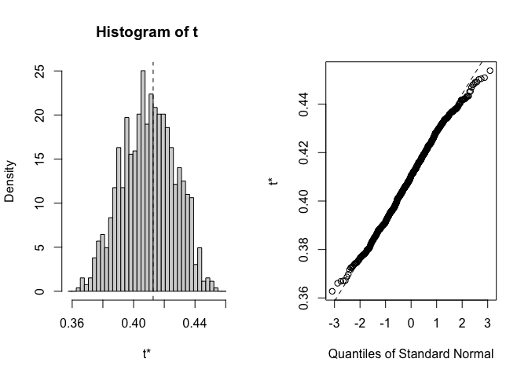<!-- --><!-- --><!-- -->

``` r
#boot.ci(gowers.boot_historical, type="norm", index = 1) # for the first pop
boot_historical_results <- tidy(gowers.boot_historical,conf.int=TRUE,conf.method="norm") %>%  #all pops
  rename(Gowers_Dist = statistic) %>% 
  mutate(TimePd="Historical")
```

#### Plot the results 

``` r
pops <- recent_clim_boot %>% select(parent.pop, elevation.group, elev_m, Lat, Long) %>% unique()

boot_gowers_recent_pops <- bind_cols(pops, boot_recent_results) %>% arrange(Gowers_Dist)
boot_gowers_historical_pops <- bind_cols(pops, boot_historical_results) %>% arrange(Gowers_Dist)
boot_gowers_results_all <- bind_rows(boot_gowers_recent_pops, boot_gowers_historical_pops)
#write_csv(boot_gowers_results_all, "../output/Climate/full_year_GowersEnvtalDist_WL2_wtr_year.csv")

recent_fig <- boot_gowers_results_all %>% 
  filter(TimePd=="Recent") %>% 
  ggplot(aes(x=fct_reorder(parent.pop, Gowers_Dist), y=Gowers_Dist, group=parent.pop, fill=elev_m)) +
  geom_col(width = 0.7,position = position_dodge(0.75)) +
  geom_errorbar(aes(ymin=conf.low, ymax=conf.high),
                width=.1, position = position_dodge(0.75)) +
  scale_y_continuous(expand = c(0, 0)) +
  scale_fill_gradient(low = "#F5A540", high = "#0043F0") +
  labs(y="Gowers Envtal Distance \n from WL2", fill="Elevation (m)", x="Population", title = "Recent Climate") +
  theme_classic() +
  theme(text=element_text(size=25), axis.text.x = element_text(angle = 45,  hjust = 1))

historical_fig <- boot_gowers_results_all %>% 
  filter(TimePd=="Historical") %>% 
  ggplot(aes(x=fct_reorder(parent.pop, Gowers_Dist), y=Gowers_Dist, group=parent.pop, fill=elev_m)) +
  geom_col(width = 0.7,position = position_dodge(0.75)) +
  geom_errorbar(aes(ymin=conf.low, ymax=conf.high),
                width=.1, position = position_dodge(0.75)) +
  scale_y_continuous(expand = c(0, 0)) +
  scale_fill_gradient(low = "#F5A540", high = "#0043F0") +
  labs(y="Gowers Envtal Distance \n from WL2", fill="Elevation (m)", x="Population", title="Historic Climate") +
  theme_classic() +
  theme(text=element_text(size=25), axis.text.x = element_text(angle = 45,  hjust = 1)) 
  

plot_grid(historical_fig, recent_fig)
```

<!-- -->

``` r
#ggsave("../output/Climate/full_year_Gowers_fromWL2_wtr_year.png", width = 24, height = 8, units = "in")
```

## Gower's Distance For 2024

``` r
WL2_climate_all_2024 <- bind_cols(WL2_climate_2024_flint, wl2_bioclim_all_year_final_2024)

WL2_range_prep_2024 <- WL2_climate_all_2024 %>% 
  mutate(parent.pop="WL2_Garden") %>% 
  rename_with(~str_remove(., "_WL2"), everything())
```

### Bootstrapping with home climates with avgs up to 2023

#### Create the gower_calc function 

``` r
#data <- recent_clim_boot_nest
#P=14

gowers_calc_2324 <- function(data, indices, P) { #function with all of the code necessary for calculating gowers distance 
  #data = _clim_boot (recent or historical) - needs to be nested by year; P = # climate variables 

  #need to make WL2_range_prep_2024 before running this function 
  
  data <-data[indices,] # subset per bootstrap indices
  
  data <- data %>% unnest(data) #unnest so the function can access the climate data
  
  data_means <- data %>% 
    group_by(parent.pop, elevation.group, elev_m, Lat, Long) %>% 
    summarise_at(c("cwd",  "pck", "ppt", "tmn", "tmx", "ann_tmean", "mean_diurnal_range", 
                   "temp_seasonality", "temp_ann_range",
                 "tmean_wettest_quarter", "tmean_driest_quarter", "ann_ppt",
                 "ppt_seasonality","ppt_warmest_quarter", "ppt_coldest_quarter"),
               c(mean), na.rm = TRUE) #get 30 year averages for each climate variable 
  
  range_merge <- bind_rows(data_means, WL2_range_prep_2024)
  
  WL2_home_climate_ranges <- range_merge %>% #calculate ranges
    ungroup() %>% 
  summarise(cwd_range=max(cwd)-min(cwd),
            pck_range=max(pck)-min(pck),
            ppt_range=max(ppt)-min(ppt), 
            tmn_range=max(tmn)-min(tmn), 
            tmx_range=max(tmx)-min(tmx), 
            ann_tmean_range=max(ann_tmean)-min(ann_tmean),
            mean_diurnal_range_range=max(mean_diurnal_range)-min(mean_diurnal_range),
            temp_seasonality_range=max(temp_seasonality)-min(temp_seasonality),
            temp_ann_range_range=max(temp_ann_range)-min(temp_ann_range),
            tmean_wettest_quarter_range=max(tmean_wettest_quarter)-min(tmean_wettest_quarter),
            tmean_driest_quarter_range=max(tmean_driest_quarter)-min(tmean_driest_quarter),
            ann_ppt_range=max(ann_ppt)-min(ann_ppt), 
            ppt_seasonality_range=max(ppt_seasonality)-min(ppt_seasonality),
            ppt_warmest_quarter_range=max(ppt_warmest_quarter)-min(ppt_warmest_quarter), 
            ppt_coldest_quarter_range=max(ppt_coldest_quarter)-min(ppt_coldest_quarter))
  
  WL2_home_climate <- bind_cols(WL2_climate_all_2024, data_means) #add WL2 climate data to home climate data 
  
  WL2_home_climate_with_ranges <- bind_cols(WL2_home_climate, WL2_home_climate_ranges) #add in ranges 
  
  gowers_calc_each_var <- WL2_home_climate_with_ranges %>% #variable by variable calc
  mutate(cwd_gowers=abs(cwd_WL2-cwd) / cwd_range,
         pck_gowers=abs(pck_WL2-pck) / pck_range,
         ppt_gowers=abs(ppt_WL2 - ppt) / ppt_range,
         tmn_gowers=abs(tmn_WL2 - tmn) / tmn_range,
         tmx_gowers=abs(tmx_WL2 - tmx) / tmx_range,
         ann_tmean_gowers=abs(ann_tmean_WL2 - ann_tmean) / ann_tmean_range,
         mean_diurnal_range_gowers=abs(mean_diurnal_range_WL2 - mean_diurnal_range) / mean_diurnal_range_range,
         temp_seasonality_gowers=abs(temp_seasonality_WL2 - temp_seasonality) / temp_seasonality_range,
         temp_ann_range_gowers=abs(temp_ann_range_WL2 - temp_ann_range) / temp_ann_range_range,
         tmean_wettest_quarter_gowers=abs(tmean_wettest_quarter_WL2 - tmean_wettest_quarter) / tmean_wettest_quarter_range,
         tmean_driest_quarter_gowers=abs(tmean_driest_quarter_WL2 - tmean_driest_quarter) / tmean_driest_quarter_range,
         ann_ppt_gowers=abs(ann_ppt_WL2 - ann_ppt) / ann_ppt_range,
         ppt_seasonality_gowers=abs(ppt_seasonality_WL2 - ppt_seasonality) / ppt_seasonality_range,
         ppt_warmest_quarter_gowers=abs(ppt_warmest_quarter_WL2 - ppt_warmest_quarter) / ppt_warmest_quarter_range,
         ppt_coldest_quarter_gowers=abs(ppt_coldest_quarter_WL2 - ppt_coldest_quarter) / ppt_coldest_quarter_range) %>% 
  dplyr::select(parent.pop, elevation.group, elev_m, ends_with("_gowers"))

 gowers_calc_per_pop <- gowers_calc_each_var %>% #final gowers calc 
  mutate(Gowers_Dist=(1/P)*(cwd_gowers + pck_gowers + ppt_gowers + tmn_gowers + tmx_gowers +
                                ann_tmean_gowers + mean_diurnal_range_gowers +
                                temp_seasonality_gowers +temp_ann_range_gowers +
                                tmean_wettest_quarter_gowers +
                                tmean_driest_quarter_gowers +ann_ppt_gowers +
                                ppt_seasonality_gowers + ppt_warmest_quarter_gowers +
                                ppt_coldest_quarter_gowers)) %>% 
  dplyr::select(parent.pop, elevation.group, elev_m, Gowers_Dist)
  
 gowers_calc_per_pop %>% pull(Gowers_Dist) #make the result a vector 
   }

#gowers_calc(recent_clim_boot_nest, P=15) #the function works
```

#### Perform the bootstrap sampling 
Recent

``` r
gowers.boot_recent_2324 <- boot(data=recent_clim_boot_nest, statistic=gowers_calc_2324, R=1000, P=15) #will sample each row (year) with replacement 
gowers.boot_recent_2324$t0 #looks correct 
```

```
##  [1] 0.5685739 0.4499338 0.2575245 0.2636920 0.3802910 0.4318044 0.4265044
##  [8] 0.4025207 0.4065734 0.4253658 0.4991233 0.3128423 0.2936251 0.2949090
## [15] 0.4117408 0.2750260 0.2265388 0.3568881 0.3721036 0.3919489 0.2604013
## [22] 0.3304016 0.3591755
```

``` r
#str(gowers.boot_recent)

for(i in 1:23) {
  plot(gowers.boot_recent_2324, index=i) #distributions look normal for the most part 
}
```

<!-- --><!-- --><!-- --><!-- --><!-- --><!-- --><!-- --><!-- --><!-- --><!-- --><!-- --><!-- --><!-- --><!-- --><!-- --><!-- -->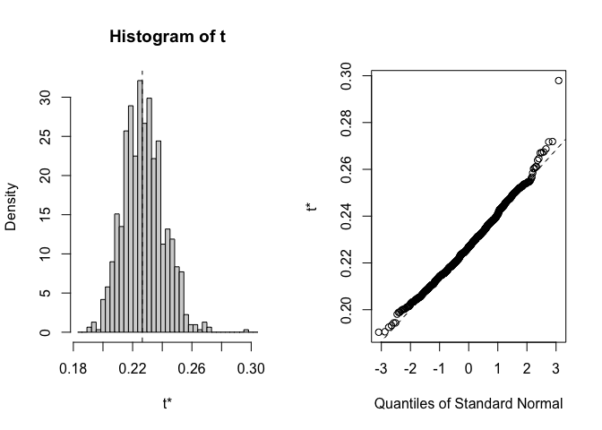<!-- --><!-- --><!-- --><!-- --><!-- --><!-- --><!-- -->

``` r
#boot.ci(gowers.boot_recent, type="norm", index = 1) # for the first pop
boot_recent_results_2324 <- tidy(gowers.boot_recent_2324,conf.int=TRUE,conf.method="norm") %>%  #all pops
  rename(Gowers_Dist = statistic) %>% 
  mutate(TimePd="Recent")
```

Historical

``` r
gowers.boot_historical_2324 <- boot(data=historical_clim_boot_nest, statistic=gowers_calc_2324, R=1000, P=15) #will sample each row (year) with replacement 
gowers.boot_historical_2324$t0 #looks correct 
```

```
##  [1] 0.5209561 0.4153298 0.2975266 0.3192561 0.3645146 0.3898051 0.3889199
##  [8] 0.4980074 0.5091185 0.5069535 0.4757087 0.2958563 0.2818667 0.2947058
## [15] 0.3871237 0.2458331 0.2508897 0.3280273 0.3275379 0.4511055 0.2566156
## [22] 0.3182829 0.3425708
```

``` r
#str(gowers.boot_historical)

for(i in 1:23) {
  plot(gowers.boot_historical_2324, index=i) #distributions look normal for the most part 
}
```

<!-- --><!-- --><!-- --><!-- --><!-- --><!-- --><!-- --><!-- --><!-- --><!-- --><!-- --><!-- --><!-- --><!-- --><!-- -->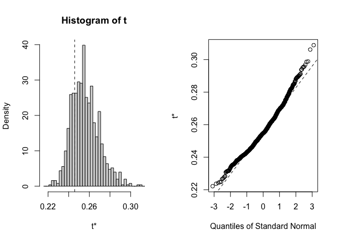<!-- --><!-- --><!-- --><!-- --><!-- --><!-- --><!-- --><!-- -->

``` r
#boot.ci(gowers.boot_historical, type="norm", index = 1) # for the first pop
boot_historical_results_2324 <- tidy(gowers.boot_historical_2324,conf.int=TRUE,conf.method="norm") %>%  #all pops
  rename(Gowers_Dist = statistic) %>% 
  mutate(TimePd="Historical")
```

#### Plot the results 

``` r
pops <- recent_clim_boot %>% select(parent.pop, elevation.group, elev_m, Lat, Long) %>% unique()

boot_gowers_recent_pops <- bind_cols(pops, boot_recent_results_2324) %>% arrange(Gowers_Dist)
boot_gowers_historical_pops <- bind_cols(pops, boot_historical_results_2324) %>% arrange(Gowers_Dist)
boot_gowers_results_2324_all <- bind_rows(boot_gowers_recent_pops, boot_gowers_historical_pops)
write_csv(boot_gowers_results_2324_all, "../output/Climate/full_year_GowersEnvtalDist_WL2_wtr_year_2324.csv")

recent_fig <- boot_gowers_results_2324_all %>% 
  filter(TimePd=="Recent") %>% 
  ggplot(aes(x=fct_reorder(parent.pop, Gowers_Dist), y=Gowers_Dist, group=parent.pop, fill=elev_m)) +
  geom_col(width = 0.7,position = position_dodge(0.75)) +
  geom_errorbar(aes(ymin=conf.low, ymax=conf.high),
                width=.1, position = position_dodge(0.75)) +
  scale_y_continuous(expand = c(0, 0)) +
  scale_fill_gradient(low = "#F5A540", high = "#0043F0") +
  labs(y="Gowers Envtal Distance \n from WL2", fill="Elevation (m)", x="Population", title = "Recent Climate") +
  theme_classic() +
  theme(text=element_text(size=25), axis.text.x = element_text(angle = 45,  hjust = 1))

historical_fig <- boot_gowers_results_2324_all %>% 
  filter(TimePd=="Historical") %>% 
  ggplot(aes(x=fct_reorder(parent.pop, Gowers_Dist), y=Gowers_Dist, group=parent.pop, fill=elev_m)) +
  geom_col(width = 0.7,position = position_dodge(0.75)) +
  geom_errorbar(aes(ymin=conf.low, ymax=conf.high),
                width=.1, position = position_dodge(0.75)) +
  scale_y_continuous(expand = c(0, 0)) +
  scale_fill_gradient(low = "#F5A540", high = "#0043F0") +
  labs(y="Gowers Envtal Distance \n from WL2", fill="Elevation (m)", x="Population", title="Historic Climate") +
  theme_classic() +
  theme(text=element_text(size=25), axis.text.x = element_text(angle = 45,  hjust = 1)) 
  

plot_grid(historical_fig, recent_fig)
```

<!-- -->

``` r
ggsave("../output/Climate/full_year_Gowers_fromWL2_wtr_year_2324.png", width = 24, height = 8, units = "in")
```

### Bootstrapping with home climates with avgs up to 2024

#### Load data with all 30 years

``` r
recent_clim_boot_2024 <- read_csv("../output/Climate/fullyear_wtr_year_avgs_Recent_2024.csv")
```

```
## Rows: 690 Columns: 21
## ── Column specification ────────────────────────────────────────────────────────
## Delimiter: ","
## chr  (2): parent.pop, elevation.group
## dbl (19): elev_m, Lat, Long, year, cwd, pck, ppt, tmn, tmx, ann_tmean, mean_...
## 
## ℹ Use `spec()` to retrieve the full column specification for this data.
## ℹ Specify the column types or set `show_col_types = FALSE` to quiet this message.
```

``` r
recent_clim_boot_2024_nest <- recent_clim_boot_2024 %>% nest(.by=year) #nest to prepare for bootstrapping 
recent_clim_boot_2024_nest
```

```
## # A tibble: 30 × 2
##     year data              
##    <dbl> <list>            
##  1  1995 <tibble [23 × 20]>
##  2  1996 <tibble [23 × 20]>
##  3  1997 <tibble [23 × 20]>
##  4  1998 <tibble [23 × 20]>
##  5  1999 <tibble [23 × 20]>
##  6  2000 <tibble [23 × 20]>
##  7  2001 <tibble [23 × 20]>
##  8  2002 <tibble [23 × 20]>
##  9  2003 <tibble [23 × 20]>
## 10  2004 <tibble [23 × 20]>
## # ℹ 20 more rows
```

``` r
historical_clim_boot_2024 <- read_csv("../output/Climate/fullyear_wtr_year_avgs_Historical_2024.csv")
```

```
## Rows: 690 Columns: 21
## ── Column specification ────────────────────────────────────────────────────────
## Delimiter: ","
## chr  (2): parent.pop, elevation.group
## dbl (19): elev_m, Lat, Long, year, cwd, pck, ppt, tmn, tmx, ann_tmean, mean_...
## 
## ℹ Use `spec()` to retrieve the full column specification for this data.
## ℹ Specify the column types or set `show_col_types = FALSE` to quiet this message.
```

``` r
historical_clim_boot_2024_nest <- historical_clim_boot_2024 %>% nest(.by=year)
historical_clim_boot_2024_nest
```

```
## # A tibble: 30 × 2
##     year data              
##    <dbl> <list>            
##  1  1965 <tibble [23 × 20]>
##  2  1966 <tibble [23 × 20]>
##  3  1967 <tibble [23 × 20]>
##  4  1968 <tibble [23 × 20]>
##  5  1969 <tibble [23 × 20]>
##  6  1970 <tibble [23 × 20]>
##  7  1971 <tibble [23 × 20]>
##  8  1972 <tibble [23 × 20]>
##  9  1973 <tibble [23 × 20]>
## 10  1974 <tibble [23 × 20]>
## # ℹ 20 more rows
```

#### Create the gower_calc function 

``` r
#data <- recent_clim_boot_2024_nest
#P=14

gowers_calc_2024 <- function(data, indices, P) { #function with all of the code necessary for calculating gowers distance 
  #data = _clim_boot_2024 (recent or historical) - needs to be nested by year; P = # climate variables 

  #need to make WL2_range_prep_2024 before running this function 
  
  data <-data[indices,] # subset per bootstrap indices
  
  data <- data %>% unnest(data) #unnest so the function can access the climate data
  
  data_means <- data %>% 
    group_by(parent.pop, elevation.group, elev_m, Lat, Long) %>% 
    summarise_at(c("cwd",  "pck", "ppt", "tmn", "tmx", "ann_tmean", "mean_diurnal_range", 
                   "temp_seasonality", "temp_ann_range",
                 "tmean_wettest_quarter", "tmean_driest_quarter", "ann_ppt",
                 "ppt_seasonality","ppt_warmest_quarter", "ppt_coldest_quarter"),
               c(mean), na.rm = TRUE) #get 30 year averages for each climate variable 
  
  range_merge <- bind_rows(data_means, WL2_range_prep_2024)
  
  WL2_home_climate_ranges <- range_merge %>% #calculate ranges
    ungroup() %>% 
  summarise(cwd_range=max(cwd)-min(cwd),
            pck_range=max(pck)-min(pck),
            ppt_range=max(ppt)-min(ppt), 
            tmn_range=max(tmn)-min(tmn), 
            tmx_range=max(tmx)-min(tmx), 
            ann_tmean_range=max(ann_tmean)-min(ann_tmean),
            mean_diurnal_range_range=max(mean_diurnal_range)-min(mean_diurnal_range),
            temp_seasonality_range=max(temp_seasonality)-min(temp_seasonality),
            temp_ann_range_range=max(temp_ann_range)-min(temp_ann_range),
            tmean_wettest_quarter_range=max(tmean_wettest_quarter)-min(tmean_wettest_quarter),
            tmean_driest_quarter_range=max(tmean_driest_quarter)-min(tmean_driest_quarter),
            ann_ppt_range=max(ann_ppt)-min(ann_ppt), 
            ppt_seasonality_range=max(ppt_seasonality)-min(ppt_seasonality),
            ppt_warmest_quarter_range=max(ppt_warmest_quarter)-min(ppt_warmest_quarter), 
            ppt_coldest_quarter_range=max(ppt_coldest_quarter)-min(ppt_coldest_quarter))
  
  WL2_home_climate <- bind_cols(WL2_climate_all_2024, data_means) #add WL2 climate data to home climate data 
  
  WL2_home_climate_with_ranges <- bind_cols(WL2_home_climate, WL2_home_climate_ranges) #add in ranges 
  
  gowers_calc_each_var <- WL2_home_climate_with_ranges %>% #variable by variable calc
  mutate(cwd_gowers=abs(cwd_WL2-cwd) / cwd_range,
         pck_gowers=abs(pck_WL2-pck) / pck_range,
         ppt_gowers=abs(ppt_WL2 - ppt) / ppt_range,
         tmn_gowers=abs(tmn_WL2 - tmn) / tmn_range,
         tmx_gowers=abs(tmx_WL2 - tmx) / tmx_range,
         ann_tmean_gowers=abs(ann_tmean_WL2 - ann_tmean) / ann_tmean_range,
         mean_diurnal_range_gowers=abs(mean_diurnal_range_WL2 - mean_diurnal_range) / mean_diurnal_range_range,
         temp_seasonality_gowers=abs(temp_seasonality_WL2 - temp_seasonality) / temp_seasonality_range,
         temp_ann_range_gowers=abs(temp_ann_range_WL2 - temp_ann_range) / temp_ann_range_range,
         tmean_wettest_quarter_gowers=abs(tmean_wettest_quarter_WL2 - tmean_wettest_quarter) / tmean_wettest_quarter_range,
         tmean_driest_quarter_gowers=abs(tmean_driest_quarter_WL2 - tmean_driest_quarter) / tmean_driest_quarter_range,
         ann_ppt_gowers=abs(ann_ppt_WL2 - ann_ppt) / ann_ppt_range,
         ppt_seasonality_gowers=abs(ppt_seasonality_WL2 - ppt_seasonality) / ppt_seasonality_range,
         ppt_warmest_quarter_gowers=abs(ppt_warmest_quarter_WL2 - ppt_warmest_quarter) / ppt_warmest_quarter_range,
         ppt_coldest_quarter_gowers=abs(ppt_coldest_quarter_WL2 - ppt_coldest_quarter) / ppt_coldest_quarter_range) %>% 
  dplyr::select(parent.pop, elevation.group, elev_m, ends_with("_gowers"))

 gowers_calc_per_pop <- gowers_calc_each_var %>% #final gowers calc 
  mutate(Gowers_Dist=(1/P)*(cwd_gowers + pck_gowers + ppt_gowers + tmn_gowers + tmx_gowers +
                                ann_tmean_gowers + mean_diurnal_range_gowers +
                                temp_seasonality_gowers +temp_ann_range_gowers +
                                tmean_wettest_quarter_gowers +
                                tmean_driest_quarter_gowers +ann_ppt_gowers +
                                ppt_seasonality_gowers + ppt_warmest_quarter_gowers +
                                ppt_coldest_quarter_gowers)) %>% 
  dplyr::select(parent.pop, elevation.group, elev_m, Gowers_Dist)
  
 gowers_calc_per_pop %>% pull(Gowers_Dist) #make the result a vector 
   }

#gowers_calc_2024(recent_clim_boot_2024_nest, P=15) #the function works
```

#### Perform the bootstrap sampling 
Recent

``` r
gowers.boot_recent_2024 <- boot(data=recent_clim_boot_2024_nest, statistic=gowers_calc_2024, R=1000, P=15) #will sample each row (year) with replacement 
gowers.boot_recent_2024$t0 #looks correct 
```

```
##  [1] 0.5660008 0.4450085 0.2534466 0.2611364 0.3775334 0.4236025 0.4222617
##  [8] 0.4058296 0.4099662 0.4289546 0.4970698 0.3096794 0.2892209 0.2905956
## [15] 0.4062824 0.2701784 0.2256086 0.3554964 0.3665152 0.3880526 0.2579644
## [22] 0.3278143 0.3556947
```

``` r
#str(gowers.boot_recent)

for(i in 1:23) {
  plot(gowers.boot_recent_2024, index=i) #distributions look normal for the most part 
}
```

<!-- --><!-- --><!-- -->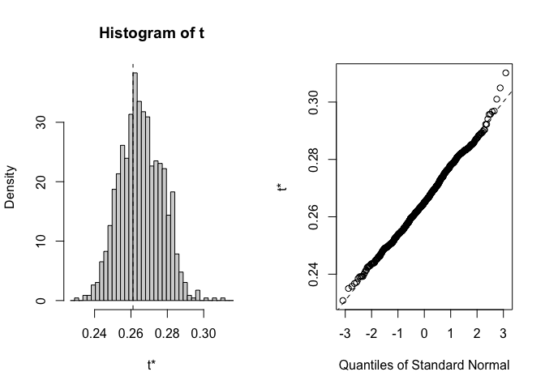<!-- --><!-- --><!-- --><!-- --><!-- --><!-- --><!-- -->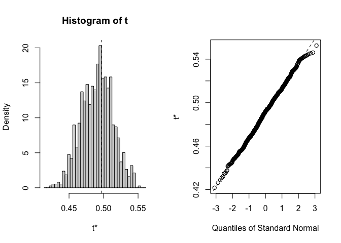<!-- --><!-- -->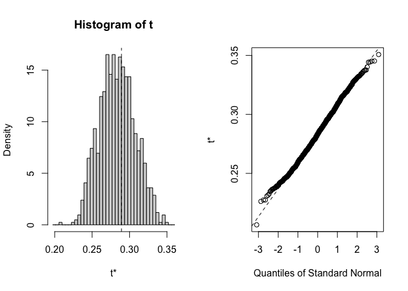<!-- --><!-- --><!-- --><!-- --><!-- --><!-- --><!-- --><!-- --><!-- --><!-- --><!-- -->

``` r
#boot.ci(gowers.boot_recent, type="norm", index = 1) # for the first pop
boot_recent_results_2024 <- tidy(gowers.boot_recent_2024,conf.int=TRUE,conf.method="norm") %>%  #all pops
  rename(Gowers_Dist = statistic) %>% 
  mutate(TimePd="Recent")
```

Historical

``` r
gowers.boot_historical_2024 <- boot(data=historical_clim_boot_2024_nest, statistic=gowers_calc_2024, R=1000, P=15) #will sample each row (year) with replacement 
gowers.boot_historical_2024$t0 #looks correct 
```

```
##  [1] 0.5206931 0.4145361 0.2963295 0.3173325 0.3610659 0.3873462 0.3865158
##  [8] 0.4988765 0.5099389 0.5073747 0.4743355 0.2925526 0.2776756 0.2897546
## [15] 0.3858798 0.2442123 0.2468551 0.3260659 0.3258941 0.4510181 0.2500614
## [22] 0.3131764 0.3379739
```

``` r
#str(gowers.boot_historical)

for(i in 1:23) {
  plot(gowers.boot_historical_2024, index=i) #distributions look normal for the most part 
}
```

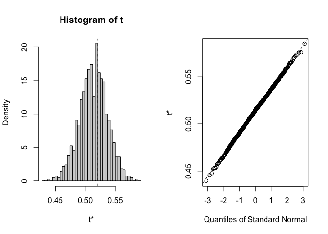<!-- --><!-- --><!-- --><!-- --><!-- --><!-- --><!-- --><!-- --><!-- -->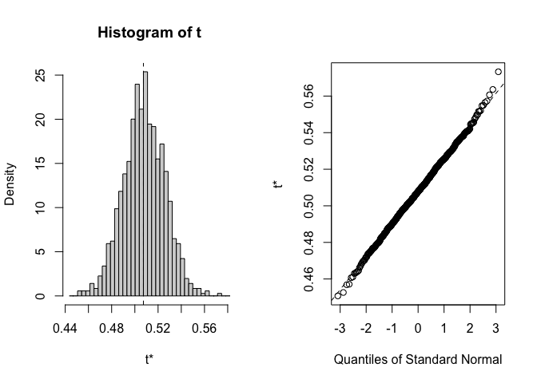<!-- --><!-- -->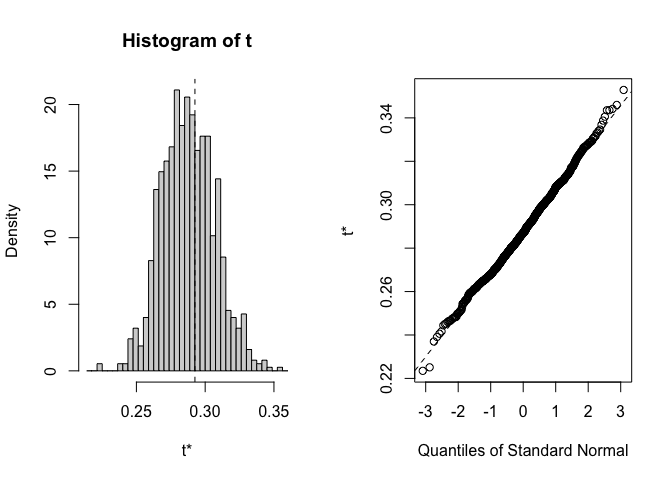<!-- --><!-- -->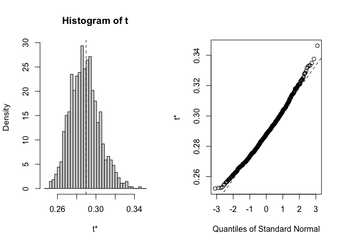<!-- --><!-- --><!-- --><!-- --><!-- --><!-- -->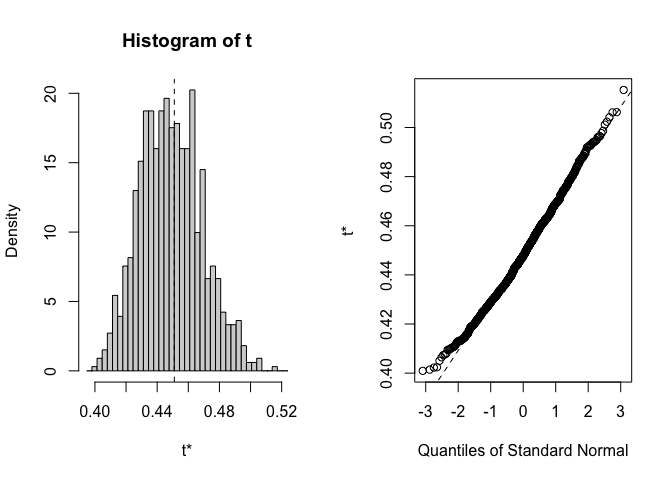<!-- -->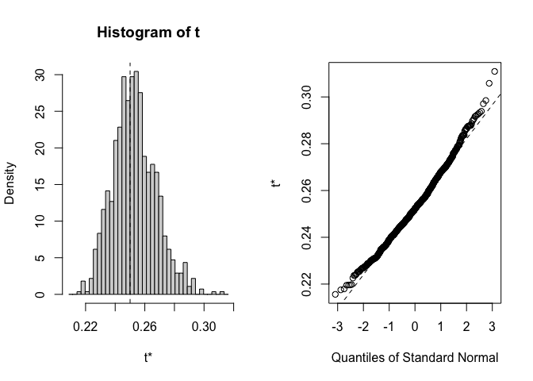<!-- --><!-- --><!-- -->

``` r
#boot.ci(gowers.boot_historical, type="norm", index = 1) # for the first pop
boot_historical_results_2024 <- tidy(gowers.boot_historical_2024,conf.int=TRUE,conf.method="norm") %>%  #all pops
  rename(Gowers_Dist = statistic) %>% 
  mutate(TimePd="Historical")
```

#### Plot the results 

``` r
pops <- recent_clim_boot_2024 %>% select(parent.pop, elevation.group, elev_m, Lat, Long) %>% unique()

boot_gowers_recent_pops_2024 <- bind_cols(pops, boot_recent_results_2024) %>% arrange(Gowers_Dist)
boot_gowers_historical_pops_2024 <- bind_cols(pops, boot_historical_results_2024) %>% arrange(Gowers_Dist)
boot_gowers_results_all_2024 <- bind_rows(boot_gowers_recent_pops_2024, boot_gowers_historical_pops_2024)
#write_csv(boot_gowers_results_all_2024, "../output/Climate/full_year_GowersEnvtalDist_WL2_wtr_year_2024.csv")

recent_fig <- boot_gowers_results_all_2024 %>% 
  filter(TimePd=="Recent") %>% 
  ggplot(aes(x=fct_reorder(parent.pop, Gowers_Dist), y=Gowers_Dist, group=parent.pop, fill=elev_m)) +
  geom_col(width = 0.7,position = position_dodge(0.75)) +
  geom_errorbar(aes(ymin=conf.low, ymax=conf.high),
                width=.1, position = position_dodge(0.75)) +
  scale_y_continuous(expand = c(0, 0)) +
  scale_fill_gradient(low = "#F5A540", high = "#0043F0") +
  labs(y="Gowers Envtal Distance \n from WL2", fill="Elevation (m)", x="Population", title = "Recent Climate") +
  theme_classic() +
  theme(text=element_text(size=25), axis.text.x = element_text(angle = 45,  hjust = 1))

historical_fig <- boot_gowers_results_all_2024 %>% 
  filter(TimePd=="Historical") %>% 
  ggplot(aes(x=fct_reorder(parent.pop, Gowers_Dist), y=Gowers_Dist, group=parent.pop, fill=elev_m)) +
  geom_col(width = 0.7,position = position_dodge(0.75)) +
  geom_errorbar(aes(ymin=conf.low, ymax=conf.high),
                width=.1, position = position_dodge(0.75)) +
  scale_y_continuous(expand = c(0, 0)) +
  scale_fill_gradient(low = "#F5A540", high = "#0043F0") +
  labs(y="Gowers Envtal Distance \n from WL2", fill="Elevation (m)", x="Population", title="Historic Climate") +
  theme_classic() +
  theme(text=element_text(size=25), axis.text.x = element_text(angle = 45,  hjust = 1)) 
  

plot_grid(historical_fig, recent_fig)
```

<!-- -->

``` r
#ggsave("../output/Climate/full_year_Gowers_fromWL2_wtr_year_2024.png", width = 24, height = 8, units = "in")
```

## Flint Climate Distance

### Gowers

``` r
#need to modify the gowers_calc function to only include Flint variables 
gowers_calc_flint <- function(data, indices, P) { #function with all of the code necessary for calculating gowers distance 
  #data = _clim_boot (recent or historical) - needs to be nested by year; P = # climate variables 
  #need to make WL2_range_prep before running this function 
  
  data <-data[indices,] # subset per bootstrap indices
  
  data <- data %>% unnest(data) #unnest so the function can access the climate data
  
  data_means <- data %>% 
    group_by(parent.pop, elevation.group, elev_m, Lat, Long) %>% 
    summarise_at(c("cwd",  "pck", "ppt", "tmn", "tmx"),
               c(mean), na.rm = TRUE) #get 30 year averages for each climate variable 
  
  range_merge <- bind_rows(data_means, WL2_range_prep)
  
  WL2_home_climate_ranges <- range_merge %>% #calculate ranges
    ungroup() %>% 
  summarise(cwd_range=max(cwd)-min(cwd),
            pck_range=max(pck)-min(pck),
            ppt_range=max(ppt)-min(ppt), 
            tmn_range=max(tmn)-min(tmn), 
            tmx_range=max(tmx)-min(tmx))
  
  WL2_home_climate <- bind_cols(WL2_climate_all, data_means) #add WL2 climate data to home climate data 
  
  WL2_home_climate_with_ranges <- bind_cols(WL2_home_climate, WL2_home_climate_ranges) #add in ranges 
  
  gowers_calc_each_var <- WL2_home_climate_with_ranges %>% #variable by variable calc
  mutate(cwd_gowers=abs(cwd_WL2-cwd) / cwd_range,
         pck_gowers=abs(pck_WL2-pck) / pck_range,
         ppt_gowers=abs(ppt_WL2 - ppt) / ppt_range,
         tmn_gowers=abs(tmn_WL2 - tmn) / tmn_range,
         tmx_gowers=abs(tmx_WL2 - tmx) / tmx_range)

 gowers_calc_per_pop <- gowers_calc_each_var %>% #final gowers calc 
  mutate(Gowers_Dist=(1/P)*(cwd_gowers + pck_gowers + ppt_gowers + tmn_gowers + tmx_gowers)) %>% 
  dplyr::select(parent.pop, elevation.group, elev_m, Gowers_Dist)
 
 gowers_calc_per_pop %>% pull(Gowers_Dist) #make the result a vector 
   }
```

#### Recent


``` r
recent_clim_boot_flint_nest <- recent_clim_boot %>% select(parent.pop:tmx) %>% nest(.by=year)

gowers.boot_flint_recent <- boot(data=recent_clim_boot_flint_nest, statistic=gowers_calc_flint, R=1000, P=5) #will sample each row (year) with replacement 
gowers.boot_flint_recent$t0 #looks correct 
```

```
##  [1] 0.8298694 0.7318034 0.3851232 0.3155863 0.5852761 0.6754010 0.6438531
##  [8] 0.2547820 0.2282119 0.2594628 0.7742664 0.5666877 0.4834382 0.4266042
## [15] 0.6913891 0.4941955 0.3850193 0.4891084 0.5246936 0.4792476 0.4161825
## [22] 0.3683864 0.4286654
```

``` r
#str(gowers.boot_flint_recent)

for(i in 1:23) {
  plot(gowers.boot_flint_recent, index=i) #distributions look normal for the most part 
}
```

<!-- --><!-- --><!-- --><!-- --><!-- --><!-- --><!-- --><!-- --><!-- --><!-- --><!-- --><!-- --><!-- --><!-- --><!-- --><!-- --><!-- --><!-- --><!-- --><!-- --><!-- --><!-- --><!-- -->

``` r
#boot.ci(gowers.boot_flint_recent, type="norm", index = 1) # for the first pop
boot_flint_recent_results <- tidy(gowers.boot_flint_recent,conf.int=TRUE,conf.method="norm") %>%  #all pops
  rename(Gowers_Dist = statistic) %>% 
  mutate(TimePd="Recent")
```

#### Historic


``` r
historical_clim_boot_flint_nest <- historical_clim_boot %>% select(parent.pop:tmx) %>% nest(.by=year)

gowers.boot_flint_historical <- boot(data=historical_clim_boot_flint_nest, statistic=gowers_calc_flint, R=1000, P=5) #will sample each row (year) with replacement 
gowers.boot_flint_historical$t0 #looks correct 
```

```
##  [1] 0.7887628 0.7017723 0.3657746 0.3031255 0.5469091 0.6465280 0.6197956
##  [8] 0.2599242 0.2593862 0.2634549 0.7622744 0.4854304 0.4103923 0.3843689
## [15] 0.6480619 0.4538663 0.3528659 0.4302055 0.4873648 0.5059971 0.3817998
## [22] 0.3579058 0.4310411
```

``` r
#str(gowers.boot_flint_historical)

for(i in 1:23) {
  plot(gowers.boot_flint_historical, index=i) #distributions look normal for the most part 
}
```

<!-- --><!-- --><!-- --><!-- --><!-- --><!-- --><!-- --><!-- --><!-- --><!-- --><!-- --><!-- --><!-- --><!-- --><!-- --><!-- --><!-- --><!-- --><!-- --><!-- --><!-- --><!-- --><!-- -->

``` r
#boot.ci(gowers.boot_flint_historical, type="norm", index = 1) # for the first pop
boot_flint_historical_results <- tidy(gowers.boot_flint_historical,conf.int=TRUE,conf.method="norm") %>%  #all pops
  rename(Gowers_Dist = statistic) %>% 
  mutate(TimePd="Historical")
```

#### Plot the results 


``` r
boot_flint_gowers_recent_pops <- bind_cols(pops, boot_flint_recent_results) %>% arrange(Gowers_Dist)
boot_flint_gowers_historical_pops <- bind_cols(pops, boot_flint_historical_results) %>% arrange(Gowers_Dist)
boot_flint_gowers_results_all <- bind_rows(boot_flint_gowers_recent_pops, boot_flint_gowers_historical_pops)
#write_csv(boot_flint_gowers_results_all, "../output/Climate/full_year_GowersEnvtalDist_WL2Flint_wtr_year.csv")

recent_fig <- boot_flint_gowers_results_all %>% 
  filter(TimePd=="Recent") %>% 
  ggplot(aes(x=fct_reorder(parent.pop, Gowers_Dist), y=Gowers_Dist, group=parent.pop, fill=elev_m)) +
  geom_col(width = 0.7,position = position_dodge(0.75)) +
  geom_errorbar(aes(ymin=conf.low, ymax=conf.high),
                width=.1, position = position_dodge(0.75)) +
  scale_y_continuous(expand = c(0, 0)) +
  scale_fill_gradient(low = "#F5A540", high = "#0043F0") +
  labs(y="Gowers Envtal Distance \n from WL2", fill="Elevation (m)", x="Population", title = "Recent Climate") +
  theme_classic() +
  theme(text=element_text(size=25), axis.text.x = element_text(angle = 45,  hjust = 1))

historical_fig <- boot_flint_gowers_results_all %>% 
  filter(TimePd=="Historical") %>% 
  ggplot(aes(x=fct_reorder(parent.pop, Gowers_Dist), y=Gowers_Dist, group=parent.pop, fill=elev_m)) +
  geom_col(width = 0.7,position = position_dodge(0.75)) +
  geom_errorbar(aes(ymin=conf.low, ymax=conf.high),
                width=.1, position = position_dodge(0.75)) +
  scale_y_continuous(expand = c(0, 0)) +
  scale_fill_gradient(low = "#F5A540", high = "#0043F0") +
  labs(y="Gowers Envtal Distance \n from WL2", fill="Elevation (m)", x="Population", title="Historic Climate") +
  theme_classic() +
  theme(text=element_text(size=25), axis.text.x = element_text(angle = 45,  hjust = 1)) 
  

plot_grid(historical_fig, recent_fig)
```

<!-- -->

``` r
#ggsave("../output/Climate/full_year_Gowers_Flint_fromWL2_wtr_year.png", width = 24, height = 8, units = "in")
```

### Subtraction


``` r
pops_flint_avgs <- read_csv("../output/Climate/fullyear_FlintAvgs_wtr_year.csv")
```

```
## Rows: 46 Columns: 11
## ── Column specification ────────────────────────────────────────────────────────
## Delimiter: ","
## chr (3): parent.pop, elevation.group, TimePd
## dbl (8): elev_m, Lat, Long, cwd, pck, ppt, tmn, tmx
## 
## ℹ Use `spec()` to retrieve the full column specification for this data.
## ℹ Specify the column types or set `show_col_types = FALSE` to quiet this message.
```

``` r
pops_flint_recent_avgs <- pops_flint_avgs %>% filter(TimePd=="Recent")
recent_flint_dist_prep <- bind_cols(WL2_climate_flint, pops_flint_recent_avgs)
names(recent_flint_dist_prep)
```

```
##  [1] "cwd_WL2"         "ppt_WL2"         "pck_WL2"         "tmn_WL2"        
##  [5] "tmx_WL2"         "parent.pop"      "elevation.group" "elev_m"         
##  [9] "Lat"             "Long"            "cwd"             "pck"            
## [13] "ppt"             "tmn"             "tmx"             "TimePd"
```

``` r
recent_flint_dist <- recent_flint_dist_prep %>% 
  mutate(ppt_dist=ppt - ppt_WL2,
         cwd_dist=cwd - cwd_WL2,
         pck_dist=pck - pck_WL2,
         tmn_dist=tmn - tmn_WL2,
         tmx_dist=tmx - tmx_WL2) %>% 
 dplyr::select(parent.pop, elevation.group, elev_m, ends_with("_dist"))

pops_flint_historic_avgs <-  pops_flint_avgs %>% filter(TimePd=="Historical")
historic_flint_dist_prep <- bind_cols(WL2_climate_flint, pops_flint_historic_avgs)
names(historic_flint_dist_prep)
```

```
##  [1] "cwd_WL2"         "ppt_WL2"         "pck_WL2"         "tmn_WL2"        
##  [5] "tmx_WL2"         "parent.pop"      "elevation.group" "elev_m"         
##  [9] "Lat"             "Long"            "cwd"             "pck"            
## [13] "ppt"             "tmn"             "tmx"             "TimePd"
```

``` r
historic_flint_dist <- historic_flint_dist_prep %>% 
  mutate(ppt_dist=ppt - ppt_WL2,
         cwd_dist=cwd - cwd_WL2,
         pck_dist=pck - pck_WL2,
         tmn_dist=tmn - tmn_WL2,
         tmx_dist=tmx - tmx_WL2) %>% 
 dplyr::select(parent.pop, elevation.group, elev_m, ends_with("_dist"))
```

Figures Recent (subtraction distance)


``` r
cwd_dist_fig_recent <- recent_flint_dist %>% 
  ggplot(aes(x=fct_reorder(parent.pop, cwd_dist), y=cwd_dist, group=parent.pop, fill=elev_m)) +
  geom_col(width = 0.7,position = position_dodge(0.75)) +
  scale_y_continuous(expand = c(0, 0)) +
  scale_fill_gradient(low = "#F5A540", high = "#0043F0") +
  labs(fill="Elevation (m)",x="Population") +
  theme_classic() +
  theme(text=element_text(size=25), axis.text.x = element_text(angle = 45,  hjust = 1))
#ggsave("../output/Climate/all-year_MeanCWD_DistfromHome_WL2_RecentClim_wtr_year.png", width = 12, height = 6, units = "in")

pck_dist_fig_recent <- recent_flint_dist %>% 
  ggplot(aes(x=fct_reorder(parent.pop, pck_dist), y=pck_dist, group=parent.pop, fill=elev_m)) +
  geom_col(width = 0.7,position = position_dodge(0.75)) +
  scale_y_continuous(expand = c(0, 0)) +
  scale_fill_gradient(low = "#F5A540", high = "#0043F0") +
  labs(fill="Elevation (m)",x="Population") +
  theme_classic() +
  theme(text=element_text(size=25), axis.text.x = element_text(angle = 45,  hjust = 1))
#ggsave("../output/Climate/all-year_MeanPCK_DistfromHome_WL2_RecentClim_wtr_year.png", width = 12, height = 6, units = "in")

ppt_dist_fig_recent <- recent_flint_dist %>% 
  ggplot(aes(x=fct_reorder(parent.pop, ppt_dist), y=ppt_dist, group=parent.pop, fill=elev_m)) +
  geom_col(width = 0.7,position = position_dodge(0.75)) +
  scale_y_continuous(expand = c(0, 0)) +
  scale_fill_gradient(low = "#F5A540", high = "#0043F0") +
  labs(fill="Elevation (m)",x="Population") +
  theme_classic() +
  theme(text=element_text(size=25), axis.text.x = element_text(angle = 45,  hjust = 1))
#ggsave("../output/Climate/all-year_MeanPPT_DistfromHome_WL2_RecentClim_wtr_year.png", width = 12, height = 6, units = "in")

tmn_dist_fig_recent <- recent_flint_dist %>% 
  ggplot(aes(x=fct_reorder(parent.pop, tmn_dist), y=tmn_dist, group=parent.pop, fill=elev_m)) +
  geom_col(width = 0.7,position = position_dodge(0.75)) +
  scale_y_continuous(expand = c(0, 0)) +
  scale_fill_gradient(low = "#F5A540", high = "#0043F0") +
  labs(fill="Elevation (m)",x="Population") +
  theme_classic() +
  theme(text=element_text(size=25), axis.text.x = element_text(angle = 45,  hjust = 1))
#ggsave("../output/Climate/all-year_MeanTMN_DistfromHome_WL2_RecentClim_wtr_year.png", width = 12, height = 6, units = "in")

tmx_dist_fig_recent <- recent_flint_dist %>% 
  ggplot(aes(x=fct_reorder(parent.pop, tmx_dist), y=tmx_dist, group=parent.pop, fill=elev_m)) +
  geom_col(width = 0.7,position = position_dodge(0.75)) +
  scale_y_continuous(expand = c(0, 0)) +
  scale_fill_gradient(low = "#F5A540", high = "#0043F0") +
  labs(fill="Elevation (m)",x="Population") +
  theme_classic() +
  theme(text=element_text(size=25), axis.text.x = element_text(angle = 45,  hjust = 1))
#ggsave("../output/Climate/all-year_MeanTMX_DistfromHome_WL2_RecentClim_wtr_year.png", width = 12, height = 6, units = "in")
```

Figures Historical (subtraction distance)


``` r
cwd_dist_fig_historical <- historic_flint_dist %>% 
  ggplot(aes(x=fct_reorder(parent.pop, cwd_dist), y=cwd_dist, group=parent.pop, fill=elev_m)) +
  geom_col(width = 0.7,position = position_dodge(0.75)) +
  scale_y_continuous(expand = c(0, 0)) +
  scale_fill_gradient(low = "#F5A540", high = "#0043F0") +
  labs(fill="Elevation (m)",x="Population") +
  theme_classic() +
  theme(text=element_text(size=25), axis.text.x = element_text(angle = 45,  hjust = 1))
#ggsave("../output/Climate/all-year_MeanCWD_DistfromHome_WL2_HistoricalClim_wtr_year.png", width = 12, height = 6, units = "in")

pck_dist_fig_historical <- historic_flint_dist %>% 
  ggplot(aes(x=fct_reorder(parent.pop, pck_dist), y=pck_dist, group=parent.pop, fill=elev_m)) +
  geom_col(width = 0.7,position = position_dodge(0.75)) +
  scale_y_continuous(expand = c(0, 0)) +
  scale_fill_gradient(low = "#F5A540", high = "#0043F0") +
  labs(fill="Elevation (m)",x="Population") +
  theme_classic() +
  theme(text=element_text(size=25), axis.text.x = element_text(angle = 45,  hjust = 1))
#ggsave("../output/Climate/all-year_MeanPCK_DistfromHome_WL2_HistoricalClim_wtr_year.png", width = 12, height = 6, units = "in")

ppt_dist_fig_historical <- historic_flint_dist %>% 
  ggplot(aes(x=fct_reorder(parent.pop, ppt_dist), y=ppt_dist, group=parent.pop, fill=elev_m)) +
  geom_col(width = 0.7,position = position_dodge(0.75)) +
  scale_y_continuous(expand = c(0, 0)) +
  scale_fill_gradient(low = "#F5A540", high = "#0043F0") +
  labs(fill="Elevation (m)",x="Population") +
  theme_classic() +
  theme(text=element_text(size=25), axis.text.x = element_text(angle = 45,  hjust = 1))
#ggsave("../output/Climate/all-year_MeanPPT_DistfromHome_WL2_HistoricalClim_wtr_year.png", width = 12, height = 6, units = "in")

tmn_dist_fig_historical <- historic_flint_dist %>% 
  ggplot(aes(x=fct_reorder(parent.pop, tmn_dist), y=tmn_dist, group=parent.pop, fill=elev_m)) +
  geom_col(width = 0.7,position = position_dodge(0.75)) +
  scale_y_continuous(expand = c(0, 0)) +
  scale_fill_gradient(low = "#F5A540", high = "#0043F0") +
  labs(fill="Elevation (m)",x="Population") +
  theme_classic() +
  theme(text=element_text(size=25), axis.text.x = element_text(angle = 45,  hjust = 1))
#ggsave("../output/Climate/all-year_MeanTMN_DistfromHome_WL2_HistoricalClim_wtr_year.png", width = 12, height = 6, units = "in")

tmx_dist_fig_historical <- historic_flint_dist %>% 
  ggplot(aes(x=fct_reorder(parent.pop, tmx_dist), y=tmx_dist, group=parent.pop, fill=elev_m)) +
  geom_col(width = 0.7,position = position_dodge(0.75)) +
  scale_y_continuous(expand = c(0, 0)) +
  scale_fill_gradient(low = "#F5A540", high = "#0043F0") +
  labs(fill="Elevation (m)",x="Population") +
  theme_classic() +
  theme(text=element_text(size=25), axis.text.x = element_text(angle = 45,  hjust = 1))
#ggsave("../output/Climate/all-year_MeanTMX_DistfromHome_WL2_HistoricalClim_wtr_year.png", width = 12, height = 6, units = "in")
```

#### For 2024 (from 2023 home avgs)


``` r
recent_flint_dist_prep_2324 <- bind_cols(WL2_climate_2024_flint, pops_flint_recent_avgs)
names(recent_flint_dist_prep_2324)
```

```
##  [1] "cwd_WL2"         "ppt_WL2"         "pck_WL2"         "tmn_WL2"        
##  [5] "tmx_WL2"         "parent.pop"      "elevation.group" "elev_m"         
##  [9] "Lat"             "Long"            "cwd"             "pck"            
## [13] "ppt"             "tmn"             "tmx"             "TimePd"
```

``` r
recent_flint_dist_2324 <- recent_flint_dist_prep_2324 %>% 
  mutate(ppt_dist=ppt - ppt_WL2,
         cwd_dist=cwd - cwd_WL2,
         pck_dist=pck - pck_WL2,
         tmn_dist=tmn - tmn_WL2,
         tmx_dist=tmx - tmx_WL2) %>% 
 dplyr::select(parent.pop, elevation.group, elev_m, ends_with("_dist"))

historic_flint_dist_prep_2324 <- bind_cols(WL2_climate_2024_flint, pops_flint_historic_avgs)
names(historic_flint_dist_prep_2324)
```

```
##  [1] "cwd_WL2"         "ppt_WL2"         "pck_WL2"         "tmn_WL2"        
##  [5] "tmx_WL2"         "parent.pop"      "elevation.group" "elev_m"         
##  [9] "Lat"             "Long"            "cwd"             "pck"            
## [13] "ppt"             "tmn"             "tmx"             "TimePd"
```

``` r
historic_flint_dist_2324 <- historic_flint_dist_prep_2324 %>% 
  mutate(ppt_dist=ppt - ppt_WL2,
         cwd_dist=cwd - cwd_WL2,
         pck_dist=pck - pck_WL2,
         tmn_dist=tmn - tmn_WL2,
         tmx_dist=tmx - tmx_WL2) %>% 
 dplyr::select(parent.pop, elevation.group, elev_m, ends_with("_dist"))
```

#### For 2024

``` r
pops_flint_avgs_2024 <- read_csv("../output/Climate/fullyear_FlintAvgs_wtr_year_2024.csv")
```

```
## Rows: 46 Columns: 11
## ── Column specification ────────────────────────────────────────────────────────
## Delimiter: ","
## chr (3): parent.pop, elevation.group, TimePd
## dbl (8): elev_m, Lat, Long, cwd, pck, ppt, tmn, tmx
## 
## ℹ Use `spec()` to retrieve the full column specification for this data.
## ℹ Specify the column types or set `show_col_types = FALSE` to quiet this message.
```

``` r
pops_flint_avgs_recent_2024 <- pops_flint_avgs_2024 %>% filter(TimePd=="Recent")
recent_flint_dist_prep_2024 <- bind_cols(WL2_climate_2024_flint, pops_flint_avgs_recent_2024)
names(recent_flint_dist_prep_2024)
```

```
##  [1] "cwd_WL2"         "ppt_WL2"         "pck_WL2"         "tmn_WL2"        
##  [5] "tmx_WL2"         "parent.pop"      "elevation.group" "elev_m"         
##  [9] "Lat"             "Long"            "cwd"             "pck"            
## [13] "ppt"             "tmn"             "tmx"             "TimePd"
```

``` r
recent_flint_dist_2024 <- recent_flint_dist_prep_2024 %>% 
  mutate(ppt_dist=ppt - ppt_WL2,
         cwd_dist=cwd - cwd_WL2,
         pck_dist=pck - pck_WL2,
         tmn_dist=tmn - tmn_WL2,
         tmx_dist=tmx - tmx_WL2) %>% 
 dplyr::select(parent.pop, elevation.group, elev_m, ends_with("_dist"))

pops_flint_avgs_historic_2024 <- pops_flint_avgs_2024 %>% filter(TimePd=="Historical")
historic_flint_dist_prep_2024 <- bind_cols(WL2_climate_2024_flint, pops_flint_avgs_historic_2024)
names(historic_flint_dist_prep_2024)
```

```
##  [1] "cwd_WL2"         "ppt_WL2"         "pck_WL2"         "tmn_WL2"        
##  [5] "tmx_WL2"         "parent.pop"      "elevation.group" "elev_m"         
##  [9] "Lat"             "Long"            "cwd"             "pck"            
## [13] "ppt"             "tmn"             "tmx"             "TimePd"
```

``` r
historic_flint_dist_2024 <- historic_flint_dist_prep_2024 %>% 
  mutate(ppt_dist=ppt - ppt_WL2,
         cwd_dist=cwd - cwd_WL2,
         pck_dist=pck - pck_WL2,
         tmn_dist=tmn - tmn_WL2,
         tmx_dist=tmx - tmx_WL2) %>% 
 dplyr::select(parent.pop, elevation.group, elev_m, ends_with("_dist"))
```


## Bioclim Climate Distance

### Gowers

``` r
#need to modify the gowers_calc function to only include bioclim variables 
gowers_calc_bioclim <- function(data, indices, P) { #function with all of the code necessary for calculating gowers distance 
  #data = _clim_boot (recent or historical) - needs to be nested by year; P = # climate variables 
  #need to make WL2_range_prep before running this function 
  
  data <-data[indices,] # subset per bootstrap indices
  
  data <- data %>% unnest(data) #unnest so the function can access the climate data
  
  data_means <- data %>% 
    group_by(parent.pop, elevation.group, elev_m, Lat, Long) %>% 
    summarise_at(c("ann_tmean", "mean_diurnal_range", 
                   "temp_seasonality", "temp_ann_range",
                 "tmean_wettest_quarter", "tmean_driest_quarter", "ann_ppt",
                 "ppt_seasonality","ppt_warmest_quarter", "ppt_coldest_quarter"),
               c(mean), na.rm = TRUE) #get 30 year averages for each climate variable 
  
  range_merge <- bind_rows(data_means, WL2_range_prep)
  
  WL2_home_climate_ranges <- range_merge %>% #calculate ranges
    ungroup() %>% 
  summarise(ann_tmean_range=max(ann_tmean)-min(ann_tmean),
            mean_diurnal_range_range=max(mean_diurnal_range)-min(mean_diurnal_range),
            temp_seasonality_range=max(temp_seasonality)-min(temp_seasonality),
            temp_ann_range_range=max(temp_ann_range)-min(temp_ann_range),
            tmean_wettest_quarter_range=max(tmean_wettest_quarter)-min(tmean_wettest_quarter),
            tmean_driest_quarter_range=max(tmean_driest_quarter)-min(tmean_driest_quarter),
            ann_ppt_range=max(ann_ppt)-min(ann_ppt), 
            ppt_seasonality_range=max(ppt_seasonality)-min(ppt_seasonality),
            ppt_warmest_quarter_range=max(ppt_warmest_quarter)-min(ppt_warmest_quarter), 
            ppt_coldest_quarter_range=max(ppt_coldest_quarter)-min(ppt_coldest_quarter))
  
  WL2_home_climate <- bind_cols(WL2_climate_all, data_means) #add WL2 climate data to home climate data 
  
  WL2_home_climate_with_ranges <- bind_cols(WL2_home_climate, WL2_home_climate_ranges) #add in ranges 
  
  gowers_calc_each_var <- WL2_home_climate_with_ranges %>% #variable by variable calc
  mutate(ann_tmean_gowers=abs(ann_tmean_WL2 - ann_tmean) / ann_tmean_range,
         mean_diurnal_range_gowers=abs(mean_diurnal_range_WL2 - mean_diurnal_range) / mean_diurnal_range_range,
         temp_seasonality_gowers=abs(temp_seasonality_WL2 - temp_seasonality) / temp_seasonality_range,
         temp_ann_range_gowers=abs(temp_ann_range_WL2 - temp_ann_range) / temp_ann_range_range,
         tmean_wettest_quarter_gowers=abs(tmean_wettest_quarter_WL2 - tmean_wettest_quarter) / tmean_wettest_quarter_range,
         tmean_driest_quarter_gowers=abs(tmean_driest_quarter_WL2 - tmean_driest_quarter) / tmean_driest_quarter_range,
         ann_ppt_gowers=abs(ann_ppt_WL2 - ann_ppt) / ann_ppt_range,
         ppt_seasonality_gowers=abs(ppt_seasonality_WL2 - ppt_seasonality) / ppt_seasonality_range,
         ppt_warmest_quarter_gowers=abs(ppt_warmest_quarter_WL2 - ppt_warmest_quarter) / ppt_warmest_quarter_range,
         ppt_coldest_quarter_gowers=abs(ppt_coldest_quarter_WL2 - ppt_coldest_quarter) / ppt_coldest_quarter_range) %>% 
  dplyr::select(parent.pop, elevation.group, elev_m, ends_with("_gowers"))

 gowers_calc_per_pop <- gowers_calc_each_var %>% #final gowers calc 
  mutate(Gowers_Dist=(1/P)*(ann_tmean_gowers + mean_diurnal_range_gowers +
                                temp_seasonality_gowers +temp_ann_range_gowers +
                                tmean_wettest_quarter_gowers +
                                tmean_driest_quarter_gowers +ann_ppt_gowers +
                                ppt_seasonality_gowers + ppt_warmest_quarter_gowers +
                                ppt_coldest_quarter_gowers)) %>% 
  dplyr::select(parent.pop, elevation.group, elev_m, Gowers_Dist)
 
 gowers_calc_per_pop %>% pull(Gowers_Dist) #make the result a vector 
   }
```

#### Recent


``` r
recent_clim_boot_bioclim_nest <- recent_clim_boot %>% select(parent.pop:year, ann_tmean:ppt_coldest_quarter) %>% nest(.by=year)

gowers.boot_bioclim_recent <- boot(data=recent_clim_boot_bioclim_nest, statistic=gowers_calc_bioclim, R=1000, P=10) #will sample each row (year) with replacement 
gowers.boot_bioclim_recent$t0 #looks correct 
```

```
##  [1] 0.6563077 0.5425798 0.3873179 0.3883452 0.4086758 0.5013511 0.5049778
##  [8] 0.4393398 0.4455919 0.4477789 0.5736585 0.3989203 0.3932999 0.3838464
## [15] 0.5115852 0.4110205 0.4014730 0.3827429 0.4588038 0.4511887 0.4084294
## [22] 0.4041521 0.4018008
```

``` r
#str(gowers.boot_bioclim_recent)

for(i in 1:23) {
  plot(gowers.boot_bioclim_recent, index=i) #distributions look normal for the most part 
}
```

<!-- --><!-- --><!-- --><!-- --><!-- --><!-- --><!-- --><!-- --><!-- --><!-- --><!-- --><!-- --><!-- --><!-- --><!-- --><!-- --><!-- --><!-- --><!-- --><!-- --><!-- --><!-- --><!-- -->

``` r
#boot.ci(gowers.boot_bioclim_recent, type="norm", index = 1) # for the first pop
boot_bioclim_recent_results <- tidy(gowers.boot_bioclim_recent,conf.int=TRUE,conf.method="norm") %>%  #all pops
  rename(Gowers_Dist = statistic) %>% 
  mutate(TimePd="Recent")
```

#### Historic


``` r
historical_clim_boot_bioclim_nest <- historical_clim_boot %>% select(parent.pop:year, ann_tmean:ppt_coldest_quarter) %>% nest(.by=year)

gowers.boot_bioclim_historical <- boot(data=historical_clim_boot_bioclim_nest, statistic=gowers_calc_bioclim, R=1000, P=10) #will sample each row (year) with replacement 
gowers.boot_bioclim_historical$t0 #looks correct 
```

```
##  [1] 0.5765702 0.5033452 0.4722676 0.4833526 0.4127201 0.5073120 0.4846540
##  [8] 0.5643323 0.5691501 0.5662965 0.5691550 0.4313260 0.4262888 0.4302877
## [15] 0.4863573 0.4555654 0.4613156 0.3960979 0.4957256 0.5806481 0.4282173
## [22] 0.4563510 0.4666147
```

``` r
#str(gowers.boot_bioclim_historical)

for(i in 1:23) {
  plot(gowers.boot_bioclim_historical, index=i) #distributions look normal for the most part 
}
```

<!-- --><!-- --><!-- --><!-- --><!-- --><!-- --><!-- --><!-- --><!-- --><!-- --><!-- --><!-- --><!-- --><!-- --><!-- --><!-- --><!-- --><!-- --><!-- --><!-- --><!-- --><!-- --><!-- -->

``` r
#boot.ci(gowers.boot_bioclim_historical, type="norm", index = 1) # for the first pop
boot_bioclim_historical_results <- tidy(gowers.boot_bioclim_historical,conf.int=TRUE,conf.method="norm") %>%  #all pops
  rename(Gowers_Dist = statistic) %>% 
  mutate(TimePd="Historical")
```

#### Plot the results 


``` r
boot_bioclim_gowers_recent_pops <- bind_cols(pops, boot_bioclim_recent_results) %>% arrange(Gowers_Dist)
boot_bioclim_gowers_historical_pops <- bind_cols(pops, boot_bioclim_historical_results) %>% arrange(Gowers_Dist)
boot_bioclim_gowers_results_all <- bind_rows(boot_bioclim_gowers_recent_pops, boot_bioclim_gowers_historical_pops)
#write_csv(boot_bioclim_gowers_results_all, "../output/Climate/full_year_GowersEnvtalDist_WL2bioclim_wtr_year.csv")

recent_fig <- boot_bioclim_gowers_results_all %>% 
  filter(TimePd=="Recent") %>% 
  ggplot(aes(x=fct_reorder(parent.pop, Gowers_Dist), y=Gowers_Dist, group=parent.pop, fill=elev_m)) +
  geom_col(width = 0.7,position = position_dodge(0.75)) +
  geom_errorbar(aes(ymin=conf.low, ymax=conf.high),
                width=.1, position = position_dodge(0.75)) +
  scale_y_continuous(expand = c(0, 0)) +
  scale_fill_gradient(low = "#F5A540", high = "#0043F0") +
  labs(y="Gowers Envtal Distance \n from WL2", fill="Elevation (m)", x="Population", title = "Recent Climate") +
  theme_classic() +
  theme(text=element_text(size=25), axis.text.x = element_text(angle = 45,  hjust = 1))

historical_fig <- boot_bioclim_gowers_results_all %>% 
  filter(TimePd=="Historical") %>% 
  ggplot(aes(x=fct_reorder(parent.pop, Gowers_Dist), y=Gowers_Dist, group=parent.pop, fill=elev_m)) +
  geom_col(width = 0.7,position = position_dodge(0.75)) +
  geom_errorbar(aes(ymin=conf.low, ymax=conf.high),
                width=.1, position = position_dodge(0.75)) +
  scale_y_continuous(expand = c(0, 0)) +
  scale_fill_gradient(low = "#F5A540", high = "#0043F0") +
  labs(y="Gowers Envtal Distance \n from WL2", fill="Elevation (m)", x="Population", title="Historic Climate") +
  theme_classic() +
  theme(text=element_text(size=25), axis.text.x = element_text(angle = 45,  hjust = 1)) 
  

plot_grid(historical_fig, recent_fig)
```

<!-- -->

``` r
#ggsave("../output/Climate/full_year_Gowers_BioClim_fromWL2_wtr_year.png", width = 24, height = 8, units = "in")
```

### Subtraction


``` r
pops_bioclim_avgs <-  read_csv("../output/Climate/fullyear_BioClimAvgs_wtr_year.csv") 
```

```
## Rows: 46 Columns: 16
## ── Column specification ────────────────────────────────────────────────────────
## Delimiter: ","
## chr  (3): parent.pop, elevation.group, TimePd
## dbl (13): elev_m, Lat, Long, ann_tmean, mean_diurnal_range, temp_seasonality...
## 
## ℹ Use `spec()` to retrieve the full column specification for this data.
## ℹ Specify the column types or set `show_col_types = FALSE` to quiet this message.
```

``` r
#Recent
pops_bioclim_recent_avgs <- pops_bioclim_avgs %>%  filter(TimePd=="Recent")
recent_bioclim_dist_prep <- bind_cols(wl2_bioclim_all_year_final, pops_bioclim_recent_avgs)
recent_bioclim_dist <- recent_bioclim_dist_prep %>% 
  mutate(ann_tmean_dist=ann_tmean - ann_tmean_WL2,
         mean_diurnal_range_dist=mean_diurnal_range - mean_diurnal_range_WL2,
         temp_seasonality_dist=temp_seasonality - temp_seasonality_WL2,
         temp_ann_range_dist=temp_ann_range - temp_ann_range_WL2,
         tmean_wettest_quarter_dist=tmean_wettest_quarter - tmean_wettest_quarter_WL2,
         tmean_driest_quarter_dist=tmean_driest_quarter - tmean_driest_quarter_WL2,
         ann_ppt_dist=ann_ppt - ann_ppt_WL2,
         ppt_seasonality_dist=ppt_seasonality - ppt_seasonality_WL2, 
         ppt_warmest_quarter_dist=ppt_warmest_quarter - ppt_warmest_quarter_WL2,
         ppt_coldest_quarter_dist=ppt_coldest_quarter - ppt_coldest_quarter_WL2) %>% 
 dplyr::select(parent.pop, elevation.group, elev_m, ends_with("_dist"))
recent_bioclim_dist
```

```
##    parent.pop elevation.group    elev_m ann_tmean_dist mean_diurnal_range_dist
## 1          BH             Low  511.4294      9.3131111                4.333333
## 2          CC             Low  313.0000      9.7247361                2.944472
## 3         CP2            High 2244.1329      0.3630556                1.920000
## 4         CP3            High 2266.3822     -0.3462222                1.806222
## 5         DPR             Mid 1018.5919      7.1314028                2.052361
## 6          FR             Mid  787.0000      5.9816806                4.104028
## 7          IH             Low  454.1298      8.5100556                3.230111
## 8         LV1            High 2593.4166     -1.9999306                2.288083
## 9         LV3            High 2353.5507     -1.9939861                2.309306
## 10      LVTR1            High 2741.3898     -2.1510694                2.398861
## 11         SC             Low  421.5178      8.8104167                3.606111
## 12        SQ1             Mid 1921.0366      2.8149167                1.716444
## 13        SQ2             Mid 1934.4512      2.6137500                1.950556
## 14        SQ3            High 2373.1707      0.4783889                2.035833
## 15        TM2             Low  379.1527      9.3726389                2.712167
## 16        WL1             Mid 1613.8372      3.8918194                2.458417
## 17        WL2            High 2020.1158      1.6352917                1.624806
## 18         WR             Mid 1158.0000      6.1468194                1.627139
## 19         WV             Mid  748.8571      5.3123194                3.906750
## 20       YO11            High 2872.2950     -3.0110278                2.697556
## 21        YO4            High 2157.5739      1.6302361                1.571583
## 22        YO7            High 2469.9787     -0.9207917                2.985639
## 23        YO8            High 2590.9784     -1.3999861                3.063750
##    temp_seasonality_dist temp_ann_range_dist tmean_wettest_quarter_dist
## 1              -60.12698           2.0040000                 10.1081111
## 2              -91.94236          -0.1646667                 10.8910000
## 3              -71.24699          -0.5780000                  2.1239444
## 4              -67.72248          -0.5523333                  1.4004444
## 5              -67.09243          -0.5806667                  8.1318333
## 6              -47.24314           2.3043333                  6.7739444
## 7              -92.70024           0.2370000                  9.9497778
## 8              -90.18034          -0.4240000                 -0.3278889
## 9              -91.93763          -0.4423333                 -0.2443889
## 10             -93.58073          -0.2493333                 -0.3952778
## 11            -110.93393           0.1400000                 10.2697222
## 12             -62.52196          -0.5030000                  4.1563889
## 13             -62.54707          -0.2413333                  3.9883333
## 14             -72.07275          -0.2823333                  2.0042778
## 15             -87.03036          -0.3396667                 10.5082222
## 16             -77.62394          -0.3550000                  5.6761111
## 17             -73.25949          -1.0186667                  3.4465556
## 18             -61.41065          -0.9270000                  7.1178333
## 19             -38.67997           2.2293333                  6.3482222
## 20             -68.30997           0.4120000                 -0.9432222
## 21             -90.47103          -1.4803333                  3.0478889
## 22             -98.36814          -0.1410000                  0.6753889
## 23             -94.83636          -0.0040000                  0.1516667
##    tmean_driest_quarter_dist ann_ppt_dist ppt_seasonality_dist
## 1                  1.9028889   -1903.3553             9.110449
## 2                  2.5522222   -1472.4147             6.947168
## 3                 -6.6615556   -1198.2757            -5.864108
## 4                 -7.3550556   -1253.0557            -7.199701
## 5                  0.3026667   -1029.8414             3.577777
## 6                 -1.1562778   -1466.9467             5.870672
## 7                  1.3938333   -1413.3157             4.899665
## 8                 -9.1186667    -729.3860           -10.098917
## 9                 -9.1310000    -761.3737           -10.577557
## 10                -9.3248889    -670.8974           -10.220148
## 11                 1.8075000   -1696.0340             4.240618
## 12                -4.5318333   -1544.7580             4.161716
## 13                -4.7060556   -1523.8407             5.101853
## 14                -6.8301667   -1445.5947             5.269255
## 15                 2.4013889   -1354.4123             7.083399
## 16                -3.2717222   -1207.5217            -2.999783
## 17                -5.4460000   -1201.3210            -5.603420
## 18                -0.6517222    -872.5587             3.315078
## 19                -1.5997222   -1467.0617            -1.637537
## 20               -10.3630556   -1668.6830            -4.871678
## 21                -5.6748889   -1355.3087             3.613782
## 22                -8.4037222   -1298.5924             2.681381
## 23                -8.8713333   -1308.5564             2.574380
##    ppt_warmest_quarter_dist ppt_coldest_quarter_dist
## 1               -41.3263333               -1083.4730
## 2               -10.5470000                -856.4733
## 3                39.6546667                -758.2577
## 4                33.7856667                -789.9770
## 5                38.5873333                -633.9707
## 6                 5.2143333                -860.0967
## 7                 3.4016667                -838.0123
## 8                86.1206667                -581.2507
## 9                83.7860000                -601.9627
## 10               98.2480000                -557.9347
## 11              -20.5286667                -990.6537
## 12               15.7820000                -907.3167
## 13                8.8176667                -894.6653
## 14               13.3300000                -851.5623
## 15                0.7236667                -790.1980
## 16               31.2276667                -758.7450
## 17               34.7400000                -763.0367
## 18               53.5583333                -550.7474
## 19               -2.2883333                -867.8673
## 20               -3.1750000                -974.4007
## 21                7.6973333                -800.9363
## 22               17.6720000                -762.1380
## 23               16.9370000                -764.7230
```

``` r
#Historical
pops_bioclim_historical_avgs <- pops_bioclim_avgs %>% filter(TimePd=="Historical")
historical_bioclim_dist_prep <- bind_cols(wl2_bioclim_all_year_final, pops_bioclim_historical_avgs)
historical_bioclim_dist <- historical_bioclim_dist_prep %>% 
  mutate(ann_tmean_dist=ann_tmean - ann_tmean_WL2,
         mean_diurnal_range_dist=mean_diurnal_range - mean_diurnal_range_WL2,
         temp_seasonality_dist=temp_seasonality - temp_seasonality_WL2,
         temp_ann_range_dist=temp_ann_range - temp_ann_range_WL2,
         tmean_wettest_quarter_dist=tmean_wettest_quarter - tmean_wettest_quarter_WL2,
         tmean_driest_quarter_dist=tmean_driest_quarter - tmean_driest_quarter_WL2,
         ann_ppt_dist=ann_ppt - ann_ppt_WL2,
         ppt_seasonality_dist=ppt_seasonality - ppt_seasonality_WL2, 
         ppt_warmest_quarter_dist=ppt_warmest_quarter - ppt_warmest_quarter_WL2,
         ppt_coldest_quarter_dist=ppt_coldest_quarter - ppt_coldest_quarter_WL2) %>% 
  dplyr::select(parent.pop, elevation.group, elev_m, ends_with("_dist"))
historical_bioclim_dist
```

```
##    parent.pop elevation.group    elev_m ann_tmean_dist mean_diurnal_range_dist
## 1          BH             Low  511.4294      8.4101111                4.880278
## 2          CC             Low  313.0000      8.9929167                3.708556
## 3         CP2            High 2244.1329     -0.8120278                2.504667
## 4         CP3            High 2266.3822     -1.4619306                2.298917
## 5         DPR             Mid 1018.5919      6.0330417                3.135806
## 6          FR             Mid  787.0000      5.4016111                5.236444
## 7          IH             Low  454.1298      7.8325694                3.820417
## 8         LV1            High 2593.4166     -3.5136806                3.459750
## 9         LV3            High 2353.5507     -3.5100139                3.478472
## 10      LVTR1            High 2741.3898     -3.6590139                3.460028
## 11         SC             Low  421.5178      8.3416528                4.625250
## 12        SQ1             Mid 1921.0366      1.3322639                1.959472
## 13        SQ2             Mid 1934.4512      1.2701944                2.017889
## 14        SQ3            High 2373.1707     -0.8605139                1.871972
## 15        TM2             Low  379.1527      8.5836667                3.610944
## 16        WL1             Mid 1613.8372      2.7882917                3.144528
## 17        WL2            High 2020.1158      0.5167361                2.313861
## 18         WR             Mid 1158.0000      4.9652778                3.020333
## 19         WV             Mid  748.8571      4.4950556                4.575889
## 20       YO11            High 2872.2950     -4.4222361                4.060361
## 21        YO4            High 2157.5739      0.4266944                2.238556
## 22        YO7            High 2469.9787     -2.0677639                3.287417
## 23        YO8            High 2590.9784     -2.6075833                3.601167
##    temp_seasonality_dist temp_ann_range_dist tmean_wettest_quarter_dist
## 1              -71.56214          2.29466667                 10.0385000
## 2              -87.19835          0.78933333                 10.3733333
## 3              -97.92445         -0.50266667                  1.3242222
## 4              -96.90821         -0.63866667                  0.6765000
## 5              -87.12842         -0.03233333                  7.4813333
## 6              -62.08451          2.97266667                  6.5857222
## 7              -95.93144          0.63633333                  9.1192778
## 8             -112.63054          0.87633333                 -0.6493889
## 9             -115.07855          0.85933333                 -0.6277778
## 10            -115.13347          0.93433333                 -0.7672778
## 11            -102.99453          1.36366667                  9.8061667
## 12            -106.94249         -1.44800000                  3.6233889
## 13            -108.32565         -1.33133333                  3.5983333
## 14            -120.98057         -1.55933333                  1.5965556
## 15             -87.27145          0.59633333                 10.1672778
## 16             -95.71314          0.14266667                  4.4161667
## 17            -100.01427         -0.77700000                  2.2460000
## 18             -86.14137         -0.14100000                  6.3370556
## 19             -40.24518          3.02100000                  5.2930000
## 20             -90.11428          1.17133333                 -2.0145556
## 21            -108.73489         -1.14166667                  2.9103889
## 22            -113.15101         -0.18700000                  0.3375000
## 23            -110.30727          0.16200000                 -0.2391111
##    tmean_driest_quarter_dist ann_ppt_dist ppt_seasonality_dist
## 1                  1.9880000   -1905.5137           -0.1930321
## 2                  2.0086667   -1502.6400           -2.1868360
## 3                 -7.5140556   -1160.9090          -15.0348448
## 4                 -8.1563333   -1208.0227          -16.0775515
## 5                 -0.6037222   -1038.0264           -3.2365914
## 6                 -1.0405000   -1474.7540           -4.8537233
## 7                  0.8496667   -1428.3607           -2.6366144
## 8                -10.4668333    -690.2234          -17.0436567
## 9                -10.4784444    -725.0794          -17.3333599
## 10               -10.6676667    -625.9940          -17.1423848
## 11                 1.2587778   -1744.1830           -4.6997444
## 12                -5.4824444   -1477.9310           -3.3277293
## 13                -5.4880556   -1450.9007           -2.9995796
## 14                -7.6558333   -1357.9723           -3.4632855
## 15                 1.7044444   -1384.7190           -2.1816968
## 16                -3.9617222   -1260.7260          -10.8706328
## 17                -6.2809444   -1227.5207          -13.9179169
## 18                -1.7487222    -882.3864           -3.7810263
## 19                -1.7430556   -1471.4467           -9.6751948
## 20               -11.7016111   -1683.5047          -15.1374811
## 21                -6.1025000   -1345.8883           -6.2142378
## 22                -8.9069444   -1267.5780           -9.0912423
## 23                -9.3500556   -1277.7307           -9.1648775
##    ppt_warmest_quarter_dist ppt_coldest_quarter_dist
## 1                -24.273333               -1129.7517
## 2                  8.555000                -916.2960
## 3                 70.518000                -794.9257
## 4                 66.787667                -821.6800
## 5                 59.336667                -689.8360
## 6                  8.376000                -899.0523
## 7                 19.302667                -885.5520
## 8                139.933000                -660.7384
## 9                136.130330                -680.3997
## 10               139.577997                -639.7394
## 11                -6.138333               -1050.8350
## 12                28.372000                -911.6023
## 13                28.876667                -898.9423
## 14                30.469667                -853.5327
## 15                20.677000                -857.5300
## 16                42.813667                -824.7807
## 17                53.003667                -821.4010
## 18                66.500333                -616.8060
## 19                10.644333                -911.1373
## 20                 2.565000               -1030.6650
## 21                27.707000                -860.0080
## 22                35.585333                -815.8487
## 23                34.903333                -817.7073
```

Figures Recent (subtraction distance)


``` r
ann_tmean_dist_fig_recent <- recent_bioclim_dist %>% 
  ggplot(aes(x=fct_reorder(parent.pop, ann_tmean_dist), y=ann_tmean_dist, group=parent.pop, fill=elev_m)) +
  geom_col(width = 0.7,position = position_dodge(0.75)) +
  scale_y_continuous(expand = c(0, 0)) +
  scale_fill_gradient(low = "#F5A540", high = "#0043F0") +
  labs(fill="Elevation (m)",x="Population") +
  theme_classic() +
  theme(text=element_text(size=25), axis.text.x = element_text(angle = 45,  hjust = 1))
#ggsave("../output/Climate/all-year_Ann_Tmean_DistfromHome_WL2_RecentClim_wtr_year.png", width = 12, height = 6, units = "in")

diurnal_range_dist_fig_recent <- recent_bioclim_dist %>% 
  ggplot(aes(x=fct_reorder(parent.pop, mean_diurnal_range_dist), y=mean_diurnal_range_dist, group=parent.pop, fill=elev_m)) +
  geom_col(width = 0.7,position = position_dodge(0.75)) +
  scale_y_continuous(expand = c(0, 0)) +
  scale_fill_gradient(low = "#F5A540", high = "#0043F0") +
  labs(fill="Elevation (m)",x="Population") +
  theme_classic() +
  theme(text=element_text(size=25), axis.text.x = element_text(angle = 45,  hjust = 1))
#ggsave("../output/Climate/all-year_Diurnal_Range_DistfromHome_WL2_RecentClim_wtr_year.png", width = 12, height = 6, units = "in")

tmp_seasonality_dist_fig_recent <- recent_bioclim_dist %>% 
  ggplot(aes(x=fct_reorder(parent.pop, temp_seasonality_dist), y=temp_seasonality_dist, group=parent.pop, fill=elev_m)) +
  geom_col(width = 0.7,position = position_dodge(0.75)) +
  scale_y_continuous(expand = c(0, 0)) +
  scale_fill_gradient(low = "#F5A540", high = "#0043F0") +
  labs(fill="Elevation (m)",x="Population") +
  theme_classic() +
  theme(text=element_text(size=25), axis.text.x = element_text(angle = 45,  hjust = 1))
#ggsave("../output/Climate/all-year_Temp_Seasonality_DistfromHome_WL2_RecentClim_wtr_year.png", width = 12, height = 6, units = "in")

tmp_ann_range_dist_fig_recent <- recent_bioclim_dist %>% 
  ggplot(aes(x=fct_reorder(parent.pop, temp_ann_range_dist), y=temp_ann_range_dist, group=parent.pop, fill=elev_m)) +
  geom_col(width = 0.7,position = position_dodge(0.75)) +
  scale_y_continuous(expand = c(0, 0)) +
  scale_fill_gradient(low = "#F5A540", high = "#0043F0") +
  labs(fill="Elevation (m)",x="Population") +
  theme_classic() +
  theme(text=element_text(size=25), axis.text.x = element_text(angle = 45,  hjust = 1))
#ggsave("../output/Climate/all-year_Temp_Ann_Range_DistfromHome_WL2_RecentClim_wtr_year.png", width = 12, height = 6, units = "in")

tmean_wet_dist_fig_recent <- recent_bioclim_dist %>% 
  ggplot(aes(x=fct_reorder(parent.pop, tmean_wettest_quarter_dist), y=tmean_wettest_quarter_dist, group=parent.pop, fill=elev_m)) +
  geom_col(width = 0.7,position = position_dodge(0.75)) +
  scale_y_continuous(expand = c(0, 0)) +
  scale_fill_gradient(low = "#F5A540", high = "#0043F0") +
  labs(fill="Elevation (m)",x="Population") +
  theme_classic() +
  theme(text=element_text(size=25), axis.text.x = element_text(angle = 45,  hjust = 1))
#ggsave("../output/Climate/all-year_Temp_Wet_DistfromHome_WL2_RecentClim_wtr_year.png", width = 12, height = 6, units = "in")

tmean_dry_dist_fig_recent <- recent_bioclim_dist %>% 
  ggplot(aes(x=fct_reorder(parent.pop, tmean_driest_quarter_dist), y=tmean_driest_quarter_dist, group=parent.pop, fill=elev_m)) +
  geom_col(width = 0.7,position = position_dodge(0.75)) +
  scale_y_continuous(expand = c(0, 0)) +
  scale_fill_gradient(low = "#F5A540", high = "#0043F0") +
  labs(fill="Elevation (m)",x="Population") +
  theme_classic() +
  theme(text=element_text(size=25), axis.text.x = element_text(angle = 45,  hjust = 1))
#ggsave("../output/Climate/all-year_Temp_Dry_DistfromHome_WL2_RecentClim_wtr_year.png", width = 12, height = 6, units = "in")

ann_ppt_dist_fig_recent <- recent_bioclim_dist %>% 
  ggplot(aes(x=fct_reorder(parent.pop, ann_ppt_dist), y=ann_ppt_dist, group=parent.pop, fill=elev_m)) +
  geom_col(width = 0.7,position = position_dodge(0.75)) +
  scale_y_continuous(expand = c(0, 0)) +
  scale_fill_gradient(low = "#F5A540", high = "#0043F0") +
  labs(fill="Elevation (m)",x="Population") +
  theme_classic() +
  theme(text=element_text(size=25), axis.text.x = element_text(angle = 45,  hjust = 1))
#ggsave("../output/Climate/all-year_Ann_PPT_DistfromHome_WL2_RecentClim_wtr_year.png", width = 12, height = 6, units = "in")

ppt_seasonality_dist_fig_recent <- recent_bioclim_dist %>% 
  ggplot(aes(x=fct_reorder(parent.pop, ppt_seasonality_dist), y=ppt_seasonality_dist, group=parent.pop, fill=elev_m)) +
  geom_col(width = 0.7,position = position_dodge(0.75)) +
  scale_y_continuous(expand = c(0, 0)) +
  scale_fill_gradient(low = "#F5A540", high = "#0043F0") +
  labs(fill="Elevation (m)",x="Population") +
  theme_classic() +
  theme(text=element_text(size=25), axis.text.x = element_text(angle = 45,  hjust = 1))
#ggsave("../output/Climate/all-year_PPT_Seasonality_DistfromHome_WL2_RecentClim_wtr_year.png", width = 12, height = 6, units = "in")

ppt_warm_dist_fig_recent <- recent_bioclim_dist %>% 
  ggplot(aes(x=fct_reorder(parent.pop, ppt_warmest_quarter_dist), y=ppt_warmest_quarter_dist, group=parent.pop, fill=elev_m)) +
  geom_col(width = 0.7,position = position_dodge(0.75)) +
  scale_y_continuous(expand = c(0, 0)) +
  scale_fill_gradient(low = "#F5A540", high = "#0043F0") +
  labs(fill="Elevation (m)",x="Population") +
  theme_classic() +
  theme(text=element_text(size=25), axis.text.x = element_text(angle = 45,  hjust = 1))
#ggsave("../output/Climate/all-year_PPT_Warm_DistfromHome_WL2_RecentClim_wtr_year.png", width = 12, height = 6, units = "in")

ppt_cold_dist_fig_recent <- recent_bioclim_dist %>% 
  ggplot(aes(x=fct_reorder(parent.pop, ppt_coldest_quarter_dist), y=ppt_coldest_quarter_dist, group=parent.pop, fill=elev_m)) +
  geom_col(width = 0.7,position = position_dodge(0.75)) +
  scale_y_continuous(expand = c(0, 0)) +
  scale_fill_gradient(low = "#F5A540", high = "#0043F0") +
  labs(fill="Elevation (m)",x="Population") +
  theme_classic() +
  theme(text=element_text(size=25), axis.text.x = element_text(angle = 45,  hjust = 1))
#ggsave("../output/Climate/all-year_PPT_Cold_DistfromHome_WL2_RecentClim_wtr_year.png", width = 12, height = 6, units = "in")
```

Historical (subtraction distance)


``` r
ann_tmean_dist_fig_historical <- historical_bioclim_dist %>% 
  ggplot(aes(x=fct_reorder(parent.pop, ann_tmean_dist), y=ann_tmean_dist, group=parent.pop, fill=elev_m)) +
  geom_col(width = 0.7,position = position_dodge(0.75)) +
  scale_y_continuous(expand = c(0, 0)) +
  scale_fill_gradient(low = "#F5A540", high = "#0043F0") +
  labs(fill="Elevation (m)",x="Population") +
  theme_classic() +
  theme(text=element_text(size=25), axis.text.x = element_text(angle = 45,  hjust = 1))
#ggsave("../output/Climate/all-year_Ann_Tmean_DistfromHome_WL2_HistoricalClim_wtr_year.png", width = 12, height = 6, units = "in")

diurnal_range_dist_fig_historical <- historical_bioclim_dist %>% 
  ggplot(aes(x=fct_reorder(parent.pop, mean_diurnal_range_dist), y=mean_diurnal_range_dist, group=parent.pop, fill=elev_m)) +
  geom_col(width = 0.7,position = position_dodge(0.75)) +
  scale_y_continuous(expand = c(0, 0)) +
  scale_fill_gradient(low = "#F5A540", high = "#0043F0") +
  labs(fill="Elevation (m)",x="Population") +
  theme_classic() +
  theme(text=element_text(size=25), axis.text.x = element_text(angle = 45,  hjust = 1))
#ggsave("../output/Climate/all-year_Diurnal_Range_DistfromHome_WL2_HistoricalClim_wtr_year.png", width = 12, height = 6, units = "in")

tmp_seasonality_dist_fig_historical <- historical_bioclim_dist %>% 
  ggplot(aes(x=fct_reorder(parent.pop, temp_seasonality_dist), y=temp_seasonality_dist, group=parent.pop, fill=elev_m)) +
  geom_col(width = 0.7,position = position_dodge(0.75)) +
  scale_y_continuous(expand = c(0, 0)) +
  scale_fill_gradient(low = "#F5A540", high = "#0043F0") +
  labs(fill="Elevation (m)",x="Population") +
  theme_classic() +
  theme(text=element_text(size=25), axis.text.x = element_text(angle = 45,  hjust = 1))
#ggsave("../output/Climate/all-year_Temp_Seasonality_DistfromHome_WL2_HistoricalClim_wtr_year.png", width = 12, height = 6, units = "in")

tmp_ann_range_dist_fig_historical <- historical_bioclim_dist %>% 
  ggplot(aes(x=fct_reorder(parent.pop, temp_ann_range_dist), y=temp_ann_range_dist, group=parent.pop, fill=elev_m)) +
  geom_col(width = 0.7,position = position_dodge(0.75)) +
  scale_y_continuous(expand = c(0, 0)) +
  scale_fill_gradient(low = "#F5A540", high = "#0043F0") +
  labs(fill="Elevation (m)",x="Population") +
  theme_classic() +
  theme(text=element_text(size=25), axis.text.x = element_text(angle = 45,  hjust = 1))
#ggsave("../output/Climate/all-year_Temp_Ann_Range_DistfromHome_WL2_HistoricalClim_wtr_year.png", width = 12, height = 6, units = "in")

tmean_wet_dist_fig_historical <- historical_bioclim_dist %>% 
  ggplot(aes(x=fct_reorder(parent.pop, tmean_wettest_quarter_dist), y=tmean_wettest_quarter_dist, group=parent.pop, fill=elev_m)) +
  geom_col(width = 0.7,position = position_dodge(0.75)) +
  scale_y_continuous(expand = c(0, 0)) +
  scale_fill_gradient(low = "#F5A540", high = "#0043F0") +
  labs(fill="Elevation (m)",x="Population") +
  theme_classic() +
  theme(text=element_text(size=25), axis.text.x = element_text(angle = 45,  hjust = 1))
#ggsave("../output/Climate/all-year_Temp_Wet_DistfromHome_WL2_HistoricalClim_wtr_year.png", width = 12, height = 6, units = "in")

tmean_dry_dist_fig_historical <- historical_bioclim_dist %>% 
  ggplot(aes(x=fct_reorder(parent.pop, tmean_driest_quarter_dist), y=tmean_driest_quarter_dist, group=parent.pop, fill=elev_m)) +
  geom_col(width = 0.7,position = position_dodge(0.75)) +
  scale_y_continuous(expand = c(0, 0)) +
  scale_fill_gradient(low = "#F5A540", high = "#0043F0") +
  labs(fill="Elevation (m)",x="Population") +
  theme_classic() +
  theme(text=element_text(size=25), axis.text.x = element_text(angle = 45,  hjust = 1))
#ggsave("../output/Climate/all-year_Temp_Dry_DistfromHome_WL2_HistoricalClim_wtr_year.png", width = 12, height = 6, units = "in")

ann_ppt_dist_fig_historical <- historical_bioclim_dist %>% 
  ggplot(aes(x=fct_reorder(parent.pop, ann_ppt_dist), y=ann_ppt_dist, group=parent.pop, fill=elev_m)) +
  geom_col(width = 0.7,position = position_dodge(0.75)) +
  scale_y_continuous(expand = c(0, 0)) +
  scale_fill_gradient(low = "#F5A540", high = "#0043F0") +
  labs(fill="Elevation (m)",x="Population") +
  theme_classic() +
  theme(text=element_text(size=25), axis.text.x = element_text(angle = 45,  hjust = 1))
#ggsave("../output/Climate/all-year_Ann_PPT_DistfromHome_WL2_HistoricalClim_wtr_year.png", width = 12, height = 6, units = "in")

ppt_seasonality_dist_fig_historical <- historical_bioclim_dist %>% 
  ggplot(aes(x=fct_reorder(parent.pop, ppt_seasonality_dist), y=ppt_seasonality_dist, group=parent.pop, fill=elev_m)) +
  geom_col(width = 0.7,position = position_dodge(0.75)) +
  scale_y_continuous(expand = c(0, 0)) +
  scale_fill_gradient(low = "#F5A540", high = "#0043F0") +
  labs(fill="Elevation (m)",x="Population") +
  theme_classic() +
  theme(text=element_text(size=25), axis.text.x = element_text(angle = 45,  hjust = 1))
#ggsave("../output/Climate/all-year_PPT_Seasonality_DistfromHome_WL2_HistoricalClim_wtr_year.png", width = 12, height = 6, units = "in")

ppt_warm_dist_fig_historical <- historical_bioclim_dist %>% 
  ggplot(aes(x=fct_reorder(parent.pop, ppt_warmest_quarter_dist), y=ppt_warmest_quarter_dist, group=parent.pop, fill=elev_m)) +
  geom_col(width = 0.7,position = position_dodge(0.75)) +
  scale_y_continuous(expand = c(0, 0)) +
  scale_fill_gradient(low = "#F5A540", high = "#0043F0") +
  labs(fill="Elevation (m)",x="Population") +
  theme_classic() +
  theme(text=element_text(size=25), axis.text.x = element_text(angle = 45,  hjust = 1))
#ggsave("../output/Climate/all-year_PPT_Warm_DistfromHome_WL2_HistoricalClim_wtr_year.png", width = 12, height = 6, units = "in")

ppt_cold_dist_fig_historical <- historical_bioclim_dist %>% 
  ggplot(aes(x=fct_reorder(parent.pop, ppt_coldest_quarter_dist), y=ppt_coldest_quarter_dist, group=parent.pop, fill=elev_m)) +
  geom_col(width = 0.7,position = position_dodge(0.75)) +
  scale_y_continuous(expand = c(0, 0)) +
  scale_fill_gradient(low = "#F5A540", high = "#0043F0") +
  labs(fill="Elevation (m)",x="Population") +
  theme_classic() +
  theme(text=element_text(size=25), axis.text.x = element_text(angle = 45,  hjust = 1))
#ggsave("../output/Climate/all-year_PPT_Cold_DistfromHome_WL2_HistoricalClim_wtr_year.png", width = 12, height = 6, units = "in")
```

#### For 2024 (from 2023 home avgs)


``` r
#Recent
recent_bioclim_dist_prep_2324 <- bind_cols(wl2_bioclim_all_year_final_2024, pops_bioclim_recent_avgs) 
recent_bioclim_dist_2324 <- recent_bioclim_dist_prep_2324 %>% 
  mutate(ann_tmean_dist=ann_tmean - ann_tmean_WL2,
         mean_diurnal_range_dist=mean_diurnal_range - mean_diurnal_range_WL2,
         temp_seasonality_dist=temp_seasonality - temp_seasonality_WL2,
         temp_ann_range_dist=temp_ann_range - temp_ann_range_WL2,
         tmean_wettest_quarter_dist=tmean_wettest_quarter - tmean_wettest_quarter_WL2,
         tmean_driest_quarter_dist=tmean_driest_quarter - tmean_driest_quarter_WL2,
         ann_ppt_dist=ann_ppt - ann_ppt_WL2,
         ppt_seasonality_dist=ppt_seasonality - ppt_seasonality_WL2, 
         ppt_warmest_quarter_dist=ppt_warmest_quarter - ppt_warmest_quarter_WL2,
         ppt_coldest_quarter_dist=ppt_coldest_quarter - ppt_coldest_quarter_WL2) %>% 
 dplyr::select(parent.pop, elevation.group, elev_m, ends_with("_dist"))
#recent_bioclim_dist_2324

#Historical
historical_bioclim_dist_prep_2324 <- bind_cols(wl2_bioclim_all_year_final_2024, pops_bioclim_historical_avgs)  
historical_bioclim_dist_2324 <- historical_bioclim_dist_prep_2324 %>% 
  mutate(ann_tmean_dist=ann_tmean - ann_tmean_WL2,
         mean_diurnal_range_dist=mean_diurnal_range - mean_diurnal_range_WL2,
         temp_seasonality_dist=temp_seasonality - temp_seasonality_WL2,
         temp_ann_range_dist=temp_ann_range - temp_ann_range_WL2,
         tmean_wettest_quarter_dist=tmean_wettest_quarter - tmean_wettest_quarter_WL2,
         tmean_driest_quarter_dist=tmean_driest_quarter - tmean_driest_quarter_WL2,
         ann_ppt_dist=ann_ppt - ann_ppt_WL2,
         ppt_seasonality_dist=ppt_seasonality - ppt_seasonality_WL2, 
         ppt_warmest_quarter_dist=ppt_warmest_quarter - ppt_warmest_quarter_WL2,
         ppt_coldest_quarter_dist=ppt_coldest_quarter - ppt_coldest_quarter_WL2) %>% 
  dplyr::select(parent.pop, elevation.group, elev_m, ends_with("_dist"))
#historical_bioclim_dist_2324
```


#### For 2024

``` r
pops_bioclim_avgs_2024 <-  read_csv("../output/Climate/fullyear_BioClimAvgs_wtr_year_2024.csv") 
```

```
## Rows: 46 Columns: 16
## ── Column specification ────────────────────────────────────────────────────────
## Delimiter: ","
## chr  (3): parent.pop, elevation.group, TimePd
## dbl (13): elev_m, Lat, Long, ann_tmean, mean_diurnal_range, temp_seasonality...
## 
## ℹ Use `spec()` to retrieve the full column specification for this data.
## ℹ Specify the column types or set `show_col_types = FALSE` to quiet this message.
```

``` r
#Recent
pops_bioclim_recent_avgs_2024 <- pops_bioclim_avgs_2024 %>%  filter(TimePd=="Recent")
recent_bioclim_dist_prep_2024 <- bind_cols(wl2_bioclim_all_year_final_2024, pops_bioclim_recent_avgs_2024)
recent_bioclim_dist_2024 <- recent_bioclim_dist_prep_2024 %>% 
  mutate(ann_tmean_dist=ann_tmean - ann_tmean_WL2,
         mean_diurnal_range_dist=mean_diurnal_range - mean_diurnal_range_WL2,
         temp_seasonality_dist=temp_seasonality - temp_seasonality_WL2,
         temp_ann_range_dist=temp_ann_range - temp_ann_range_WL2,
         tmean_wettest_quarter_dist=tmean_wettest_quarter - tmean_wettest_quarter_WL2,
         tmean_driest_quarter_dist=tmean_driest_quarter - tmean_driest_quarter_WL2,
         ann_ppt_dist=ann_ppt - ann_ppt_WL2,
         ppt_seasonality_dist=ppt_seasonality - ppt_seasonality_WL2, 
         ppt_warmest_quarter_dist=ppt_warmest_quarter - ppt_warmest_quarter_WL2,
         ppt_coldest_quarter_dist=ppt_coldest_quarter - ppt_coldest_quarter_WL2) %>% 
 dplyr::select(parent.pop, elevation.group, elev_m, ends_with("_dist"))
#recent_bioclim_dist_2024

#Historical
pops_bioclim_historical_avgs_2024 <- pops_bioclim_avgs_2024 %>% filter(TimePd=="Historical")
historical_bioclim_dist_prep_2024 <- bind_cols(wl2_bioclim_all_year_final_2024, pops_bioclim_historical_avgs_2024)
historical_bioclim_dist_2024 <- historical_bioclim_dist_prep_2024 %>% 
  mutate(ann_tmean_dist=ann_tmean - ann_tmean_WL2,
         mean_diurnal_range_dist=mean_diurnal_range - mean_diurnal_range_WL2,
         temp_seasonality_dist=temp_seasonality - temp_seasonality_WL2,
         temp_ann_range_dist=temp_ann_range - temp_ann_range_WL2,
         tmean_wettest_quarter_dist=tmean_wettest_quarter - tmean_wettest_quarter_WL2,
         tmean_driest_quarter_dist=tmean_driest_quarter - tmean_driest_quarter_WL2,
         ann_ppt_dist=ann_ppt - ann_ppt_WL2,
         ppt_seasonality_dist=ppt_seasonality - ppt_seasonality_WL2, 
         ppt_warmest_quarter_dist=ppt_warmest_quarter - ppt_warmest_quarter_WL2,
         ppt_coldest_quarter_dist=ppt_coldest_quarter - ppt_coldest_quarter_WL2) %>% 
  dplyr::select(parent.pop, elevation.group, elev_m, ends_with("_dist"))
#historical_bioclim_dist_2024
```


## Combine all Subtraction Figs

``` r
ggarrange(cwd_dist_fig_recent, pck_dist_fig_recent, ppt_dist_fig_recent, tmn_dist_fig_recent, tmx_dist_fig_recent,
          ann_tmean_dist_fig_recent, diurnal_range_dist_fig_recent, tmp_seasonality_dist_fig_recent,
          tmp_ann_range_dist_fig_recent, tmean_wet_dist_fig_recent, tmean_dry_dist_fig_recent,
          ann_ppt_dist_fig_recent, ppt_seasonality_dist_fig_recent, ppt_warm_dist_fig_recent,
          ppt_cold_dist_fig_recent, ncol=3,nrow=5)
```

<!-- -->

``` r
#ggsave("../output/Climate/all_year_Sub_dist_from_Home_WL2_Recent.png", width = 24, height = 24, units = "in")

ggarrange(cwd_dist_fig_historical, pck_dist_fig_historical, ppt_dist_fig_historical, 
          tmn_dist_fig_historical, tmx_dist_fig_historical,
          ann_tmean_dist_fig_historical, diurnal_range_dist_fig_historical, tmp_seasonality_dist_fig_historical,
          tmp_ann_range_dist_fig_historical, tmean_wet_dist_fig_historical, tmean_dry_dist_fig_historical,
          ann_ppt_dist_fig_historical, ppt_seasonality_dist_fig_historical, ppt_warm_dist_fig_historical,
          ppt_cold_dist_fig_historical, ncol=3,nrow=5)
```

<!-- -->

``` r
#ggsave("../output/Climate/all_year_Sub_dist_from_Home_WL2_Historical.png", width = 24, height = 24, units = "in")
```

## Combine all Subtraction data

``` r
recent_sub_dist_from_wl2 <- full_join(recent_flint_dist, recent_bioclim_dist)
```

```
## Joining with `by = join_by(parent.pop, elevation.group, elev_m)`
```

``` r
#write_csv(recent_sub_dist_from_wl2, "../output/Climate/full_year_Subtraction_Dist_from_Home_WL2_Recent.csv")

historic_sub_dist_from_wl2 <- full_join(historic_flint_dist, historical_bioclim_dist)
```

```
## Joining with `by = join_by(parent.pop, elevation.group, elev_m)`
```

``` r
#write_csv(historic_sub_dist_from_wl2, "../output/Climate/full_year_Subtraction_Dist_from_Home_WL2_Historical.csv")
```

#### For 2024 (from 2023 home avgs)

``` r
recent_sub_dist_2324_from_wl2 <- full_join(recent_flint_dist_2324, recent_bioclim_dist_2324)
```

```
## Joining with `by = join_by(parent.pop, elevation.group, elev_m)`
```

``` r
write_csv(recent_sub_dist_2324_from_wl2, "../output/Climate/full_year_Subtraction_Dist_from_Home_WL2_2324_Recent.csv")

historic_sub_dist_2324_from_wl2 <- full_join(historic_flint_dist_2324, historical_bioclim_dist_2324)
```

```
## Joining with `by = join_by(parent.pop, elevation.group, elev_m)`
```

``` r
write_csv(historic_sub_dist_2324_from_wl2, "../output/Climate/full_year_Subtraction_Dist_from_Home_WL2_2324_Historical.csv")
```

### For 2024

``` r
recent_sub_dist_2024_from_wl2 <- full_join(recent_flint_dist_2024, recent_bioclim_dist_2024)
```

```
## Joining with `by = join_by(parent.pop, elevation.group, elev_m)`
```

``` r
#write_csv(recent_sub_dist_2024_from_wl2, "../output/Climate/full_year_Subtraction_Dist_from_Home_WL2_2024_Recent.csv")

historic_sub_dist_2024_from_wl2 <- full_join(historic_flint_dist_2024, historical_bioclim_dist_2024)
```

```
## Joining with `by = join_by(parent.pop, elevation.group, elev_m)`
```

``` r
#write_csv(historic_sub_dist_2024_from_wl2, "../output/Climate/full_year_Subtraction_Dist_from_Home_WL2_2024_Historical.csv")
```

