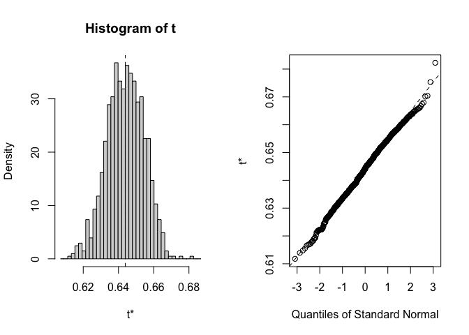

To do:

-   To get confidence intervals could do some bootstrapping - samples
    some of the 30 years and calculates it and so on - Julin could help
    with the code

    -   Need a function that does the climate distance calculation


# Climate Distance at the WL2 Garden

## Relevant Libraries and Functions


``` r
library(raster)
```

```
## Loading required package: sp
```

``` r
library(tidyverse)
```

```
## ── Attaching core tidyverse packages ──────────────────────── tidyverse 2.0.0 ──
## ✔ dplyr     1.1.4     ✔ readr     2.1.5
## ✔ forcats   1.0.0     ✔ stringr   1.5.1
## ✔ ggplot2   3.5.1     ✔ tibble    3.2.1
## ✔ lubridate 1.9.3     ✔ tidyr     1.3.1
## ✔ purrr     1.0.2
```

```
## ── Conflicts ────────────────────────────────────────── tidyverse_conflicts() ──
## ✖ tidyr::extract() masks raster::extract()
## ✖ dplyr::filter()  masks stats::filter()
## ✖ dplyr::lag()     masks stats::lag()
## ✖ dplyr::select()  masks raster::select()
## ℹ Use the conflicted package (<http://conflicted.r-lib.org/>) to force all conflicts to become errors
```

``` r
library(conflicted)
conflicts_prefer(dplyr::select())
```

```
## [conflicted] Will prefer dplyr::select over any other package.
```

``` r
conflicts_prefer(dplyr::filter)
```

```
## [conflicted] Will prefer dplyr::filter over any other package.
```

``` r
library(ggrepel)
library(cowplot)
library(gridExtra)
library(naniar) #replaces values with NA
library(QBMS) #for function calc_biovars to calculate bioclim variables

sem <- function(x, na.rm=FALSE) {
  sd(x,na.rm=na.rm)/sqrt(length(na.omit(x)))
} #standard error function 

get_legend<-function(myggplot){
  tmp <- ggplot_gtable(ggplot_build(myggplot))
  leg <- which(sapply(tmp$grobs, function(x) x$name) == "guide-box")
  legend <- tmp$grobs[[leg]]
  return(legend)
} #legend function for grid_arrange

elev_three_palette <- c("#0043F0", "#C9727F", "#F5A540") #colors from Gremer et al 2019
elev_order <- c("High", "Mid", "Low")
```

## Home Climates

### Flint


``` r
pops_flint_avgs <- read_csv("../output/Climate/fullyear_FlintAvgs_wtr_year.csv")
```

```
## Rows: 46 Columns: 11
## ── Column specification ────────────────────────────────────────────────────────
## Delimiter: ","
## chr (3): parent.pop, elevation.group, TimePd
## dbl (8): elev_m, Lat, Long, cwd, pck, ppt, tmn, tmx
## 
## ℹ Use `spec()` to retrieve the full column specification for this data.
## ℹ Specify the column types or set `show_col_types = FALSE` to quiet this message.
```

``` r
head(pops_flint_avgs)
```

```
## # A tibble: 6 × 11
##   parent.pop elevation.group elev_m   Lat  Long   cwd    pck   ppt    tmn   tmx
##   <chr>      <chr>            <dbl> <dbl> <dbl> <dbl>  <dbl> <dbl>  <dbl> <dbl>
## 1 BH         Low               511.  37.4 -120.  75.9   0     48.6  8.91   23.6
## 2 CC         Low               313   39.6 -121.  59.9   0     84.5 10.0    23.3
## 3 CP2        High             2244.  38.7 -120.  62.9 218.   107.   1.16   13.4
## 4 CP3        High             2266.  38.7 -120.  46.2 236.   103.   0.512  12.6
## 5 DPR        Mid              1019.  39.2 -121.  27.5   7.63 121.   7.87   20.2
## 6 FR         Mid               787   40.0 -121.  75.5  14.1   84.9  5.69   20.1
## # ℹ 1 more variable: TimePd <chr>
```

``` r
unique(pops_flint_avgs$parent.pop) #only home pops
```

```
##  [1] "BH"    "CC"    "CP2"   "CP3"   "DPR"   "FR"    "IH"    "LV1"   "LV3"  
## [10] "LVTR1" "SC"    "SQ1"   "SQ2"   "SQ3"   "TM2"   "WL1"   "WL2"   "WR"   
## [19] "WV"    "YO11"  "YO4"   "YO7"   "YO8"
```

``` r
unique(pops_flint_avgs$TimePd) # recent and historical timeperiod 
```

```
## [1] "Recent"     "Historical"
```

``` r
pops_flint_recent_avgs <- pops_flint_avgs %>% filter(TimePd=="Recent")
head(pops_flint_recent_avgs)
```

```
## # A tibble: 6 × 11
##   parent.pop elevation.group elev_m   Lat  Long   cwd    pck   ppt    tmn   tmx
##   <chr>      <chr>            <dbl> <dbl> <dbl> <dbl>  <dbl> <dbl>  <dbl> <dbl>
## 1 BH         Low               511.  37.4 -120.  75.9   0     48.6  8.91   23.6
## 2 CC         Low               313   39.6 -121.  59.9   0     84.5 10.0    23.3
## 3 CP2        High             2244.  38.7 -120.  62.9 218.   107.   1.16   13.4
## 4 CP3        High             2266.  38.7 -120.  46.2 236.   103.   0.512  12.6
## 5 DPR        Mid              1019.  39.2 -121.  27.5   7.63 121.   7.87   20.2
## 6 FR         Mid               787   40.0 -121.  75.5  14.1   84.9  5.69   20.1
## # ℹ 1 more variable: TimePd <chr>
```

``` r
pops_flint_historic_avgs <-  pops_flint_avgs %>% filter(TimePd=="Historical")
head(pops_flint_historic_avgs)
```

```
## # A tibble: 6 × 11
##   parent.pop elevation.group elev_m   Lat  Long   cwd     pck   ppt    tmn   tmx
##   <chr>      <chr>            <dbl> <dbl> <dbl> <dbl>   <dbl> <dbl>  <dbl> <dbl>
## 1 BH         Low               511.  37.4 -120.  74.5 1.95e-2  48.4  7.73   22.9
## 2 CC         Low               313   39.6 -121.  59.6 7.93e-2  82.0  8.90   22.9
## 3 CP2        High             2244.  38.7 -120.  60.4 2.65e+2 110.  -0.303  12.5
## 4 CP3        High             2266.  38.7 -120.  43.8 2.82e+2 107.  -0.850  11.8
## 5 DPR        Mid              1019.  39.2 -121.  26.4 2.05e+1 121.   6.23   19.7
## 6 FR         Mid               787   40.0 -121.  74.0 1.92e+1  84.3  4.55   20.1
## # ℹ 1 more variable: TimePd <chr>
```

``` r
names(pops_flint_historic_avgs)
```

```
##  [1] "parent.pop"      "elevation.group" "elev_m"          "Lat"            
##  [5] "Long"            "cwd"             "pck"             "ppt"            
##  [9] "tmn"             "tmx"             "TimePd"
```

### BioClim


``` r
pops_bioclim_avgs <-  read_csv("../output/Climate/fullyear_BioClimAvgs_wtr_year.csv") 
```

```
## Rows: 46 Columns: 16
## ── Column specification ────────────────────────────────────────────────────────
## Delimiter: ","
## chr  (3): parent.pop, elevation.group, TimePd
## dbl (13): elev_m, Lat, Long, ann_tmean, mean_diurnal_range, temp_seasonality...
## 
## ℹ Use `spec()` to retrieve the full column specification for this data.
## ℹ Specify the column types or set `show_col_types = FALSE` to quiet this message.
```

``` r
head(pops_bioclim_avgs)
```

```
## # A tibble: 6 × 16
##   parent.pop elevation.group elev_m   Lat  Long ann_tmean mean_diurnal_range
##   <chr>      <chr>            <dbl> <dbl> <dbl>     <dbl>              <dbl>
## 1 BH         Low               511.  37.4 -120.     16.2                14.7
## 2 CC         Low               313   39.6 -121.     16.6                13.3
## 3 CP2        High             2244.  38.7 -120.      7.28               12.2
## 4 CP3        High             2266.  38.7 -120.      6.58               12.1
## 5 DPR        Mid              1019.  39.2 -121.     14.1                12.4
## 6 FR         Mid               787   40.0 -121.     12.9                14.4
## # ℹ 9 more variables: temp_seasonality <dbl>, temp_ann_range <dbl>,
## #   tmean_wettest_quarter <dbl>, tmean_driest_quarter <dbl>, ann_ppt <dbl>,
## #   ppt_seasonality <dbl>, ppt_warmest_quarter <dbl>,
## #   ppt_coldest_quarter <dbl>, TimePd <chr>
```

``` r
unique(pops_bioclim_avgs$parent.pop) #only home pops
```

```
##  [1] "BH"    "CC"    "CP2"   "CP3"   "DPR"   "FR"    "IH"    "LV1"   "LV3"  
## [10] "LVTR1" "SC"    "SQ1"   "SQ2"   "SQ3"   "TM2"   "WL1"   "WL2"   "WR"   
## [19] "WV"    "YO11"  "YO4"   "YO7"   "YO8"
```

``` r
unique(pops_bioclim_avgs$TimePd) # recent and historical timeperiod 
```

```
## [1] "Recent"     "Historical"
```

``` r
pops_bioclim_recent_avgs <- pops_bioclim_avgs %>%  filter(TimePd=="Recent")
head(pops_bioclim_recent_avgs)
```

```
## # A tibble: 6 × 16
##   parent.pop elevation.group elev_m   Lat  Long ann_tmean mean_diurnal_range
##   <chr>      <chr>            <dbl> <dbl> <dbl>     <dbl>              <dbl>
## 1 BH         Low               511.  37.4 -120.     16.2                14.7
## 2 CC         Low               313   39.6 -121.     16.6                13.3
## 3 CP2        High             2244.  38.7 -120.      7.28               12.2
## 4 CP3        High             2266.  38.7 -120.      6.58               12.1
## 5 DPR        Mid              1019.  39.2 -121.     14.1                12.4
## 6 FR         Mid               787   40.0 -121.     12.9                14.4
## # ℹ 9 more variables: temp_seasonality <dbl>, temp_ann_range <dbl>,
## #   tmean_wettest_quarter <dbl>, tmean_driest_quarter <dbl>, ann_ppt <dbl>,
## #   ppt_seasonality <dbl>, ppt_warmest_quarter <dbl>,
## #   ppt_coldest_quarter <dbl>, TimePd <chr>
```

``` r
pops_bioclim_historical_avgs <- pops_bioclim_avgs %>% filter(TimePd=="Historical")
head(pops_bioclim_historical_avgs)
```

```
## # A tibble: 6 × 16
##   parent.pop elevation.group elev_m   Lat  Long ann_tmean mean_diurnal_range
##   <chr>      <chr>            <dbl> <dbl> <dbl>     <dbl>              <dbl>
## 1 BH         Low               511.  37.4 -120.     15.3                15.2
## 2 CC         Low               313   39.6 -121.     15.9                14.0
## 3 CP2        High             2244.  38.7 -120.      6.11               12.8
## 4 CP3        High             2266.  38.7 -120.      5.46               12.6
## 5 DPR        Mid              1019.  39.2 -121.     13.0                13.5
## 6 FR         Mid               787   40.0 -121.     12.3                15.6
## # ℹ 9 more variables: temp_seasonality <dbl>, temp_ann_range <dbl>,
## #   tmean_wettest_quarter <dbl>, tmean_driest_quarter <dbl>, ann_ppt <dbl>,
## #   ppt_seasonality <dbl>, ppt_warmest_quarter <dbl>,
## #   ppt_coldest_quarter <dbl>, TimePd <chr>
```

``` r
names(pops_bioclim_historical_avgs)
```

```
##  [1] "parent.pop"            "elevation.group"       "elev_m"               
##  [4] "Lat"                   "Long"                  "ann_tmean"            
##  [7] "mean_diurnal_range"    "temp_seasonality"      "temp_ann_range"       
## [10] "tmean_wettest_quarter" "tmean_driest_quarter"  "ann_ppt"              
## [13] "ppt_seasonality"       "ppt_warmest_quarter"   "ppt_coldest_quarter"  
## [16] "TimePd"
```

## WL2 Climate Data Nov 2022 - Oct 2023 (Plants only grown July 2023-Oct 2023)

### From Flint (changed this from Magney MetStation)


``` r
WL2_climate <- read_csv("../output/Climate/flint_climate_UCDpops.csv") %>% 
  filter(parent.pop=="WL2_Garden") %>% 
  filter(year>=2022, year<2024) %>% 
  filter(if_else(year==2022, month=="nov" | month=="dec",
                 month!="nov" & month !="dec")) %>% 
  mutate(tavg = (tmn + tmx)/2, t_diurnal = (tmx-tmn))
```

```
## Rows: 38675 Columns: 14
## ── Column specification ────────────────────────────────────────────────────────
## Delimiter: ","
## chr  (3): parent.pop, elevation.group, month
## dbl (11): elev_m, Lat, Long, year, aet, cwd, pck, pet, ppt, tmn, tmx
## 
## ℹ Use `spec()` to retrieve the full column specification for this data.
## ℹ Specify the column types or set `show_col_types = FALSE` to quiet this message.
```

``` r
head(WL2_climate)
```

```
## # A tibble: 6 × 16
##   parent.pop elevation.group elev_m   Lat  Long  year month    aet   cwd    pck
##   <chr>      <chr>            <dbl> <dbl> <dbl> <dbl> <chr>  <dbl> <dbl>  <dbl>
## 1 WL2_Garden High              2020  38.8 -120.  2022 dec     4     20    610. 
## 2 WL2_Garden High              2020  38.8 -120.  2022 nov     2.48  29.1   40.4
## 3 WL2_Garden High              2020  38.8 -120.  2023 apr    41.5   46.4 1787. 
## 4 WL2_Garden High              2020  38.8 -120.  2023 aug   106.    43.8    0  
## 5 WL2_Garden High              2020  38.8 -120.  2023 feb     8.62  22.4 1422. 
## 6 WL2_Garden High              2020  38.8 -120.  2023 jan     7.23  16.4 1208. 
## # ℹ 6 more variables: pet <dbl>, ppt <dbl>, tmn <dbl>, tmx <dbl>, tavg <dbl>,
## #   t_diurnal <dbl>
```

``` r
summary(WL2_climate)
```

```
##   parent.pop        elevation.group        elev_m          Lat       
##  Length:12          Length:12          Min.   :2020   Min.   :38.83  
##  Class :character   Class :character   1st Qu.:2020   1st Qu.:38.83  
##  Mode  :character   Mode  :character   Median :2020   Median :38.83  
##                                        Mean   :2020   Mean   :38.83  
##                                        3rd Qu.:2020   3rd Qu.:38.83  
##                                        Max.   :2020   Max.   :38.83  
##       Long             year         month                aet        
##  Min.   :-120.3   Min.   :2022   Length:12          Min.   :  2.48  
##  1st Qu.:-120.3   1st Qu.:2023   Class :character   1st Qu.:  6.98  
##  Median :-120.3   Median :2023   Mode  :character   Median : 37.69  
##  Mean   :-120.3   Mean   :2023                      Mean   : 44.94  
##  3rd Qu.:-120.3   3rd Qu.:2023                      3rd Qu.: 78.27  
##  Max.   :-120.3   Max.   :2023                      Max.   :115.16  
##       cwd              pck              pet              ppt        
##  Min.   : 14.83   Min.   :   0.0   Min.   : 23.60   Min.   :  0.01  
##  1st Qu.: 21.79   1st Qu.:   0.0   1st Qu.: 31.45   1st Qu.: 36.49  
##  Median : 38.83   Median : 589.6   Median : 81.55   Median : 68.33  
##  Mean   : 41.58   Mean   : 742.9   Mean   : 86.52   Mean   :207.19  
##  3rd Qu.: 49.56   3rd Qu.:1323.9   3rd Qu.:134.12   3rd Qu.:319.23  
##  Max.   :100.37   Max.   :1986.3   Max.   :176.10   Max.   :641.41  
##       tmn              tmx              tavg           t_diurnal    
##  Min.   :-6.150   Min.   : 2.130   Min.   :-2.0100   Min.   : 8.25  
##  1st Qu.:-4.258   1st Qu.: 4.165   1st Qu.:-0.1288   1st Qu.: 9.42  
##  Median : 0.870   Median :11.870   Median : 6.3700   Median :10.30  
##  Mean   : 1.762   Mean   :12.081   Mean   : 6.9212   Mean   :10.32  
##  3rd Qu.: 6.145   3rd Qu.:17.520   3rd Qu.:11.8325   3rd Qu.:11.32  
##  Max.   :13.220   Max.   :25.950   Max.   :19.5850   Max.   :12.73
```

``` r
WL2_climate_flint <- WL2_climate %>% #get the means for the variables to compare to home sites 
  summarise(cwd_WL2=mean(cwd),ppt_WL2=mean(ppt), pck_WL2=mean(pck), tmn_WL2=mean(tmn), tmx_WL2=mean(tmx))
WL2_climate_flint
```

```
## # A tibble: 1 × 5
##   cwd_WL2 ppt_WL2 pck_WL2 tmn_WL2 tmx_WL2
##     <dbl>   <dbl>   <dbl>   <dbl>   <dbl>
## 1    41.6    207.    743.    1.76    12.1
```

## WL2 Climate Trends

``` r
WL2_climate$month <- factor(WL2_climate$month, levels = c("nov","dec","jan", "feb", "mar", "apr", "may", "jun", "jul", "aug", "sep", "oct"))

WL2_climate %>% 
  ggplot(aes(x=month,y=cwd)) +
  geom_point()
```

<!-- -->

``` r
WL2_climate %>% 
  ggplot(aes(x=month,y=pck)) +
  geom_point() 
```

<!-- -->

``` r
WL2_climate %>% 
  ggplot(aes(x=month,y=tmx)) +
  geom_point()
```

<!-- -->

``` r
WL2_climate %>% 
  ggplot(aes(x=month,y=tmn)) +
  geom_point()
```

<!-- -->

``` r
WL2_climate %>% 
  ggplot(aes(x=month,y=ppt)) +
  geom_point()
```

<!-- -->


### BioClim

#### Prep

``` r
wl2_bioclim_allyear_prep <- WL2_climate %>% 
  mutate(wtr_year="2023") %>% 
  rename(tmin=tmn, tmax=tmx, year_cal=year, year=wtr_year) %>% #rename columns to match what calc_biovars expects 
  arrange(parent.pop, year, month)
```

### Calculation

``` r
wl2_bioclim_all_year <- wl2_bioclim_allyear_prep %>% calc_biovars() 
```

#### SUBSET

``` r
wl2_bioclim_all_year_final <- wl2_bioclim_all_year %>% 
  select(ann_tmean_WL2=bio1, mean_diurnal_range_WL2=bio2, 
         temp_seasonality_WL2=bio4, temp_ann_range_WL2=bio7, tmean_wettest_quarter_WL2=bio8,
         tmean_driest_quarter_WL2=bio9, ann_ppt_WL2=bio12, ppt_seasonality_WL2=bio15,
         ppt_warmest_quarter_WL2=bio18, ppt_coldest_quarter_WL2=bio19) %>% 
  mutate_if(is.character, as.numeric)
wl2_bioclim_all_year_final
```

```
##   ann_tmean_WL2 mean_diurnal_range_WL2 temp_seasonality_WL2 temp_ann_range_WL2
## 1       6.92125               10.31917             758.8279               32.1
##   tmean_wettest_quarter_WL2 tmean_driest_quarter_WL2 ann_ppt_WL2
## 1                    -0.555                 16.93833     2486.31
##   ppt_seasonality_WL2 ppt_warmest_quarter_WL2 ppt_coldest_quarter_WL2
## 1            119.8368                   88.98                  1413.4
```


## Gower's Climate Distance

(1/P) \* SUM ((absolute value(Ai - Bi)) / range(i)) for each variable

-   P = number of environmental variables = 13 (without CWD)

-   Ai = 30 year avg of that variable for the home site

-   Bi = July 2023-Dec 2023 avg of that variable for the WL2 garden

-   Range(i) = maximum - minimum of that variable in the whole data set
    (across sites)

### Combine the flint and bioclim variables 


``` r
WL2_climate_all <- bind_cols(WL2_climate_flint, wl2_bioclim_all_year_final)
dim(WL2_climate_all)
```

```
## [1]  1 15
```

``` r
home_climates_all_recent <- left_join(pops_flint_recent_avgs, pops_bioclim_recent_avgs)
```

```
## Joining with `by = join_by(parent.pop, elevation.group, elev_m, Lat, Long,
## TimePd)`
```

``` r
home_climates_all_historic <- left_join(pops_flint_historic_avgs, pops_bioclim_historical_avgs)
```

```
## Joining with `by = join_by(parent.pop, elevation.group, elev_m, Lat, Long,
## TimePd)`
```

``` r
WL2_home_climate_recent <- bind_cols(WL2_climate_all, home_climates_all_recent)
summary(WL2_home_climate_recent)
```

```
##     cwd_WL2         ppt_WL2         pck_WL2         tmn_WL2     
##  Min.   :41.58   Min.   :207.2   Min.   :742.9   Min.   :1.762  
##  1st Qu.:41.58   1st Qu.:207.2   1st Qu.:742.9   1st Qu.:1.762  
##  Median :41.58   Median :207.2   Median :742.9   Median :1.762  
##  Mean   :41.58   Mean   :207.2   Mean   :742.9   Mean   :1.762  
##  3rd Qu.:41.58   3rd Qu.:207.2   3rd Qu.:742.9   3rd Qu.:1.762  
##  Max.   :41.58   Max.   :207.2   Max.   :742.9   Max.   :1.762  
##     tmx_WL2      ann_tmean_WL2   mean_diurnal_range_WL2 temp_seasonality_WL2
##  Min.   :12.08   Min.   :6.921   Min.   :10.32          Min.   :758.8       
##  1st Qu.:12.08   1st Qu.:6.921   1st Qu.:10.32          1st Qu.:758.8       
##  Median :12.08   Median :6.921   Median :10.32          Median :758.8       
##  Mean   :12.08   Mean   :6.921   Mean   :10.32          Mean   :758.8       
##  3rd Qu.:12.08   3rd Qu.:6.921   3rd Qu.:10.32          3rd Qu.:758.8       
##  Max.   :12.08   Max.   :6.921   Max.   :10.32          Max.   :758.8       
##  temp_ann_range_WL2 tmean_wettest_quarter_WL2 tmean_driest_quarter_WL2
##  Min.   :32.1       Min.   :-0.555            Min.   :16.94           
##  1st Qu.:32.1       1st Qu.:-0.555            1st Qu.:16.94           
##  Median :32.1       Median :-0.555            Median :16.94           
##  Mean   :32.1       Mean   :-0.555            Mean   :16.94           
##  3rd Qu.:32.1       3rd Qu.:-0.555            3rd Qu.:16.94           
##  Max.   :32.1       Max.   :-0.555            Max.   :16.94           
##   ann_ppt_WL2   ppt_seasonality_WL2 ppt_warmest_quarter_WL2
##  Min.   :2486   Min.   :119.8       Min.   :88.98          
##  1st Qu.:2486   1st Qu.:119.8       1st Qu.:88.98          
##  Median :2486   Median :119.8       Median :88.98          
##  Mean   :2486   Mean   :119.8       Mean   :88.98          
##  3rd Qu.:2486   3rd Qu.:119.8       3rd Qu.:88.98          
##  Max.   :2486   Max.   :119.8       Max.   :88.98          
##  ppt_coldest_quarter_WL2  parent.pop        elevation.group        elev_m      
##  Min.   :1413            Length:23          Length:23          Min.   : 313.0  
##  1st Qu.:1413            Class :character   Class :character   1st Qu.: 767.9  
##  Median :1413            Mode  :character   Mode  :character   Median :1934.5  
##  Mean   :1413                                                  Mean   :1649.7  
##  3rd Qu.:1413                                                  3rd Qu.:2363.4  
##  Max.   :1413                                                  Max.   :2872.3  
##       Lat             Long             cwd             pck        
##  Min.   :36.56   Min.   :-123.0   Min.   :27.52   Min.   :  0.00  
##  1st Qu.:37.81   1st Qu.:-121.3   1st Qu.:49.56   1st Qu.: 10.88  
##  Median :38.79   Median :-120.3   Median :55.93   Median : 65.23  
##  Mean   :38.74   Mean   :-120.4   Mean   :56.19   Mean   :136.78  
##  3rd Qu.:39.59   3rd Qu.:-119.7   3rd Qu.:61.77   3rd Qu.:226.07  
##  Max.   :40.74   Max.   :-118.8   Max.   :75.86   Max.   :454.27  
##       ppt              tmn                tmx           TimePd         
##  Min.   : 48.58   Min.   :-2.59814   Min.   :10.42   Length:23         
##  1st Qu.: 84.71   1st Qu.:-0.06981   1st Qu.:12.65   Class :character  
##  Median : 94.32   Median : 3.40014   Median :15.67   Mode  :character  
##  Mean   : 99.07   Mean   : 3.59801   Mean   :16.50                     
##  3rd Qu.:107.21   3rd Qu.: 7.48090   3rd Qu.:20.18                     
##  Max.   :151.28   Max.   :10.01417   Max.   :23.56                     
##    ann_tmean      mean_diurnal_range temp_seasonality temp_ann_range 
##  Min.   : 3.910   Min.   :11.89      Min.   :647.9    Min.   :30.62  
##  1st Qu.: 6.288   1st Qu.:12.25      1st Qu.:666.9    1st Qu.:31.57  
##  Median : 9.535   Median :12.72      Median :685.6    Median :31.82  
##  Mean   :10.048   Mean   :12.90      Mean   :681.8    Mean   :32.06  
##  3rd Qu.:13.560   3rd Qu.:13.34      3rd Qu.:694.0    3rd Qu.:32.17  
##  Max.   :16.646   Max.   :14.65      Max.   :720.1    Max.   :34.40  
##  tmean_wettest_quarter tmean_driest_quarter    ann_ppt     ppt_seasonality
##  Min.   :-1.4982       Min.   : 6.575       Min.   : 583   Min.   :109.3  
##  1st Qu.: 0.4829       1st Qu.: 9.059       1st Qu.:1017   1st Qu.:114.6  
##  Median : 3.4333       Median :12.232       Median :1132   Median :123.2  
##  Mean   : 4.0041       Mean   :12.906       Mean   :1189   Mean   :120.2  
##  3rd Qu.: 7.0698       3rd Qu.:16.764       3rd Qu.:1287   3rd Qu.:124.8  
##  Max.   :10.3360       Max.   :19.491       Max.   :1815   Max.   :128.9  
##  ppt_warmest_quarter ppt_coldest_quarter
##  Min.   : 47.65      Min.   :329.9      
##  1st Qu.: 91.04      1st Qu.:549.4      
##  Median :104.76      Median :623.2      
##  Mean   :111.22      Mean   :620.4      
##  3rd Qu.:125.64      3rd Qu.:654.9      
##  Max.   :187.23      Max.   :862.7
```

``` r
WL2_home_climate_historic <- bind_cols(WL2_climate_all, home_climates_all_historic)
summary(WL2_home_climate_historic)
```

```
##     cwd_WL2         ppt_WL2         pck_WL2         tmn_WL2     
##  Min.   :41.58   Min.   :207.2   Min.   :742.9   Min.   :1.762  
##  1st Qu.:41.58   1st Qu.:207.2   1st Qu.:742.9   1st Qu.:1.762  
##  Median :41.58   Median :207.2   Median :742.9   Median :1.762  
##  Mean   :41.58   Mean   :207.2   Mean   :742.9   Mean   :1.762  
##  3rd Qu.:41.58   3rd Qu.:207.2   3rd Qu.:742.9   3rd Qu.:1.762  
##  Max.   :41.58   Max.   :207.2   Max.   :742.9   Max.   :1.762  
##     tmx_WL2      ann_tmean_WL2   mean_diurnal_range_WL2 temp_seasonality_WL2
##  Min.   :12.08   Min.   :6.921   Min.   :10.32          Min.   :758.8       
##  1st Qu.:12.08   1st Qu.:6.921   1st Qu.:10.32          1st Qu.:758.8       
##  Median :12.08   Median :6.921   Median :10.32          Median :758.8       
##  Mean   :12.08   Mean   :6.921   Mean   :10.32          Mean   :758.8       
##  3rd Qu.:12.08   3rd Qu.:6.921   3rd Qu.:10.32          3rd Qu.:758.8       
##  Max.   :12.08   Max.   :6.921   Max.   :10.32          Max.   :758.8       
##  temp_ann_range_WL2 tmean_wettest_quarter_WL2 tmean_driest_quarter_WL2
##  Min.   :32.1       Min.   :-0.555            Min.   :16.94           
##  1st Qu.:32.1       1st Qu.:-0.555            1st Qu.:16.94           
##  Median :32.1       Median :-0.555            Median :16.94           
##  Mean   :32.1       Mean   :-0.555            Mean   :16.94           
##  3rd Qu.:32.1       3rd Qu.:-0.555            3rd Qu.:16.94           
##  Max.   :32.1       Max.   :-0.555            Max.   :16.94           
##   ann_ppt_WL2   ppt_seasonality_WL2 ppt_warmest_quarter_WL2
##  Min.   :2486   Min.   :119.8       Min.   :88.98          
##  1st Qu.:2486   1st Qu.:119.8       1st Qu.:88.98          
##  Median :2486   Median :119.8       Median :88.98          
##  Mean   :2486   Mean   :119.8       Mean   :88.98          
##  3rd Qu.:2486   3rd Qu.:119.8       3rd Qu.:88.98          
##  Max.   :2486   Max.   :119.8       Max.   :88.98          
##  ppt_coldest_quarter_WL2  parent.pop        elevation.group        elev_m      
##  Min.   :1413            Length:23          Length:23          Min.   : 313.0  
##  1st Qu.:1413            Class :character   Class :character   1st Qu.: 767.9  
##  Median :1413            Mode  :character   Mode  :character   Median :1934.5  
##  Mean   :1413                                                  Mean   :1649.7  
##  3rd Qu.:1413                                                  3rd Qu.:2363.4  
##  Max.   :1413                                                  Max.   :2872.3  
##       Lat             Long             cwd             pck          
##  Min.   :36.56   Min.   :-123.0   Min.   :26.45   Min.   :  0.0195  
##  1st Qu.:37.81   1st Qu.:-121.3   1st Qu.:47.93   1st Qu.: 19.8433  
##  Median :38.79   Median :-120.3   Median :52.68   Median : 86.8739  
##  Mean   :38.74   Mean   :-120.4   Mean   :53.87   Mean   :161.8520  
##  3rd Qu.:39.59   3rd Qu.:-119.7   3rd Qu.:60.03   3rd Qu.:266.8888  
##  Max.   :40.74   Max.   :-118.8   Max.   :74.51   Max.   :529.7280  
##       ppt              tmn              tmx            TimePd         
##  Min.   : 48.40   Min.   :-4.691   Min.   : 9.689   Length:23         
##  1st Qu.: 84.43   1st Qu.:-1.400   1st Qu.:11.713   Class :character  
##  Median : 95.04   Median : 2.023   Median :14.360   Mode  :character  
##  Mean   : 99.98   Mean   : 2.123   Mean   :15.760                     
##  3rd Qu.:108.49   3rd Qu.: 5.722   3rd Qu.:19.891                     
##  Max.   :155.03   Max.   : 8.900   Max.   :22.931                     
##    ann_tmean      mean_diurnal_range temp_seasonality temp_ann_range 
##  Min.   : 2.499   Min.   :12.19      Min.   :637.8    Min.   :30.54  
##  1st Qu.: 5.156   1st Qu.:12.73      1st Qu.:649.3    1st Qu.:31.53  
##  Median : 8.191   Median :13.78      Median :660.9    Median :32.26  
##  Mean   : 8.942   Mean   :13.64      Mean   :662.6    Mean   :32.45  
##  3rd Qu.:12.639   3rd Qu.:14.08      3rd Qu.:671.6    3rd Qu.:33.01  
##  Max.   :15.914   Max.   :15.56      Max.   :718.6    Max.   :35.12  
##  tmean_wettest_quarter tmean_driest_quarter    ann_ppt       ppt_seasonality
##  Min.   :-2.570        Min.   : 5.237       Min.   : 580.8   Min.   :102.5  
##  1st Qu.:-0.048        1st Qu.: 8.407       1st Qu.:1013.2   1st Qu.:105.4  
##  Median : 3.043        Median :11.450       Median :1140.4   Median :113.6  
##  Mean   : 3.429        Mean   :12.176       Mean   :1199.7   Mean   :111.6  
##  3rd Qu.: 6.479        3rd Qu.:16.116       3rd Qu.:1301.8   3rd Qu.:116.6  
##  Max.   : 9.818        Max.   :18.947       Max.   :1860.3   Max.   :119.6  
##  ppt_warmest_quarter ppt_coldest_quarter
##  Min.   : 64.71      Min.   :283.6      
##  1st Qu.:103.95      1st Qu.:508.3      
##  Median :119.45      Median :559.9      
##  Mean   :132.47      Mean   :570.4      
##  3rd Qu.:151.90      3rd Qu.:608.0      
##  Max.   :228.91      Max.   :796.6
```

### Figure out the range for each variable 


``` r
WL2_range_prep <- WL2_climate_all %>% 
  mutate(parent.pop="WL2_Garden") %>% 
  rename_with(~str_remove(., "_WL2"), everything())
```


#### Recent

``` r
range_merge_recent <- bind_rows(home_climates_all_recent, WL2_range_prep)
names(range_merge_recent)
```

```
##  [1] "parent.pop"            "elevation.group"       "elev_m"               
##  [4] "Lat"                   "Long"                  "cwd"                  
##  [7] "pck"                   "ppt"                   "tmn"                  
## [10] "tmx"                   "TimePd"                "ann_tmean"            
## [13] "mean_diurnal_range"    "temp_seasonality"      "temp_ann_range"       
## [16] "tmean_wettest_quarter" "tmean_driest_quarter"  "ann_ppt"              
## [19] "ppt_seasonality"       "ppt_warmest_quarter"   "ppt_coldest_quarter"
```

``` r
summary(range_merge_recent)
```

```
##   parent.pop        elevation.group        elev_m            Lat       
##  Length:24          Length:24          Min.   : 313.0   Min.   :36.56  
##  Class :character   Class :character   1st Qu.: 767.9   1st Qu.:37.81  
##  Mode  :character   Mode  :character   Median :1934.5   Median :38.79  
##                                        Mean   :1649.7   Mean   :38.74  
##                                        3rd Qu.:2363.4   3rd Qu.:39.59  
##                                        Max.   :2872.3   Max.   :40.74  
##                                        NA's   :1        NA's   :1      
##       Long             cwd             pck              ppt        
##  Min.   :-123.0   Min.   :27.52   Min.   :  0.00   Min.   : 48.58  
##  1st Qu.:-121.3   1st Qu.:48.53   1st Qu.: 12.51   1st Qu.: 84.83  
##  Median :-120.3   Median :55.84   Median : 98.50   Median : 96.24  
##  Mean   :-120.4   Mean   :55.58   Mean   :162.03   Mean   :103.57  
##  3rd Qu.:-119.7   3rd Qu.:61.20   3rd Qu.:234.70   3rd Qu.:110.85  
##  Max.   :-118.8   Max.   :75.86   Max.   :742.87   Max.   :207.19  
##  NA's   :1                                                         
##       tmn               tmx           TimePd            ann_tmean     
##  Min.   :-2.5981   Min.   :10.42   Length:24          Min.   : 3.910  
##  1st Qu.: 0.2213   1st Qu.:12.53   Class :character   1st Qu.: 6.431  
##  Median : 3.0031   Median :15.10   Mode  :character   Median : 9.046  
##  Mean   : 3.5215   Mean   :16.31                      Mean   : 9.917  
##  3rd Qu.: 7.2879   3rd Qu.:20.15                      3rd Qu.:13.314  
##  Max.   :10.0142   Max.   :23.56                      Max.   :16.646  
##                                                                       
##  mean_diurnal_range temp_seasonality temp_ann_range  tmean_wettest_quarter
##  Min.   :10.32      Min.   :647.9    Min.   :30.62   Min.   :-1.49822     
##  1st Qu.:12.21      1st Qu.:666.9    1st Qu.:31.58   1st Qu.:-0.01054     
##  Median :12.67      Median :686.2    Median :31.83   Median : 3.16244     
##  Mean   :12.79      Mean   :685.0    Mean   :32.06   Mean   : 3.81412     
##  3rd Qu.:13.32      3rd Qu.:696.3    3rd Qu.:32.13   3rd Qu.: 6.81633     
##  Max.   :14.65      Max.   :758.8    Max.   :34.40   Max.   :10.33600     
##                                                                           
##  tmean_driest_quarter    ann_ppt     ppt_seasonality ppt_warmest_quarter
##  Min.   : 6.575       Min.   : 583   Min.   :109.3   Min.   : 47.65     
##  1st Qu.: 9.321       1st Qu.:1018   1st Qu.:114.8   1st Qu.: 89.52     
##  Median :12.319       Median :1155   Median :122.8   Median :103.54     
##  Mean   :13.074       Mean   :1243   Mean   :120.2   Mean   :110.29     
##  3rd Qu.:17.014       3rd Qu.:1330   3rd Qu.:124.8   3rd Qu.:124.68     
##  Max.   :19.491       Max.   :2486   Max.   :128.9   Max.   :187.23     
##                                                                         
##  ppt_coldest_quarter
##  Min.   : 329.9     
##  1st Qu.: 551.4     
##  Median : 623.3     
##  Mean   : 653.5     
##  3rd Qu.: 686.2     
##  Max.   :1413.4     
## 
```

``` r
unique(range_merge_recent$parent.pop)
```

```
##  [1] "BH"         "CC"         "CP2"        "CP3"        "DPR"       
##  [6] "FR"         "IH"         "LV1"        "LV3"        "LVTR1"     
## [11] "SC"         "SQ1"        "SQ2"        "SQ3"        "TM2"       
## [16] "WL1"        "WL2"        "WR"         "WV"         "YO11"      
## [21] "YO4"        "YO7"        "YO8"        "WL2_Garden"
```

``` r
WL2_home_climate_ranges_recent <- range_merge_recent %>% 
  summarise(cwd_range=max(cwd)-min(cwd),
            pck_range=max(pck)-min(pck),
            ppt_range=max(ppt)-min(ppt), 
            tmn_range=max(tmn)-min(tmn), 
            tmx_range=max(tmx)-min(tmx), 
            ann_tmean_range=max(ann_tmean)-min(ann_tmean),
            mean_diurnal_range_range=max(mean_diurnal_range)-min(mean_diurnal_range),
            temp_seasonality_range=max(temp_seasonality)-min(temp_seasonality),
            temp_ann_range_range=max(temp_ann_range)-min(temp_ann_range),
            tmean_wettest_quarter_range=max(tmean_wettest_quarter)-min(tmean_wettest_quarter),
            tmean_driest_quarter_range=max(tmean_driest_quarter)-min(tmean_driest_quarter),
            ann_ppt_range=max(ann_ppt)-min(ann_ppt), 
            ppt_seasonality_range=max(ppt_seasonality)-min(ppt_seasonality),
            ppt_warmest_quarter_range=max(ppt_warmest_quarter)-min(ppt_warmest_quarter), 
            ppt_coldest_quarter_range=max(ppt_coldest_quarter)-min(ppt_coldest_quarter))
WL2_home_climate_ranges_recent
```

```
## # A tibble: 1 × 15
##   cwd_range pck_range ppt_range tmn_range tmx_range ann_tmean_range
##       <dbl>     <dbl>     <dbl>     <dbl>     <dbl>           <dbl>
## 1      48.3      743.      159.      12.6      13.1            12.7
## # ℹ 9 more variables: mean_diurnal_range_range <dbl>,
## #   temp_seasonality_range <dbl>, temp_ann_range_range <dbl>,
## #   tmean_wettest_quarter_range <dbl>, tmean_driest_quarter_range <dbl>,
## #   ann_ppt_range <dbl>, ppt_seasonality_range <dbl>,
## #   ppt_warmest_quarter_range <dbl>, ppt_coldest_quarter_range <dbl>
```

``` r
WL2_home_climate_with_ranges_recent <- bind_cols(WL2_home_climate_recent, WL2_home_climate_ranges_recent)
names(WL2_home_climate_with_ranges_recent)
```

```
##  [1] "cwd_WL2"                     "ppt_WL2"                    
##  [3] "pck_WL2"                     "tmn_WL2"                    
##  [5] "tmx_WL2"                     "ann_tmean_WL2"              
##  [7] "mean_diurnal_range_WL2"      "temp_seasonality_WL2"       
##  [9] "temp_ann_range_WL2"          "tmean_wettest_quarter_WL2"  
## [11] "tmean_driest_quarter_WL2"    "ann_ppt_WL2"                
## [13] "ppt_seasonality_WL2"         "ppt_warmest_quarter_WL2"    
## [15] "ppt_coldest_quarter_WL2"     "parent.pop"                 
## [17] "elevation.group"             "elev_m"                     
## [19] "Lat"                         "Long"                       
## [21] "cwd"                         "pck"                        
## [23] "ppt"                         "tmn"                        
## [25] "tmx"                         "TimePd"                     
## [27] "ann_tmean"                   "mean_diurnal_range"         
## [29] "temp_seasonality"            "temp_ann_range"             
## [31] "tmean_wettest_quarter"       "tmean_driest_quarter"       
## [33] "ann_ppt"                     "ppt_seasonality"            
## [35] "ppt_warmest_quarter"         "ppt_coldest_quarter"        
## [37] "cwd_range"                   "pck_range"                  
## [39] "ppt_range"                   "tmn_range"                  
## [41] "tmx_range"                   "ann_tmean_range"            
## [43] "mean_diurnal_range_range"    "temp_seasonality_range"     
## [45] "temp_ann_range_range"        "tmean_wettest_quarter_range"
## [47] "tmean_driest_quarter_range"  "ann_ppt_range"              
## [49] "ppt_seasonality_range"       "ppt_warmest_quarter_range"  
## [51] "ppt_coldest_quarter_range"
```

#### Historic

``` r
range_merge_historic <- bind_rows(home_climates_all_historic, WL2_range_prep)
names(range_merge_historic)
```

```
##  [1] "parent.pop"            "elevation.group"       "elev_m"               
##  [4] "Lat"                   "Long"                  "cwd"                  
##  [7] "pck"                   "ppt"                   "tmn"                  
## [10] "tmx"                   "TimePd"                "ann_tmean"            
## [13] "mean_diurnal_range"    "temp_seasonality"      "temp_ann_range"       
## [16] "tmean_wettest_quarter" "tmean_driest_quarter"  "ann_ppt"              
## [19] "ppt_seasonality"       "ppt_warmest_quarter"   "ppt_coldest_quarter"
```

``` r
summary(range_merge_historic)
```

```
##   parent.pop        elevation.group        elev_m            Lat       
##  Length:24          Length:24          Min.   : 313.0   Min.   :36.56  
##  Class :character   Class :character   1st Qu.: 767.9   1st Qu.:37.81  
##  Mode  :character   Mode  :character   Median :1934.5   Median :38.79  
##                                        Mean   :1649.7   Mean   :38.74  
##                                        3rd Qu.:2363.4   3rd Qu.:39.59  
##                                        Max.   :2872.3   Max.   :40.74  
##                                        NA's   :1        NA's   :1      
##       Long             cwd             pck                ppt        
##  Min.   :-123.0   Min.   :26.45   Min.   :  0.0195   Min.   : 48.40  
##  1st Qu.:-121.3   1st Qu.:45.90   1st Qu.: 20.1582   1st Qu.: 84.50  
##  Median :-120.3   Median :52.32   Median :119.0409   Median : 97.88  
##  Mean   :-120.4   Mean   :53.36   Mean   :186.0610   Mean   :104.44  
##  3rd Qu.:-119.7   3rd Qu.:59.84   3rd Qu.:271.9429   3rd Qu.:113.01  
##  Max.   :-118.8   Max.   :74.51   Max.   :742.8683   Max.   :207.19  
##  NA's   :1                                                           
##       tmn              tmx            TimePd            ann_tmean     
##  Min.   :-4.691   Min.   : 9.689   Length:24          Min.   : 2.499  
##  1st Qu.:-1.125   1st Qu.:11.740   Class :character   1st Qu.: 5.308  
##  Median : 1.892   Median :14.057   Mode  :character   Median : 7.815  
##  Mean   : 2.108   Mean   :15.607                      Mean   : 8.858  
##  3rd Qu.: 5.469   3rd Qu.:19.787                      3rd Qu.:12.481  
##  Max.   : 8.900   Max.   :22.931                      Max.   :15.914  
##                                                                       
##  mean_diurnal_range temp_seasonality temp_ann_range  tmean_wettest_quarter
##  Min.   :10.32      Min.   :637.8    Min.   :30.54   Min.   :-2.5696      
##  1st Qu.:12.63      1st Qu.:649.7    1st Qu.:31.56   1st Qu.:-0.3019      
##  Median :13.69      Median :661.4    Median :32.25   Median : 2.6994      
##  Mean   :13.50      Mean   :666.6    Mean   :32.44   Mean   : 3.2630      
##  3rd Qu.:14.06      3rd Qu.:671.6    3rd Qu.:32.99   3rd Qu.: 6.2546      
##  Max.   :15.56      Max.   :758.8    Max.   :35.12   Max.   : 9.8183      
##                                                                           
##  tmean_driest_quarter    ann_ppt       ppt_seasonality ppt_warmest_quarter
##  Min.   : 5.237       Min.   : 580.8   Min.   :102.5   Min.   : 64.71     
##  1st Qu.: 8.594       1st Qu.:1014.0   1st Qu.:105.6   1st Qu.: 99.10     
##  Median :11.453       Median :1174.5   Median :114.3   Median :118.65     
##  Mean   :12.374       Mean   :1253.3   Mean   :111.9   Mean   :130.66     
##  3rd Qu.:16.486       3rd Qu.:1356.1   3rd Qu.:116.7   3rd Qu.:150.11     
##  Max.   :18.947       Max.   :2486.3   Max.   :119.8   Max.   :228.91     
##                                                                           
##  ppt_coldest_quarter
##  Min.   : 283.6     
##  1st Qu.: 511.3     
##  Median : 574.2     
##  Mean   : 605.5     
##  3rd Qu.: 644.7     
##  Max.   :1413.4     
## 
```

``` r
WL2_home_climate_ranges_historic <- range_merge_historic %>% 
  summarise(cwd_range=max(cwd)-min(cwd),
            pck_range=max(pck)-min(pck),
            ppt_range=max(ppt)-min(ppt), 
            tmn_range=max(tmn)-min(tmn), 
            tmx_range=max(tmx)-min(tmx), 
            ann_tmean_range=max(ann_tmean)-min(ann_tmean),
            mean_diurnal_range_range=max(mean_diurnal_range)-min(mean_diurnal_range),
            temp_seasonality_range=max(temp_seasonality)-min(temp_seasonality),
            temp_ann_range_range=max(temp_ann_range)-min(temp_ann_range),
            tmean_wettest_quarter_range=max(tmean_wettest_quarter)-min(tmean_wettest_quarter),
            tmean_driest_quarter_range=max(tmean_driest_quarter)-min(tmean_driest_quarter),
            ann_ppt_range=max(ann_ppt)-min(ann_ppt), 
            ppt_seasonality_range=max(ppt_seasonality)-min(ppt_seasonality),
            ppt_warmest_quarter_range=max(ppt_warmest_quarter)-min(ppt_warmest_quarter), 
            ppt_coldest_quarter_range=max(ppt_coldest_quarter)-min(ppt_coldest_quarter))
WL2_home_climate_ranges_historic
```

```
## # A tibble: 1 × 15
##   cwd_range pck_range ppt_range tmn_range tmx_range ann_tmean_range
##       <dbl>     <dbl>     <dbl>     <dbl>     <dbl>           <dbl>
## 1      48.1      743.      159.      13.6      13.2            13.4
## # ℹ 9 more variables: mean_diurnal_range_range <dbl>,
## #   temp_seasonality_range <dbl>, temp_ann_range_range <dbl>,
## #   tmean_wettest_quarter_range <dbl>, tmean_driest_quarter_range <dbl>,
## #   ann_ppt_range <dbl>, ppt_seasonality_range <dbl>,
## #   ppt_warmest_quarter_range <dbl>, ppt_coldest_quarter_range <dbl>
```

``` r
WL2_home_climate_with_ranges_historic <- bind_cols(WL2_home_climate_historic, WL2_home_climate_ranges_historic)
names(WL2_home_climate_with_ranges_historic)
```

```
##  [1] "cwd_WL2"                     "ppt_WL2"                    
##  [3] "pck_WL2"                     "tmn_WL2"                    
##  [5] "tmx_WL2"                     "ann_tmean_WL2"              
##  [7] "mean_diurnal_range_WL2"      "temp_seasonality_WL2"       
##  [9] "temp_ann_range_WL2"          "tmean_wettest_quarter_WL2"  
## [11] "tmean_driest_quarter_WL2"    "ann_ppt_WL2"                
## [13] "ppt_seasonality_WL2"         "ppt_warmest_quarter_WL2"    
## [15] "ppt_coldest_quarter_WL2"     "parent.pop"                 
## [17] "elevation.group"             "elev_m"                     
## [19] "Lat"                         "Long"                       
## [21] "cwd"                         "pck"                        
## [23] "ppt"                         "tmn"                        
## [25] "tmx"                         "TimePd"                     
## [27] "ann_tmean"                   "mean_diurnal_range"         
## [29] "temp_seasonality"            "temp_ann_range"             
## [31] "tmean_wettest_quarter"       "tmean_driest_quarter"       
## [33] "ann_ppt"                     "ppt_seasonality"            
## [35] "ppt_warmest_quarter"         "ppt_coldest_quarter"        
## [37] "cwd_range"                   "pck_range"                  
## [39] "ppt_range"                   "tmn_range"                  
## [41] "tmx_range"                   "ann_tmean_range"            
## [43] "mean_diurnal_range_range"    "temp_seasonality_range"     
## [45] "temp_ann_range_range"        "tmean_wettest_quarter_range"
## [47] "tmean_driest_quarter_range"  "ann_ppt_range"              
## [49] "ppt_seasonality_range"       "ppt_warmest_quarter_range"  
## [51] "ppt_coldest_quarter_range"
```

### Recent Gowers Calc

``` r
gowers_calc_each_var_recent <- WL2_home_climate_with_ranges_recent %>% 
  mutate(cwd_gowers=abs(cwd_WL2-cwd) / cwd_range,
         pck_gowers=abs(pck_WL2-pck) / pck_range,
         ppt_gowers=abs(ppt_WL2 - ppt) / ppt_range,
         tmn_gowers=abs(tmn_WL2 - tmn) / tmn_range,
         tmx_gowers=abs(tmx_WL2 - tmx) / tmx_range,
         ann_tmean_gowers=abs(ann_tmean_WL2 - ann_tmean) / ann_tmean_range,
         mean_diurnal_range_gowers=abs(mean_diurnal_range_WL2 - mean_diurnal_range) / mean_diurnal_range_range,
         temp_seasonality_gowers=abs(temp_seasonality_WL2 - temp_seasonality) / temp_seasonality_range,
         temp_ann_range_gowers=abs(temp_ann_range_WL2 - temp_ann_range) / temp_ann_range_range,
         tmean_wettest_quarter_gowers=abs(tmean_wettest_quarter_WL2 - tmean_wettest_quarter) / tmean_wettest_quarter_range,
         tmean_driest_quarter_gowers=abs(tmean_driest_quarter_WL2 - tmean_driest_quarter) / tmean_driest_quarter_range,
         ann_ppt_gowers=abs(ann_ppt_WL2 - ann_ppt) / ann_ppt_range,
         ppt_seasonality_gowers=abs(ppt_seasonality_WL2 - ppt_seasonality) / ppt_seasonality_range,
         ppt_warmest_quarter_gowers=abs(ppt_warmest_quarter_WL2 - ppt_warmest_quarter) / ppt_warmest_quarter_range,
         ppt_coldest_quarter_gowers=abs(ppt_coldest_quarter_WL2 - ppt_coldest_quarter) / ppt_coldest_quarter_range) %>% 
  dplyr::select(parent.pop, elevation.group, elev_m, ends_with("_gowers"))

WL2_home_climate_with_ranges_recent
```

```
## # A tibble: 23 × 51
##    cwd_WL2 ppt_WL2 pck_WL2 tmn_WL2 tmx_WL2 ann_tmean_WL2 mean_diurnal_range_WL2
##      <dbl>   <dbl>   <dbl>   <dbl>   <dbl>         <dbl>                  <dbl>
##  1    41.6    207.    743.    1.76    12.1          6.92                   10.3
##  2    41.6    207.    743.    1.76    12.1          6.92                   10.3
##  3    41.6    207.    743.    1.76    12.1          6.92                   10.3
##  4    41.6    207.    743.    1.76    12.1          6.92                   10.3
##  5    41.6    207.    743.    1.76    12.1          6.92                   10.3
##  6    41.6    207.    743.    1.76    12.1          6.92                   10.3
##  7    41.6    207.    743.    1.76    12.1          6.92                   10.3
##  8    41.6    207.    743.    1.76    12.1          6.92                   10.3
##  9    41.6    207.    743.    1.76    12.1          6.92                   10.3
## 10    41.6    207.    743.    1.76    12.1          6.92                   10.3
## # ℹ 13 more rows
## # ℹ 44 more variables: temp_seasonality_WL2 <dbl>, temp_ann_range_WL2 <dbl>,
## #   tmean_wettest_quarter_WL2 <dbl>, tmean_driest_quarter_WL2 <dbl>,
## #   ann_ppt_WL2 <dbl>, ppt_seasonality_WL2 <dbl>,
## #   ppt_warmest_quarter_WL2 <dbl>, ppt_coldest_quarter_WL2 <dbl>,
## #   parent.pop <chr>, elevation.group <chr>, elev_m <dbl>, Lat <dbl>,
## #   Long <dbl>, cwd <dbl>, pck <dbl>, ppt <dbl>, tmn <dbl>, tmx <dbl>, …
```

``` r
gowers_calc_each_var_recent
```

```
## # A tibble: 23 × 18
##    parent.pop elevation.group elev_m cwd_gowers pck_gowers ppt_gowers tmn_gowers
##    <chr>      <chr>            <dbl>      <dbl>      <dbl>      <dbl>      <dbl>
##  1 BH         Low               511.     0.709       1          1         0.567 
##  2 CC         Low               313      0.379       1          0.774     0.654 
##  3 CP2        High             2244.     0.441       0.707      0.630     0.0473
##  4 CP3        High             2266.     0.0960      0.682      0.658     0.0991
##  5 DPR        Mid              1019.     0.291       0.990      0.541     0.484 
##  6 FR         Mid               787      0.702       0.981      0.771     0.312 
##  7 IH         Low               454.     0.160       1.00       0.743     0.547 
##  8 LV1        High             2593.     0.171       0.406      0.383     0.249 
##  9 LV3        High             2354.     0.0144      0.413      0.400     0.250 
## 10 LVTR1      High             2741.     0.218       0.388      0.352     0.266 
## # ℹ 13 more rows
## # ℹ 11 more variables: tmx_gowers <dbl>, ann_tmean_gowers <dbl>,
## #   mean_diurnal_range_gowers <dbl>, temp_seasonality_gowers <dbl>,
## #   temp_ann_range_gowers <dbl>, tmean_wettest_quarter_gowers <dbl>,
## #   tmean_driest_quarter_gowers <dbl>, ann_ppt_gowers <dbl>,
## #   ppt_seasonality_gowers <dbl>, ppt_warmest_quarter_gowers <dbl>,
## #   ppt_coldest_quarter_gowers <dbl>
```

``` r
gowers_calc_per_pop_recent <- gowers_calc_each_var_recent %>% 
  mutate(Recent_Gowers_Dist=(1/15)*(cwd_gowers + pck_gowers + ppt_gowers + tmn_gowers + tmx_gowers +
                                ann_tmean_gowers + mean_diurnal_range_gowers +
                                temp_seasonality_gowers +temp_ann_range_gowers +
                                tmean_wettest_quarter_gowers +
                                tmean_driest_quarter_gowers +ann_ppt_gowers +
                                ppt_seasonality_gowers + ppt_warmest_quarter_gowers +
                                ppt_coldest_quarter_gowers)) %>% 
  dplyr::select(parent.pop, elevation.group, elev_m, Recent_Gowers_Dist)

gowers_calc_per_pop_recent
```

```
## # A tibble: 23 × 4
##    parent.pop elevation.group elev_m Recent_Gowers_Dist
##    <chr>      <chr>            <dbl>              <dbl>
##  1 BH         Low               511.              0.714
##  2 CC         Low               313               0.606
##  3 CP2        High             2244.              0.387
##  4 CP3        High             2266.              0.364
##  5 DPR        Mid              1019.              0.468
##  6 FR         Mid               787               0.559
##  7 IH         Low               454.              0.551
##  8 LV1        High             2593.              0.378
##  9 LV3        High             2354.              0.373
## 10 LVTR1      High             2741.              0.385
## # ℹ 13 more rows
```

### Historic Gowers Calc

``` r
gowers_calc_each_var_historic <- WL2_home_climate_with_ranges_historic %>% 
  mutate(cwd_gowers=abs(cwd_WL2-cwd) / cwd_range,
         pck_gowers=abs(pck_WL2-pck) / pck_range,
         ppt_gowers=abs(ppt_WL2 - ppt) / ppt_range,
         tmn_gowers=abs(tmn_WL2 - tmn) / tmn_range,
         tmx_gowers=abs(tmx_WL2 - tmx) / tmx_range,
         ann_tmean_gowers=abs(ann_tmean_WL2 - ann_tmean) / ann_tmean_range,
         mean_diurnal_range_gowers=abs(mean_diurnal_range_WL2 - mean_diurnal_range) / mean_diurnal_range_range,
         temp_seasonality_gowers=abs(temp_seasonality_WL2 - temp_seasonality) / temp_seasonality_range,
         temp_ann_range_gowers=abs(temp_ann_range_WL2 - temp_ann_range) / temp_ann_range_range,
         tmean_wettest_quarter_gowers=abs(tmean_wettest_quarter_WL2 - tmean_wettest_quarter) / tmean_wettest_quarter_range,
         tmean_driest_quarter_gowers=abs(tmean_driest_quarter_WL2 - tmean_driest_quarter) / tmean_driest_quarter_range,
         ann_ppt_gowers=abs(ann_ppt_WL2 - ann_ppt) / ann_ppt_range,
         ppt_seasonality_gowers=abs(ppt_seasonality_WL2 - ppt_seasonality) / ppt_seasonality_range,
         ppt_warmest_quarter_gowers=abs(ppt_warmest_quarter_WL2 - ppt_warmest_quarter) / ppt_warmest_quarter_range,
         ppt_coldest_quarter_gowers=abs(ppt_coldest_quarter_WL2 - ppt_coldest_quarter) / ppt_coldest_quarter_range) %>% 
  dplyr::select(parent.pop, elevation.group, elev_m, ends_with("_gowers"))

  
gowers_calc_per_pop_historic <- gowers_calc_each_var_historic %>% 
  mutate(Historic_Gowers_Dist=(1/15)*(cwd_gowers + pck_gowers + ppt_gowers + tmn_gowers + tmx_gowers +
                                ann_tmean_gowers + mean_diurnal_range_gowers +
                                temp_seasonality_gowers +temp_ann_range_gowers +
                                tmean_wettest_quarter_gowers +
                                tmean_driest_quarter_gowers +ann_ppt_gowers +
                                ppt_seasonality_gowers + ppt_warmest_quarter_gowers +
                                ppt_coldest_quarter_gowers)) %>% 
  dplyr::select(parent.pop, elevation.group, elev_m, Historic_Gowers_Dist)

gowers_calc_per_pop_historic
```

```
## # A tibble: 23 × 4
##    parent.pop elevation.group elev_m Historic_Gowers_Dist
##    <chr>      <chr>            <dbl>                <dbl>
##  1 BH         Low               511.                0.647
##  2 CC         Low               313                 0.569
##  3 CP2        High             2244.                0.437
##  4 CP3        High             2266.                0.423
##  5 DPR        Mid              1019.                0.457
##  6 FR         Mid               787                 0.554
##  7 IH         Low               454.                0.530
##  8 LV1        High             2593.                0.463
##  9 LV3        High             2354.                0.466
## 10 LVTR1      High             2741.                0.465
## # ℹ 13 more rows
```

### Merge recent and historic

``` r
gowers_all_time <- full_join(gowers_calc_per_pop_recent, gowers_calc_per_pop_historic)
```

```
## Joining with `by = join_by(parent.pop, elevation.group, elev_m)`
```

``` r
gowers_all_time
```

```
## # A tibble: 23 × 5
##    parent.pop elevation.group elev_m Recent_Gowers_Dist Historic_Gowers_Dist
##    <chr>      <chr>            <dbl>              <dbl>                <dbl>
##  1 BH         Low               511.              0.714                0.647
##  2 CC         Low               313               0.606                0.569
##  3 CP2        High             2244.              0.387                0.437
##  4 CP3        High             2266.              0.364                0.423
##  5 DPR        Mid              1019.              0.468                0.457
##  6 FR         Mid               787               0.559                0.554
##  7 IH         Low               454.              0.551                0.530
##  8 LV1        High             2593.              0.378                0.463
##  9 LV3        High             2354.              0.373                0.466
## 10 LVTR1      High             2741.              0.385                0.465
## # ℹ 13 more rows
```

``` r
names(gowers_all_time)
```

```
## [1] "parent.pop"           "elevation.group"      "elev_m"              
## [4] "Recent_Gowers_Dist"   "Historic_Gowers_Dist"
```

``` r
write_csv(gowers_all_time, "../output/Climate/full_year_GowersEnvtalDist_WL2_wtr_year.csv")
```

Figures

``` r
gowers_rec_fig <- gowers_all_time %>% 
  ggplot(aes(x=fct_reorder(parent.pop, Recent_Gowers_Dist), y=Recent_Gowers_Dist, group=parent.pop, fill=elev_m)) +
  geom_col(width = 0.7,position = position_dodge(0.75)) +
  scale_y_continuous(expand = c(0, 0)) +
  scale_fill_gradient(low = "#F5A540", high = "#0043F0") +
   labs(fill="Elevation (m)",x="Population", title="Recent Climate", y="Gowers Envtal Distance \n from WL2") +
  theme_classic() +
  theme(text=element_text(size=25), axis.text.x = element_text(angle = 45,  hjust = 1))
ggsave("../output/Climate/full_year_Gowers_Recent_fromWL2_wtr_year.png", width = 12, height = 6, units = "in")

gowers_hist_fig <- gowers_all_time %>% 
  ggplot(aes(x=fct_reorder(parent.pop, Historic_Gowers_Dist), y=Historic_Gowers_Dist, group=parent.pop, fill=elev_m)) +
  geom_col(width = 0.7,position = position_dodge(0.75)) +
  scale_y_continuous(expand = c(0, 0)) +
  scale_fill_gradient(low = "#F5A540", high = "#0043F0") +
  labs(fill="Elevation (m)",x="Population", title="Historic Climate", y="Gowers Envtal Distance \n from WL2") +
  theme_classic() +
  theme(text=element_text(size=25), axis.text.x = element_text(angle = 45,  hjust = 1))
ggsave("../output/Climate/full_year_Gowers_Historic_fromWL2_wtr_year.png", width = 12, height = 6, units = "in")

#should combine these into one figure and save that instead
legend <- get_legend(gowers_rec_fig)
gowers_hist_fig <- gowers_hist_fig + theme(legend.position="none")
gowers_rec_fig <- gowers_rec_fig + theme(legend.position="none")
grid.arrange(gowers_hist_fig, gowers_rec_fig, legend, ncol=3, widths=c(3.12, 3.12, 1.09))
```

<!-- -->

``` r
 #2000 x 850
#RESULTS DEF CHANGED AFTER ADDING IN PCK and full year for garden 
```


## Flint Climate Distance

### Gowers

#### Recent

``` r
gowers_calc_each_var_recent_flint <- WL2_home_climate_with_ranges_recent %>% 
  mutate(cwd_gowers=abs(cwd_WL2-cwd) / cwd_range,
         pck_gowers=abs(pck_WL2-pck) / pck_range,
         ppt_gowers=abs(ppt_WL2 - ppt) / ppt_range,
         tmn_gowers=abs(tmn_WL2 - tmn) / tmn_range,
         tmx_gowers=abs(tmx_WL2 - tmx) / tmx_range) %>% 
  dplyr::select(parent.pop, elevation.group, elev_m, ends_with("_gowers"))
  
gowers_calc_per_pop_recent_flint <- gowers_calc_each_var_recent_flint %>% 
  mutate(Recent_Gowers_Dist=(1/5)*(cwd_gowers + pck_gowers + ppt_gowers + tmn_gowers + tmx_gowers)) %>% 
  dplyr::select(parent.pop, elevation.group, elev_m, Recent_Gowers_Dist)

gowers_calc_per_pop_recent_flint
```

```
## # A tibble: 23 × 4
##    parent.pop elevation.group elev_m Recent_Gowers_Dist
##    <chr>      <chr>            <dbl>              <dbl>
##  1 BH         Low               511.              0.830
##  2 CC         Low               313               0.732
##  3 CP2        High             2244.              0.385
##  4 CP3        High             2266.              0.316
##  5 DPR        Mid              1019.              0.585
##  6 FR         Mid               787               0.675
##  7 IH         Low               454.              0.644
##  8 LV1        High             2593.              0.255
##  9 LV3        High             2354.              0.228
## 10 LVTR1      High             2741.              0.259
## # ℹ 13 more rows
```

#### Historic

``` r
gowers_calc_each_var_historic_flint <- WL2_home_climate_with_ranges_historic %>% 
  mutate(cwd_gowers=abs(cwd_WL2-cwd) / cwd_range,
         pck_gowers=abs(pck_WL2-pck) / pck_range,
         ppt_gowers=abs(ppt_WL2 - ppt) / ppt_range,
         tmn_gowers=abs(tmn_WL2 - tmn) / tmn_range,
         tmx_gowers=abs(tmx_WL2 - tmx) / tmx_range) %>% 
  dplyr::select(parent.pop, elevation.group, elev_m, ends_with("_gowers"))

  
gowers_calc_per_pop_historic_flint <- gowers_calc_each_var_historic_flint %>% 
  mutate(Historic_Gowers_Dist=(1/5)*(cwd_gowers + pck_gowers + ppt_gowers + tmn_gowers + tmx_gowers)) %>% 
  dplyr::select(parent.pop, elevation.group, elev_m, Historic_Gowers_Dist)

gowers_calc_per_pop_historic_flint
```

```
## # A tibble: 23 × 4
##    parent.pop elevation.group elev_m Historic_Gowers_Dist
##    <chr>      <chr>            <dbl>                <dbl>
##  1 BH         Low               511.                0.789
##  2 CC         Low               313                 0.702
##  3 CP2        High             2244.                0.366
##  4 CP3        High             2266.                0.303
##  5 DPR        Mid              1019.                0.547
##  6 FR         Mid               787                 0.647
##  7 IH         Low               454.                0.620
##  8 LV1        High             2593.                0.260
##  9 LV3        High             2354.                0.259
## 10 LVTR1      High             2741.                0.263
## # ℹ 13 more rows
```

#### Merge recent and historic

``` r
gowers_all_time_flint <- full_join(gowers_calc_per_pop_recent_flint, gowers_calc_per_pop_historic_flint)
```

```
## Joining with `by = join_by(parent.pop, elevation.group, elev_m)`
```

``` r
gowers_all_time_flint
```

```
## # A tibble: 23 × 5
##    parent.pop elevation.group elev_m Recent_Gowers_Dist Historic_Gowers_Dist
##    <chr>      <chr>            <dbl>              <dbl>                <dbl>
##  1 BH         Low               511.              0.830                0.789
##  2 CC         Low               313               0.732                0.702
##  3 CP2        High             2244.              0.385                0.366
##  4 CP3        High             2266.              0.316                0.303
##  5 DPR        Mid              1019.              0.585                0.547
##  6 FR         Mid               787               0.675                0.647
##  7 IH         Low               454.              0.644                0.620
##  8 LV1        High             2593.              0.255                0.260
##  9 LV3        High             2354.              0.228                0.259
## 10 LVTR1      High             2741.              0.259                0.263
## # ℹ 13 more rows
```

``` r
names(gowers_all_time_flint)
```

```
## [1] "parent.pop"           "elevation.group"      "elev_m"              
## [4] "Recent_Gowers_Dist"   "Historic_Gowers_Dist"
```

``` r
write_csv(gowers_all_time_flint, "../output/Climate/full_year_GowersEnvtalDist_WL2Flint_wtr_year.csv")
```

Figures

``` r
gowers_rec_fig_flint <- gowers_all_time_flint %>% 
  ggplot(aes(x=fct_reorder(parent.pop, Recent_Gowers_Dist), y=Recent_Gowers_Dist, group=parent.pop, fill=elev_m)) +
  geom_col(width = 0.7,position = position_dodge(0.75)) +
  scale_y_continuous(expand = c(0, 0)) +
  scale_fill_gradient(low = "#F5A540", high = "#0043F0") +
  labs(y="Gowers Envtal Distance \n from WL2", fill="Elevation (m)", x="Population", title="Recent Climate") +
  theme_classic() +
  theme(text=element_text(size=25), axis.text.x = element_text(angle = 45,  hjust = 1))
#ggsave("../output/Climate/full_year_Gowers_RecentFlint_fromWL2_wtr_year.png", width = 12, height = 6, units = "in")

gowers_hist_fig_flint <- gowers_all_time_flint %>% 
  ggplot(aes(x=fct_reorder(parent.pop, Historic_Gowers_Dist), y=Historic_Gowers_Dist, group=parent.pop, fill=elev_m)) +
  geom_col(width = 0.7,position = position_dodge(0.75)) +
  scale_y_continuous(expand = c(0, 0)) +
  scale_fill_gradient(low = "#F5A540", high = "#0043F0") +
  labs(fill="Elevation (m)",x="Population", title="Historic Climate", y="Gowers Envtal Distance \n from WL2") +
  theme_classic() +
  theme(text=element_text(size=25), axis.text.x = element_text(angle = 45,  hjust = 1))
#ggsave("../output/Climate/full_year_Gowers_HistoricFlint_fromWL2_wtr_year.png", width = 12, height = 6, units = "in")

#should combine these into one figure and save that instead
legend <- get_legend(gowers_rec_fig_flint)
gowers_hist_fig_flint <- gowers_hist_fig_flint + theme(legend.position="none")
gowers_rec_fig_flint <- gowers_rec_fig_flint + theme(legend.position="none")
grid.arrange(gowers_hist_fig_flint, gowers_rec_fig_flint, legend, ncol=3, widths=c(3.12, 3.12, 1.09))
```

<!-- -->

``` r
 #2000 x 850
```

### Subtraction


``` r
recent_flint_dist_prep <- bind_cols(WL2_climate_flint, pops_flint_recent_avgs)
names(recent_flint_dist_prep)
```

```
##  [1] "cwd_WL2"         "ppt_WL2"         "pck_WL2"         "tmn_WL2"        
##  [5] "tmx_WL2"         "parent.pop"      "elevation.group" "elev_m"         
##  [9] "Lat"             "Long"            "cwd"             "pck"            
## [13] "ppt"             "tmn"             "tmx"             "TimePd"
```

``` r
recent_flint_dist <- recent_flint_dist_prep %>% 
  mutate(ppt_dist=ppt_WL2 - ppt,
         cwd_dist=cwd_WL2 - cwd,
         pck_dist=pck_WL2 - pck,
         tmn_dist=tmn_WL2 - tmn,
         tmx_dist=tmx_WL2 - tmx) %>% 
 dplyr::select(parent.pop, elevation.group, elev_m, ends_with("_dist"))

historic_flint_dist_prep <- bind_cols(WL2_climate_flint, pops_flint_historic_avgs)
names(historic_flint_dist_prep)
```

```
##  [1] "cwd_WL2"         "ppt_WL2"         "pck_WL2"         "tmn_WL2"        
##  [5] "tmx_WL2"         "parent.pop"      "elevation.group" "elev_m"         
##  [9] "Lat"             "Long"            "cwd"             "pck"            
## [13] "ppt"             "tmn"             "tmx"             "TimePd"
```

``` r
historic_flint_dist <- historic_flint_dist_prep %>% 
  mutate(ppt_dist=ppt_WL2 - ppt,
         cwd_dist=cwd_WL2 - cwd,
         pck_dist=pck_WL2 - pck,
         tmn_dist=tmn_WL2 - tmn,
         tmx_dist=tmx_WL2 - tmx) %>% 
 dplyr::select(parent.pop, elevation.group, elev_m, ends_with("_dist"))
```

Figures Recent (subtraction distance)


``` r
recent_flint_dist %>% 
  ggplot(aes(x=fct_reorder(parent.pop, cwd_dist), y=cwd_dist, group=parent.pop, fill=elev_m)) +
  geom_col(width = 0.7,position = position_dodge(0.75)) +
  scale_y_continuous(expand = c(0, 0)) +
  scale_fill_gradient(low = "#F5A540", high = "#0043F0") +
  labs(fill="Elevation (m)",x="Population") +
  theme_classic() +
  theme(text=element_text(size=25), axis.text.x = element_text(angle = 45,  hjust = 1))
```

<!-- -->

``` r
ggsave("../output/Climate/all-year_MeanCWD_DistfromWL2_RecentClim_wtr_year.png", width = 12, height = 6, units = "in")

recent_flint_dist %>% 
  ggplot(aes(x=fct_reorder(parent.pop, pck_dist), y=pck_dist, group=parent.pop, fill=elev_m)) +
  geom_col(width = 0.7,position = position_dodge(0.75)) +
  scale_y_continuous(expand = c(0, 0)) +
  scale_fill_gradient(low = "#F5A540", high = "#0043F0") +
  labs(fill="Elevation (m)",x="Population") +
  theme_classic() +
  theme(text=element_text(size=25), axis.text.x = element_text(angle = 45,  hjust = 1))
```

<!-- -->

``` r
ggsave("../output/Climate/all-year_MeanPCK_DistfromWL2_RecentClim_wtr_year.png", width = 12, height = 6, units = "in")

recent_flint_dist %>% 
  ggplot(aes(x=fct_reorder(parent.pop, ppt_dist), y=ppt_dist, group=parent.pop, fill=elev_m)) +
  geom_col(width = 0.7,position = position_dodge(0.75)) +
  scale_y_continuous(expand = c(0, 0)) +
  scale_fill_gradient(low = "#F5A540", high = "#0043F0") +
  labs(fill="Elevation (m)",x="Population") +
  theme_classic() +
  theme(text=element_text(size=25), axis.text.x = element_text(angle = 45,  hjust = 1))
```

<!-- -->

``` r
ggsave("../output/Climate/all-year_MeanPPT_DistfromWL2_RecentClim_wtr_year.png", width = 12, height = 6, units = "in")

recent_flint_dist %>% 
  ggplot(aes(x=fct_reorder(parent.pop, tmn_dist), y=tmn_dist, group=parent.pop, fill=elev_m)) +
  geom_col(width = 0.7,position = position_dodge(0.75)) +
  scale_y_continuous(expand = c(0, 0)) +
  scale_fill_gradient(low = "#F5A540", high = "#0043F0") +
  labs(fill="Elevation (m)",x="Population") +
  theme_classic() +
  theme(text=element_text(size=25), axis.text.x = element_text(angle = 45,  hjust = 1))
```

<!-- -->

``` r
ggsave("../output/Climate/all-year_MeanTMN_DistfromWL2_RecentClim_wtr_year.png", width = 12, height = 6, units = "in")

recent_flint_dist %>% 
  ggplot(aes(x=fct_reorder(parent.pop, tmx_dist), y=tmx_dist, group=parent.pop, fill=elev_m)) +
  geom_col(width = 0.7,position = position_dodge(0.75)) +
  scale_y_continuous(expand = c(0, 0)) +
  scale_fill_gradient(low = "#F5A540", high = "#0043F0") +
  labs(fill="Elevation (m)",x="Population") +
  theme_classic() +
  theme(text=element_text(size=25), axis.text.x = element_text(angle = 45,  hjust = 1))
```

<!-- -->

``` r
ggsave("../output/Climate/all-year_MeanTMX_DistfromWL2_RecentClim_wtr_year.png", width = 12, height = 6, units = "in")
```

Figures Historical (subtraction distance)


``` r
historic_flint_dist %>% 
  ggplot(aes(x=fct_reorder(parent.pop, cwd_dist), y=cwd_dist, group=parent.pop, fill=elev_m)) +
  geom_col(width = 0.7,position = position_dodge(0.75)) +
  scale_y_continuous(expand = c(0, 0)) +
  scale_fill_gradient(low = "#F5A540", high = "#0043F0") +
  labs(fill="Elevation (m)",x="Population") +
  theme_classic() +
  theme(text=element_text(size=25), axis.text.x = element_text(angle = 45,  hjust = 1))
```

<!-- -->

``` r
ggsave("../output/Climate/all-year_MeanCWD_DistfromWL2_HistoricalClim_wtr_year.png", width = 12, height = 6, units = "in")

historic_flint_dist %>% 
  ggplot(aes(x=fct_reorder(parent.pop, pck_dist), y=pck_dist, group=parent.pop, fill=elev_m)) +
  geom_col(width = 0.7,position = position_dodge(0.75)) +
  scale_y_continuous(expand = c(0, 0)) +
  scale_fill_gradient(low = "#F5A540", high = "#0043F0") +
  labs(fill="Elevation (m)",x="Population") +
  theme_classic() +
  theme(text=element_text(size=25), axis.text.x = element_text(angle = 45,  hjust = 1))
```

<!-- -->

``` r
ggsave("../output/Climate/all-year_MeanPCK_DistfromWL2_HistoricalClim_wtr_year.png", width = 12, height = 6, units = "in")

historic_flint_dist %>% 
  ggplot(aes(x=fct_reorder(parent.pop, ppt_dist), y=ppt_dist, group=parent.pop, fill=elev_m)) +
  geom_col(width = 0.7,position = position_dodge(0.75)) +
  scale_y_continuous(expand = c(0, 0)) +
  scale_fill_gradient(low = "#F5A540", high = "#0043F0") +
  labs(fill="Elevation (m)",x="Population") +
  theme_classic() +
  theme(text=element_text(size=25), axis.text.x = element_text(angle = 45,  hjust = 1))
```

<!-- -->

``` r
ggsave("../output/Climate/all-year_MeanPPT_DistfromWL2_HistoricalClim_wtr_year.png", width = 12, height = 6, units = "in")

historic_flint_dist %>% 
  ggplot(aes(x=fct_reorder(parent.pop, tmn_dist), y=tmn_dist, group=parent.pop, fill=elev_m)) +
  geom_col(width = 0.7,position = position_dodge(0.75)) +
  scale_y_continuous(expand = c(0, 0)) +
  scale_fill_gradient(low = "#F5A540", high = "#0043F0") +
  labs(fill="Elevation (m)",x="Population") +
  theme_classic() +
  theme(text=element_text(size=25), axis.text.x = element_text(angle = 45,  hjust = 1))
```

<!-- -->

``` r
ggsave("../output/Climate/all-year_MeanTMN_DistfromWL2_HistoricalClim_wtr_year.png", width = 12, height = 6, units = "in")

historic_flint_dist %>% 
  ggplot(aes(x=fct_reorder(parent.pop, tmx_dist), y=tmx_dist, group=parent.pop, fill=elev_m)) +
  geom_col(width = 0.7,position = position_dodge(0.75)) +
  scale_y_continuous(expand = c(0, 0)) +
  scale_fill_gradient(low = "#F5A540", high = "#0043F0") +
  labs(fill="Elevation (m)",x="Population") +
  theme_classic() +
  theme(text=element_text(size=25), axis.text.x = element_text(angle = 45,  hjust = 1))
```

<!-- -->

``` r
ggsave("../output/Climate/all-year_MeanTMX_DistfromWL2_HistoricalClim_wtr_year.png", width = 12, height = 6, units = "in")
```

## Bioclim Climate Distance

### Gowers

#### Recent

``` r
gowers_calc_each_var_recent_bioclim <- WL2_home_climate_with_ranges_recent %>% 
  mutate(ann_tmean_gowers=abs(ann_tmean_WL2 - ann_tmean) / ann_tmean_range,
         mean_diurnal_range_gowers=abs(mean_diurnal_range_WL2 - mean_diurnal_range) / mean_diurnal_range_range,
         temp_seasonality_gowers=abs(temp_seasonality_WL2 - temp_seasonality) / temp_seasonality_range,
         temp_ann_range_gowers=abs(temp_ann_range_WL2 - temp_ann_range) / temp_ann_range_range,
         tmean_wettest_quarter_gowers=abs(tmean_wettest_quarter_WL2 - tmean_wettest_quarter) / tmean_wettest_quarter_range,
         tmean_driest_quarter_gowers=abs(tmean_driest_quarter_WL2 - tmean_driest_quarter) / tmean_driest_quarter_range,
         ann_ppt_gowers=abs(ann_ppt_WL2 - ann_ppt) / ann_ppt_range,
         ppt_seasonality_gowers=abs(ppt_seasonality_WL2 - ppt_seasonality) / ppt_seasonality_range,
         ppt_warmest_quarter_gowers=abs(ppt_warmest_quarter_WL2 - ppt_warmest_quarter) / ppt_warmest_quarter_range,
         ppt_coldest_quarter_gowers=abs(ppt_coldest_quarter_WL2 - ppt_coldest_quarter) / ppt_coldest_quarter_range) %>% 
  dplyr::select(parent.pop, elevation.group, elev_m, ends_with("_gowers"))
  
gowers_calc_per_pop_recent_bioclim <- gowers_calc_each_var_recent_bioclim %>% 
  mutate(Recent_Gowers_Dist=(1/10)*(ann_tmean_gowers + mean_diurnal_range_gowers +
                                temp_seasonality_gowers +temp_ann_range_gowers +
                                tmean_wettest_quarter_gowers +
                                tmean_driest_quarter_gowers +ann_ppt_gowers +
                                ppt_seasonality_gowers + ppt_warmest_quarter_gowers +
                                ppt_coldest_quarter_gowers)) %>% 
  dplyr::select(parent.pop, elevation.group, elev_m, Recent_Gowers_Dist)

gowers_calc_per_pop_recent_bioclim
```

```
## # A tibble: 23 × 4
##    parent.pop elevation.group elev_m Recent_Gowers_Dist
##    <chr>      <chr>            <dbl>              <dbl>
##  1 BH         Low               511.              0.656
##  2 CC         Low               313               0.543
##  3 CP2        High             2244.              0.387
##  4 CP3        High             2266.              0.388
##  5 DPR        Mid              1019.              0.409
##  6 FR         Mid               787               0.501
##  7 IH         Low               454.              0.505
##  8 LV1        High             2593.              0.439
##  9 LV3        High             2354.              0.446
## 10 LVTR1      High             2741.              0.448
## # ℹ 13 more rows
```

#### Historic

``` r
gowers_calc_each_var_historic_bioclim <- WL2_home_climate_with_ranges_historic %>% 
  mutate(ann_tmean_gowers=abs(ann_tmean_WL2 - ann_tmean) / ann_tmean_range,
         mean_diurnal_range_gowers=abs(mean_diurnal_range_WL2 - mean_diurnal_range) / mean_diurnal_range_range,
         temp_seasonality_gowers=abs(temp_seasonality_WL2 - temp_seasonality) / temp_seasonality_range,
         temp_ann_range_gowers=abs(temp_ann_range_WL2 - temp_ann_range) / temp_ann_range_range,
         tmean_wettest_quarter_gowers=abs(tmean_wettest_quarter_WL2 - tmean_wettest_quarter) / tmean_wettest_quarter_range,
         tmean_driest_quarter_gowers=abs(tmean_driest_quarter_WL2 - tmean_driest_quarter) / tmean_driest_quarter_range,
         ann_ppt_gowers=abs(ann_ppt_WL2 - ann_ppt) / ann_ppt_range,
         ppt_seasonality_gowers=abs(ppt_seasonality_WL2 - ppt_seasonality) / ppt_seasonality_range,
         ppt_warmest_quarter_gowers=abs(ppt_warmest_quarter_WL2 - ppt_warmest_quarter) / ppt_warmest_quarter_range,
         ppt_coldest_quarter_gowers=abs(ppt_coldest_quarter_WL2 - ppt_coldest_quarter) / ppt_coldest_quarter_range) %>% 
  dplyr::select(parent.pop, elevation.group, elev_m, ends_with("_gowers"))

  
gowers_calc_per_pop_historic_bioclim <- gowers_calc_each_var_historic_bioclim %>% 
  mutate(Historic_Gowers_Dist=(1/10)*(ann_tmean_gowers + mean_diurnal_range_gowers +
                                temp_seasonality_gowers +temp_ann_range_gowers +
                                tmean_wettest_quarter_gowers +
                                tmean_driest_quarter_gowers +ann_ppt_gowers +
                                ppt_seasonality_gowers + ppt_warmest_quarter_gowers +
                                ppt_coldest_quarter_gowers)) %>% 
  dplyr::select(parent.pop, elevation.group, elev_m, Historic_Gowers_Dist)

gowers_calc_per_pop_historic_bioclim
```

```
## # A tibble: 23 × 4
##    parent.pop elevation.group elev_m Historic_Gowers_Dist
##    <chr>      <chr>            <dbl>                <dbl>
##  1 BH         Low               511.                0.577
##  2 CC         Low               313                 0.503
##  3 CP2        High             2244.                0.472
##  4 CP3        High             2266.                0.483
##  5 DPR        Mid              1019.                0.413
##  6 FR         Mid               787                 0.507
##  7 IH         Low               454.                0.485
##  8 LV1        High             2593.                0.564
##  9 LV3        High             2354.                0.569
## 10 LVTR1      High             2741.                0.566
## # ℹ 13 more rows
```

#### Merge recent and historic

``` r
gowers_all_time_bioclim <- full_join(gowers_calc_per_pop_recent_bioclim, gowers_calc_per_pop_historic_bioclim)
```

```
## Joining with `by = join_by(parent.pop, elevation.group, elev_m)`
```

``` r
gowers_all_time_bioclim
```

```
## # A tibble: 23 × 5
##    parent.pop elevation.group elev_m Recent_Gowers_Dist Historic_Gowers_Dist
##    <chr>      <chr>            <dbl>              <dbl>                <dbl>
##  1 BH         Low               511.              0.656                0.577
##  2 CC         Low               313               0.543                0.503
##  3 CP2        High             2244.              0.387                0.472
##  4 CP3        High             2266.              0.388                0.483
##  5 DPR        Mid              1019.              0.409                0.413
##  6 FR         Mid               787               0.501                0.507
##  7 IH         Low               454.              0.505                0.485
##  8 LV1        High             2593.              0.439                0.564
##  9 LV3        High             2354.              0.446                0.569
## 10 LVTR1      High             2741.              0.448                0.566
## # ℹ 13 more rows
```

``` r
names(gowers_all_time_bioclim)
```

```
## [1] "parent.pop"           "elevation.group"      "elev_m"              
## [4] "Recent_Gowers_Dist"   "Historic_Gowers_Dist"
```

``` r
write_csv(gowers_all_time_bioclim, "../output/Climate/full_year_GowersEnvtalDist_WL2bioclim_wtr_year.csv")
```

Figures

``` r
gowers_rec_fig_bioclim <- gowers_all_time_bioclim %>% 
  ggplot(aes(x=fct_reorder(parent.pop, Recent_Gowers_Dist), y=Recent_Gowers_Dist, group=parent.pop, fill=elev_m)) +
  geom_col(width = 0.7,position = position_dodge(0.75)) +
  scale_y_continuous(expand = c(0, 0)) +
  scale_fill_gradient(low = "#F5A540", high = "#0043F0") +
  labs(y="Gowers Envtal Distance \n from WL2", fill="Elevation (m)", x="Population", title="Recent Climate") +
  theme_classic() +
  theme(text=element_text(size=25), axis.text.x = element_text(angle = 45,  hjust = 1))
#ggsave("../output/Climate/full_year_Gowers_Recentbioclim_fromWL2_wtr_year.png", width = 12, height = 6, units = "in")

gowers_hist_fig_bioclim <- gowers_all_time_bioclim %>% 
  ggplot(aes(x=fct_reorder(parent.pop, Historic_Gowers_Dist), y=Historic_Gowers_Dist, group=parent.pop, fill=elev_m)) +
  geom_col(width = 0.7,position = position_dodge(0.75)) +
  scale_y_continuous(expand = c(0, 0)) +
  scale_fill_gradient(low = "#F5A540", high = "#0043F0") +
  labs(fill="Elevation (m)",x="Population", title="Historic Climate", y="Gowers Envtal Distance \n from WL2") +
  theme_classic() +
  theme(text=element_text(size=25), axis.text.x = element_text(angle = 45,  hjust = 1))
#ggsave("../output/Climate/full_year_Gowers_Historicbioclim_fromWL2_wtr_year.png", width = 12, height = 6, units = "in")

#should combine these into one figure and save that instead
legend <- get_legend(gowers_rec_fig_bioclim)
gowers_hist_fig_bioclim <- gowers_hist_fig_bioclim + theme(legend.position="none")
gowers_rec_fig_bioclim <- gowers_rec_fig_bioclim + theme(legend.position="none")
grid.arrange(gowers_hist_fig_bioclim, gowers_rec_fig_bioclim, legend, ncol=3, widths=c(3.12, 3.12, 1.09))
```

<!-- -->

``` r
 #2000 x 850
```

### Subtraction


``` r
#Recent
names(pops_bioclim_recent_avgs)
```

```
##  [1] "parent.pop"            "elevation.group"       "elev_m"               
##  [4] "Lat"                   "Long"                  "ann_tmean"            
##  [7] "mean_diurnal_range"    "temp_seasonality"      "temp_ann_range"       
## [10] "tmean_wettest_quarter" "tmean_driest_quarter"  "ann_ppt"              
## [13] "ppt_seasonality"       "ppt_warmest_quarter"   "ppt_coldest_quarter"  
## [16] "TimePd"
```

``` r
recent_bioclim_dist_prep <- bind_cols(wl2_bioclim_all_year_final, pops_bioclim_recent_avgs)
recent_bioclim_dist <- recent_bioclim_dist_prep %>% 
  mutate(ann_tmean_dist=ann_tmean_WL2 - ann_tmean,
         mean_diurnal_range_dist=mean_diurnal_range_WL2 - mean_diurnal_range,
         temp_seasonality_dist=temp_seasonality_WL2 - temp_seasonality,
         temp_ann_range_dist=temp_ann_range_WL2 - temp_ann_range,
         tmean_wettest_quarter_dist=tmean_wettest_quarter_WL2 - tmean_wettest_quarter,
         tmean_driest_quarter_dist=tmean_driest_quarter_WL2 - tmean_driest_quarter,
         ann_ppt_dist=ann_ppt_WL2 - ann_ppt,
         ppt_seasonality_dist=ppt_seasonality_WL2 - ppt_seasonality, 
         ppt_warmest_quarter_dist=ppt_warmest_quarter_WL2 - ppt_warmest_quarter,
         ppt_coldest_quarter_dist=ppt_coldest_quarter_WL2 - ppt_coldest_quarter) %>% 
 dplyr::select(parent.pop, elevation.group, elev_m, ends_with("_dist"))
recent_bioclim_dist
```

```
##    parent.pop elevation.group    elev_m ann_tmean_dist mean_diurnal_range_dist
## 1          BH             Low  511.4294     -9.3131111               -4.333333
## 2          CC             Low  313.0000     -9.7247361               -2.944472
## 3         CP2            High 2244.1329     -0.3630556               -1.920000
## 4         CP3            High 2266.3822      0.3462222               -1.806222
## 5         DPR             Mid 1018.5919     -7.1314028               -2.052361
## 6          FR             Mid  787.0000     -5.9816806               -4.104028
## 7          IH             Low  454.1298     -8.5100556               -3.230111
## 8         LV1            High 2593.4166      1.9999306               -2.288083
## 9         LV3            High 2353.5507      1.9939861               -2.309306
## 10      LVTR1            High 2741.3898      2.1510694               -2.398861
## 11         SC             Low  421.5178     -8.8104167               -3.606111
## 12        SQ1             Mid 1921.0366     -2.8149167               -1.716444
## 13        SQ2             Mid 1934.4512     -2.6137500               -1.950556
## 14        SQ3            High 2373.1707     -0.4783889               -2.035833
## 15        TM2             Low  379.1527     -9.3726389               -2.712167
## 16        WL1             Mid 1613.8372     -3.8918194               -2.458417
## 17        WL2            High 2020.1158     -1.6352917               -1.624806
## 18         WR             Mid 1158.0000     -6.1468194               -1.627139
## 19         WV             Mid  748.8571     -5.3123194               -3.906750
## 20       YO11            High 2872.2950      3.0110278               -2.697556
## 21        YO4            High 2157.5739     -1.6302361               -1.571583
## 22        YO7            High 2469.9787      0.9207917               -2.985639
## 23        YO8            High 2590.9784      1.3999861               -3.063750
##    temp_seasonality_dist temp_ann_range_dist tmean_wettest_quarter_dist
## 1               60.12698          -2.0040000                -10.1081111
## 2               91.94236           0.1646667                -10.8910000
## 3               71.24699           0.5780000                 -2.1239444
## 4               67.72248           0.5523333                 -1.4004444
## 5               67.09243           0.5806667                 -8.1318333
## 6               47.24314          -2.3043333                 -6.7739444
## 7               92.70024          -0.2370000                 -9.9497778
## 8               90.18034           0.4240000                  0.3278889
## 9               91.93763           0.4423333                  0.2443889
## 10              93.58073           0.2493333                  0.3952778
## 11             110.93393          -0.1400000                -10.2697222
## 12              62.52196           0.5030000                 -4.1563889
## 13              62.54707           0.2413333                 -3.9883333
## 14              72.07275           0.2823333                 -2.0042778
## 15              87.03036           0.3396667                -10.5082222
## 16              77.62394           0.3550000                 -5.6761111
## 17              73.25949           1.0186667                 -3.4465556
## 18              61.41065           0.9270000                 -7.1178333
## 19              38.67997          -2.2293333                 -6.3482222
## 20              68.30997          -0.4120000                  0.9432222
## 21              90.47103           1.4803333                 -3.0478889
## 22              98.36814           0.1410000                 -0.6753889
## 23              94.83636           0.0040000                 -0.1516667
##    tmean_driest_quarter_dist ann_ppt_dist ppt_seasonality_dist
## 1                 -1.9028889    1903.3553            -9.110449
## 2                 -2.5522222    1472.4147            -6.947168
## 3                  6.6615556    1198.2757             5.864108
## 4                  7.3550556    1253.0557             7.199701
## 5                 -0.3026667    1029.8414            -3.577777
## 6                  1.1562778    1466.9467            -5.870672
## 7                 -1.3938333    1413.3157            -4.899665
## 8                  9.1186667     729.3860            10.098917
## 9                  9.1310000     761.3737            10.577557
## 10                 9.3248889     670.8974            10.220148
## 11                -1.8075000    1696.0340            -4.240618
## 12                 4.5318333    1544.7580            -4.161716
## 13                 4.7060556    1523.8407            -5.101853
## 14                 6.8301667    1445.5947            -5.269255
## 15                -2.4013889    1354.4123            -7.083399
## 16                 3.2717222    1207.5217             2.999783
## 17                 5.4460000    1201.3210             5.603420
## 18                 0.6517222     872.5587            -3.315078
## 19                 1.5997222    1467.0617             1.637537
## 20                10.3630556    1668.6830             4.871678
## 21                 5.6748889    1355.3087            -3.613782
## 22                 8.4037222    1298.5924            -2.681381
## 23                 8.8713333    1308.5564            -2.574380
##    ppt_warmest_quarter_dist ppt_coldest_quarter_dist
## 1                41.3263333                1083.4730
## 2                10.5470000                 856.4733
## 3               -39.6546667                 758.2577
## 4               -33.7856667                 789.9770
## 5               -38.5873333                 633.9707
## 6                -5.2143333                 860.0967
## 7                -3.4016667                 838.0123
## 8               -86.1206667                 581.2507
## 9               -83.7860000                 601.9627
## 10              -98.2480000                 557.9347
## 11               20.5286667                 990.6537
## 12              -15.7820000                 907.3167
## 13               -8.8176667                 894.6653
## 14              -13.3300000                 851.5623
## 15               -0.7236667                 790.1980
## 16              -31.2276667                 758.7450
## 17              -34.7400000                 763.0367
## 18              -53.5583333                 550.7474
## 19                2.2883333                 867.8673
## 20                3.1750000                 974.4007
## 21               -7.6973333                 800.9363
## 22              -17.6720000                 762.1380
## 23              -16.9370000                 764.7230
```

``` r
#Historical
names(pops_bioclim_historical_avgs)
```

```
##  [1] "parent.pop"            "elevation.group"       "elev_m"               
##  [4] "Lat"                   "Long"                  "ann_tmean"            
##  [7] "mean_diurnal_range"    "temp_seasonality"      "temp_ann_range"       
## [10] "tmean_wettest_quarter" "tmean_driest_quarter"  "ann_ppt"              
## [13] "ppt_seasonality"       "ppt_warmest_quarter"   "ppt_coldest_quarter"  
## [16] "TimePd"
```

``` r
historical_bioclim_dist_prep <- bind_cols(wl2_bioclim_all_year_final, pops_bioclim_historical_avgs)
historical_bioclim_dist <- historical_bioclim_dist_prep %>% 
  mutate(ann_tmean_dist=ann_tmean_WL2 - ann_tmean,
         mean_diurnal_range_dist=mean_diurnal_range_WL2 - mean_diurnal_range,
         temp_seasonality_dist=temp_seasonality_WL2 - temp_seasonality,
         temp_ann_range_dist=temp_ann_range_WL2 - temp_ann_range,
         tmean_wettest_quarter_dist=tmean_wettest_quarter_WL2 - tmean_wettest_quarter,
         tmean_driest_quarter_dist=tmean_driest_quarter_WL2 - tmean_driest_quarter,
         ann_ppt_dist=ann_ppt_WL2 - ann_ppt,
         ppt_seasonality_dist=ppt_seasonality_WL2 - ppt_seasonality, 
         ppt_warmest_quarter_dist=ppt_warmest_quarter_WL2 - ppt_warmest_quarter,
         ppt_coldest_quarter_dist=ppt_coldest_quarter_WL2 - ppt_coldest_quarter) %>% 
  dplyr::select(parent.pop, elevation.group, elev_m, ends_with("_dist"))
historical_bioclim_dist
```

```
##    parent.pop elevation.group    elev_m ann_tmean_dist mean_diurnal_range_dist
## 1          BH             Low  511.4294     -8.4101111               -4.880278
## 2          CC             Low  313.0000     -8.9929167               -3.708556
## 3         CP2            High 2244.1329      0.8120278               -2.504667
## 4         CP3            High 2266.3822      1.4619306               -2.298917
## 5         DPR             Mid 1018.5919     -6.0330417               -3.135806
## 6          FR             Mid  787.0000     -5.4016111               -5.236444
## 7          IH             Low  454.1298     -7.8325694               -3.820417
## 8         LV1            High 2593.4166      3.5136806               -3.459750
## 9         LV3            High 2353.5507      3.5100139               -3.478472
## 10      LVTR1            High 2741.3898      3.6590139               -3.460028
## 11         SC             Low  421.5178     -8.3416528               -4.625250
## 12        SQ1             Mid 1921.0366     -1.3322639               -1.959472
## 13        SQ2             Mid 1934.4512     -1.2701944               -2.017889
## 14        SQ3            High 2373.1707      0.8605139               -1.871972
## 15        TM2             Low  379.1527     -8.5836667               -3.610944
## 16        WL1             Mid 1613.8372     -2.7882917               -3.144528
## 17        WL2            High 2020.1158     -0.5167361               -2.313861
## 18         WR             Mid 1158.0000     -4.9652778               -3.020333
## 19         WV             Mid  748.8571     -4.4950556               -4.575889
## 20       YO11            High 2872.2950      4.4222361               -4.060361
## 21        YO4            High 2157.5739     -0.4266944               -2.238556
## 22        YO7            High 2469.9787      2.0677639               -3.287417
## 23        YO8            High 2590.9784      2.6075833               -3.601167
##    temp_seasonality_dist temp_ann_range_dist tmean_wettest_quarter_dist
## 1               71.56214         -2.29466667                -10.0385000
## 2               87.19835         -0.78933333                -10.3733333
## 3               97.92445          0.50266667                 -1.3242222
## 4               96.90821          0.63866667                 -0.6765000
## 5               87.12842          0.03233333                 -7.4813333
## 6               62.08451         -2.97266667                 -6.5857222
## 7               95.93144         -0.63633333                 -9.1192778
## 8              112.63054         -0.87633333                  0.6493889
## 9              115.07855         -0.85933333                  0.6277778
## 10             115.13347         -0.93433333                  0.7672778
## 11             102.99453         -1.36366667                 -9.8061667
## 12             106.94249          1.44800000                 -3.6233889
## 13             108.32565          1.33133333                 -3.5983333
## 14             120.98057          1.55933333                 -1.5965556
## 15              87.27145         -0.59633333                -10.1672778
## 16              95.71314         -0.14266667                 -4.4161667
## 17             100.01427          0.77700000                 -2.2460000
## 18              86.14137          0.14100000                 -6.3370556
## 19              40.24518         -3.02100000                 -5.2930000
## 20              90.11428         -1.17133333                  2.0145556
## 21             108.73489          1.14166667                 -2.9103889
## 22             113.15101          0.18700000                 -0.3375000
## 23             110.30727         -0.16200000                  0.2391111
##    tmean_driest_quarter_dist ann_ppt_dist ppt_seasonality_dist
## 1                 -1.9880000    1905.5137            0.1930321
## 2                 -2.0086667    1502.6400            2.1868360
## 3                  7.5140556    1160.9090           15.0348448
## 4                  8.1563333    1208.0227           16.0775515
## 5                  0.6037222    1038.0264            3.2365914
## 6                  1.0405000    1474.7540            4.8537233
## 7                 -0.8496667    1428.3607            2.6366144
## 8                 10.4668333     690.2234           17.0436567
## 9                 10.4784444     725.0794           17.3333599
## 10                10.6676667     625.9940           17.1423848
## 11                -1.2587778    1744.1830            4.6997444
## 12                 5.4824444    1477.9310            3.3277293
## 13                 5.4880556    1450.9007            2.9995796
## 14                 7.6558333    1357.9723            3.4632855
## 15                -1.7044444    1384.7190            2.1816968
## 16                 3.9617222    1260.7260           10.8706328
## 17                 6.2809444    1227.5207           13.9179169
## 18                 1.7487222     882.3864            3.7810263
## 19                 1.7430556    1471.4467            9.6751948
## 20                11.7016111    1683.5047           15.1374811
## 21                 6.1025000    1345.8883            6.2142378
## 22                 8.9069444    1267.5780            9.0912423
## 23                 9.3500556    1277.7307            9.1648775
##    ppt_warmest_quarter_dist ppt_coldest_quarter_dist
## 1                 24.273333                1129.7517
## 2                 -8.555000                 916.2960
## 3                -70.518000                 794.9257
## 4                -66.787667                 821.6800
## 5                -59.336667                 689.8360
## 6                 -8.376000                 899.0523
## 7                -19.302667                 885.5520
## 8               -139.933000                 660.7384
## 9               -136.130330                 680.3997
## 10              -139.577997                 639.7394
## 11                 6.138333                1050.8350
## 12               -28.372000                 911.6023
## 13               -28.876667                 898.9423
## 14               -30.469667                 853.5327
## 15               -20.677000                 857.5300
## 16               -42.813667                 824.7807
## 17               -53.003667                 821.4010
## 18               -66.500333                 616.8060
## 19               -10.644333                 911.1373
## 20                -2.565000                1030.6650
## 21               -27.707000                 860.0080
## 22               -35.585333                 815.8487
## 23               -34.903333                 817.7073
```

Figures Recent (subtraction distance)


``` r
recent_bioclim_dist %>% 
  ggplot(aes(x=fct_reorder(parent.pop, ann_tmean_dist), y=ann_tmean_dist, group=parent.pop, fill=elev_m)) +
  geom_col(width = 0.7,position = position_dodge(0.75)) +
  scale_y_continuous(expand = c(0, 0)) +
  scale_fill_gradient(low = "#F5A540", high = "#0043F0") +
  labs(fill="Elevation (m)",x="Population") +
  theme_classic() +
  theme(text=element_text(size=25), axis.text.x = element_text(angle = 45,  hjust = 1))
```

<!-- -->

``` r
ggsave("../output/Climate/all-year_Ann_Tmean_DistfromWL2_RecentClim_wtr_year.png", width = 12, height = 6, units = "in")

recent_bioclim_dist %>% 
  ggplot(aes(x=fct_reorder(parent.pop, mean_diurnal_range_dist), y=mean_diurnal_range_dist, group=parent.pop, fill=elev_m)) +
  geom_col(width = 0.7,position = position_dodge(0.75)) +
  scale_y_continuous(expand = c(0, 0)) +
  scale_fill_gradient(low = "#F5A540", high = "#0043F0") +
  labs(fill="Elevation (m)",x="Population") +
  theme_classic() +
  theme(text=element_text(size=25), axis.text.x = element_text(angle = 45,  hjust = 1))
```

<!-- -->

``` r
ggsave("../output/Climate/all-year_Diurnal_Range_DistfromWL2_RecentClim_wtr_year.png", width = 12, height = 6, units = "in")

recent_bioclim_dist %>% 
  ggplot(aes(x=fct_reorder(parent.pop, temp_seasonality_dist), y=temp_seasonality_dist, group=parent.pop, fill=elev_m)) +
  geom_col(width = 0.7,position = position_dodge(0.75)) +
  scale_y_continuous(expand = c(0, 0)) +
  scale_fill_gradient(low = "#F5A540", high = "#0043F0") +
  labs(fill="Elevation (m)",x="Population") +
  theme_classic() +
  theme(text=element_text(size=25), axis.text.x = element_text(angle = 45,  hjust = 1))
```

<!-- -->

``` r
ggsave("../output/Climate/all-year_Temp_Seasonality_DistfromWL2_RecentClim_wtr_year.png", width = 12, height = 6, units = "in")

recent_bioclim_dist %>% 
  ggplot(aes(x=fct_reorder(parent.pop, temp_ann_range_dist), y=temp_ann_range_dist, group=parent.pop, fill=elev_m)) +
  geom_col(width = 0.7,position = position_dodge(0.75)) +
  scale_y_continuous(expand = c(0, 0)) +
  scale_fill_gradient(low = "#F5A540", high = "#0043F0") +
  labs(fill="Elevation (m)",x="Population") +
  theme_classic() +
  theme(text=element_text(size=25), axis.text.x = element_text(angle = 45,  hjust = 1))
```

<!-- -->

``` r
ggsave("../output/Climate/all-year_Temp_Ann_Range_DistfromWL2_RecentClim_wtr_year.png", width = 12, height = 6, units = "in")

recent_bioclim_dist %>% 
  ggplot(aes(x=fct_reorder(parent.pop, tmean_wettest_quarter_dist), y=tmean_wettest_quarter_dist, group=parent.pop, fill=elev_m)) +
  geom_col(width = 0.7,position = position_dodge(0.75)) +
  scale_y_continuous(expand = c(0, 0)) +
  scale_fill_gradient(low = "#F5A540", high = "#0043F0") +
  labs(fill="Elevation (m)",x="Population") +
  theme_classic() +
  theme(text=element_text(size=25), axis.text.x = element_text(angle = 45,  hjust = 1))
```

<!-- -->

``` r
ggsave("../output/Climate/all-year_Temp_Wet_DistfromWL2_RecentClim_wtr_year.png", width = 12, height = 6, units = "in")

recent_bioclim_dist %>% 
  ggplot(aes(x=fct_reorder(parent.pop, tmean_driest_quarter_dist), y=tmean_driest_quarter_dist, group=parent.pop, fill=elev_m)) +
  geom_col(width = 0.7,position = position_dodge(0.75)) +
  scale_y_continuous(expand = c(0, 0)) +
  scale_fill_gradient(low = "#F5A540", high = "#0043F0") +
  labs(fill="Elevation (m)",x="Population") +
  theme_classic() +
  theme(text=element_text(size=25), axis.text.x = element_text(angle = 45,  hjust = 1))
```

<!-- -->

``` r
ggsave("../output/Climate/all-year_Temp_Dry_DistfromWL2_RecentClim_wtr_year.png", width = 12, height = 6, units = "in")

recent_bioclim_dist %>% 
  ggplot(aes(x=fct_reorder(parent.pop, ann_ppt_dist), y=ann_ppt_dist, group=parent.pop, fill=elev_m)) +
  geom_col(width = 0.7,position = position_dodge(0.75)) +
  scale_y_continuous(expand = c(0, 0)) +
  scale_fill_gradient(low = "#F5A540", high = "#0043F0") +
  labs(fill="Elevation (m)",x="Population") +
  theme_classic() +
  theme(text=element_text(size=25), axis.text.x = element_text(angle = 45,  hjust = 1))
```

<!-- -->

``` r
ggsave("../output/Climate/all-year_Ann_PPT_DistfromWL2_RecentClim_wtr_year.png", width = 12, height = 6, units = "in")

recent_bioclim_dist %>% 
  ggplot(aes(x=fct_reorder(parent.pop, ppt_seasonality_dist), y=ppt_seasonality_dist, group=parent.pop, fill=elev_m)) +
  geom_col(width = 0.7,position = position_dodge(0.75)) +
  scale_y_continuous(expand = c(0, 0)) +
  scale_fill_gradient(low = "#F5A540", high = "#0043F0") +
  labs(fill="Elevation (m)",x="Population") +
  theme_classic() +
  theme(text=element_text(size=25), axis.text.x = element_text(angle = 45,  hjust = 1))
```

<!-- -->

``` r
ggsave("../output/Climate/all-year_PPT_Seasonality_DistfromWL2_RecentClim_wtr_year.png", width = 12, height = 6, units = "in")

recent_bioclim_dist %>% 
  ggplot(aes(x=fct_reorder(parent.pop, ppt_warmest_quarter_dist), y=ppt_warmest_quarter_dist, group=parent.pop, fill=elev_m)) +
  geom_col(width = 0.7,position = position_dodge(0.75)) +
  scale_y_continuous(expand = c(0, 0)) +
  scale_fill_gradient(low = "#F5A540", high = "#0043F0") +
  labs(fill="Elevation (m)",x="Population") +
  theme_classic() +
  theme(text=element_text(size=25), axis.text.x = element_text(angle = 45,  hjust = 1))
```

<!-- -->

``` r
ggsave("../output/Climate/all-year_PPT_Warm_DistfromWL2_RecentClim_wtr_year.png", width = 12, height = 6, units = "in")

recent_bioclim_dist %>% 
  ggplot(aes(x=fct_reorder(parent.pop, ppt_coldest_quarter_dist), y=ppt_coldest_quarter_dist, group=parent.pop, fill=elev_m)) +
  geom_col(width = 0.7,position = position_dodge(0.75)) +
  scale_y_continuous(expand = c(0, 0)) +
  scale_fill_gradient(low = "#F5A540", high = "#0043F0") +
  labs(fill="Elevation (m)",x="Population") +
  theme_classic() +
  theme(text=element_text(size=25), axis.text.x = element_text(angle = 45,  hjust = 1))
```

<!-- -->

``` r
ggsave("../output/Climate/all-year_PPT_Cold_DistfromWL2_RecentClim_wtr_year.png", width = 12, height = 6, units = "in")
```

Historical (subtraction distance)


``` r
historical_bioclim_dist %>% 
  ggplot(aes(x=fct_reorder(parent.pop, ann_tmean_dist), y=ann_tmean_dist, group=parent.pop, fill=elev_m)) +
  geom_col(width = 0.7,position = position_dodge(0.75)) +
  scale_y_continuous(expand = c(0, 0)) +
  scale_fill_gradient(low = "#F5A540", high = "#0043F0") +
  labs(fill="Elevation (m)",x="Population") +
  theme_classic() +
  theme(text=element_text(size=25), axis.text.x = element_text(angle = 45,  hjust = 1))
```

<!-- -->

``` r
ggsave("../output/Climate/all-year_Ann_Tmean_DistfromWL2_HistoricalClim_wtr_year.png", width = 12, height = 6, units = "in")

historical_bioclim_dist %>% 
  ggplot(aes(x=fct_reorder(parent.pop, mean_diurnal_range_dist), y=mean_diurnal_range_dist, group=parent.pop, fill=elev_m)) +
  geom_col(width = 0.7,position = position_dodge(0.75)) +
  scale_y_continuous(expand = c(0, 0)) +
  scale_fill_gradient(low = "#F5A540", high = "#0043F0") +
  labs(fill="Elevation (m)",x="Population") +
  theme_classic() +
  theme(text=element_text(size=25), axis.text.x = element_text(angle = 45,  hjust = 1))
```

<!-- -->

``` r
ggsave("../output/Climate/all-year_Diurnal_Range_DistfromWL2_HistoricalClim_wtr_year.png", width = 12, height = 6, units = "in")

historical_bioclim_dist %>% 
  ggplot(aes(x=fct_reorder(parent.pop, temp_seasonality_dist), y=temp_seasonality_dist, group=parent.pop, fill=elev_m)) +
  geom_col(width = 0.7,position = position_dodge(0.75)) +
  scale_y_continuous(expand = c(0, 0)) +
  scale_fill_gradient(low = "#F5A540", high = "#0043F0") +
  labs(fill="Elevation (m)",x="Population") +
  theme_classic() +
  theme(text=element_text(size=25), axis.text.x = element_text(angle = 45,  hjust = 1))
```

<!-- -->

``` r
ggsave("../output/Climate/all-year_Temp_Seasonality_DistfromWL2_HistoricalClim_wtr_year.png", width = 12, height = 6, units = "in")

historical_bioclim_dist %>% 
  ggplot(aes(x=fct_reorder(parent.pop, temp_ann_range_dist), y=temp_ann_range_dist, group=parent.pop, fill=elev_m)) +
  geom_col(width = 0.7,position = position_dodge(0.75)) +
  scale_y_continuous(expand = c(0, 0)) +
  scale_fill_gradient(low = "#F5A540", high = "#0043F0") +
  labs(fill="Elevation (m)",x="Population") +
  theme_classic() +
  theme(text=element_text(size=25), axis.text.x = element_text(angle = 45,  hjust = 1))
```

<!-- -->

``` r
ggsave("../output/Climate/all-year_Temp_Ann_Range_DistfromWL2_HistoricalClim_wtr_year.png", width = 12, height = 6, units = "in")

historical_bioclim_dist %>% 
  ggplot(aes(x=fct_reorder(parent.pop, tmean_wettest_quarter_dist), y=tmean_wettest_quarter_dist, group=parent.pop, fill=elev_m)) +
  geom_col(width = 0.7,position = position_dodge(0.75)) +
  scale_y_continuous(expand = c(0, 0)) +
  scale_fill_gradient(low = "#F5A540", high = "#0043F0") +
  labs(fill="Elevation (m)",x="Population") +
  theme_classic() +
  theme(text=element_text(size=25), axis.text.x = element_text(angle = 45,  hjust = 1))
```

<!-- -->

``` r
ggsave("../output/Climate/all-year_Temp_Wet_DistfromWL2_HistoricalClim_wtr_year.png", width = 12, height = 6, units = "in")

historical_bioclim_dist %>% 
  ggplot(aes(x=fct_reorder(parent.pop, tmean_driest_quarter_dist), y=tmean_driest_quarter_dist, group=parent.pop, fill=elev_m)) +
  geom_col(width = 0.7,position = position_dodge(0.75)) +
  scale_y_continuous(expand = c(0, 0)) +
  scale_fill_gradient(low = "#F5A540", high = "#0043F0") +
  labs(fill="Elevation (m)",x="Population") +
  theme_classic() +
  theme(text=element_text(size=25), axis.text.x = element_text(angle = 45,  hjust = 1))
```

<!-- -->

``` r
ggsave("../output/Climate/all-year_Temp_Dry_DistfromWL2_HistoricalClim_wtr_year.png", width = 12, height = 6, units = "in")

historical_bioclim_dist %>% 
  ggplot(aes(x=fct_reorder(parent.pop, ann_ppt_dist), y=ann_ppt_dist, group=parent.pop, fill=elev_m)) +
  geom_col(width = 0.7,position = position_dodge(0.75)) +
  scale_y_continuous(expand = c(0, 0)) +
  scale_fill_gradient(low = "#F5A540", high = "#0043F0") +
  labs(fill="Elevation (m)",x="Population") +
  theme_classic() +
  theme(text=element_text(size=25), axis.text.x = element_text(angle = 45,  hjust = 1))
```

<!-- -->

``` r
ggsave("../output/Climate/all-year_Ann_PPT_DistfromWL2_HistoricalClim_wtr_year.png", width = 12, height = 6, units = "in")

historical_bioclim_dist %>% 
  ggplot(aes(x=fct_reorder(parent.pop, ppt_seasonality_dist), y=ppt_seasonality_dist, group=parent.pop, fill=elev_m)) +
  geom_col(width = 0.7,position = position_dodge(0.75)) +
  scale_y_continuous(expand = c(0, 0)) +
  scale_fill_gradient(low = "#F5A540", high = "#0043F0") +
  labs(fill="Elevation (m)",x="Population") +
  theme_classic() +
  theme(text=element_text(size=25), axis.text.x = element_text(angle = 45,  hjust = 1))
```

<!-- -->

``` r
ggsave("../output/Climate/all-year_PPT_Seasonality_DistfromWL2_HistoricalClim_wtr_year.png", width = 12, height = 6, units = "in")

historical_bioclim_dist %>% 
  ggplot(aes(x=fct_reorder(parent.pop, ppt_warmest_quarter_dist), y=ppt_warmest_quarter_dist, group=parent.pop, fill=elev_m)) +
  geom_col(width = 0.7,position = position_dodge(0.75)) +
  scale_y_continuous(expand = c(0, 0)) +
  scale_fill_gradient(low = "#F5A540", high = "#0043F0") +
  labs(fill="Elevation (m)",x="Population") +
  theme_classic() +
  theme(text=element_text(size=25), axis.text.x = element_text(angle = 45,  hjust = 1))
```

<!-- -->

``` r
ggsave("../output/Climate/all-year_PPT_Warm_DistfromWL2_HistoricalClim_wtr_year.png", width = 12, height = 6, units = "in")

historical_bioclim_dist %>% 
  ggplot(aes(x=fct_reorder(parent.pop, ppt_coldest_quarter_dist), y=ppt_coldest_quarter_dist, group=parent.pop, fill=elev_m)) +
  geom_col(width = 0.7,position = position_dodge(0.75)) +
  scale_y_continuous(expand = c(0, 0)) +
  scale_fill_gradient(low = "#F5A540", high = "#0043F0") +
  labs(fill="Elevation (m)",x="Population") +
  theme_classic() +
  theme(text=element_text(size=25), axis.text.x = element_text(angle = 45,  hjust = 1))
```

<!-- -->

``` r
ggsave("../output/Climate/all-year_PPT_Cold_DistfromWL2_HistoricalClim_wtr_year.png", width = 12, height = 6, units = "in")
```
