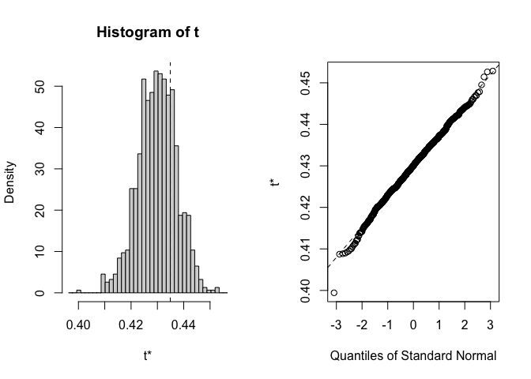
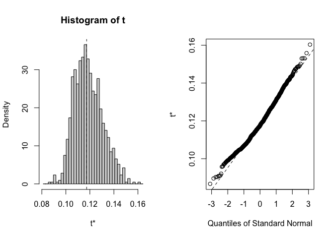
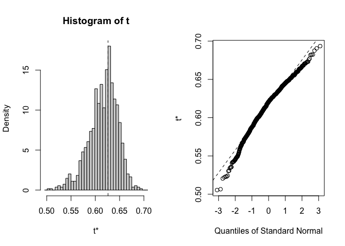
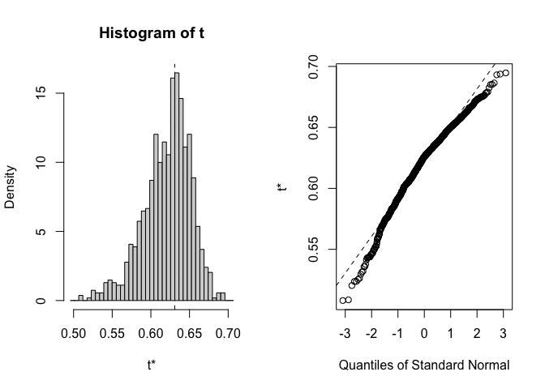

To Do: 
- Copy this code and substitute the full year climate data for the growth season inputs used here.


# Climate Distance at the WL2 Garden

Note, there is no air temperature data for WL2 in July 2023!! 
Add data for November and December once we get the data after snowmelt? 
- Reference growth season criteria 

## Relevant Libraries and Functions


``` r
library(raster)
```

```
## Loading required package: sp
```

``` r
library(tidyverse)
```

```
## ── Attaching core tidyverse packages ──────────────────────── tidyverse 2.0.0 ──
## ✔ dplyr     1.1.4     ✔ readr     2.1.5
## ✔ forcats   1.0.0     ✔ stringr   1.5.1
## ✔ ggplot2   3.5.1     ✔ tibble    3.2.1
## ✔ lubridate 1.9.3     ✔ tidyr     1.3.1
## ✔ purrr     1.0.2
```

```
## ── Conflicts ────────────────────────────────────────── tidyverse_conflicts() ──
## ✖ tidyr::extract() masks raster::extract()
## ✖ dplyr::filter()  masks stats::filter()
## ✖ dplyr::lag()     masks stats::lag()
## ✖ dplyr::select()  masks raster::select()
## ℹ Use the conflicted package (<http://conflicted.r-lib.org/>) to force all conflicts to become errors
```

``` r
library(conflicted)
conflicts_prefer(dplyr::select())
```

```
## [conflicted] Will prefer dplyr::select over any other package.
```

``` r
conflicts_prefer(dplyr::filter)
```

```
## [conflicted] Will prefer dplyr::filter over any other package.
```

``` r
library(ggrepel)
library(cowplot)
library(gridExtra)
library(naniar) #replaces values with NA

sem <- function(x, na.rm=FALSE) {
  sd(x,na.rm=na.rm)/sqrt(length(na.omit(x)))
} #standard error function 

get_legend<-function(myggplot){
  tmp <- ggplot_gtable(ggplot_build(myggplot))
  leg <- which(sapply(tmp$grobs, function(x) x$name) == "guide-box")
  legend <- tmp$grobs[[leg]]
  return(legend)
} #legend function for grid_arrange

elev_three_palette <- c("#0043F0", "#C9727F", "#F5A540") #colors from Gremer et al 2019
elev_order <- c("High", "Mid", "Low")
```

## Home Climates

### Flint


``` r
pops_flint_avgs <- read_csv("../output/Climate/growthseason_FlintAvgs.csv")
```

```
## Rows: 46 Columns: 11
## ── Column specification ────────────────────────────────────────────────────────
## Delimiter: ","
## chr (3): parent.pop, elevation.group, TimePd
## dbl (8): elev_m, Lat, Long, cwd, pck, ppt, tmn, tmx
## 
## ℹ Use `spec()` to retrieve the full column specification for this data.
## ℹ Specify the column types or set `show_col_types = FALSE` to quiet this message.
```

``` r
head(pops_flint_avgs)
```

```
## # A tibble: 6 × 11
##   parent.pop elevation.group elev_m   Lat  Long   cwd   pck   ppt   tmn   tmx
##   <chr>      <chr>            <dbl> <dbl> <dbl> <dbl> <dbl> <dbl> <dbl> <dbl>
## 1 BH         Low               511.  37.4 -120.  50.6  0     71.0  6.19  19.6
## 2 CC         Low               313   39.6 -121.  48.4  0    105.   8.56  21.0
## 3 CP2        High             2244.  38.7 -120.  75.1 41.8   78.2  3.94  16.5
## 4 CP3        High             2266.  38.7 -120.  57.8 44.3   75.4  3.36  15.7
## 5 DPR        Mid              1019.  39.2 -121.  30.4  2.72  96.9  9.06  21.9
## 6 FR         Mid               787   40.0 -121.  89.7  4.01  58.1  7.37  22.9
## # ℹ 1 more variable: TimePd <chr>
```

``` r
unique(pops_flint_avgs$parent.pop) #only home pops
```

```
##  [1] "BH"    "CC"    "CP2"   "CP3"   "DPR"   "FR"    "IH"    "LV1"   "LV3"  
## [10] "LVTR1" "SC"    "SQ1"   "SQ2"   "SQ3"   "TM2"   "WL1"   "WL2"   "WR"   
## [19] "WV"    "YO11"  "YO4"   "YO7"   "YO8"
```

``` r
unique(pops_flint_avgs$TimePd) # recent and historical timeperiod 
```

```
## [1] "Recent"     "Historical"
```

``` r
pops_flint_recent_avgs <- pops_flint_avgs %>% filter(TimePd=="Recent")
head(pops_flint_recent_avgs)
```

```
## # A tibble: 6 × 11
##   parent.pop elevation.group elev_m   Lat  Long   cwd   pck   ppt   tmn   tmx
##   <chr>      <chr>            <dbl> <dbl> <dbl> <dbl> <dbl> <dbl> <dbl> <dbl>
## 1 BH         Low               511.  37.4 -120.  50.6  0     71.0  6.19  19.6
## 2 CC         Low               313   39.6 -121.  48.4  0    105.   8.56  21.0
## 3 CP2        High             2244.  38.7 -120.  75.1 41.8   78.2  3.94  16.5
## 4 CP3        High             2266.  38.7 -120.  57.8 44.3   75.4  3.36  15.7
## 5 DPR        Mid              1019.  39.2 -121.  30.4  2.72  96.9  9.06  21.9
## 6 FR         Mid               787   40.0 -121.  89.7  4.01  58.1  7.37  22.9
## # ℹ 1 more variable: TimePd <chr>
```

``` r
pops_flint_historic_avgs <-  pops_flint_avgs %>% filter(TimePd=="Historical")
head(pops_flint_historic_avgs)
```

```
## # A tibble: 6 × 11
##   parent.pop elevation.group elev_m   Lat  Long   cwd     pck   ppt   tmn   tmx
##   <chr>      <chr>            <dbl> <dbl> <dbl> <dbl>   <dbl> <dbl> <dbl> <dbl>
## 1 BH         Low               511.  37.4 -120.  50.6  0.0292  66.6  5.11  18.8
## 2 CC         Low               313   39.6 -121.  42.5  0.119  112.   6.36  18.9
## 3 CP2        High             2244.  38.7 -120.  79.7 18.4     69.0  3.99  17.6
## 4 CP3        High             2266.  38.7 -120.  60.3 20.7     67.1  3.54  16.8
## 5 DPR        Mid              1019.  39.2 -121.  30.0  5.13    82.5  8.02  22.2
## 6 FR         Mid               787   40.0 -121.  87.8  4.54    57.8  6.15  23.0
## # ℹ 1 more variable: TimePd <chr>
```

``` r
names(pops_flint_historic_avgs)
```

```
##  [1] "parent.pop"      "elevation.group" "elev_m"          "Lat"            
##  [5] "Long"            "cwd"             "pck"             "ppt"            
##  [9] "tmn"             "tmx"             "TimePd"
```

### BioClim


``` r
pops_bioclim_avgs <-  read_csv("../output/Climate/growthseason_BioClimAvgs.csv") 
```

```
## Rows: 46 Columns: 14
## ── Column specification ────────────────────────────────────────────────────────
## Delimiter: ","
## chr  (3): parent.pop, elevation.group, TimePd
## dbl (11): elev_m, ann_tmean, mean_diurnal_range, temp_seasonality, temp_ann_...
## 
## ℹ Use `spec()` to retrieve the full column specification for this data.
## ℹ Specify the column types or set `show_col_types = FALSE` to quiet this message.
```

``` r
head(pops_bioclim_avgs)
```

```
## # A tibble: 6 × 14
##   parent.pop elevation.group elev_m ann_tmean mean_diurnal_range
##   <chr>      <chr>            <dbl>     <dbl>              <dbl>
## 1 BH         Low               511.     12.9                13.4
## 2 CC         Low               313      14.8                12.4
## 3 CP2        High             2244.     10.2                12.6
## 4 CP3        High             2266.      9.54               12.4
## 5 DPR        Mid              1019.     15.5                12.9
## 6 FR         Mid               787      15.1                15.5
## # ℹ 9 more variables: temp_seasonality <dbl>, temp_ann_range <dbl>,
## #   tmean_wettest_month <dbl>, tmean_driest_month <dbl>, ann_ppt <dbl>,
## #   ppt_seasonality <dbl>, ppt_warmest_month <dbl>, ppt_coldest_month <dbl>,
## #   TimePd <chr>
```

``` r
unique(pops_bioclim_avgs$parent.pop) #only home pops
```

```
##  [1] "BH"    "CC"    "CP2"   "CP3"   "DPR"   "FR"    "IH"    "LV1"   "LV3"  
## [10] "LVTR1" "SC"    "SQ1"   "SQ2"   "SQ3"   "TM2"   "WL1"   "WL2"   "WR"   
## [19] "WV"    "YO11"  "YO4"   "YO7"   "YO8"
```

``` r
unique(pops_bioclim_avgs$TimePd) # recent and historical timeperiod 
```

```
## [1] "Recent"     "Historical"
```

``` r
pops_bioclim_recent_avgs <- pops_bioclim_avgs %>%  filter(TimePd=="Recent")
head(pops_bioclim_recent_avgs)
```

```
## # A tibble: 6 × 14
##   parent.pop elevation.group elev_m ann_tmean mean_diurnal_range
##   <chr>      <chr>            <dbl>     <dbl>              <dbl>
## 1 BH         Low               511.     12.9                13.4
## 2 CC         Low               313      14.8                12.4
## 3 CP2        High             2244.     10.2                12.6
## 4 CP3        High             2266.      9.54               12.4
## 5 DPR        Mid              1019.     15.5                12.9
## 6 FR         Mid               787      15.1                15.5
## # ℹ 9 more variables: temp_seasonality <dbl>, temp_ann_range <dbl>,
## #   tmean_wettest_month <dbl>, tmean_driest_month <dbl>, ann_ppt <dbl>,
## #   ppt_seasonality <dbl>, ppt_warmest_month <dbl>, ppt_coldest_month <dbl>,
## #   TimePd <chr>
```

``` r
pops_bioclim_historical_avgs <- pops_bioclim_avgs %>% filter(TimePd=="Historical")
head(pops_bioclim_historical_avgs)
```

```
## # A tibble: 6 × 14
##   parent.pop elevation.group elev_m ann_tmean mean_diurnal_range
##   <chr>      <chr>            <dbl>     <dbl>              <dbl>
## 1 BH         Low               511.      12.0               13.7
## 2 CC         Low               313       12.6               12.6
## 3 CP2        High             2244.      10.8               13.7
## 4 CP3        High             2266.      10.2               13.3
## 5 DPR        Mid              1019.      15.1               14.2
## 6 FR         Mid               787       14.6               16.8
## # ℹ 9 more variables: temp_seasonality <dbl>, temp_ann_range <dbl>,
## #   tmean_wettest_month <dbl>, tmean_driest_month <dbl>, ann_ppt <dbl>,
## #   ppt_seasonality <dbl>, ppt_warmest_month <dbl>, ppt_coldest_month <dbl>,
## #   TimePd <chr>
```

``` r
names(pops_bioclim_historical_avgs)
```

```
##  [1] "parent.pop"          "elevation.group"     "elev_m"             
##  [4] "ann_tmean"           "mean_diurnal_range"  "temp_seasonality"   
##  [7] "temp_ann_range"      "tmean_wettest_month" "tmean_driest_month" 
## [10] "ann_ppt"             "ppt_seasonality"     "ppt_warmest_month"  
## [13] "ppt_coldest_month"   "TimePd"
```

## WL2 Climate Data (July 2023-Oct 2023)

### From Flint (changed this from Magney MetStation)

Per growth season code: Last month = snowpack. \> 70 mm OR pck > 0 and min temp < 0 OR min temp < -5 (moderate freeze)

``` r
WL2_climate <- read_csv("../output/Climate/flint_climate_UCDpops.csv") %>% 
  filter(parent.pop=="WL2_Garden") %>% 
  filter(year==2023) %>% 
  mutate(tavg = (tmn + tmx)/2, t_diurnal = (tmx-tmn))
```

```
## Rows: 38675 Columns: 14
## ── Column specification ────────────────────────────────────────────────────────
## Delimiter: ","
## chr  (3): parent.pop, elevation.group, month
## dbl (11): elev_m, Lat, Long, year, aet, cwd, pck, pet, ppt, tmn, tmx
## 
## ℹ Use `spec()` to retrieve the full column specification for this data.
## ℹ Specify the column types or set `show_col_types = FALSE` to quiet this message.
```

``` r
head(WL2_climate)
```

```
## # A tibble: 6 × 16
##   parent.pop elevation.group elev_m   Lat  Long  year month    aet   cwd    pck
##   <chr>      <chr>            <dbl> <dbl> <dbl> <dbl> <chr>  <dbl> <dbl>  <dbl>
## 1 WL2_Garden High              2020  38.8 -120.  2023 apr    41.5   46.4 1787. 
## 2 WL2_Garden High              2020  38.8 -120.  2023 aug   106.    43.8    0  
## 3 WL2_Garden High              2020  38.8 -120.  2023 dec     2.78  24.6   16.9
## 4 WL2_Garden High              2020  38.8 -120.  2023 feb     8.62  22.4 1422. 
## 5 WL2_Garden High              2020  38.8 -120.  2023 jan     7.23  16.4 1208. 
## 6 WL2_Garden High              2020  38.8 -120.  2023 jul    75.7  100.     0  
## # ℹ 6 more variables: pet <dbl>, ppt <dbl>, tmn <dbl>, tmx <dbl>, tavg <dbl>,
## #   t_diurnal <dbl>
```

``` r
summary(WL2_climate)
```

```
##   parent.pop        elevation.group        elev_m          Lat       
##  Length:12          Length:12          Min.   :2020   Min.   :38.83  
##  Class :character   Class :character   1st Qu.:2020   1st Qu.:38.83  
##  Mode  :character   Mode  :character   Median :2020   Median :38.83  
##                                        Mean   :2020   Mean   :38.83  
##                                        3rd Qu.:2020   3rd Qu.:38.83  
##                                        Max.   :2020   Max.   :38.83  
##       Long             year         month                aet        
##  Min.   :-120.3   Min.   :2023   Length:12          Min.   :  2.78  
##  1st Qu.:-120.3   1st Qu.:2023   Class :character   1st Qu.:  6.98  
##  Median :-120.3   Median :2023   Mode  :character   Median : 37.69  
##  Mean   :-120.3   Mean   :2023                      Mean   : 44.95  
##  3rd Qu.:-120.3   3rd Qu.:2023                      3rd Qu.: 78.27  
##  Max.   :-120.3   Max.   :2023                      Max.   :115.16  
##       cwd              pck              pet              ppt        
##  Min.   : 14.83   Min.   :   0.0   Min.   : 23.60   Min.   :  0.01  
##  1st Qu.: 24.06   1st Qu.:   0.0   1st Qu.: 34.08   1st Qu.: 36.49  
##  Median : 38.83   Median : 292.8   Median : 81.55   Median : 68.33  
##  Mean   : 42.14   Mean   : 690.0   Mean   : 87.09   Mean   :161.87  
##  3rd Qu.: 49.56   3rd Qu.:1323.9   3rd Qu.:134.12   3rd Qu.:175.70  
##  Max.   :100.37   Max.   :1986.3   Max.   :176.10   Max.   :604.81  
##       tmn              tmx             tavg          t_diurnal    
##  Min.   :-6.150   Min.   : 2.13   Min.   :-2.010   Min.   : 8.16  
##  1st Qu.:-2.510   1st Qu.: 6.76   1st Qu.: 2.500   1st Qu.: 9.42  
##  Median : 1.540   Median :11.87   Median : 6.660   Median :10.24  
##  Mean   : 2.315   Mean   :12.62   Mean   : 7.465   Mean   :10.30  
##  3rd Qu.: 6.145   3rd Qu.:17.52   3rd Qu.:11.832   3rd Qu.:11.32  
##  Max.   :13.220   Max.   :25.95   Max.   :19.585   Max.   :12.73
```

``` r
WL2_climate_growmos <- WL2_climate %>% 
  filter(month=="jul" | month=="aug" | month=="sep" | month=="oct" |
           month=="nov" | month=="dec") #included Dec as the "last month" per growth season code 

WL2_climate_flint <- WL2_climate_growmos %>% #get the means for the variables to compare to home sites 
  summarise(cwd_WL2=mean(cwd),ppt_WL2=mean(ppt), pck_WL2=mean(pck), tmn_WL2=mean(tmn), tmx_WL2=mean(tmx))
WL2_climate_flint
```

```
## # A tibble: 1 × 5
##   cwd_WL2 ppt_WL2 pck_WL2 tmn_WL2 tmx_WL2
##     <dbl>   <dbl>   <dbl>   <dbl>   <dbl>
## 1    54.7    61.5    2.81    6.29    16.8
```

## WL2 Climate Trends

``` r
WL2_climate$month <- factor(WL2_climate$month, levels = c("jan", "feb", "mar", "apr", "may", "jun", "jul", "aug", "sep", "oct","nov","dec"))

WL2_climate %>% 
  ggplot(aes(x=month,y=cwd)) +
  geom_point()
```

<!-- -->

``` r
WL2_climate %>% 
  ggplot(aes(x=month,y=pck)) +
  geom_point() +
  facet_wrap(~year)
```

<!-- -->

``` r
WL2_climate %>% 
  ggplot(aes(x=month,y=tmx)) +
  geom_point()
```

<!-- -->

``` r
WL2_climate %>% 
  ggplot(aes(x=month,y=tmn)) +
  geom_point()
```

<!-- -->

``` r
WL2_climate %>% 
  ggplot(aes(x=month,y=ppt)) +
  geom_point()
```

<!-- -->


### BioClim

Calculating wettest, driest, warmest, and coldest months


``` r
WL2_wettest_month <- WL2_climate_growmos %>%  
  slice_max(ppt)

WL2_driest_month <- WL2_climate_growmos %>% 
  slice_min(ppt)

WL2_warmest_month <- WL2_climate_growmos %>% 
  slice_max(tavg)

WL2_coldest_month <- WL2_climate_growmos %>%
  slice_min(tavg)
```

Bio 1, 2, 4, 7, 12, 15


``` r
bioclim_WL2_calc <- WL2_climate_growmos %>% 
  summarise(ann_tmean=mean(tavg),  #Bio1 - Annual Mean Temperature
            mean_diurnal_range=mean(t_diurnal), #Bio2 - Mean Diurnal Range
            temp_seasonality=sd(tavg), #Bio4 - Temperature Seasonality
            temp_ann_range=(max(tmx))-(min(tmn)), #bio7 - temp annual range
            ann_ppt=sum(ppt), #bio12 - annual precip
            ppt_seasonality=cv(ppt+1)) #bio15 - Precipitation Seasonality (+1 to avoid strange CVs for areas where mean rainfaill is < 1)
bioclim_WL2_calc
```

```
## # A tibble: 1 × 6
##   ann_tmean mean_diurnal_range temp_seasonality temp_ann_range ann_ppt
##       <dbl>              <dbl>            <dbl>          <dbl>   <dbl>
## 1      11.6               10.5             6.58           26.4    369.
## # ℹ 1 more variable: ppt_seasonality <dbl>
```

Bio 8(Q), 9(Q), 18(Q), 19(Q)


``` r
#bio8 = tmean_wettest_month
bio8_WL2 <- WL2_wettest_month %>% 
  dplyr::select(tmean_wettest_month=tavg)

#bio9 = tmean_driest_month
bio9_WL2 <- WL2_driest_month %>% 
  dplyr::select(tmean_driest_month=tavg)

bio8_9_WL2 <- bind_cols(bio8_WL2, bio9_WL2)

#bio18 = ppt_warmest_month
bio18_WL2 <- WL2_warmest_month %>% 
  dplyr::select(ppt_warmest_month=ppt)

#bio19 = ppt_coldest_month
bio19_WL2 <- WL2_wettest_month %>% 
  dplyr::select(ppt_coldest_month=ppt)

bio18_19_WL2 <- bind_cols(bio18_WL2, bio19_WL2)

all_periods_WL2 <- bind_cols(bio8_9_WL2, bio18_19_WL2)
```

Merge all bioclims


``` r
WL2_bioclim_final <- bind_cols(bioclim_WL2_calc, all_periods_WL2) %>% 
  rename_with(~paste0(., "_WL2"), 1:10)
summary(WL2_bioclim_final)
```

```
##  ann_tmean_WL2   mean_diurnal_range_WL2 temp_seasonality_WL2 temp_ann_range_WL2
##  Min.   :11.56   Min.   :10.54          Min.   :6.58         Min.   :26.43     
##  1st Qu.:11.56   1st Qu.:10.54          1st Qu.:6.58         1st Qu.:26.43     
##  Median :11.56   Median :10.54          Median :6.58         Median :26.43     
##  Mean   :11.56   Mean   :10.54          Mean   :6.58         Mean   :26.43     
##  3rd Qu.:11.56   3rd Qu.:10.54          3rd Qu.:6.58         3rd Qu.:26.43     
##  Max.   :11.56   Max.   :10.54          Max.   :6.58         Max.   :26.43     
##   ann_ppt_WL2    ppt_seasonality_WL2 tmean_wettest_month_WL2
##  Min.   :368.9   Min.   :88.03       Min.   :3.6            
##  1st Qu.:368.9   1st Qu.:88.03       1st Qu.:3.6            
##  Median :368.9   Median :88.03       Median :3.6            
##  Mean   :368.9   Mean   :88.03       Mean   :3.6            
##  3rd Qu.:368.9   3rd Qu.:88.03       3rd Qu.:3.6            
##  Max.   :368.9   Max.   :88.03       Max.   :3.6            
##  tmean_driest_month_WL2 ppt_warmest_month_WL2 ppt_coldest_month_WL2
##  Min.   :19.59          Min.   :0.01          Min.   :156.2        
##  1st Qu.:19.59          1st Qu.:0.01          1st Qu.:156.2        
##  Median :19.59          Median :0.01          Median :156.2        
##  Mean   :19.59          Mean   :0.01          Mean   :156.2        
##  3rd Qu.:19.59          3rd Qu.:0.01          3rd Qu.:156.2        
##  Max.   :19.59          Max.   :0.01          Max.   :156.2
```


## Gower's Climate Distance

(1/P) \* SUM ((absolute value(Ai - Bi)) / range(i)) for each variable

-   P = number of environmental variables = 13 (without CWD)

-   Ai = 30 year avg of that variable for the home site

-   Bi = July 2023-Dec 2023 avg of that variable for the WL2 garden

-   Range(i) = maximum - minimum of that variable in the whole data set
    (across sites)

### Combine the flint and bioclim variables 


``` r
WL2_climate_all <- bind_cols(WL2_climate_flint, WL2_bioclim_final)
dim(WL2_climate_all)
```

```
## [1]  1 15
```

``` r
home_climates_all_recent <- left_join(pops_flint_recent_avgs, pops_bioclim_recent_avgs)
```

```
## Joining with `by = join_by(parent.pop, elevation.group, elev_m, TimePd)`
```

``` r
home_climates_all_historic <- left_join(pops_flint_historic_avgs, pops_bioclim_historical_avgs)
```

```
## Joining with `by = join_by(parent.pop, elevation.group, elev_m, TimePd)`
```

``` r
WL2_home_climate_recent <- bind_cols(WL2_climate_all, home_climates_all_recent)
summary(WL2_home_climate_recent)
```

```
##     cwd_WL2         ppt_WL2         pck_WL2         tmn_WL2     
##  Min.   :54.67   Min.   :61.48   Min.   :2.813   Min.   :6.293  
##  1st Qu.:54.67   1st Qu.:61.48   1st Qu.:2.813   1st Qu.:6.293  
##  Median :54.67   Median :61.48   Median :2.813   Median :6.293  
##  Mean   :54.67   Mean   :61.48   Mean   :2.813   Mean   :6.293  
##  3rd Qu.:54.67   3rd Qu.:61.48   3rd Qu.:2.813   3rd Qu.:6.293  
##  Max.   :54.67   Max.   :61.48   Max.   :2.813   Max.   :6.293  
##     tmx_WL2      ann_tmean_WL2   mean_diurnal_range_WL2 temp_seasonality_WL2
##  Min.   :16.83   Min.   :11.56   Min.   :10.54          Min.   :6.58        
##  1st Qu.:16.83   1st Qu.:11.56   1st Qu.:10.54          1st Qu.:6.58        
##  Median :16.83   Median :11.56   Median :10.54          Median :6.58        
##  Mean   :16.83   Mean   :11.56   Mean   :10.54          Mean   :6.58        
##  3rd Qu.:16.83   3rd Qu.:11.56   3rd Qu.:10.54          3rd Qu.:6.58        
##  Max.   :16.83   Max.   :11.56   Max.   :10.54          Max.   :6.58        
##  temp_ann_range_WL2  ann_ppt_WL2    ppt_seasonality_WL2 tmean_wettest_month_WL2
##  Min.   :26.43      Min.   :368.9   Min.   :88.03       Min.   :3.6            
##  1st Qu.:26.43      1st Qu.:368.9   1st Qu.:88.03       1st Qu.:3.6            
##  Median :26.43      Median :368.9   Median :88.03       Median :3.6            
##  Mean   :26.43      Mean   :368.9   Mean   :88.03       Mean   :3.6            
##  3rd Qu.:26.43      3rd Qu.:368.9   3rd Qu.:88.03       3rd Qu.:3.6            
##  Max.   :26.43      Max.   :368.9   Max.   :88.03       Max.   :3.6            
##  tmean_driest_month_WL2 ppt_warmest_month_WL2 ppt_coldest_month_WL2
##  Min.   :19.59          Min.   :0.01          Min.   :156.2        
##  1st Qu.:19.59          1st Qu.:0.01          1st Qu.:156.2        
##  Median :19.59          Median :0.01          Median :156.2        
##  Mean   :19.59          Mean   :0.01          Mean   :156.2        
##  3rd Qu.:19.59          3rd Qu.:0.01          3rd Qu.:156.2        
##  Max.   :19.59          Max.   :0.01          Max.   :156.2        
##   parent.pop        elevation.group        elev_m            Lat       
##  Length:23          Length:23          Min.   : 313.0   Min.   :36.56  
##  Class :character   Class :character   1st Qu.: 767.9   1st Qu.:37.81  
##  Mode  :character   Mode  :character   Median :1934.5   Median :38.79  
##                                        Mean   :1649.7   Mean   :38.74  
##                                        3rd Qu.:2363.4   3rd Qu.:39.59  
##                                        Max.   :2872.3   Max.   :40.74  
##       Long             cwd             pck              ppt        
##  Min.   :-123.0   Min.   :30.36   Min.   : 0.000   Min.   : 31.34  
##  1st Qu.:-121.3   1st Qu.:51.82   1st Qu.: 3.363   1st Qu.: 59.66  
##  Median :-120.3   Median :64.91   Median : 9.383   Median : 71.02  
##  Mean   :-120.4   Mean   :61.97   Mean   :16.848   Mean   : 73.80  
##  3rd Qu.:-119.7   3rd Qu.:74.44   3rd Qu.:28.489   3rd Qu.: 85.61  
##  Max.   :-118.8   Max.   :90.08   Max.   :44.302   Max.   :131.99  
##       tmn             tmx           TimePd            ann_tmean     
##  Min.   :1.597   Min.   :15.14   Length:23          Min.   : 8.368  
##  1st Qu.:2.855   1st Qu.:16.42   Class :character   1st Qu.: 9.463  
##  Median :6.187   Median :18.80   Mode  :character   Median :12.599  
##  Mean   :5.400   Mean   :18.60                      Mean   :11.999  
##  3rd Qu.:7.004   3rd Qu.:20.75                      3rd Qu.:14.094  
##  Max.   :9.063   Max.   :22.91                      Max.   :15.490  
##  mean_diurnal_range temp_seasonality temp_ann_range  tmean_wettest_month
##  Min.   :11.69      Min.   :5.043    Min.   :27.02   Min.   :-0.4145    
##  1st Qu.:12.47      1st Qu.:6.071    1st Qu.:28.39   1st Qu.: 2.4417    
##  Median :12.85      Median :6.613    Median :29.87   Median : 4.2953    
##  Mean   :13.20      Mean   :6.481    Mean   :29.80   Mean   : 4.4726    
##  3rd Qu.:13.65      3rd Qu.:6.871    3rd Qu.:30.63   3rd Qu.: 6.9733    
##  Max.   :15.54      Max.   :7.475    Max.   :33.43   Max.   : 8.8605    
##  tmean_driest_month    ann_ppt       ppt_seasonality  ppt_warmest_month
##  Min.   :11.51      Min.   : 156.7   Min.   : 95.43   Min.   : 0.072   
##  1st Qu.:13.94      1st Qu.: 376.0   1st Qu.:120.96   1st Qu.: 2.686   
##  Median :16.71      Median : 469.5   Median :131.59   Median : 6.337   
##  Mean   :17.92      Mean   : 545.6   Mean   :126.03   Mean   : 6.521   
##  3rd Qu.:20.89      3rd Qu.: 605.4   3rd Qu.:134.21   3rd Qu.: 7.938   
##  Max.   :25.29      Max.   :1055.9   Max.   :144.46   Max.   :15.376   
##  ppt_coldest_month
##  Min.   : 88.19   
##  1st Qu.:229.40   
##  Median :246.44   
##  Mean   :253.39   
##  3rd Qu.:260.53   
##  Max.   :380.07
```

``` r
WL2_home_climate_historic <- bind_cols(WL2_climate_all, home_climates_all_historic)
summary(WL2_home_climate_historic)
```

```
##     cwd_WL2         ppt_WL2         pck_WL2         tmn_WL2     
##  Min.   :54.67   Min.   :61.48   Min.   :2.813   Min.   :6.293  
##  1st Qu.:54.67   1st Qu.:61.48   1st Qu.:2.813   1st Qu.:6.293  
##  Median :54.67   Median :61.48   Median :2.813   Median :6.293  
##  Mean   :54.67   Mean   :61.48   Mean   :2.813   Mean   :6.293  
##  3rd Qu.:54.67   3rd Qu.:61.48   3rd Qu.:2.813   3rd Qu.:6.293  
##  Max.   :54.67   Max.   :61.48   Max.   :2.813   Max.   :6.293  
##     tmx_WL2      ann_tmean_WL2   mean_diurnal_range_WL2 temp_seasonality_WL2
##  Min.   :16.83   Min.   :11.56   Min.   :10.54          Min.   :6.58        
##  1st Qu.:16.83   1st Qu.:11.56   1st Qu.:10.54          1st Qu.:6.58        
##  Median :16.83   Median :11.56   Median :10.54          Median :6.58        
##  Mean   :16.83   Mean   :11.56   Mean   :10.54          Mean   :6.58        
##  3rd Qu.:16.83   3rd Qu.:11.56   3rd Qu.:10.54          3rd Qu.:6.58        
##  Max.   :16.83   Max.   :11.56   Max.   :10.54          Max.   :6.58        
##  temp_ann_range_WL2  ann_ppt_WL2    ppt_seasonality_WL2 tmean_wettest_month_WL2
##  Min.   :26.43      Min.   :368.9   Min.   :88.03       Min.   :3.6            
##  1st Qu.:26.43      1st Qu.:368.9   1st Qu.:88.03       1st Qu.:3.6            
##  Median :26.43      Median :368.9   Median :88.03       Median :3.6            
##  Mean   :26.43      Mean   :368.9   Mean   :88.03       Mean   :3.6            
##  3rd Qu.:26.43      3rd Qu.:368.9   3rd Qu.:88.03       3rd Qu.:3.6            
##  Max.   :26.43      Max.   :368.9   Max.   :88.03       Max.   :3.6            
##  tmean_driest_month_WL2 ppt_warmest_month_WL2 ppt_coldest_month_WL2
##  Min.   :19.59          Min.   :0.01          Min.   :156.2        
##  1st Qu.:19.59          1st Qu.:0.01          1st Qu.:156.2        
##  Median :19.59          Median :0.01          Median :156.2        
##  Mean   :19.59          Mean   :0.01          Mean   :156.2        
##  3rd Qu.:19.59          3rd Qu.:0.01          3rd Qu.:156.2        
##  Max.   :19.59          Max.   :0.01          Max.   :156.2        
##   parent.pop        elevation.group        elev_m            Lat       
##  Length:23          Length:23          Min.   : 313.0   Min.   :36.56  
##  Class :character   Class :character   1st Qu.: 767.9   1st Qu.:37.81  
##  Mode  :character   Mode  :character   Median :1934.5   Median :38.79  
##                                        Mean   :1649.7   Mean   :38.74  
##                                        3rd Qu.:2363.4   3rd Qu.:39.59  
##                                        Max.   :2872.3   Max.   :40.74  
##       Long             cwd             pck                ppt        
##  Min.   :-123.0   Min.   :30.02   Min.   : 0.02925   Min.   : 42.12  
##  1st Qu.:-121.3   1st Qu.:47.63   1st Qu.: 4.83581   1st Qu.: 59.91  
##  Median :-120.3   Median :60.26   Median :15.87540   Median : 69.04  
##  Mean   :-120.4   Mean   :59.42   Mean   :19.69196   Mean   : 80.06  
##  3rd Qu.:-119.7   3rd Qu.:68.55   3rd Qu.:24.67260   3rd Qu.: 93.62  
##  Max.   :-118.8   Max.   :87.76   Max.   :64.45816   Max.   :132.53  
##       tmn              tmx           TimePd            ann_tmean     
##  Min.   :-1.347   Min.   :13.72   Length:23          Min.   : 6.188  
##  1st Qu.: 2.690   1st Qu.:16.30   Class :character   1st Qu.: 9.217  
##  Median : 4.997   Median :17.69   Mode  :character   Median :11.358  
##  Mean   : 3.991   Mean   :17.95                      Mean   :10.969  
##  3rd Qu.: 6.027   3rd Qu.:19.43                      3rd Qu.:12.698  
##  Max.   : 8.018   Max.   :22.97                      Max.   :15.116  
##  mean_diurnal_range temp_seasonality temp_ann_range  tmean_wettest_month
##  Min.   :12.05      Min.   :5.092    Min.   :26.44   Min.   :1.232      
##  1st Qu.:13.08      1st Qu.:5.642    1st Qu.:27.55   1st Qu.:2.552      
##  Median :13.78      Median :5.750    Median :28.70   Median :3.763      
##  Mean   :13.96      Mean   :6.018    Mean   :29.28   Mean   :4.756      
##  3rd Qu.:14.66      3rd Qu.:6.511    3rd Qu.:30.47   3rd Qu.:7.361      
##  Max.   :16.81      Max.   :6.973    Max.   :34.20   Max.   :9.227      
##  tmean_driest_month    ann_ppt       ppt_seasonality  ppt_warmest_month
##  Min.   : 9.098     Min.   : 210.6   Min.   : 90.86   Min.   : 1.571   
##  1st Qu.:12.945     1st Qu.: 379.7   1st Qu.:109.67   1st Qu.: 6.022   
##  Median :15.501     Median : 500.0   Median :117.54   Median : 9.263   
##  Mean   :16.185     Mean   : 530.7   Mean   :116.25   Mean   :10.929   
##  3rd Qu.:19.492     3rd Qu.: 607.5   3rd Qu.:125.16   3rd Qu.:14.428   
##  Max.   :22.786     Max.   :1007.3   Max.   :134.72   Max.   :26.356   
##  ppt_coldest_month
##  Min.   :116.5    
##  1st Qu.:197.2    
##  Median :223.2    
##  Mean   :242.1    
##  3rd Qu.:310.5    
##  Max.   :341.1
```

### Figure out the range for each variable 


``` r
WL2_range_prep <- WL2_climate_all %>% 
  mutate(parent.pop="WL2") %>% 
  rename_with(~str_remove(., "_WL2"), everything())
```


#### Recent

``` r
range_merge_recent <- bind_rows(home_climates_all_recent, WL2_range_prep)
names(range_merge_recent)
```

```
##  [1] "parent.pop"          "elevation.group"     "elev_m"             
##  [4] "Lat"                 "Long"                "cwd"                
##  [7] "pck"                 "ppt"                 "tmn"                
## [10] "tmx"                 "TimePd"              "ann_tmean"          
## [13] "mean_diurnal_range"  "temp_seasonality"    "temp_ann_range"     
## [16] "tmean_wettest_month" "tmean_driest_month"  "ann_ppt"            
## [19] "ppt_seasonality"     "ppt_warmest_month"   "ppt_coldest_month"
```

``` r
summary(range_merge_recent)
```

```
##   parent.pop        elevation.group        elev_m            Lat       
##  Length:24          Length:24          Min.   : 313.0   Min.   :36.56  
##  Class :character   Class :character   1st Qu.: 767.9   1st Qu.:37.81  
##  Mode  :character   Mode  :character   Median :1934.5   Median :38.79  
##                                        Mean   :1649.7   Mean   :38.74  
##                                        3rd Qu.:2363.4   3rd Qu.:39.59  
##                                        Max.   :2872.3   Max.   :40.74  
##                                        NA's   :1        NA's   :1      
##       Long             cwd             pck              ppt        
##  Min.   :-123.0   Min.   :30.36   Min.   : 0.000   Min.   : 31.34  
##  1st Qu.:-121.3   1st Qu.:52.44   1st Qu.: 2.790   1st Qu.: 60.42  
##  Median :-120.3   Median :64.48   Median : 9.292   Median : 70.76  
##  Mean   :-120.4   Mean   :61.67   Mean   :16.263   Mean   : 73.29  
##  3rd Qu.:-119.7   3rd Qu.:74.09   3rd Qu.:28.338   3rd Qu.: 81.93  
##  Max.   :-118.8   Max.   :90.08   Max.   :44.302   Max.   :131.99  
##  NA's   :1                                                         
##       tmn             tmx           TimePd            ann_tmean     
##  Min.   :1.597   Min.   :15.14   Length:24          Min.   : 8.368  
##  1st Qu.:3.106   1st Qu.:16.42   Class :character   1st Qu.: 9.503  
##  Median :6.240   Median :18.45   Mode  :character   Median :12.216  
##  Mean   :5.437   Mean   :18.52                      Mean   :11.980  
##  3rd Qu.:6.946   3rd Qu.:20.63                      3rd Qu.:13.896  
##  Max.   :9.063   Max.   :22.91                      Max.   :15.490  
##                                                                     
##  mean_diurnal_range temp_seasonality temp_ann_range  tmean_wettest_month
##  Min.   :10.54      Min.   :5.043    Min.   :26.43   Min.   :-0.4145    
##  1st Qu.:12.43      1st Qu.:6.075    1st Qu.:27.67   1st Qu.: 2.4449    
##  Median :12.72      Median :6.596    Median :29.86   Median : 3.9477    
##  Mean   :13.09      Mean   :6.485    Mean   :29.66   Mean   : 4.4362    
##  3rd Qu.:13.63      3rd Qu.:6.867    3rd Qu.:30.60   3rd Qu.: 6.8596    
##  Max.   :15.54      Max.   :7.475    Max.   :33.43   Max.   : 8.8605    
##                                                                         
##  tmean_driest_month    ann_ppt       ppt_seasonality  ppt_warmest_month
##  Min.   :11.51      Min.   : 156.7   Min.   : 88.03   Min.   : 0.010   
##  1st Qu.:14.02      1st Qu.: 368.7   1st Qu.:113.59   1st Qu.: 1.779   
##  Median :17.14      Median : 461.0   Median :130.96   Median : 6.063   
##  Mean   :17.99      Mean   : 538.3   Mean   :124.44   Mean   : 6.250   
##  3rd Qu.:20.69      3rd Qu.: 578.0   3rd Qu.:134.17   3rd Qu.: 7.830   
##  Max.   :25.29      Max.   :1055.9   Max.   :144.46   Max.   :15.376   
##                                                                        
##  ppt_coldest_month
##  Min.   : 88.19   
##  1st Qu.:220.44   
##  Median :245.51   
##  Mean   :249.34   
##  3rd Qu.:259.93   
##  Max.   :380.07   
## 
```

``` r
WL2_home_climate_ranges_recent <- range_merge_recent %>% 
  summarise(cwd_range=max(cwd)-min(cwd),
            ppt_range=max(ppt)-min(ppt), 
            tmn_range=max(tmn)-min(tmn), 
            tmx_range=max(tmx)-min(tmx), 
            ann_tmean_range=max(ann_tmean)-min(ann_tmean),
            mean_diurnal_range_range=max(mean_diurnal_range)-min(mean_diurnal_range),
            temp_seasonality_range=max(temp_seasonality)-min(temp_seasonality),
            temp_ann_range_range=max(temp_ann_range)-min(temp_ann_range),
            tmean_wettest_month_range=max(tmean_wettest_month)-min(tmean_wettest_month),
            tmean_driest_month_range=max(tmean_driest_month)-min(tmean_driest_month),
            ann_ppt_range=max(ann_ppt)-min(ann_ppt), 
            ppt_seasonality_range=max(ppt_seasonality)-min(ppt_seasonality),
            ppt_warmest_month_range=max(ppt_warmest_month)-min(ppt_warmest_month), 
            ppt_coldest_month_range=max(ppt_coldest_month)-min(ppt_coldest_month))
WL2_home_climate_ranges_recent
```

```
## # A tibble: 1 × 14
##   cwd_range ppt_range tmn_range tmx_range ann_tmean_range mean_diurnal_range_r…¹
##       <dbl>     <dbl>     <dbl>     <dbl>           <dbl>                  <dbl>
## 1      59.7      101.      7.47      7.77            7.12                   5.00
## # ℹ abbreviated name: ¹​mean_diurnal_range_range
## # ℹ 8 more variables: temp_seasonality_range <dbl>, temp_ann_range_range <dbl>,
## #   tmean_wettest_month_range <dbl>, tmean_driest_month_range <dbl>,
## #   ann_ppt_range <dbl>, ppt_seasonality_range <dbl>,
## #   ppt_warmest_month_range <dbl>, ppt_coldest_month_range <dbl>
```

``` r
WL2_home_climate_with_ranges_recent <- bind_cols(WL2_home_climate_recent, WL2_home_climate_ranges_recent)
names(WL2_home_climate_with_ranges_recent)
```

```
##  [1] "cwd_WL2"                   "ppt_WL2"                  
##  [3] "pck_WL2"                   "tmn_WL2"                  
##  [5] "tmx_WL2"                   "ann_tmean_WL2"            
##  [7] "mean_diurnal_range_WL2"    "temp_seasonality_WL2"     
##  [9] "temp_ann_range_WL2"        "ann_ppt_WL2"              
## [11] "ppt_seasonality_WL2"       "tmean_wettest_month_WL2"  
## [13] "tmean_driest_month_WL2"    "ppt_warmest_month_WL2"    
## [15] "ppt_coldest_month_WL2"     "parent.pop"               
## [17] "elevation.group"           "elev_m"                   
## [19] "Lat"                       "Long"                     
## [21] "cwd"                       "pck"                      
## [23] "ppt"                       "tmn"                      
## [25] "tmx"                       "TimePd"                   
## [27] "ann_tmean"                 "mean_diurnal_range"       
## [29] "temp_seasonality"          "temp_ann_range"           
## [31] "tmean_wettest_month"       "tmean_driest_month"       
## [33] "ann_ppt"                   "ppt_seasonality"          
## [35] "ppt_warmest_month"         "ppt_coldest_month"        
## [37] "cwd_range"                 "ppt_range"                
## [39] "tmn_range"                 "tmx_range"                
## [41] "ann_tmean_range"           "mean_diurnal_range_range" 
## [43] "temp_seasonality_range"    "temp_ann_range_range"     
## [45] "tmean_wettest_month_range" "tmean_driest_month_range" 
## [47] "ann_ppt_range"             "ppt_seasonality_range"    
## [49] "ppt_warmest_month_range"   "ppt_coldest_month_range"
```

#### Historic

``` r
range_merge_historic <- bind_rows(home_climates_all_historic, WL2_range_prep)
names(range_merge_historic)
```

```
##  [1] "parent.pop"          "elevation.group"     "elev_m"             
##  [4] "Lat"                 "Long"                "cwd"                
##  [7] "pck"                 "ppt"                 "tmn"                
## [10] "tmx"                 "TimePd"              "ann_tmean"          
## [13] "mean_diurnal_range"  "temp_seasonality"    "temp_ann_range"     
## [16] "tmean_wettest_month" "tmean_driest_month"  "ann_ppt"            
## [19] "ppt_seasonality"     "ppt_warmest_month"   "ppt_coldest_month"
```

``` r
summary(range_merge_historic)
```

```
##   parent.pop        elevation.group        elev_m            Lat       
##  Length:24          Length:24          Min.   : 313.0   Min.   :36.56  
##  Class :character   Class :character   1st Qu.: 767.9   1st Qu.:37.81  
##  Mode  :character   Mode  :character   Median :1934.5   Median :38.79  
##                                        Mean   :1649.7   Mean   :38.74  
##                                        3rd Qu.:2363.4   3rd Qu.:39.59  
##                                        Max.   :2872.3   Max.   :40.74  
##                                        NA's   :1        NA's   :1      
##       Long             cwd             pck                ppt        
##  Min.   :-123.0   Min.   :30.02   Min.   : 0.02925   Min.   : 42.12  
##  1st Qu.:-121.3   1st Qu.:48.90   1st Qu.: 4.10644   1st Qu.: 60.56  
##  Median :-120.3   Median :59.80   Median :15.32253   Median : 68.80  
##  Mean   :-120.4   Mean   :59.22   Mean   :18.98869   Mean   : 79.29  
##  3rd Qu.:-119.7   3rd Qu.:68.21   3rd Qu.:22.69684   3rd Qu.: 91.46  
##  Max.   :-118.8   Max.   :87.76   Max.   :64.45816   Max.   :132.53  
##  NA's   :1                                                           
##       tmn              tmx           TimePd            ann_tmean     
##  Min.   :-1.347   Min.   :13.72   Length:24          Min.   : 6.188  
##  1st Qu.: 2.818   1st Qu.:16.40   Class :character   1st Qu.: 9.341  
##  Median : 5.026   Median :17.67   Mode  :character   Median :11.365  
##  Mean   : 4.087   Mean   :17.90                      Mean   :10.994  
##  3rd Qu.: 6.104   3rd Qu.:19.18                      3rd Qu.:12.672  
##  Max.   : 8.018   Max.   :22.97                      Max.   :15.116  
##                                                                      
##  mean_diurnal_range temp_seasonality temp_ann_range  tmean_wettest_month
##  Min.   :10.54      Min.   :5.092    Min.   :26.43   Min.   :1.232      
##  1st Qu.:12.88      1st Qu.:5.646    1st Qu.:27.36   1st Qu.:2.626      
##  Median :13.75      Median :6.030    Median :28.65   Median :3.732      
##  Mean   :13.82      Mean   :6.042    Mean   :29.16   Mean   :4.708      
##  3rd Qu.:14.51      3rd Qu.:6.536    3rd Qu.:30.23   3rd Qu.:7.089      
##  Max.   :16.81      Max.   :6.973    Max.   :34.20   Max.   :9.227      
##                                                                         
##  tmean_driest_month    ann_ppt       ppt_seasonality  ppt_warmest_month
##  Min.   : 9.098     Min.   : 210.6   Min.   : 88.03   Min.   : 0.010   
##  1st Qu.:12.989     1st Qu.: 372.3   1st Qu.:108.70   1st Qu.: 5.310   
##  Median :15.600     Median : 499.9   Median :117.45   Median : 8.912   
##  Mean   :16.327     Mean   : 524.0   Mean   :115.07   Mean   :10.474   
##  3rd Qu.:19.580     3rd Qu.: 571.1   3rd Qu.:124.52   3rd Qu.:14.305   
##  Max.   :22.786     Max.   :1007.3   Max.   :134.72   Max.   :26.356   
##                                                                        
##  ppt_coldest_month
##  Min.   :116.5    
##  1st Qu.:194.0    
##  Median :219.2    
##  Mean   :238.6    
##  3rd Qu.:309.4    
##  Max.   :341.1    
## 
```

``` r
WL2_home_climate_ranges_historic <- range_merge_historic %>% 
  summarise(cwd_range=max(cwd)-min(cwd),
            ppt_range=max(ppt)-min(ppt), 
            tmn_range=max(tmn)-min(tmn), 
            tmx_range=max(tmx)-min(tmx), 
            ann_tmean_range=max(ann_tmean)-min(ann_tmean),
            mean_diurnal_range_range=max(mean_diurnal_range)-min(mean_diurnal_range),
            temp_seasonality_range=max(temp_seasonality)-min(temp_seasonality),
            temp_ann_range_range=max(temp_ann_range)-min(temp_ann_range),
            tmean_wettest_month_range=max(tmean_wettest_month)-min(tmean_wettest_month),
            tmean_driest_month_range=max(tmean_driest_month)-min(tmean_driest_month),
            ann_ppt_range=max(ann_ppt)-min(ann_ppt), 
            ppt_seasonality_range=max(ppt_seasonality)-min(ppt_seasonality),
            ppt_warmest_month_range=max(ppt_warmest_month)-min(ppt_warmest_month), 
            ppt_coldest_month_range=max(ppt_coldest_month)-min(ppt_coldest_month))
WL2_home_climate_ranges_historic
```

```
## # A tibble: 1 × 14
##   cwd_range ppt_range tmn_range tmx_range ann_tmean_range mean_diurnal_range_r…¹
##       <dbl>     <dbl>     <dbl>     <dbl>           <dbl>                  <dbl>
## 1      57.7      90.4      9.36      9.24            8.93                   6.27
## # ℹ abbreviated name: ¹​mean_diurnal_range_range
## # ℹ 8 more variables: temp_seasonality_range <dbl>, temp_ann_range_range <dbl>,
## #   tmean_wettest_month_range <dbl>, tmean_driest_month_range <dbl>,
## #   ann_ppt_range <dbl>, ppt_seasonality_range <dbl>,
## #   ppt_warmest_month_range <dbl>, ppt_coldest_month_range <dbl>
```

``` r
WL2_home_climate_with_ranges_historic <- bind_cols(WL2_home_climate_historic, WL2_home_climate_ranges_historic)
names(WL2_home_climate_with_ranges_historic)
```

```
##  [1] "cwd_WL2"                   "ppt_WL2"                  
##  [3] "pck_WL2"                   "tmn_WL2"                  
##  [5] "tmx_WL2"                   "ann_tmean_WL2"            
##  [7] "mean_diurnal_range_WL2"    "temp_seasonality_WL2"     
##  [9] "temp_ann_range_WL2"        "ann_ppt_WL2"              
## [11] "ppt_seasonality_WL2"       "tmean_wettest_month_WL2"  
## [13] "tmean_driest_month_WL2"    "ppt_warmest_month_WL2"    
## [15] "ppt_coldest_month_WL2"     "parent.pop"               
## [17] "elevation.group"           "elev_m"                   
## [19] "Lat"                       "Long"                     
## [21] "cwd"                       "pck"                      
## [23] "ppt"                       "tmn"                      
## [25] "tmx"                       "TimePd"                   
## [27] "ann_tmean"                 "mean_diurnal_range"       
## [29] "temp_seasonality"          "temp_ann_range"           
## [31] "tmean_wettest_month"       "tmean_driest_month"       
## [33] "ann_ppt"                   "ppt_seasonality"          
## [35] "ppt_warmest_month"         "ppt_coldest_month"        
## [37] "cwd_range"                 "ppt_range"                
## [39] "tmn_range"                 "tmx_range"                
## [41] "ann_tmean_range"           "mean_diurnal_range_range" 
## [43] "temp_seasonality_range"    "temp_ann_range_range"     
## [45] "tmean_wettest_month_range" "tmean_driest_month_range" 
## [47] "ann_ppt_range"             "ppt_seasonality_range"    
## [49] "ppt_warmest_month_range"   "ppt_coldest_month_range"
```

### Recent Gowers Calc

``` r
gowers_calc_each_var_recent <- WL2_home_climate_with_ranges_recent %>% 
  mutate(cwd_gowers=abs(cwd_WL2-cwd) / cwd_range,
         ppt_gowers=abs(ppt_WL2 - ppt) / ppt_range,
         tmn_gowers=abs(tmn_WL2 - tmn) / tmn_range,
         tmx_gowers=abs(tmx_WL2 - tmx) / tmx_range,
         ann_tmean_gowers=abs(ann_tmean_WL2 - ann_tmean) / ann_tmean_range,
         mean_diurnal_range_gowers=abs(mean_diurnal_range_WL2 - mean_diurnal_range) / mean_diurnal_range_range,
         temp_seasonality_gowers=abs(temp_seasonality_WL2 - temp_seasonality) / temp_seasonality_range,
         temp_ann_range_gowers=abs(temp_ann_range_WL2 - temp_ann_range) / temp_ann_range_range,
         tmean_wettest_month_gowers=abs(tmean_wettest_month_WL2 - tmean_wettest_month) / tmean_wettest_month_range,
         tmean_driest_month_gowers=abs(tmean_driest_month_WL2 - tmean_driest_month) / tmean_driest_month_range,
         ann_ppt_gowers=abs(ann_ppt_WL2 - ann_ppt) / ann_ppt_range,
         ppt_seasonality_gowers=abs(ppt_seasonality_WL2 - ppt_seasonality) / ppt_seasonality_range,
         ppt_warmest_month_gowers=abs(ppt_warmest_month_WL2 - ppt_warmest_month) / ppt_warmest_month_range,
         ppt_coldest_month_gowers=abs(ppt_coldest_month_WL2 - ppt_coldest_month) / ppt_coldest_month_range) %>% 
  dplyr::select(parent.pop, elevation.group, elev_m, ends_with("_gowers"))

WL2_home_climate_with_ranges_recent
```

```
## # A tibble: 23 × 50
##    cwd_WL2 ppt_WL2 pck_WL2 tmn_WL2 tmx_WL2 ann_tmean_WL2 mean_diurnal_range_WL2
##      <dbl>   <dbl>   <dbl>   <dbl>   <dbl>         <dbl>                  <dbl>
##  1    54.7    61.5    2.81    6.29    16.8          11.6                   10.5
##  2    54.7    61.5    2.81    6.29    16.8          11.6                   10.5
##  3    54.7    61.5    2.81    6.29    16.8          11.6                   10.5
##  4    54.7    61.5    2.81    6.29    16.8          11.6                   10.5
##  5    54.7    61.5    2.81    6.29    16.8          11.6                   10.5
##  6    54.7    61.5    2.81    6.29    16.8          11.6                   10.5
##  7    54.7    61.5    2.81    6.29    16.8          11.6                   10.5
##  8    54.7    61.5    2.81    6.29    16.8          11.6                   10.5
##  9    54.7    61.5    2.81    6.29    16.8          11.6                   10.5
## 10    54.7    61.5    2.81    6.29    16.8          11.6                   10.5
## # ℹ 13 more rows
## # ℹ 43 more variables: temp_seasonality_WL2 <dbl>, temp_ann_range_WL2 <dbl>,
## #   ann_ppt_WL2 <dbl>, ppt_seasonality_WL2 <dbl>,
## #   tmean_wettest_month_WL2 <dbl>, tmean_driest_month_WL2 <dbl>,
## #   ppt_warmest_month_WL2 <dbl>, ppt_coldest_month_WL2 <dbl>, parent.pop <chr>,
## #   elevation.group <chr>, elev_m <dbl>, Lat <dbl>, Long <dbl>, cwd <dbl>,
## #   pck <dbl>, ppt <dbl>, tmn <dbl>, tmx <dbl>, TimePd <chr>, …
```

``` r
gowers_calc_each_var_recent
```

```
## # A tibble: 23 × 17
##    parent.pop elevation.group elev_m cwd_gowers ppt_gowers tmn_gowers tmx_gowers
##    <chr>      <chr>            <dbl>      <dbl>      <dbl>      <dbl>      <dbl>
##  1 BH         Low               511.     0.0686     0.0947     0.0142     0.359 
##  2 CC         Low               313      0.106      0.432      0.304      0.536 
##  3 CP2        High             2244.     0.343      0.167      0.315      0.0400
##  4 CP3        High             2266.     0.0520     0.138      0.393      0.142 
##  5 DPR        Mid              1019.     0.407      0.352      0.371      0.654 
##  6 FR         Mid               787      0.586      0.0331     0.144      0.782 
##  7 IH         Low               454.     0.238      0.385      0.238      0.566 
##  8 LV1        High             2593.     0.182      0.121      0.528      0.0542
##  9 LV3        High             2354.     0.0183     0.112      0.533      0.0526
## 10 LVTR1      High             2741.     0.319      0.152      0.571      0.0702
## # ℹ 13 more rows
## # ℹ 10 more variables: ann_tmean_gowers <dbl>, mean_diurnal_range_gowers <dbl>,
## #   temp_seasonality_gowers <dbl>, temp_ann_range_gowers <dbl>,
## #   tmean_wettest_month_gowers <dbl>, tmean_driest_month_gowers <dbl>,
## #   ann_ppt_gowers <dbl>, ppt_seasonality_gowers <dbl>,
## #   ppt_warmest_month_gowers <dbl>, ppt_coldest_month_gowers <dbl>
```

``` r
gowers_calc_per_pop_recent <- gowers_calc_each_var_recent %>% 
  mutate(Recent_Gowers_Dist=(1/14)*(cwd_gowers + ppt_gowers + tmn_gowers + tmx_gowers +
                                ann_tmean_gowers + mean_diurnal_range_gowers +
                                temp_seasonality_gowers +temp_ann_range_gowers +
                                tmean_wettest_month_gowers +
                                tmean_driest_month_gowers +ann_ppt_gowers +
                                ppt_seasonality_gowers + ppt_warmest_month_gowers +
                                ppt_coldest_month_gowers)) %>% 
  dplyr::select(parent.pop, elevation.group, elev_m, Recent_Gowers_Dist)

gowers_calc_per_pop_recent
```

```
## # A tibble: 23 × 4
##    parent.pop elevation.group elev_m Recent_Gowers_Dist
##    <chr>      <chr>            <dbl>              <dbl>
##  1 BH         Low               511.              0.264
##  2 CC         Low               313               0.400
##  3 CP2        High             2244.              0.314
##  4 CP3        High             2266.              0.314
##  5 DPR        Mid              1019.              0.446
##  6 FR         Mid               787               0.420
##  7 IH         Low               454.              0.428
##  8 LV1        High             2593.              0.344
##  9 LV3        High             2354.              0.333
## 10 LVTR1      High             2741.              0.380
## # ℹ 13 more rows
```

### Historic Gowers Calc

``` r
gowers_calc_each_var_historic <- WL2_home_climate_with_ranges_historic %>% 
  mutate(cwd_gowers=abs(cwd_WL2-cwd) / cwd_range,
         ppt_gowers=abs(ppt_WL2 - ppt) / ppt_range,
         tmn_gowers=abs(tmn_WL2 - tmn) / tmn_range,
         tmx_gowers=abs(tmx_WL2 - tmx) / tmx_range,
         ann_tmean_gowers=abs(ann_tmean_WL2 - ann_tmean) / ann_tmean_range,
         mean_diurnal_range_gowers=abs(mean_diurnal_range_WL2 - mean_diurnal_range) / mean_diurnal_range_range,
         temp_seasonality_gowers=abs(temp_seasonality_WL2 - temp_seasonality) / temp_seasonality_range,
         temp_ann_range_gowers=abs(temp_ann_range_WL2 - temp_ann_range) / temp_ann_range_range,
         tmean_wettest_month_gowers=abs(tmean_wettest_month_WL2 - tmean_wettest_month) / tmean_wettest_month_range,
         tmean_driest_month_gowers=abs(tmean_driest_month_WL2 - tmean_driest_month) / tmean_driest_month_range,
         ann_ppt_gowers=abs(ann_ppt_WL2 - ann_ppt) / ann_ppt_range,
         ppt_seasonality_gowers=abs(ppt_seasonality_WL2 - ppt_seasonality) / ppt_seasonality_range,
         ppt_warmest_month_gowers=abs(ppt_warmest_month_WL2 - ppt_warmest_month) / ppt_warmest_month_range,
         ppt_coldest_month_gowers=abs(ppt_coldest_month_WL2 - ppt_coldest_month) / ppt_coldest_month_range) %>% 
  dplyr::select(parent.pop, elevation.group, elev_m, ends_with("_gowers"))

  
gowers_calc_per_pop_historic <- gowers_calc_each_var_historic %>% 
  mutate(Historic_Gowers_Dist=(1/14)*(cwd_gowers + ppt_gowers + tmn_gowers + tmx_gowers +
                                ann_tmean_gowers + mean_diurnal_range_gowers +
                                temp_seasonality_gowers +temp_ann_range_gowers +
                                tmean_wettest_month_gowers +
                                tmean_driest_month_gowers +ann_ppt_gowers +
                                ppt_seasonality_gowers + ppt_warmest_month_gowers +
                                ppt_coldest_month_gowers)) %>% 
  dplyr::select(parent.pop, elevation.group, elev_m, Historic_Gowers_Dist)

gowers_calc_per_pop_historic
```

```
## # A tibble: 23 × 4
##    parent.pop elevation.group elev_m Historic_Gowers_Dist
##    <chr>      <chr>            <dbl>                <dbl>
##  1 BH         Low               511.                0.261
##  2 CC         Low               313                 0.363
##  3 CP2        High             2244.                0.272
##  4 CP3        High             2266.                0.239
##  5 DPR        Mid              1019.                0.433
##  6 FR         Mid               787                 0.395
##  7 IH         Low               454.                0.417
##  8 LV1        High             2593.                0.497
##  9 LV3        High             2354.                0.506
## 10 LVTR1      High             2741.                0.523
## # ℹ 13 more rows
```

### Merge recent and historic

``` r
gowers_all_time <- full_join(gowers_calc_per_pop_recent, gowers_calc_per_pop_historic)
```

```
## Joining with `by = join_by(parent.pop, elevation.group, elev_m)`
```

``` r
gowers_all_time
```

```
## # A tibble: 23 × 5
##    parent.pop elevation.group elev_m Recent_Gowers_Dist Historic_Gowers_Dist
##    <chr>      <chr>            <dbl>              <dbl>                <dbl>
##  1 BH         Low               511.              0.264                0.261
##  2 CC         Low               313               0.400                0.363
##  3 CP2        High             2244.              0.314                0.272
##  4 CP3        High             2266.              0.314                0.239
##  5 DPR        Mid              1019.              0.446                0.433
##  6 FR         Mid               787               0.420                0.395
##  7 IH         Low               454.              0.428                0.417
##  8 LV1        High             2593.              0.344                0.497
##  9 LV3        High             2354.              0.333                0.506
## 10 LVTR1      High             2741.              0.380                0.523
## # ℹ 13 more rows
```

``` r
names(gowers_all_time)
```

```
## [1] "parent.pop"           "elevation.group"      "elev_m"              
## [4] "Recent_Gowers_Dist"   "Historic_Gowers_Dist"
```

``` r
write_csv(gowers_all_time, "../output/Climate/growthseason_GowersEnvtalDist_WL2.csv")
```

Figures

``` r
gowers_rec_fig <- gowers_all_time %>% 
  ggplot(aes(x=fct_reorder(parent.pop, Recent_Gowers_Dist), y=Recent_Gowers_Dist, group=parent.pop, fill=elev_m)) +
  geom_col(width = 0.7,position = position_dodge(0.75)) +
  scale_y_continuous(expand = c(0, 0)) +
  scale_fill_gradient(low = "#F5A540", high = "#0043F0") +
   labs(fill="Elevation (m)",x="Population", title="Recent Climate", y="Gowers Envtal Distance \n from WL2") +
  theme_classic() +
  theme(text=element_text(size=25), axis.text.x = element_text(angle = 45,  hjust = 1))
ggsave("../output/Climate/growthseason_Gowers_Recent_fromWL2.png", width = 12, height = 6, units = "in")

gowers_hist_fig <- gowers_all_time %>% 
  ggplot(aes(x=fct_reorder(parent.pop, Historic_Gowers_Dist), y=Historic_Gowers_Dist, group=parent.pop, fill=elev_m)) +
  geom_col(width = 0.7,position = position_dodge(0.75)) +
  scale_y_continuous(expand = c(0, 0)) +
  scale_fill_gradient(low = "#F5A540", high = "#0043F0") +
  labs(fill="Elevation (m)",x="Population", title="Historic Climate", y="Gowers Envtal Distance \n from WL2") +
  theme_classic() +
  theme(text=element_text(size=25), axis.text.x = element_text(angle = 45,  hjust = 1))
ggsave("../output/Climate/growthseason_Gowers_Historic_fromWL2.png", width = 12, height = 6, units = "in")

#should combine these into one figure and save that instead
legend <- get_legend(gowers_rec_fig)
gowers_hist_fig <- gowers_hist_fig + theme(legend.position="none")
gowers_rec_fig <- gowers_rec_fig + theme(legend.position="none")
grid.arrange(gowers_hist_fig, gowers_rec_fig, legend, ncol=3, widths=c(3.12, 3.12, 1.09))
```

<!-- -->

``` r
 #2000 x 850
#RESULTS DEF CHANGED AFTER ADDING IN CWD AND 2023 HOME CLIMATE DATA 
```


## Flint Climate Distance

### Gowers

#### Recent

``` r
gowers_calc_each_var_recent_flint <- WL2_home_climate_with_ranges_recent %>% 
  mutate(cwd_gowers=abs(cwd_WL2-cwd) / cwd_range,
         ppt_gowers=abs(ppt_WL2 - ppt) / ppt_range,
         tmn_gowers=abs(tmn_WL2 - tmn) / tmn_range,
         tmx_gowers=abs(tmx_WL2 - tmx) / tmx_range) %>% 
  dplyr::select(parent.pop, elevation.group, elev_m, ends_with("_gowers"))
  
gowers_calc_per_pop_recent_flint <- gowers_calc_each_var_recent_flint %>% 
  mutate(Recent_Gowers_Dist=(1/4)*(cwd_gowers + ppt_gowers + tmn_gowers + tmx_gowers)) %>% 
  dplyr::select(parent.pop, elevation.group, elev_m, Recent_Gowers_Dist)

gowers_calc_per_pop_recent_flint
```

```
## # A tibble: 23 × 4
##    parent.pop elevation.group elev_m Recent_Gowers_Dist
##    <chr>      <chr>            <dbl>              <dbl>
##  1 BH         Low               511.              0.134
##  2 CC         Low               313               0.344
##  3 CP2        High             2244.              0.216
##  4 CP3        High             2266.              0.181
##  5 DPR        Mid              1019.              0.446
##  6 FR         Mid               787               0.386
##  7 IH         Low               454.              0.357
##  8 LV1        High             2593.              0.221
##  9 LV3        High             2354.              0.179
## 10 LVTR1      High             2741.              0.278
## # ℹ 13 more rows
```

#### Historic

``` r
gowers_calc_each_var_historic_flint <- WL2_home_climate_with_ranges_historic %>% 
  mutate(cwd_gowers=abs(cwd_WL2-cwd) / cwd_range,
         ppt_gowers=abs(ppt_WL2 - ppt) / ppt_range,
         tmn_gowers=abs(tmn_WL2 - tmn) / tmn_range,
         tmx_gowers=abs(tmx_WL2 - tmx) / tmx_range) %>% 
  dplyr::select(parent.pop, elevation.group, elev_m, ends_with("_gowers"))

  
gowers_calc_per_pop_historic_flint <- gowers_calc_each_var_historic_flint %>% 
  mutate(Historic_Gowers_Dist=(1/4)*(cwd_gowers + ppt_gowers + tmn_gowers + tmx_gowers)) %>% 
  dplyr::select(parent.pop, elevation.group, elev_m, Historic_Gowers_Dist)

gowers_calc_per_pop_historic_flint
```

```
## # A tibble: 23 × 4
##    parent.pop elevation.group elev_m Historic_Gowers_Dist
##    <chr>      <chr>            <dbl>                <dbl>
##  1 BH         Low               511.                0.117
##  2 CC         Low               313                 0.252
##  3 CP2        High             2244.                0.213
##  4 CP3        High             2266.                0.114
##  5 DPR        Mid              1019.                0.356
##  6 FR         Mid               787                 0.323
##  7 IH         Low               454.                0.287
##  8 LV1        High             2593.                0.463
##  9 LV3        High             2354.                0.502
## 10 LVTR1      High             2741.                0.509
## # ℹ 13 more rows
```

#### Merge recent and historic

``` r
gowers_all_time_flint <- full_join(gowers_calc_per_pop_recent_flint, gowers_calc_per_pop_historic_flint)
```

```
## Joining with `by = join_by(parent.pop, elevation.group, elev_m)`
```

``` r
gowers_all_time_flint
```

```
## # A tibble: 23 × 5
##    parent.pop elevation.group elev_m Recent_Gowers_Dist Historic_Gowers_Dist
##    <chr>      <chr>            <dbl>              <dbl>                <dbl>
##  1 BH         Low               511.              0.134                0.117
##  2 CC         Low               313               0.344                0.252
##  3 CP2        High             2244.              0.216                0.213
##  4 CP3        High             2266.              0.181                0.114
##  5 DPR        Mid              1019.              0.446                0.356
##  6 FR         Mid               787               0.386                0.323
##  7 IH         Low               454.              0.357                0.287
##  8 LV1        High             2593.              0.221                0.463
##  9 LV3        High             2354.              0.179                0.502
## 10 LVTR1      High             2741.              0.278                0.509
## # ℹ 13 more rows
```

``` r
names(gowers_all_time_flint)
```

```
## [1] "parent.pop"           "elevation.group"      "elev_m"              
## [4] "Recent_Gowers_Dist"   "Historic_Gowers_Dist"
```

``` r
write_csv(gowers_all_time_flint, "../output/Climate/growthseason_GowersEnvtalDist_WL2Flint.csv")
```

Figures

``` r
gowers_rec_fig_flint <- gowers_all_time_flint %>% 
  ggplot(aes(x=fct_reorder(parent.pop, Recent_Gowers_Dist), y=Recent_Gowers_Dist, group=parent.pop, fill=elev_m)) +
  geom_col(width = 0.7,position = position_dodge(0.75)) +
  scale_y_continuous(expand = c(0, 0)) +
  scale_fill_gradient(low = "#F5A540", high = "#0043F0") +
  labs(y="Gowers Envtal Distance \n from WL2", fill="Elevation (m)", x="Population", title="Recent Climate") +
  theme_classic() +
  theme(text=element_text(size=25), axis.text.x = element_text(angle = 45,  hjust = 1))
#ggsave("../output/Climate/growthseason_Gowers_RecentFlint_fromWL2.png", width = 12, height = 6, units = "in")

gowers_hist_fig_flint <- gowers_all_time_flint %>% 
  ggplot(aes(x=fct_reorder(parent.pop, Historic_Gowers_Dist), y=Historic_Gowers_Dist, group=parent.pop, fill=elev_m)) +
  geom_col(width = 0.7,position = position_dodge(0.75)) +
  scale_y_continuous(expand = c(0, 0)) +
  scale_fill_gradient(low = "#F5A540", high = "#0043F0") +
  labs(fill="Elevation (m)",x="Population", title="Historic Climate", y="Gowers Envtal Distance \n from WL2") +
  theme_classic() +
  theme(text=element_text(size=25), axis.text.x = element_text(angle = 45,  hjust = 1))
#ggsave("../output/Climate/growthseason_Gowers_HistoricFlint_fromWL2.png", width = 12, height = 6, units = "in")

#should combine these into one figure and save that instead
legend <- get_legend(gowers_rec_fig_flint)
gowers_hist_fig_flint <- gowers_hist_fig_flint + theme(legend.position="none")
gowers_rec_fig_flint <- gowers_rec_fig_flint + theme(legend.position="none")
grid.arrange(gowers_hist_fig_flint, gowers_rec_fig_flint, legend, ncol=3, widths=c(3.12, 3.12, 1.09))
```

<!-- -->

``` r
 #2000 x 850
```

### Subtraction


``` r
recent_flint_dist_prep <- bind_cols(WL2_climate_flint, pops_flint_recent_avgs)
names(recent_flint_dist_prep)
```

```
##  [1] "cwd_WL2"         "ppt_WL2"         "pck_WL2"         "tmn_WL2"        
##  [5] "tmx_WL2"         "parent.pop"      "elevation.group" "elev_m"         
##  [9] "Lat"             "Long"            "cwd"             "pck"            
## [13] "ppt"             "tmn"             "tmx"             "TimePd"
```

``` r
recent_flint_dist <- recent_flint_dist_prep %>% 
  mutate(ppt_dist=ppt_WL2 - ppt,
         tmn_dist=tmn_WL2 - tmn,
         tmx_dist=tmx_WL2 - tmx) %>% 
 dplyr::select(parent.pop, elevation.group, elev_m, ends_with("_dist"))

historic_flint_dist_prep <- bind_cols(WL2_climate_flint, pops_flint_historic_avgs)
names(historic_flint_dist_prep)
```

```
##  [1] "cwd_WL2"         "ppt_WL2"         "pck_WL2"         "tmn_WL2"        
##  [5] "tmx_WL2"         "parent.pop"      "elevation.group" "elev_m"         
##  [9] "Lat"             "Long"            "cwd"             "pck"            
## [13] "ppt"             "tmn"             "tmx"             "TimePd"
```

``` r
historic_flint_dist <- historic_flint_dist_prep %>% 
  mutate(ppt_dist=ppt_WL2 - ppt,
         tmn_dist=tmn_WL2 - tmn,
         tmx_dist=tmx_WL2 - tmx) %>% 
 dplyr::select(parent.pop, elevation.group, elev_m, ends_with("_dist"))
```

Figures Recent (subtraction distance)


``` r
recent_flint_dist %>% 
  ggplot(aes(x=fct_reorder(parent.pop, ppt_dist), y=ppt_dist, group=parent.pop, fill=elev_m)) +
  geom_col(width = 0.7,position = position_dodge(0.75)) +
  scale_y_continuous(expand = c(0, 0)) +
  scale_fill_gradient(low = "#F5A540", high = "#0043F0") +
  labs(fill="Elevation (m)",x="Population") +
  theme_classic() +
  theme(text=element_text(size=25), axis.text.x = element_text(angle = 45,  hjust = 1))
```

<!-- -->

``` r
ggsave("../output/Climate/grwssn_MeanPPT_DistfromWL2_RecentClim.png", width = 12, height = 6, units = "in")

recent_flint_dist %>% 
  ggplot(aes(x=fct_reorder(parent.pop, tmn_dist), y=tmn_dist, group=parent.pop, fill=elev_m)) +
  geom_col(width = 0.7,position = position_dodge(0.75)) +
  scale_y_continuous(expand = c(0, 0)) +
  scale_fill_gradient(low = "#F5A540", high = "#0043F0") +
  labs(fill="Elevation (m)",x="Population") +
  theme_classic() +
  theme(text=element_text(size=25), axis.text.x = element_text(angle = 45,  hjust = 1))
```

<!-- -->

``` r
ggsave("../output/Climate/grwssn_MeanTMN_DistfromWL2_RecentClim.png", width = 12, height = 6, units = "in")

recent_flint_dist %>% 
  ggplot(aes(x=fct_reorder(parent.pop, tmx_dist), y=tmx_dist, group=parent.pop, fill=elev_m)) +
  geom_col(width = 0.7,position = position_dodge(0.75)) +
  scale_y_continuous(expand = c(0, 0)) +
  scale_fill_gradient(low = "#F5A540", high = "#0043F0") +
  labs(fill="Elevation (m)",x="Population") +
  theme_classic() +
  theme(text=element_text(size=25), axis.text.x = element_text(angle = 45,  hjust = 1))
```

<!-- -->

``` r
ggsave("../output/Climate/grwssn_MeanTMX_DistfromWL2_RecentClim.png", width = 12, height = 6, units = "in")
```

Figures Historical (subtraction distance)


``` r
historic_flint_dist %>% 
  ggplot(aes(x=fct_reorder(parent.pop, ppt_dist), y=ppt_dist, group=parent.pop, fill=elev_m)) +
  geom_col(width = 0.7,position = position_dodge(0.75)) +
  scale_y_continuous(expand = c(0, 0)) +
  scale_fill_gradient(low = "#F5A540", high = "#0043F0") +
  labs(fill="Elevation (m)",x="Population") +
  theme_classic() +
  theme(text=element_text(size=25), axis.text.x = element_text(angle = 45,  hjust = 1))
```

<!-- -->

``` r
ggsave("../output/Climate/grwssn_MeanPPT_DistfromWL2_HistoricalClim.png", width = 12, height = 6, units = "in")

historic_flint_dist %>% 
  ggplot(aes(x=fct_reorder(parent.pop, tmn_dist), y=tmn_dist, group=parent.pop, fill=elev_m)) +
  geom_col(width = 0.7,position = position_dodge(0.75)) +
  scale_y_continuous(expand = c(0, 0)) +
  scale_fill_gradient(low = "#F5A540", high = "#0043F0") +
  labs(fill="Elevation (m)",x="Population") +
  theme_classic() +
  theme(text=element_text(size=25), axis.text.x = element_text(angle = 45,  hjust = 1))
```

<!-- -->

``` r
ggsave("../output/Climate/grwssn_MeanTMN_DistfromWL2_HistoricalClim.png", width = 12, height = 6, units = "in")

historic_flint_dist %>% 
  ggplot(aes(x=fct_reorder(parent.pop, tmx_dist), y=tmx_dist, group=parent.pop, fill=elev_m)) +
  geom_col(width = 0.7,position = position_dodge(0.75)) +
  scale_y_continuous(expand = c(0, 0)) +
  scale_fill_gradient(low = "#F5A540", high = "#0043F0") +
  labs(fill="Elevation (m)",x="Population") +
  theme_classic() +
  theme(text=element_text(size=25), axis.text.x = element_text(angle = 45,  hjust = 1))
```

<!-- -->

``` r
ggsave("../output/Climate/grwssn_MeanTMX_DistfromWL2_HistoricalClim.png", width = 12, height = 6, units = "in")
```

## Bioclim Climate Distance

### Gowers

#### Recent

``` r
gowers_calc_each_var_recent_bioclim <- WL2_home_climate_with_ranges_recent %>% 
  mutate(ann_tmean_gowers=abs(ann_tmean_WL2 - ann_tmean) / ann_tmean_range,
         mean_diurnal_range_gowers=abs(mean_diurnal_range_WL2 - mean_diurnal_range) / mean_diurnal_range_range,
         temp_seasonality_gowers=abs(temp_seasonality_WL2 - temp_seasonality) / temp_seasonality_range,
         temp_ann_range_gowers=abs(temp_ann_range_WL2 - temp_ann_range) / temp_ann_range_range,
         tmean_wettest_month_gowers=abs(tmean_wettest_month_WL2 - tmean_wettest_month) / tmean_wettest_month_range,
         tmean_driest_month_gowers=abs(tmean_driest_month_WL2 - tmean_driest_month) / tmean_driest_month_range,
         ann_ppt_gowers=abs(ann_ppt_WL2 - ann_ppt) / ann_ppt_range,
         ppt_seasonality_gowers=abs(ppt_seasonality_WL2 - ppt_seasonality) / ppt_seasonality_range,
         ppt_warmest_month_gowers=abs(ppt_warmest_month_WL2 - ppt_warmest_month) / ppt_warmest_month_range,
         ppt_coldest_month_gowers=abs(ppt_coldest_month_WL2 - ppt_coldest_month) / ppt_coldest_month_range) %>% 
  dplyr::select(parent.pop, elevation.group, elev_m, ends_with("_gowers"))
  
gowers_calc_per_pop_recent_bioclim <- gowers_calc_each_var_recent_bioclim %>% 
  mutate(Recent_Gowers_Dist=(1/10)*(ann_tmean_gowers + mean_diurnal_range_gowers +
                                temp_seasonality_gowers +temp_ann_range_gowers +
                                tmean_wettest_month_gowers +
                                tmean_driest_month_gowers +ann_ppt_gowers +
                                ppt_seasonality_gowers + ppt_warmest_month_gowers +
                                ppt_coldest_month_gowers)) %>% 
  dplyr::select(parent.pop, elevation.group, elev_m, Recent_Gowers_Dist)

gowers_calc_per_pop_recent_bioclim
```

```
## # A tibble: 23 × 4
##    parent.pop elevation.group elev_m Recent_Gowers_Dist
##    <chr>      <chr>            <dbl>              <dbl>
##  1 BH         Low               511.              0.315
##  2 CC         Low               313               0.422
##  3 CP2        High             2244.              0.353
##  4 CP3        High             2266.              0.367
##  5 DPR        Mid              1019.              0.446
##  6 FR         Mid               787               0.434
##  7 IH         Low               454.              0.456
##  8 LV1        High             2593.              0.394
##  9 LV3        High             2354.              0.394
## 10 LVTR1      High             2741.              0.421
## # ℹ 13 more rows
```

#### Historic

``` r
gowers_calc_each_var_historic_bioclim <- WL2_home_climate_with_ranges_historic %>% 
  mutate(ann_tmean_gowers=abs(ann_tmean_WL2 - ann_tmean) / ann_tmean_range,
         mean_diurnal_range_gowers=abs(mean_diurnal_range_WL2 - mean_diurnal_range) / mean_diurnal_range_range,
         temp_seasonality_gowers=abs(temp_seasonality_WL2 - temp_seasonality) / temp_seasonality_range,
         temp_ann_range_gowers=abs(temp_ann_range_WL2 - temp_ann_range) / temp_ann_range_range,
         tmean_wettest_month_gowers=abs(tmean_wettest_month_WL2 - tmean_wettest_month) / tmean_wettest_month_range,
         tmean_driest_month_gowers=abs(tmean_driest_month_WL2 - tmean_driest_month) / tmean_driest_month_range,
         ann_ppt_gowers=abs(ann_ppt_WL2 - ann_ppt) / ann_ppt_range,
         ppt_seasonality_gowers=abs(ppt_seasonality_WL2 - ppt_seasonality) / ppt_seasonality_range,
         ppt_warmest_month_gowers=abs(ppt_warmest_month_WL2 - ppt_warmest_month) / ppt_warmest_month_range,
         ppt_coldest_month_gowers=abs(ppt_coldest_month_WL2 - ppt_coldest_month) / ppt_coldest_month_range) %>% 
  dplyr::select(parent.pop, elevation.group, elev_m, ends_with("_gowers"))

  
gowers_calc_per_pop_historic_bioclim <- gowers_calc_each_var_historic_bioclim %>% 
  mutate(Historic_Gowers_Dist=(1/10)*(ann_tmean_gowers + mean_diurnal_range_gowers +
                                temp_seasonality_gowers +temp_ann_range_gowers +
                                tmean_wettest_month_gowers +
                                tmean_driest_month_gowers +ann_ppt_gowers +
                                ppt_seasonality_gowers + ppt_warmest_month_gowers +
                                ppt_coldest_month_gowers)) %>% 
  dplyr::select(parent.pop, elevation.group, elev_m, Historic_Gowers_Dist)

gowers_calc_per_pop_historic_bioclim
```

```
## # A tibble: 23 × 4
##    parent.pop elevation.group elev_m Historic_Gowers_Dist
##    <chr>      <chr>            <dbl>                <dbl>
##  1 BH         Low               511.                0.318
##  2 CC         Low               313                 0.407
##  3 CP2        High             2244.                0.296
##  4 CP3        High             2266.                0.289
##  5 DPR        Mid              1019.                0.463
##  6 FR         Mid               787                 0.424
##  7 IH         Low               454.                0.469
##  8 LV1        High             2593.                0.510
##  9 LV3        High             2354.                0.507
## 10 LVTR1      High             2741.                0.529
## # ℹ 13 more rows
```

#### Merge recent and historic

``` r
gowers_all_time_bioclim <- full_join(gowers_calc_per_pop_recent_bioclim, gowers_calc_per_pop_historic_bioclim)
```

```
## Joining with `by = join_by(parent.pop, elevation.group, elev_m)`
```

``` r
gowers_all_time_bioclim
```

```
## # A tibble: 23 × 5
##    parent.pop elevation.group elev_m Recent_Gowers_Dist Historic_Gowers_Dist
##    <chr>      <chr>            <dbl>              <dbl>                <dbl>
##  1 BH         Low               511.              0.315                0.318
##  2 CC         Low               313               0.422                0.407
##  3 CP2        High             2244.              0.353                0.296
##  4 CP3        High             2266.              0.367                0.289
##  5 DPR        Mid              1019.              0.446                0.463
##  6 FR         Mid               787               0.434                0.424
##  7 IH         Low               454.              0.456                0.469
##  8 LV1        High             2593.              0.394                0.510
##  9 LV3        High             2354.              0.394                0.507
## 10 LVTR1      High             2741.              0.421                0.529
## # ℹ 13 more rows
```

``` r
names(gowers_all_time_bioclim)
```

```
## [1] "parent.pop"           "elevation.group"      "elev_m"              
## [4] "Recent_Gowers_Dist"   "Historic_Gowers_Dist"
```

``` r
write_csv(gowers_all_time_bioclim, "../output/Climate/growthseason_GowersEnvtalDist_WL2bioclim.csv")
```

Figures

``` r
gowers_rec_fig_bioclim <- gowers_all_time_bioclim %>% 
  ggplot(aes(x=fct_reorder(parent.pop, Recent_Gowers_Dist), y=Recent_Gowers_Dist, group=parent.pop, fill=elev_m)) +
  geom_col(width = 0.7,position = position_dodge(0.75)) +
  scale_y_continuous(expand = c(0, 0)) +
  scale_fill_gradient(low = "#F5A540", high = "#0043F0") +
  labs(y="Gowers Envtal Distance \n from WL2", fill="Elevation (m)", x="Population", title="Recent Climate") +
  theme_classic() +
  theme(text=element_text(size=25), axis.text.x = element_text(angle = 45,  hjust = 1))
#ggsave("../output/Climate/growthseason_Gowers_Recentbioclim_fromWL2.png", width = 12, height = 6, units = "in")

gowers_hist_fig_bioclim <- gowers_all_time_bioclim %>% 
  ggplot(aes(x=fct_reorder(parent.pop, Historic_Gowers_Dist), y=Historic_Gowers_Dist, group=parent.pop, fill=elev_m)) +
  geom_col(width = 0.7,position = position_dodge(0.75)) +
  scale_y_continuous(expand = c(0, 0)) +
  scale_fill_gradient(low = "#F5A540", high = "#0043F0") +
  labs(fill="Elevation (m)",x="Population", title="Historic Climate", y="Gowers Envtal Distance \n from WL2") +
  theme_classic() +
  theme(text=element_text(size=25), axis.text.x = element_text(angle = 45,  hjust = 1))
#ggsave("../output/Climate/growthseason_Gowers_Historicbioclim_fromWL2.png", width = 12, height = 6, units = "in")

#should combine these into one figure and save that instead
legend <- get_legend(gowers_rec_fig_bioclim)
gowers_hist_fig_bioclim <- gowers_hist_fig_bioclim + theme(legend.position="none")
gowers_rec_fig_bioclim <- gowers_rec_fig_bioclim + theme(legend.position="none")
grid.arrange(gowers_hist_fig_bioclim, gowers_rec_fig_bioclim, legend, ncol=3, widths=c(3.12, 3.12, 1.09))
```

<!-- -->

``` r
 #2000 x 850
```

### Subtraction


``` r
#Recent
names(pops_bioclim_recent_avgs)
```

```
##  [1] "parent.pop"          "elevation.group"     "elev_m"             
##  [4] "ann_tmean"           "mean_diurnal_range"  "temp_seasonality"   
##  [7] "temp_ann_range"      "tmean_wettest_month" "tmean_driest_month" 
## [10] "ann_ppt"             "ppt_seasonality"     "ppt_warmest_month"  
## [13] "ppt_coldest_month"   "TimePd"
```

``` r
recent_bioclim_dist_prep <- bind_cols(WL2_bioclim_final, pops_bioclim_recent_avgs)
recent_bioclim_dist <- recent_bioclim_dist_prep %>% 
  mutate(ann_tmean_dist=ann_tmean_WL2 - ann_tmean,
         mean_diurnal_range_dist=mean_diurnal_range_WL2 - mean_diurnal_range,
         temp_seasonality_dist=temp_seasonality_WL2 - temp_seasonality,
         temp_ann_range_dist=temp_ann_range_WL2 - temp_ann_range,
         tmean_wettest_month_dist=tmean_wettest_month_WL2 - tmean_wettest_month,
         tmean_driest_month_dist=tmean_driest_month_WL2 - tmean_driest_month,
         ann_ppt_dist=ann_ppt_WL2 - ann_ppt,
         ppt_seasonality_dist=ppt_seasonality_WL2 - ppt_seasonality, 
         ppt_warmest_month_dist=ppt_warmest_month_WL2 - ppt_warmest_month,
         ppt_coldest_month_dist=ppt_coldest_month_WL2 - ppt_coldest_month) %>% 
 dplyr::select(parent.pop, elevation.group, elev_m, ends_with("_dist"))
recent_bioclim_dist
```

```
## # A tibble: 23 × 13
##    parent.pop elevation.group elev_m ann_tmean_dist mean_diurnal_range_dist
##    <chr>      <chr>            <dbl>          <dbl>                   <dbl>
##  1 BH         Low               511.          -1.34                   -2.90
##  2 CC         Low               313           -3.22                   -1.90
##  3 CP2        High             2244.           1.33                   -2.04
##  4 CP3        High             2266.           2.02                   -1.83
##  5 DPR        Mid              1019.          -3.93                   -2.31
##  6 FR         Mid               787           -3.58                   -5.00
##  7 IH         Low               454.          -3.09                   -2.62
##  8 LV1        High             2593.           2.18                   -3.52
##  9 LV3        High             2354.           2.20                   -3.57
## 10 LVTR1      High             2741.           2.40                   -3.72
## # ℹ 13 more rows
## # ℹ 8 more variables: temp_seasonality_dist <dbl>, temp_ann_range_dist <dbl>,
## #   tmean_wettest_month_dist <dbl>, tmean_driest_month_dist <dbl>,
## #   ann_ppt_dist <dbl>, ppt_seasonality_dist <dbl>,
## #   ppt_warmest_month_dist <dbl>, ppt_coldest_month_dist <dbl>
```

``` r
#Historical
names(pops_bioclim_historical_avgs)
```

```
##  [1] "parent.pop"          "elevation.group"     "elev_m"             
##  [4] "ann_tmean"           "mean_diurnal_range"  "temp_seasonality"   
##  [7] "temp_ann_range"      "tmean_wettest_month" "tmean_driest_month" 
## [10] "ann_ppt"             "ppt_seasonality"     "ppt_warmest_month"  
## [13] "ppt_coldest_month"   "TimePd"
```

``` r
historical_bioclim_dist_prep <- bind_cols(WL2_bioclim_final, pops_bioclim_historical_avgs)
historical_bioclim_dist <- historical_bioclim_dist_prep %>% 
  mutate(ann_tmean_dist=ann_tmean_WL2 - ann_tmean,
         mean_diurnal_range_dist=mean_diurnal_range_WL2 - mean_diurnal_range,
         temp_seasonality_dist=temp_seasonality_WL2 - temp_seasonality,
         temp_ann_range_dist=temp_ann_range_WL2 - temp_ann_range,
         tmean_wettest_month_dist=tmean_wettest_month_WL2 - tmean_wettest_month,
         tmean_driest_month_dist=tmean_driest_month_WL2 - tmean_driest_month,
         ann_ppt_dist=ann_ppt_WL2 - ann_ppt,
         ppt_seasonality_dist=ppt_seasonality_WL2 - ppt_seasonality, 
         ppt_warmest_month_dist=ppt_warmest_month_WL2 - ppt_warmest_month,
         ppt_coldest_month_dist=ppt_coldest_month_WL2 - ppt_coldest_month) %>% 
  dplyr::select(parent.pop, elevation.group, elev_m, ends_with("_dist"))
historical_bioclim_dist
```

```
## # A tibble: 23 × 13
##    parent.pop elevation.group elev_m ann_tmean_dist mean_diurnal_range_dist
##    <chr>      <chr>            <dbl>          <dbl>                   <dbl>
##  1 BH         Low               511.         -0.404                   -3.18
##  2 CC         Low               313          -1.08                    -2.04
##  3 CP2        High             2244.          0.746                   -3.12
##  4 CP3        High             2266.          1.38                    -2.74
##  5 DPR        Mid              1019.         -3.55                    -3.66
##  6 FR         Mid               787          -3.00                    -6.27
##  7 IH         Low               454.         -2.40                    -3.24
##  8 LV1        High             2593.          5.20                    -4.51
##  9 LV3        High             2354.          5.22                    -4.56
## 10 LVTR1      High             2741.          5.37                    -4.53
## # ℹ 13 more rows
## # ℹ 8 more variables: temp_seasonality_dist <dbl>, temp_ann_range_dist <dbl>,
## #   tmean_wettest_month_dist <dbl>, tmean_driest_month_dist <dbl>,
## #   ann_ppt_dist <dbl>, ppt_seasonality_dist <dbl>,
## #   ppt_warmest_month_dist <dbl>, ppt_coldest_month_dist <dbl>
```

Figures Recent (subtraction distance)


``` r
recent_bioclim_dist %>% 
  ggplot(aes(x=fct_reorder(parent.pop, ann_tmean_dist), y=ann_tmean_dist, group=parent.pop, fill=elev_m)) +
  geom_col(width = 0.7,position = position_dodge(0.75)) +
  scale_y_continuous(expand = c(0, 0)) +
  scale_fill_gradient(low = "#F5A540", high = "#0043F0") +
  labs(fill="Elevation (m)",x="Population") +
  theme_classic() +
  theme(text=element_text(size=25), axis.text.x = element_text(angle = 45,  hjust = 1))
```

<!-- -->

``` r
ggsave("../output/Climate/grwssn_Ann_Tmean_DistfromWL2_RecentClim.png", width = 12, height = 6, units = "in")

recent_bioclim_dist %>% 
  ggplot(aes(x=fct_reorder(parent.pop, mean_diurnal_range_dist), y=mean_diurnal_range_dist, group=parent.pop, fill=elev_m)) +
  geom_col(width = 0.7,position = position_dodge(0.75)) +
  scale_y_continuous(expand = c(0, 0)) +
  scale_fill_gradient(low = "#F5A540", high = "#0043F0") +
  labs(fill="Elevation (m)",x="Population") +
  theme_classic() +
  theme(text=element_text(size=25), axis.text.x = element_text(angle = 45,  hjust = 1))
```

<!-- -->

``` r
ggsave("../output/Climate/grwssn_Diurnal_Range_DistfromWL2_RecentClim.png", width = 12, height = 6, units = "in")

recent_bioclim_dist %>% 
  ggplot(aes(x=fct_reorder(parent.pop, temp_seasonality_dist), y=temp_seasonality_dist, group=parent.pop, fill=elev_m)) +
  geom_col(width = 0.7,position = position_dodge(0.75)) +
  scale_y_continuous(expand = c(0, 0)) +
  scale_fill_gradient(low = "#F5A540", high = "#0043F0") +
  labs(fill="Elevation (m)",x="Population") +
  theme_classic() +
  theme(text=element_text(size=25), axis.text.x = element_text(angle = 45,  hjust = 1))
```

<!-- -->

``` r
ggsave("../output/Climate/grwssn_Temp_Seasonality_DistfromWL2_RecentClim.png", width = 12, height = 6, units = "in")

recent_bioclim_dist %>% 
  ggplot(aes(x=fct_reorder(parent.pop, temp_ann_range_dist), y=temp_ann_range_dist, group=parent.pop, fill=elev_m)) +
  geom_col(width = 0.7,position = position_dodge(0.75)) +
  scale_y_continuous(expand = c(0, 0)) +
  scale_fill_gradient(low = "#F5A540", high = "#0043F0") +
  labs(fill="Elevation (m)",x="Population") +
  theme_classic() +
  theme(text=element_text(size=25), axis.text.x = element_text(angle = 45,  hjust = 1))
```

<!-- -->

``` r
ggsave("../output/Climate/grwssn_Temp_Ann_Range_DistfromWL2_RecentClim.png", width = 12, height = 6, units = "in")

recent_bioclim_dist %>% 
  ggplot(aes(x=fct_reorder(parent.pop, tmean_wettest_month_dist), y=tmean_wettest_month_dist, group=parent.pop, fill=elev_m)) +
  geom_col(width = 0.7,position = position_dodge(0.75)) +
  scale_y_continuous(expand = c(0, 0)) +
  scale_fill_gradient(low = "#F5A540", high = "#0043F0") +
  labs(fill="Elevation (m)",x="Population") +
  theme_classic() +
  theme(text=element_text(size=25), axis.text.x = element_text(angle = 45,  hjust = 1))
```

<!-- -->

``` r
ggsave("../output/Climate/grwssn_Temp_Wet_DistfromWL2_RecentClim.png", width = 12, height = 6, units = "in")

recent_bioclim_dist %>% 
  ggplot(aes(x=fct_reorder(parent.pop, tmean_driest_month_dist), y=tmean_driest_month_dist, group=parent.pop, fill=elev_m)) +
  geom_col(width = 0.7,position = position_dodge(0.75)) +
  scale_y_continuous(expand = c(0, 0)) +
  scale_fill_gradient(low = "#F5A540", high = "#0043F0") +
  labs(fill="Elevation (m)",x="Population") +
  theme_classic() +
  theme(text=element_text(size=25), axis.text.x = element_text(angle = 45,  hjust = 1))
```

<!-- -->

``` r
ggsave("../output/Climate/grwssn_Temp_Dry_DistfromWL2_RecentClim.png", width = 12, height = 6, units = "in")

recent_bioclim_dist %>% 
  ggplot(aes(x=fct_reorder(parent.pop, ann_ppt_dist), y=ann_ppt_dist, group=parent.pop, fill=elev_m)) +
  geom_col(width = 0.7,position = position_dodge(0.75)) +
  scale_y_continuous(expand = c(0, 0)) +
  scale_fill_gradient(low = "#F5A540", high = "#0043F0") +
  labs(fill="Elevation (m)",x="Population") +
  theme_classic() +
  theme(text=element_text(size=25), axis.text.x = element_text(angle = 45,  hjust = 1))
```

<!-- -->

``` r
ggsave("../output/Climate/grwssn_Ann_PPT_DistfromWL2_RecentClim.png", width = 12, height = 6, units = "in")

recent_bioclim_dist %>% 
  ggplot(aes(x=fct_reorder(parent.pop, ppt_seasonality_dist), y=ppt_seasonality_dist, group=parent.pop, fill=elev_m)) +
  geom_col(width = 0.7,position = position_dodge(0.75)) +
  scale_y_continuous(expand = c(0, 0)) +
  scale_fill_gradient(low = "#F5A540", high = "#0043F0") +
  labs(fill="Elevation (m)",x="Population") +
  theme_classic() +
  theme(text=element_text(size=25), axis.text.x = element_text(angle = 45,  hjust = 1))
```

<!-- -->

``` r
ggsave("../output/Climate/grwssn_PPT_Seasonality_DistfromWL2_RecentClim.png", width = 12, height = 6, units = "in")

recent_bioclim_dist %>% 
  ggplot(aes(x=fct_reorder(parent.pop, ppt_warmest_month_dist), y=ppt_warmest_month_dist, group=parent.pop, fill=elev_m)) +
  geom_col(width = 0.7,position = position_dodge(0.75)) +
  scale_y_continuous(expand = c(0, 0)) +
  scale_fill_gradient(low = "#F5A540", high = "#0043F0") +
  labs(fill="Elevation (m)",x="Population") +
  theme_classic() +
  theme(text=element_text(size=25), axis.text.x = element_text(angle = 45,  hjust = 1))
```

<!-- -->

``` r
ggsave("../output/Climate/grwssn_PPT_Warm_DistfromWL2_RecentClim.png", width = 12, height = 6, units = "in")

recent_bioclim_dist %>% 
  ggplot(aes(x=fct_reorder(parent.pop, ppt_coldest_month_dist), y=ppt_coldest_month_dist, group=parent.pop, fill=elev_m)) +
  geom_col(width = 0.7,position = position_dodge(0.75)) +
  scale_y_continuous(expand = c(0, 0)) +
  scale_fill_gradient(low = "#F5A540", high = "#0043F0") +
  labs(fill="Elevation (m)",x="Population") +
  theme_classic() +
  theme(text=element_text(size=25), axis.text.x = element_text(angle = 45,  hjust = 1))
```

<!-- -->

``` r
ggsave("../output/Climate/grwssn_PPT_Cold_DistfromWL2_RecentClim.png", width = 12, height = 6, units = "in")
```

Historical (subtraction distance)


``` r
historical_bioclim_dist %>% 
  ggplot(aes(x=fct_reorder(parent.pop, ann_tmean_dist), y=ann_tmean_dist, group=parent.pop, fill=elev_m)) +
  geom_col(width = 0.7,position = position_dodge(0.75)) +
  scale_y_continuous(expand = c(0, 0)) +
  scale_fill_gradient(low = "#F5A540", high = "#0043F0") +
  labs(fill="Elevation (m)",x="Population") +
  theme_classic() +
  theme(text=element_text(size=25), axis.text.x = element_text(angle = 45,  hjust = 1))
```

<!-- -->

``` r
ggsave("../output/Climate/grwssn_Ann_Tmean_DistfromWL2_HistoricalClim.png", width = 12, height = 6, units = "in")

historical_bioclim_dist %>% 
  ggplot(aes(x=fct_reorder(parent.pop, mean_diurnal_range_dist), y=mean_diurnal_range_dist, group=parent.pop, fill=elev_m)) +
  geom_col(width = 0.7,position = position_dodge(0.75)) +
  scale_y_continuous(expand = c(0, 0)) +
  scale_fill_gradient(low = "#F5A540", high = "#0043F0") +
  labs(fill="Elevation (m)",x="Population") +
  theme_classic() +
  theme(text=element_text(size=25), axis.text.x = element_text(angle = 45,  hjust = 1))
```

<!-- -->

``` r
ggsave("../output/Climate/grwssn_Diurnal_Range_DistfromWL2_HistoricalClim.png", width = 12, height = 6, units = "in")

historical_bioclim_dist %>% 
  ggplot(aes(x=fct_reorder(parent.pop, temp_seasonality_dist), y=temp_seasonality_dist, group=parent.pop, fill=elev_m)) +
  geom_col(width = 0.7,position = position_dodge(0.75)) +
  scale_y_continuous(expand = c(0, 0)) +
  scale_fill_gradient(low = "#F5A540", high = "#0043F0") +
  labs(fill="Elevation (m)",x="Population") +
  theme_classic() +
  theme(text=element_text(size=25), axis.text.x = element_text(angle = 45,  hjust = 1))
```

<!-- -->

``` r
ggsave("../output/Climate/grwssn_Temp_Seasonality_DistfromWL2_HistoricalClim.png", width = 12, height = 6, units = "in")

historical_bioclim_dist %>% 
  ggplot(aes(x=fct_reorder(parent.pop, temp_ann_range_dist), y=temp_ann_range_dist, group=parent.pop, fill=elev_m)) +
  geom_col(width = 0.7,position = position_dodge(0.75)) +
  scale_y_continuous(expand = c(0, 0)) +
  scale_fill_gradient(low = "#F5A540", high = "#0043F0") +
  labs(fill="Elevation (m)",x="Population") +
  theme_classic() +
  theme(text=element_text(size=25), axis.text.x = element_text(angle = 45,  hjust = 1))
```

<!-- -->

``` r
ggsave("../output/Climate/grwssn_Temp_Ann_Range_DistfromWL2_HistoricalClim.png", width = 12, height = 6, units = "in")

historical_bioclim_dist %>% 
  ggplot(aes(x=fct_reorder(parent.pop, tmean_wettest_month_dist), y=tmean_wettest_month_dist, group=parent.pop, fill=elev_m)) +
  geom_col(width = 0.7,position = position_dodge(0.75)) +
  scale_y_continuous(expand = c(0, 0)) +
  scale_fill_gradient(low = "#F5A540", high = "#0043F0") +
  labs(fill="Elevation (m)",x="Population") +
  theme_classic() +
  theme(text=element_text(size=25), axis.text.x = element_text(angle = 45,  hjust = 1))
```

<!-- -->

``` r
ggsave("../output/Climate/grwssn_Temp_Wet_DistfromWL2_HistoricalClim.png", width = 12, height = 6, units = "in")

historical_bioclim_dist %>% 
  ggplot(aes(x=fct_reorder(parent.pop, tmean_driest_month_dist), y=tmean_driest_month_dist, group=parent.pop, fill=elev_m)) +
  geom_col(width = 0.7,position = position_dodge(0.75)) +
  scale_y_continuous(expand = c(0, 0)) +
  scale_fill_gradient(low = "#F5A540", high = "#0043F0") +
  labs(fill="Elevation (m)",x="Population") +
  theme_classic() +
  theme(text=element_text(size=25), axis.text.x = element_text(angle = 45,  hjust = 1))
```

<!-- -->

``` r
ggsave("../output/Climate/grwssn_Temp_Dry_DistfromWL2_HistoricalClim.png", width = 12, height = 6, units = "in")

historical_bioclim_dist %>% 
  ggplot(aes(x=fct_reorder(parent.pop, ann_ppt_dist), y=ann_ppt_dist, group=parent.pop, fill=elev_m)) +
  geom_col(width = 0.7,position = position_dodge(0.75)) +
  scale_y_continuous(expand = c(0, 0)) +
  scale_fill_gradient(low = "#F5A540", high = "#0043F0") +
  labs(fill="Elevation (m)",x="Population") +
  theme_classic() +
  theme(text=element_text(size=25), axis.text.x = element_text(angle = 45,  hjust = 1))
```

<!-- -->

``` r
ggsave("../output/Climate/grwssn_Ann_PPT_DistfromWL2_HistoricalClim.png", width = 12, height = 6, units = "in")

historical_bioclim_dist %>% 
  ggplot(aes(x=fct_reorder(parent.pop, ppt_seasonality_dist), y=ppt_seasonality_dist, group=parent.pop, fill=elev_m)) +
  geom_col(width = 0.7,position = position_dodge(0.75)) +
  scale_y_continuous(expand = c(0, 0)) +
  scale_fill_gradient(low = "#F5A540", high = "#0043F0") +
  labs(fill="Elevation (m)",x="Population") +
  theme_classic() +
  theme(text=element_text(size=25), axis.text.x = element_text(angle = 45,  hjust = 1))
```

<!-- -->

``` r
ggsave("../output/Climate/grwssn_PPT_Seasonality_DistfromWL2_HistoricalClim.png", width = 12, height = 6, units = "in")

historical_bioclim_dist %>% 
  ggplot(aes(x=fct_reorder(parent.pop, ppt_warmest_month_dist), y=ppt_warmest_month_dist, group=parent.pop, fill=elev_m)) +
  geom_col(width = 0.7,position = position_dodge(0.75)) +
  scale_y_continuous(expand = c(0, 0)) +
  scale_fill_gradient(low = "#F5A540", high = "#0043F0") +
  labs(fill="Elevation (m)",x="Population") +
  theme_classic() +
  theme(text=element_text(size=25), axis.text.x = element_text(angle = 45,  hjust = 1))
```

<!-- -->

``` r
ggsave("../output/Climate/grwssn_PPT_Warm_DistfromWL2_HistoricalClim.png", width = 12, height = 6, units = "in")

historical_bioclim_dist %>% 
  ggplot(aes(x=fct_reorder(parent.pop, ppt_coldest_month_dist), y=ppt_coldest_month_dist, group=parent.pop, fill=elev_m)) +
  geom_col(width = 0.7,position = position_dodge(0.75)) +
  scale_y_continuous(expand = c(0, 0)) +
  scale_fill_gradient(low = "#F5A540", high = "#0043F0") +
  labs(fill="Elevation (m)",x="Population") +
  theme_classic() +
  theme(text=element_text(size=25), axis.text.x = element_text(angle = 45,  hjust = 1))
```

<!-- -->

``` r
ggsave("../output/Climate/grwssn_PPT_Cold_DistfromWL2_HistoricalClim.png", width = 12, height = 6, units = "in")
```
