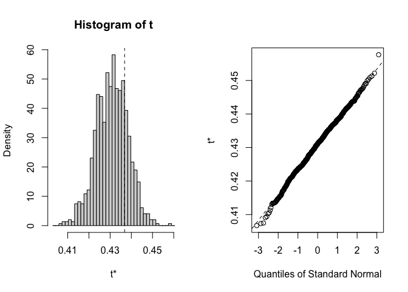
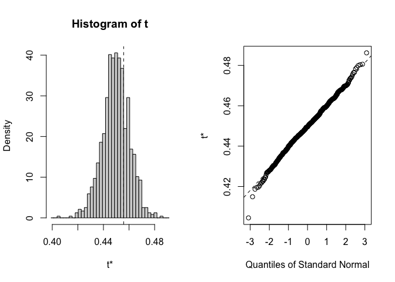
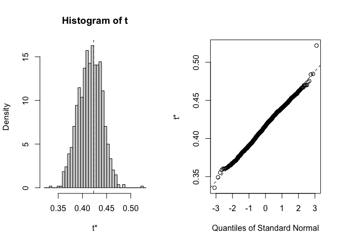
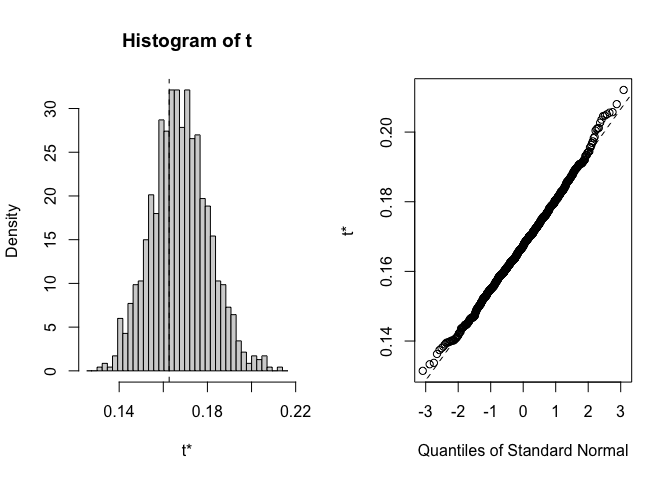
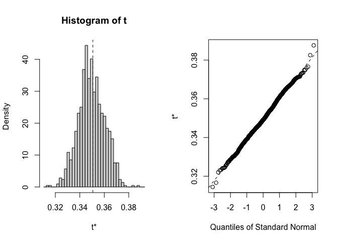
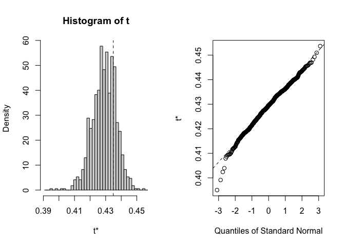
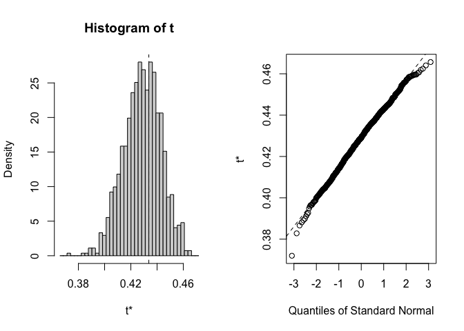

# Climate Distance at the WL2 Garden

## Relevant Libraries and Functions


``` r
library(raster)
```

```
## Loading required package: sp
```

``` r
library(tidyverse)
```

```
## ── Attaching core tidyverse packages ──────────────────────── tidyverse 2.0.0 ──
## ✔ dplyr     1.1.4     ✔ readr     2.1.5
## ✔ forcats   1.0.0     ✔ stringr   1.5.1
## ✔ ggplot2   3.5.1     ✔ tibble    3.2.1
## ✔ lubridate 1.9.3     ✔ tidyr     1.3.1
## ✔ purrr     1.0.2
```

```
## ── Conflicts ────────────────────────────────────────── tidyverse_conflicts() ──
## ✖ tidyr::extract() masks raster::extract()
## ✖ dplyr::filter()  masks stats::filter()
## ✖ dplyr::lag()     masks stats::lag()
## ✖ dplyr::select()  masks raster::select()
## ℹ Use the conflicted package (<http://conflicted.r-lib.org/>) to force all conflicts to become errors
```

``` r
library(conflicted)
conflicts_prefer(dplyr::select())
```

```
## [conflicted] Will prefer dplyr::select over any other package.
```

``` r
conflicts_prefer(dplyr::filter)
```

```
## [conflicted] Will prefer dplyr::filter over any other package.
```

``` r
library(cowplot)
library(boot)
library(broom)
library(ggpubr) #for ggarange 

sem <- function(x, na.rm=FALSE) {
  sd(x,na.rm=na.rm)/sqrt(length(na.omit(x)))
} #standard error function 

get_legend<-function(myggplot){
  tmp <- ggplot_gtable(ggplot_build(myggplot))
  leg <- which(sapply(tmp$grobs, function(x) x$name) == "guide-box")
  legend <- tmp$grobs[[leg]]
  return(legend)
} #legend function for grid_arrange

elev_three_palette <- c("#0043F0", "#C9727F", "#F5A540") #colors from Gremer et al 2019
elev_order <- c("High", "Mid", "Low")
```

## WL2 Climate Data (July 2023-Dec 2023)

### From Flint (changed this from Magney MetStation)

Per growth season code: Last month = snowpack. \> 70 mm OR pck > 0 and min temp < 0 OR min temp < -5 (moderate freeze)

``` r
WL2_climate <- read_csv("../output/Climate/flint_climate_UCDpops.csv") %>% 
  filter(parent.pop=="WL2_Garden") %>% 
  filter(year==2023) %>% 
  mutate(tavg = (tmn + tmx)/2, t_diurnal = (tmx-tmn))
```

```
## Rows: 38775 Columns: 14
## ── Column specification ────────────────────────────────────────────────────────
## Delimiter: ","
## chr  (3): parent.pop, elevation.group, month
## dbl (11): elev_m, Lat, Long, year, aet, cwd, pck, pet, ppt, tmn, tmx
## 
## ℹ Use `spec()` to retrieve the full column specification for this data.
## ℹ Specify the column types or set `show_col_types = FALSE` to quiet this message.
```

``` r
head(WL2_climate)
```

```
## # A tibble: 6 × 16
##   parent.pop elevation.group elev_m   Lat  Long  year month    aet   cwd    pck
##   <chr>      <chr>            <dbl> <dbl> <dbl> <dbl> <chr>  <dbl> <dbl>  <dbl>
## 1 WL2_Garden High              2020  38.8 -120.  2023 apr    41.5   46.4 1787. 
## 2 WL2_Garden High              2020  38.8 -120.  2023 aug   106.    43.8    0  
## 3 WL2_Garden High              2020  38.8 -120.  2023 dec     2.78  24.6   16.9
## 4 WL2_Garden High              2020  38.8 -120.  2023 feb     8.62  22.4 1422. 
## 5 WL2_Garden High              2020  38.8 -120.  2023 jan     7.23  16.4 1208. 
## 6 WL2_Garden High              2020  38.8 -120.  2023 jul    75.7  100.     0  
## # ℹ 6 more variables: pet <dbl>, ppt <dbl>, tmn <dbl>, tmx <dbl>, tavg <dbl>,
## #   t_diurnal <dbl>
```

``` r
summary(WL2_climate)
```

```
##   parent.pop        elevation.group        elev_m          Lat       
##  Length:12          Length:12          Min.   :2020   Min.   :38.83  
##  Class :character   Class :character   1st Qu.:2020   1st Qu.:38.83  
##  Mode  :character   Mode  :character   Median :2020   Median :38.83  
##                                        Mean   :2020   Mean   :38.83  
##                                        3rd Qu.:2020   3rd Qu.:38.83  
##                                        Max.   :2020   Max.   :38.83  
##       Long             year         month                aet        
##  Min.   :-120.3   Min.   :2023   Length:12          Min.   :  2.78  
##  1st Qu.:-120.3   1st Qu.:2023   Class :character   1st Qu.:  6.98  
##  Median :-120.3   Median :2023   Mode  :character   Median : 37.69  
##  Mean   :-120.3   Mean   :2023                      Mean   : 44.95  
##  3rd Qu.:-120.3   3rd Qu.:2023                      3rd Qu.: 78.27  
##  Max.   :-120.3   Max.   :2023                      Max.   :115.16  
##       cwd              pck              pet              ppt        
##  Min.   : 14.83   Min.   :   0.0   Min.   : 23.60   Min.   :  0.01  
##  1st Qu.: 24.06   1st Qu.:   0.0   1st Qu.: 34.08   1st Qu.: 36.49  
##  Median : 38.83   Median : 292.8   Median : 81.55   Median : 68.33  
##  Mean   : 42.14   Mean   : 690.0   Mean   : 87.09   Mean   :161.87  
##  3rd Qu.: 49.56   3rd Qu.:1323.9   3rd Qu.:134.12   3rd Qu.:175.70  
##  Max.   :100.37   Max.   :1986.3   Max.   :176.10   Max.   :604.81  
##       tmn              tmx             tavg          t_diurnal    
##  Min.   :-6.150   Min.   : 2.13   Min.   :-2.010   Min.   : 8.16  
##  1st Qu.:-2.510   1st Qu.: 6.76   1st Qu.: 2.500   1st Qu.: 9.42  
##  Median : 1.540   Median :11.87   Median : 6.660   Median :10.24  
##  Mean   : 2.315   Mean   :12.62   Mean   : 7.465   Mean   :10.30  
##  3rd Qu.: 6.145   3rd Qu.:17.52   3rd Qu.:11.832   3rd Qu.:11.32  
##  Max.   :13.220   Max.   :25.95   Max.   :19.585   Max.   :12.73
```

``` r
WL2_climate_growmos <- WL2_climate %>% 
  filter(month=="jul" | month=="aug" | month=="sep" | month=="oct" |
           month=="nov" | month=="dec") #included Dec as the "last month" per growth season code 
#Last month = snowpack > 70 mm OR pck > 0 and min temp < 0 OR min temp < -5 (moderate freeze)
WL2_climate %>% filter(month=="dec")
```

```
## # A tibble: 1 × 16
##   parent.pop elevation.group elev_m   Lat  Long  year month   aet   cwd   pck
##   <chr>      <chr>            <dbl> <dbl> <dbl> <dbl> <chr> <dbl> <dbl> <dbl>
## 1 WL2_Garden High              2020  38.8 -120.  2023 dec    2.78  24.6  16.9
## # ℹ 6 more variables: pet <dbl>, ppt <dbl>, tmn <dbl>, tmx <dbl>, tavg <dbl>,
## #   t_diurnal <dbl>
```

``` r
WL2_climate_flint <- WL2_climate_growmos %>% #get the means for the variables to compare to home sites 
  summarise(cwd_WL2=mean(cwd),ppt_WL2=mean(ppt), pck_WL2=mean(pck), tmn_WL2=mean(tmn), tmx_WL2=mean(tmx))
WL2_climate_flint
```

```
## # A tibble: 1 × 5
##   cwd_WL2 ppt_WL2 pck_WL2 tmn_WL2 tmx_WL2
##     <dbl>   <dbl>   <dbl>   <dbl>   <dbl>
## 1    54.7    61.5    2.81    6.29    16.8
```

## WL2 Climate Trends


``` r
WL2_climate$month <- factor(WL2_climate$month, levels = c("jan", "feb", "mar", "apr", "may", "jun", "jul", "aug", "sep", "oct","nov","dec"))

WL2_climate %>% 
  ggplot(aes(x=month,y=cwd)) +
  geom_point()
```

<!-- -->

``` r
WL2_climate %>% 
  ggplot(aes(x=month,y=pck)) +
  geom_point() +
  facet_wrap(~year)
```

<!-- -->

``` r
WL2_climate %>% 
  ggplot(aes(x=month,y=tmx)) +
  geom_point()
```

<!-- -->

``` r
WL2_climate %>% 
  ggplot(aes(x=month,y=tmn)) +
  geom_point()
```

<!-- -->

``` r
WL2_climate %>% 
  ggplot(aes(x=month,y=ppt)) +
  geom_point()
```

<!-- -->

``` r
WL2_climate %>% 
  filter(if_else(pck>70, pck>70, 
                 if_else(pck>0, tmn < 0, tmn <= -5)))
```

```
## # A tibble: 7 × 16
##   parent.pop elevation.group elev_m   Lat  Long  year month    aet   cwd    pck
##   <chr>      <chr>            <dbl> <dbl> <dbl> <dbl> <fct>  <dbl> <dbl>  <dbl>
## 1 WL2_Garden High              2020  38.8 -120.  2023 apr    41.5   46.4 1787. 
## 2 WL2_Garden High              2020  38.8 -120.  2023 dec     2.78  24.6   16.9
## 3 WL2_Garden High              2020  38.8 -120.  2023 feb     8.62  22.4 1422. 
## 4 WL2_Garden High              2020  38.8 -120.  2023 jan     7.23  16.4 1208. 
## 5 WL2_Garden High              2020  38.8 -120.  2023 jun   115.    34.5  569. 
## 6 WL2_Garden High              2020  38.8 -120.  2023 mar    33.9   14.8 1986. 
## 7 WL2_Garden High              2020  38.8 -120.  2023 may    85.9   43.1 1291. 
## # ℹ 6 more variables: pet <dbl>, ppt <dbl>, tmn <dbl>, tmx <dbl>, tavg <dbl>,
## #   t_diurnal <dbl>
```

``` r
#Dec is the first month after the start of the garden that met these conditions 
```


### BioClim

Calculating wettest, driest, warmest, and coldest months


``` r
WL2_wettest_month <- WL2_climate_growmos %>%  
  slice_max(ppt)

WL2_driest_month <- WL2_climate_growmos %>% 
  slice_min(ppt)

WL2_warmest_month <- WL2_climate_growmos %>% 
  slice_max(tavg)

WL2_coldest_month <- WL2_climate_growmos %>%
  slice_min(tavg)
```

Bio 1, 2, 4, 7, 12, 15


``` r
bioclim_WL2_calc <- WL2_climate_growmos %>% 
  summarise(ann_tmean=mean(tavg),  #Bio1 - Annual Mean Temperature
            mean_diurnal_range=mean(t_diurnal), #Bio2 - Mean Diurnal Range
            temp_seasonality=sd(tavg), #Bio4 - Temperature Seasonality
            temp_ann_range=(max(tmx))-(min(tmn)), #bio7 - temp annual range
            ann_ppt=sum(ppt), #bio12 - annual precip
            ppt_seasonality=cv(ppt+1)) #bio15 - Precipitation Seasonality (+1 to avoid strange CVs for areas where mean rainfaill is < 1)
bioclim_WL2_calc
```

```
## # A tibble: 1 × 6
##   ann_tmean mean_diurnal_range temp_seasonality temp_ann_range ann_ppt
##       <dbl>              <dbl>            <dbl>          <dbl>   <dbl>
## 1      11.6               10.5             6.58           26.4    369.
## # ℹ 1 more variable: ppt_seasonality <dbl>
```

Bio 8(Q), 9(Q), 18(Q), 19(Q)


``` r
#bio8 = tmean_wettest_month
bio8_WL2 <- WL2_wettest_month %>% 
  dplyr::select(tmean_wettest_month=tavg)

#bio9 = tmean_driest_month
bio9_WL2 <- WL2_driest_month %>% 
  dplyr::select(tmean_driest_month=tavg)

bio8_9_WL2 <- bind_cols(bio8_WL2, bio9_WL2)

#bio18 = ppt_warmest_month
bio18_WL2 <- WL2_warmest_month %>% 
  dplyr::select(ppt_warmest_month=ppt)

#bio19 = ppt_coldest_month
bio19_WL2 <- WL2_wettest_month %>% 
  dplyr::select(ppt_coldest_month=ppt)

bio18_19_WL2 <- bind_cols(bio18_WL2, bio19_WL2)

all_periods_WL2 <- bind_cols(bio8_9_WL2, bio18_19_WL2)
```

Merge all bioclims


``` r
WL2_bioclim_final <- bind_cols(bioclim_WL2_calc, all_periods_WL2) %>% 
  rename_with(~paste0(., "_WL2"), 1:10)
summary(WL2_bioclim_final)
```

```
##  ann_tmean_WL2   mean_diurnal_range_WL2 temp_seasonality_WL2 temp_ann_range_WL2
##  Min.   :11.56   Min.   :10.54          Min.   :6.58         Min.   :26.43     
##  1st Qu.:11.56   1st Qu.:10.54          1st Qu.:6.58         1st Qu.:26.43     
##  Median :11.56   Median :10.54          Median :6.58         Median :26.43     
##  Mean   :11.56   Mean   :10.54          Mean   :6.58         Mean   :26.43     
##  3rd Qu.:11.56   3rd Qu.:10.54          3rd Qu.:6.58         3rd Qu.:26.43     
##  Max.   :11.56   Max.   :10.54          Max.   :6.58         Max.   :26.43     
##   ann_ppt_WL2    ppt_seasonality_WL2 tmean_wettest_month_WL2
##  Min.   :368.9   Min.   :88.03       Min.   :3.6            
##  1st Qu.:368.9   1st Qu.:88.03       1st Qu.:3.6            
##  Median :368.9   Median :88.03       Median :3.6            
##  Mean   :368.9   Mean   :88.03       Mean   :3.6            
##  3rd Qu.:368.9   3rd Qu.:88.03       3rd Qu.:3.6            
##  Max.   :368.9   Max.   :88.03       Max.   :3.6            
##  tmean_driest_month_WL2 ppt_warmest_month_WL2 ppt_coldest_month_WL2
##  Min.   :19.59          Min.   :0.01          Min.   :156.2        
##  1st Qu.:19.59          1st Qu.:0.01          1st Qu.:156.2        
##  Median :19.59          Median :0.01          Median :156.2        
##  Mean   :19.59          Mean   :0.01          Mean   :156.2        
##  3rd Qu.:19.59          3rd Qu.:0.01          3rd Qu.:156.2        
##  Max.   :19.59          Max.   :0.01          Max.   :156.2
```

### Export 

``` r
wl2_flint_bioclim_grwssn <- cbind(WL2_climate_flint, WL2_bioclim_final)
#write_csv(wl2_flint_bioclim_grwssn, "../output/Climate/WL2_Garden_GrwSsnClim_2023.csv")
```

## For 2024 (June-Nov 2024)

### From Flint

Per growth season code: Last month = snowpack. \> 70 mm OR pck > 0 and min temp < 0 OR min temp < -5 (moderate freeze)

``` r
WL2_climate_2024 <- read_csv("../output/Climate/flint_climate_UCDpops.csv") %>% 
  filter(parent.pop=="WL2_Garden") %>% 
  filter(year==2024) %>% 
  mutate(tavg = (tmn + tmx)/2, t_diurnal = (tmx-tmn))
```

```
## Rows: 38775 Columns: 14
## ── Column specification ────────────────────────────────────────────────────────
## Delimiter: ","
## chr  (3): parent.pop, elevation.group, month
## dbl (11): elev_m, Lat, Long, year, aet, cwd, pck, pet, ppt, tmn, tmx
## 
## ℹ Use `spec()` to retrieve the full column specification for this data.
## ℹ Specify the column types or set `show_col_types = FALSE` to quiet this message.
```

``` r
head(WL2_climate_2024)
```

```
## # A tibble: 6 × 16
##   parent.pop elevation.group elev_m   Lat  Long  year month   aet   cwd   pck
##   <chr>      <chr>            <dbl> <dbl> <dbl> <dbl> <chr> <dbl> <dbl> <dbl>
## 1 WL2_Garden High              2020  38.8 -120.  2024 apr   44.5   45.4  401.
## 2 WL2_Garden High              2020  38.8 -120.  2024 aug   54.8   94.1    0 
## 3 WL2_Garden High              2020  38.8 -120.  2024 feb    6.49  25.6  406.
## 4 WL2_Garden High              2020  38.8 -120.  2024 jan    5.02  19.8  209.
## 5 WL2_Garden High              2020  38.8 -120.  2024 jul   76    105.     0 
## 6 WL2_Garden High              2020  38.8 -120.  2024 jun   73.0   94.5    0 
## # ℹ 6 more variables: pet <dbl>, ppt <dbl>, tmn <dbl>, tmx <dbl>, tavg <dbl>,
## #   t_diurnal <dbl>
```

``` r
summary(WL2_climate_2024)
```

```
##   parent.pop        elevation.group        elev_m          Lat       
##  Length:12          Length:12          Min.   :2020   Min.   :38.83  
##  Class :character   Class :character   1st Qu.:2020   1st Qu.:38.83  
##  Mode  :character   Mode  :character   Median :2020   Median :38.83  
##                                        Mean   :2020   Mean   :38.83  
##                                        3rd Qu.:2020   3rd Qu.:38.83  
##                                        Max.   :2020   Max.   :38.83  
##       Long             year         month                aet        
##  Min.   :-120.3   Min.   :2024   Length:12          Min.   : 3.000  
##  1st Qu.:-120.3   1st Qu.:2024   Class :character   1st Qu.: 5.305  
##  Median :-120.3   Median :2024   Mode  :character   Median :32.820  
##  Mean   :-120.3   Mean   :2024                      Mean   :34.413  
##  3rd Qu.:-120.3   3rd Qu.:2024                      3rd Qu.:59.362  
##  Max.   :-120.3   Max.   :2024                      Max.   :76.000  
##       cwd              pck              pet              ppt        
##  Min.   : 15.64   Min.   :  0.00   Min.   : 24.80   Min.   :  0.53  
##  1st Qu.: 25.36   1st Qu.:  0.00   1st Qu.: 31.98   1st Qu.: 12.61  
##  Median : 50.41   Median : 20.17   Median : 84.80   Median : 52.15  
##  Mean   : 56.20   Mean   :145.78   Mean   : 90.61   Mean   :110.80  
##  3rd Qu.: 92.16   3rd Qu.:257.25   3rd Qu.:135.70   3rd Qu.:229.31  
##  Max.   :104.90   Max.   :613.58   Max.   :180.90   Max.   :322.46  
##       tmn              tmx              tavg          t_diurnal     
##  Min.   :-4.250   Min.   : 3.930   Min.   :-0.160   Min.   : 8.180  
##  1st Qu.:-3.167   1st Qu.: 6.145   1st Qu.: 1.456   1st Qu.: 8.885  
##  Median : 1.630   Median :12.740   Median : 7.053   Median :11.240  
##  Mean   : 3.593   Mean   :13.877   Mean   : 8.735   Mean   :10.283  
##  3rd Qu.:10.635   3rd Qu.:22.050   3rd Qu.:16.367   3rd Qu.:11.350  
##  Max.   :15.280   Max.   :27.110   Max.   :21.195   Max.   :11.830
```

``` r
WL2_climate_2024_growmos <- WL2_climate_2024 %>% 
  filter(month== "jun" | month=="jul" | month=="aug" | month=="sep" | month=="oct" |
           month=="nov") #included Nov as the "last month" per growth season code 
#Last month = snowpack > 70 mm OR pck > 0 and min temp < 0 OR min temp < -5 (moderate freeze)
WL2_climate_2024 %>% filter(month=="nov")
```

```
## # A tibble: 1 × 16
##   parent.pop elevation.group elev_m   Lat  Long  year month   aet   cwd   pck
##   <chr>      <chr>            <dbl> <dbl> <dbl> <dbl> <chr> <dbl> <dbl> <dbl>
## 1 WL2_Garden High              2020  38.8 -120.  2024 nov       3  28.6  40.3
## # ℹ 6 more variables: pet <dbl>, ppt <dbl>, tmn <dbl>, tmx <dbl>, tavg <dbl>,
## #   t_diurnal <dbl>
```

``` r
WL2_climate_2024_flint <- WL2_climate_2024_growmos %>% #get the means for the variables to compare to home sites 
  summarise(cwd_WL2=mean(cwd),ppt_WL2=mean(ppt), pck_WL2=mean(pck), tmn_WL2=mean(tmn), tmx_WL2=mean(tmx))
WL2_climate_2024_flint
```

```
## # A tibble: 1 × 5
##   cwd_WL2 ppt_WL2 pck_WL2 tmn_WL2 tmx_WL2
##     <dbl>   <dbl>   <dbl>   <dbl>   <dbl>
## 1    81.3    33.2    6.72    8.72    19.9
```


``` r
WL2_climate_2024$month <- factor(WL2_climate_2024$month, levels = c("jan", "feb", "mar", "apr", "may", "jun", "jul", "aug", "sep", "oct","nov","dec"))

WL2_climate_2024 %>% 
  ggplot(aes(x=month,y=cwd)) +
  geom_point()
```

<!-- -->

``` r
WL2_climate_2024 %>% 
  ggplot(aes(x=month,y=pck)) +
  geom_point() +
  facet_wrap(~year)
```

<!-- -->

``` r
WL2_climate_2024 %>% 
  ggplot(aes(x=month,y=tmx)) +
  geom_point()
```

<!-- -->

``` r
WL2_climate_2024 %>% 
  ggplot(aes(x=month,y=tmn)) +
  geom_point()
```

<!-- -->

``` r
WL2_climate_2024 %>% 
  ggplot(aes(x=month,y=ppt)) +
  geom_point()
```

<!-- -->

``` r
WL2_climate_2024 %>% 
  filter(if_else(pck>70, pck>70, 
                 if_else(pck>0, tmn < 0, tmn <= -5)))
```

```
## # A tibble: 6 × 16
##   parent.pop elevation.group elev_m   Lat  Long  year month   aet   cwd   pck
##   <chr>      <chr>            <dbl> <dbl> <dbl> <dbl> <fct> <dbl> <dbl> <dbl>
## 1 WL2_Garden High              2020  38.8 -120.  2024 apr   44.5   45.4 401. 
## 2 WL2_Garden High              2020  38.8 -120.  2024 feb    6.49  25.6 406. 
## 3 WL2_Garden High              2020  38.8 -120.  2024 jan    5.02  19.8 209. 
## 4 WL2_Garden High              2020  38.8 -120.  2024 mar   38.9   15.6 614. 
## 5 WL2_Garden High              2020  38.8 -120.  2024 nov    3     28.6  40.3
## 6 WL2_Garden High              2020  38.8 -120.  2024 dec    3.2   24.6  79.2
## # ℹ 6 more variables: pet <dbl>, ppt <dbl>, tmn <dbl>, tmx <dbl>, tavg <dbl>,
## #   t_diurnal <dbl>
```

``` r
#Dec is the first month after the start of the garden that met these conditions 
```

### BioClim

Calculating wettest, driest, warmest, and coldest months


``` r
WL2_wettest_month_2024 <- WL2_climate_2024_growmos %>%  
  slice_max(ppt)

WL2_driest_month_2024 <- WL2_climate_2024_growmos %>% 
  slice_min(ppt)

WL2_warmest_month_2024 <- WL2_climate_2024_growmos %>% 
  slice_max(tavg)

WL2_coldest_month_2024 <- WL2_climate_2024_growmos %>%
  slice_min(tavg)
```

Bio 1, 2, 4, 7, 12, 15


``` r
bioclim_WL2_calc_2024 <- WL2_climate_2024_growmos %>% 
  summarise(ann_tmean=mean(tavg),  #Bio1 - Annual Mean Temperature
            mean_diurnal_range=mean(t_diurnal), #Bio2 - Mean Diurnal Range
            temp_seasonality=sd(tavg), #Bio4 - Temperature Seasonality
            temp_ann_range=(max(tmx))-(min(tmn)), #bio7 - temp annual range
            ann_ppt=sum(ppt), #bio12 - annual precip
            ppt_seasonality=cv(ppt+1)) #bio15 - Precipitation Seasonality (+1 to avoid strange CVs for areas where mean rainfaill is < 1)
bioclim_WL2_calc_2024
```

```
## # A tibble: 1 × 6
##   ann_tmean mean_diurnal_range temp_seasonality temp_ann_range ann_ppt
##       <dbl>              <dbl>            <dbl>          <dbl>   <dbl>
## 1      14.3               11.1             6.73           30.1    199.
## # ℹ 1 more variable: ppt_seasonality <dbl>
```

Bio 8(Q), 9(Q), 18(Q), 19(Q)


``` r
#bio8 = tmean_wettest_month
bio8_WL2_2024 <- WL2_wettest_month_2024 %>% 
  dplyr::select(tmean_wettest_month=tavg)

#bio9 = tmean_driest_month
bio9_WL2_2024 <- WL2_driest_month_2024 %>% 
  dplyr::select(tmean_driest_month=tavg)

bio8_9_WL2_2024 <- bind_cols(bio8_WL2_2024, bio9_WL2_2024)

#bio18 = ppt_warmest_month
bio18_WL2_2024 <- WL2_warmest_month_2024 %>% 
  dplyr::select(ppt_warmest_month=ppt)

#bio19 = ppt_coldest_month
bio19_WL2_2024 <- WL2_wettest_month_2024 %>% 
  dplyr::select(ppt_coldest_month=ppt)

bio18_19_WL2_2024 <- bind_cols(bio18_WL2_2024, bio19_WL2_2024)

all_periods_WL2_2024 <- bind_cols(bio8_9_WL2_2024, bio18_19_WL2_2024)
```

Merge all bioclims


``` r
WL2_bioclim_final_2024 <- bind_cols(bioclim_WL2_calc_2024, all_periods_WL2_2024) %>% 
  rename_with(~paste0(., "_WL2"), 1:10)
summary(WL2_bioclim_final_2024)
```

```
##  ann_tmean_WL2   mean_diurnal_range_WL2 temp_seasonality_WL2 temp_ann_range_WL2
##  Min.   :14.29   Min.   :11.14          Min.   :6.732        Min.   :30.12     
##  1st Qu.:14.29   1st Qu.:11.14          1st Qu.:6.732        1st Qu.:30.12     
##  Median :14.29   Median :11.14          Median :6.732        Median :30.12     
##  Mean   :14.29   Mean   :11.14          Mean   :6.732        Mean   :30.12     
##  3rd Qu.:14.29   3rd Qu.:11.14          3rd Qu.:6.732        3rd Qu.:30.12     
##  Max.   :14.29   Max.   :11.14          Max.   :6.732        Max.   :30.12     
##   ann_ppt_WL2    ppt_seasonality_WL2 tmean_wettest_month_WL2
##  Min.   :198.9   Min.   :161.9       Min.   :1.735          
##  1st Qu.:198.9   1st Qu.:161.9       1st Qu.:1.735          
##  Median :198.9   Median :161.9       Median :1.735          
##  Mean   :198.9   Mean   :161.9       Mean   :1.735          
##  3rd Qu.:198.9   3rd Qu.:161.9       3rd Qu.:1.735          
##  Max.   :198.9   Max.   :161.9       Max.   :1.735          
##  tmean_driest_month_WL2 ppt_warmest_month_WL2 ppt_coldest_month_WL2
##  Min.   :16.45          Min.   :5.62          Min.   :144.6        
##  1st Qu.:16.45          1st Qu.:5.62          1st Qu.:144.6        
##  Median :16.45          Median :5.62          Median :144.6        
##  Mean   :16.45          Mean   :5.62          Mean   :144.6        
##  3rd Qu.:16.45          3rd Qu.:5.62          3rd Qu.:144.6        
##  Max.   :16.45          Max.   :5.62          Max.   :144.6
```

### Export 

``` r
wl2_flint_bioclim_grwssn_2024 <- cbind(WL2_climate_2024_flint, WL2_bioclim_final_2024)
#write_csv(wl2_flint_bioclim_grwssn_2024, "../output/Climate/WL2_Garden_GrwSsnClim_2024.csv")
```

## Gower's Climate Distance

(1/P) \* SUM ((absolute value(Ai - Bi)) / range(i)) for each variable

-   P = number of environmental variables = 14

-   Ai = 30 year avg of that variable for the home site

-   Bi = July 2023-Dec 2023 avg of that variable for the WL2 garden

-   Range(i) = maximum - minimum of that variable in the whole data set
    (across sites)

### Figure out the range for each variable 


``` r
WL2_climate_all <- bind_cols(WL2_climate_flint, WL2_bioclim_final)

WL2_range_prep <- WL2_climate_all %>% 
  mutate(parent.pop="WL2") %>% 
  rename_with(~str_remove(., "_WL2"), everything())
```

### Bootstrapping 
#### Load data with all 30 years

``` r
recent_clim_boot <- read_csv("../output/Climate/growthseason_yrly_avgs_Recent.csv")
```

```
## Rows: 690 Columns: 21
## ── Column specification ────────────────────────────────────────────────────────
## Delimiter: ","
## chr  (2): parent.pop, elevation.group
## dbl (19): elev_m, Lat, Long, year, cwd, pck, ppt, tmn, tmx, ann_tmean, mean_...
## 
## ℹ Use `spec()` to retrieve the full column specification for this data.
## ℹ Specify the column types or set `show_col_types = FALSE` to quiet this message.
```

``` r
recent_clim_boot_nest <- recent_clim_boot %>% nest(.by=year) #nest to prepare for bootstrapping 
recent_clim_boot_nest
```

```
## # A tibble: 30 × 2
##     year data              
##    <dbl> <list>            
##  1  1994 <tibble [23 × 20]>
##  2  1995 <tibble [23 × 20]>
##  3  1996 <tibble [23 × 20]>
##  4  1997 <tibble [23 × 20]>
##  5  1998 <tibble [23 × 20]>
##  6  1999 <tibble [23 × 20]>
##  7  2000 <tibble [23 × 20]>
##  8  2001 <tibble [23 × 20]>
##  9  2002 <tibble [23 × 20]>
## 10  2003 <tibble [23 × 20]>
## # ℹ 20 more rows
```

``` r
historical_clim_boot <- read_csv("../output/Climate/growthseason_yrly_avgs_Historical.csv")
```

```
## Rows: 690 Columns: 21
## ── Column specification ────────────────────────────────────────────────────────
## Delimiter: ","
## chr  (2): parent.pop, elevation.group
## dbl (19): elev_m, Lat, Long, year, cwd, pck, ppt, tmn, tmx, ann_tmean, mean_...
## 
## ℹ Use `spec()` to retrieve the full column specification for this data.
## ℹ Specify the column types or set `show_col_types = FALSE` to quiet this message.
```

``` r
historical_clim_boot_nest <- historical_clim_boot %>% nest(.by=year)
historical_clim_boot_nest
```

```
## # A tibble: 30 × 2
##     year data              
##    <dbl> <list>            
##  1  1964 <tibble [23 × 20]>
##  2  1965 <tibble [23 × 20]>
##  3  1966 <tibble [23 × 20]>
##  4  1967 <tibble [23 × 20]>
##  5  1968 <tibble [23 × 20]>
##  6  1969 <tibble [23 × 20]>
##  7  1970 <tibble [23 × 20]>
##  8  1971 <tibble [23 × 20]>
##  9  1972 <tibble [23 × 20]>
## 10  1973 <tibble [23 × 20]>
## # ℹ 20 more rows
```

#### Create the gower_calc function 

``` r
#data <- recent_clim_boot_nest
#P=14

gowers_calc <- function(data, indices, P) { #function with all of the code necessary for calculating gowers distance 
  #data = _clim_boot (recent or historical) - needs to be nested by year; P = # climate variables 

  #need to make WL2_range_prep before running this function 
  
  data <-data[indices,] # subset per bootstrap indices
  
  data <- data %>% unnest(data) #unnest so the function can access the climate data
  
  data_means <- data %>% 
    group_by(parent.pop, elevation.group, elev_m, Lat, Long) %>% 
    summarise_at(c("cwd",  "pck", "ppt", "tmn", "tmx", "ann_tmean", "mean_diurnal_range", 
                   "temp_seasonality", "temp_ann_range",
                 "tmean_wettest_month", "tmean_driest_month", "ann_ppt",
                 "ppt_seasonality","ppt_warmest_month", "ppt_coldest_month"),
               c(mean), na.rm = TRUE) #get 30 year averages for each climate variable 
  
  range_merge <- bind_rows(data_means, WL2_range_prep)
  
  WL2_home_climate_ranges <- range_merge %>% #calculate ranges
    ungroup() %>% 
  summarise(cwd_range=max(cwd)-min(cwd),
            ppt_range=max(ppt)-min(ppt), 
            tmn_range=max(tmn)-min(tmn), 
            tmx_range=max(tmx)-min(tmx), 
            ann_tmean_range=max(ann_tmean)-min(ann_tmean),
            mean_diurnal_range_range=max(mean_diurnal_range)-min(mean_diurnal_range),
            temp_seasonality_range=max(temp_seasonality)-min(temp_seasonality),
            temp_ann_range_range=max(temp_ann_range)-min(temp_ann_range),
            tmean_wettest_month_range=max(tmean_wettest_month)-min(tmean_wettest_month),
            tmean_driest_month_range=max(tmean_driest_month)-min(tmean_driest_month),
            ann_ppt_range=max(ann_ppt)-min(ann_ppt), 
            ppt_seasonality_range=max(ppt_seasonality)-min(ppt_seasonality),
            ppt_warmest_month_range=max(ppt_warmest_month)-min(ppt_warmest_month), 
            ppt_coldest_month_range=max(ppt_coldest_month)-min(ppt_coldest_month))
  
  WL2_home_climate <- bind_cols(WL2_climate_all, data_means) #add WL2 climate data to home climate data 
  
  WL2_home_climate_with_ranges <- bind_cols(WL2_home_climate, WL2_home_climate_ranges) #add in ranges 
  
  gowers_calc_each_var <- WL2_home_climate_with_ranges %>% #variable by variable calc
  mutate(cwd_gowers=abs(cwd_WL2-cwd) / cwd_range,
         ppt_gowers=abs(ppt_WL2 - ppt) / ppt_range,
         tmn_gowers=abs(tmn_WL2 - tmn) / tmn_range,
         tmx_gowers=abs(tmx_WL2 - tmx) / tmx_range,
         ann_tmean_gowers=abs(ann_tmean_WL2 - ann_tmean) / ann_tmean_range,
         mean_diurnal_range_gowers=abs(mean_diurnal_range_WL2 - mean_diurnal_range) / mean_diurnal_range_range,
         temp_seasonality_gowers=abs(temp_seasonality_WL2 - temp_seasonality) / temp_seasonality_range,
         temp_ann_range_gowers=abs(temp_ann_range_WL2 - temp_ann_range) / temp_ann_range_range,
         tmean_wettest_month_gowers=abs(tmean_wettest_month_WL2 - tmean_wettest_month) / tmean_wettest_month_range,
         tmean_driest_month_gowers=abs(tmean_driest_month_WL2 - tmean_driest_month) / tmean_driest_month_range,
         ann_ppt_gowers=abs(ann_ppt_WL2 - ann_ppt) / ann_ppt_range,
         ppt_seasonality_gowers=abs(ppt_seasonality_WL2 - ppt_seasonality) / ppt_seasonality_range,
         ppt_warmest_month_gowers=abs(ppt_warmest_month_WL2 - ppt_warmest_month) / ppt_warmest_month_range,
         ppt_coldest_month_gowers=abs(ppt_coldest_month_WL2 - ppt_coldest_month) / ppt_coldest_month_range) %>% 
  dplyr::select(parent.pop, elevation.group, elev_m, ends_with("_gowers"))

 gowers_calc_per_pop <- gowers_calc_each_var %>% #final gowers calc 
  mutate(Gowers_Dist=(1/P)*(cwd_gowers + ppt_gowers + tmn_gowers + tmx_gowers +
                                ann_tmean_gowers + mean_diurnal_range_gowers +
                                temp_seasonality_gowers +temp_ann_range_gowers +
                                tmean_wettest_month_gowers +
                                tmean_driest_month_gowers +ann_ppt_gowers +
                                ppt_seasonality_gowers + ppt_warmest_month_gowers +
                                ppt_coldest_month_gowers)) %>% 
  dplyr::select(parent.pop, elevation.group, elev_m, Gowers_Dist)
  
 gowers_calc_per_pop %>% pull(Gowers_Dist) #make the result a vector 
   }

#gowers_calc(recent_clim_boot_nest, P=14) #the function works
```

#### Perform the bootstrap sampling 
Recent

``` r
gowers.boot_recent <- boot(data=recent_clim_boot_nest, statistic=gowers_calc, R=1000, P=14) #will sample each row (year) with replacement 
gowers.boot_recent$t0 #looks correct 
```

```
##  [1] 0.2635425 0.3995436 0.3137257 0.3140209 0.4460438 0.4202037 0.4276173
##  [8] 0.3442913 0.3325825 0.3802447 0.2875183 0.2714049 0.2698603 0.2651042
## [15] 0.4104326 0.2871411 0.2416094 0.3856348 0.3715038 0.3595467 0.2164599
## [22] 0.3658794 0.4088624
```

``` r
#str(gowers.boot_recent)

for(i in 1:23) {
  plot(gowers.boot_recent, index=i) #distributions look normal for the most part 
}
```

<!-- --><!-- --><!-- --><!-- --><!-- --><!-- --><!-- --><!-- --><!-- --><!-- --><!-- --><!-- --><!-- --><!-- --><!-- --><!-- --><!-- --><!-- --><!-- --><!-- --><!-- --><!-- --><!-- -->

``` r
#boot.ci(gowers.boot_recent, type="norm", index = 1) # for the first pop
boot_recent_results <- tidy(gowers.boot_recent,conf.int=TRUE,conf.method="norm") %>%  #all pops
  rename(Gowers_Dist = statistic) %>% 
  mutate(TimePd="Recent")
```

Historical

``` r
gowers.boot_historical <- boot(data=historical_clim_boot_nest, statistic=gowers_calc, R=1000, P=14) #will sample each row (year) with replacement 
gowers.boot_historical$t0 #looks correct 
```

```
##  [1] 0.2609243 0.3628520 0.2718604 0.2386181 0.4326808 0.3952824 0.4171163
##  [8] 0.4966899 0.5058235 0.5230159 0.2948553 0.2394600 0.2154007 0.2654491
## [15] 0.4037458 0.2698928 0.2512423 0.3999356 0.3617549 0.4147934 0.2222366
## [22] 0.2923198 0.3419031
```

``` r
#str(gowers.boot_historical)

for(i in 1:23) {
  plot(gowers.boot_historical, index=i) #distributions look normal for the most part 
}
```

<!-- --><!-- --><!-- --><!-- --><!-- --><!-- --><!-- --><!-- --><!-- --><!-- --><!-- --><!-- --><!-- --><!-- --><!-- --><!-- --><!-- --><!-- --><!-- --><!-- --><!-- --><!-- --><!-- -->

``` r
#boot.ci(gowers.boot_historical, type="norm", index = 1) # for the first pop
boot_historical_results <- tidy(gowers.boot_historical,conf.int=TRUE,conf.method="norm") %>%  #all pops
  rename(Gowers_Dist = statistic) %>% 
  mutate(TimePd="Historical")
```

#### Plot the results 

``` r
pops <- recent_clim_boot %>% select(parent.pop, elevation.group, elev_m, Lat, Long) %>% unique()

boot_gowers_recent_pops <- bind_cols(pops, boot_recent_results) %>% arrange(Gowers_Dist)
boot_gowers_historical_pops <- bind_cols(pops, boot_historical_results) %>% arrange(Gowers_Dist)
boot_gowers_results_all <- bind_rows(boot_gowers_recent_pops, boot_gowers_historical_pops)
#write_csv(boot_gowers_results_all, "../output/Climate/growthseason_GowersEnvtalDist_WL2.csv")

recent_fig <- boot_gowers_results_all %>% 
  filter(TimePd=="Recent") %>% 
  ggplot(aes(x=fct_reorder(parent.pop, Gowers_Dist), y=Gowers_Dist, group=parent.pop, fill=elev_m)) +
  geom_col(width = 0.7,position = position_dodge(0.75)) +
  geom_errorbar(aes(ymin=conf.low, ymax=conf.high),
                width=.1, position = position_dodge(0.75)) +
  scale_y_continuous(expand = c(0, 0)) +
  scale_fill_gradient(low = "#F5A540", high = "#0043F0") +
  labs(y="Gowers Envtal Distance \n from WL2", fill="Elevation (m)", x="Population", title = "Recent Climate") +
  theme_classic() +
  theme(text=element_text(size=25), axis.text.x = element_text(angle = 45,  hjust = 1))

historical_fig <- boot_gowers_results_all %>% 
  filter(TimePd=="Historical") %>% 
  ggplot(aes(x=fct_reorder(parent.pop, Gowers_Dist), y=Gowers_Dist, group=parent.pop, fill=elev_m)) +
  geom_col(width = 0.7,position = position_dodge(0.75)) +
  geom_errorbar(aes(ymin=conf.low, ymax=conf.high),
                width=.1, position = position_dodge(0.75)) +
  scale_y_continuous(expand = c(0, 0)) +
  scale_fill_gradient(low = "#F5A540", high = "#0043F0") +
  labs(y="Gowers Envtal Distance \n from WL2", fill="Elevation (m)", x="Population", title="Historic Climate") +
  theme_classic() +
  theme(text=element_text(size=25), axis.text.x = element_text(angle = 45,  hjust = 1)) 
  

plot_grid(historical_fig, recent_fig)
```

<!-- -->

``` r
#ggsave("../output/Climate/growthseason_Gowers_fromWL2.png", width = 24, height = 8, units = "in")
```

## Gower's Distance for 2024

``` r
WL2_climate_2024_all <- bind_cols(WL2_climate_2024_flint, WL2_bioclim_final_2024)

WL2_range_prep_2024 <- WL2_climate_2024_all %>% 
  mutate(parent.pop="WL2") %>% 
  rename_with(~str_remove(., "_WL2"), everything())
```

### Bootstrapping with home climates with avgs up to 2023

#### Create the gower_calc function 

``` r
#data <- recent_clim_boot_nest
#P=14

gowers_calc_2324 <- function(data, indices, P) { #function with all of the code necessary for calculating gowers distance 
  #data = _clim_boot (recent or historical) - needs to be nested by year; P = # climate variables 

  #need to make WL2_range_prep_2024 before running this function 
  
  data <-data[indices,] # subset per bootstrap indices
  
  data <- data %>% unnest(data) #unnest so the function can access the climate data
  
  data_means <- data %>% 
    group_by(parent.pop, elevation.group, elev_m, Lat, Long) %>% 
    summarise_at(c("cwd",  "pck", "ppt", "tmn", "tmx", "ann_tmean", "mean_diurnal_range", 
                   "temp_seasonality", "temp_ann_range",
                 "tmean_wettest_month", "tmean_driest_month", "ann_ppt",
                 "ppt_seasonality","ppt_warmest_month", "ppt_coldest_month"),
               c(mean), na.rm = TRUE) #get 30 year averages for each climate variable 
  
  range_merge <- bind_rows(data_means, WL2_range_prep_2024)
  
  WL2_home_climate_ranges <- range_merge %>% #calculate ranges
    ungroup() %>% 
  summarise(cwd_range=max(cwd)-min(cwd),
            ppt_range=max(ppt)-min(ppt), 
            tmn_range=max(tmn)-min(tmn), 
            tmx_range=max(tmx)-min(tmx), 
            ann_tmean_range=max(ann_tmean)-min(ann_tmean),
            mean_diurnal_range_range=max(mean_diurnal_range)-min(mean_diurnal_range),
            temp_seasonality_range=max(temp_seasonality)-min(temp_seasonality),
            temp_ann_range_range=max(temp_ann_range)-min(temp_ann_range),
            tmean_wettest_month_range=max(tmean_wettest_month)-min(tmean_wettest_month),
            tmean_driest_month_range=max(tmean_driest_month)-min(tmean_driest_month),
            ann_ppt_range=max(ann_ppt)-min(ann_ppt), 
            ppt_seasonality_range=max(ppt_seasonality)-min(ppt_seasonality),
            ppt_warmest_month_range=max(ppt_warmest_month)-min(ppt_warmest_month), 
            ppt_coldest_month_range=max(ppt_coldest_month)-min(ppt_coldest_month))
  
  WL2_home_climate <- bind_cols(WL2_climate_2024_all, data_means) #add WL2 climate data to home climate data 
  
  WL2_home_climate_with_ranges <- bind_cols(WL2_home_climate, WL2_home_climate_ranges) #add in ranges 
  
  gowers_calc_each_var <- WL2_home_climate_with_ranges %>% #variable by variable calc
  mutate(cwd_gowers=abs(cwd_WL2-cwd) / cwd_range,
         ppt_gowers=abs(ppt_WL2 - ppt) / ppt_range,
         tmn_gowers=abs(tmn_WL2 - tmn) / tmn_range,
         tmx_gowers=abs(tmx_WL2 - tmx) / tmx_range,
         ann_tmean_gowers=abs(ann_tmean_WL2 - ann_tmean) / ann_tmean_range,
         mean_diurnal_range_gowers=abs(mean_diurnal_range_WL2 - mean_diurnal_range) / mean_diurnal_range_range,
         temp_seasonality_gowers=abs(temp_seasonality_WL2 - temp_seasonality) / temp_seasonality_range,
         temp_ann_range_gowers=abs(temp_ann_range_WL2 - temp_ann_range) / temp_ann_range_range,
         tmean_wettest_month_gowers=abs(tmean_wettest_month_WL2 - tmean_wettest_month) / tmean_wettest_month_range,
         tmean_driest_month_gowers=abs(tmean_driest_month_WL2 - tmean_driest_month) / tmean_driest_month_range,
         ann_ppt_gowers=abs(ann_ppt_WL2 - ann_ppt) / ann_ppt_range,
         ppt_seasonality_gowers=abs(ppt_seasonality_WL2 - ppt_seasonality) / ppt_seasonality_range,
         ppt_warmest_month_gowers=abs(ppt_warmest_month_WL2 - ppt_warmest_month) / ppt_warmest_month_range,
         ppt_coldest_month_gowers=abs(ppt_coldest_month_WL2 - ppt_coldest_month) / ppt_coldest_month_range) %>% 
  dplyr::select(parent.pop, elevation.group, elev_m, ends_with("_gowers"))

 gowers_calc_per_pop <- gowers_calc_each_var %>% #final gowers calc 
  mutate(Gowers_Dist=(1/P)*(cwd_gowers + ppt_gowers + tmn_gowers + tmx_gowers +
                                ann_tmean_gowers + mean_diurnal_range_gowers +
                                temp_seasonality_gowers +temp_ann_range_gowers +
                                tmean_wettest_month_gowers +
                                tmean_driest_month_gowers +ann_ppt_gowers +
                                ppt_seasonality_gowers + ppt_warmest_month_gowers +
                                ppt_coldest_month_gowers)) %>% 
  dplyr::select(parent.pop, elevation.group, elev_m, Gowers_Dist)
  
 gowers_calc_per_pop %>% pull(Gowers_Dist) #make the result a vector 
   }

#gowers_calc(recent_clim_boot_nest, P=14) #the function works
```

#### Perform the bootstrap sampling 
Recent

``` r
gowers.boot_recent_2324 <- boot(data=recent_clim_boot_nest, statistic=gowers_calc_2324, R=1000, P=14) #will sample each row (year) with replacement 
gowers.boot_recent_2324$t0 #looks correct 
```

```
##  [1] 0.3604293 0.4368284 0.2954925 0.3403122 0.4332053 0.3550931 0.4558030
##  [8] 0.4088586 0.4229161 0.4233162 0.4491223 0.1626642 0.1535530 0.2172890
## [15] 0.5660414 0.2709563 0.2442796 0.3678940 0.3506691 0.4152702 0.2145416
## [22] 0.3596217 0.3669463
```

``` r
#str(gowers.boot_recent)

for(i in 1:23) {
  plot(gowers.boot_recent_2324, index=i) #distributions look normal for the most part 
}
```

<!-- --><!-- --><!-- --><!-- --><!-- --><!-- --><!-- --><!-- --><!-- --><!-- --><!-- --><!-- --><!-- --><!-- --><!-- --><!-- --><!-- --><!-- --><!-- --><!-- --><!-- --><!-- --><!-- -->

``` r
#boot.ci(gowers.boot_recent, type="norm", index = 1) # for the first pop
boot_recent_results_2324 <- tidy(gowers.boot_recent_2324,conf.int=TRUE,conf.method="norm") %>%  #all pops
  rename(Gowers_Dist = statistic) %>% 
  mutate(TimePd="Recent")
```

Historical

``` r
gowers.boot_historical_2324 <- boot(data=historical_clim_boot_nest, statistic=gowers_calc_2324, R=1000, P=14) #will sample each row (year) with replacement 
gowers.boot_historical_2324$t0 #looks correct 
```

```
##  [1] 0.3830705 0.5129300 0.3422471 0.3770376 0.4225424 0.3514953 0.4568829
##  [8] 0.6178324 0.6290415 0.6335605 0.4518851 0.2215212 0.2502301 0.3101070
## [15] 0.5699775 0.2790886 0.3093381 0.3786899 0.3447462 0.4276254 0.2706282
## [22] 0.3478306 0.3506780
```

``` r
#str(gowers.boot_historical)

for(i in 1:23) {
  plot(gowers.boot_historical_2324, index=i) #distributions look normal for the most part 
}
```

<!-- --><!-- --><!-- --><!-- --><!-- --><!-- --><!-- --><!-- --><!-- --><!-- --><!-- --><!-- --><!-- --><!-- --><!-- --><!-- --><!-- --><!-- --><!-- --><!-- --><!-- --><!-- --><!-- -->

``` r
#boot.ci(gowers.boot_historical, type="norm", index = 1) # for the first pop
boot_historical_results_2324 <- tidy(gowers.boot_historical_2324,conf.int=TRUE,conf.method="norm") %>%  #all pops
  rename(Gowers_Dist = statistic) %>% 
  mutate(TimePd="Historical")
```

#### Plot the results 

``` r
pops <- recent_clim_boot %>% select(parent.pop, elevation.group, elev_m, Lat, Long) %>% unique()

boot_gowers_recent_pops <- bind_cols(pops, boot_recent_results_2324) %>% arrange(Gowers_Dist)
boot_gowers_historical_pops <- bind_cols(pops, boot_historical_results_2324) %>% arrange(Gowers_Dist)
boot_gowers_results_2324_all <- bind_rows(boot_gowers_recent_pops, boot_gowers_historical_pops)
write_csv(boot_gowers_results_2324_all, "../output/Climate/growthseason_GowersEnvtalDist_WL2_2324.csv")

recent_fig <- boot_gowers_results_2324_all %>% 
  filter(TimePd=="Recent") %>% 
  ggplot(aes(x=fct_reorder(parent.pop, Gowers_Dist), y=Gowers_Dist, group=parent.pop, fill=elev_m)) +
  geom_col(width = 0.7,position = position_dodge(0.75)) +
  geom_errorbar(aes(ymin=conf.low, ymax=conf.high),
                width=.1, position = position_dodge(0.75)) +
  scale_y_continuous(expand = c(0, 0)) +
  scale_fill_gradient(low = "#F5A540", high = "#0043F0") +
  labs(y="Gowers Envtal Distance \n from WL2", fill="Elevation (m)", x="Population", title = "Recent Climate") +
  theme_classic() +
  theme(text=element_text(size=25), axis.text.x = element_text(angle = 45,  hjust = 1))

historical_fig <- boot_gowers_results_2324_all %>% 
  filter(TimePd=="Historical") %>% 
  ggplot(aes(x=fct_reorder(parent.pop, Gowers_Dist), y=Gowers_Dist, group=parent.pop, fill=elev_m)) +
  geom_col(width = 0.7,position = position_dodge(0.75)) +
  geom_errorbar(aes(ymin=conf.low, ymax=conf.high),
                width=.1, position = position_dodge(0.75)) +
  scale_y_continuous(expand = c(0, 0)) +
  scale_fill_gradient(low = "#F5A540", high = "#0043F0") +
  labs(y="Gowers Envtal Distance \n from WL2", fill="Elevation (m)", x="Population", title="Historic Climate") +
  theme_classic() +
  theme(text=element_text(size=25), axis.text.x = element_text(angle = 45,  hjust = 1)) 
  

plot_grid(historical_fig, recent_fig)
```

<!-- -->

``` r
ggsave("../output/Climate/growthseason_Gowers_fromWL2_2324.png", width = 24, height = 8, units = "in")
```

### Bootstrapping with home climates with avgs up to 2024

#### Load data with all 30 years

``` r
recent_clim_boot_2024 <- read_csv("../output/Climate/growthseason_yrly_avgs_Recent_2024.csv")
```

```
## Rows: 690 Columns: 21
## ── Column specification ────────────────────────────────────────────────────────
## Delimiter: ","
## chr  (2): parent.pop, elevation.group
## dbl (19): elev_m, Lat, Long, year, cwd, pck, ppt, tmn, tmx, ann_tmean, mean_...
## 
## ℹ Use `spec()` to retrieve the full column specification for this data.
## ℹ Specify the column types or set `show_col_types = FALSE` to quiet this message.
```

``` r
recent_clim_boot_2024_nest <- recent_clim_boot_2024 %>% nest(.by=year) #nest to prepare for bootstrapping 
recent_clim_boot_2024_nest
```

```
## # A tibble: 30 × 2
##     year data              
##    <dbl> <list>            
##  1  1995 <tibble [23 × 20]>
##  2  1996 <tibble [23 × 20]>
##  3  1997 <tibble [23 × 20]>
##  4  1998 <tibble [23 × 20]>
##  5  1999 <tibble [23 × 20]>
##  6  2000 <tibble [23 × 20]>
##  7  2001 <tibble [23 × 20]>
##  8  2002 <tibble [23 × 20]>
##  9  2003 <tibble [23 × 20]>
## 10  2004 <tibble [23 × 20]>
## # ℹ 20 more rows
```

``` r
historical_clim_boot_2024 <- read_csv("../output/Climate/growthseason_yrly_avgs_Historical_2024.csv")
```

```
## Rows: 690 Columns: 21
## ── Column specification ────────────────────────────────────────────────────────
## Delimiter: ","
## chr  (2): parent.pop, elevation.group
## dbl (19): elev_m, Lat, Long, year, cwd, pck, ppt, tmn, tmx, ann_tmean, mean_...
## 
## ℹ Use `spec()` to retrieve the full column specification for this data.
## ℹ Specify the column types or set `show_col_types = FALSE` to quiet this message.
```

``` r
historical_clim_boot_2024_nest <- historical_clim_boot_2024 %>% nest(.by=year)
historical_clim_boot_2024_nest
```

```
## # A tibble: 30 × 2
##     year data              
##    <dbl> <list>            
##  1  1965 <tibble [23 × 20]>
##  2  1966 <tibble [23 × 20]>
##  3  1967 <tibble [23 × 20]>
##  4  1968 <tibble [23 × 20]>
##  5  1969 <tibble [23 × 20]>
##  6  1970 <tibble [23 × 20]>
##  7  1971 <tibble [23 × 20]>
##  8  1972 <tibble [23 × 20]>
##  9  1973 <tibble [23 × 20]>
## 10  1974 <tibble [23 × 20]>
## # ℹ 20 more rows
```

#### Create the gower_calc function 

``` r
#data <- recent_clim_boot_2024_nest
#P=14

gowers_calc_2024 <- function(data, indices, P) { #function with all of the code necessary for calculating gowers distance 
  #data = _clim_boot_2024 (recent or historical) - needs to be nested by year; P = # climate variables 

  #need to make WL2_range_prep_2024 before running this function 
  
  data <-data[indices,] # subset per bootstrap indices
  
  data <- data %>% unnest(data) #unnest so the function can access the climate data
  
  data_means <- data %>% 
    group_by(parent.pop, elevation.group, elev_m, Lat, Long) %>% 
    summarise_at(c("cwd",  "pck", "ppt", "tmn", "tmx", "ann_tmean", "mean_diurnal_range", 
                   "temp_seasonality", "temp_ann_range",
                 "tmean_wettest_month", "tmean_driest_month", "ann_ppt",
                 "ppt_seasonality","ppt_warmest_month", "ppt_coldest_month"),
               c(mean), na.rm = TRUE) #get 30 year averages for each climate variable 
  
  range_merge <- bind_rows(data_means, WL2_range_prep_2024)
  
  WL2_home_climate_ranges <- range_merge %>% #calculate ranges
    ungroup() %>% 
  summarise(cwd_range=max(cwd)-min(cwd),
            ppt_range=max(ppt)-min(ppt), 
            tmn_range=max(tmn)-min(tmn), 
            tmx_range=max(tmx)-min(tmx), 
            ann_tmean_range=max(ann_tmean)-min(ann_tmean),
            mean_diurnal_range_range=max(mean_diurnal_range)-min(mean_diurnal_range),
            temp_seasonality_range=max(temp_seasonality)-min(temp_seasonality),
            temp_ann_range_range=max(temp_ann_range)-min(temp_ann_range),
            tmean_wettest_month_range=max(tmean_wettest_month)-min(tmean_wettest_month),
            tmean_driest_month_range=max(tmean_driest_month)-min(tmean_driest_month),
            ann_ppt_range=max(ann_ppt)-min(ann_ppt), 
            ppt_seasonality_range=max(ppt_seasonality)-min(ppt_seasonality),
            ppt_warmest_month_range=max(ppt_warmest_month)-min(ppt_warmest_month), 
            ppt_coldest_month_range=max(ppt_coldest_month)-min(ppt_coldest_month))
  
  WL2_home_climate <- bind_cols(WL2_climate_2024_all, data_means) #add WL2 climate data to home climate data 
  
  WL2_home_climate_with_ranges <- bind_cols(WL2_home_climate, WL2_home_climate_ranges) #add in ranges 
  
  gowers_calc_each_var <- WL2_home_climate_with_ranges %>% #variable by variable calc
  mutate(cwd_gowers=abs(cwd_WL2-cwd) / cwd_range,
         ppt_gowers=abs(ppt_WL2 - ppt) / ppt_range,
         tmn_gowers=abs(tmn_WL2 - tmn) / tmn_range,
         tmx_gowers=abs(tmx_WL2 - tmx) / tmx_range,
         ann_tmean_gowers=abs(ann_tmean_WL2 - ann_tmean) / ann_tmean_range,
         mean_diurnal_range_gowers=abs(mean_diurnal_range_WL2 - mean_diurnal_range) / mean_diurnal_range_range,
         temp_seasonality_gowers=abs(temp_seasonality_WL2 - temp_seasonality) / temp_seasonality_range,
         temp_ann_range_gowers=abs(temp_ann_range_WL2 - temp_ann_range) / temp_ann_range_range,
         tmean_wettest_month_gowers=abs(tmean_wettest_month_WL2 - tmean_wettest_month) / tmean_wettest_month_range,
         tmean_driest_month_gowers=abs(tmean_driest_month_WL2 - tmean_driest_month) / tmean_driest_month_range,
         ann_ppt_gowers=abs(ann_ppt_WL2 - ann_ppt) / ann_ppt_range,
         ppt_seasonality_gowers=abs(ppt_seasonality_WL2 - ppt_seasonality) / ppt_seasonality_range,
         ppt_warmest_month_gowers=abs(ppt_warmest_month_WL2 - ppt_warmest_month) / ppt_warmest_month_range,
         ppt_coldest_month_gowers=abs(ppt_coldest_month_WL2 - ppt_coldest_month) / ppt_coldest_month_range) %>% 
  dplyr::select(parent.pop, elevation.group, elev_m, ends_with("_gowers"))

 gowers_calc_per_pop <- gowers_calc_each_var %>% #final gowers calc 
  mutate(Gowers_Dist=(1/P)*(cwd_gowers + ppt_gowers + tmn_gowers + tmx_gowers +
                                ann_tmean_gowers + mean_diurnal_range_gowers +
                                temp_seasonality_gowers +temp_ann_range_gowers +
                                tmean_wettest_month_gowers +
                                tmean_driest_month_gowers +ann_ppt_gowers +
                                ppt_seasonality_gowers + ppt_warmest_month_gowers +
                                ppt_coldest_month_gowers)) %>% 
  dplyr::select(parent.pop, elevation.group, elev_m, Gowers_Dist)
  
 gowers_calc_per_pop %>% pull(Gowers_Dist) #make the result a vector 
}

#gowers_calc_2024(recent_clim_boot_2024_nest, P=14) #the function works
```

#### Perform the bootstrap sampling 
Recent

``` r
gowers.boot_2024_recent <- boot(data=recent_clim_boot_2024_nest, statistic=gowers_calc_2024, R=1000, P=14) #will sample each row (year) with replacement 
gowers.boot_2024_recent$t0 #looks correct 
```

```
##  [1] 0.3604549 0.4349017 0.2891208 0.3342579 0.4319967 0.3514377 0.4531280
##  [8] 0.4138239 0.4280110 0.4284327 0.4493119 0.1592520 0.1461985 0.2130096
## [15] 0.5655470 0.2646874 0.2383480 0.3659350 0.3503744 0.4232278 0.2086950
## [22] 0.3534854 0.3603526
```

``` r
#str(gowers.boot_2024_recent)

for(i in 1:23) {
  plot(gowers.boot_2024_recent, index=i) #distributions look normal for the most part 
}
```

<!-- --><!-- --><!-- --><!-- --><!-- --><!-- --><!-- --><!-- --><!-- --><!-- --><!-- --><!-- --><!-- --><!-- --><!-- --><!-- --><!-- --><!-- --><!-- --><!-- --><!-- --><!-- --><!-- -->

``` r
#boot.ci(gowers.boot_2024_recent, type="norm", index = 1) # for the first pop
boot_2024_recent_results <- tidy(gowers.boot_2024_recent,conf.int=TRUE,conf.method="norm") %>%  #all pops
  rename(Gowers_Dist = statistic) %>% 
  mutate(TimePd="Recent")
```

Historical

``` r
gowers.boot_2024_historical <- boot(data=historical_clim_boot_2024_nest, statistic=gowers_calc_2024, R=1000, P=14) #will sample each row (year) with replacement 
gowers.boot_2024_historical$t0 #looks correct 
```

```
##  [1] 0.3815130 0.5097215 0.3362297 0.3709066 0.4179078 0.3489122 0.4559818
##  [8] 0.6148904 0.6261728 0.6309551 0.4471144 0.2165119 0.2445782 0.3039636
## [15] 0.5659563 0.2958361 0.2977602 0.3720416 0.3438238 0.4200726 0.2612496
## [22] 0.3432219 0.3458094
```

``` r
#str(gowers.boot_2024_historical)

for(i in 1:23) {
  plot(gowers.boot_2024_historical, index=i) #distributions look normal for the most part 
}
```

<!-- --><!-- --><!-- --><!-- --><!-- --><!-- --><!-- --><!-- --><!-- --><!-- --><!-- --><!-- --><!-- --><!-- --><!-- --><!-- --><!-- --><!-- --><!-- --><!-- --><!-- --><!-- --><!-- -->

``` r
#boot.ci(gowers.boot_2024_historical, type="norm", index = 1) # for the first pop
boot_2024_historical_results <- tidy(gowers.boot_2024_historical,conf.int=TRUE,conf.method="norm") %>%  #all pops
  rename(Gowers_Dist = statistic) %>% 
  mutate(TimePd="Historical")
```

#### Plot the results 

``` r
pops <- recent_clim_boot_2024 %>% select(parent.pop, elevation.group, elev_m, Lat, Long) %>% unique()

boot_2024_gowers_recent_pops <- bind_cols(pops, boot_2024_recent_results) %>% arrange(Gowers_Dist)
boot_2024_gowers_historical_pops <- bind_cols(pops, boot_2024_historical_results) %>% arrange(Gowers_Dist)
boot_2024_gowers_results_all <- bind_rows(boot_2024_gowers_recent_pops, boot_2024_gowers_historical_pops)
#write_csv(boot_2024_gowers_results_all, "../output/Climate/growthseason_GowersEnvtalDist_WL2_2024.csv")

recent_fig <- boot_2024_gowers_results_all %>% 
  filter(TimePd=="Recent") %>% 
  ggplot(aes(x=fct_reorder(parent.pop, Gowers_Dist), y=Gowers_Dist, group=parent.pop, fill=elev_m)) +
  geom_col(width = 0.7,position = position_dodge(0.75)) +
  geom_errorbar(aes(ymin=conf.low, ymax=conf.high),
                width=.1, position = position_dodge(0.75)) +
  scale_y_continuous(expand = c(0, 0)) +
  scale_fill_gradient(low = "#F5A540", high = "#0043F0") +
  labs(y="Gowers Envtal Distance \n from WL2", fill="Elevation (m)", x="Population", title = "Recent Climate") +
  theme_classic() +
  theme(text=element_text(size=25), axis.text.x = element_text(angle = 45,  hjust = 1))

historical_fig <- boot_2024_gowers_results_all %>% 
  filter(TimePd=="Historical") %>% 
  ggplot(aes(x=fct_reorder(parent.pop, Gowers_Dist), y=Gowers_Dist, group=parent.pop, fill=elev_m)) +
  geom_col(width = 0.7,position = position_dodge(0.75)) +
  geom_errorbar(aes(ymin=conf.low, ymax=conf.high),
                width=.1, position = position_dodge(0.75)) +
  scale_y_continuous(expand = c(0, 0)) +
  scale_fill_gradient(low = "#F5A540", high = "#0043F0") +
  labs(y="Gowers Envtal Distance \n from WL2", fill="Elevation (m)", x="Population", title="Historic Climate") +
  theme_classic() +
  theme(text=element_text(size=25), axis.text.x = element_text(angle = 45,  hjust = 1)) 
  

plot_grid(historical_fig, recent_fig)
```

<!-- -->

``` r
#ggsave("../output/Climate/growthseason_Gowers_fromWL2_2024.png", width = 24, height = 8, units = "in")
```

## Flint Climate Distance

### Gowers

``` r
#need to modify the gowers_calc function to only include Flint variables 
gowers_calc_flint <- function(data, indices, P) { #function with all of the code necessary for calculating gowers distance 
  #data = _clim_boot (recent or historical) - needs to be nested by year; P = # climate variables 
  #need to make WL2_range_prep before running this function 
  
  data <-data[indices,] # subset per bootstrap indices
  
  data <- data %>% unnest(data) #unnest so the function can access the climate data
  
  data_means <- data %>% 
    group_by(parent.pop, elevation.group, elev_m, Lat, Long) %>% 
    summarise_at(c("cwd",  "pck", "ppt", "tmn", "tmx"),
               c(mean), na.rm = TRUE) #get 30 year averages for each climate variable 
  
  range_merge <- bind_rows(data_means, WL2_range_prep)
  
  WL2_home_climate_ranges <- range_merge %>% #calculate ranges
    ungroup() %>% 
  summarise(cwd_range=max(cwd)-min(cwd),
            ppt_range=max(ppt)-min(ppt), 
            tmn_range=max(tmn)-min(tmn), 
            tmx_range=max(tmx)-min(tmx))
  
  WL2_home_climate <- bind_cols(WL2_climate_all, data_means) #add WL2 climate data to home climate data 
  
  WL2_home_climate_with_ranges <- bind_cols(WL2_home_climate, WL2_home_climate_ranges) #add in ranges 
  
  gowers_calc_each_var <- WL2_home_climate_with_ranges %>% #variable by variable calc
  mutate(cwd_gowers=abs(cwd_WL2-cwd) / cwd_range,
         ppt_gowers=abs(ppt_WL2 - ppt) / ppt_range,
         tmn_gowers=abs(tmn_WL2 - tmn) / tmn_range,
         tmx_gowers=abs(tmx_WL2 - tmx) / tmx_range)

 gowers_calc_per_pop <- gowers_calc_each_var %>% #final gowers calc 
  mutate(Gowers_Dist=(1/P)*(cwd_gowers + ppt_gowers + tmn_gowers + tmx_gowers)) %>% 
  dplyr::select(parent.pop, elevation.group, elev_m, Gowers_Dist)
 
 gowers_calc_per_pop %>% pull(Gowers_Dist) #make the result a vector 
   }
```

#### Recent


``` r
recent_clim_boot_flint_nest <- recent_clim_boot %>% select(parent.pop:tmx) %>% nest(.by=year)

gowers.boot_flint_recent <- boot(data=recent_clim_boot_flint_nest, statistic=gowers_calc_flint, R=1000, P=4) #will sample each row (year) with replacement 
gowers.boot_flint_recent$t0 #looks correct 
```

```
##  [1] 0.1342497 0.3444294 0.2159765 0.1814082 0.4461479 0.3864321 0.3568520
##  [8] 0.2210444 0.1790187 0.2780385 0.1981471 0.2666652 0.1890683 0.1856521
## [15] 0.3647894 0.2114090 0.1215880 0.3288313 0.1930237 0.3515170 0.1163193
## [22] 0.2457248 0.3428847
```

``` r
#str(gowers.boot_flint_recent)

for(i in 1:23) {
  plot(gowers.boot_flint_recent, index=i) #distributions look normal for the most part 
}
```

<!-- --><!-- --><!-- --><!-- --><!-- --><!-- --><!-- --><!-- --><!-- --><!-- --><!-- --><!-- --><!-- --><!-- --><!-- --><!-- --><!-- --><!-- --><!-- --><!-- --><!-- --><!-- --><!-- -->

``` r
#boot.ci(gowers.boot_flint_recent, type="norm", index = 1) # for the first pop
boot_flint_recent_results <- tidy(gowers.boot_flint_recent,conf.int=TRUE,conf.method="norm") %>%  #all pops
  rename(Gowers_Dist = statistic) %>% 
  mutate(TimePd="Recent")
```

#### Historic


``` r
historical_clim_boot_flint_nest <- historical_clim_boot %>% select(parent.pop:tmx) %>% nest(.by=year)

gowers.boot_flint_historical <- boot(data=historical_clim_boot_flint_nest, statistic=gowers_calc_flint, R=1000, P=4) #will sample each row (year) with replacement 
gowers.boot_flint_historical$t0 #looks correct 
```

```
##  [1] 0.1173174 0.2519930 0.2127223 0.1135669 0.3564393 0.3231472 0.2873135
##  [8] 0.4629101 0.5021871 0.5091928 0.1833841 0.2159866 0.1082097 0.2217731
## [15] 0.3324083 0.1752264 0.1333355 0.2656922 0.1731502 0.3650087 0.1032913
## [22] 0.1864901 0.2966069
```

``` r
#str(gowers.boot_flint_historical)

for(i in 1:23) {
  plot(gowers.boot_flint_historical, index=i) #distributions look normal for the most part 
}
```

<!-- --><!-- --><!-- --><!-- --><!-- --><!-- --><!-- --><!-- --><!-- --><!-- --><!-- --><!-- --><!-- --><!-- --><!-- --><!-- --><!-- --><!-- --><!-- --><!-- --><!-- --><!-- --><!-- -->

``` r
#boot.ci(gowers.boot_flint_historical, type="norm", index = 1) # for the first pop
boot_flint_historical_results <- tidy(gowers.boot_flint_historical,conf.int=TRUE,conf.method="norm") %>%  #all pops
  rename(Gowers_Dist = statistic) %>% 
  mutate(TimePd="Historical")
```

#### Plot the results 


``` r
boot_flint_gowers_recent_pops <- bind_cols(pops, boot_flint_recent_results) %>% arrange(Gowers_Dist)
boot_flint_gowers_historical_pops <- bind_cols(pops, boot_flint_historical_results) %>% arrange(Gowers_Dist)
boot_flint_gowers_results_all <- bind_rows(boot_flint_gowers_recent_pops, boot_flint_gowers_historical_pops)
#write_csv(boot_flint_gowers_results_all, "../output/Climate/growthseason_GowersEnvtalDist_WL2Flint.csv")

recent_fig <- boot_flint_gowers_results_all %>% 
  filter(TimePd=="Recent") %>% 
  ggplot(aes(x=fct_reorder(parent.pop, Gowers_Dist), y=Gowers_Dist, group=parent.pop, fill=elev_m)) +
  geom_col(width = 0.7,position = position_dodge(0.75)) +
  geom_errorbar(aes(ymin=conf.low, ymax=conf.high),
                width=.1, position = position_dodge(0.75)) +
  scale_y_continuous(expand = c(0, 0)) +
  scale_fill_gradient(low = "#F5A540", high = "#0043F0") +
  labs(y="Gowers Envtal Distance \n from WL2", fill="Elevation (m)", x="Population", title = "Recent Climate") +
  theme_classic() +
  theme(text=element_text(size=25), axis.text.x = element_text(angle = 45,  hjust = 1))

historical_fig <- boot_flint_gowers_results_all %>% 
  filter(TimePd=="Historical") %>% 
  ggplot(aes(x=fct_reorder(parent.pop, Gowers_Dist), y=Gowers_Dist, group=parent.pop, fill=elev_m)) +
  geom_col(width = 0.7,position = position_dodge(0.75)) +
  geom_errorbar(aes(ymin=conf.low, ymax=conf.high),
                width=.1, position = position_dodge(0.75)) +
  scale_y_continuous(expand = c(0, 0)) +
  scale_fill_gradient(low = "#F5A540", high = "#0043F0") +
  labs(y="Gowers Envtal Distance \n from WL2", fill="Elevation (m)", x="Population", title="Historic Climate") +
  theme_classic() +
  theme(text=element_text(size=25), axis.text.x = element_text(angle = 45,  hjust = 1)) 
  

plot_grid(historical_fig, recent_fig)
```

<!-- -->

``` r
#ggsave("../output/Climate/growthseason_Gowers_Flint_fromWL2.png", width = 24, height = 8, units = "in")
```

### Subtraction


``` r
pops_flint_avgs <- read_csv("../output/Climate/growthseason_FlintAvgs.csv")
```

```
## Rows: 46 Columns: 11
## ── Column specification ────────────────────────────────────────────────────────
## Delimiter: ","
## chr (3): parent.pop, elevation.group, TimePd
## dbl (8): elev_m, Lat, Long, cwd, pck, ppt, tmn, tmx
## 
## ℹ Use `spec()` to retrieve the full column specification for this data.
## ℹ Specify the column types or set `show_col_types = FALSE` to quiet this message.
```

``` r
pops_flint_recent_avgs <- pops_flint_avgs %>% filter(TimePd=="Recent")
recent_flint_dist_prep <- bind_cols(WL2_climate_flint, pops_flint_recent_avgs)
names(recent_flint_dist_prep)
```

```
##  [1] "cwd_WL2"         "ppt_WL2"         "pck_WL2"         "tmn_WL2"        
##  [5] "tmx_WL2"         "parent.pop"      "elevation.group" "elev_m"         
##  [9] "Lat"             "Long"            "cwd"             "pck"            
## [13] "ppt"             "tmn"             "tmx"             "TimePd"
```

``` r
recent_flint_dist <- recent_flint_dist_prep %>% 
  mutate(ppt_dist=ppt - ppt_WL2,
         cwd_dist=cwd - cwd_WL2,
         tmn_dist=tmn - tmn_WL2,
         tmx_dist=tmx - tmx_WL2) %>% 
 dplyr::select(parent.pop, elevation.group, elev_m, ends_with("_dist"))

pops_flint_historic_avgs <-  pops_flint_avgs %>% filter(TimePd=="Historical")
historic_flint_dist_prep <- bind_cols(WL2_climate_flint, pops_flint_historic_avgs)
names(historic_flint_dist_prep)
```

```
##  [1] "cwd_WL2"         "ppt_WL2"         "pck_WL2"         "tmn_WL2"        
##  [5] "tmx_WL2"         "parent.pop"      "elevation.group" "elev_m"         
##  [9] "Lat"             "Long"            "cwd"             "pck"            
## [13] "ppt"             "tmn"             "tmx"             "TimePd"
```

``` r
historic_flint_dist <- historic_flint_dist_prep %>% 
  mutate(ppt_dist=ppt - ppt_WL2,
         cwd_dist=cwd - cwd_WL2,
         tmn_dist=tmn - tmn_WL2,
         tmx_dist=tmx - tmx_WL2) %>% 
 dplyr::select(parent.pop, elevation.group, elev_m, ends_with("_dist"))
```

Figures Recent (subtraction distance)


``` r
cwd_dist_fig_recent <- recent_flint_dist %>% 
  ggplot(aes(x=fct_reorder(parent.pop, cwd_dist), y=cwd_dist, group=parent.pop, fill=elev_m)) +
  geom_col(width = 0.7,position = position_dodge(0.75)) +
  scale_y_continuous(expand = c(0, 0)) +
  scale_fill_gradient(low = "#F5A540", high = "#0043F0") +
  labs(fill="Elevation (m)",x="Population") +
  theme_classic() +
  theme(text=element_text(size=25), axis.text.x = element_text(angle = 45,  hjust = 1))
#ggsave("../output/Climate/grwssn_MeanCWD_DistfromHome_WL2_RecentClim.png", width = 12, height = 6, units = "in")

ppt_dist_fig_recent <- recent_flint_dist %>% 
  ggplot(aes(x=fct_reorder(parent.pop, ppt_dist), y=ppt_dist, group=parent.pop, fill=elev_m)) +
  geom_col(width = 0.7,position = position_dodge(0.75)) +
  scale_y_continuous(expand = c(0, 0)) +
  scale_fill_gradient(low = "#F5A540", high = "#0043F0") +
  labs(fill="Elevation (m)",x="Population") +
  theme_classic() +
  theme(text=element_text(size=25), axis.text.x = element_text(angle = 45,  hjust = 1))
#ggsave("../output/Climate/grwssn_MeanPPT_DistfromHome_WL2_RecentClim.png", width = 12, height = 6, units = "in")

tmn_dist_fig_recent <- recent_flint_dist %>% 
  ggplot(aes(x=fct_reorder(parent.pop, tmn_dist), y=tmn_dist, group=parent.pop, fill=elev_m)) +
  geom_col(width = 0.7,position = position_dodge(0.75)) +
  scale_y_continuous(expand = c(0, 0)) +
  scale_fill_gradient(low = "#F5A540", high = "#0043F0") +
  labs(fill="Elevation (m)",x="Population") +
  theme_classic() +
  theme(text=element_text(size=25), axis.text.x = element_text(angle = 45,  hjust = 1))
#ggsave("../output/Climate/grwssn_MeanTMN_DistfromHome_WL2_RecentClim.png", width = 12, height = 6, units = "in")

tmx_dist_fig_recent <- recent_flint_dist %>% 
  ggplot(aes(x=fct_reorder(parent.pop, tmx_dist), y=tmx_dist, group=parent.pop, fill=elev_m)) +
  geom_col(width = 0.7,position = position_dodge(0.75)) +
  scale_y_continuous(expand = c(0, 0)) +
  scale_fill_gradient(low = "#F5A540", high = "#0043F0") +
  labs(fill="Elevation (m)",x="Population") +
  theme_classic() +
  theme(text=element_text(size=25), axis.text.x = element_text(angle = 45,  hjust = 1))
#ggsave("../output/Climate/grwssn_MeanTMX_DistfromHome_WL2_RecentClim.png", width = 12, height = 6, units = "in")
```

Figures Historical (subtraction distance)


``` r
cwd_dist_fig_historical <- historic_flint_dist %>% 
  ggplot(aes(x=fct_reorder(parent.pop, cwd_dist), y=cwd_dist, group=parent.pop, fill=elev_m)) +
  geom_col(width = 0.7,position = position_dodge(0.75)) +
  scale_y_continuous(expand = c(0, 0)) +
  scale_fill_gradient(low = "#F5A540", high = "#0043F0") +
  labs(fill="Elevation (m)",x="Population") +
  theme_classic() +
  theme(text=element_text(size=25), axis.text.x = element_text(angle = 45,  hjust = 1))
#ggsave("../output/Climate/grwssn_MeanCWD_DistfromHome_WL2_HistoricalClim.png", width = 12, height = 6, units = "in")

ppt_dist_fig_historical <- historic_flint_dist %>% 
  ggplot(aes(x=fct_reorder(parent.pop, ppt_dist), y=ppt_dist, group=parent.pop, fill=elev_m)) +
  geom_col(width = 0.7,position = position_dodge(0.75)) +
  scale_y_continuous(expand = c(0, 0)) +
  scale_fill_gradient(low = "#F5A540", high = "#0043F0") +
  labs(fill="Elevation (m)",x="Population") +
  theme_classic() +
  theme(text=element_text(size=25), axis.text.x = element_text(angle = 45,  hjust = 1))
#ggsave("../output/Climate/grwssn_MeanPPT_DistfromHome_WL2_HistoricalClim.png", width = 12, height = 6, units = "in")

tmn_dist_fig_historical <- historic_flint_dist %>% 
  ggplot(aes(x=fct_reorder(parent.pop, tmn_dist), y=tmn_dist, group=parent.pop, fill=elev_m)) +
  geom_col(width = 0.7,position = position_dodge(0.75)) +
  scale_y_continuous(expand = c(0, 0)) +
  scale_fill_gradient(low = "#F5A540", high = "#0043F0") +
  labs(fill="Elevation (m)",x="Population") +
  theme_classic() +
  theme(text=element_text(size=25), axis.text.x = element_text(angle = 45,  hjust = 1))
#ggsave("../output/Climate/grwssn_MeanTMN_DistfromHome_WL2_HistoricalClim.png", width = 12, height = 6, units = "in")

tmx_dist_fig_historical <- historic_flint_dist %>% 
  ggplot(aes(x=fct_reorder(parent.pop, tmx_dist), y=tmx_dist, group=parent.pop, fill=elev_m)) +
  geom_col(width = 0.7,position = position_dodge(0.75)) +
  scale_y_continuous(expand = c(0, 0)) +
  scale_fill_gradient(low = "#F5A540", high = "#0043F0") +
  labs(fill="Elevation (m)",x="Population") +
  theme_classic() +
  theme(text=element_text(size=25), axis.text.x = element_text(angle = 45,  hjust = 1))
#ggsave("../output/Climate/grwssn_MeanTMX_DistfromHome_WL2_HistoricalClim.png", width = 12, height = 6, units = "in")
```

#### For 2024 (from 2023 home avgs)

``` r
recent_flint_dist_prep_2324 <- bind_cols(WL2_climate_2024_flint, pops_flint_recent_avgs)
names(recent_flint_dist_prep_2324)
```

```
##  [1] "cwd_WL2"         "ppt_WL2"         "pck_WL2"         "tmn_WL2"        
##  [5] "tmx_WL2"         "parent.pop"      "elevation.group" "elev_m"         
##  [9] "Lat"             "Long"            "cwd"             "pck"            
## [13] "ppt"             "tmn"             "tmx"             "TimePd"
```

``` r
recent_flint_dist_2324 <- recent_flint_dist_prep_2324 %>% 
  mutate(ppt_dist=ppt - ppt_WL2,
         cwd_dist=cwd - cwd_WL2,
         pck_dist=pck_WL2 - pck,
         tmn_dist=tmn - tmn_WL2,
         tmx_dist=tmx - tmx_WL2) %>% 
 dplyr::select(parent.pop, elevation.group, elev_m, ends_with("_dist"))

historic_flint_dist_prep_2324 <- bind_cols(WL2_climate_2024_flint, pops_flint_historic_avgs)
names(historic_flint_dist_prep_2324)
```

```
##  [1] "cwd_WL2"         "ppt_WL2"         "pck_WL2"         "tmn_WL2"        
##  [5] "tmx_WL2"         "parent.pop"      "elevation.group" "elev_m"         
##  [9] "Lat"             "Long"            "cwd"             "pck"            
## [13] "ppt"             "tmn"             "tmx"             "TimePd"
```

``` r
historic_flint_dist_2324 <- historic_flint_dist_prep_2324 %>% 
  mutate(ppt_dist=ppt - ppt_WL2,
         cwd_dist=cwd - cwd_WL2,
         pck_dist=pck_WL2 - pck,
         tmn_dist=tmn - tmn_WL2,
         tmx_dist=tmx - tmx_WL2) %>% 
 dplyr::select(parent.pop, elevation.group, elev_m, ends_with("_dist"))
```

#### For 2024

``` r
pops_flint_avgs_2024 <- read_csv("../output/Climate/grwssn_FlintAvgs_2024.csv") #change to growth season
```

```
## Rows: 46 Columns: 11
## ── Column specification ────────────────────────────────────────────────────────
## Delimiter: ","
## chr (3): parent.pop, elevation.group, TimePd
## dbl (8): elev_m, Lat, Long, cwd, pck, ppt, tmn, tmx
## 
## ℹ Use `spec()` to retrieve the full column specification for this data.
## ℹ Specify the column types or set `show_col_types = FALSE` to quiet this message.
```

``` r
pops_flint_avgs_recent_2024 <- pops_flint_avgs_2024 %>% filter(TimePd=="Recent")
recent_flint_dist_prep_2024 <- bind_cols(WL2_climate_2024_flint, pops_flint_avgs_recent_2024)
names(recent_flint_dist_prep_2024)
```

```
##  [1] "cwd_WL2"         "ppt_WL2"         "pck_WL2"         "tmn_WL2"        
##  [5] "tmx_WL2"         "parent.pop"      "elevation.group" "elev_m"         
##  [9] "Lat"             "Long"            "cwd"             "pck"            
## [13] "ppt"             "tmn"             "tmx"             "TimePd"
```

``` r
recent_flint_dist_2024 <- recent_flint_dist_prep_2024 %>% 
  mutate(ppt_dist=ppt - ppt_WL2,
         cwd_dist=cwd - cwd_WL2,
         pck_dist=pck_WL2 - pck,
         tmn_dist=tmn - tmn_WL2,
         tmx_dist=tmx - tmx_WL2) %>% 
 dplyr::select(parent.pop, elevation.group, elev_m, ends_with("_dist"))

pops_flint_avgs_historic_2024 <- pops_flint_avgs_2024 %>% filter(TimePd=="Historical")
historic_flint_dist_prep_2024 <- bind_cols(WL2_climate_2024_flint, pops_flint_avgs_historic_2024)
names(historic_flint_dist_prep_2024)
```

```
##  [1] "cwd_WL2"         "ppt_WL2"         "pck_WL2"         "tmn_WL2"        
##  [5] "tmx_WL2"         "parent.pop"      "elevation.group" "elev_m"         
##  [9] "Lat"             "Long"            "cwd"             "pck"            
## [13] "ppt"             "tmn"             "tmx"             "TimePd"
```

``` r
historic_flint_dist_2024 <- historic_flint_dist_prep_2024 %>% 
  mutate(ppt_dist=ppt - ppt_WL2,
         cwd_dist=cwd - cwd_WL2,
         pck_dist=pck_WL2 - pck,
         tmn_dist=tmn - tmn_WL2,
         tmx_dist=tmx - tmx_WL2) %>% 
 dplyr::select(parent.pop, elevation.group, elev_m, ends_with("_dist"))
```


## Bioclim Climate Distance

### Gowers

``` r
#need to modify the gowers_calc function to only include bioclim variables 
gowers_calc_bioclim <- function(data, indices, P) { #function with all of the code necessary for calculating gowers distance 
  #data = _clim_boot (recent or historical) - needs to be nested by year; P = # climate variables 
  #need to make WL2_range_prep before running this function 
  
  data <-data[indices,] # subset per bootstrap indices
  
  data <- data %>% unnest(data) #unnest so the function can access the climate data
  
  data_means <- data %>% 
    group_by(parent.pop, elevation.group, elev_m, Lat, Long) %>% 
    summarise_at(c("ann_tmean", "mean_diurnal_range", 
                   "temp_seasonality", "temp_ann_range",
                 "tmean_wettest_month", "tmean_driest_month", "ann_ppt",
                 "ppt_seasonality","ppt_warmest_month", "ppt_coldest_month"),
               c(mean), na.rm = TRUE) #get 30 year averages for each climate variable 
  
  range_merge <- bind_rows(data_means, WL2_range_prep)
  
  WL2_home_climate_ranges <- range_merge %>% #calculate ranges
    ungroup() %>% 
  summarise(ann_tmean_range=max(ann_tmean)-min(ann_tmean),
            mean_diurnal_range_range=max(mean_diurnal_range)-min(mean_diurnal_range),
            temp_seasonality_range=max(temp_seasonality)-min(temp_seasonality),
            temp_ann_range_range=max(temp_ann_range)-min(temp_ann_range),
            tmean_wettest_month_range=max(tmean_wettest_month)-min(tmean_wettest_month),
            tmean_driest_month_range=max(tmean_driest_month)-min(tmean_driest_month),
            ann_ppt_range=max(ann_ppt)-min(ann_ppt), 
            ppt_seasonality_range=max(ppt_seasonality)-min(ppt_seasonality),
            ppt_warmest_month_range=max(ppt_warmest_month)-min(ppt_warmest_month), 
            ppt_coldest_month_range=max(ppt_coldest_month)-min(ppt_coldest_month))
  
  WL2_home_climate <- bind_cols(WL2_climate_all, data_means) #add WL2 climate data to home climate data 
  
  WL2_home_climate_with_ranges <- bind_cols(WL2_home_climate, WL2_home_climate_ranges) #add in ranges 
  
  gowers_calc_each_var <- WL2_home_climate_with_ranges %>% #variable by variable calc
  mutate(ann_tmean_gowers=abs(ann_tmean_WL2 - ann_tmean) / ann_tmean_range,
         mean_diurnal_range_gowers=abs(mean_diurnal_range_WL2 - mean_diurnal_range) / mean_diurnal_range_range,
         temp_seasonality_gowers=abs(temp_seasonality_WL2 - temp_seasonality) / temp_seasonality_range,
         temp_ann_range_gowers=abs(temp_ann_range_WL2 - temp_ann_range) / temp_ann_range_range,
         tmean_wettest_month_gowers=abs(tmean_wettest_month_WL2 - tmean_wettest_month) / tmean_wettest_month_range,
         tmean_driest_month_gowers=abs(tmean_driest_month_WL2 - tmean_driest_month) / tmean_driest_month_range,
         ann_ppt_gowers=abs(ann_ppt_WL2 - ann_ppt) / ann_ppt_range,
         ppt_seasonality_gowers=abs(ppt_seasonality_WL2 - ppt_seasonality) / ppt_seasonality_range,
         ppt_warmest_month_gowers=abs(ppt_warmest_month_WL2 - ppt_warmest_month) / ppt_warmest_month_range,
         ppt_coldest_month_gowers=abs(ppt_coldest_month_WL2 - ppt_coldest_month) / ppt_coldest_month_range) %>% 
  dplyr::select(parent.pop, elevation.group, elev_m, ends_with("_gowers"))

 gowers_calc_per_pop <- gowers_calc_each_var %>% #final gowers calc 
  mutate(Gowers_Dist=(1/P)*(ann_tmean_gowers + mean_diurnal_range_gowers +
                                temp_seasonality_gowers +temp_ann_range_gowers +
                                tmean_wettest_month_gowers +
                                tmean_driest_month_gowers +ann_ppt_gowers +
                                ppt_seasonality_gowers + ppt_warmest_month_gowers +
                                ppt_coldest_month_gowers)) %>% 
  dplyr::select(parent.pop, elevation.group, elev_m, Gowers_Dist)
 
 gowers_calc_per_pop %>% pull(Gowers_Dist) #make the result a vector 
   }
```

#### Recent


``` r
recent_clim_boot_bioclim_nest <- recent_clim_boot %>% select(parent.pop:year, ann_tmean:ppt_coldest_month) %>% nest(.by=year)

gowers.boot_bioclim_recent <- boot(data=recent_clim_boot_bioclim_nest, statistic=gowers_calc_bioclim, R=1000, P=10) #will sample each row (year) with replacement 
gowers.boot_bioclim_recent$t0 #looks correct 
```

```
##  [1] 0.3152596 0.4215893 0.3528254 0.3670659 0.4460021 0.4337123 0.4559234
##  [8] 0.3935900 0.3940081 0.4211272 0.3232668 0.2733008 0.3021771 0.2968851
## [15] 0.4286899 0.3174340 0.2896179 0.4083562 0.4428958 0.3627586 0.2565161
## [22] 0.4139413 0.4352535
```

``` r
#str(gowers.boot_bioclim_recent)

for(i in 1:23) {
  plot(gowers.boot_bioclim_recent, index=i) #distributions look normal for the most part 
}
```

<!-- --><!-- --><!-- --><!-- --><!-- --><!-- --><!-- --><!-- --><!-- --><!-- --><!-- --><!-- --><!-- --><!-- --><!-- --><!-- --><!-- --><!-- --><!-- --><!-- --><!-- --><!-- --><!-- -->

``` r
#boot.ci(gowers.boot_bioclim_recent, type="norm", index = 1) # for the first pop
boot_bioclim_recent_results <- tidy(gowers.boot_bioclim_recent,conf.int=TRUE,conf.method="norm") %>%  #all pops
  rename(Gowers_Dist = statistic) %>% 
  mutate(TimePd="Recent")
```

#### Historic


``` r
historical_clim_boot_bioclim_nest <- historical_clim_boot %>% select(parent.pop:year, ann_tmean:ppt_coldest_month) %>% nest(.by=year)

gowers.boot_bioclim_historical <- boot(data=historical_clim_boot_bioclim_nest, statistic=gowers_calc_bioclim, R=1000, P=10) #will sample each row (year) with replacement 
gowers.boot_bioclim_historical$t0 #looks correct 
```

```
##  [1] 0.3183671 0.4071956 0.2955157 0.2886385 0.4631774 0.4241365 0.4690374
##  [8] 0.5102018 0.5072781 0.5285451 0.3394438 0.2488494 0.2582771 0.2829196
## [15] 0.4322808 0.3077594 0.2984051 0.4536329 0.4371968 0.4347072 0.2698147
## [22] 0.3346517 0.3600216
```

``` r
#str(gowers.boot_bioclim_historical)

for(i in 1:23) {
  plot(gowers.boot_bioclim_historical, index=i) #distributions look normal for the most part 
}
```

<!-- --><!-- --><!-- --><!-- --><!-- --><!-- --><!-- --><!-- --><!-- --><!-- --><!-- --><!-- --><!-- --><!-- --><!-- --><!-- --><!-- --><!-- --><!-- --><!-- --><!-- --><!-- --><!-- -->

``` r
#boot.ci(gowers.boot_bioclim_historical, type="norm", index = 1) # for the first pop
boot_bioclim_historical_results <- tidy(gowers.boot_bioclim_historical,conf.int=TRUE,conf.method="norm") %>%  #all pops
  rename(Gowers_Dist = statistic) %>% 
  mutate(TimePd="Historical")
```

#### Plot the results 


``` r
boot_bioclim_gowers_recent_pops <- bind_cols(pops, boot_bioclim_recent_results) %>% arrange(Gowers_Dist)
boot_bioclim_gowers_historical_pops <- bind_cols(pops, boot_bioclim_historical_results) %>% arrange(Gowers_Dist)
boot_bioclim_gowers_results_all <- bind_rows(boot_bioclim_gowers_recent_pops, boot_bioclim_gowers_historical_pops)
#write_csv(boot_bioclim_gowers_results_all, "../output/Climate/growthseason_GowersEnvtalDist_WL2bioclim.csv")

recent_fig <- boot_bioclim_gowers_results_all %>% 
  filter(TimePd=="Recent") %>% 
  ggplot(aes(x=fct_reorder(parent.pop, Gowers_Dist), y=Gowers_Dist, group=parent.pop, fill=elev_m)) +
  geom_col(width = 0.7,position = position_dodge(0.75)) +
  geom_errorbar(aes(ymin=conf.low, ymax=conf.high),
                width=.1, position = position_dodge(0.75)) +
  scale_y_continuous(expand = c(0, 0)) +
  scale_fill_gradient(low = "#F5A540", high = "#0043F0") +
  labs(y="Gowers Envtal Distance \n from WL2", fill="Elevation (m)", x="Population", title = "Recent Climate") +
  theme_classic() +
  theme(text=element_text(size=25), axis.text.x = element_text(angle = 45,  hjust = 1))

historical_fig <- boot_bioclim_gowers_results_all %>% 
  filter(TimePd=="Historical") %>% 
  ggplot(aes(x=fct_reorder(parent.pop, Gowers_Dist), y=Gowers_Dist, group=parent.pop, fill=elev_m)) +
  geom_col(width = 0.7,position = position_dodge(0.75)) +
  geom_errorbar(aes(ymin=conf.low, ymax=conf.high),
                width=.1, position = position_dodge(0.75)) +
  scale_y_continuous(expand = c(0, 0)) +
  scale_fill_gradient(low = "#F5A540", high = "#0043F0") +
  labs(y="Gowers Envtal Distance \n from WL2", fill="Elevation (m)", x="Population", title="Historic Climate") +
  theme_classic() +
  theme(text=element_text(size=25), axis.text.x = element_text(angle = 45,  hjust = 1)) 
  

plot_grid(historical_fig, recent_fig)
```

<!-- -->

``` r
##ggsave("../output/Climate/growthseason_Gowers_BioClim_fromWL2.png", width = 24, height = 8, units = "in")
```

### Subtraction


``` r
pops_bioclim_avgs <-  read_csv("../output/Climate/growthseason_BioClimAvgs.csv") 
```

```
## Rows: 46 Columns: 14
## ── Column specification ────────────────────────────────────────────────────────
## Delimiter: ","
## chr  (3): parent.pop, elevation.group, TimePd
## dbl (11): elev_m, ann_tmean, mean_diurnal_range, temp_seasonality, temp_ann_...
## 
## ℹ Use `spec()` to retrieve the full column specification for this data.
## ℹ Specify the column types or set `show_col_types = FALSE` to quiet this message.
```

``` r
#Recent
pops_bioclim_recent_avgs <- pops_bioclim_avgs %>%  filter(TimePd=="Recent")
recent_bioclim_dist_prep <- bind_cols(WL2_bioclim_final, pops_bioclim_recent_avgs)
recent_bioclim_dist <- recent_bioclim_dist_prep %>% 
  mutate(ann_tmean_dist=ann_tmean - ann_tmean_WL2,
         mean_diurnal_range_dist=mean_diurnal_range - mean_diurnal_range_WL2,
         temp_seasonality_dist=temp_seasonality - temp_seasonality_WL2,
         temp_ann_range_dist=temp_ann_range - temp_ann_range_WL2,
         tmean_wettest_month_dist=tmean_wettest_month - tmean_wettest_month_WL2,
         tmean_driest_month_dist=tmean_driest_month - tmean_driest_month_WL2,
         ann_ppt_dist=ann_ppt - ann_ppt_WL2,
         ppt_seasonality_dist=ppt_seasonality - ppt_seasonality_WL2, 
         ppt_warmest_month_dist=ppt_warmest_month - ppt_warmest_month_WL2,
         ppt_coldest_month_dist=ppt_coldest_month - ppt_coldest_month_WL2) %>% 
 dplyr::select(parent.pop, elevation.group, elev_m, ends_with("_dist"))
recent_bioclim_dist
```

```
## # A tibble: 23 × 13
##    parent.pop elevation.group elev_m ann_tmean_dist mean_diurnal_range_dist
##    <chr>      <chr>            <dbl>          <dbl>                   <dbl>
##  1 BH         Low               511.           1.34                    2.90
##  2 CC         Low               313            3.22                    1.90
##  3 CP2        High             2244.          -1.33                    2.04
##  4 CP3        High             2266.          -2.02                    1.83
##  5 DPR        Mid              1019.           3.93                    2.31
##  6 FR         Mid               787            3.58                    5.00
##  7 IH         Low               454.           3.09                    2.62
##  8 LV1        High             2593.          -2.18                    3.52
##  9 LV3        High             2354.          -2.20                    3.57
## 10 LVTR1      High             2741.          -2.40                    3.72
## # ℹ 13 more rows
## # ℹ 8 more variables: temp_seasonality_dist <dbl>, temp_ann_range_dist <dbl>,
## #   tmean_wettest_month_dist <dbl>, tmean_driest_month_dist <dbl>,
## #   ann_ppt_dist <dbl>, ppt_seasonality_dist <dbl>,
## #   ppt_warmest_month_dist <dbl>, ppt_coldest_month_dist <dbl>
```

``` r
#Historical
pops_bioclim_historical_avgs <- pops_bioclim_avgs %>% filter(TimePd=="Historical")
historical_bioclim_dist_prep <- bind_cols(WL2_bioclim_final, pops_bioclim_historical_avgs)
historical_bioclim_dist <- historical_bioclim_dist_prep %>% 
  mutate(ann_tmean_dist=ann_tmean - ann_tmean_WL2,
         mean_diurnal_range_dist=mean_diurnal_range - mean_diurnal_range_WL2,
         temp_seasonality_dist=temp_seasonality - temp_seasonality_WL2,
         temp_ann_range_dist=temp_ann_range - temp_ann_range_WL2,
         tmean_wettest_month_dist=tmean_wettest_month - tmean_wettest_month_WL2,
         tmean_driest_month_dist=tmean_driest_month - tmean_driest_month_WL2,
         ann_ppt_dist=ann_ppt - ann_ppt_WL2,
         ppt_seasonality_dist=ppt_seasonality - ppt_seasonality_WL2, 
         ppt_warmest_month_dist=ppt_warmest_month - ppt_warmest_month_WL2,
         ppt_coldest_month_dist=ppt_coldest_month - ppt_coldest_month_WL2) %>% 
  dplyr::select(parent.pop, elevation.group, elev_m, ends_with("_dist"))
historical_bioclim_dist
```

```
## # A tibble: 23 × 13
##    parent.pop elevation.group elev_m ann_tmean_dist mean_diurnal_range_dist
##    <chr>      <chr>            <dbl>          <dbl>                   <dbl>
##  1 BH         Low               511.          0.404                    3.18
##  2 CC         Low               313           1.08                     2.04
##  3 CP2        High             2244.         -0.746                    3.12
##  4 CP3        High             2266.         -1.38                     2.74
##  5 DPR        Mid              1019.          3.55                     3.66
##  6 FR         Mid               787           3.00                     6.27
##  7 IH         Low               454.          2.40                     3.24
##  8 LV1        High             2593.         -5.20                     4.51
##  9 LV3        High             2354.         -5.22                     4.56
## 10 LVTR1      High             2741.         -5.37                     4.53
## # ℹ 13 more rows
## # ℹ 8 more variables: temp_seasonality_dist <dbl>, temp_ann_range_dist <dbl>,
## #   tmean_wettest_month_dist <dbl>, tmean_driest_month_dist <dbl>,
## #   ann_ppt_dist <dbl>, ppt_seasonality_dist <dbl>,
## #   ppt_warmest_month_dist <dbl>, ppt_coldest_month_dist <dbl>
```

Figures Recent (subtraction distance)


``` r
ann_tmean_dist_fig_recent <- recent_bioclim_dist %>% 
  ggplot(aes(x=fct_reorder(parent.pop, ann_tmean_dist), y=ann_tmean_dist, group=parent.pop, fill=elev_m)) +
  geom_col(width = 0.7,position = position_dodge(0.75)) +
  scale_y_continuous(expand = c(0, 0)) +
  scale_fill_gradient(low = "#F5A540", high = "#0043F0") +
  labs(fill="Elevation (m)",x="Population") +
  theme_classic() +
  theme(text=element_text(size=25), axis.text.x = element_text(angle = 45,  hjust = 1))
#ggsave("../output/Climate/grwssn_Ann_Tmean_DistfromHome_WL2_RecentClim.png", width = 12, height = 6, units = "in")

diurnal_range_dist_fig_recent <- recent_bioclim_dist %>% 
  ggplot(aes(x=fct_reorder(parent.pop, mean_diurnal_range_dist), y=mean_diurnal_range_dist, group=parent.pop, fill=elev_m)) +
  geom_col(width = 0.7,position = position_dodge(0.75)) +
  scale_y_continuous(expand = c(0, 0)) +
  scale_fill_gradient(low = "#F5A540", high = "#0043F0") +
  labs(fill="Elevation (m)",x="Population") +
  theme_classic() +
  theme(text=element_text(size=25), axis.text.x = element_text(angle = 45,  hjust = 1))
#ggsave("../output/Climate/grwssn_Diurnal_Range_DistfromHome_WL2_RecentClim.png", width = 12, height = 6, units = "in")

tmp_seasonality_dist_fig_recent <- recent_bioclim_dist %>% 
  ggplot(aes(x=fct_reorder(parent.pop, temp_seasonality_dist), y=temp_seasonality_dist, group=parent.pop, fill=elev_m)) +
  geom_col(width = 0.7,position = position_dodge(0.75)) +
  scale_y_continuous(expand = c(0, 0)) +
  scale_fill_gradient(low = "#F5A540", high = "#0043F0") +
  labs(fill="Elevation (m)",x="Population") +
  theme_classic() +
  theme(text=element_text(size=25), axis.text.x = element_text(angle = 45,  hjust = 1))
#ggsave("../output/Climate/grwssn_Temp_Seasonality_DistfromHome_WL2_RecentClim.png", width = 12, height = 6, units = "in")

tmp_ann_range_dist_fig_recent <- recent_bioclim_dist %>% 
  ggplot(aes(x=fct_reorder(parent.pop, temp_ann_range_dist), y=temp_ann_range_dist, group=parent.pop, fill=elev_m)) +
  geom_col(width = 0.7,position = position_dodge(0.75)) +
  scale_y_continuous(expand = c(0, 0)) +
  scale_fill_gradient(low = "#F5A540", high = "#0043F0") +
  labs(fill="Elevation (m)",x="Population") +
  theme_classic() +
  theme(text=element_text(size=25), axis.text.x = element_text(angle = 45,  hjust = 1))
#ggsave("../output/Climate/grwssn_Temp_Ann_Range_DistfromHome_WL2_RecentClim.png", width = 12, height = 6, units = "in")

tmean_wet_dist_fig_recent <- recent_bioclim_dist %>% 
  ggplot(aes(x=fct_reorder(parent.pop, tmean_wettest_month_dist), y=tmean_wettest_month_dist, group=parent.pop, fill=elev_m)) +
  geom_col(width = 0.7,position = position_dodge(0.75)) +
  scale_y_continuous(expand = c(0, 0)) +
  scale_fill_gradient(low = "#F5A540", high = "#0043F0") +
  labs(fill="Elevation (m)",x="Population") +
  theme_classic() +
  theme(text=element_text(size=25), axis.text.x = element_text(angle = 45,  hjust = 1))
#ggsave("../output/Climate/grwssn_Temp_Wet_DistfromHome_WL2_RecentClim.png", width = 12, height = 6, units = "in")

tmean_dry_dist_fig_recent <- recent_bioclim_dist %>% 
  ggplot(aes(x=fct_reorder(parent.pop, tmean_driest_month_dist), y=tmean_driest_month_dist, group=parent.pop, fill=elev_m)) +
  geom_col(width = 0.7,position = position_dodge(0.75)) +
  scale_y_continuous(expand = c(0, 0)) +
  scale_fill_gradient(low = "#F5A540", high = "#0043F0") +
  labs(fill="Elevation (m)",x="Population") +
  theme_classic() +
  theme(text=element_text(size=25), axis.text.x = element_text(angle = 45,  hjust = 1))
#ggsave("../output/Climate/grwssn_Temp_Dry_DistfromHome_WL2_RecentClim.png", width = 12, height = 6, units = "in")

ann_ppt_dist_fig_recent <- recent_bioclim_dist %>% 
  ggplot(aes(x=fct_reorder(parent.pop, ann_ppt_dist), y=ann_ppt_dist, group=parent.pop, fill=elev_m)) +
  geom_col(width = 0.7,position = position_dodge(0.75)) +
  scale_y_continuous(expand = c(0, 0)) +
  scale_fill_gradient(low = "#F5A540", high = "#0043F0") +
  labs(fill="Elevation (m)",x="Population") +
  theme_classic() +
  theme(text=element_text(size=25), axis.text.x = element_text(angle = 45,  hjust = 1))
#ggsave("../output/Climate/grwssn_Ann_PPT_DistfromHome_WL2_RecentClim.png", width = 12, height = 6, units = "in")

ppt_seasonality_dist_fig_recent <- recent_bioclim_dist %>% 
  ggplot(aes(x=fct_reorder(parent.pop, ppt_seasonality_dist), y=ppt_seasonality_dist, group=parent.pop, fill=elev_m)) +
  geom_col(width = 0.7,position = position_dodge(0.75)) +
  scale_y_continuous(expand = c(0, 0)) +
  scale_fill_gradient(low = "#F5A540", high = "#0043F0") +
  labs(fill="Elevation (m)",x="Population") +
  theme_classic() +
  theme(text=element_text(size=25), axis.text.x = element_text(angle = 45,  hjust = 1))
#ggsave("../output/Climate/grwssn_PPT_Seasonality_DistfromHome_WL2_RecentClim.png", width = 12, height = 6, units = "in")

ppt_warm_dist_fig_recent <- recent_bioclim_dist %>% 
  ggplot(aes(x=fct_reorder(parent.pop, ppt_warmest_month_dist), y=ppt_warmest_month_dist, group=parent.pop, fill=elev_m)) +
  geom_col(width = 0.7,position = position_dodge(0.75)) +
  scale_y_continuous(expand = c(0, 0)) +
  scale_fill_gradient(low = "#F5A540", high = "#0043F0") +
  labs(fill="Elevation (m)",x="Population") +
  theme_classic() +
  theme(text=element_text(size=25), axis.text.x = element_text(angle = 45,  hjust = 1))
#ggsave("../output/Climate/grwssn_PPT_Warm_DistfromHome_WL2_RecentClim.png", width = 12, height = 6, units = "in")

ppt_cold_dist_fig_recent <- recent_bioclim_dist %>% 
  ggplot(aes(x=fct_reorder(parent.pop, ppt_coldest_month_dist), y=ppt_coldest_month_dist, group=parent.pop, fill=elev_m)) +
  geom_col(width = 0.7,position = position_dodge(0.75)) +
  scale_y_continuous(expand = c(0, 0)) +
  scale_fill_gradient(low = "#F5A540", high = "#0043F0") +
  labs(fill="Elevation (m)",x="Population") +
  theme_classic() +
  theme(text=element_text(size=25), axis.text.x = element_text(angle = 45,  hjust = 1))
#ggsave("../output/Climate/grwssn_PPT_Cold_DistfromHome_WL2_RecentClim.png", width = 12, height = 6, units = "in")
```

Historical (subtraction distance)


``` r
ann_tmean_dist_fig_historical <- historical_bioclim_dist %>% 
  ggplot(aes(x=fct_reorder(parent.pop, ann_tmean_dist), y=ann_tmean_dist, group=parent.pop, fill=elev_m)) +
  geom_col(width = 0.7,position = position_dodge(0.75)) +
  scale_y_continuous(expand = c(0, 0)) +
  scale_fill_gradient(low = "#F5A540", high = "#0043F0") +
  labs(fill="Elevation (m)",x="Population") +
  theme_classic() +
  theme(text=element_text(size=25), axis.text.x = element_text(angle = 45,  hjust = 1))
#ggsave("../output/Climate/grwssn_Ann_Tmean_DistfromHome_WL2_HistoricalClim.png", width = 12, height = 6, units = "in")

diurnal_range_dist_fig_historical <- historical_bioclim_dist %>% 
  ggplot(aes(x=fct_reorder(parent.pop, mean_diurnal_range_dist), y=mean_diurnal_range_dist, group=parent.pop, fill=elev_m)) +
  geom_col(width = 0.7,position = position_dodge(0.75)) +
  scale_y_continuous(expand = c(0, 0)) +
  scale_fill_gradient(low = "#F5A540", high = "#0043F0") +
  labs(fill="Elevation (m)",x="Population") +
  theme_classic() +
  theme(text=element_text(size=25), axis.text.x = element_text(angle = 45,  hjust = 1))
#ggsave("../output/Climate/grwssn_Diurnal_Range_DistfromHome_WL2_HistoricalClim.png", width = 12, height = 6, units = "in")

tmp_seasonality_dist_fig_historical <- historical_bioclim_dist %>% 
  ggplot(aes(x=fct_reorder(parent.pop, temp_seasonality_dist), y=temp_seasonality_dist, group=parent.pop, fill=elev_m)) +
  geom_col(width = 0.7,position = position_dodge(0.75)) +
  scale_y_continuous(expand = c(0, 0)) +
  scale_fill_gradient(low = "#F5A540", high = "#0043F0") +
  labs(fill="Elevation (m)",x="Population") +
  theme_classic() +
  theme(text=element_text(size=25), axis.text.x = element_text(angle = 45,  hjust = 1))
#ggsave("../output/Climate/grwssn_Temp_Seasonality_DistfromHome_WL2_HistoricalClim.png", width = 12, height = 6, units = "in")

tmp_ann_range_dist_fig_historical <- historical_bioclim_dist %>% 
  ggplot(aes(x=fct_reorder(parent.pop, temp_ann_range_dist), y=temp_ann_range_dist, group=parent.pop, fill=elev_m)) +
  geom_col(width = 0.7,position = position_dodge(0.75)) +
  scale_y_continuous(expand = c(0, 0)) +
  scale_fill_gradient(low = "#F5A540", high = "#0043F0") +
  labs(fill="Elevation (m)",x="Population") +
  theme_classic() +
  theme(text=element_text(size=25), axis.text.x = element_text(angle = 45,  hjust = 1))
#ggsave("../output/Climate/grwssn_Temp_Ann_Range_DistfromHome_WL2_HistoricalClim.png", width = 12, height = 6, units = "in")

tmean_wet_dist_fig_historical <- historical_bioclim_dist %>% 
  ggplot(aes(x=fct_reorder(parent.pop, tmean_wettest_month_dist), y=tmean_wettest_month_dist, group=parent.pop, fill=elev_m)) +
  geom_col(width = 0.7,position = position_dodge(0.75)) +
  scale_y_continuous(expand = c(0, 0)) +
  scale_fill_gradient(low = "#F5A540", high = "#0043F0") +
  labs(fill="Elevation (m)",x="Population") +
  theme_classic() +
  theme(text=element_text(size=25), axis.text.x = element_text(angle = 45,  hjust = 1))
#ggsave("../output/Climate/grwssn_Temp_Wet_DistfromHome_WL2_HistoricalClim.png", width = 12, height = 6, units = "in")

tmean_dry_dist_fig_historical <- historical_bioclim_dist %>% 
  ggplot(aes(x=fct_reorder(parent.pop, tmean_driest_month_dist), y=tmean_driest_month_dist, group=parent.pop, fill=elev_m)) +
  geom_col(width = 0.7,position = position_dodge(0.75)) +
  scale_y_continuous(expand = c(0, 0)) +
  scale_fill_gradient(low = "#F5A540", high = "#0043F0") +
  labs(fill="Elevation (m)",x="Population") +
  theme_classic() +
  theme(text=element_text(size=25), axis.text.x = element_text(angle = 45,  hjust = 1))
#ggsave("../output/Climate/grwssn_Temp_Dry_DistfromHome_WL2_HistoricalClim.png", width = 12, height = 6, units = "in")

ann_ppt_dist_fig_historical <- historical_bioclim_dist %>% 
  ggplot(aes(x=fct_reorder(parent.pop, ann_ppt_dist), y=ann_ppt_dist, group=parent.pop, fill=elev_m)) +
  geom_col(width = 0.7,position = position_dodge(0.75)) +
  scale_y_continuous(expand = c(0, 0)) +
  scale_fill_gradient(low = "#F5A540", high = "#0043F0") +
  labs(fill="Elevation (m)",x="Population") +
  theme_classic() +
  theme(text=element_text(size=25), axis.text.x = element_text(angle = 45,  hjust = 1))
#ggsave("../output/Climate/grwssn_Ann_PPT_DistfromHome_WL2_HistoricalClim.png", width = 12, height = 6, units = "in")

ppt_seasonality_dist_fig_historical <- historical_bioclim_dist %>% 
  ggplot(aes(x=fct_reorder(parent.pop, ppt_seasonality_dist), y=ppt_seasonality_dist, group=parent.pop, fill=elev_m)) +
  geom_col(width = 0.7,position = position_dodge(0.75)) +
  scale_y_continuous(expand = c(0, 0)) +
  scale_fill_gradient(low = "#F5A540", high = "#0043F0") +
  labs(fill="Elevation (m)",x="Population") +
  theme_classic() +
  theme(text=element_text(size=25), axis.text.x = element_text(angle = 45,  hjust = 1))
#ggsave("../output/Climate/grwssn_PPT_Seasonality_DistfromHome_WL2_HistoricalClim.png", width = 12, height = 6, units = "in")

ppt_warm_dist_fig_historical <- historical_bioclim_dist %>% 
  ggplot(aes(x=fct_reorder(parent.pop, ppt_warmest_month_dist), y=ppt_warmest_month_dist, group=parent.pop, fill=elev_m)) +
  geom_col(width = 0.7,position = position_dodge(0.75)) +
  scale_y_continuous(expand = c(0, 0)) +
  scale_fill_gradient(low = "#F5A540", high = "#0043F0") +
  labs(fill="Elevation (m)",x="Population") +
  theme_classic() +
  theme(text=element_text(size=25), axis.text.x = element_text(angle = 45,  hjust = 1))
#ggsave("../output/Climate/grwssn_PPT_Warm_DistfromHome_WL2_HistoricalClim.png", width = 12, height = 6, units = "in")

ppt_cold_dist_fig_historical <- historical_bioclim_dist %>% 
  ggplot(aes(x=fct_reorder(parent.pop, ppt_coldest_month_dist), y=ppt_coldest_month_dist, group=parent.pop, fill=elev_m)) +
  geom_col(width = 0.7,position = position_dodge(0.75)) +
  scale_y_continuous(expand = c(0, 0)) +
  scale_fill_gradient(low = "#F5A540", high = "#0043F0") +
  labs(fill="Elevation (m)",x="Population") +
  theme_classic() +
  theme(text=element_text(size=25), axis.text.x = element_text(angle = 45,  hjust = 1))
#ggsave("../output/Climate/grwssn_PPT_Cold_DistfromHome_WL2_HistoricalClim.png", width = 12, height = 6, units = "in")
```

#### For 2024 (from 2023 home avgs)

``` r
#Recent
recent_bioclim_dist_prep_2324 <- bind_cols(WL2_bioclim_final_2024, pops_bioclim_recent_avgs)
recent_bioclim_dist_2324 <- recent_bioclim_dist_prep_2324 %>% 
  mutate(ann_tmean_dist=ann_tmean - ann_tmean_WL2,
         mean_diurnal_range_dist=mean_diurnal_range - mean_diurnal_range_WL2,
         temp_seasonality_dist=temp_seasonality - temp_seasonality_WL2,
         temp_ann_range_dist=temp_ann_range - temp_ann_range_WL2,
         tmean_wettest_month_dist=tmean_wettest_month - tmean_wettest_month_WL2,
         tmean_driest_month_dist=tmean_driest_month - tmean_driest_month_WL2,
         ann_ppt_dist=ann_ppt - ann_ppt_WL2,
         ppt_seasonality_dist=ppt_seasonality - ppt_seasonality_WL2, 
         ppt_warmest_month_dist=ppt_warmest_month - ppt_warmest_month_WL2,
         ppt_coldest_month_dist=ppt_coldest_month - ppt_coldest_month_WL2) %>% 
 dplyr::select(parent.pop, elevation.group, elev_m, ends_with("_dist"))
#recent_bioclim_dist_2324

#Historical
historical_bioclim_dist_prep_2324 <- bind_cols(WL2_bioclim_final_2024, pops_bioclim_historical_avgs)
historical_bioclim_dist_2324 <- historical_bioclim_dist_prep_2324 %>% 
  mutate(ann_tmean_dist=ann_tmean - ann_tmean_WL2,
         mean_diurnal_range_dist=mean_diurnal_range - mean_diurnal_range_WL2,
         temp_seasonality_dist=temp_seasonality - temp_seasonality_WL2,
         temp_ann_range_dist=temp_ann_range - temp_ann_range_WL2,
         tmean_wettest_month_dist=tmean_wettest_month - tmean_wettest_month_WL2,
         tmean_driest_month_dist=tmean_driest_month - tmean_driest_month_WL2,
         ann_ppt_dist=ann_ppt - ann_ppt_WL2,
         ppt_seasonality_dist=ppt_seasonality - ppt_seasonality_WL2, 
         ppt_warmest_month_dist=ppt_warmest_month - ppt_warmest_month_WL2,
         ppt_coldest_month_dist=ppt_coldest_month - ppt_coldest_month_WL2) %>% 
  dplyr::select(parent.pop, elevation.group, elev_m, ends_with("_dist"))
#historical_bioclim_dist_2324
```

#### For 2024

``` r
pops_bioclim_avgs_2024 <-  read_csv("../output/Climate/grwssn_BioClimAvgs_2024.csv") #change to growth season 
```

```
## Rows: 46 Columns: 14
## ── Column specification ────────────────────────────────────────────────────────
## Delimiter: ","
## chr  (3): parent.pop, elevation.group, TimePd
## dbl (11): elev_m, ann_tmean, mean_diurnal_range, temp_seasonality, temp_ann_...
## 
## ℹ Use `spec()` to retrieve the full column specification for this data.
## ℹ Specify the column types or set `show_col_types = FALSE` to quiet this message.
```

``` r
#Recent
pops_bioclim_recent_avgs_2024 <- pops_bioclim_avgs_2024 %>%  filter(TimePd=="Recent")
recent_bioclim_dist_prep_2024 <- bind_cols(WL2_bioclim_final_2024, pops_bioclim_recent_avgs_2024)
recent_bioclim_dist_2024 <- recent_bioclim_dist_prep_2024 %>% 
  mutate(ann_tmean_dist=ann_tmean - ann_tmean_WL2,
         mean_diurnal_range_dist=mean_diurnal_range - mean_diurnal_range_WL2,
         temp_seasonality_dist=temp_seasonality - temp_seasonality_WL2,
         temp_ann_range_dist=temp_ann_range - temp_ann_range_WL2,
         tmean_wettest_month_dist=tmean_wettest_month - tmean_wettest_month_WL2,
         tmean_driest_month_dist=tmean_driest_month - tmean_driest_month_WL2,
         ann_ppt_dist=ann_ppt - ann_ppt_WL2,
         ppt_seasonality_dist=ppt_seasonality - ppt_seasonality_WL2, 
         ppt_warmest_month_dist=ppt_warmest_month - ppt_warmest_month_WL2,
         ppt_coldest_month_dist=ppt_coldest_month - ppt_coldest_month_WL2) %>% 
 dplyr::select(parent.pop, elevation.group, elev_m, ends_with("_dist"))
#recent_bioclim_dist_2024

#Historical
pops_bioclim_historical_avgs_2024 <- pops_bioclim_avgs_2024 %>% filter(TimePd=="Historical")
historical_bioclim_dist_prep_2024 <- bind_cols(WL2_bioclim_final_2024, pops_bioclim_historical_avgs_2024)
historical_bioclim_dist_2024 <- historical_bioclim_dist_prep_2024 %>% 
  mutate(ann_tmean_dist=ann_tmean - ann_tmean_WL2,
         mean_diurnal_range_dist=mean_diurnal_range - mean_diurnal_range_WL2,
         temp_seasonality_dist=temp_seasonality - temp_seasonality_WL2,
         temp_ann_range_dist=temp_ann_range - temp_ann_range_WL2,
         tmean_wettest_month_dist=tmean_wettest_month - tmean_wettest_month_WL2,
         tmean_driest_month_dist=tmean_driest_month - tmean_driest_month_WL2,
         ann_ppt_dist=ann_ppt - ann_ppt_WL2,
         ppt_seasonality_dist=ppt_seasonality - ppt_seasonality_WL2, 
         ppt_warmest_month_dist=ppt_warmest_month - ppt_warmest_month_WL2,
         ppt_coldest_month_dist=ppt_coldest_month - ppt_coldest_month_WL2) %>% 
  dplyr::select(parent.pop, elevation.group, elev_m, ends_with("_dist"))
#historical_bioclim_dist_2024
```

## Combine all Subtraction Figs

``` r
ggarrange(cwd_dist_fig_recent, ppt_dist_fig_recent, tmn_dist_fig_recent, tmx_dist_fig_recent,
          ann_tmean_dist_fig_recent, diurnal_range_dist_fig_recent, tmp_seasonality_dist_fig_recent,
          tmp_ann_range_dist_fig_recent, tmean_wet_dist_fig_recent, tmean_dry_dist_fig_recent,
          ann_ppt_dist_fig_recent, ppt_seasonality_dist_fig_recent, ppt_warm_dist_fig_recent,
          ppt_cold_dist_fig_recent, ncol=3,nrow=5)
```

<!-- -->

``` r
#ggsave("../output/Climate/grwssn_Sub_dist_from_Home_WL2_Recent.png", width = 24, height = 24, units = "in")

ggarrange(cwd_dist_fig_historical, ppt_dist_fig_historical, 
          tmn_dist_fig_historical, tmx_dist_fig_historical,
          ann_tmean_dist_fig_historical, diurnal_range_dist_fig_historical, tmp_seasonality_dist_fig_historical,
          tmp_ann_range_dist_fig_historical, tmean_wet_dist_fig_historical, tmean_dry_dist_fig_historical,
          ann_ppt_dist_fig_historical, ppt_seasonality_dist_fig_historical, ppt_warm_dist_fig_historical,
          ppt_cold_dist_fig_historical, ncol=3,nrow=5)
```

<!-- -->

``` r
#ggsave("../output/Climate/grwssn_Sub_dist_from_Home_WL2_Historical.png", width = 24, height = 24, units = "in")
```

## Combine all Subtraction data

``` r
recent_sub_dist_from_wl2 <- full_join(recent_flint_dist, recent_bioclim_dist)
```

```
## Joining with `by = join_by(parent.pop, elevation.group, elev_m)`
```

``` r
#write_csv(recent_sub_dist_from_wl2, "../output/Climate/grwssn_Subtraction_Dist_from_Home_WL2_Recent.csv")

historic_sub_dist_from_wl2 <- full_join(historic_flint_dist, historical_bioclim_dist)
```

```
## Joining with `by = join_by(parent.pop, elevation.group, elev_m)`
```

``` r
#write_csv(historic_sub_dist_from_wl2, "../output/Climate/grwssn_Subtraction_Dist_from_Home_WL2_Historical.csv")
```

#### For 2024 (from 2023 home avgs)

``` r
recent_sub_dist_2324_from_wl2 <- full_join(recent_flint_dist_2324, recent_bioclim_dist_2324)
```

```
## Joining with `by = join_by(parent.pop, elevation.group, elev_m)`
```

``` r
write_csv(recent_sub_dist_2324_from_wl2, "../output/Climate/grwssn_Subtraction_Dist_from_Home_WL2_2324_Recent.csv")

historic_sub_dist_2324_from_wl2 <- full_join(historic_flint_dist_2324, historical_bioclim_dist_2324)
```

```
## Joining with `by = join_by(parent.pop, elevation.group, elev_m)`
```

``` r
write_csv(historic_sub_dist_2324_from_wl2, "../output/Climate/grwssn_Subtraction_Dist_from_Home_WL2_2324_Historical.csv")
```

### For 2024

``` r
recent_sub_dist_2024_from_wl2 <- full_join(recent_flint_dist_2024, recent_bioclim_dist_2024)
```

```
## Joining with `by = join_by(parent.pop, elevation.group, elev_m)`
```

``` r
#write_csv(recent_sub_dist_2024_from_wl2, "../output/Climate/grwssn_Subtraction_Dist_from_Home_WL2_2024_Recent.csv")

historic_sub_dist_2024_from_wl2 <- full_join(historic_flint_dist_2024, historical_bioclim_dist_2024)
```

```
## Joining with `by = join_by(parent.pop, elevation.group, elev_m)`
```

``` r
#write_csv(historic_sub_dist_2024_from_wl2, "../output/Climate/grwssn_Subtraction_Dist_from_Home_WL2_2024_Historical.csv")
```

